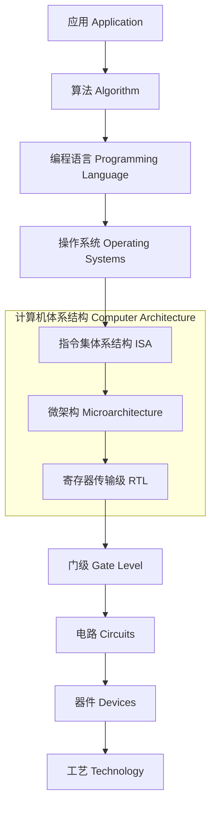
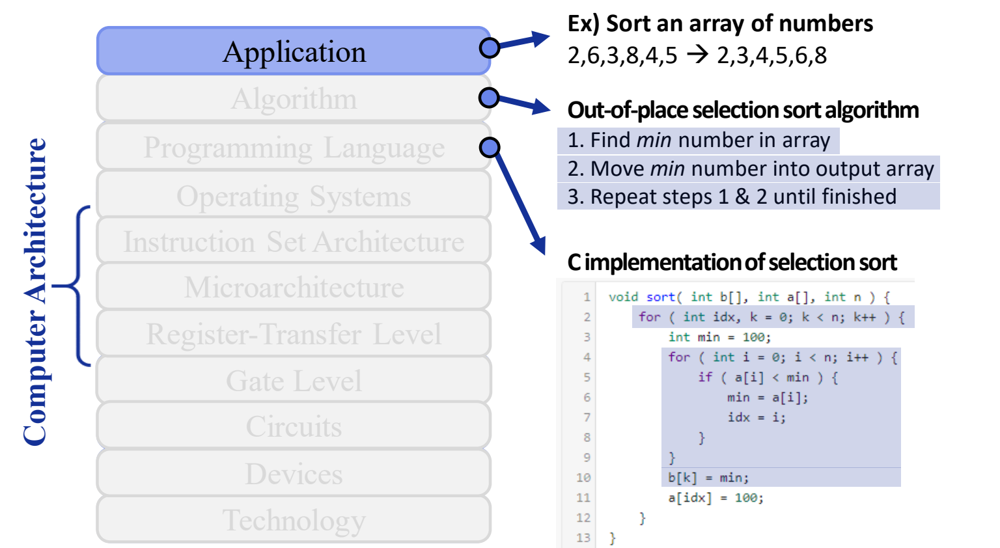

# 01 体系结构定义与系统栈

[本讲目录](../index.md) · [课程目录](../../index.md) · [下一节：02 构建模块与研究方法](02-building-blocks-and-research-method.md)

> [!abstract] 本节要点
> - 程序员依靠架构师、编译器作者和芯片工程师“让程序自动变快”的时代已经结束。想让程序高效运行，就必须理解**软硬件接口**。
> - **计算机体系结构**：应用与工艺之间差距太大，无法一步跨越。体系结构开发一系列**抽象层与实现层**，用现有的制造工艺高效执行信息处理应用。
> - 系统栈自顶向下：Application → Algorithm → Programming Language → Operating Systems → ISA → Microarchitecture → RTL → Gate Level → Circuits → Devices → Technology。体系结构覆盖其中 **ISA、微架构、RTL** 三层。
> - ISA 是计算机认识的“词典”：编译器把高级语言翻译成 ISA 中的指令，OS 负责协调硬件资源。微架构描述数据如何流过系统。最底层的 Technology 应理解为**工艺**（硅制程与材料），而不是泛指“技术”。
> - P&H（《计算机组成与设计》）讲基础概念。H&P（《计算机体系结构：量化研究方法》）的核心是**量化**分析设计权衡，并深入讲存储层次和各级并行。

## 为什么要理解软硬件接口

过去，程序员可以不关心底层硬件：工艺进步和架构改进会让同一份代码在新机器上自动跑得更快、更省电。这个前提已经不成立了。

《计算机组成与设计》（P&H）是这样说的：程序员可以不理会这些建议，指望计算机架构师、编译器作者和芯片工程师在不改程序的情况下让程序更快或更节能，但**那个时代已经结束**。至少在未来十年内，大多数程序员想让程序高效运行，就必须理解**软硬件接口**（hardware/software interface）。[^s1p23]

说得更直接一点：只会用 C 写出正确的程序已经不够。更重要的是理解底层硬件的特性，并针对这些特性写代码。[^s2b7]

两个具体例子说明理解硬件的价值：

1. **算法工程师的经验**：在大模型公司做算法工程师，所有工作都围绕硬件展开。按照对硬件的理解去开发对应的算法，效率才最高。理解硬件反而成了在竞争中脱颖而出的优势。
2. **厂商提供的两套接口**：一家手机厂商的硬件通常向开发者提供两种接口。第一种面向只会 C 的开发者，调用它的库就能写出正常运行的程序，但一般只能发挥硬件性能的约 **70%**。想跑到 **100%**，就要用第二种接口或调度库。这种库把底层硬件抽象暴露出来，前提是使用者清楚底层硬件的结构和实现。会用后者的通常是公司里最核心的一批人。[^s2b7]

> [!tip] 课堂强调
> 无论是做软件、大数据还是 AI，只要写代码，以后的工作都需要理解底层硬件特性并据此优化，才能很好地胜任。[^s2b7]

学完本课程的预期收获是：知道体系结构架构师（architect）做什么，并能开展基于**模拟**（simulation-based）的研究。业界对体系结构相关岗位有持续需求：在招聘网站检索相关职位，可得到超过 4300 条结果（Intel、ARM、AMD、Amazon 等）。[^s1p24]

## 计算机体系结构的定义（Computer Architecture）

用户手里的是**应用**（Application），最底层能拿到的是**工艺**（Technology），说到底就是一把沙子。怎样把沙子改造成能运行应用的机器？两者之间的差距大到不可能一步跨越。[^s2b8]

**计算机体系结构**（Computer Architecture）的定义是：为了弥合应用与工艺之间过大的差距，开发一系列**抽象层与实现层**（abstraction and implementation layers），从而**利用可用的制造工艺，高效地执行信息处理应用**。[^s1p25]

这个定义有三个要素：

- **分层**：差距无法一步弥合，所以拆成多层，每层只需面对相邻两层的接口。
- **约束**：只能使用“可用的”（available）制造工艺，设计受当时工艺水平的限制。
- **目标**：不仅要能执行，还要**高效**（efficiently）执行。后面性能、功耗、面积之间的量化权衡就源于这一点，见 [02 构建模块与研究方法](02-building-blocks-and-research-method.md)。

## 计算机系统栈（Computer System Stack）

把“分层”具体化，就得到从应用到工艺的**计算机系统栈**，自顶向下共 11 层：



**计算机体系结构**覆盖中间三层，即 **指令集体系结构**（Instruction Set Architecture, ISA）、**微架构**（Microarchitecture）和**寄存器传输级**（Register-Transfer Level, RTL）。[^s1p26] 体系结构处在底层工艺与上层应用的中间，承担两者之间最主要的衔接。[^s2b8]

下面用同一个排序任务，自顶向下逐层说明每层的作用。

### 应用、算法与编程语言

1. **应用**：说明“要做什么”。例：把一组数字从小到大排序，`2,6,3,8,4,5 → 2,3,4,5,6,8`。[^s1p26]
2. **算法**：说明“怎么做”，用的是人类思维层面的语言。例如 **非原地选择排序**（out-of-place selection sort）：
   1. 在数组中找出最小数 *min*；
   2. 把 *min* 移入输出数组；
   3. 重复步骤 1、2，直到完成。
3. **编程语言**：计算机听不懂用人类语言描述的算法，需要把算法写成高级语言。例：选择排序的 C 实现。[^s1p26]

```c
void sort( int b[], int a[], int n ) {
    for ( int idx, k = 0; k < n; k++ ) {
        int min = 100;
        for ( int i = 0; i < n; i++ ) {
            if ( a[i] < min ) {
                min = a[i];
                idx = i;
            }
        }
        b[k] = min;
        a[idx] = 100;
    }
}
```

代码与算法步骤一一对应。外层循环 `k` 对应“重复直到完成”，共 $n$ 轮。内层循环 `i` 对应“找最小数”，`idx` 记下它的位置。`b[k] = min` 对应“移入输出数组” `b`。`a[idx] = 100` 把已取走的元素标记为“已用”，使它在后面几轮中不再被选中。



图：计算机系统栈：从 Application 到 Technology 共 11 层，左侧括号标出体系结构覆盖 ISA、微架构与 RTL，右侧以选择排序为例说明应用与算法层。

> [!warning] 易错点
> 这段代码用 `100` 作哨兵值，表示“比所有元素都大”：`min` 的初值是 100，取走的元素也被改写为 100。所以它只在所有输入都**小于 100** 时才正确。另外，“非原地”只是说结果写进另一个数组 `b`；原数组 `a` 照样会被改写，并不是只读的。

### 操作系统与编译器：为什么高级语言还不够

即使写成了高级语言，计算机仍然不能直接执行，原因有两个：[^s2b8]

1. **计算机只识别 0/1**：人能读懂的高级语言，机器不认识。所以需要**编译器**（compiler）把编程语言翻译成机器能理解的语言。
2. **计算机里有许多硬件需要协调工作**：所以需要**操作系统**（Operating System）做资源管理，协调各个硬件一起把代码跑起来。Mac OS X、Windows 和 Linux 都属于这一层，它们负责底层硬件管理（handles low-level HW management）。[^s1p27]

### 指令集体系结构：计算机的“词典”

编译器要把代码翻译成机器语言，就必须知道底层硬件“认识哪些词”。**指令集体系结构**（ISA）就是计算机认识的这本**词典**。其中每条指令都是计算机知道含义的一个“单词”。ISA 就是机器所执行的指令集合（instructions that machine executes）。[^s1p27] 以 MIPS32 指令集为例，其中有无符号加（addu）、减、立即数加、取字（load word）、存字（store word）、取字节（load byte）等指令。

因此，编译器的工作可以这样描述：把用户写的代码翻译成计算机认识的“单词”（指令），再把这些单词组织成指令流（flow）。[^s2b8] 上一节说的“软硬件接口”，在系统栈中的具体位置就是 ISA。指令格式、寻址方式等具体内容在下一讲展开。

### 微架构与 RTL：指令如何被硬件执行

ISA 只是提供给软件的接口。每条“句子”（指令序列）真正要做的事，要靠一串电路把结果算出来，而计算归根到底都是加减乘除。

- **微架构**描述**数据如何流过系统**（how data flows through system）：数据经过哪些计算模块、沿什么路径流转，最后算出结果。这个过程就是某条指令的执行过程。[^s1p28]
- **寄存器传输级**（RTL）是一个非常高层、非常宽泛的抽象。人无法直接从半导体和硅的物理操作去理解硬件，能做的是把其中的逻辑抽象成**模块**，画出这些模块，并用它们表示每条指令该怎样完成。RTL 给出硬件设计的大致方案。[^s2b8]

CPU 内部有哪些模块、指令怎样在其中流动，见 [04 系统框图与内存墙](04-system-block-diagram-and-memory-wall.md)。

### 门级、电路、器件与工艺

再往下是更细、更接近物理的层次。各层的英文定义如下：[^s1p28]

| 层次 | 英文定义 | 含义 |
|---|---|---|
| 门级 Gate Level | Boolean logic gates and functions | 布尔逻辑门与函数 |
| 电路 Circuits | Combining devices to do useful work | 把器件组合起来完成有用的工作 |
| 器件 Devices | Transistors and wires | 晶体管与连线 |
| 工艺 Technology | Silicon process technology | 硅工艺（制程） |

逐层解释如下：[^s2b8]

1. **门级**：最基本的门电路有 AND、OR、NOT 等若干种。把门电路组合起来，就能实现上层 RTL 中的某个模块。由各种门组合成的电路叫**组合逻辑电路**（combinational logic circuit）。
2. **电路与器件**：门电路本身也是对更底层硬件的抽象，它下面是由**晶体管**组成的电路。理论上，可以买来大量分立的晶体管芯片，自己“手搓”一个 CPU，只是非常辛苦。
3. **工艺**：真正的芯片设计从设计**晶体管**本身开始。在硅中掺入各种材料做出晶体管，先确定它的宽度、高度、深度、形态和速度，再据此一层层往上搭，直到搭成 CPU。最底层是硅的**制程**，也就是硅具体怎样排布。[^s2b9]

> [!warning] 易错点
> 系统栈最底层的 **Technology 应译为“工艺”**，不能理解成泛泛的“技术”。在微电子和集成电路领域，“工艺”有特定含义，指材料和硅制程本身。[^s2b8]

> [!example] 例：识别晶体管级电路
> 系统栈示意图的电路层画着一张晶体管级电路图。它是什么？一个 AI 聊天助手回答“寄存器（锁存器）”，这是错的。
>
> 1. 这张图的连线没有画完。把电路从中间一分为二，左右两半各是一个**不完整的与非门**（NAND）。
> 2. 因此不能凭局部结构断定它是存储元件；把剩余的晶体管连好，才得到完整的门电路。
>
> 同样的晶体管，连接方式决定它实现什么功能，只看局部结构容易判断错。[^s2b8]

> [!tip] 课堂强调
> 门级以下的内容，计算机专业的同学不必深入掌握。只要大致知道每层是什么、起什么作用，以后被问到时能答上来就行。[^s2b9]

> [!note] 补充解释
> 系统栈中相邻两层是“上层看到的接口”和“下层提供的实现”的关系。例如 ISA 规定有哪些指令、每条指令做什么；微架构决定用什么数据通路执行这些指令、执行得多快。同一个 ISA 可以有多种不同的微架构实现。所以 ISA 被看作体系结构中最关键的软硬件接口。

## 两本教材：P&H 与 H&P

本课程参考两本教材，作者是同样的两个人（Patterson 与 Hennessy），只是署名顺序互换，所以分别简称 P&H 和 H&P。[^s2b1]

| | P&H | H&P |
|---|---|---|
| 书名 | *Computer Organization and Design*（计算机组成与设计） | *Computer Architecture: A Quantitative Approach*（计算机体系结构：量化研究方法，常简称“量化”） |
| 定位 | 偏基础，讲概念与思想 | 偏进阶，讲更高阶的专题 |
| 主要内容 | 计算机与体系的抽象、算术运算、处理器、存储的基本概念，以及多核处理器、集群与云 | 量化分析方法；更复杂的存储层次（memory hierarchy）；并行，包括指令级并行（ILP，与编译和架构相关）、数据级并行（DLP）、线程级并行（TLP，涉及多核） |
| 最新版本 | RISC-V 版 | 第 6 版 |

[^s2b2]

H&P 的核心关键词是**量化**（quantitative）：它教人用量化方法分析一个设计或架构，因此几乎每位体系结构架构师手头都有一本，工作多年后仍会拿出来查漏补缺。[^s2b2] 体系结构为什么必须量化、“权衡”具体指什么，见 [02 构建模块与研究方法](02-building-blocks-and-research-method.md)。

> [!tip] 课堂强调
> 本课程 P&H 和 H&P 两本书的内容都讲，所以比只讲 P&H 的课程更难。另外，所有的书、包括老师讲课都可能有错。H&P 出到第 6 版仍有不少错误，阅读时发现问题欢迎讨论。[^s2b1][^s2b2]

> [!question]- 自测：某团队在一款新加速器上只用厂商的“易用” C 库，测得性能约为峰值的 70%。要接近 100%，应改用什么？使用它的前提是什么？
> 改用厂商提供的底层接口或调度库，它把底层硬件抽象直接暴露给开发者。前提是清楚底层硬件的结构和实现，并针对其特性改写代码。这正说明“等硬件自动变快”已不可行，程序员必须理解软硬件接口。

> [!question]- 自测：下面各项分别属于系统栈的哪一层？哪些属于体系结构的范围？(a) Linux 调度 CPU 与内存资源；(b) MIPS32 的 `lw` 指令；(c) 数据在加法器与寄存器之间的流动路径；(d) 晶体管的宽度与掺杂；(e) 用模块图表示每条指令如何完成。
> (a) 操作系统；(b) ISA；(c) 微架构；(d) 工艺/器件（属于设计晶体管和硅制程的范畴）；(e) RTL。属于体系结构的是 (b)(c)(e)，也就是 ISA、微架构、RTL 三层。

> [!question]- 自测：用上面的 C 选择排序代码对 `a = {120, 5, 7}` 排序，结果是什么？
> 结果是错的。`min` 的初值是 100，`120` 永远不会小于 `min`，所以前两轮分别输出 5 和 7。第三轮时 `a` 变成 `{120, 100, 100}`，没有元素小于 100，`min` 保持 100，于是 `b = {5, 7, 100}`，120 丢失了。这段代码默认所有元素都小于 100。

> [!info]- 来源
> - L01.pdf：PDF p.23–28
> - L01.docx：DOCX body 1–85, 298–453

[^s1p23]: L01.pdf-PDF p.23
[^s2b7]: L01.docx-DOCX body 298-339
[^s1p24]: L01.pdf-PDF p.24
[^s2b8]: L01.docx-DOCX body 340-384
[^s1p25]: L01.pdf-PDF p.25
[^s1p26]: L01.pdf-PDF p.26
[^s1p27]: L01.pdf-PDF p.27
[^s1p28]: L01.pdf-PDF p.28
[^s2b9]: L01.docx-DOCX body 385-453
[^s2b1]: L01.docx-DOCX body 1-51
[^s2b2]: L01.docx-DOCX body 52-85

[本讲目录](../index.md) · [课程目录](../../index.md) · [下一节：02 构建模块与研究方法](02-building-blocks-and-research-method.md)
