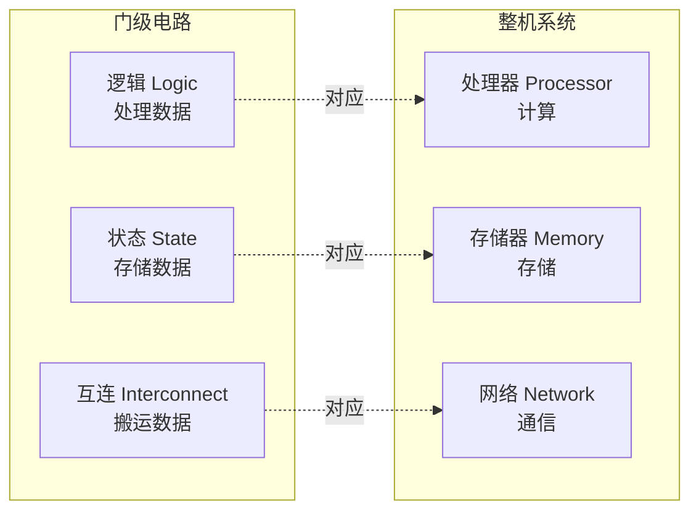
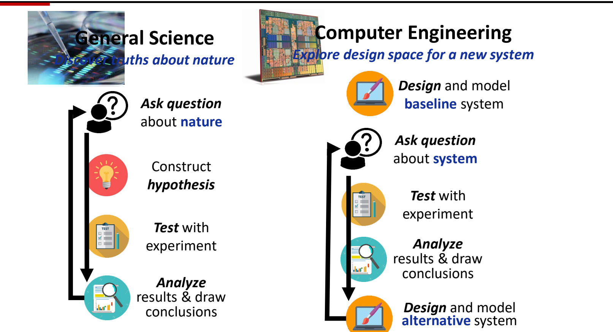
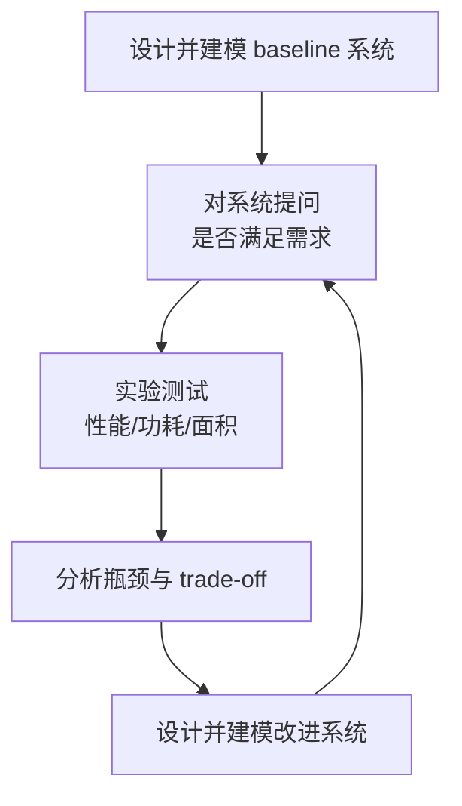

# 02 构建模块与研究方法

[本讲目录](../index.md) · [课程目录](../../index.md) · [上一节：01 体系结构定义与系统栈](01-architecture-definition-and-system-stack.md) · [下一节：03 主板结构与系统互连](03-motherboard-and-system-interconnect.md)

> [!abstract] 本节要点
> - 任何数字系统都由三类基本模块搭成：**逻辑**处理数据、**状态**存储数据、**互连**在模块之间搬运数据。
> - 到计算机工程（整机）层面，三类模块分别对应**处理器**（计算）、**存储器**（存储）、**网络**（通信）；门电路层面和整机层面是同一个结构。
> - 科学研究循环是“提问 → 假设 → 实验 → 分析”，目标是发现关于自然的真理；计算机工程循环是“设计并建模 baseline → 对系统提问 → 实验 → 分析 → 设计并建模改进系统 → 再提问”，目标是探索新系统的设计空间。
> - 体系结构是工程而不是科学：需求一变，底层系统就要跟着变，所以**不存在最优解**，只有针对某组需求的权衡。
> - 体系结构是**量化**的学科：先量化性能、功耗、面积等指标，再据此决定优化哪些部件、牺牲哪些部件。

## 逻辑、状态与互连（Logic, State, and Interconnect）

在 [[01 体系结构定义与系统栈]] 的系统栈里，从应用到工艺共有 11 层，体系结构本身就横跨 ISA、微架构、RTL 三层。层次虽多，组成数字系统的模块种类却很少。抓住这几类模块，看任何一层的设计都知道该问什么：数据在哪里算、存在哪里、怎么送过去。

数字系统由三类基本构建模块（building blocks）实现：[^s1p29]

1. **逻辑**（Logic）：处理数据，比如组合逻辑电路、运算单元。
2. **状态**（State）：存储数据，保存计算的中间结果和系统当前的状态。
3. **互连**（Interconnect）：在各个模块之间搬运数据，把分散的逻辑块和状态块连成一个系统。

示意图里，多个 Logic 块和多个 State 块交错分布，由一层 Interconnect 把它们连在一起：逻辑块和状态块各自都不能独立完成计算，必须靠互连把数据送到需要它的地方。[^s1p29]

> [!note] 补充解释
> 门级电路里，与非门这类组合门电路属于“逻辑”，触发器、锁存器、寄存器属于“状态”，导线和总线属于“互连”。一个同步电路的基本节拍就是：从状态元件读出数据 → 经互连送进逻辑 → 逻辑算出结果 → 经互连写回状态元件。

## 处理器、存储器与网络（Processors, Memories, and Networks）

三类模块不只出现在门电路这一层。到通用计算机的整体结构，同样的三分法依然成立，只是每个模块的粒度从“门”变成了“部件”。

计算机工程的三类基本构建模块：[^s1p30]

| 抽象层次 | 处理数据 | 存储数据 | 搬运数据 |
| --- | --- | --- | --- |
| 数字电路（门级/RTL） | 逻辑 Logic | 状态 State | 互连 Interconnect |
| 计算机工程（整机） | **处理器**（Processor），负责计算 | **存储器**（Memory），如内存、SSD，负责存储 | **网络**（Network），负责通信 |

在整机示意图中，数据作为输入（Input data）进入，由处理器和存储器构成的节点经网络连接，最后产生输出数据（Output data）。[^s1p30]

用这个三分法对照计算机专业的必修课：体系结构课主要讲处理器，网络课主要讲互连，对应“状态/存储”的课程往往是缺的，存储系统本身就是一个完整的方向。[^s2b9] 后面几节看真实系统时也按这三类来分：主板上的 CPU、内存插槽与 M.2 硬盘、PCIe 与芯片组连线，分别是计算、存储和互连，见 [[03 主板结构与系统互连]]；处理器和存储之间的速度差距（内存墙）见 [[04 系统框图与内存墙]]。

> [!warning] 易错点
> “互连”不只是计算机之间的网络。门级的连线、芯片内的总线、主板上 CPU 到内存的走线、PCIe 通道，以及机器之间的网络，都属于搬运数据的模块。判断时看它的作用：只负责把数据从一处送到另一处、自身不改变数据也不长期保存数据的，就是互连。

## 科学研究循环与工程研究循环

研究方法决定了这门学科的“答案”长什么样。如果按自然科学的思路去找“唯一正确的设计”，就会误解体系结构的工作方式。所以先把两种研究循环对比清楚。

**一般科学**（General Science）的目标是发现关于自然的真理（discover truths about nature）。它的循环是：[^s1p31]

1. **对自然提问**（Ask question about nature）：例如苹果为什么会落地、为什么所有物体都会下落。
2. **构造假设**（Construct hypothesis）：例如假设存在重力。
3. **用实验检验**（Test with experiment）。
4. **分析结果并得出结论**（Analyze results & draw conclusions）：验证假设是否成立；不成立就回到第 1 步，调整问题和假设，重新循环。

**计算机工程**（Computer Engineering）的目标是为新系统探索设计空间（explore design space for a new system）。它的循环是：[^s1p31]

1. **设计并建模基准系统**（Design and model baseline system）：baseline 可以是自己搭的系统，也可以是论文中已有的系统。[^s2b9]
2. **对系统提问**（Ask question about system）：这个系统是否满足实际需求？性能指标达到多少、功耗达到多少，做芯片时面积是否满足要求？
3. **用实验检验**（Test with experiment）：测出这些指标。
4. **分析结果并得出结论**：找出系统的瓶颈和其中的权衡（trade-off）。
5. **设计并建模替代系统**（Design and model alternative system）：根据权衡结果微调 baseline，或者修补它的瓶颈，然后回到第 2 步，再检查新系统是否满足需求。[^s2b10]

两种循环的区别：

| 对比维度 | 一般科学 | 计算机工程（体系结构） |
| --- | --- | --- |
| 目标 | 发现关于自然的真理 | 探索新系统的设计空间 |
| 起点 | 一个关于自然的问题 | 一个已有的 baseline 系统 |
| 提出的问题 | 自然为什么这样 | 这个系统是否满足需求 |
| 循环产物 | 被验证或推翻的假设 | 改进后的替代系统 |
| 终点 | 找到能完美回答问题的假设 | 没有终点：需求一变，系统就要重新设计 |

> [!warning] 易错点
> 工程循环的第一步不是提问，而是先有一个 baseline。没有基准，“性能是否足够”“瓶颈在哪”这些问题都无从回答；后续每次改进都和上一版系统比较。

## 量化权衡：没有最优解

从工程循环可以直接得出结论：体系结构**永远没有最优解**。科学可以找到一个完美回答问题的假设；体系结构的设计却完全由需求决定，只要需求变了，底层系统为了满足需求就一定会变。这个领域的日常工作是各种微调和各种权衡的考量。[^s2b10]

**权衡**（trade-off）指的是：把一个方面设计得更强，另一个方面往往就会变差；把那一面补好，这一面又会受损。设计者要在有限资源之间做平衡。[^s2b2] 典型的三个指标是：

- **性能**（performance）：是否希望性能更强；
- **功耗**（power）：是否希望功耗更低；
- **面积**（area）：在芯片上是否希望面积更小。

所以体系结构是一门**量化**的学科：先量化这些指标，再根据量化结果确定要达到的目标，以及哪些元件（component）需要优化。[^s2b2] 体系结构岗位通常叫**架构师**（architect），公司一般还设首席架构师。架构师的工作就是接住用户需求或公司的底层需求，在同样的芯片面积内，对手上的处理器设计“这边多做一点、那边少做一点”，达到平衡。[^s2b2]

> [!example] 例：同一面积预算下的取舍
> 设一个处理器设计在固定芯片面积内，需要在“更大的片上存储”和“更多的运算单元”之间分配面积。
>
> 1. 先建模 baseline，测出其性能、功耗、面积。
> 2. 若需求是“高性能”，分析发现瓶颈在运算能力，就把面积更多分给运算单元，代价是存储变小、功耗可能上升。
> 3. 若需求换成“低功耗”，同一个 baseline 的分析结论就会不同，面积分配也随之改变。
>
> 两种需求下得到的设计不同，各自只在自己的需求下合理，不存在一个对所有需求都最优的设计。

> [!tip] 课堂强调
> 体系结构属于计算机工程，不属于计算机科学意义上的“science”，它是一门偏工程的学科。这也是课程把较大比重放在 project 上的原因：希望通过 lab 亲身体会体系结构设计的过程。[^s2b2]

> [!question]- 自测：CPU 里的寄存器堆、ALU、片内总线分别属于逻辑、状态、互连中的哪一类？换成整机，SSD、多台服务器之间的以太网又属于哪一类？
> 寄存器堆是状态（存储数据），ALU 是逻辑（处理数据），片内总线是互连（搬运数据）。整机层面，SSD 属于存储器（对应状态），以太网属于网络（对应互连）。判断依据是模块对数据做什么：处理、保存还是搬运。

> [!question]- 自测：一款处理器在台式机需求下经过多轮“测试—分析—改进”，已经性能很好。现在要把它用到手机上，为什么不能直接说“它已经是最优设计”？工程循环应从哪一步重新开始？
> 因为体系结构没有与需求无关的最优解。手机对功耗和面积的要求不同，原设计的权衡点不再合适。可以把现有设计当作新的 baseline，从“对系统提问：是否满足新需求（功耗、面积、性能）”开始，重新测试、分析瓶颈并设计替代系统。

> [!question]- 自测：某研究先提出“所有物体之间存在引力”，再做实验验证；另一项研究先实现论文里的一个缓存设计，再测量它的命中率和功耗并修改。两者分别对应哪种研究循环？关键区别在哪？
> 前者是一般科学循环（问题 → 假设 → 实验 → 分析），目标是验证关于自然的假设；后者是计算机工程循环，从 baseline 系统出发，问的是系统是否满足需求，产物是改进后的替代系统，而不是一个被证实的真理。

> [!info]- 来源
> - L01.pdf：PDF p.29–31
> - L01.docx：DOCX body 52–85, 385–481

[^s1p29]: L01.pdf-PDF p.29
[^s1p30]: L01.pdf-PDF p.30
[^s2b9]: L01.docx-DOCX body 385-453
[^s1p31]: L01.pdf-PDF p.31
[^s2b10]: L01.docx-DOCX body 454-481
[^s2b2]: L01.docx-DOCX body 52-85

[本讲目录](../index.md) · [课程目录](../../index.md) · [上一节：01 体系结构定义与系统栈](01-architecture-definition-and-system-stack.md) · [下一节：03 主板结构与系统互连](03-motherboard-and-system-interconnect.md)
