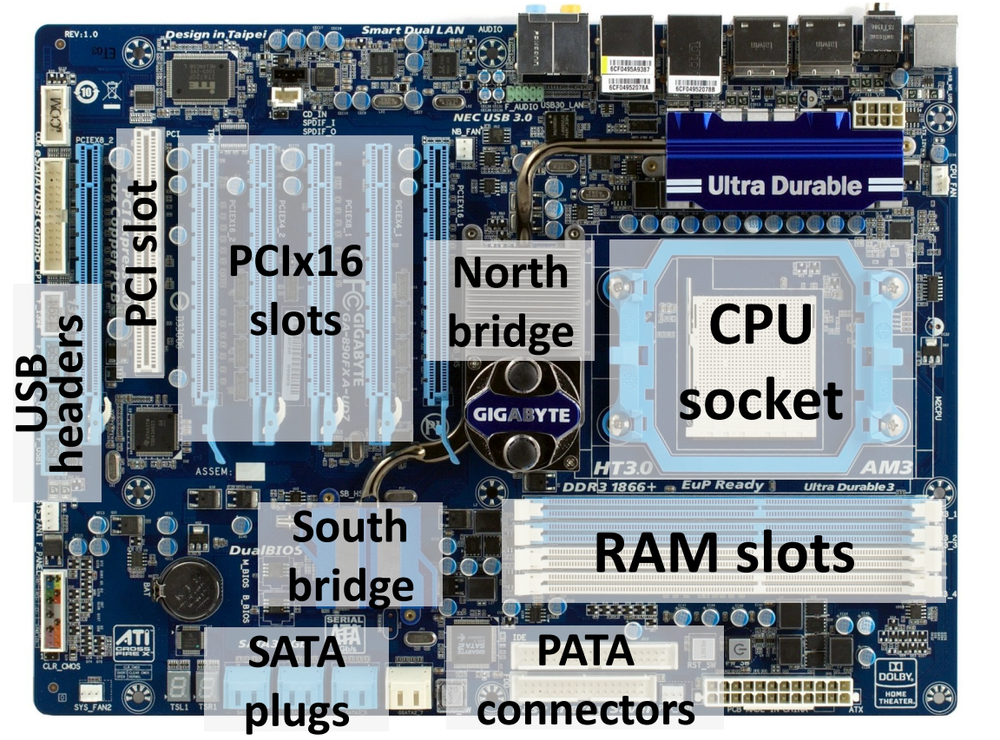
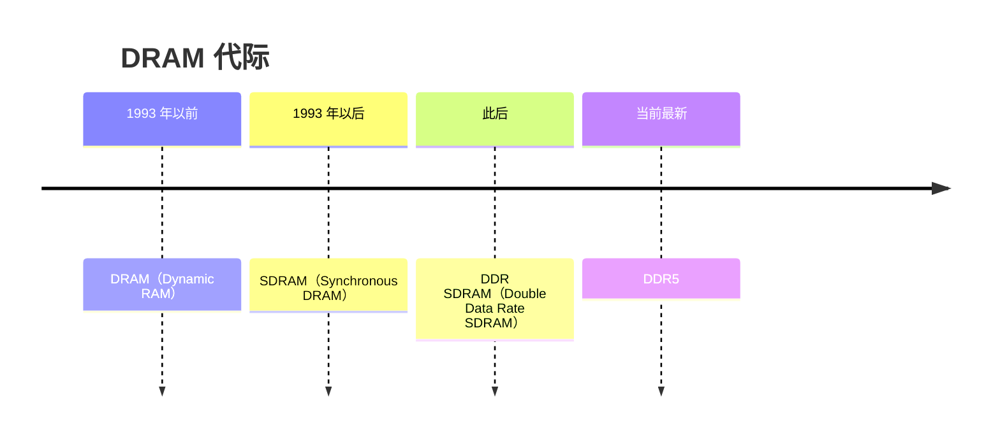
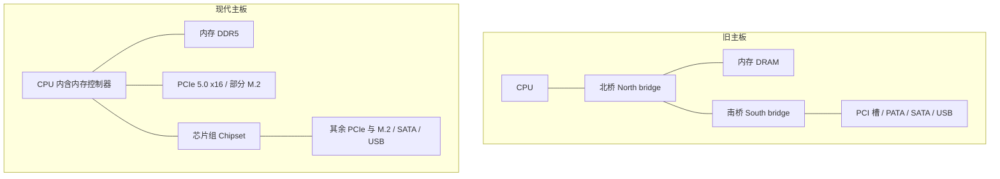

# 03 主板结构与系统互连

[本讲目录](../index.md) · [课程目录](../../index.md) · [上一节：02 构建模块与研究方法](02-building-blocks-and-research-method.md) · [下一节：04 系统框图与内存墙](04-system-block-diagram-and-memory-wall.md)

> [!abstract] 本节要点
> - 主板上的部件可归为 CPU 插座、内存插槽、扩展槽、存储接口和桥接芯片；决定软件能否运行的是指令集体系结构（ISA），而不是插座的物理规格。今天主导的 ISA 是 AMD 提出的 x86-64。
> - 北桥负责协调对主存的访问。内存频率越高，信号就要求走线越短，因此北桥（内存控制器）并入了 CPU；现代 CPU 还直连最高速的 PCIe 插槽和部分 M.2。
> - 南桥（芯片组）把多个慢速外设的数据汇总后再交给 CPU，从而节省 CPU 引脚、简化布线；代价是这些设备之间的**争用**，挂在南桥上的 PCIe 槽往往跑不满标称带宽。
> - 并行接口要求所有线上的信号同时到达，所以频率上不去；串行差分接口没有这种同步约束，可以跑很高的频率。针脚多不等于快（PATA → SATA）。
> - DRAM 仍然采用并行接口，前提是它离 CPU 极近：内存插槽紧贴 CPU 并走蛇形等长线，Apple 统一内存把 DRAM 颗粒贴在处理器旁边，HBM 则贴在 GPU 芯片周围。

## 新旧主板的部件布局

主板是把 CPU、内存、显卡、存储和外设连接在一起的骨架。比较一块约 20 年前的主板和一块现代主板，可以直接看出系统互连是怎样随性能需求演变的。

下图是一块旧式主板（AM3 插座、DDR3 内存）的标注图，从中可以认出这几类部件：[^s1p33]

- **CPU 插座（CPU socket）**：安装处理器的位置。
- **北桥（North bridge）**：位于 CPU 插座旁边，上面通常压着散热片。
- **内存插槽（RAM slots）**：紧贴 CPU 插座。
- **扩展槽**：一个 PCI 槽，以及图中标为 PCIx16 的几条长槽。
- **南桥（South bridge）**：位于主板下部，负责 I/O。
- **存储接口**：SATA 插座、PATA 插座。
- **USB 插针（USB headers）**：用来引出机箱前面板的 USB 口。

图：一块约 20 年前的主板：标出 CPU 插座、北桥、南桥、RAM 插槽、PCIx16/PCI 插槽、SATA 与 PATA 接口和 USB 插针。

现代主板（以 Intel Z790 芯片组主板为例）大致可以分为六个区域：左上角的 I/O 接口区、正上方的 CPU 区、右侧的内存区、下方的扩展区、右下角的芯片组区，以及四周的接口和针脚区。[^s2b10] 与旧主板相比，两者的主要区别如下：

| 对比项 | 约 20 年前的主板 | 现代主板 |
|---|---|---|
| 北桥 | 独立芯片，位于 CPU 与内存之间 | 不再独立，功能并入 CPU |
| 内存 | DDR3 及更早的代际 | DDR4 / DDR5（两代插槽互不兼容） |
| 扩展槽 | PCI、PCI-X 等，全部挂在南桥上 | PCIe：高速槽直连 CPU，其余经芯片组 |
| 固态存储接口 | 没有 M.2 | 有 M.2，走 PCIe 通道 |
| 硬盘接口 | PATA 与 SATA 并存 | 只剩 SATA（以及 M.2） |
| CPU 插座 | 插座上是孔，针脚在 CPU 上 | 插座上是针脚（LGA），CPU 上是触点 |
| 键鼠接口 | 有圆形的 PS/2 口 | 改用 USB |

下面各小节解释这些变化背后的原因。数字系统由逻辑、状态和互连三类模块构成，这一视角见 [02 构建模块与研究方法](02-building-blocks-and-research-method.md)；把主板抽象成系统框图并由此引出内存墙，见 [04 系统框图与内存墙](04-system-block-diagram-and-memory-wall.md)。

## CPU 插座与 x86 指令集

CPU 插座的物理标准有很多种，不同品牌、不同代的 CPU 所用的插座也不相同。例如 Intel LGA1700 插座有 1700 根针脚，支持第 12、13、14 代酷睿处理器，因此选购主板前必须确认插座与 CPU 兼容。[^s2b10]

不过，**物理标准远不如指令集体系结构（ISA）重要**：插座决定的只是 CPU 能不能装上去，ISA 决定的是软件能不能在这颗 CPU 上运行。ISA 作为软硬件接口的含义见 [01 体系结构定义与系统栈](01-architecture-definition-and-system-stack.md)。[^s1p34]

- IBM PC 兼容机都兼容 Intel 80386。幻灯片上写作“80836”，系笔误。[^s1p34]
- **x86** 是最初由 Intel 设计的指令集，生产 x86 处理器的厂商有 Intel、AMD、VIA 等。约 20 年前，市面上的处理器还有 IBM、TI 等多家的其他架构；今天个人电脑上几乎只剩 x86 及其 64 位扩展。[^s2b12]
- 今天占主导地位的 ISA 是 **x86-64**，它由 **AMD** 而不是 Intel 提出。[^s1p34]

### 针脚为什么从 CPU 移到了插座上

旧主板的插座是“母口”，上面全是孔，针脚长在 CPU 上（PGA 方式）。现代 Intel 主板正好相反：插座上布满针脚，CPU 底面只有平的触点，这就是 LGA（Land Grid Array）。改变的理由是一个简单的成本推理：

1. 针脚容易弯折损坏，孔或触点则不容易损坏。
2. CPU 比主板上的插座贵得多。
3. 所以应当让更贵的 CPU 承担不易坏的那一面，把易坏的针脚放到插座上。[^s2b12]

> [!warning] 易错点
> 主板之间的兼容性要分两层判断。插座匹配，CPU 才装得上；指令集相同，程序才跑得起来。在 AMD 的 x86-64 处理器和 Intel 的 x86-64 处理器上，同一个程序都能运行，尽管它们的插座完全不同。

## 北桥与主存

**北桥**（North bridge）是负责**协调对主存访问**的芯片。[^s1p35] 约 20 年前，北桥的任务只有与内存通信这一项。

### DRAM 的代际

内存插槽里插的是 DRAM，它经历了以下几代：[^s1p35]

DDR 系列各代之间的差异主要有三点：

1. **频率**：这是最主要的差别，各代相差很多。
2. **针脚数**：金手指的数量不同。
3. **防呆缺口的位置**：内存条金手指中间有一个隔断，例如 DDR4 与 DDR5 的隔断位置不同，所以两代内存插槽互不兼容，插不进去。[^s2b12]

### 为什么北桥并入了 CPU

早期把北桥做成一块独立芯片，是为了**方便设计**：CPU 每次迭代时，不必连同北桥一起重新设计。后来北桥不得不并入 CPU，推理链条如下：

1. 内存性能要提升，就要求内存频率提升。
2. 信号频率越高，传得越远受到的干扰越强。所以要么降低频率，要么缩短距离。
3. 有独立北桥时，CPU 访问内存的路径是“内存 → 北桥 → CPU”，走的是一条折线；把北桥移进 CPU 后，内存可以沿直线直接连到 CPU 内的内存控制器，距离更短。
4. 因此，要让内存跑到更高的频率，北桥就必须并入 CPU。[^s2b11]

视频里描述的现代主板正是这样布局的：内存插槽设计在 CPU 旁边，以尽量缩短线路。CPU 与内存之间的走线不是直线，而是像蛇一样弯弯曲曲，目的是让每条线等长，保证所有信号同时到达（原因见下文“并行与串行传输”）。[^s2b10]

内存最终能跑到多高的频率，还取决于固件调校、CPU 内存控制器的体质和内存颗粒的品质。厂商给出的是排除其他瓶颈后主板本身的保底值，例如某 Z790 主板标称 7800 MHz，高于当时市售主流的 6800 MHz；这个数是保底值，不代表最高只能跑到 7800 MHz。[^s2b10]

### 现代“北桥”还直连高速 PCIe

除了内存，现代 CPU（也就是并入后的北桥）还负责与**部分 PCIe 设备**直接通信：[^s2b12]

- **PCIe**（PCI Express）通道相当于电脑里的高速公路，版本越新、通道（lane）越多，速度就越快。
- **M.2** 是安装固态硬盘的长方形接口，走的也是 PCIe 通道。PCIe 插槽主要用来装显卡，也可以装 PCIe 固态硬盘、声卡、万兆网卡、采集卡等，还能通过转接卡变成 M.2 接口。
- 以一块 Z790 主板为例：第一个 M.2 接口有 4 条 PCIe 4.0 通道，每秒可传输 8 GB；第一个 PCIe 插槽有 16 条 PCIe 5.0 通道，每秒可传输 64 GB，是前者的 8 倍。这两个接口都直接连到 CPU，速度最快、延迟最低。[^s2b10]

20 年前不需要这样做，因为当时 PCIe 和 SATA、USB 这类外设都很慢，不必直连 CPU。如今 PCIe 快到必须直连 CPU，才能把带宽跑满。[^s2b12]

> [!warning] 易错点
> 不是所有 M.2 都直连 CPU。主板介绍视频说第一个 M.2（PCIe 4.0 x4）与 PCIe 5.0 x16 插槽一样直连 CPU；课堂讲解则说该 M.2 连在南桥上。[^s2b12] 实际的 Z790 平台上，CPU 提供 x16 插槽和一个 x4 M.2 的通道，其余 M.2 挂在芯片组上，所以视频对“第一个 M.2”的说法更准确。判断某个 M.2 是否直连 CPU，要查主板说明书的通道分配图。

> [!info] 可视化资源
> [Wikipedia：Northbridge (computing)](https://en.wikipedia.org/wiki/Northbridge_%28computing%29)：条目中有 2007 年与 2015 年两种芯片组布局示意图，可对照北桥独立存在与北桥并入 CPU 后的连接关系。

## 南桥（芯片组）与争用

**南桥**（South bridge）负责设备、CPU 与主存之间的 I/O。[^s1p36] 它的任务这些年基本没变，至今仍以**芯片组**（chipset）的形式存在，例如 Intel 的 Z790、B760。由于主板最主要的职责就是提供各种接口，主板通常直接以芯片组命名。芯片组决定了主板扩展能力的上限，但厂商不一定把这些能力全部用上。

### 为什么需要南桥

为什么不让每个外设都直连 CPU？原因有两个：

1. **外设太慢**：让每个慢速设备独占一条通向 CPU 的连接，是在浪费资源。
2. **CPU 引脚和布线不够**：CPU 的针脚数量有限，不可能给每个设备都分配一组；何况插槽周围的布线也会变得异常复杂。[^s2b12]

解决办法是设一个**代理**（中介）：南桥先把多个慢速设备的数据汇总起来，再集中发给 CPU，由 CPU 统一处理。南桥本质上就是一个扩展坞，通过它可以扩展出更多的接口和插槽。[^s2b10] 南桥挂着以下几类设备：

- **I/O 设备插槽**：挂在南桥总线上。较早的标准是 PCI 槽，或 AGP / PCI-X 槽；PCI-X 比 PCI 更好，PCIe 则是更新的标准，它们的底层驱动大体相同。[^s1p36]
- **板载 I/O**（Built-in I/O）：USB、音频，以及老主板上专门接键盘鼠标的圆形 PS/2 口。
- **存储接口**：见下一小节。

在 PCI 类设备的连接方式上，新旧主板有区别：20 年前所有 PCI 设备都连在南桥上；现在一部分连 CPU（也就是原来北桥的位置），一部分连南桥。

### 汇聚的代价：争用

南桥把多个设备的流量汇聚成一路再交给 CPU，于是这些设备要**竞争**同一条上行通路。如果南桥上的设备全部插满、同时工作，每个设备实际跑出来的速度会比预期慢得多。[^s2b12]

> [!example] 例：GPU 插错了槽
> 有人做 GPU 测试时，把 GPU 插在了一个连到南桥的 PCIe 插槽上，结果无论怎样都跑不到预期的 PCIe 带宽。
>
> 1. 这个插槽的流量要先经过南桥，再走南桥与 CPU 之间的共享链路。
> 2. 这条链路被南桥上的所有设备共同分享；挂的设备越多，GPU 分到的带宽就越少。
> 3. 所以在服务器上装 GPU 之前，应先查清主板上哪些插槽直连 CPU、哪些连南桥。直连 CPU 的插槽没有问题；连南桥的插槽，则要看有多少设备在和它竞争。

> [!tip] 课堂强调
> 进实验室使用服务器时，插 GPU 前一定要先看清插槽是直连 CPU 还是连南桥的。

## 存储接口：并行与串行

存储接口由南桥控制。[^s1p37] 幻灯片列出的标准有：

- **并行 ATA**（Parallel ATA，PATA）：较老的标准，配套 **ATAPI**（AT Attachment Packet Interface），由 **IDE**（Integrated Drive Electronics）标准演变而来。IDE 也常用来指这一套通信协议。
- **串行 ATA**（Serial ATA，SATA）：PATA 的后继者，在现代主板上仍然常见，用来接机械硬盘和 2.5 英寸固态硬盘。
- **SCSI**（Small Computer System Interface）：企业级存储接口，普通台式机上一般看不到。[^s1p37]

### 为什么针脚少的 SATA 反而比针脚多的 PATA 快

PATA 的排线和插座又宽又长，针脚很多；SATA 的数据接口很小，只有两对差分线，一对负责发送，一对负责接收，外加接地线。按直觉，针脚越多，同一时刻能传的数据就越多，那么为什么 SATA 反而是 PATA 的升级版，而且快得多？

1. **并行传输**的一个数据字分布在多根线上，只有所有线上的位**同时到达**，接收端拿到的数据才完整。
2. 各条线的长度和受到的干扰不可能完全一致，频率越高，到达时间的偏差（skew）占一个时钟周期的比例就越大，数据也就越容易出错。
3. 所以针脚一多，就只能把频率调得很低，以保证所有位在同一个周期内到齐。PATA 的实际工作频率因此很低。
4. **串行传输**只有一组发送线和一组接收线，不存在多线同步的问题，频率可以提得很高，最终带宽远高于 PATA。[^s2b13]

结论是：很多设备并不是针脚越多越好，反而常常是越少越好。

> [!warning] 易错点
> 课堂口述称 SATA 带宽是 PATA 的“50–100 倍”，这是夸张说法。按规范，PATA 最高的 ATA/133 约 133 MB/s，SATA 3.0 约 600 MB/s，差距约 4.5 倍。[^s2b13] 另外，讲解中“PATA 实际频率非常高”一句是口误，按推理应为 PATA 频率**很低**。

> [!note] 补充解释
> SATA 3.0 的线速率为 6 Gb/s，扣除 8b/10b 编码开销后约为 600 MB/s。SATA 每个方向只用一对差分线，每对线以两根导线上的电压差表示一位，抗干扰能力强，这也是它能工作在 GHz 级频率的原因之一。

### DRAM 为什么还能用并行接口

DRAM 有一百多根数据和地址针脚，同样面临信号完整性问题。它之所以仍能做到“高速 + 并行”，**核心原因是 DRAM 离 CPU 非常近**；一旦距离拉远，同样的问题就会出现。[^s2b13] 工程上缩短距离的做法有：

- 主板上的内存插槽紧贴 CPU 插座，并采用蛇形等长走线（见上文“北桥与主存”）。
- **Apple 统一内存**：Apple 电脑的 DRAM 不是插在旁边的内存插槽里，而是把 DRAM 芯片直接贴在处理器芯片旁边，这样信号更好，频率也能更高。
- **HBM**（High Bandwidth Memory）：在 GPU 芯片周围贴一圈 HBM 堆叠，连线不走主板上的普通走线。[^s2b13]

DRAM 内部如何在高速下保持并行传输，留待讲存储器时展开。

> [!note] 补充解释
> HBM 与 GPU 通常封装在同一块硅中介层（interposer）上，通过中介层里极短、极密的连线互连，因此可以用上千位宽的并行总线。

### SCSI 与 UFS

SCSI 虽然是企业级接口，但大多数人每天都在间接使用它：安卓手机的闪存普遍采用 **UFS**（Universal Flash Storage）接口，三星、小米、OPPO、vivo 等品牌都是如此。UFS 是在 SCSI 协议层面上加了一层封装改良而来的。[^s2b13] 存储协议栈中的另一个名字 AHCI 不在本讲范围内，留待讲存储时再介绍。

> [!question]- 自测：一块主板的 M.2_1 接口有 4 条 PCIe 4.0 通道，PCIe_1 插槽有 16 条 PCIe 5.0 通道。已知前者带宽为 8 GB/s，后者是多少？为什么 PCIe 5.0 每条通道的带宽是 PCIe 4.0 的两倍，而总带宽却是 8 倍？
> PCIe_1 的带宽为 64 GB/s。PCIe 4.0 每条通道为 $8/4=2$ GB/s；PCIe 5.0 每条通道约为 $64/16=4$ GB/s，是前者的 2 倍。通道数又是前者的 $16/4=4$ 倍，所以总带宽是 $2\times4=8$ 倍。

> [!question]- 自测：某同学在服务器上同时插了 GPU、两块 NVMe 盘和一块万兆网卡，全部插在芯片组提供的插槽上。单独测试每个设备时都正常，同时运行时 GPU 的数据传输明显变慢。最可能的原因是什么？应该怎么调整？
> 原因是南桥/芯片组上的争用。这些设备共享芯片组到 CPU 的同一条上行链路，同时工作时会互相抢带宽。应把 GPU 换到直连 CPU 的 PCIe 插槽（通常是第一条 x16 插槽），并减少同时挂在芯片组上的高带宽设备。

> [!question]- 自测：有人提议，“把 PATA 的线数再翻一倍，同一时刻传的位翻倍，带宽就能超过 SATA”。这个推理错在哪里？
> 这个推理默认频率不变。并行线越多，越难保证所有位同时到达，只能进一步降低频率，所以带宽未必增加。SATA 用一对差分线串行传输，没有多线同步的约束，可以把频率提得很高，因此反而更快。DRAM 能用宽并行总线，是因为它离 CPU 极近。

> [!info]- 来源
> - L01.pdf：PDF p.33–37
> - L01.docx：DOCX body 454–624

[^s1p33]: L01.pdf-PDF p.33
[^s2b10]: L01.docx-DOCX body 454-481
[^s1p34]: L01.pdf-PDF p.34
[^s2b12]: L01.docx-DOCX body 513-569
[^s1p35]: L01.pdf-PDF p.35
[^s2b11]: L01.docx-DOCX body 482-512
[^s1p36]: L01.pdf-PDF p.36
[^s1p37]: L01.pdf-PDF p.37
[^s2b13]: L01.docx-DOCX body 570-624

[本讲目录](../index.md) · [课程目录](../../index.md) · [上一节：02 构建模块与研究方法](02-building-blocks-and-research-method.md) · [下一节：04 系统框图与内存墙](04-system-block-diagram-and-memory-wall.md)
