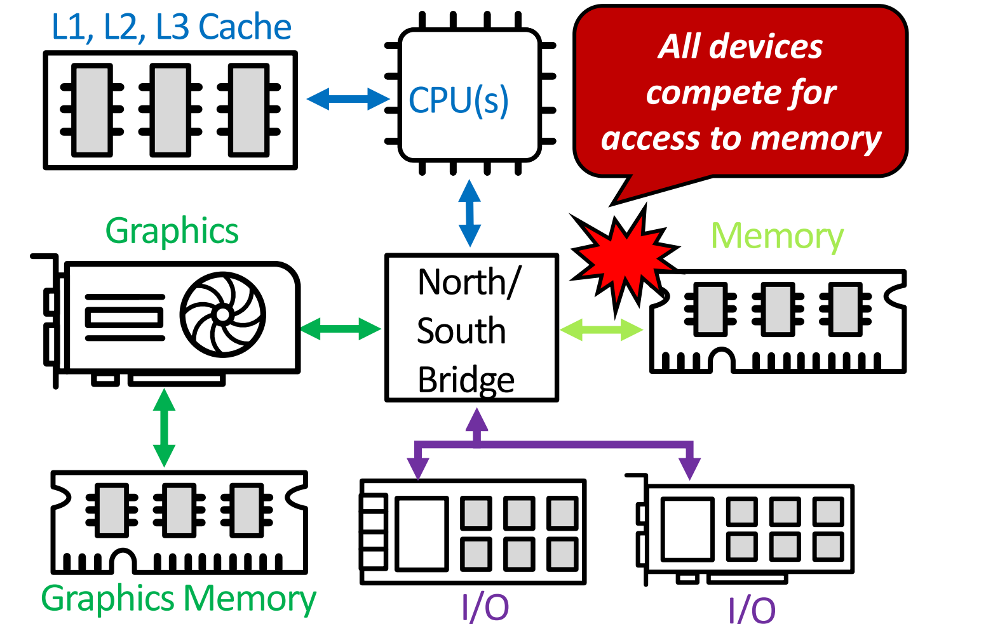
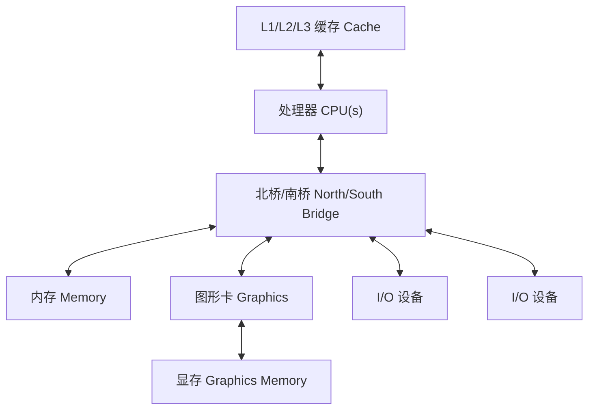
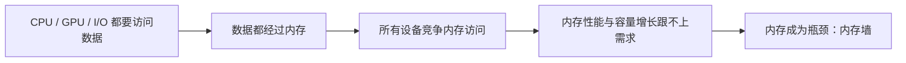

# 04 系统框图与内存墙

[本讲目录](../index.md) · [课程目录](../../index.md) · [上一节：03 主板结构与系统互连](03-motherboard-and-system-interconnect.md) · [下一节：05 技术趋势与功耗墙](05-technology-trends-and-power-wall.md)

> [!abstract] 本节要点
> - 系统框图把主板抽象为：CPU（自带 L1/L2/L3 Cache）—北/南桥—内存、图形卡（自带显存）和若干 I/O 设备；北桥直连内存与 GPU，南桥连接外围 I/O。
> - CPU、GPU 和外围 I/O 要访问数据都必须经过内存，所有设备竞争内存访问，内存因此成为整个系统的瓶颈。
> - **内存墙**有两层含义：内存的性能增长满足不了其他设备的需求；内存的容量同样跟不上需求。
> - CPU 内部由系统总线接口、Cache、取指、译码、控制单元、ALU/FPU 和寄存器组成。
> - 指令流：内存 →（系统总线）→ Cache → 取指 → 译码 → 控制单元驱动 ALU/FPU → 读写寄存器；load/store 指令经 L1–L3 Cache 在寄存器与内存之间搬运数据。

## 系统框图（System Block Diagram）

真实主板上有插座、插槽、芯片组和大量走线（各部件及其接口见 [[03 主板结构与系统互连]]）。要分析"整个系统的性能卡在哪里"，需要先去掉物理细节，只保留部件以及它们之间的连接关系，这就是系统框图。

**系统框图**（system block diagram）是把计算机中的主要部件画成方框、把它们之间的数据通路画成连线的抽象表示。[^s1p38] 本讲的框图包含以下部件：

1. **CPU(s)**：一个或多个处理器，旁边连着它自己的 L1、L2、L3 三级 Cache。
2. **北桥/南桥**（North/South Bridge）：CPU 与其他部件之间的中转站。北桥直接连接 GPU 和内存（memory）；南桥负责连接外围 I/O，包括存储设备、网卡、鼠标键盘等。[^s2b13]
3. **内存**（Memory）：系统的主存，经桥与 CPU 相连。
4. **图形卡**（Graphics）：连接到桥上，并连着自己专用的**显存**（Graphics Memory / video memory）。
5. **I/O 设备**：图中画了两块 I/O 卡，经同一组连线挂在南桥上。

图中在内存旁边标出了一个"冲突"记号，并写着 **All devices compete for access to memory**（所有设备竞争访问内存）。[^s1p38]

把框图的连接关系整理成图：

> [!warning] 易错点
> 显存是图形卡自己的存储，挂在图形卡上而不是桥上；它不能替代主存。框图里 CPU、GPU、I/O 的数据最终都要和**主存**（Memory）交换，所以"竞争"发生在主存这一处，而不是在显存或各级 Cache 上。

## 内存墙（Memory Wall）

处理器性能长期以指数速度增长（见 [[05 技术趋势与功耗墙]]）。但计算得再快，数据也要先送到计算单元才能用。如果供数据的那一环跟不上，整个系统的速度就由这一环决定。

**为什么内存是瓶颈**：从系统框图可以直接看出，无论是 CPU、GPU 还是外围 I/O 设备，访问数据都要经过内存。内存是所有设备必经的一条路，所有设备都在争用它，因此它成为整个系统的瓶颈。[^s2b13]

**内存墙**（memory wall）指内存成为系统瓶颈的现象：内存的发展满足不了其他设备对它的需求。它包含两层含义：[^s2b13]

1. **性能**：内存的性能（速度）增长跟不上计算部件对数据的需求。
2. **容量**：内存的容量同样跟不上需求。（这一层含义在讲解录音中识别不清，按“两层含义”的表述推断为容量也不足。）

可以按下面的链条理解内存墙为什么形成：

CPU 与 DRAM 各自的具体增长速率在 [[05 技术趋势与功耗墙]] 中给出：处理器性能呈指数增长，DRAM 速度增长慢得多。两者之间的差距不断扩大，内存墙就越来越明显。

> [!note] 补充解释
> 框图中 CPU 旁的 L1/L2/L3 Cache 就是缓解内存墙的常见手段：把常用数据放在离处理器更近、速度更快的小容量存储里，减少直接访问主存的次数。Cache 并不能消除主存这条"必经之路"，只是让大多数访问不必真正走到主存。

> [!warning] 易错点
> 内存墙不只是"内存慢"。按本讲的定义，它同时包括**性能**和**容量**两方面跟不上需求；而且它是一个**系统层面**的问题：之所以严重，是因为 CPU、GPU 和 I/O 设备**全部**要经过内存。

## CPU 内部结构

系统框图里的 CPU 只是一个方框。把这个方框放大，就得到 CPU 的基本架构，也是后续几讲的主要内容。

CPU 通过**系统总线**（System Bus）与**主存**（Main Memory）相连：数据和指令经系统总线进入 CPU，结果也经系统总线写回。[^s1p39] CPU 内部包含以下模块：[^s1p39]

- **Cache**：L1（以及 L2、L3）缓存，位于系统总线与 CPU 内部其他模块之间。
- **取指**（Instruction Fetch）：从 Cache 中取出下一条指令。
- **译码**（Decode）：解析指令，确定要做什么操作、用哪些操作数。
- **控制单元**（Control Unit）：根据译码结果，指挥运算部件如何操作。
- **算术逻辑单元**（Arithmetic and Logic Unit, ALU）：执行整数算术与逻辑运算；图中画了两个 ALU。
- **浮点单元**（Floating Point Unit, FPU）：执行浮点运算。
- **寄存器**（CPU Registers）：CPU 内部存放操作数和运算结果的存储单元，ALU/FPU 直接从这里读取和写入数据。

## 指令在 CPU 内的流动

知道 CPU 有哪些模块之后，还要知道一条指令依次经过哪些模块、数据在哪些地方读写，才能理解每个模块的作用。

一条指令的完整流程如下：[^s2b13]

1. **加载到 Cache**：指令从主存经系统总线加载到 CPU 的 Cache 中。
2. **取指**：取指模块从 Cache 中取出这条指令。
3. **译码**：译码模块解析指令。
4. **控制**：译码结果告诉控制单元应当如何操作 ALU 和 FPU。
5. **执行与寄存器读写**：ALU/FPU 按指令的要求从寄存器中读出对应的数据，运算后再把结果写回寄存器。
6. **访存（load/store 指令）**：对于 load/store 这类特殊指令，数据需要在寄存器与内存之间搬运：load 从内存读数据到寄存器，store 把寄存器中的数据写回内存。这种搬运不是直接与主存进行的，而是要经过 L1、L2、L3 Cache，最后才到达主存。

> [!tip] 课堂强调
> 这一流程在计算机系统导论（ICS）课程中已经学过；CPU 的基本架构是本课程后面几讲的主要内容。

> [!warning] 易错点
> ALU/FPU 的操作数来自**寄存器**，而不是直接来自内存。只有 load/store 指令负责在寄存器与内存之间搬运数据，而且这种搬运要经过各级 Cache，不会绕过 Cache 直接读写主存。

> [!example] 例：一条 load 指令经过了哪些部件
> 设程序执行一条 load 指令，把主存中某个数据读到寄存器。
>
> 1. 这条指令本身先从主存经系统总线进入 Cache，再经取指、译码送到控制单元。
> 2. 控制单元识别出它是 load，于是发起访存：要读的数据从主存经系统总线进入 L3、L2、L1 Cache。
> 3. 数据最后写入目标寄存器，后续的 ALU/FPU 指令才能从寄存器中读取它。
>
> 可见一条 load 至少两次用到"主存 → 系统总线 → Cache"这条路：一次取指令，一次取数据。这也说明了内存为什么会成为瓶颈。

> [!question]- 自测：在系统框图中，GPU 运行时读写的数据是否只在显存里，从而不受内存墙影响？
> 不是。显存只是图形卡自己的存储；按本讲的分析，CPU、GPU 和外围 I/O 设备获取数据都要经过（主）内存，GPU 也要与其他设备竞争内存访问，所以同样受内存墙制约。

> [!question]- 自测：一条 ALU 加法指令 `add` 和一条 `store` 指令，哪一条在执行阶段会访问内存？数据走的路径是什么？
> `store` 会访问内存。`add` 的操作数从寄存器读出、结果写回寄存器，不访问内存（取指令本身除外）；`store` 把寄存器中的数据经 L1→L2→L3 Cache 写到主存，而不是直接写入主存。

> [!question]- 自测：假设某计算机的 CPU 速度提高了 10 倍，而内存的速度和容量都不变，整个系统的性能会提高 10 倍吗？为什么？
> 一般不会。所有设备的数据都要经过内存，CPU 变快后仍要等内存提供数据；内存的性能和容量跟不上，系统性能就受内存墙限制，CPU 的提升无法完全转化为系统的提升。

> [!info]- 来源
> - L01.pdf：PDF p.38–39
> - L01.docx：DOCX body 570–624

[^s1p38]: L01.pdf-PDF p.38
[^s2b13]: L01.docx-DOCX body 570-624
[^s1p39]: L01.pdf-PDF p.39

[本讲目录](../index.md) · [课程目录](../../index.md) · [上一节：03 主板结构与系统互连](03-motherboard-and-system-interconnect.md) · [下一节：05 技术趋势与功耗墙](05-technology-trends-and-power-wall.md)
