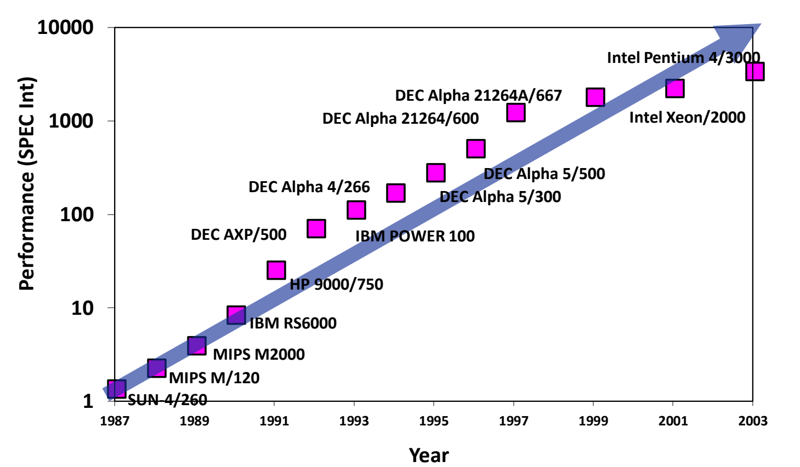
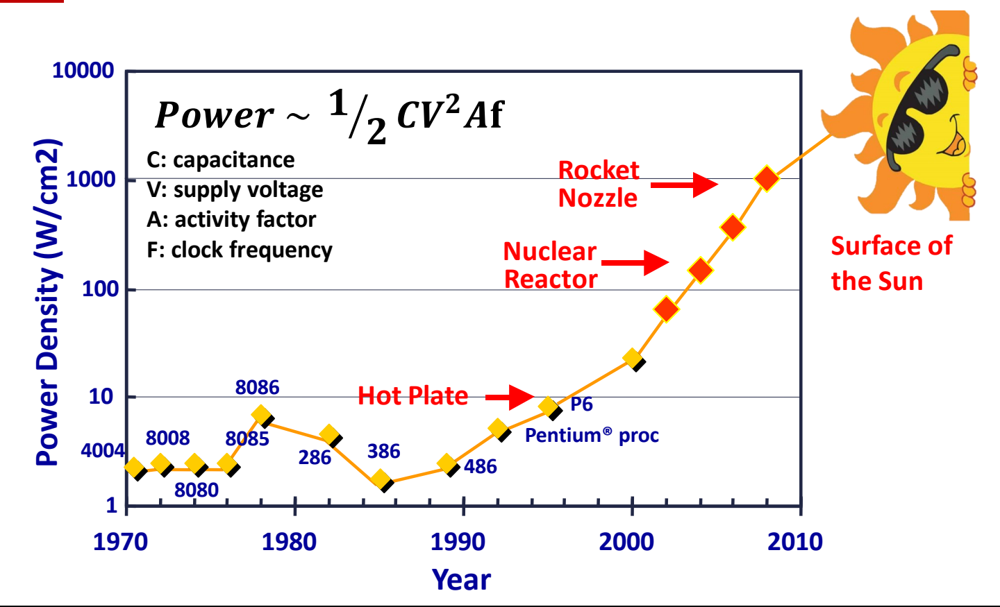

# 05 技术趋势与功耗墙

[本讲目录](../index.md) · [课程目录](../../index.md) · [上一节：04 系统框图与内存墙](04-system-block-diagram-and-memory-wall.md) · [下一节：06 多核能效与可靠性挑战](06-multicore-energy-and-reliability.md)

> [!abstract] 本节要点
> - SPECint 性能图的纵轴是对数坐标：1987–2003 年的散点近似一条直线，说明处理器性能按**指数**增长；早期约每年 +30%，近年降到每年约 10%–15%。
> - 各部件发展速度差别很大：CPU 晶体管数每 1.5 年翻倍；DRAM 容量每 2 年翻倍，但速度每 10 年只提高到 1.5 倍；磁盘容量每年 +60%。CPU 和 DRAM 的速度差距因此越拉越大。
> - 动态功耗 $P \approx \tfrac12 C V^2 A f$。频率大致随电压线性升高，所以 $P \propto V^2 f \propto f^3$：靠提频换来线性的性能，功耗却按三次方增长。
> - 功率密度曲线从“热板”一路逼近“核反应堆、火箭喷口、太阳表面”；Itanium-2 热图上执行核约 120 °C。Intel 在 Pentium/P6 之后不再单纯提频，性能提升只能转向体系结构方案。

## 处理器性能趋势（Processor Performance Trend）

要判断“继续把单个 CPU 做快”这条路还能走多远，先要看清过去性能是怎样增长的、增长速度有没有变。

这张图的横轴是年份（1987–2003），纵轴是 **SPECint** 整数基准测试分数。图中依次标出 SUN-4/260、MIPS M/120、MIPS M2000、IBM RS6000、HP 9000/750、DEC AXP/500、IBM POWER 100、DEC Alpha 系列（4/266、5/300、5/500、21264/600、21264A/667），以及 Intel Xeon/2000 和 Intel Pentium 4/3000。[^s1p40]

读这张图的关键在纵轴：刻度是 1、10、100、1000、10000，每格相差 10 倍，是**对数坐标**。在对数坐标上，一条直线代表每年按固定**倍数**增长，也就是指数增长，而不是每年增加固定的量。图中散点从约 1 升到 3000 以上，16 年里跨了三个多数量级，基本贴着一条直线。[^s2b13]

图：1987–2003 年处理器 SPECint 性能（对数纵轴）：近似直线说明性能按指数增长。

增长率本身也在变：早期 CPU 性能约每年 +30%，近几年约每年 10%–15%。增速虽然变慢，仍然在逐年提升。[^s2b13]

> [!warning] 易错点
> 在对数纵轴上看到“一条直线”，结论是指数增长，不是线性增长。反过来，如果在线性坐标上画指数增长，前期几乎贴着横轴，后期陡然上翘，看上去像突变。

## 技术发展速率（Rates of Technology Change）

计算机系统由 CPU、内存、外存等部件组成，各部件的工艺进步速度并不一致。速度慢的部件会成为整个系统的瓶颈，所以需要分别看各部件的增长率。下表列出各部件的增长率：[^s1p41]

| 部件 | 指标 | 增长速度 |
| --- | --- | --- |
| CPU | 性能（Performance） | 每年 +30%（近年约 10%–15%） |
| CPU | 容量（Capacity，即晶体管数量） | 每 1.5 年翻倍 |
| DRAM | 容量（Capacity） | 每 2 年翻倍 |
| DRAM | 速度（Speed） | 每 10 年变为 1.5 倍（即十年 +50%） |
| DRAM | 每比特成本（Cost per bit） | 每年下降 25% |
| 磁盘 / 存储 | 容量（Capacity） | 每年 +60%；性能提升很少 |

从表中可以读出三点：

1. **CPU 与 DRAM 的速度差距持续扩大**：CPU 性能按指数增长，DRAM 速度却要十年才提高 50%，增长太慢。这正是内存墙的来源，见 [04 系统框图与内存墙](04-system-block-diagram-and-memory-wall.md)。
2. **DRAM 擅长变大、变便宜，不擅长变快**：容量每 2 年翻倍，每比特成本每年降 25%。近几年内存价格受市场周期影响，并没有严格按这个趋势下降。[^s2b13]
3. **存储容量增长最快**：存储性能提升很少，容量却每年约 +60%。目前企业级 SSD 单盘已达约 250 TB（如华为），而盘体只有拇指大小。[^s2b14]

> [!example] 例：十年后 CPU 与 DRAM 的速度差多少倍
> 假设 CPU 性能保持每年 +30%，DRAM 速度保持“每 10 年 1.5 倍”，起点时两者速度相同。
>
> 1. CPU 十年后的性能倍数：$1.3^{10} \approx 13.8$。
> 2. DRAM 十年后的速度倍数：$1.5$。
> 3. 两者之比：$13.8 / 1.5 \approx 9.2$，即十年后 CPU 相对 DRAM 快了约 9 倍。差距按指数累积，每过十年再乘一次，所以只靠 DRAM 工艺追不上 CPU。

> [!example] 例：晶体管数与 DRAM 每比特成本
> 1. 晶体管数每 1.5 年翻倍，10 年共翻 $10/1.5 \approx 6.67$ 次，倍数为 $2^{6.67} \approx 100$。
> 2. DRAM 每比特成本每年降 25%，即每年乘 0.75；3 年后为原来的 $0.75^3 \approx 0.42$，降价约 58%，而不是 $3\times25\%=75\%$。

## 动态功耗公式（Dynamic Power）

提高时钟频率是最直接的提速手段：在结构不变时，性能大致与频率成正比。但频率越高，芯片的发热越多，必须先定量知道功耗由哪些因素决定。

**动态功耗**（dynamic power）是晶体管开关时，给电路电容反复充放电所消耗的功率，近似为：[^s1p42]

$$
P \approx \frac{1}{2}\, C\, V^2\, A\, f
$$

各符号的含义：

- $C$：**电容**（capacitance），芯片电路本身带的、每次翻转需要充放电的电容，单位法拉（F）；
- $V$：**电源电压**（supply voltage），单位伏特（V）；
- $A$：**活动因子**（activity factor），电路中信号发生 0/1 翻转的比例，无量纲；
- $f$：**时钟频率**（clock frequency），单位赫兹（Hz）；
- $P$：功耗，单位瓦特（W）。

四个量是**乘积**关系（讲解转写中出现的“C 乘以 V 方加 AF”是语音识别错误，公式中没有加法）。降低任意一个量都能降低功耗，其中电压是平方项，影响最大。[^s2b14]

> [!note] 补充解释
> 活动因子 $A$ 的意义：一个周期里并不是所有晶体管都翻转，只有翻转的那部分电容会被充放电，$A$ 就是这个比例。$\tfrac12 CV^2$ 则是一次充放电过程消耗的能量。所以公式可以理解为“每次翻转的能量 × 每秒翻转次数”。

## 功耗与频率的三次方关系

问题是：频率提高一倍、性能提高一倍时，功耗提高多少？只看公式里的 $f$ 会以为是线性关系，但这忽略了电压也必须跟着升。

下面的推理是一个近似：它假设电压随频率线性变化，而功耗公式本身只给出 $\tfrac12 CV^2Af$。推理分三步：[^s2b14]

1. **性能 ∝ 频率**：体系结构不变时，频率越高，单位时间完成的工作越多，性能越高。
2. **频率 ∝ 电压（近似）**：电压越高，晶体管开关越快，电路才能稳定地跑在更高频率上。所以提频通常要同时升压。
3. **代入功耗公式**：$C$、$A$ 不变时，

$$
P \propto V^2 f \propto f^2 \cdot f = f^3
$$

结论是：**功耗约与频率（也就是性能）的三次方成正比**。单纯靠提频，性能线性增长，功耗按三次方曲线增长，最终发热会失控。[^s3b1]

> [!info] 可视化资源
> [Wikipedia：Dennard scaling](https://en.wikipedia.org/wiki/Dennard_scaling)：介绍 Dennard 缩放在 2005–2007 年前后失效、功率密度上升形成功耗墙，以及业界由此转向多核的过程。

超频是这个关系的直观例子。CPU 超频时要先加电压，才能把频率拉上去；电压和频率一起升高后发热剧增，所以极限超频要用液氮散热。[^s2b14]

> [!example] 例：频率提高 20%，功耗变为多少
> 设 $C$、$A$ 不变，且电压与频率同比例变化。
>
> 1. 新频率 $f' = 1.2f$，新电压 $V' = 1.2V$。
> 2. $P'/P = (V'/V)^2 \cdot (f'/f) = 1.2^2 \times 1.2 = 1.2^3 = 1.728$。
> 3. 性能只提高约 20%，功耗却增加约 73%。
>
> 反过来，频率和电压都降到 0.8 倍时，功耗为 $0.8^3 \approx 0.51$ 倍：牺牲 20% 性能，省下约一半功耗。

> [!warning] 易错点
> “$P \propto f$，所以功耗和性能成线性关系”是错的。这个结论只在电压固定时成立，而提频通常必须同时升压。电压的平方项再乘上频率，才得到三次方。

## 功率密度与热图（Power Density and Thermal Map）

总功耗之外，真正限制芯片的是单位面积上的发热，也就是**功率密度**（power density），单位 $\mathrm{W}/\mathrm{cm}^{2}$。芯片面积很小，功耗集中在几平方厘米内，散热跟不上时，温度会超出器件能承受的范围。

图：功率密度随年份变化（对数纵轴）与公式 $P \approx \frac{1}{2} C V^2 A f$：从 4004 到 P6 逐渐逼近热板，预测将达核反应堆、火箭喷口乃至太阳表面。

图中纵轴是功率密度（$\mathrm{W}/\mathrm{cm}^{2}$，对数坐标 1–10000），横轴是年份 1970–2010。Intel 的 4004、8008、8080、8085、8086、286、386、486、Pentium、P6 依次标在曲线上。曲线在 P6 附近达到**热板**（Hot Plate）的水平，之后按趋势外推，将依次达到**核反应堆**（Nuclear Reactor）、**火箭喷口**（Rocket Nozzle），最终接近**太阳表面**（Surface of the Sun）的功率密度。[^s1p42] 这条外推是 1990 年前后对 CPU 发热的预测：约 1996 年达到热板水平，2000 年代达到核反应堆水平，再往后是火箭喷口和太阳表面。[^s2b14]

芯片上的发热也不均匀。1.5 GHz Itanium-2 的热图显示，**执行核**（execution core）是最热的区域，约 120 °C，而缓存（cache）区域温度明显低很多。[^s1p43] 计算最密集的地方温度最高，这种局部**热点**（hotspot）让芯片在整体功耗还没到极限之前就先撑不住。

实际发展印证了这个预测：Intel 的单纯提频路线基本停在 Pentium/P6 这一阶段，因为当时功耗已经很高，再按原方式提频的设计做不下去了。当时有调侃图说 CPU 热到可以在上面煎鸡蛋。[^s3b1]

> [!tip] 课堂强调
> 一味靠提高频率来提升性能的时代已经过去了，频率无法再继续往上拉。[^s3b1]

## 从提频到体系结构方案

提频走不通，并不意味着性能停止增长。结论是：要让性能继续跟上前面的增长趋势，靠提高频率已不可行，需要靠**体系结构方案**（architectural solutions）。[^s1p44] 具体有两类方向：在相同或相近频率下提升单核效率（执行单元效率、缓存提高执行单元的使用率、指令调度消除气泡），以及使用多核。这些方向及其各自的问题见 [06 多核能效与可靠性挑战](06-multicore-energy-and-reliability.md)。

> [!question]- 自测：某 CPU 功耗 100 W。设计者想把频率从 3 GHz 提到 3.6 GHz，电压随频率同比例升高，$C$、$A$ 不变，新功耗约多少？
> 约 173 W。频率和电压都乘 1.2，$P \propto V^2 f$，所以功耗乘 $1.2^3 = 1.728$。性能约 +20%，功耗约 +73%。

> [!question]- 自测：两种方案。A：电压不变，频率降到 0.5 倍；B：电压和频率都降到 0.5 倍。各自功耗变为原来的多少？为什么 B 省得多？
> A 为 $0.5$ 倍，B 为 $0.5^2 \times 0.5 = 0.125$ 倍。只降频时功耗随 $f$ 线性下降；B 同时降压，电压的平方项又贡献了 $0.25$。这说明电压是功耗中影响最大的因素。

> [!question]- 自测：一张图纵轴刻度为 1、10、100、1000，某指标的散点在图上近似一条直线，每 5 年上升一格。它每年大约增长多少？
> 约 58%。每 5 年乘 10，年增长倍数为 $10^{1/5} \approx 1.585$。对数坐标上的直线表示按固定倍数的指数增长，不是每年增加固定的量。

> [!info]- 来源
> - L01.pdf：PDF p.40–44
> - L01.docx：DOCX body 570–638
> - L02.docx：DOCX body 1–50

[^s1p40]: L01.pdf-PDF p.40
[^s2b13]: L01.docx-DOCX body 570-624
[^s1p41]: L01.pdf-PDF p.41
[^s2b14]: L01.docx-DOCX body 625-638
[^s1p42]: L01.pdf-PDF p.42
[^s3b1]: L02.docx-DOCX body 1-50
[^s1p43]: L01.pdf-PDF p.43
[^s1p44]: L01.pdf-PDF p.44

[本讲目录](../index.md) · [课程目录](../../index.md) · [上一节：04 系统框图与内存墙](04-system-block-diagram-and-memory-wall.md) · [下一节：06 多核能效与可靠性挑战](06-multicore-energy-and-reliability.md)
