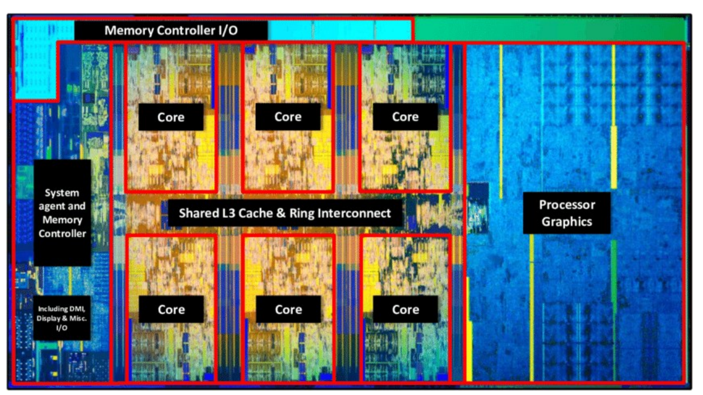
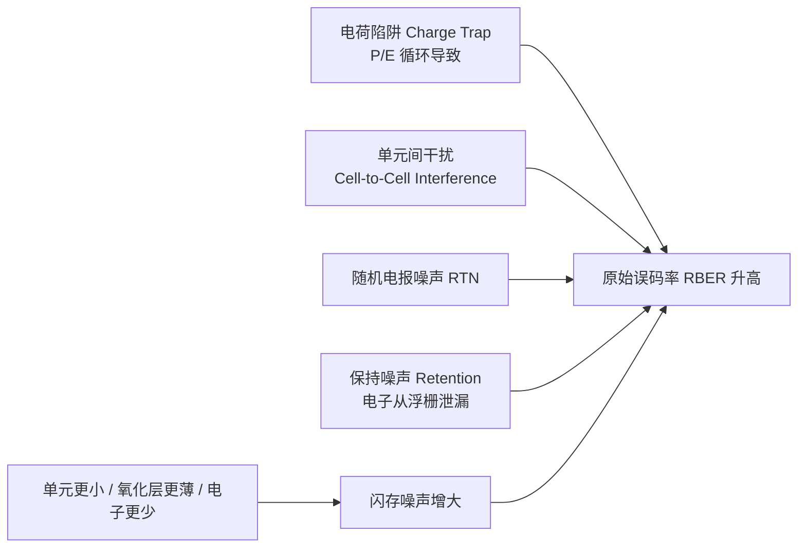
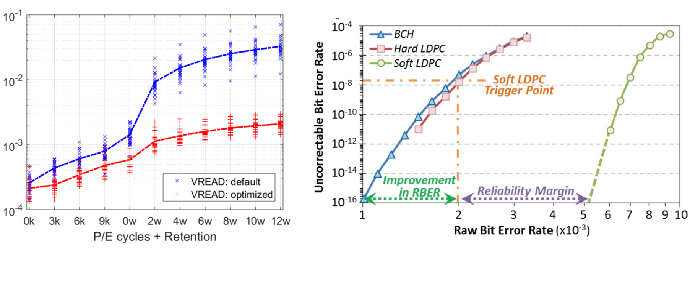

# 06 多核能效与可靠性挑战

[本讲目录](../index.md) · [课程目录](../../index.md) · [上一节：05 技术趋势与功耗墙](05-technology-trends-and-power-wall.md)

> [!abstract] 本节要点
> - 频率无法继续靠"堆"来提升后，体系结构有三条同频提性能的路：更高效的执行单元、用 L1/L2/L3 Cache 让执行单元少等数据、用指令调度消除流水线气泡（bubble）。
> - 多核带来四类新问题：核间互连带宽、共享 Cache 的一致性（由硬件快速维护）、跨核调度与同步、Cache 亲和性；在芯片之外，还要处理共享 DRAM 的大内存占用，并让存储性能跟上核数增长。
> - 2010–2018 年数据中心计算实例增长约 550%，用电量只增长约 6%，说明单位计算的能耗在下降。提升能效的手段包括工艺进步（芯片面积约与制程的平方成正比）、异构计算（xPU）、新型存储、自然冷却和虚拟化。
> - NAND 闪存的单元越小、氧化层越薄、电子越少，噪声越大（电荷陷阱、单元间干扰、随机电报噪声、保持噪声），原始误码率 RBER 越高。
> - RBER $\approx 3\times10^{-3}$ 时，一个 4 KB 页约有 98 个错误位，ECC 必须把 UBER 压到 $10^{-15}$。BCH 解码快但纠错弱，LDPC 解码慢但纠错强，软判决 LDPC 能容忍的 RBER 更高，两者之间的区间叫可靠性裕量。

## 同频下提升性能

动态功耗随频率近似按三次方增长（见 [05 技术趋势与功耗墙](05-technology-trends-and-power-wall.md)），所以靠提高主频换性能的路已经走不通了。要在**相同或相近的时钟频率**下继续提升性能，只能从体系结构入手。[^s1p45]

体系结构给出三条思路：[^s3b1]

1. **提高执行单元本身的效率**：频率不变，让执行单元（Execution Units）在每个周期内完成更多有用工作。
2. **提高执行单元的利用率**：执行单元经常停下来等数据。用 L1 指令 Cache（L1 I\$）、L1 数据 Cache（L1 D\$）、L2 和 L3 Cache 提高访问速度和带宽，执行单元就不必每次都等内存。内存为什么慢见 [04 系统框图与内存墙](04-system-block-diagram-and-memory-wall.md)。
3. **指令调度（Instruction Scheduling）**：硬件不变，只改变指令的执行顺序，就能填掉流水线里的空泡（bubble），提高吞吐。芯片里与之配套的是指令调度单元和**退休单元**（Retirement）。

现代 CPU 的芯片面积正是按这三类需求划分的：提升数据访问速度的 Cache，提升执行效率的执行单元，以及负责调度的调度与 Retirement 单元。[^s3b1]

以 Intel Coffee Lake 为例，一颗芯片上集成了：[^s1p46]

- 多个 **Core**（图中 6 个，上下各 3 个）；
- 位于核心之间的**共享 L3 Cache 与环形互连**（Shared L3 Cache & Ring Interconnect），核心通过环形总线访问共享的 L3，也通过它相互通信；
- **System Agent 与内存控制器**（含 DMI、显示和其他 I/O），以及顶部的 Memory Controller I/O；
- 占据右侧大片面积的**核显**（Processor Graphics）。

图：Intel Coffee Lake 芯片显微照片：多个核心、共享 L3 Cache 与环形互连、系统代理与内存控制器、核显。

> [!note] 补充解释
> "退休"（retirement，也称 commit）是乱序执行处理器的最后一步：指令可以乱序执行，但必须按程序顺序提交结果，这样异常和中断才是精确的。具体机制在后续讲流水线和乱序执行时展开。

## 多核系统的设计问题

另一条出路是增加核心数：单核性能涨不动，就用更多核心并行。但核心一多，下面这些问题就成了系统设计的核心。[^s1p47]

### 芯片内：互连、一致性、调度与亲和性

1. **核间互连**：核心之间怎样相连，带宽多高。对服务器尤其关键，因为服务器程序（比如科学计算）会用满所有核心，核心之间需要频繁通信。
2. **Cache 一致性（Cache Coherence / Consistency）**：为了访问方便，同一份数据会在多个核心的 Cache 中各存一个副本。某个核心修改了自己的副本，其他核心必须知道，否则它们会读到旧值。保证所有副本始终正确，需要核心之间相互通信。[^s3b1]
3. **跨核调度与同步**：线程如何分配到不同核心，核心之间如何同步和通信。
4. **Cache 亲和性（Cache Affinity）**：数据缓存在 A 核的 Cache 里，B 核却要用它。这时要么把数据搬过去，要么远程访问 A 核的 Cache，两种做法都有额外开销。所以调度线程时，要考虑它的数据在哪个核心上。

> [!tip] 课堂强调
> Cache 一致性通常**由硬件实现**，不靠软件，而且必须在很短时间内完成，要求很高，是 CPU 设计中工程上最复杂的部分之一。后续课程会具体讲。[^s3b1]

> [!example] 例：为什么服务器偏好"宽互连"
> 两种多核设计思路的对比（核间带宽为早期 AMD 处理器的实测值）：[^s3b1]
>
> | 方案 | 核心数 | 核间带宽 |
> |---|---|---|
> | 早期 AMD "胶水多核" | 多 | 约 6 GB/s |
> | Intel | 相对少 | 互连做得宽 |
>
> 拿 6 GB/s 和其他部件比：一块 SSD 现在约 7–14 GB/s，一个 DRAM 通道约 50 GB/s（笔记本双通道约 100 GB/s）。可见核心之间通信比读 SSD 还慢。"胶水多核"指把多个核心拼到一颗芯片上，但核心之间只用低带宽互连。桌面负载很少让核心间密集通信，核心多就显得性能强。服务器负载要用满所有核心并频繁交换数据，互连就成了瓶颈，所以服务器端更看重互连带宽。

### 芯片外：内存与存储

跳出 CPU 芯片看整个系统，内存（DRAM）和外存（SSD，经 PCIe 连接）也被所有核心共享：[^s1p48]

- DRAM 被所有核心共享后，如何处理**更大的内存占用**（memory footprint）？
- 核心数增加，对 I/O 和数据访问带宽的需求也随之增加。如何让**存储性能跟上核数**，并且能被多个核心共享？

## 数据中心能效

衡量计算机系统不能只看性能，能耗同样重要。数据中心规模扩大后，曾有预测说到 2025 年数据中心会消耗全球电力的 1/5。

实际数据（Masanet 等，Science 2020）：2010–2018 年，全球数据中心**计算实例增长约 550%，用电量只增长约 6%**。[^s1p49] 实例数大幅增加，总用电量几乎不变，说明**单位计算的能耗在随时间下降**。

散热也是成本。设备一发热就必须降温，所以数据中心常建在寒冷、靠水或山洞里的地点，比如北极圈附近、海底、河边，或苹果建在贵州山洞中的数据中心。实验室里可以没人吹空调，但机器必须有空调，否则容易坏。[^s3b2]

### 提升能效的五类手段

能效的提升可以来自器件、计算、存储、散热和软件五个层面。[^s1p51]

| 手段 | 作用层面 | 原理 |
|---|---|---|
| 晶体管工艺进步 | 器件 | 制程缩小，元器件距离缩短，频率可以更高；导通电压降低，功耗下降 |
| 异构计算（GPU、FPGA、加速器） | 计算 | 为特定任务优化内部计算单元，性能更高、功耗更低 |
| 新型存储器件 | 存储 | 介于 DRAM 与 SSD 之间，弥补两者的缺点 |
| 冷却（Cooling） | 散热 | 用水、低温等自然冷源代替空调，省电 |
| 虚拟化（Virtualization） | 软件 | 把同一硬件分给不同用户分时复用，避免设备空转 |

**工艺**：用 $A_{\mathrm{chip}}$ 表示芯片面积，$\ell$ 表示制程特征尺寸，则 $A_{\mathrm{chip}}\propto\ell^2$，即芯片面积大致与制程的平方成正比。每进一代，制程的平方约减半：$3^2 = 9$，$9/2 \approx 4 \approx 2^2$，所以 3 nm 到 2 nm 正好是一代。[^s3b2] 制程缩小有两个好处：

1. 元器件靠得更近，可以跑在更高频率上（道理和"DRAM 离 CPU 近频率就能更高"相同）。
2. 开关所需的电压降低，功耗随电压的平方下降。

> [!note] 补充解释
> 原讲解用 $P = V^2/R$ 说明"电压降低，功耗降低"，这是简化说法。CMOS 动态功耗的准确形式是 $\tfrac12 CV^2Af$（见 [05 技术趋势与功耗墙](05-technology-trends-and-power-wall.md)），结论相同：功耗与 $V^2$ 成正比，降电压收益最大。

> [!example] 例：工艺差距对性能的影响
> 华为昇腾使用约 12 nm 工艺，英伟达 GPU 使用 3 nm。按 $A_{\mathrm{chip}}\propto\ell^2$ 估算：
>
> $$\frac{12^2}{3^2} = \frac{144}{9} = 16$$
>
> 两者相差约 16 倍（原讲解口述为约 14 倍，是把 $12^2=144$ 近似成 140 后的结果，按算式应为 16 倍）。[^s3b2] 功耗控制不住，频率也上不去，所以昇腾的性能比英伟达最新 GPU 低约 4–10 倍。

**异构计算**：CPU 适合操作系统和顺序执行的任务，GPU 适合矩阵乘法这类并行计算。此外还有 FPGA、DSP，以及 NPU、DCU 等各种"xPU"。它们都针对特定任务优化了内部计算单元，所以效率更高、功耗更低。[^s3b2]

**新型存储**：例如 Intel 傲腾（Optane），一种介于 DRAM 和 SSD 之间的介质。它已经停产，但停产是因为公司经营原因，而不是技术不好。数据库领域对它需求很大，国内有公司在接手做类似产品。[^s3b2]

**虚拟化**：硬件按峰值负载设计，但负载大致符合 80/20 规律：约 20% 的时间很忙，80% 的时间空闲。虚拟化把同一硬件分给使用时间错开的多个用户，提高复用率，减少空转浪费的能耗。[^s3b2]

## 可靠性与 NAND 闪存噪声

可靠性是性能和功耗之外的另一个系统指标。计算出错也会发生：GPU 长时间运行时，HBM 会发生位翻转（1 变成 0），芯片本身也有难以测出的 bug，出错后往往要整机重启。另一个数据是：昇腾芯片连续运行一年，约有 18% 的概率发生故障。[^s3b3] 但可靠性最受重视的地方是**存储**：计算出错，重启重跑即可；存储中的数据一旦出错或丢失，往往**无法恢复**，后果是灾难性的。

> [!tip] 课堂强调
> 对存储而言，性能可以不强，但可靠性不能出问题。[^s3b3]

### 容量与可靠性的矛盾

NAND 闪存应用越来越广（消费级 → 客户端 → 企业级），制程从约 100 nm（2007 年）缩到约 10 nm（2014 年），价格从约 \$10/GB 降到 \$1/GB，再到 \$0.35/GB。[^s1p52] SSD 容量也从十几年前的 10–16 GB 增长到单盘最高约 512 TB。代价是**可靠性下降**。[^s3b3]

闪存单元用**浮栅**（Floating Gate）中存储的电子数表示数据，浮栅与沟道之间由氧化层（Oxide）隔开。**单元越小、氧化层越薄、电子越少，闪存的噪声就越大。**[^s1p52] 主要噪声源有四种：

1. **电荷陷阱**（Charge Trap）：由反复编程/擦除（P/E cycling）引起的结构老化。比如本应存入 100 个电子，老化后只存进 90 个，读出的值就错了。
2. **单元间干扰**（Cell-to-Cell Interference）：大量单元由字线（WL）和位线（BL）组织成阵列，向一个单元写数据时会干扰相邻的受害单元（victim cell）。
3. **随机电报噪声**（Random Telegraph Noise, RTN）：随机出现的扰动，例如宇宙射线恰好击中存储单元导致出错，这类错误无法恢复。
4. **保持噪声**（Retention Noise）：即使什么都不做，电子也会随时间从浮栅中泄漏，数据逐渐出错。

> [!example] 例：断电保存实验
> 一次实测：约 100 块 SSD 写入数据后断电放置 3 个月，重新上电检测，其中 21 块出现了数据错误。[^s3b3]
>
> 原因：SSD 通电时会在后台自行纠错，断电后保持噪声无人处理，错误不断累积。所以 SSD 即使不用，也最好插在通电的机器上，不要长期断电存放（经验上断电保存一般不宜超过约 3 个月）。

## 纠错码（ECC）

**原始误码率**（Raw Bit Error Rate, RBER）指不经纠错、直接从闪存读出时的出错比例。**不可纠正误码率**（Uncorrectable Bit Error Rate, UBER）指经过 ECC 纠错后仍然错误的比例。**纠错码**（Error Correction Code, ECC）的任务是把前者压到后者的目标值以下。[^s1p53]

> [!example] 例：一页数据里有多少个错误位
> 已知当前 SSD 的 RBER 约为 $3\times10^{-3}$（每读 1000 位约错 3 位），SSD 按页访问，一页 4 KB（大写 B，即字节）。[^s3b3]
>
> 1. 一页的位数：$4\,\text{KB} = 4\times1024\times8 = 32\times1024 = 32768$ 位。
> 2. 期望错误位数：$32768 \times 3\times10^{-3} \approx 98$，也就是每读一页约有近 100 个错误位。
> 3. 纠错后的目标 UBER 是 $10^{-15}$，ECC 要把错误率从 $10^{-3}$ 量级降低 12 个数量级。$10^{-15}$ 意味着一台电脑用一辈子，从 SSD 读出的数据可能一位都不会错。

ECC 起作用之前，还可以先**优化读电压**（$V_{\rm READ}$）来降低 RBER 本身。图左：随着 P/E 次数（0k–9k）和保存时间（0–12 周）增加，默认读电压下的最大 RBER 从约 $2\times10^{-4}$ 升到约 $3\times10^{-2}$；采用优化读电压后，最大 RBER 只升到约 $2\times10^{-3}$，大约低一个数量级。[^s1p53]

图：左：P/E 次数与保持时间增加时最大 RBER 上升，优化读电压（红）明显低于默认（蓝）；右：BCH、Hard LDPC、Soft LDPC 的纠错后误码率随 RBER 变化，标出改进幅度与可靠性裕量。

### BCH 与 LDPC

SSD 中常用的两类 ECC 都来自通信领域：[^s3b4]

| 编码 | 解码速度 | 纠错能力 | 能容忍的 RBER（图右） |
|---|---|---|---|
| BCH | 快 | 较弱 | 最低 |
| Hard LDPC（硬判决） | 较慢 | 强 | 略高于 BCH；到约 $2\times10^{-3}$（触发点）就不够用 |
| Soft LDPC（软判决） | 最慢（额外计算） | 最强 | 约 $5\times10^{-3}$ 以内 UBER 仍低于 $10^{-16}$，约 $7\times10^{-3}$ 时才升到 $10^{-8}$ |

读图右的方法：横轴是 RBER（单位 $10^{-3}$），纵轴是 UBER。曲线越**靠右**，说明在更高的原始误码率下仍能保持低 UBER，纠错能力越强。[^s1p53]

1. BCH 和 Hard LDPC 的曲线靠左，RBER 一升高，UBER 就迅速变差。
2. 在 RBER 约 $2\times10^{-3}$ 处（**Soft LDPC 触发点**），硬判决已经不够用，改用软判决 LDPC。软判决读取更多信息、做更多计算，纠错能力更强。
3. 软判决 LDPC 的曲线大约到 $5\times10^{-3}$ 才开始抬升。从触发点到这个位置的区间叫**可靠性裕量**（Reliability Margin）。
4. 图中从 $1\times10^{-3}$ 到 $2\times10^{-3}$ 的区间标为 "Improvement in RBER"，表示从 BCH 的可用边界到软判决触发点之间获得的 RBER 容忍度提升。

> [!warning] 易错点
> "纠错能力强"和"速度快"不能兼得。BCH 解码快但纠错弱，LDPC，尤其是软判决 LDPC，纠错强但解码慢。所以通常先用便宜的硬判决解码，RBER 超过触发点后才启用软判决。这再次说明体系结构里只有权衡，没有免费的最优解。

体系结构评价一个系统时要同时考虑性能、功耗、可靠性，以及面积和复杂度等指标。[^s3b4]

> [!question]- 自测：某 SSD 老化后 RBER 升到 $5\times10^{-3}$，一个 4 KB 页平均有多少错误位？只用 BCH 能否达到 UBER $10^{-15}$？
> 约 $32768\times5\times10^{-3}\approx164$ 个错误位。不能：BCH 曲线在 RBER 超过约 $1\times10^{-3}$ 后，UBER 就高于 $10^{-16}$ 并迅速恶化，到 $5\times10^{-3}$ 时已远超 $10^{-15}$。必须用软判决 LDPC，$5\times10^{-3}$ 大约在它的可靠性裕量边缘，或者先通过优化读电压降低 RBER。

> [!question]- 自测：一个服务器程序在 32 核上做科学计算，核心之间频繁交换中间结果。处理器 A 核多，但核间带宽约 6 GB/s；处理器 B 核少，但互连宽。选哪个？
> 一般选 B。这个负载的瓶颈是核间通信：6 GB/s 比一块 SSD（7–14 GB/s）还慢，比一个 DRAM 通道（约 50 GB/s）低一个数量级，核心越多，等待通信的时间越长。桌面负载核间通信少，A 才显得更强。

> [!question]- 自测：一个线程从核 0 迁移到核 3 后突然变慢，但两个核的频率和负载都相同。可能的原因是什么？
> Cache 亲和性。线程的工作集仍缓存在核 0 的私有 Cache 中，迁移后核 3 要么把数据重新搬过来，要么远程访问核 0 的 Cache，两种做法都有额外开销。如果核 0 上还有数据被修改过，还会引发一致性通信。调度时尽量把线程留在数据所在的核心上。

> [!info]- 来源
> - L01.pdf：PDF p.45–49, 51–53
> - L02.docx：DOCX body 1–160

[^s1p45]: L01.pdf-PDF p.45
[^s3b1]: L02.docx-DOCX body 1-50
[^s1p46]: L01.pdf-PDF p.46
[^s1p47]: L01.pdf-PDF p.47
[^s1p48]: L01.pdf-PDF p.48
[^s1p49]: L01.pdf-PDF p.49
[^s3b2]: L02.docx-DOCX body 51-90
[^s1p51]: L01.pdf-PDF p.51
[^s3b3]: L02.docx-DOCX body 91-123
[^s1p52]: L01.pdf-PDF p.52
[^s1p53]: L01.pdf-PDF p.53
[^s3b4]: L02.docx-DOCX body 124-160

[本讲目录](../index.md) · [课程目录](../../index.md) · [上一节：05 技术趋势与功耗墙](05-technology-trends-and-power-wall.md)
