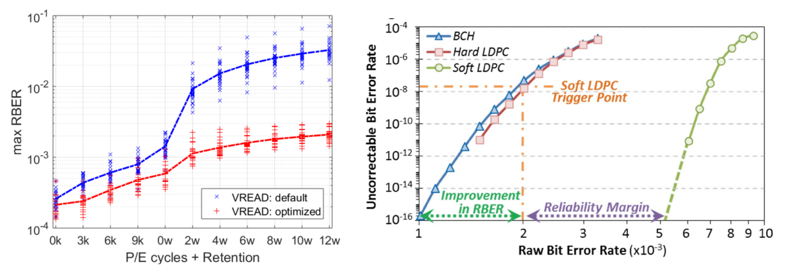

# 07 闪存可靠性与纠错

[本讲目录](../index.md) · [课程目录](../../index.md) · [上一节：06 功耗与系统能效](section-6.md)

## 闪存噪声与原始误码

NAND闪存单元缩小、氧化层变薄、存储电子数量减少时，单元状态更容易受到噪声影响。浮栅示例用电荷保存状态，电子数量或周围环境的变化会影响读取判断。[^s1p52]

主要误差机制包括：

| 机制 | 变化来源 |
| --- | --- |
| 单元间干扰（Cell-to-cell interference） | 邻近单元影响被读取单元 |
| 随机电报噪声（RTN） | 器件中的随机电荷变化造成读出波动 |
| 保持噪声（Retention noise） | 随时间推移，电子从浮栅泄漏 |
| 编程／擦除循环影响 | P/E循环引入电荷陷阱，改变器件状态 |

这些机制增加原始比特误码率（raw bit error rate，RBER），即纠错之前读出数据中出现错误的比例。更高的RBER会增加纠错负担。[^s1p52]

## 读取电压优化

读取电压决定如何把单元读出状态判定为存储数据。优化读取电压$V_{\mathrm{READ}}$，可以降低判定过程产生的原始误码。[^s1p53]

左图比较默认与优化$V_{\mathrm{READ}}$：

- 横轴先列出P/E循环次数，如0k、3k、6k、9k；随后列出保持时间0w至12w。
- 纵轴为最大RBER，使用对数刻度，从$10^{-4}$到$10^{-1}$。
- 默认电压对应蓝色曲线，优化电压对应红色曲线；在图中各比较位置，红线低于蓝线，保持阶段的差距尤其明显。[^s1p53]

这里的改进发生在纠错之前：通过更合适的读出判断，减少输入纠错过程的错误数量。

## ECC与纠错后的误码

错误纠正码（ECC）利用编码冗余纠正读出的部分错误。纠错后的不可纠正比特误码率，与RBER是不同指标：RBER描述读出错误，后者描述经过纠错仍未能恢复的错误。[^s1p53]

右图将两者联系起来，横轴是RBER，单位标为$\times10^{-3}$；纵轴是不可纠正比特误码率，采用$10^{-16}$至$10^{-4}$的对数刻度。BCH与Hard LDPC曲线在该例中接近，Soft LDPC曲线向右延伸，表示在更高RBER下仍可维持较低的不可纠正误码率。[^s1p53]

**补充解释**：硬判决首先把读出结果判成具体比特；软判决还使用读出结果的可靠程度信息。软判决LDPC因此能利用更多读出信息。

图中Soft LDPC触发点约在RBER为$2\times10^{-3}$处。这一触发点对应图中的配置。右侧标出的可靠性裕量，是采用更强纠错后还能容忍原始误码继续增加的范围。[^s1p53]

## 两种改善方向

优化读取与增强纠错改善的是不同环节：

1. **减少原始误码**：调整读取电压，把工作点向较低RBER方向移动。
2. **提高纠错容忍度**：在给定RBER下获得更低的不可纠正误码率，或在相同纠错后误码目标下容忍更高RBER。[^s1p53]

## 应用问答

**问**：优化读取电压后RBER下降，应归因于ECC变强了吗？

**答**：不应。该变化发生在读出阶段，进入ECC的错误更少；ECC能力是否变化要另行判断。

**问**：两个方案在相同不可纠正误码目标下，一个能接受更高RBER，这意味着什么？

**答**：它有更大的原始误码容忍范围。右图中Soft LDPC向右延伸的曲线表达了这种可靠性裕量。

来源：[^s1p52] [^s1p53]

[^s1p52]: L01.pdf-PDF p.52
[^s1p53]: L01.pdf-PDF p.53

[本讲目录](../index.md) · [课程目录](../../index.md) · [上一节：06 功耗与系统能效](section-6.md)
