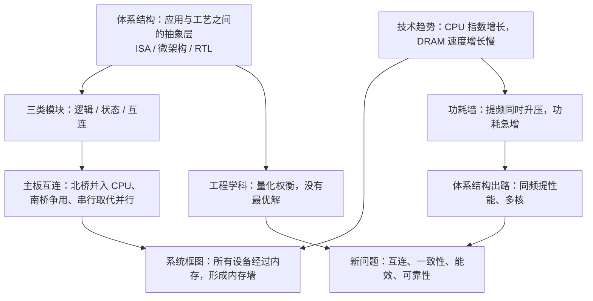

# L01 计算机体系结构导论

[课程目录](../index.md)

硬件不再自动让程序变快，程序员和架构师都必须理解软硬件接口，并学会在性能、功耗、面积与可靠性之间做量化权衡。本讲先给出计算机体系结构的定义和从应用到工艺的系统栈，再用逻辑/状态/互连三类模块和工程研究循环说明这门学科的方法。随后从真实主板抽象出系统框图，引出内存墙，并用技术趋势和动态功耗公式解释功耗墙，最后归纳频率受限之后的体系结构课题：同频提性能、多核、能效与可靠性。阅读本讲只需要计算机系统导论（ICS）中 CPU、内存与指令执行的基本概念。

## 章节导航

- [01 体系结构定义与系统栈](chapters/01-architecture-definition-and-system-stack.md)：体系结构定义、11 层系统栈与软硬件接口
- [02 构建模块与研究方法](chapters/02-building-blocks-and-research-method.md)：逻辑/状态/互连与量化权衡的工程循环
- [03 主板结构与系统互连](chapters/03-motherboard-and-system-interconnect.md)：北桥并入 CPU、南桥争用与串并行取舍
- [04 系统框图与内存墙](chapters/04-system-block-diagram-and-memory-wall.md)：所有设备经内存形成内存墙；CPU 指令流
- [05 技术趋势与功耗墙](chapters/05-technology-trends-and-power-wall.md)：性能与工艺趋势，$P\propto f^3$ 推出功耗墙
- [06 多核能效与可靠性挑战](chapters/06-multicore-energy-and-reliability.md)：同频提性能、多核问题、能效与 SSD 纠错

## 本讲小结

### 概念主线

两堵“墙”分别来自状态与逻辑：内存墙是存储跟不上计算，功耗墙是计算本身不能再靠提频加速。两者都把问题推回体系结构，需要用 Cache、调度、多核、异构和 ECC 等手段，在性能、功耗、面积与可靠性之间重新权衡。

### 核心公式

| 公式 | 含义 | 所在章节 |
|---|---|---|
| $P \approx \tfrac12 C V^2 A f$ | 动态功耗；$C$ 电容（F），$V$ 电源电压（V），$A$ 活动因子，$f$ 时钟频率（Hz） | [05 技术趋势与功耗墙](chapters/05-technology-trends-and-power-wall.md) |
| $P \propto V^2 f \propto f^3$ | 假设 $f \propto V$ 时，功耗约与频率（性能）的三次方成正比 | [05 技术趋势与功耗墙](chapters/05-technology-trends-and-power-wall.md) |
| $A_{\mathrm{chip}}\propto\ell^2$ | $A_{\mathrm{chip}}$ 为芯片面积，$\ell$ 为制程特征尺寸；工艺每进一代面积约减半；$12^2/3^2 = 16$ | [06 多核能效与可靠性挑战](chapters/06-multicore-energy-and-reliability.md) |
| 页错误位数 $= 32768 \times \mathrm{RBER}$ | 4 KB 页，RBER $3\times10^{-3}$ 时约 98 位；ECC 目标 UBER $10^{-15}$ | [06 多核能效与可靠性挑战](chapters/06-multicore-energy-and-reliability.md) |

## 不确定事项

- 内存墙的第二层含义（容量）来自识别不清的转写“它的容量没有问题”，按“两层含义”推断为容量也不足
- s1p28 晶体管电路的正确答案在转写中不清晰，笔记只断言 AI 的“锁存器”答案错误、电路由不完整的与非门组成
- 昇腾“每年 18% 故障率”与“性能差 4–10 倍”均为讲解中的口述数据，无公开来源核实
- s1p43 Itanium-2 热图与 s1p44–s1p53 无第一讲录音，仅依据幻灯片和第二讲开头的补讲

> [!info]- 来源
> - L01.pdf：PDF p.23–31, 33–49, 51–53
> - L01.docx：DOCX body 1–85, 298–638
> - L02.docx：DOCX body 1–160
