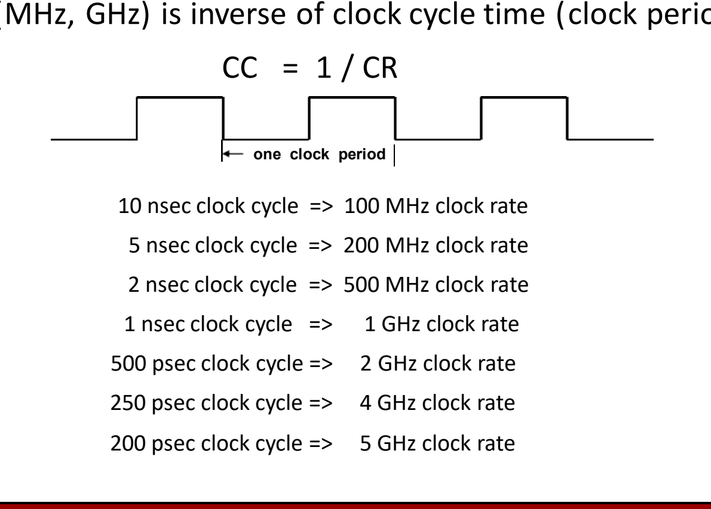

# 01 性能指标与时钟

[本讲目录](../index.md) · [课程目录](../../index.md) · [下一节：02 CPI与性能铁律](02-cpi-and-iron-law.md)

> [!abstract] 本节要点
> - 无论是买机器（购买视角）还是做设计取舍（设计视角），都要先有比较基准和度量指标，才能判断谁性能最好、成本最低、性价比最高。
> - 响应时间（执行时间、延迟）是一个任务从开始到完成的时间；性能定义为其倒数：$\text{performance}_X = 1/\text{execution\_time}_X$。
> - “X 比 Y 快 $n$ 倍”指 $\text{time}_Y/\text{time}_X = n$，不是 $n+1$；“X 的吞吐量是 Y 的 $n$ 倍”同样直接取比值 $n$。
> - 缩短响应时间几乎总能提高吞吐量，反之不成立；流水线等重叠执行使吞吐量 $> 1/\text{延迟}$（汽车装配线：延迟 6 小时，吞吐量 12 辆/小时）。
> - 体系结构以时钟周期而非秒来计时：$CC = 1/CR$，例如 1 ns ↔ 1 GHz、250 ps ↔ 4 GHz。

## 为什么需要性能指标

评价计算机系统要同时看性能、功耗、可靠性，以及面积、复杂度等多个维度；本节先解决其中最基本的一个问题：怎样用数字说清“哪台机器更快”。没有统一的度量，“这台更好”“这个设计更优”都无从比较。

性能比较出现在两种场景中：[^s1p3]

1. **购买视角**（purchasing perspective）：面对一组现成机器，要选出
   - 性能最好的；
   - 成本最低的；
   - 性价比（cost/performance）最好的。
2. **设计视角**（design perspective）：面对若干设计选项（例如加入一项新设计），要判断哪一项
   - 带来的性能提升最大；
   - 成本（复杂度、开销）最低；
   - 使整个系统性价比最高。

两种视角都需要两样东西：**比较基准**（basis for comparison）和**评价指标**（metric for evaluation）。学习本课程的目标，是理解体系结构中有哪些因素决定系统整体性能，以及这些因素各自的相对重要性和代价。[^s1p3] 这些因素如何定量地组合成执行时间，见 [[02 CPI与性能铁律]]；性价比与跨程序的汇总方法见 [[03 性能汇总与Amdahl定律]]。

## 响应时间与性能（Response Time）

单个用户最关心的是“我的这个任务要等多久”，因此第一个指标直接度量单个任务所花的时间。

**响应时间**（response time），也叫**执行时间**（execution time）或**延迟**（latency），是一个任务从开始到完成之间经过的时间，回答“做一次 X 要多长时间”。[^s1p4] 它对单个用户最重要。

时间越短越好，而“性能”习惯上越大越好，所以把性能定义为执行时间的倒数：[^s1p4]

$$
\text{performance}_X = \frac{1}{\text{execution\_time}_X}
$$

于是“最大化性能”与“最小化执行时间”是同一件事。

## 吞吐量（Throughput）

数据中心有大量服务器同时处理大量任务，管理者关心的不是某一个任务多快完成，而是单位时间内总共完成多少工作。

**吞吐量**（throughput）是给定时间内完成的工作总量（例如每小时完成的任务数），回答“多久能做一次 X / 多频繁地做 X”。[^s1p4] 它关注多个任务的整体产出，对数据中心管理者最重要。

### 响应时间与吞吐量的关系

两者的关系是单向的：[^s1p4]

- **缩短响应时间 ⇒ 几乎总能提高吞吐量**：每个任务完成得更快，单位时间内自然能完成更多任务。
- **提高吞吐量 ⇏ 缩短响应时间**：提高吞吐量的方法不止一种。例如改用性能较弱的服务器但多部署几台，总吞吐量上升，而每台服务器完成单个任务的时间反而变长了。[^s2b4]

> [!example] 例：汽车装配线
> 一条汽车装配线上，造一辆车需要 6 小时，但每 5 分钟就有一辆车下线。[^s1p6]
>
> 1. 延迟：每辆车从开工到完工 6 小时，即 latency = 6 小时/辆。
> 2. 吞吐量：每 5 分钟下线一辆，$60/5 = 12$，即 throughput = 12 辆/小时。
> 3. 若没有重叠、一辆造完再造下一辆，吞吐量只有 $1/\text{latency} = 1/6$ 辆/小时。
> 4. 装配线让多辆车同时处在不同工序上（重叠执行），因此 $\text{Throughput} > 1/\text{Latency}$：$12 \gg 1/6$。

这个例子说明吞吐量和延迟是两个独立的指标，不能互相推出。流水线 CPU 正是同一个道理：一条指令的延迟不变，但多条指令重叠执行，提高了单位时间完成的指令数。

> [!warning] 易错点
> 不能用 $1/\text{延迟}$ 去算吞吐量，也不能由“吞吐量提高了”推出“单个任务变快了”。只有在任务严格串行、没有任何重叠或并行时，才有 $\text{吞吐量} = 1/\text{延迟}$。

## “快 n 倍”的定义（Comparing Performance）

有了性能的定义，就可以给“X 比 Y 快多少”一个精确含义，避免日常说法带来的歧义。

**“X 比 Y 快 $n$ 倍”**（X is $n$ times faster than Y）的定义是：[^s1p4][^s1p13]

$$
\frac{\text{performance}_X}{\text{performance}_Y} = \frac{\text{execution\_time}_Y}{\text{execution\_time}_X} = n
$$

即 Y 的执行时间除以 X 的执行时间等于 $n$。由于性能是时间的倒数，性能之比恰好等于时间的反比。

同理，**“X 的吞吐量是 Y 的 $n$ 倍”**（throughput of X is $n$ times that of Y）定义为：[^s1p13]

$$
\frac{\text{throughput}_X}{\text{throughput}_Y} = n
$$

即 X 单位时间完成的任务数除以 Y 单位时间完成的任务数，同样直接等于 $n$。

> [!tip] 课堂强调
> 英文 “X is $n$ times faster than Y” 中，时间之比就是 $n$，**不是 $n+1$**。中文习惯里“A 比 B 快一倍”常指时间比为 2，与英文定义不同。考试中按英文定义，直接取 $\text{time}_Y/\text{time}_X = n$，不要写成 $n+1$；吞吐量的“$n$ 倍”也不要写成 $n-1$ 或 $n+1$。[^s2b6]

> [!example] 例：判断快多少倍
> 程序在 Y 上运行 15 s，在 X 上运行 10 s。
>
> 1. $\text{time}_Y/\text{time}_X = 15/10 = 1.5$。
> 2. 按定义，X 比 Y 快 1.5 倍（性能是 Y 的 1.5 倍），而不是“快 0.5 倍”或“快 2.5 倍”。

## 时钟周期与时钟频率（Clock Cycle and Clock Rate）

硬件靠注入的时钟驱动，每个时钟周期执行一步动作，所以在体系结构里通常不用秒、小时等绝对时间来度量任务，而是数它用了多少个时钟周期。时钟周期因此是体系结构中最基本的时间单位。[^s2b4]

**时钟频率**（clock rate，CR，单位 MHz、GHz）是每秒的时钟周期数；**时钟周期**（clock cycle time / clock period，CC）是一个周期的时长。二者互为倒数：[^s1p5]

$$
CC = \frac{1}{CR}
$$

下图中一个时钟周期是时钟波形相邻两个同向边沿之间的时间。

常用换算（$1\,\text{ns} = 10^{-9}\,\text{s}$，$1\,\text{ps} = 10^{-12}\,\text{s}$）：[^s1p5]

| 时钟周期 CC | 时钟频率 CR |
| --- | --- |
| 10 ns | 100 MHz |
| 5 ns | 200 MHz |
| 2 ns | 500 MHz |
| 1 ns | 1 GHz |
| 500 ps | 2 GHz |
| 250 ps | 4 GHz |
| 200 ps | 5 GHz |

换算方法：周期以 ns 为单位时，$CR(\text{GHz}) = 1/CC(\text{ns})$。例如 $CC = 250\,\text{ps} = 0.25\,\text{ns}$，$CR = 1/0.25 = 4\,\text{GHz}$。

以周期计时后，程序的执行时间就可以写成“周期数 × 周期时长”。周期数又取决于指令数和每条指令平均所需周期数（不同指令耗时不同），这一完整关系即性能铁律，见 [[02 CPI与性能铁律]]。

> [!warning] 易错点
> 时钟频率高不等于程序一定跑得更快：执行时间还取决于程序需要多少个周期。只比较 GHz 数，相当于只看了公式中的一个因子。

> [!question]- 自测：机器 X 运行某程序用时 4 s，机器 Y 用时 12 s。按课程定义，X 比 Y 快几倍？若有人答“快 2 倍”，错在哪里？
> X 比 Y 快 3 倍，因为 $\text{time}_Y/\text{time}_X = 12/4 = 3$。“快 2 倍”是把中文“多出几倍”的习惯套了进来，即用了 $n+1=3$ 反推 $n=2$；英文定义下比值本身就是 $n$。

> [!question]- 自测：某网站把一台服务器换成 4 台更慢的服务器，每个请求的处理时间从 50 ms 变为 80 ms，但每秒处理的请求数增至原来的 2.5 倍。这次改动提高了哪个指标、降低了哪个指标？
> 吞吐量提高到原来的 2.5 倍，响应时间（延迟）变差（50 ms → 80 ms）。这说明提高吞吐量不一定缩短响应时间；反过来，缩短响应时间才几乎总能提高吞吐量。

> [!question]- 自测：一颗处理器的时钟周期为 0.5 ns，另一颗为 200 ps，它们的时钟频率各是多少？
> $1/0.5\,\text{ns} = 2\,\text{GHz}$；$200\,\text{ps} = 0.2\,\text{ns}$，$1/0.2\,\text{ns} = 5\,\text{GHz}$。

> [!info]- 来源
> - L02.pdf：PDF p.3–6, 13
> - L02.docx：DOCX body 124–160, 197–243

[^s1p3]: L02.pdf-PDF p.3
[^s1p4]: L02.pdf-PDF p.4
[^s2b4]: L02.docx-DOCX body 124-160
[^s1p6]: L02.pdf-PDF p.6
[^s1p13]: L02.pdf-PDF p.13
[^s2b6]: L02.docx-DOCX body 197-243
[^s1p5]: L02.pdf-PDF p.5

[本讲目录](../index.md) · [课程目录](../../index.md) · [下一节：02 CPI与性能铁律](02-cpi-and-iron-law.md)
