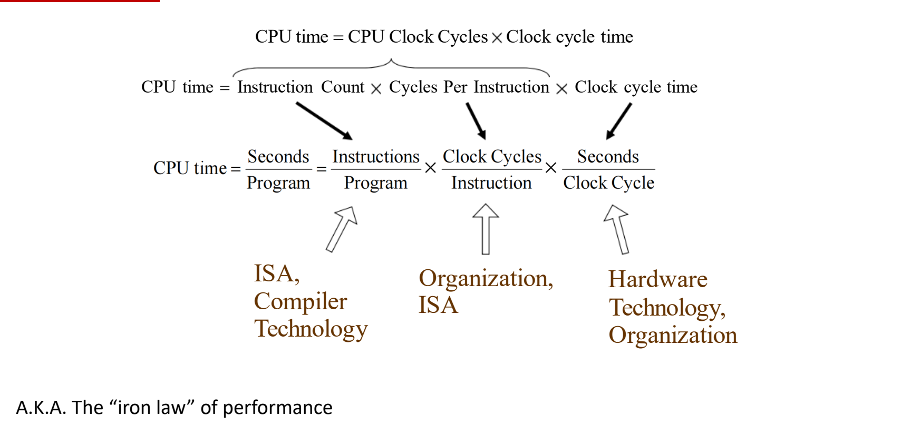
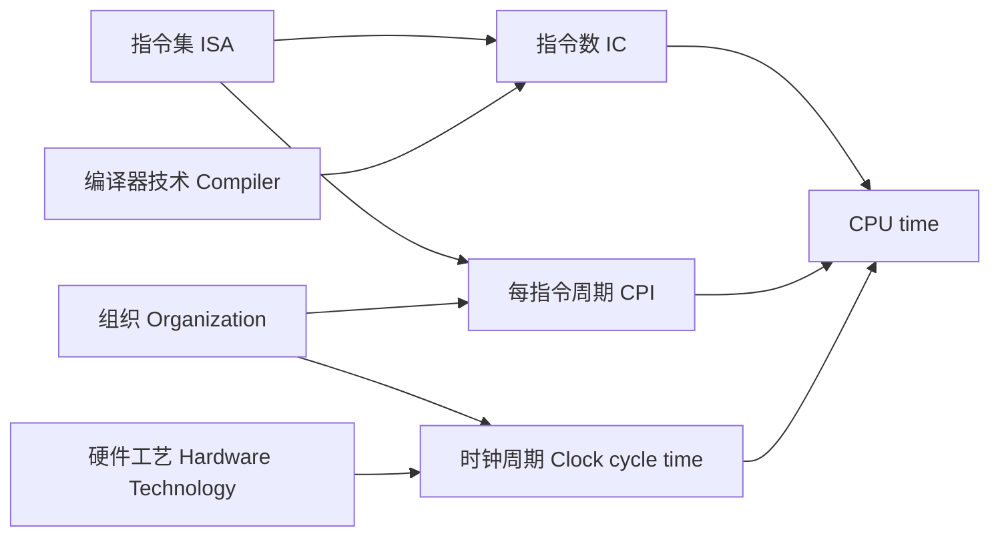
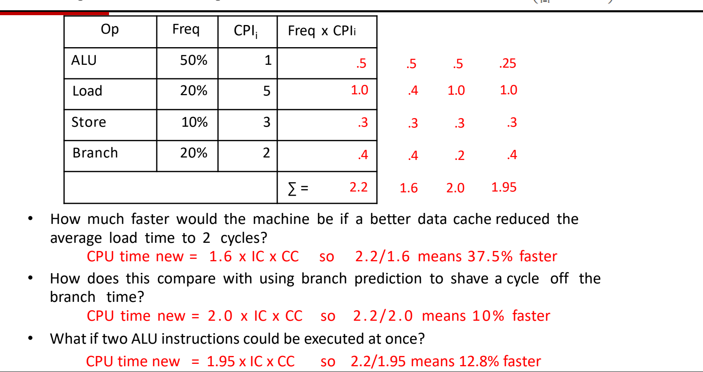

# 02 CPI与性能铁律

[本讲目录](../index.md) · [课程目录](../../index.md) · [上一节：01 性能指标与时钟](01-performance-metrics-and-clock.md) · [下一节：03 性能汇总与Amdahl定律](03-performance-summary-and-amdahls-law.md)

> [!abstract] 本节要点
> - 程序的 CPU 时钟周期数 = 指令数 × 平均 CPI；CPI 是每条指令平均消耗的时钟周期数，用来比较**同一 ISA** 的不同实现。
> - 指令分类别时，有效 CPI $=\sum_i \mathrm{CPI}_i\times \mathrm{IC}_i$（$\mathrm{IC}_i$ 为第 $i$ 类指令的占比），它随指令组合（instruction mix）变化。
> - IPC = 1/CPI，表示每周期执行的指令数；IPC 越大越好、CPI 越大越差，厂商发布会常用 IPC 衡量微架构本身的提升。
> - 性能铁律：CPU time = 指令数/程序 × 周期/指令 × 秒/周期；IC 受 ISA 与编译器影响，CPI 受 ISA 与组织影响，时钟周期受组织与工艺影响，架构师的工作是在三者之间权衡。
> - 例题：基准 CPI 2.2；数据 Cache 把 load 降到 2 周期 → CPI 1.6，快 37.5%；分支少 1 周期 → 2.0，快 10%；两条 ALU 指令同时执行 → 1.95，快 12.8%。

## 每条指令的时钟周期数（CPI）

只知道时钟频率还算不出程序运行多久，因为不同指令执行所需的时间并不相同：有的指令一个周期就完成，有的（如乘法、访存）要多个周期。于是需要一个量把"程序有多少条指令"和"程序花多少个周期"联系起来。

一种看待执行时间的方式是：执行时间 = 执行的指令条数 × 每条指令的平均时间。换成周期来表述：

$$
\text{CPU 时钟周期数} = \text{程序的指令数} \times \text{每条指令的平均时钟周期数}
$$

**每条指令的时钟周期数**（Clock cycles Per Instruction, CPI）是每条指令执行平均所需的时钟周期数。[^s1p7]

CPI 的主要用途是**比较同一 ISA 的两种不同实现**：同一 ISA、同一程序编译出的指令数相同，此时不必比较整个程序花了多少周期，只看平均 CPI 就能比较两颗 CPU 的微架构好坏。若 ISA 不同，指令数本身就不同，单看 CPI 会产生误导。

CPI 是按指令类别给出的。例如某实现中三类指令的 CPI 为：[^s1p7]

| 指令类别 | A | B | C |
|---|---|---|---|
| CPI | 1 | 2 | 3 |

不同类别 CPI 不同，是因为各类指令走的硬件不同：乘法单元完成一次运算比加法单元耗时更长，分支则由单独的单元处理。[^s2b6] 所以"平均 CPI"必须考虑各类指令各占多少。

### 有效 CPI 与指令组合（Effective CPI, Instruction Mix）

既然每类指令 CPI 不同，整个程序的平均 CPI 就取决于各类指令出现得多频繁。

**有效 CPI**（overall effective CPI）是按各类指令的执行占比对其 CPI 加权平均的结果：[^s1p8]

$$
\text{有效 CPI} = \sum_{i=1}^{n} \left(\mathrm{CPI}_i \times \mathrm{IC}_i\right)
$$

其中：

- $\mathrm{IC}_i$：第 $i$ 类指令被执行的条数所占的**百分比**（instruction count / percentage）；
- $\mathrm{CPI}_i$：第 $i$ 类指令平均每条所需的时钟周期数；
- $n$：指令类别数。

**指令组合**（instruction mix）是指令在一个或多个程序中的**动态出现频率**的度量。有效 CPI 随指令组合而变：同一颗 CPU 跑访存密集的程序和跑计算密集的程序，有效 CPI 可能差很多。[^s1p8]

若把 $\mathrm{IC}_i$ 取为第 $i$ 类指令的**条数**（而非占比），求和得到的就是程序的总周期数，于是可直接写出按类别展开的 CPU 时间公式：[^s1p12]

$$
\text{CPU time} = \left(\sum_{i=1}^{n} \mathrm{IC}_i \times \mathrm{CPI}_i\right) \times \text{Clock cycle time}
$$

求和对每一类指令进行：$\mathrm{IC}_i$ 是程序中这类指令有多少条，$\mathrm{CPI}_i$ 是执行一条这类指令要多少周期。

> [!example] 例：用占比算有效 CPI
> 设 A、B、C 三类指令 CPI 分别为 1、2、3，执行占比为 50%、30%、20%。
>
> 1. 有效 CPI $= 1\times0.5 + 2\times0.3 + 3\times0.2 = 0.5+0.6+0.6 = 1.7$
> 2. 若程序共执行 $10^9$ 条指令，总周期数 $=10^9\times1.7=1.7\times10^9$。

> [!warning] 易错点
> 有效 CPI 不是各类 CPI 的简单算术平均（上例中 $(1+2+3)/3=2$ 是错的），必须用**动态执行**占比加权；静态代码里某类指令写了多少行不算数，执行了多少次才算。

## 每周期指令数（IPC）

CPI 越大性能越差，这个方向不够直观；工业界更常用它的倒数。

**每周期指令数**（Instructions Per Cycle, IPC）是每个时钟周期平均执行的指令条数：

$$
\mathrm{IPC} = \frac{1}{\mathrm{CPI}}
$$

IPC 越大性能越好。[^s1p11]

> [!tip] 课堂强调
> IPC 比 CPI 更直观，也更常见。Intel、AMD 的发布会常同时报两个数字，例如"IPC 提升 10%，整体性能提升 30%"。两者不同，是因为新旧 CPU 的频率可能不同、每颗 CPU 的核心数也可能不同；要衡量**架构本身**带来的提升，看 IPC。[^s2b6]

两个 IPC 怎样跨程序求平均（不能直接算术平均）属于性能汇总问题，见 [[03 性能汇总与Amdahl定律]]。

## 性能铁律（Iron Law of Performance）

响应时间是最可靠的性能度量（定义见 [[01 性能指标与时钟]]），但要改进它，需要把它拆成可以分别优化的因子。

CPU 时间首先等于周期数乘以周期长度，再把周期数拆成指令数 × CPI：[^s1p9]

$$
\text{CPU time} = \text{CPU Clock Cycles} \times \text{Clock cycle time}
= \text{Instruction Count} \times \text{CPI} \times \text{Clock cycle time}
$$

写成量纲形式，三个因子的单位约掉后正好是"秒/程序"：

$$
\text{CPU time} = \frac{\text{Seconds}}{\text{Program}}
= \frac{\text{Instructions}}{\text{Program}} \times \frac{\text{Clock Cycles}}{\text{Instruction}} \times \frac{\text{Seconds}}{\text{Clock Cycle}}
$$

这个式子称为**性能铁律**（"iron law" of performance）。[^s1p9] 若题目给的是频率而非周期，用 $\text{Clock cycle time} = 1/\text{Clock rate}$ 代入，即 CPU time = IC × CPI / 频率。

### 各因子受什么影响

1. **指令数 IC ← ISA、编译器**：同一段逻辑在不同 ISA 上翻译出的指令条数不同；编译器优化方向不同，生成的指令数也不同。例如循环展开（loop unrolling）把循环体复制多份，改变了程序的指令数。[^s2b5]
2. **CPI ← ISA、组织**：指令集越复杂，单条指令可能需要越多周期；同样的任务，内部组织（微架构）若把它拆成更少的步骤，CPI 就小，拆成更多步骤，CPI 就大。[^s2b5]
3. **时钟周期 ← 组织、工艺**：时钟周期必须长到足以让一个周期内的全部工作完成，否则这个周期不能用。内部组织越复杂，单周期要做的事越多，周期越长；工艺制程越先进，电路越快，周期可缩短。[^s2b5]

### 为什么说架构师在做权衡

ISA 和组织都同时作用于两个因子，而且方向可能相反：[^s2b5]

- 一套更复杂的 ISA 可能**减少指令数**，却让每条指令**CPI 增大**，乘起来未必有收益；
- 组织上的改动可能**提高时钟频率**，但为此要求每个周期内做的事更少，导致 **CPI 上升**，一项提升、另一项下降。

因此单独优化某一个因子往往没用，因为它会牵连另一个因子。计算机架构师真正做的事，是在 IC、CPI、时钟周期三者之间不断权衡（trade-off），寻找总乘积最小的最佳点。

> [!warning] 易错点
> 铁律中的指令数是**动态执行**的指令条数，不是源代码或二进制里的静态指令数。课堂口述称循环展开会“增加指令数”，这只对静态代码体积成立：展开让静态代码变长，但减少了循环计数与分支指令的执行次数，动态指令数通常**下降**。[^s2b5] 判断某个优化的效果时，要把它对 IC、CPI、时钟周期的影响都写出来再相乘。

> [!note] 补充解释
> 上面的"CPU time"只计 CPU 执行该程序本身的时间，不包括等待 I/O 或运行其他程序的时间；铁律分解的是这一部分。

## 用铁律计算（Worked Examples）

### 开车类比

从 SIT 开车到 Sinchon（韩国仁川到首尔），把铁律的三项对应到开车上：[^s1p10]

| 铁律因子 | 开车中的对应量 | 数值 |
|---|---|---|
| 指令数 Insts | 路程 | 60 km |
| CPI | 每公里发动机转数 | 5250 转/km（即每转约 0.19 m） |
| 时钟速度 Clock speed | 发动机转速 | 3500 RPM（转/分钟） |

$$
\text{时间} = 60\ \text{km} \times 5250\ \frac{\text{转}}{\text{km}} \div 3500\ \frac{\text{转}}{\text{分钟}} = \frac{315000\ \text{转}}{3500\ \text{转/分钟}} = 90\ \text{分钟}
$$

每转前进距离 $=1000\ \text{m}/5250\approx0.19\ \text{m}$。单位逐项约掉，最后剩下"分钟"，与 CPU time 公式约掉剩"秒/程序"同理。[^s1p10]

### CPU 实例

> [!example] 例：33 billion 条指令要跑多久
> 某程序执行 $33\times10^9$ 条指令，CPU 每条指令平均 2 个周期，时钟频率 3 GHz。
>
> 1. 周期数 $= 33\times10^9 \times 2 = 66\times10^9$
> 2. CPU time $= \dfrac{66\times10^9\ \text{周期}}{3\times10^9\ \text{周期/秒}} = 22\ \text{s}$
>
> 题目有时直接给时钟周期而非频率，例如周期 $=333\ \text{ps}$（$\approx 1/3\ \text{GHz}$），则 CPU time $=66\times10^9\times333\times10^{-12}\ \text{s}\approx22\ \text{s}$。题目也可能用 IPC 代替 CPI，此时 IPC $=0.5$，先取倒数再代入。[^s1p11]

### 指令组合改进例题

铁律的价值在于：当 IC 和时钟周期不变时，只需比较有效 CPI，就能评估各种微架构改进谁更划算。

某机器的指令组合如下，CPU time $=\left(\sum \mathrm{IC}_i\times\mathrm{CPI}_i\right)\times$ Clock cycle time：[^s1p14]

| 指令 Op | 占比 Freq | $\mathrm{CPI}_i$ | Freq × $\mathrm{CPI}_i$ |
|---|---|---|---|
| ALU | 50% | 1 | 0.5 |
| Load | 20% | 5 | 1.0 |
| Store | 10% | 3 | 0.3 |
| Branch | 20% | 2 | 0.4 |
| 合计 | | | **2.2** |

基准：CPU time $=2.2\times\mathrm{IC}\times\mathrm{CC}$（CC 为时钟周期）。下面三个改进都不改变 IC 和 CC，所以加速比就是新旧 CPI 之比。

> [!example] 改进一：更好的数据 Cache 把平均 load 时间降到 2 个周期
> 1. Load 一项变为 $0.2\times2=0.4$，其余不变。
> 2. 新 CPI $=0.5+0.4+0.3+0.4=1.6$，CPU time new $=1.6\times\mathrm{IC}\times\mathrm{CC}$。
> 3. $2.2/1.6=1.375$，即快 **37.5%**。[^s1p14]

> [!example] 改进二：分支预测让分支时间少 1 个周期
> 1. Branch 的 CPI 从 2 降为 1，该项变为 $0.2\times1=0.2$。
> 2. 新 CPI $=0.5+1.0+0.3+0.2=2.0$，CPU time new $=2.0\times\mathrm{IC}\times\mathrm{CC}$。
> 3. $2.2/2.0=1.1$，即快 **10%**。[^s1p14]

> [!example] 改进三：两条 ALU 指令可同时执行
> 1. 两条 ALU 指令同时执行，相当于 ALU 的等效 CPI 变为 0.5，该项变为 $0.5\times0.5=0.25$。
> 2. 新 CPI $=0.25+1.0+0.3+0.4=1.95$，CPU time new $=1.95\times\mathrm{IC}\times\mathrm{CC}$。
> 3. $2.2/1.95\approx1.128$，即快 **12.8%**。[^s1p14]

三者对比：改进 Load 收益最大，因为 Load 的 Freq × CPI 贡献（1.0）在总 CPI 中占比最高；ALU 虽然占比 50%，但 CPI 本来就只有 1，砍半也只省 0.25。改进应优先瞄准**乘积贡献最大**的那一类，而不是出现最频繁的那一类。"快 n 倍"的严格定义见 [[01 性能指标与时钟]]；这里的"快 x%"指时间比减 1。

> [!warning] 易错点
> 例题能直接用 CPI 比值算加速比，前提是 IC 和时钟周期都没变。若某项改进（例如为了双发射 ALU 而延长时钟周期）改变了 CC，必须用完整的 IC × CPI × CC 比较。

> [!question]- 自测：同一程序在 ISA 相同的两台机器上运行：M1 为 2 GHz、CPI 1.5；M2 为 2.5 GHz、CPI 2.0。哪台更快？快多少？
> M1 更快，约快 6.7%。IC 相同，比较 CPI/频率：M1 每条指令 $1.5/2=0.75$ ns，M2 每条 $2.0/2.5=0.8$ ns；$0.8/0.75\approx1.067$。频率高的 M2 被更大的 CPI 抵消了，这正是铁律中的权衡。

> [!question]- 自测：在上面的例题机器上，若 Store 的 CPI 从 3 降为 1，新 CPI 和加速比是多少？与改进二相比如何？
> Store 一项从 0.3 变为 0.1，新 CPI $=0.5+1.0+0.1+0.4=2.0$，加速比 $2.2/2.0=1.1$，快 10%。与分支预测的收益相同：两者都让总 CPI 减少 0.2（Store 占 10% × 省 2 周期 = Branch 占 20% × 省 1 周期）。

> [!question]- 自测：编译器新优化让动态指令数减少 20%，但新指令序列的 CPI 从 1.25 升到 1.5，时钟不变。程序变快还是变慢？
> 变快约 4.2%。新旧时间比 $=(0.8\times1.5)/(1\times1.25)=1.2/1.25=0.96$，所以新程序时间为原来的 96%，加速比 $1/0.96\approx1.042$。IC 的收益大部分被 CPI 的上升吃掉了。

> [!info]- 来源
> - L02.pdf：PDF p.7–12, 14
> - L02.docx：DOCX body 161–243

[^s1p7]: L02.pdf-PDF p.7
[^s2b6]: L02.docx-DOCX body 197-243
[^s1p8]: L02.pdf-PDF p.8
[^s1p12]: L02.pdf-PDF p.12
[^s1p11]: L02.pdf-PDF p.11
[^s1p9]: L02.pdf-PDF p.9
[^s2b5]: L02.docx-DOCX body 161-196
[^s1p10]: L02.pdf-PDF p.10
[^s1p14]: L02.pdf-PDF p.14

[本讲目录](../index.md) · [课程目录](../../index.md) · [上一节：01 性能指标与时钟](01-performance-metrics-and-clock.md) · [下一节：03 性能汇总与Amdahl定律](03-performance-summary-and-amdahls-law.md)
