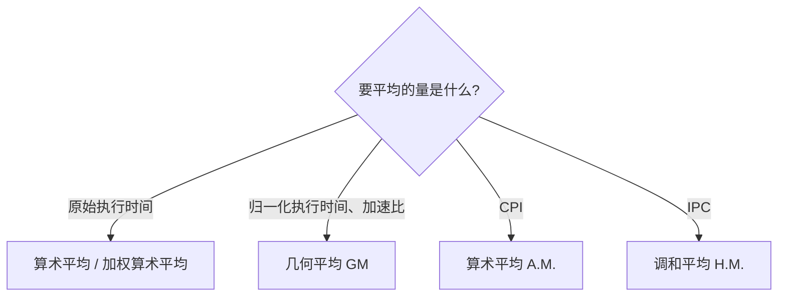
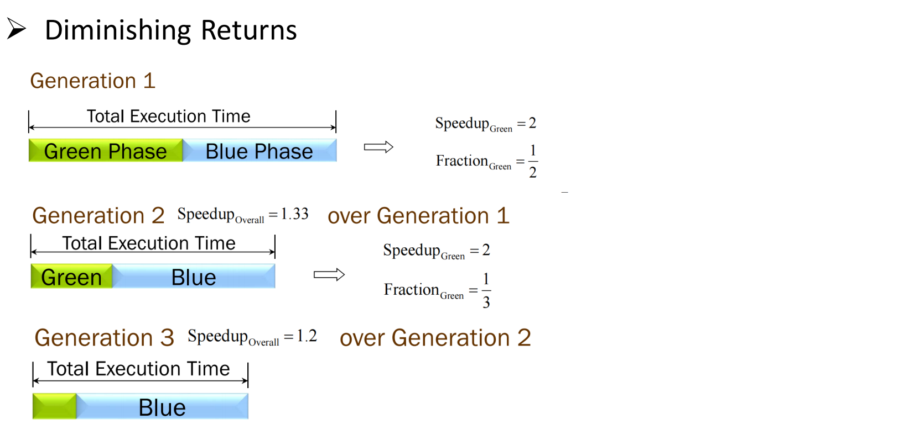

# 03 性能汇总与Amdahl定律

[本讲目录](../index.md) · [课程目录](../../index.md) · [上一节：02 CPI与性能铁律](02-cpi-and-iron-law.md) · [下一节：04 ISA抽象与RISC思想](04-isa-abstraction-and-risc.md)

> [!abstract] 本节要点
> - 跨多个程序汇总性能时：算术平均执行时间偏向长程序；加权算术平均的权重没有客观标准，换权重就能换"赢家"。
> - 归一化执行时间（相对参考机的比值）必须用几何平均 $\sqrt[n]{\prod_{i=1}^{n} \text{归一化时间}_i}$，它的结论与选哪台参考机无关；对归一化时间不能用算术平均。
> - 平均 CPI 用算术平均；平均 IPC 不能直接算术平均，必须用调和平均：$\text{Average IPC}=\dfrac{1}{\text{Average CPI}}=\text{HMean}(\text{IPC}_1,\dots,\text{IPC}_N)$。
> - Amdahl 定律：$\text{Speedup}_{\rm overall}=\dfrac{1}{(1-F)+F/S}$，$F$ 是**原执行时间**中可被加速部分的比例，$S$ 是该部分的加速比；所以要加速常见情况（约 90% 时间花在 10% 代码上）。
> - 反复加速同一部分收益递减（1.33 → 1.2）；性能提升还要与成本、售价和销量权衡；评估 ISA 有设计期、静态、动态三类指标，最好的指标是程序的执行时间。

## 跨程序汇总性能（Summarizing Performance）

"X 比 Y 快 $n$ 倍"只对**一个**程序有明确含义（定义见 [[01 性能指标与时钟]]）。一旦涉及多个程序，就会出现这样的情况：X 在程序 A 上比 Y 快 10 倍、在 B 上快 1.5 倍，而 Y 在 C 上比 X 快 2 倍、在 D 上快 3 倍。[^s1p15] 那么 X 和 Y 谁的性能更好、该买哪台？这需要一种把多个程序的结果**汇总**成一个数的方法，而不同的汇总方法会给出不同的答案。

### 算术平均（Arithmetic Mean）

**算术平均**执行时间就是把各程序的执行时间相加再除以程序个数：

$$
\text{AM} = \frac{1}{n}\sum_{i=1}^{n} \text{Time}_i
$$

它的问题是**偏向运行时间长的程序**：一个程序若指令数多、跑得久（例如 2 B 条指令对 0.5 B 条），它在总和中占的分量就大，短程序上的差别几乎被淹没。[^s1p16]

### 加权算术平均（Weighted Arithmetic Mean）

**加权算术平均**给每个程序一个权重 $w_i$（$\sum w_i = 1$）：

$$
\text{WAM} = \sum_{i=1}^{n} w_i \cdot \text{Time}_i
$$

它的好处是能突出更重要的程序；但问题随之而来——权重该怎么定？权重没有客观标准，而**换一组权重就可能让另一台机器看起来更好**。[^s1p16]

### 归一化执行时间与几何平均（Geometric Mean）

为了消除"长程序权重大"的影响，常见做法是先把每个程序的执行时间除以某台**参考机**（reference machine）上的执行时间，得到**归一化执行时间**（normalized execution time），即相对参考机的比值，再对这些比值求平均。这时出现一个关键事实，即 **算术平均的加速比 ≠ 加速比的算术平均**（Speedup of arithmetic means $\ne$ arithmetic mean of speedups）。[^s1p17]

对归一化执行时间应使用**几何平均**（geometric mean）：

$$
\text{GM} = \sqrt[n]{\prod_{i=1}^{n} \text{Normalized execution time on } i}
$$

即把 $n$ 个归一化时间相乘再开 $n$ 次方。它有一个很好的性质：**无论选哪台机器作参考机，比较结论都一致**（consistent whatever the reference machine）。因此，**不要对归一化执行时间使用算术平均**。[^s1p17]

几何平均之所以与参考机无关，是因为比值的乘积可以拆开：机器 X 与 Y 的几何平均之比为

$$
\frac{\text{GM}_X}{\text{GM}_Y}
=\frac{\sqrt[n]{\prod_i T_{X,i}/T_{R,i}}}{\sqrt[n]{\prod_i T_{Y,i}/T_{R,i}}}
=\sqrt[n]{\prod_{i=1}^{n}\frac{T_{X,i}}{T_{Y,i}}}
$$

参考机的时间 $T_{R,i}$ 在分子分母中完全约掉。

> [!example] 例：算术平均为何会被参考机"操纵"（补充算例）
> 两个程序 P1、P2，机器 A 的执行时间为 1 s、1000 s，机器 B 为 10 s、100 s。
>
> 1. **原始时间的算术平均**：A 为 $(1+1000)/2=500.5$ s，B 为 $(10+100)/2=55$ s，结论几乎完全由长程序 P2 决定。
> 2. **以 A 为参考机归一化**：A 为 (1, 1)，B 为 (10, 0.1)。算术平均：A = 1，B = 5.05，看起来 A 更好。
> 3. **以 B 为参考机归一化**：B 为 (1, 1)，A 为 (0.1, 10)。算术平均：B = 1，A = 5.05，看起来 B 更好——结论随参考机翻转。
> 4. **几何平均**：无论以谁为参考，$\text{GM}_B/\text{GM}_A=\sqrt{10\times0.1}=1$，两机持平，结论稳定。

> [!warning] 易错点
> "归一化之后求平均"本身没错，错在用算术平均。判断方法：只要被平均的量是**比值**（归一化时间、加速比），就用几何平均；被平均的是**原始时间**，才谈得上算术平均或加权平均。

## 平均 CPI 与调和平均 IPC

在体系结构研究中做比较时，往往两个 CPU 跑的是同一个（或同一组）程序、时钟频率也相同，此时由性能铁律可知执行时间只取决于 CPI，因此可以直接比较 CPI，而且更常用它的倒数 IPC（CPI、IPC 的定义见 [[02 CPI与性能铁律]]）。[^s1p18] 问题是：多个程序的 CPI 或 IPC 该怎么平均？

**平均 CPI** 直接用算术平均：

$$
\text{Average CPI} = \frac{\text{CPI}_1+\text{CPI}_2+\cdots+\text{CPI}_N}{N}
$$

但如果把 IPC 也这样算术平均，

$$
\frac{\text{IPC}_1+\text{IPC}_2+\cdots+\text{IPC}_N}{N} \ne \frac{1}{\text{Average CPI}}
$$

结果**不等于** 1/平均 CPI，也就不再与运行时间保持一致。要让平均 IPC 仍与运行时间相符，必须用**调和平均**（harmonic mean）。[^s1p19]

**调和平均**是"倒数关系量的平均"（average of inverse relationships）：先对各值取倒数，求算术平均，再取倒数：[^s1p20]

$$
\text{HMean}(x_1,x_2,\dots,x_n)=\frac{n}{\dfrac{1}{x_1}+\dfrac{1}{x_2}+\cdots+\dfrac{1}{x_n}}
$$

### 推导：平均 IPC 等于 IPC 的调和平均

由 $\text{IPC}=1/\text{CPI}$ 出发逐步代换：[^s1p21]

$$
\begin{aligned}
\text{Average IPC} &= \frac{1}{\text{Average CPI}}
= \frac{1}{\dfrac{\text{CPI}_1+\text{CPI}_2+\cdots+\text{CPI}_N}{N}}
= \frac{N}{\text{CPI}_1+\text{CPI}_2+\cdots+\text{CPI}_N} \\
&= \frac{N}{\dfrac{1}{\text{IPC}_1}+\dfrac{1}{\text{IPC}_2}+\cdots+\dfrac{1}{\text{IPC}_N}}
= \text{HMean}(\text{IPC}_1,\text{IPC}_2,\dots,\text{IPC}_N)
\end{aligned}
$$

1. 第一步：平均 IPC 定义为平均 CPI 的倒数。
2. 第二步：代入平均 CPI 的算术平均式，把分母中的 $1/N$ 翻到分子。
3. 第三步：用 $\text{CPI}_i = 1/\text{IPC}_i$ 替换，恰好得到调和平均的形式。

> [!tip] 课堂强调
> 拿到的数据是 IPC，就直接求调和平均；拿到的是 CPI，就先求 CPI 的算术平均再取倒数。两条路得到同一个平均 IPC。[^s2b7]

> [!note] 补充解释
> "平均 CPI 用算术平均能代表运行时间"隐含一个前提：各程序的指令数相同（且时钟相同）。此时总周期数 $=\text{IC}\sum_i \text{CPI}_i$，正比于 CPI 之和；而 IPC 的总和没有这样的物理意义，所以它只能借助倒数（调和平均）回到 CPI 上来。

> [!example] 例：两个程序的平均 IPC
> 程序 1 的 IPC = 2，程序 2 的 IPC = 0.5（指令数相同、时钟相同）。
>
> 1. 错误做法：$(2+0.5)/2 = 1.25$。
> 2. 正确做法：CPI 分别为 0.5 和 2，平均 CPI $=(0.5+2)/2=1.25$，平均 IPC $=1/1.25=0.8$。
> 3. 用调和平均验证：$\text{HMean}=\dfrac{2}{1/2+1/0.5}=\dfrac{2}{2.5}=0.8$，与第 2 步一致。

## Amdahl 定律（Amdahl's Law）

一项改进往往只能加速系统的一部分，而不是全部（What if enhancement does not enhance everything?）。Amdahl 定律回答的就是：**局部的加速对整体性能到底有多大影响**。

先回顾**加速比**（speedup）的定义：

$$
\text{Speedup}=\frac{\text{Execution Time without Enhancement}}{\text{Execution Time with Enhancement}}=\frac{\text{Execution Time}_{\rm old}}{\text{Execution Time}_{\rm new}}
$$

当改进只能在部分时间内起作用时，分母是"在可能之处使用改进后的执行时间"（Execution Time using Enhancement when Possible），分子是"完全不使用改进的执行时间"。[^s1p22]

### 推导

设 $F=\text{Fraction}_{\rm Enhanced}$ 为原执行时间中可以被改进的比例，$S=\text{Speedup}_{\rm Enhanced}$ 为这部分自身的加速比。

1. **不可改进部分**：占原时间的 $1-F$，改进后不变。
2. **可改进部分**：占原时间的 $F$，改进后缩短为 $F/S$。
3. **新执行时间**：两部分相加

$$
\text{Execution Time}_{\rm new}=\text{Execution Time}_{\rm old}\times\left[(1-F)+\frac{F}{S}\right]
$$

4. **整体加速比**：把 $\text{Execution Time}_{\rm old}$ 移到左边并取倒数

$$
\text{Overall Speedup}=\frac{\text{Execution Time}_{\rm old}}{\text{Execution Time}_{\rm new}}=\frac{1}{(1-F)+\dfrac{F}{S}}
$$

[^s1p22]

> [!warning] 易错点
> 定义中特意提醒"fraction of What?"：$F$ 是**改进前的执行时间**中的比例，不是代码行数比例、不是距离比例，也不是改进后时间中的比例。[^s1p22] 下面汽车例子中 Turbo 覆盖了 83% 的**距离**，但只覆盖 20% 的**时间**，代入公式的必须是后者。

> [!info] 可视化资源
> [Wikipedia：Amdahl's law](https://en.wikipedia.org/wiki/Amdahl%27s_law) 的首张图（AmdahlsLaw.svg）画出了不同可并行比例（50%～95%）下整体加速比随处理器数增长的曲线（处理器数相当于可并行部分的加速比 $S$）：$S\to\infty$ 时加速比趋近上限 $1/(1-F)$，例如 $F=0.5$ 时最多 2 倍，$F=0.95$ 时最多 20 倍。

### 加速常见情况（Make the Common Case Fast）

Amdahl 定律最直接的推论是：**让常见情况变快**。比较两种改进：[^s1p23]

| 方案 | $\text{Speedup}_{\rm Enhanced}$ | $\text{Fraction}_{\rm Enhanced}$ | 整体加速比 |
| --- | --- | --- | --- |
| 大幅加速一个少见部件 | 20 | 0.1 | $\dfrac{1}{(1-0.1)+0.1/20}=\dfrac{1}{0.905}=1.105$ |
| 小幅加速常见部分 | 1.2 | 0.9 | $\dfrac{1}{(1-0.9)+0.9/1.2}=\dfrac{1}{0.85}=1.176$ |

把只占 10% 时间的部件加速 20 倍，整体只快约 10.5%；而把占 90% 时间的部分只加速 20%，整体反而快约 17.6%。

这与**局部性原理**（principle of locality）相呼应：程序大约 **90% 的时间花在 10% 的代码上**。[^s1p23] 这 10% 的代码量虽小，却占了大部分时间，优化它收益最高；反过来，一项改进即使对 80% 的代码都有效，只要那部分代码不是瓶颈，整体收益也很小。

### 收益递减（Diminishing Returns）

如果反复只优化同一部分，每一代的收益会越来越小，这就是**收益递减**（diminishing returns）。[^s1p24] 设程序由绿色阶段（Green Phase）和蓝色阶段（Blue Phase）组成：

1. **第 1 代 → 第 2 代**：绿色阶段占总时间 $\text{Fraction}_{\rm Green}=1/2$，将其加速 $\text{Speedup}_{\rm Green}=2$。
   新时间 $=\tfrac12+\tfrac14=\tfrac34$，$\text{Speedup}_{\rm Overall}=\dfrac{1}{(1-\tfrac12)+\tfrac{1/2}{2}}=\dfrac{1}{0.75}=1.33$。
2. **第 2 代 → 第 3 代**：在第 2 代中绿色只剩 $\tfrac{1/4}{3/4}=\tfrac13$，再加速 2 倍。
   $\text{Speedup}_{\rm Overall}=\dfrac{1}{(1-\tfrac13)+\tfrac{1/3}{2}}=\dfrac{1}{5/6}=1.2$。
3. **继续下去**：绿色占比越来越小，蓝色逐渐成为主导，同样的"2 倍"带来的整体提升不断下降。

所以不能只盯着一个部分反复优化：第一次效果最好，越往后越小，被优化部分缩小后，原先不起眼的部分会成为新瓶颈。

> [!warning] 易错点
> 第 1 代到第 2 代执行时间从 1 降到 0.75，**减少了 25%**（课堂口述说成“降低了 33%”，混淆了两种百分比），加速比为 1.33；图中的 1/3 是第 2 代里绿色阶段**所占的比例**，不是时间减少量。注意区分"时间减少百分比"$1-1/\text{Speedup}$ 与"加速百分比"$\text{Speedup}-1$。

> [!example] 例：Turbo 汽车
> 从 SIT 开车到 Sinchon 校区，车上装了 Turbo（涡轮增压），但只能在高速上用。[^s1p25]
>
> - 高速到城市边界 50 km：平均 100 km/h，用 Turbo 后 200 km/h；
> - 城市边界到校区 10 km：晚高峰堵车，平均 5 km/h。
>
> 1. 无 Turbo：高速 $50/100=0.5$ h，城区 $10/5=2$ h，共 **2.5 h**。
> 2. 有 Turbo：高速 $50/200=0.25$ h，城区仍 2 h，共 **2.25 h**。
> 3. Turbo 在 $50/60\approx83\%$ 的**距离**上带来 100% 的加速（2 倍），但总行程时间只减少 $0.25/2.5=10\%$，加速比 $2.5/2.25=1.111$，即仅 **11.1%** 的加速。
> 4. 用 Amdahl 定律验证：高速段占原**时间**的 $F=0.5/2.5=0.2$，$S=2$，$\text{Speedup}=\dfrac{1}{0.8+0.2/2}=\dfrac{1}{0.9}=1.111$。
>
> 结论：时间大部分花在城区，城区才是瓶颈；代码中也是一样，优化非瓶颈部分收益甚微。

> [!note] 补充解释
> 原幻灯片速度单位写作 "km/h MPH"，按题中数据应为 km/h。[^s1p25]

## 性价比（Price-Performance）

性能提升本身不是目的，计算机架构师需要在性能、成本与市场之间做**权衡**（trade-off）。继续 Turbo 汽车的例子：[^s1p26]

| | 不带 Turbo | 带 Turbo |
| --- | --- | --- |
| 制造成本 | \$8,000 | \$8,000 + \$3,000 = \$11,000 |
| 售价 | \$12,000 | \$16,000 |
| 单车利润 | \$4K | \$5K |
| 销量 | 10,000 辆 | 400 辆（只有少数发烧友买） |
| 总利润 | **\$40M** | **\$2M** |

单车利润更高，总利润却从 \$40M 跌到 \$2M——而且这个 Turbo 只带来了 11.1% 的实际加速。

CPU 设计同理，加入一项性能改进前要回答：[^s1p27]

1. 加入这项改进要花多少成本？
2. 实际能得到多少**有效**性能？（汽车例子说明：只在小部分时间里加速 100% 并不划算。）
3. 要为它多收多少钱？——额外的开发、测试、市场推广成本。
4. 能多收多少钱？——市场是否在乎？
5. 价格变化会如何影响销量？

## ISA 的评估指标

评估一个指令集体系结构（ISA）时，不同设计阶段和场景关注不同的指标：[^s1p28]

- **设计期指标**（design-time metrics）：能否实现、要多久、成本多少？能否编程、是否易于编译？
- **静态指标**（static metrics）：程序在内存中占多少字节（代码体积）？
- **动态指标**（dynamic metrics）：
  - 执行了多少条指令？处理器为执行程序要取多少字节？
  - 每条指令需要多少个时钟周期？
  - 实际可行的时钟周期能做到多"精简"（多短）？

**最好的指标是程序的执行时间**（Time to execute the program），它取决于指令集、处理器组织和编译技术三者。[^s1p28] 这些因素彼此牵连：例如 ISA 同时影响指令数和 CPI，处理器组织同时影响 CPI 和时钟周期，单独优化一项会波及其他项（各因素的关系见 [[02 CPI与性能铁律]]）。

> [!question]- 自测：某程序中浮点运算占原执行时间的 40%，把浮点单元加速 4 倍，整体加速比是多少？若浮点单元无限快呢？
> 整体加速比 $=1/(0.6+0.4/4)=1/0.7\approx1.43$。浮点单元无限快时 $F/S\to0$，加速比上限为 $1/0.6\approx1.67$——不可加速的 60% 决定了天花板。

> [!question]- 自测：三个程序的 IPC 分别为 1、2、4（指令数与时钟相同），平均 IPC 是多少？算术平均会高估多少？
> 调和平均 $=3/(1+0.5+0.25)=3/1.75\approx1.71$；等价地，平均 CPI $=(1+0.5+0.25)/3\approx0.583$，取倒数得 1.71。算术平均 $(1+2+4)/3\approx2.33$，高估约 36%，因为它让 IPC 大的程序占了过多分量。

> [!question]- 自测：某厂商以机器 R 为参考，报告新机器在一组基准上"归一化执行时间的算术平均更小"，换用另一台参考机后结论反转。应该改用什么平均？为什么能解决？
> 应改用几何平均。两台机器几何平均之比等于 $\sqrt[n]{\prod_i T_{X,i}/T_{Y,i}}$，参考机时间被约掉，所以结论与参考机无关；算术平均没有这个性质。

> [!info]- 来源
> - L02.pdf：PDF p.15–28
> - L02.docx：DOCX body 244–324

[^s1p15]: L02.pdf-PDF p.15
[^s1p16]: L02.pdf-PDF p.16
[^s1p17]: L02.pdf-PDF p.17
[^s1p18]: L02.pdf-PDF p.18
[^s1p19]: L02.pdf-PDF p.19
[^s1p20]: L02.pdf-PDF p.20
[^s1p21]: L02.pdf-PDF p.21
[^s2b7]: L02.docx-DOCX body 244-280
[^s1p22]: L02.pdf-PDF p.22
[^s1p23]: L02.pdf-PDF p.23
[^s1p24]: L02.pdf-PDF p.24
[^s1p25]: L02.pdf-PDF p.25
[^s1p26]: L02.pdf-PDF p.26
[^s1p27]: L02.pdf-PDF p.27
[^s1p28]: L02.pdf-PDF p.28

[本讲目录](../index.md) · [课程目录](../../index.md) · [上一节：02 CPI与性能铁律](02-cpi-and-iron-law.md) · [下一节：04 ISA抽象与RISC思想](04-isa-abstraction-and-risc.md)
