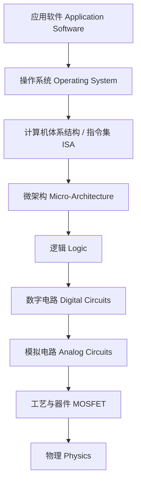
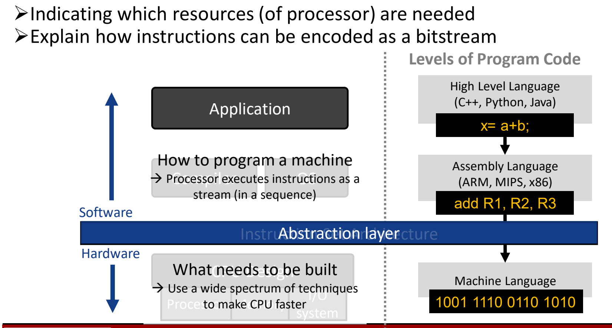
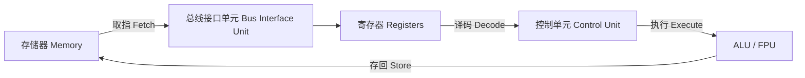
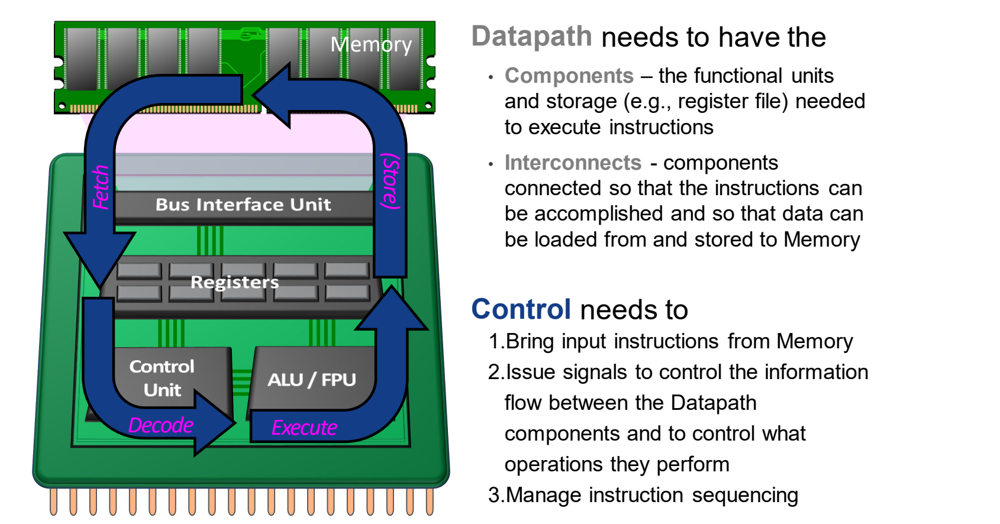

# 04 ISA抽象与RISC思想

[本讲目录](../index.md) · [课程目录](../../index.md) · [上一节：03 性能汇总与Amdahl定律](03-performance-summary-and-amdahls-law.md) · [下一节：05 RISC-V概览与指令格式](05-risc-v-overview-and-instruction-formats.md)

> [!abstract] 本节要点
> - ISA 位于操作系统与微架构之间，是软件与硬件的抽象层：对下规定处理器需要哪些资源，对上规定指令如何编码为比特流。
> - ISA 与 OS 都处在软硬件之间，但 OS 宏观地调度硬件资源、服务上层软件；ISA 是编译器与处理器之间的“契约”，多种不同的 CPU 实现可以遵循同一 ISA。
> - 好的抽象（好的 ISA）应当：历经多代仍可用（可移植性）、适用多种场景（通用性）、为上层提供便利功能、允许下层高效实现。
> - 冯·诺依曼处理器 = 数据通路（功能部件 + 存储 + 互连）+ 控制（取指令、发控制信号、管理指令顺序）。
> - CISC 诞生于存储昂贵、手写汇编的年代，指令密集（1–15 字节）、对程序员友好、对硬件不友好；RISC 采用定长指令、load-store、少寻址方式、少操作，指令更多但每条更快，今天 99% 的处理器是 RISC。

## ISA：软件与硬件之间的抽象层

软件希望“不关心处理器内部长什么样”就能写程序，硬件设计者希望“不关心上层跑什么程序”就能放手优化 CPU。两者之间需要一层双方共同遵守的约定，这就是指令集体系结构。这里只关注 ISA 在整个系统层次中的位置与作用。

在从应用软件到物理的抽象层次中，**指令集体系结构**（Instruction Set Architecture, ISA）位于操作系统（线程、文件、异常）之下、微架构（执行流水线）之上：[^s1p30]



ISA 同时面向两侧，承担两项职责：[^s1p31]

1. **对硬件**：指明实现上层软件需要处理器提供哪些资源（寄存器、功能部件、存储访问方式等）。硬件一侧回答“需要造什么”（what needs to be built），可以用各种各样的技术让 CPU 更快。
2. **对软件**：说明指令如何编码成比特流（bitstream），让上层软件知道怎样把要实现的功能翻译成下层可执行的形式。软件一侧回答“怎样为机器编程”（how to program a machine）：处理器把指令当作一个按顺序执行的流。

从代码的角度，同一段计算要经过三个层次：

| 层次 | 例子 | 说明 |
| --- | --- | --- |
| 高级语言（C++、Python、Java） | `x = a + b;` | 程序员书写，与具体机器无关 |
| 汇编语言（ARM、MIPS、x86） | `add R1, R2, R3` | 用助记符直接书写 ISA 指令 |
| 机器语言 | `1001 1110 0110 1010` | CPU 真正能识别的 0/1 编码 |

汇编语言本身只是服务于 ISA 的一种书写形式；CPU 真正识别的是机器码。ISA 这条“抽象层”恰好横在汇编与机器码之间、软件与硬件之间。



### ISA 与操作系统的区别

ISA 和 OS 都处在软件与硬件之间，但作用不同：

- **操作系统**更宏观：它调度硬件资源（处理器时间、内存、文件、设备），为上层软件提供服务。
- **ISA** 更贴近处理器：它是编译器（及汇编程序员）与处理器之间的**契约**（contract）。对上，它告诉软件怎样把应用编译成底层硬件“看得懂”的指令；对下，它告诉硬件必须实现哪些功能，硬件据此做具体设计。

“契约”的关键含义是：底层的 CPU 实现可以千差万别，只要都遵循同一个指令集（同一种“语言”、同一本“字典”），上层软件就无需知道处理器内部长什么样，只要把功能表达成这门语言即可。[^s2b8]

> [!warning] 易错点
> “ISA”与“微架构”不是一回事。ISA 规定指令、寄存器、编码等程序员可见的接口；微架构（如流水线级数、缓存大小）是对 ISA 的某种具体实现。同一 ISA 可以有多种微架构实现，例如不同厂商、不同代际的 x86 处理器运行同一份 x86 机器码。

### 指令集的定义与好抽象的性质

计算机的“语言”中，单词叫作**指令**（instruction），全部词汇叫作**指令集**（instruction set）：指令集就是这台机器能识别的全部指令。[^s1p35]

市面上 x86、ARM、MIPS、RISC-V 等指令集看似各不相同，本质却很相似，原因有二：所有计算机都由基于相似原理的硬件技术构建（今天的 CPU 都源自冯·诺依曼结构），并且有少数几种基本操作是所有计算机都必须提供的。计算机设计者的共同目标是：找到一种语言，使**硬件和编译器都容易构建**，同时**性能最大化、成本与能耗最小化**。[^s1p35]

ISA 是一个关键接口（a critical interface）。一个好的抽象应满足四条性质：[^s1p34]

1. **历经多代仍然可用**（portability，可移植性）：换了不同的处理器设计、移植到别的处理器上，软件照样能用。
2. **可以多种方式使用**（generality，通用性）：放在不同的应用场景下都能用起来。
3. **为上层提供便利的功能**：软件（编译器、程序员）容易基于它编码。
4. **允许下层高效实现**：芯片设计者能够高效地把它实现出来。

这四条与《人月神话》（*The Mythical Man-Month*, Brooks, p.44）的观点一致：在功能一定的前提下，最好的系统是能以最简单、最直接的方式描述事物的系统；简单直接来自**概念完整性**（conceptual integrity），而易用性要求设计的统一。[^s1p32] 落到体系结构上，就是一个概念完整的好 ISA 会让整个处理器的设计更简单、更好。

ISA 的设计还会影响性能铁律中的指令数与 CPI 等因素，度量 ISA 优劣的指标见 [[03 性能汇总与Amdahl定律]]。

## 冯·诺依曼处理器组织

各种 ISA 之所以相似，是因为它们都基于**冯·诺依曼结构**（von Neumann architecture）：指令和数据都存放在存储器中，处理器反复从存储器取指令、执行。要理解 ISA 规定的“处理器资源”指什么，先要知道这种处理器由哪些部分组成。

冯·诺依曼处理器由**数据通路**（datapath）和**控制**（control）两部分组成：[^s1p36]

**数据通路**需要具备：

- **部件**（components）：执行指令所需的**功能单元**（functional units，如 ALU、FPU）和**存储**（storage，如寄存器堆 register file）。
- **互连**（interconnects）：把各部件连接起来，使指令能够完成，并使数据能从存储器载入、存回存储器。

**控制**需要完成三件事：

1. 从存储器取入指令（bring input instructions from Memory）；
2. 根据指令信息发出控制信号，控制数据通路部件之间的信息流动以及各部件执行什么操作；
3. 管理指令的执行顺序（instruction sequencing）。

光有部件和互连还不够，它们都是被动的硬件，必须由控制单元协调才能协同完成一条指令。一条指令在这种组织中的流动顺序是：





> [!tip] 课堂强调
> 图中的 Fetch → Decode → Execute → (Store) 与熟悉的五级流水线相比少了一步——写回（Write Back）。这是有意留下的：执行结果写回寄存器这一步并未画出。[^s2b9]

## CISC：资源受限年代的选择

ISA 的设计哲学由当时的技术约束决定。早期计算机面临两个约束：[^s1p37]

1. **存储器非常昂贵、容量非常小**。例如 IBM 的第一块硬盘装满一个机柜，总容量只有 5 MB，还不如今天一个 U 盘。因此需要尽可能压缩指令和程序的体积。
2. **大多数程序员用汇编语言编程**。当时普遍没有 C 这样的高级语言，程序员直接基于 ISA 写代码，ISA 是否好懂、好写至关重要。

在这两个约束下诞生了**复杂指令集计算机**（Complex Instruction Set Computer, CISC），其特点是：[^s1p37]

- **指令密集**（dense instruction size），指令长度为 1～15 字节不等，对内存占用做了极致压缩：能用一条指令完成的操作，就压缩成一条指令。
- **对程序员友好**：要做乘法就直接写一条乘法指令，不用管数据在哪里，由硬件自己处理。
- **复杂度不断增长**：几乎每个月新增一条指令。程序员必须持续学习厂商（如 Intel、AMD）每代处理器新增的大量指令，否则拿不到性能提升。
- **对硬件不友好**：复杂指令使编译器、寄存器设计和处理器内部的状态机都变得复杂，硬件代价很大。

> [!example] 例：用 CISC 实现 `a = a * b`
> 设 `a` 存放在存储器位置 `2:3`，`b` 存放在位置 `5:2`。CISC 只需一条指令：
>
> ```asm
> MULT 2:3, 5:2
> ```
>
> 这条指令只含一个操作码和两个存储器操作数，由硬件自己完成“读 a、读 b、相乘、结果写回 a 的位置”的全部步骤，因此程序占用的内存最小。[^s1p37]

> [!note] 补充解释
> `2:3`、`5:2` 这种写法源自一个常见的教学模型：把存储器看作按“行:列”编号的格子，`2:3` 表示第 2 行第 3 列的存储单元。它不是某个真实 ISA 的语法，仅用于对比两种设计哲学。

> [!tip] 课堂强调
> 手写汇编至今仍有价值。例如国产 AI 加速卡往往按“同一负载下相对英伟达 GPU 的性能”定价，编译器生成的代码效率不够高时，厂商会专门安排工程师手写汇编把硬件性能“吃满”。[^s2b10]

## RISC：精简指令集的设计哲学

当存储变便宜、编译器取代手写汇编之后，CISC 复杂指令带来的硬件代价就不再划算。**精简指令集计算机**（Reduced Instruction Set Computer, RISC）的设计哲学有四条：[^s1p38]

1. **定长指令**（fixed instruction lengths）；
2. **load-store 指令集**（load-store instruction sets）：访存（load/store）与计算分开，只有 load/store 访问存储器，运算指令只操作寄存器。这与冯·诺依曼结构中计算部件与存储部件分离的组织方式一致；
3. **有限的寻址方式**（limited addressing modes）；
4. **有限的操作种类**（limited operations）。

> [!example] 例：用 RISC 实现 `a = a * b`
> 同样设 `a` 在 `2:3`、`b` 在 `5:2`。RISC 必须先把操作数载入寄存器，在寄存器间计算，再存回：[^s1p38]
>
> ```asm
> LOAD  A, 2:3     ; 从存储器 2:3 读 a 到寄存器 A
> LOAD  B, 5:2     ; 从存储器 5:2 读 b 到寄存器 B
> PROD  A, B       ; 寄存器相乘，结果放入 A
> STORE 2:3, A     ; 把 A 写回存储器 2:3
> ```
>
> 对比：CISC 1 条指令，RISC 4 条指令。

只看指令数，RISC 似乎更差。但由性能铁律 $\text{CPU time} = \text{IC} \times \text{CPI} \times \text{CC}$（见 [[02 CPI与性能铁律]]），指令数只是三个因素之一：

- CISC 的一条复杂指令可能需要多个周期（例如 5 个周期）才能执行完；
- RISC 每条简单指令可能只需 1 个周期；
- 指令简单后，硬件更简单，CPU 还可能运行在更高的时钟频率（更短的时钟周期）。

因此 RISC 虽然指令更多，却有机会整体更快。这就是 IC 与 CPI、时钟周期之间的权衡。[^s2b10]

典型的 RISC 指令集有 ARM、RISC-V、MIPS、Sun SPARC、HP PA-RISC、IBM PowerPC、Intel（Compaq）Alpha 等。[^s1p38] ARM 几乎用于所有手机；RISC-V 目前在产品中还少见，但开源、前景广阔，详见 [[05 RISC-V概览与指令格式]]。[^s2b10]

下表对比两种设计哲学：

| 维度 | CISC | RISC |
| --- | --- | --- |
| 诞生背景 | 存储昂贵、手写汇编 | 存储便宜、依赖编译器 |
| 指令长度 | 变长，1～15 字节 | 定长 |
| 访存方式 | 运算指令可直接操作存储器 | load-store：只有 load/store 访存 |
| 寻址方式与操作 | 多且复杂，持续新增 | 有限 |
| `a = a * b` 指令数 | 1 条 | 4 条 |
| 每条指令 | 复杂、多周期 | 简单、易做到单周期、利于提频 |
| 友好对象 | 程序员 | 硬件与编译器 |

> [!warning] 易错点
> “RISC 指令数多，所以更慢”是错误推理。比较性能必须同时看 IC、CPI 和时钟周期；RISC 用更多的指令换来更低的 CPI 和更短的时钟周期。

## RISC 的过去、现在与未来

RISC 思想已经主导了今天的处理器市场，分两个时代来看：[^s1p39]

**PC 时代**：

- x86 硬件在内部把 x86 指令翻译成类 RISC 的微操作（RISC-like micro-instructions），然后在微处理器（MPU）内部使用各种 RISC 技术执行。也就是说，x86 对外支持 CISC 指令，内部实际运行的是 RISC 风格的核心。
- 每年出货量超过 3.5 亿（> 350M / year）；x86 ISA 最终同时统治了服务器和桌面。

**后 PC 时代（PostPC Era：客户端 / 云）**：

- 处理器以 IP 核的形式集成在**片上系统**（System on Chip, SoC）中，而不再是独立的 MPU。手机、嵌入式设备、电视、摄像头等都属于 SoC，其处理单元基本基于 RISC。
- 芯片面积和能耗与性能同等重要。
- 2017 年处理器总出货量超过 200 亿颗（> 20B / year）。
- PC 中的 x86 在 2011 年达到峰值，此后每年下降约 8%（2016 年的出货量低于 2007 年）。
- x86 服务器演变为云，总量约 1000 万台，仅占 200 亿的 0.05%。
- 部分服务器也开始采用 RISC，因为服务器同样需要节能，而 RISC 比 x86 更省能耗、性能也不差。

结论：**今天 99% 的处理器是 RISC**。[^s1p39] 这也是本课程讲授 RISC-V、而不讲较老的 IA-32/x86 的原因。[^s2b10]

> [!question]- 自测：某 CISC 机器用 1 条指令完成 `a = a * b`，CPI 为 5；某 RISC 机器用 4 条指令完成，每条 CPI 为 1，且时钟频率是 CISC 机器的 1.5 倍。哪台更快？
> RISC 更快。CISC 时间 $=1\times5\times T=5T$；RISC 时间 $=4\times1\times\frac{T}{1.5}\approx2.67T$。RISC 指令数是 CISC 的 4 倍，但更低的 CPI 和更短的时钟周期足以抵消。

> [!question]- 自测：Intel 和 AMD 的两款 x86 处理器流水线深度、缓存大小都不同，为什么同一个可执行文件能在两者上运行？这说明了 ISA 的什么作用？
> 因为两者实现的是同一个 ISA。ISA 是编译器与处理器之间的契约，只规定指令、资源和编码，不规定内部实现；流水线和缓存属于微架构。这体现了好抽象的“可移植性”。

> [!question]- 自测：在冯·诺依曼处理器中，“根据指令决定 ALU 做加法还是减法”属于数据通路还是控制？寄存器堆又属于哪一部分？
> 前者属于控制：控制单元发出信号，决定数据通路部件执行什么操作。寄存器堆属于数据通路中的部件（存储），与 ALU 等功能单元一起由互连连接。

> [!info]- 来源
> - L02.pdf：PDF p.30–32, 34–39
> - L02.docx：DOCX body 281–407

[^s1p30]: L02.pdf-PDF p.30
[^s1p31]: L02.pdf-PDF p.31
[^s2b8]: L02.docx-DOCX body 281-324
[^s1p35]: L02.pdf-PDF p.35
[^s1p34]: L02.pdf-PDF p.34
[^s1p32]: L02.pdf-PDF p.32
[^s1p36]: L02.pdf-PDF p.36
[^s2b9]: L02.docx-DOCX body 325-371
[^s1p37]: L02.pdf-PDF p.37
[^s2b10]: L02.docx-DOCX body 372-407
[^s1p38]: L02.pdf-PDF p.38
[^s1p39]: L02.pdf-PDF p.39

[本讲目录](../index.md) · [课程目录](../../index.md) · [上一节：03 性能汇总与Amdahl定律](03-performance-summary-and-amdahls-law.md) · [下一节：05 RISC-V概览与指令格式](05-risc-v-overview-and-instruction-formats.md)
