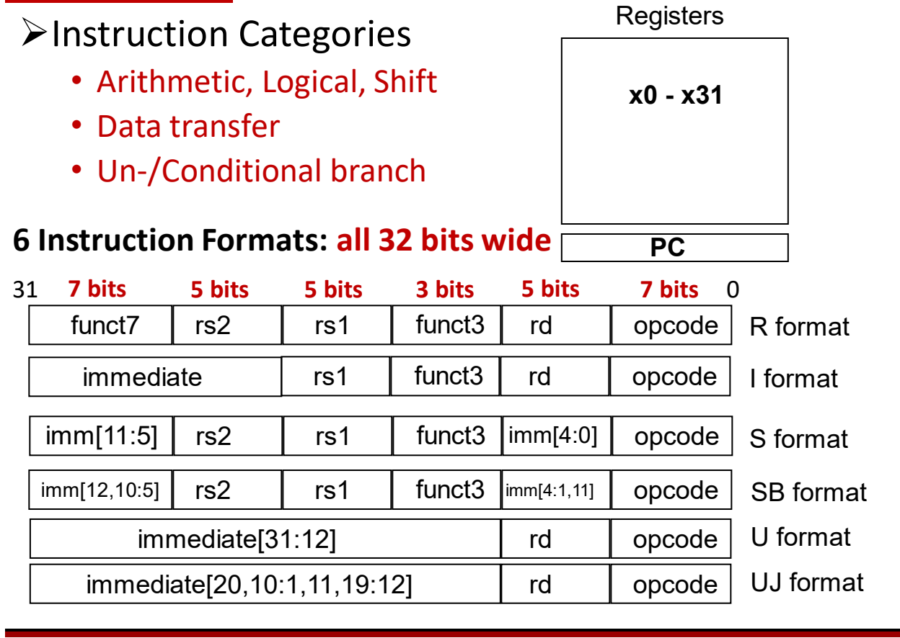

# 05 RISC-V概览与指令格式

[本讲目录](../index.md) · [课程目录](../../index.md) · [上一节：04 ISA抽象与RISC思想](04-isa-abstraction-and-risc.md) · [下一节：06 算术与访存指令](06-arithmetic-and-memory-instructions.md)

> [!abstract] 本节要点
> - RISC-V 是 2010 年起源于 UC Berkeley 的**开放** RISC 指令集标准：任何人都可以据此构造兼容的计算机并使用配套软件，而 x86、ARM、Power、MIPS、SPARC 等都受专利保护。
> - 设计目标：完全开放；不为某种微架构风格或实现技术“过度设计”；采用“小的基础整数 ISA + 可选标准扩展 + 可选自定义扩展”的模块化结构。
> - 命名规则为 RV + 字长 + 扩展，如 RV32I；标准扩展 M/A/F/D/C，$G = \text{IMAFD}$；本课程以 64 位（RV64）为准，但**指令长度固定 32 位**，寄存器/数据宽度为 64 位。
> - 6 种指令格式 R/I/S/SB/U/UJ 全部 32 位宽，opcode 总在 bit 6:0，rd、funct3、rs1、rs2 在各格式中位置固定。
> - 立即数被“打散”是为了让同一立即数位尽量落在同一指令位上（符号位总在 bit 31，imm[10:5] 总在 bit 30:25 等），从而简化译码和符号扩展的硬件。

## RISC-V 的来历、开放性与设计目标

主流 ISA（x86、ARM、Power、MIPS、SPARC）都受商业专利保护，这阻碍了人们实际复现或自行构造与之兼容的计算机系统；基于这些 ISA 做开发需要授权，否则会面临法律风险。RISC-V 就是为打破这一限制而提出的。

**RISC-V**（读作 “risk-five”）是一个 ISA 标准：一个基于精简指令集计算（RISC）思想、开源的指令集体系结构。它**开放**，允许任何个人或团体构造兼容的计算机，并使用相关的软件。[^s1p40]

- **起源**：2010 年由 UC Berkeley 的 Krste Asanović、David Patterson 及其学生提出。
- **名字中的 “V”**：此前已有 RISC-I、II、III、IV；RISC-V 是这一系列的第五代，但它与之前的 RISC 指令集**不兼容**，指令编码各不相同。
- **2017 年版本**：用户态 ISA 第 2 版固定下来，包括
  - User-Level ISA Specification v2.2
  - Draft Compressed ISA Specification v1.79
  - Draft Privileged ISA Specification v1.10

RISC-V 与 CISC/RISC 哲学的一般对比以及 RISC 的市场现状见 [[04 ISA抽象与RISC思想]]，这里只关注 RISC-V 本身。

> [!tip] 课堂强调
> RISC-V ISA 是本课程的重点。[^s2b8] 开放性是 RISC-V 最核心的优点：使用受专利保护的商业 ISA 若未获授权会被起诉，而在中美科技竞争、可能遭遇禁运的背景下，开放的 RISC-V 是可行的替代，同学们将来很可能要为它写编译器或汇编代码。开放也不意味着“只能做开源芯片”：基于 RISC-V 的芯片可以作为商业产品出售，例如 SiFive 专门为客户设计 RISC-V 芯片。为避免受单一国家的长臂管辖，RISC-V 的标准组织迁到了欧洲（瑞士）。[^s2b10]

### 设计目标与模块化结构

一个 ISA 如果绑定某种实现方式，就会限制后来者的设计空间；如果把所有功能都设为必选，又会让小型嵌入式芯片背上不必要的负担。RISC-V 的设计目标正是针对这两点：[^s1p41]

1. **完全开放**：对学术界和工业界都免费可用。
2. **避免“过度架构”**（over-architecting）：不针对某一种
   - 微架构风格（如微码实现 microcoded、顺序 in-order、解耦 decoupled、乱序 out-of-order），
   - 也不针对某一种实现技术（如全定制 full-custom、ASIC、FPGA），

   但又允许在其中任何一种上高效实现。ISA 只规定指令集本身，底层怎么实现由设计者决定。
3. **模块化**：RISC-V ISA 由三部分组成
   - 一个**小的基础整数 ISA**（base integer ISA），本身就可以单独使用，作为定制加速器的基础或用于教学；
   - **可选的标准扩展**（standard extensions），用于支持通用软件开发；
   - **可选的自定义扩展**（custom extensions）。
4. 支持 2008 年修订版 **IEEE-754** 浮点标准。

整体原则是**保持非常简单且可扩展**，并把规范拆成多份独立文档：[^s1p42]

| 规范 | 内容 | 用途 |
| --- | --- | --- |
| User-Level ISA spec | 计算类指令 | 普通程序的运算、访存、控制 |
| Compressed ISA spec | 16 位指令 | 嵌入式等资源受限场景，压缩代码体积 |
| Privileged ISA spec | 管理态（supervisor-mode）指令 | 操作系统、虚拟化等需要特权的场合；普通用户不能执行 |
| 更多…… | — | — |

压缩指令存在的理由是：嵌入式设备的存储资源有限，能把指令（及代码）体积压小，对它们非常重要。特权指令存在的理由是：有些操作（例如云计算中的虚拟化管理）只能由超级用户执行，必须和普通指令区分开。

## 命名规则与标准扩展

有了“基础 + 扩展”的模块化结构，就需要一种简洁的写法说明某个处理器到底支持哪些模块。

**RISC-V 命名规则**：ISA 支持情况写成 **RV + 字长（word-width）+ 所支持的扩展**。例如 **RV32I** 表示支持 I（Integer，整数）指令集的 32 位 RISC-V。[^s1p42] 字长决定处理器能处理的数据宽度，常见的是 32 位和 64 位。

**用户级 ISA**（User-Level ISA）定义普通计算所需的指令，由一个必选的基础整数 ISA 和若干扩展组成：[^s1p43]

- **I：整数指令**（必选），包括
  - ALU 运算（加减、逻辑等）
  - 分支 / 跳转（branches/jumps）
  - 取数 / 存数（loads/stores）
- **标准扩展**：
  - **M**：整数乘法与除法（Integer Multiplication and Division）
  - **A**：原子指令（Atomic Instructions）
  - **F**：单精度浮点（Single-Precision Floating-Point）
  - **D**：双精度浮点（Double-Precision Floating-Point）
  - **C**：压缩指令（Compressed Instructions，16 位）
- **G = IMAFD**：整数基础 + 四个标准扩展，即“通用”（general-purpose）组合。
- 其他可选扩展。

C 扩展不包含在 G 中：压缩指令的适用范围较窄，主要用于嵌入式系统，所以通用组合默认不加它。

> [!example] 例：解读 ISA 名称
> 1. RV32I：32 位字长，只支持基础整数指令集。
> 2. RV64G：64 位字长，支持 I、M、A、F、D，等价于 RV64IMAFD。
> 3. RV64GC：在 RV64G 的基础上再支持 16 位压缩指令。

> [!tip] 课堂强调
> RISC-V 的字长一般是 32 位或 64 位（规范还允许其他宽度）。本课程后续统一以 **64 位 RISC-V** 为准，因为 64 位更常见。

原子指令（A 扩展中的 lr/sc 等）的语义见 [[08 同步指令与寻址方式]]。

## 指令的组成与指令分类

在 [[04 ISA抽象与RISC思想]] 的冯·诺依曼组织中，指令和数据都放在存储器里。落到 RISC-V 上，一条指令要回答两个问题：做什么操作、对谁操作。

**指令**（instruction）= **操作码**（opcode）+ **操作数说明**（operand specifiers）。[^s1p44]

- **指令在哪里**：默认存放在存储器（memory）中，由**程序计数器**（Program Counter，PC）寄存器指向当前要执行的指令。
- **操作数在哪里**：在存储器或寄存器中；具体访问哪一处（或两处都访问）由寻址方式决定（四种寻址方式见 [[08 同步指令与寻址方式]]）。
- **操作码分三大类**：
  1. 访存（memory access）
  2. 算术 / 逻辑计算（arithmetic/logical computation）
  3. 控制（control，如分支），控制类又分为跳转与条件分支

> [!note] 补充解释
> 在后续学习的乱序执行处理器中，指令除了存放在存储器里，还会暂存在处理器内部的**指令窗口**（instruction window）中。这里先只考虑存储器。

RISC-V ISA 的基本情况可以总结为：[^s1p45]

- **指令类别**：算术 / 逻辑 / 移位（Arithmetic, Logical, Shift）；数据传输（Data transfer）；无条件 / 条件分支（Un-/Conditional branch）。
- **寄存器**：32 个通用寄存器 `x0`–`x31`，外加 PC。各寄存器的用途约定见 [[06 算术与访存指令]]。
- **指令格式**：6 种，**全部 32 位宽**。

> [!warning] 易错点
> “64 位 RISC-V”中的 64 位指的是**寄存器 / 数据宽度**，不是指令长度。RV64 的（非压缩）指令长度仍然是 **32 位**；寄存器长度是 **64 位**。[^s2b11]

## 6 种 32 位指令格式

所有指令都等长 32 位，硬件取指时不必先判断指令有多长；而把不同类型指令的共同字段放在固定位置，又能让译码器不用先识别格式就开始读寄存器号。6 种格式就是在“定长 32 位”约束下，为不同操作数组合分配字段的方案。

各字段含义：

- **opcode**（7 位，bit 6:0）：操作码，所有格式都在最低 7 位。
- **rd**（5 位，bit 11:7）：目的寄存器。
- **funct3**（3 位，bit 14:12）、**funct7**（7 位，bit 31:25）：附加功能码，与 opcode 一起确定具体操作。
- **rs1**（5 位，bit 19:15）、**rs2**（5 位，bit 24:20）：两个源寄存器。
- **imm / immediate**：立即数，即直接编码在指令里的常数。

R 格式的字段宽度为 $7+5+5+3+5+7=32$ 位。寄存器字段 5 位，恰好能编号 $2^5=32$ 个寄存器 `x0`–`x31`。

各格式从 bit 31 到 bit 0 的字段排布如下（`|` 分隔字段）：[^s1p45]

| 格式 | bit 31:25 | bit 24:20 | bit 19:15 | bit 14:12 | bit 11:7 | bit 6:0 | 典型用途 |
| --- | --- | --- | --- | --- | --- | --- | --- |
| R | funct7 | rs2 | rs1 | funct3 | rd | opcode | 寄存器-寄存器运算 |
| I | imm[11:0]（占 31:20） | ← | rs1 | funct3 | rd | opcode | 带立即数运算、取数 |
| S | imm[11:5] | rs2 | rs1 | funct3 | imm[4:0] | opcode | 存数 |
| SB | imm[12, 10:5] | rs2 | rs1 | funct3 | imm[4:1, 11] | opcode | 条件分支 |
| U | imm[31:12]（占 31:12） | ← | ← | ← | rd | opcode | 高位立即数 |
| UJ | imm[20, 10:1, 11, 19:12]（占 31:12） | ← | ← | ← | rd | opcode | 无条件跳转 |

（“←”表示该列被左边的立即数字段占用。）

从表中可以读出几条规律：

1. **opcode、rd、funct3、rs1、rs2 的位置在用到它们的格式中完全固定**。例如 rs1 总在 bit 19:15，rd 总在 bit 11:7。
2. **S 与 R 的区别**：存数指令不写寄存器、没有 rd，但需要两个源寄存器（地址基址和要存的数据）和一个 12 位偏移，于是把立即数拆成 imm[11:5] 和 imm[4:0]，分别塞进 R 格式中 funct7 和 rd 的位置。
3. **SB 是 S 的变体**，**UJ 是 U 的变体**：字段边界相同，只是立即数各位的摆放顺序不同。
4. **U 格式**提供立即数的高 20 位 imm[31:12]；**UJ 格式**编码 imm[20:1]。

各格式对应的具体指令及其编码，按 R 格式（[[06 算术与访存指令]]）、分支与跳转（[[07 分支过程调用与栈]]）分别展开；分支 / 跳转立即数能覆盖的地址范围也在 [[07 分支过程调用与栈]] 讨论。

> [!info] 可视化资源
> [rvcodec.js：RISC-V 指令在线编码/解码器](https://luplab.gitlab.io/rvcodecjs/) 输入一条汇编指令（如 `add x5, x6, x7`、`beq x5, x6, 100`）即可看到它的格式、二进制与十六进制编码，也可反过来粘贴十六进制机器码解码，适合对照上表验证各字段与立即数的位置。

> [!note] 补充解释
> SB 和 UJ 的立即数表中都没有 imm[0]：分支和跳转目标总是 2 字节对齐，最低位恒为 0，不必存储。这样 SB 用 12 个指令位表示 13 位立即数 imm[12:1]，UJ 用 20 个指令位表示 21 位立即数 imm[20:1]。参见 [RISC-V 指令集手册中的格式说明](https://five-embeddev.com/riscv-isa-manual/latest/a.html)。

## 立即数的“打散”排布

观察 SB 和 UJ 格式会发现，立即数不仅不连续，各位的顺序还很“奇怪”：

- SB：左段依次是 imm[12]、imm[10:5]；右段依次是 imm[4:1]、imm[11]。
- UJ：依次是 imm[20]、imm[10:1]、imm[11]、imm[19:12]。

如果按自然顺序连续存放，编码看起来更直观。之所以拆成这样，是为了**让同一个立即数位在不同格式中尽量出现在同一个指令位上**，即位置对齐。[^s1p46]

把 6 种格式按指令位逐位对比（对应下图中的虚线分界）：

| 指令位 | I | S | SB | U | UJ | 对齐的内容 |
| --- | --- | --- | --- | --- | --- | --- |
| 31 | imm[11] | imm[11] | imm[12] | imm[31] | imm[20] | 都是立即数的**最高位（符号位）** |
| 30:25 | imm[10:5] | imm[10:5] | imm[10:5] | imm[30:25] | imm[10:5] | I/S/SB/UJ 中均为 **imm[10:5]** |
| 24:21 | imm[4:1] | rs2 | rs2 | imm[24:21] | imm[4:1] | I 与 UJ 中为 imm[4:1] |
| 20 | imm[0] | rs2 | rs2 | imm[20] | imm[11] | — |
| 19:12 | rs1, funct3 | rs1, funct3 | rs1, funct3 | imm[19:12] | imm[19:12] | U 与 UJ 中均为 **imm[19:12]** |
| 11:8 | rd | imm[4:1] | imm[4:1] | rd | rd | S 与 SB 中均为 **imm[4:1]** |
| 7 | rd | imm[0] | imm[11] | rd | rd | — |

![各格式立即数的逐位位置：符号位始终在 bit 31，imm[10:5]、imm[19:12]、imm[4:1] 等字段在多个格式中对齐](assets/l02-immediate-bit-layout.png)

由此得到两条设计规则：

1. **主要的立即数位段位置固定**：imm[10:5] 总在 bit 30:25；imm[19:12] 只要出现就在 bit 19:12；imm[4:1] 在 S/SB 中都位于 bit 11:8（在 I/UJ 中都位于 bit 24:21）。无法让所有位都对齐，剩下的零散位（SB 的 imm[11] 放在 bit 7，UJ 的 imm[11] 放在 bit 20）就填进同一格式中原本空出的位置——SB 把 S 格式 imm[0] 的位置（bit 7）让给 imm[11]，UJ 把 I 格式 imm[0] 的位置（bit 20）让给 imm[11]。
2. **最高位（符号位）总在最左边 bit 31**：I 的 imm[11]、S 的 imm[11]、SB 的 imm[12]、U 的 imm[31]、UJ 的 imm[20] 都放在 bit 31。

这样做的好处在硬件上：

- 从指令中拼出立即数时，同一个立即数位基本只来自一两个固定的指令位，生成立即数所需的多路选择器更少、连线更简单，**简化了译码**。
- 符号扩展只需复制 bit 31，而且不必等到判断出指令格式就可以开始，**简化了符号扩展**。

> [!warning] 易错点
> “对齐”并不是说某个位段在全部 6 种格式中都在同一位置。例如 imm[4:1] 在 S/SB 中位于 bit 11:8，在 I/UJ 中位于 bit 24:21；R 格式根本没有立即数。真正对所有含立即数格式成立的只有一条：**符号位总在 bit 31**。判断时应逐位对照格式表，而不是记“全部对齐”这一结论。[^s1p46]

确定了指令类型（R、I、S、SB、U、UJ）之后，接下来要解决的问题是：[^s1p47]

1. 如何识别 / 编码这些指令？
2. 如何处理数据：支持哪些数据类型、数据存放在哪里、有哪些寻址方式？

这些问题依次在 [[06 算术与访存指令]]、[[07 分支过程调用与栈]] 和 [[08 同步指令与寻址方式]] 中展开。

> [!question]- 自测：某处理器文档写着 “RV64IMAC”。它支持哪些功能？它的普通指令有多长？能否称为 RV64G？
> 支持 64 位字长的基础整数指令（I）、整数乘除（M）、原子指令（A）和 16 位压缩指令（C）；非压缩指令仍为 32 位（压缩指令 16 位）。不能称为 RV64G，因为 $G=\text{IMAFD}$，它缺少单精度 F 和双精度 D 浮点扩展。

> [!question]- 自测：一条 32 位指令的 bit 31 为 1。若它是 S 格式、SB 格式或 UJ 格式，bit 31 分别是立即数的哪一位？对符号扩展意味着什么？
> 分别是 imm[11]、imm[12]、imm[20]，都是各自立即数的最高位即符号位，所以三种情况下立即数都是负数。由于符号位总在 bit 31，硬件不必先判断格式，直接用 bit 31 填充高位即可完成符号扩展。

> [!question]- 自测：设计者想把 SB 格式改成“立即数 imm[12:1] 连续放在 bit 31:25 和 bit 11:7”的自然顺序（高 7 位 imm[12:6] 放左段，低 5 位 imm[5:1] 放右段）。与 S 格式相比，这会带来什么问题？
> S 格式左段放 imm[11:5]、右段放 imm[4:0]；改后 SB 的左段是 imm[12:6]、右段是 imm[5:1]，同一指令位在两种格式中对应的立即数位全部错开一位。立即数生成电路就要为每一位多准备一路选择，译码更复杂；原设计只在 bit 31 和 bit 7 两处不同（imm[12] vs imm[11]、imm[11] vs imm[0]），其余位与 S 完全一致。

> [!info]- 来源
> - L02.pdf：PDF p.40–47
> - L02.docx：DOCX body 281–324, 372–450

[^s1p40]: L02.pdf-PDF p.40
[^s2b8]: L02.docx-DOCX body 281-324
[^s2b10]: L02.docx-DOCX body 372-407
[^s1p41]: L02.pdf-PDF p.41
[^s1p42]: L02.pdf-PDF p.42
[^s1p43]: L02.pdf-PDF p.43
[^s1p44]: L02.pdf-PDF p.44
[^s1p45]: L02.pdf-PDF p.45
[^s2b11]: L02.docx-DOCX body 408-450
[^s1p46]: L02.pdf-PDF p.46
[^s1p47]: L02.pdf-PDF p.47

[本讲目录](../index.md) · [课程目录](../../index.md) · [上一节：04 ISA抽象与RISC思想](04-isa-abstraction-and-risc.md) · [下一节：06 算术与访存指令](06-arithmetic-and-memory-instructions.md)
