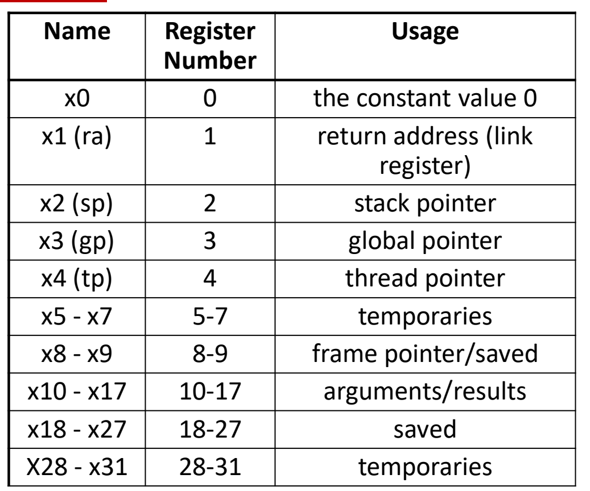
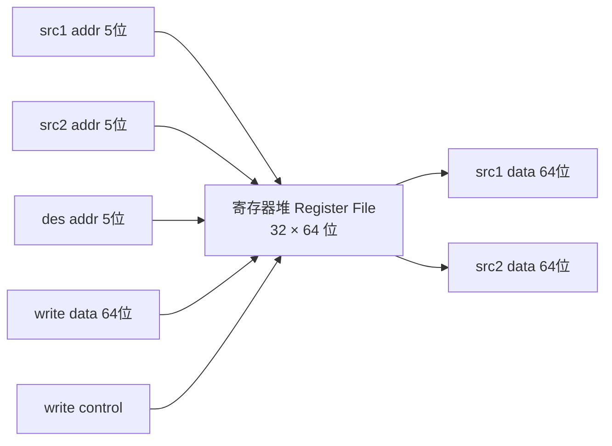
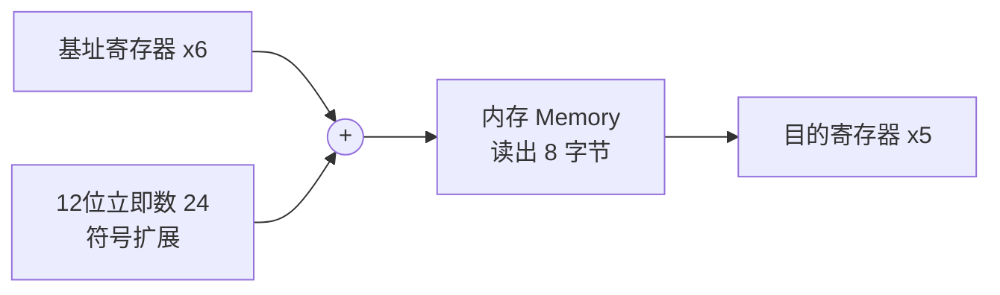
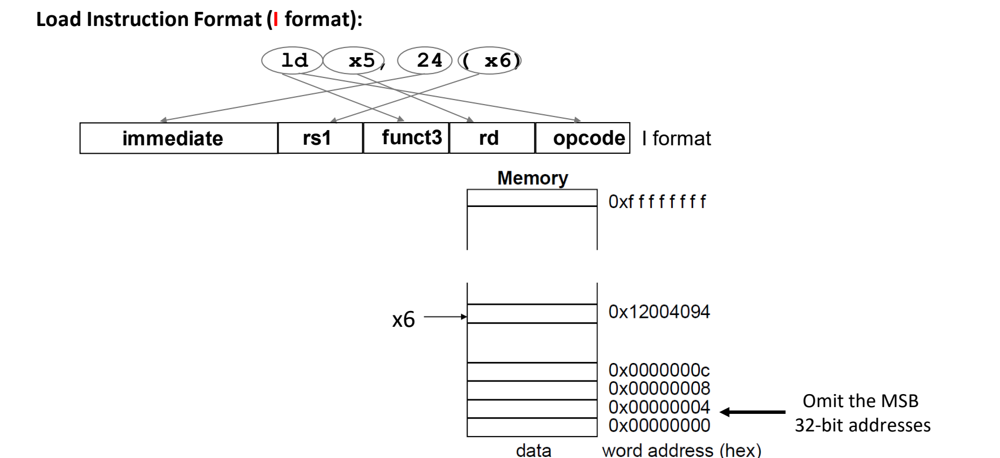

# 06 算术与访存指令

[本讲目录](../index.md) · [课程目录](../../index.md) · [上一节：05 RISC-V概览与指令格式](05-risc-v-overview-and-instruction-formats.md) · [下一节：07 分支过程调用与栈](07-branches-procedure-calls-and-stack.md)

> [!abstract] 本节要点
> - RISC-V 算术指令每条只做 1 个操作、恰好 3 个操作数、目的在前：`add rd, rs1, rs2` 即 $rd \leftarrow rs1 + rs2$，三个操作数都在寄存器堆中。
> - 寄存器堆是 32 个 64 位寄存器，2 个读端口 + 1 个写端口；它快是因为小，项数变多或端口变多都会变慢（端口数对速度的影响是平方级）。
> - R 格式 32 位从高到低为 funct7(7) | rs2(5) | rs1(5) | funct3(3) | rd(5) | opcode(7)；寄存器号 5 位是因为有 32 个寄存器。本课程中 word = 32 位，doubleword = 64 位。
> - `ld/sd` 的地址 = 基址寄存器 + 12 位有符号偏移，偏移以**字节**计，范围约 $\pm2^{11}$ 字节（$\pm256$ 个 doubleword）；`ld` 是 I 格式，`sd` 是 S 格式（立即数拆成 imm[11:5] 和 imm[4:0]）。
> - RISC-V 默认小端；`lb` 把字节放进寄存器低 8 位并把高 56 位做符号扩展，`sb` 只改内存中那 1 个字节；小常量用 `addi` 等立即数指令，32 位大常量用 `lui`（写 bits 31:12）再用 `ori`/`addi` 补低 12 位。

## 算术指令与 R 格式（R Format）

指令集需要一种规整、便于硬件快速译码的方式来表达“取两个值、算一下、存结果”。RISC-V 的做法是让所有算术指令长成同一个样子。

**算术指令**（arithmetic instruction）的汇编形式为：

```asm
add x5, x6, x7    # x5 = x6 + x7
sub x5, x6, x7    # x5 = x6 - x7
```

它满足三条规则：[^s1p48]

1. **每条指令只执行 1 个操作**（一次加或一次减）。
2. **每条指令长 32 位，恰好指定 3 个操作数**。
3. **操作数顺序固定，目的在前**：`destination ← source1 op source2`，即右边两个源操作数运算后写到最左边的目的操作数；三个操作数（如 x5、x6、x7）全部位于**寄存器堆**（register file）中。

### R 格式各字段

指令和数据字一样都是 32 位长。算术指令使用 **R 格式**，`add x5, x6, x7` 的各部分映射到如下字段（从高位到低位）：[^s1p51]

| 字段 | 位数 | 含义 | `add x5, x6, x7` 中的取值 |
| --- | --- | --- | --- |
| funct7 | 7 | 辅助 opcode 的功能码 | 区分 add / sub 等 |
| rs2 | 5 | 第二个源操作数的寄存器号 | x7 |
| rs1 | 5 | 第一个源操作数的寄存器号 | x6 |
| funct3 | 3 | 辅助 opcode 的功能码 | — |
| rd | 5 | 结果目的寄存器号 | x5 |
| opcode | 7 | 指定操作类别 | 算术类 |

字段宽度合计 $7+5+5+3+5+7=32$。两个设计要点：

- **为什么寄存器号是 5 位**：寄存器共 32 个，$\log_2 32 = 5$，所以 rs1、rs2、rd 各需 5 位。
- **为什么除 opcode 外还要 funct3、funct7**：RISC-V 指令数量很多，仅靠 7 位 opcode 不足以区分全部指令；opcode 先确定一大类，funct3 和 funct7 再在这一类中指定具体的子操作。6 种格式的整体排布见 [[05 RISC-V概览与指令格式]]。

> [!note] 补充解释
> 幻灯片没有给出具体二进制值。按 RISC-V 规范，`add x5, x6, x7` 的编码为 funct7=`0000000`、rs2=`00111`、rs1=`00110`、funct3=`000`、rd=`00101`、opcode=`0110011`，拼起来是 `0x007302B3`；`sub` 只把 funct7 改为 `0100000`。这正说明 funct7 是在同一 opcode 下区分子操作的。参见 [RISC-V 规范](https://riscv.org/technical/specifications/)。

## 寄存器约定与寄存器堆（Register File）

32 个通用寄存器在硬件上彼此等价，但编译器、操作系统和不同人写的函数要协同工作，就必须约定每个寄存器“通常用来放什么”。

**寄存器约定**（register convention）如下：[^s1p49]

| 名称 | 编号 | 用途 |
| --- | --- | --- |
| x0 | 0 | 恒为常数 0 |
| x1 (ra) | 1 | 返回地址（link register） |
| x2 (sp) | 2 | 栈指针（stack pointer） |
| x3 (gp) | 3 | 全局指针（global pointer） |
| x4 (tp) | 4 | 线程指针（thread pointer） |
| x5–x7 | 5–7 | 临时寄存器（temporaries） |
| x8–x9 | 8–9 | 帧指针 / 保存寄存器（frame pointer / saved） |
| x10–x17 | 10–17 | 参数 / 返回值（arguments / results） |
| x18–x27 | 18–27 | 保存寄存器（saved） |
| x28–x31 | 28–31 | 临时寄存器（temporaries） |



要点说明：

- **x0**：需要 0 时无需另外装入，直接写 x0 即可，它永远读出 0。
- **ra**：调用函数后要返回到哪里，返回地址就写在 x1 中。
- **sp、gp、tp**：在访问栈、全局数据和线程数据等内存区域时作为基址使用。
- **临时寄存器与保存寄存器**：临时寄存器可以自由放任何数据，函数调用时其中的值不受保护、可被替换；保存寄存器中的值在调用别的函数前后必须保持不变，想用它的函数要先保存原值、返回前恢复。谁负责保存（caller/callee-saved）以及栈的用法见 [[07 分支过程调用与栈]]。
- **参数 / 返回值**：调用函数时用 x10–x17 传参，返回时用它们带回结果。

### 寄存器堆的结构

**寄存器堆**（register file）保存 32 个 64 位寄存器（32 个位置 × 64 位）。端口数由算术指令的形式决定：[^s1p50]

1. 算术指令有 **2 个源操作数**，所以需要 **2 个读端口**：输入 src1 addr、src2 addr（各 5 位），输出 src1 data、src2 data（各 64 位）。
2. 有 **1 个目的操作数**，所以需要 **1 个写端口**：输入 des addr 和 write data。
3. 另有一个 **write control（写使能）**：并非每条指令都要写寄存器，所以写需要控制信号；而读在每条指令执行时都会发生，不需要读控制信号。



### 寄存器为什么快，以及何时不快

寄存器比存储层次中的其他各级（各级 cache 和内存）都快，一次访问通常不到 1 ns。但寄存器快的根本原因是**小**：

- **位置越多越慢**：64 项的寄存器堆可能比 32 项的慢多达 50%。[^s1p50] 如果把寄存器堆做得和 cache 一样大，它就和 cache 一样慢。
- **端口越多越慢**：读写端口数的增加对速度的影响是平方级的，因为端口会显著增加电路与控制的复杂度。

> [!tip] 课堂强调
> 寄存器“不是永远都快”：它快是因为足够小，扩大容量或增加读写端口都会让它变慢。（课堂口述说 64 项会“慢一倍”，幻灯片给出的是“可能慢多达 50%”，以幻灯片为准。）[^s2b12]

寄存器相对内存或栈式操作数还有两点好处：

- **编译器更容易使用**：例如计算 $(A\times B)-(C\times D)-(E\times F)$，三个乘法可以按任意顺序做并各自放在寄存器中；而栈式机器受后进先出的顺序约束。
- **提高代码密度**：变量放在寄存器中时，指令里只需 5 位寄存器号，而不必编码一个完整的内存地址，指令因此更短。

## 访存指令 ld / sd

算术指令只能操作寄存器，而程序数据（数组、结构体等）大多放在内存中，所以需要专门在内存和寄存器之间搬运数据的指令。

本课程约定：**字**（word）为 32 位，**双字**（doubleword）为 64 位。RV64 的寄存器是 64 位，所以最基本的访存单位是 doubleword。RISC-V 有两条基本数据传送指令：[^s1p52]

```asm
ld x5, 24(x6)    # load doubleword:  x5 = Memory[x6 + 24]
sd x5, 24(x6)    # store doubleword: Memory[x6 + 24] = x5
```

- 数据装入（`ld`）或取自（`sd`）寄存器堆中的某个寄存器，用 **5 位**寄存器地址指定。
- 内存地址是 **64 位**地址，由**基址寄存器的内容加上偏移量**形成。
- 偏移字段是 **12 位**有符号数，可正可负；因此访问范围限于基址附近 $\pm2^{11}=2048$ **字节**，即 $\pm2^{8}=256$ 个 doubleword。

`ld` 的执行步骤：

1. **算地址**：把立即数 24 符号扩展后与 x6 的内容相加，得到访存地址。
2. **读内存**：从该地址读出一个 doubleword（8 字节）。
3. **写寄存器**：把读到的数据写入 x5。



> [!example] 例：计算 `ld x5, 24(x6)` 的访存地址
> 已知 x6 = `0x12004094`，求访存地址。
>
> 1. 偏移 24 的十六进制为 `0x18`。
> 2. 只看最低字节：`0x94 + 0x18 = 0xAC`，无进位。
> 3. 地址 = `0x12004094 + 0x18 = 0x120040AC`。[^s2b13]
>
> 处理器从 `0x120040AC` 开始读出 8 字节写入 x5。

### I 格式与 S 格式

`ld` 使用 **I 格式**：immediate | rs1 | funct3 | rd | opcode。`ld x5, 24(x6)` 中，立即数 24 进 immediate 字段，基址 x6 进 rs1，目的 x5 进 rd，`ld` 本身由 opcode 与 funct3 确定。[^s1p53]



图中内存按 word address（十六进制）标注，地址只画了低 32 位（“Omit the MSB 32-bit addresses”），实际地址是 64 位。

`sd` 使用 **S 格式**：imm[11:5] | rs2 | rs1 | funct3 | imm[4:0] | opcode。[^s1p54] 与 `ld` 的区别在于：store 不写寄存器，没有 rd，而是要读两个寄存器——rs1 = x6（基址），rs2 = x5（要写入内存的数据）。为了让 rs1、rs2 在各种格式中位置不变，12 位立即数被拆成高 7 位 imm[11:5] 和低 5 位 imm[4:0]，分别放在原来 funct7 和 rd 的位置。

> [!example] 例：`sd x5, 24(x6)` 的立即数如何拆分
> 24 的 12 位二进制为 `0000000 11000`。
>
> 1. imm[11:5] = `0000000`（放在最高 7 位）
> 2. imm[4:0] = `11000`（放在 rd 的位置）
> 3. rs2 = x5（数据），rs1 = x6（基址）

> [!warning] 易错点
> 偏移量的单位是**字节**而不是 doubleword。12 位有符号偏移的精确范围是 $-2048$ 到 $+2047$ 字节；换算成 doubleword 才是约 $\pm256$ 个。所以访问数组第 $i$ 个 doubleword 元素时，偏移是 $8i$，而不是 $i$。

> [!question]- 自测：x6 存数组 `A`（元素为 64 位整数）的基址。读 `A[3]` 的指令是什么？`ld x5, 2048(x6)` 能否直接编码？
> `ld x5, 24(x6)`，因为每个元素 8 字节，$3\times8=24$。2048 超出 12 位有符号偏移的上限 2047，不能直接编码，需要先把基址调整（例如用 `addi` 改基址寄存器）再访存。

## 端序与字节访存（Endianness, lb / sb）

一个多字节数据放进按字节编址的内存时，必须规定哪个字节放在最低地址，否则同一段内存会被不同机器读成不同的数。

**端序**（endianness）是一个字（word）内各字节在内存中的排列方式。以 32 位数据 `0x0E82FF14` 为例（msb 字节为 `0x0E`，lsb 字节为 `0x14`）：[^s1p55]

| | 字地址处（最低地址）的字节 | 地址 A, A+1, A+2, A+3 中依次存放 | 代表处理器 |
| --- | --- | --- | --- |
| **大端**（Big Endian） | 最左（最高有效）字节 | `0E 82 FF 14` | IBM 360/370、Motorola 68k、MIPS、SPARC、HP PA |
| **小端**（Little Endian） | 最右（最低有效）字节 | `14 FF 82 0E` | Intel 80x86、DEC VAX、DEC Alpha |

可以用书写方向作类比：现代汉语横排从左到右书写，古代汉语竖排书写，同样的内容可以有不同的排列顺序，关键是读写双方约定一致。

> [!tip] 课堂强调
> **RISC-V 默认是小端**，这与 MIPS 等传统 RISC 采用大端不同，需要注意。在少数特殊场景（如网络设备）中可以把它配置成大端，但需要做转换，默认仍是小端。[^s2b13]

### lb 与 sb

除了整 doubleword，RISC-V 还提供搬运单个字节的指令：[^s1p56]

```asm
lb x5, 40(x6)    # load byte:  x5 的低 8 位 = Memory[x6 + 40] 处的 1 字节
sb x5, 40(x6)    # store byte: Memory[x6 + 40] 处的 1 字节 = x5 的低 8 位
```

`lb` 同样是 I 格式（immediate | rs1 | funct3 | rd | opcode），地址计算方式与 `ld` 相同。问题在于寄存器是 64 位而只搬了 8 位，其余位如何处理：

- **`lb`**：把内存中的字节放到目的寄存器的最低 8 位，其余 **56 位做符号扩展**（sign extension），即全部复制该字节的第 7 位（最高位）：第 7 位为 0 则高 56 位全 0，为 1 则全 1。这样装入的有符号字节在 64 位寄存器中数值不变。
- **`sb`**：取寄存器最低 8 位写入内存中的 1 个字节；内存中该字节所在字的其他字节**完全不改**，寄存器的高 56 位直接舍弃。

> [!example] 例：`lb` 的符号扩展
> 若 `Memory[x6+40]` 处的字节为 `0x82`（二进制 `1000 0010`，第 7 位为 1），执行 `lb x5, 40(x6)` 后 x5 = `0xFFFFFFFFFFFFFF82`，按有符号数解释为 $-126$。若该字节为 `0x14`（第 7 位为 0），则 x5 = `0x0000000000000014`。

> [!warning] 易错点
> - 高位既不是“补 0”也不是“保持原值”：`lb` 一定按第 7 位做符号扩展，覆盖整个寄存器的高 56 位。
> - `sb` 不会把内存中相邻的字节清零，只写 1 个字节。

> [!note] 补充解释
> RISC-V 还有 `lbu`（load byte unsigned），它把高 56 位补 0，用于处理无符号字节（如字符）。本讲未涉及，仅作对照。

> [!question]- 自测：在 RISC-V 上把 x5 = `0x0E82FF14` 用 `sd x5, 0(x6)` 存到地址 A，再执行 `lb x7, 1(x6)`，x7 是多少？
> 小端下 A, A+1, A+2, A+3 依次存 `14 FF 82 0E`（之后 4 字节为 0），所以地址 A+1 的字节是 `0xFF`。它的第 7 位为 1，符号扩展后 x7 = `0xFFFFFFFFFFFFFFFF`，即 $-1$。

## 立即数与大常量（Immediates, lui）

程序里经常出现小常量（如循环加 1、指针加偏移）。如果每次都要先从内存把常量读进寄存器，既多一条访存指令又慢。可能的方案有三种：[^s1p57]

1. 把“常用常量”放在内存中，需要时 load 进来；
2. 设置硬连线的常量寄存器（如 MIPS 的 `$zero`，对应 RISC-V 的 x0）来提供 0、1 这类常数；
3. **设计在指令中直接包含常量的专用指令**。

RISC-V 采用第 3 种方案（同时保留 x0 提供常数 0）。嵌在指令里的常量称为**立即数**（immediate）。例如：

```asm
addi sp, sp, 4    # sp = sp + 4
```

`addi` 使用 I 格式：immediate | rs1 | funct3 | rd | opcode，立即数放在最左边的 12 位，与 `ld`、`lb` 的格式相同。

> [!note] 补充解释
> 幻灯片中 `sp` 每次加 4 沿用了 32 位（MIPS）的习惯。在 RV64 中寄存器是 64 位，压栈或弹栈一个 doubleword 通常按 8 字节调整 `sp`。栈的使用见 [[07 分支过程调用与栈]]。

### 用 lui 构造 32 位常量

I 格式的立即数只有 12 位，装不下更大的常量。为此 RISC-V 提供 **lui**（load upper immediate），采用 **U 格式**：immediate[31:12] | rd | opcode。[^s1p58]

**`lui` 的语义**：把 20 位常量装入寄存器的第 12–31 位；最高 32 位（63:32）填充第 31 位的副本（符号扩展），最低 12 位填 0。

构造一个 32 位常量分两步：

1. **`lui x5, 34534`**：把 34534 放到 x5 的 bits 31:12，低 12 位为 0。
2. **`ori x5, x5, 123`**：把 123 或进 bits 11:0，最终 x5 的高 20 位为 34534、低 12 位为 123。

```asm
lui x5, 34534       # x5[31:12] = 34534, x5[11:0] = 0
ori x5, x5, 123     # x5[11:0] = 123
```

> [!example] 例：上述两条指令执行后 x5 的值
> 1. $34534 = \texttt{0x86E6}$，执行 `lui` 后 x5 = $34534\times2^{12}$ = `0x086E6000` = 141451264。bit 31 为 0，所以高 32 位全 0。
> 2. $123 = \texttt{0x07B}$，`ori` 后 x5 = `0x086E607B` = $141451264+123=141451387$。

> [!warning] 易错点
> 低 12 位的立即数在 `ori`/`addi` 中同样会被**符号扩展**。当低 12 位 ≥ `0x800`（第 11 位为 1）时：用 `addi` 相当于减去 4096，需要把 `lui` 的高 20 位预先加 1；用 `ori` 则会把高位全部置 1，结果错误。本例 123 < 2048，所以 `ori` 与 `addi` 都正确。实践中更常用 `lui` + `addi` 的组合。

> [!question]- 自测：用 `lui` + `addi` 把 x5 置为 `0x12345FFF`，两条指令的立即数各是多少？
> 低 12 位 `0xFFF` 的第 11 位为 1，`addi` 会把它当作 $-1$。因此高 20 位要用 `0x12345 + 1 = 0x12346`：`lui x5, 0x12346` 得 `0x12346000`，再 `addi x5, x5, -1` 得 `0x12345FFF`。

> [!info]- 来源
> - L02.pdf：PDF p.48–58
> - L02.docx：DOCX body 451–525

[^s1p48]: L02.pdf-PDF p.48
[^s1p51]: L02.pdf-PDF p.51
[^s1p49]: L02.pdf-PDF p.49
[^s1p50]: L02.pdf-PDF p.50
[^s2b12]: L02.docx-DOCX body 451-490
[^s1p52]: L02.pdf-PDF p.52
[^s2b13]: L02.docx-DOCX body 491-525
[^s1p53]: L02.pdf-PDF p.53
[^s1p54]: L02.pdf-PDF p.54
[^s1p55]: L02.pdf-PDF p.55
[^s1p56]: L02.pdf-PDF p.56
[^s1p57]: L02.pdf-PDF p.57
[^s1p58]: L02.pdf-PDF p.58

[本讲目录](../index.md) · [课程目录](../../index.md) · [上一节：05 RISC-V概览与指令格式](05-risc-v-overview-and-instruction-formats.md) · [下一节：07 分支过程调用与栈](07-branches-procedure-calls-and-stack.md)
