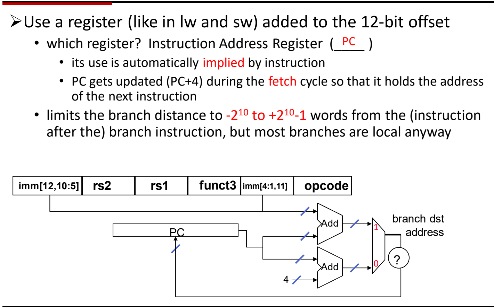
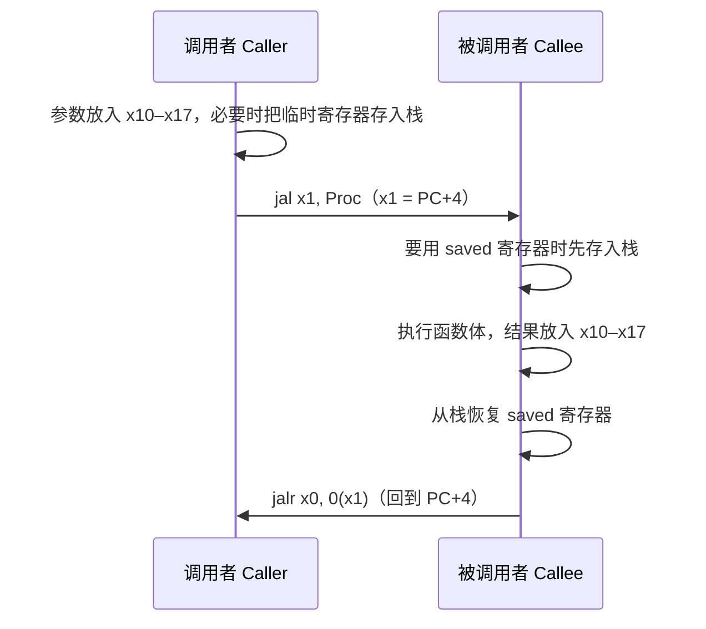
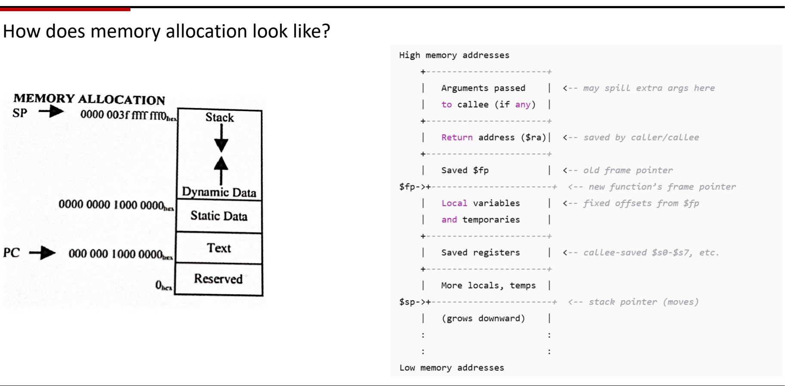

# 07 分支过程调用与栈

[本讲目录](../index.md) · [课程目录](../../index.md) · [上一节：06 算术与访存指令](06-arithmetic-and-memory-instructions.md) · [下一节：08 同步指令与寻址方式](08-synchronization-and-addressing-modes.md)

> [!abstract] 本节要点
> - `beq rs1, rs2, L` 在 rs1 = rs2 时跳转，`bne` 在不等时跳转；翻译 `if (i==j) h=i+j;` 时用**相反条件**的 `bne` 跳过 then 部分。
> - 条件分支采用 PC 相对寻址：目标 = PC + 符号扩展的 12 位立即数（SB 格式），可达范围约为 $-2^{10}\sim+2^{10}-1$ 个字；硬件用多路选择器在 PC+4 与 PC+imm 之间选择下一个 PC。
> - `jal x1, Proc` 跳到过程并把返回地址 PC+4 写入 x1（ra）；`jalr x0, 0(x1)` 返回；`jal x0, Label` 即无条件跳转（写 x0 等于丢弃链接）；更远的目标用 `lui` + `jalr` 拼出完整地址。
> - 调用者保存（caller-saved）：ra、临时寄存器 x5–x7/x28–x31、参数寄存器 x10–x17；被调用者保存（callee-saved）：sp、x8–x9（fp/saved）、x18–x27。
> - 栈从高地址向低地址增长：push 先减 sp 再存，pop 先取再加 sp；内存自低到高为保留区、代码段（Text）、静态数据、动态数据（堆，向上长）、栈（向下长）。

## 条件分支（Conditional Branch）

程序中的 `if`、循环都要求“根据数据决定下一条执行哪条指令”。顺序执行的算术和访存指令做不到这一点，因此 ISA 需要比较两个寄存器并据此改变 PC 的指令。

RISC-V 的两条基本**条件分支**（conditional branch）指令是：[^s1p59]

```asm
beq rs1, rs2, L1    # 若 rs1 == rs2，则跳到 L1
bne rs1, rs2, L1    # 若 rs1 != rs2，则跳到 L1
```

条件成立时下一条指令取自标号 `L1`；条件不成立时照常执行紧随其后的那条指令。比较的是两个**源寄存器**中的值。

### 翻译 if 语句

> [!example] 例：`if (i == j) h = i + j;`
> 设 `i`、`j`、`h` 分别在 x22、x23、x19 中。[^s1p59]
>
> ```asm
>         bne  x22, x23, L1     # i != j 时跳过赋值
>         add  x19, x22, x23    # h = i + j
> L1:     ...                   # if 之后的代码
> ```
>
> 1. 源代码的条件是“相等时执行赋值”，等价于“**不等时跳过**赋值”。
> 2. 所以用相反条件的 `bne`：x22 ≠ x23 时直接跳到 `L1`，`add` 不执行。
> 3. x22 = x23 时分支不成立，顺序执行 `add`，然后自然落到 `L1`。

> [!warning] 易错点
> 把 `if (cond)` 直译成“`cond` 成立就跳转”会把 then 部分放错位置。分支跳过的是 then 部分，所以分支条件要取源条件的**反**：`==` 用 `bne`，`!=` 用 `beq`。

条件分支使用 **SB 格式**，字段从高位到低位为：

| imm[12,10:5] | rs2 | rs1 | funct3 | imm[4:1,11] | opcode |
| --- | --- | --- | --- | --- | --- |

两个源寄存器占 rs1、rs2 字段，没有 rd 字段；分支偏移量被拆成两段放在原 rd 和 funct7 的位置，共 12 位（imm[12:1]）。[^s1p59] 立即数为何这样打乱排布，见 [05 RISC-V概览与指令格式](05-risc-v-overview-and-instruction-formats.md)。

## PC 相对分支目标与范围

分支指令里只剩 12 位放目标信息，不可能直接写下一个 64 位地址。既然大多数分支跳往附近的指令，就可以只编码“离当前位置多远”。

**PC 相对寻址**（PC-relative addressing）：像 `ld`/`sd` 用“基址寄存器 + 12 位偏移”算地址一样，分支也用一个寄存器加 12 位偏移，只不过这个寄存器是**指令地址寄存器**，即**程序计数器**（Program Counter, PC）。PC 的使用由指令隐含，不需要在指令中占寄存器字段。[^s1p60]

$$
\text{分支目标地址} = \mathrm{PC} + \operatorname{sext}(\mathrm{imm})
$$

其中 $\operatorname{sext}$ 表示符号扩展：偏移量为有符号数，所以既能向前跳也能向后跳（循环的回跳就是负偏移）。

### 硬件如何选择下一个 PC

1. **取指时**：PC 送往存储器取指令，同时一个加法器计算 PC + 4（下一条顺序指令的地址，指令长 4 字节）。
2. **另一个加法器**：把 SB 格式中拼出的立即数与 PC 相加，得到分支目标。
3. **多路选择器**：两路地址进入二选一 MUX，0 号输入是 PC+4，1 号输入是 PC+imm；选择信号来自分支条件（图中的“?”，即 rs1 与 rs2 的比较结果）。
4. **写回 PC**：MUX 的输出作为下一个 PC。



图：分支目标由 PC 与 12 位偏移相加，多路选择器在 $\mathrm{PC}+4$ 与“当前 PC 加偏移”之间按分支条件选择。

### 跳转范围

12 位有符号偏移限制了分支距离：从分支处出发，可达范围为 $-2^{10}$ 到 $+2^{10}-1$ 个字（word，4 字节）。[^s1p60] 这个范围不大，但多数分支都是局部的（循环体、if 块），足够使用；超出范围时需要改用跳转指令（见下一节）。

> [!note] 补充解释
> 推导范围：RISC-V 的分支立即数编码的是 imm[12:1]，最低位 imm[0] 恒为 0 不存储，因此 12 位字段实际表示 13 位有符号字节偏移，范围 $-2^{12}\sim2^{12}-2$ 字节，即 $\pm4\,\text{KiB}$，折合约 $-2^{10}\sim+2^{10}$ 个字，与上面的结论一致。
>
> 课件中“PC 在取指周期已更新为 PC+4，偏移从分支的下一条指令算起”是 MIPS 的约定。[^s1p60]按 [RISC-V 官方非特权规范：RV32I 的 Conditional Branches](https://docs.riscv.org/reference/isa/v20260120/unpriv/rv32.html)，偏移量加到**分支指令自身的地址**上，而不是 PC+4。做题时以 RISC-V 规则为准：`beq x5, x6, 100` 跳到“本条分支地址 + 100”。

## jal/jalr 与过程调用

调用函数（过程）要完成两件事：跳到函数入口，并记住回来的位置。如果只用普通跳转，函数执行完就不知道该回到哪个调用点，因为同一个函数可能被很多地方调用。

**跳转并链接**（jump and link, `jal`）在跳转的同时把返回地址保存进寄存器：[^s1p61]

```asm
jal  x1, ProcedureAddress   # x1 = PC + 4; PC = 过程入口
jalr x0, 0(x1)              # 返回：PC = x1 + 0; 链接写入 x0（被丢弃）
```

- `jal x1, ProcedureAddress`：把 PC+4（调用指令的下一条指令的地址）存入 x1，作为返回用的“链接”，然后跳到过程地址。x1 因此又名 **ra**（return address，返回地址寄存器）。`jal` 使用 **UJ 格式**：`immediate[20,10:1,11,19:12] | rd | opcode`。[^s1p61]
- `jalr x0, 0(x1)`（jump and link register）：目标地址 = 寄存器 x1 的值 + 偏移 0，即返回地址。它同样会把 PC+4 写入 rd，但 rd = x0 恒为 0，写入无效，所以这条指令只是一次纯粹的“跳回调用点”。[^s2b13]

一次完整的调用与返回可以按下面的时序理解（参数和保存寄存器的约定见下一节）：



### 无条件跳转

RISC-V 没有单独的无条件跳转指令，而是借助 x0：[^s1p62]

```asm
jal x0, Label    # 无条件跳到 Label
```

它与过程调用 `jal x1, Proc` 的唯一区别是链接写到哪里：写进 x1 是为了以后返回；写进 x0 则等于丢弃，因为单纯的跳转不需要返回地址。[^s2b13]

> [!note] 补充解释
> `jal` 的立即数编码 imm[20:1]（最低位恒 0），可达范围为 $\pm1\,\text{MiB}$（$-2^{20}\sim2^{20}-2$ 字节），比条件分支的 $\pm4\,\text{KiB}$ 大得多，但仍有限。

### 长跳转：lui + jalr

当目标超出 `jal` 的范围时，可以先把完整的目标地址放进寄存器，再用 `jalr` 跳过去。课件给出的写法是：[^s1p62]

```asm
lui  x5, 32423        # x5 = 32423 << 12，填入第 31~12 位
jalr x1, 2342(x5)     # 跳到 x5 + 2342，并把 PC+4 写入 x1
```

1. `lui`（load upper immediate）把 20 位立即数放到 x5 的第 31～12 位，低 12 位清零（`lui` 构造常量的细节见 [06 算术与访存指令](06-arithmetic-and-memory-instructions.md)）。
2. `jalr` 再把一个 12 位立即数加到 x5 上，补齐低 12 位（第 11～0 位），合成一个 32 位的目标地址。[^s2b14]
3. 由于 rd = x1，这同时是一次可以返回的“远调用”；若写 x0，则是一次远距离无条件跳转。

> [!warning] 易错点：低 12 位按有符号数相加
> `jalr` 的偏移量是 **12 位有符号数**，可表示 $-2048\sim2047$。课件中的 2342 > 2047，实际**无法编码**进 `jalr`[^s1p62]，只能理解为“想要的低 12 位是 2342”。
>
> 正确拆分要考虑符号扩展：目标为 $32423\times4096+2342 = 132\,806\,950$（`0x07EA7926`）。低 12 位 `0x926` 的第 11 位是 1，作为有符号数等于 $2342-4096=-1754$。为抵消这个 $-4096$，高 20 位要多加 1：
>
> ```asm
> lui  x5, 32424        # 32424 × 4096 = 132 808 704
> jalr x1, -1754(x5)    # 132 808 704 − 1754 = 132 806 950
> ```
>
> 判断规则：低 12 位的最高位（第 11 位）为 1 时，`lui` 的立即数 +1，低 12 位取“值 − 4096”。

> [!note] 补充解释：`jalr x1, 0(x1)` 的执行顺序
> 当 rd 与 rs1 是同一个寄存器时，结果会不会取决于“先写 rd 还是先算目标”？RISC-V 规范规定：目标地址用**旧的** rs1 值计算（并把结果最低位清 0），之后才把 PC+4 写入 rd。等价于
> `t = PC+4; PC = (x[rs1] + sext(imm)) & ~1; x[rd] = t`。
> 因此 `jalr x1, 0(x1)` 跳到原 x1 指向的地址，同时 x1 变成这条指令的下一条地址。详见 [RISC-V 官方非特权规范：RV32I 的 Unconditional Jumps](https://docs.riscv.org/reference/isa/v20260120/unpriv/rv32.html) 中的 JALR 说明。

## 调用者保存与被调用者保存

一个函数在运行时需要三类信息：1. 参数；2. 调用者的现场信息（返回后还要用的值）；3. 全局变量。[^s1p63] 调用者和被调用者共享同一组 32 个寄存器，被调用者随便使用寄存器就可能覆盖调用者的数据。所以要约定：每个寄存器在调用前后的值由谁负责保持。

- **调用者保存**（caller-saved）：被调用者可以随意改写。调用者如果认为某个寄存器中的值在调用之后还要用，就必须在调用前自己把它存到栈上，调用返回后再取回。[^s2b14]
- **被调用者保存**（callee-saved）：调用者默认这些寄存器的值在调用前后**不变**。被调用者如果想使用它们，必须先把原值存到栈上，在返回前恢复。[^s2b14]

| 寄存器 | 编号 | 用途 | 调用时由谁保存 |
| --- | --- | --- | --- |
| x0 | 0 | 常数 0 | 不适用 |
| x1（ra） | 1 | 返回地址（链接寄存器） | 调用者 |
| x2（sp） | 2 | 栈指针 | 被调用者 |
| x3（gp） | 3 | 全局指针 | — |
| x4（tp） | 4 | 线程指针 | — |
| x5–x7 | 5–7 | 临时寄存器 | 调用者 |
| x8–x9 | 8–9 | 帧指针 / 保存寄存器 | 被调用者 |
| x10–x17 | 10–17 | 参数 / 返回值 | 调用者 |
| x18–x27 | 18–27 | 保存寄存器 | 被调用者 |
| x28–x31 | 28–31 | 临时寄存器 | 调用者 |

几条理解要点（寄存器的一般用途见 [06 算术与访存指令](06-arithmetic-and-memory-instructions.md)）：

1. **ra 是调用者保存**：每次执行 `jal x1, …` 都会覆盖 x1。函数 A 若要再调用函数 B（嵌套或递归），必须先把自己的返回地址保存到栈上，否则 A 回不去自己的调用者。[^s2b14]
2. **sp 是被调用者保存**：调用者期望返回后栈指针恢复原样；被调用者自己移动了 sp，返回前必须移回。
3. **x0、gp、tp 无需保存**：x0 恒为 0；全局指针 gp 指向全局数据区，一般不改变。[^s2b14]
4. **参数寄存器 x10–x17 是调用者保存**：它们用于向被调用者传参、接收返回值，被调用者当然可以改写。

> [!warning] 易错点
> “caller-saved”并不表示调用者每次都得保存，只有调用后还要用的值才需要保存；“callee-saved”也只要求被调用者在**使用**这些寄存器时保存，没用到的就不必存。约定的目的是让双方各自只保存必要的寄存器。

## 栈与内存布局

寄存器只有 32 个。被调用者需要的寄存器超过空闲数量，或过程是递归的、每一层都要保存自己的返回地址时，就必须把寄存器的值**溢出**（spill）到内存。

**栈**（stack）是内存中一个后进先出（LIFO）的队列，用于传递额外的值，或保存（递归调用的）返回地址。通用寄存器 **sp**（x2）用来寻址栈顶，栈从**高地址向低地址**“增长”。[^s1p64]

- **入栈**（push）：先 `sp = sp − 4`，再把数据存到新的 sp 指向的位置。
- **出栈**（pop）：先从 sp 指向的位置取出数据，再 `sp = sp + 4`。[^s1p64]

所以压入数据时 sp 减小，弹出时 sp 增大，与“栈向上长”的直觉方向相反。[^s2b14]

> [!warning] 易错点：步长是 4 还是 8
> 课件中的 ±4 沿用了 32 位 MIPS 的写法（每个寄存器 4 字节）。[^s1p64]RV64 的寄存器是 64 位，用 `sd`/`ld` 保存一个寄存器占 8 字节，所以每保存一个寄存器 sp 要移动 8（标准调用约定还要求 sp 保持 16 字节对齐）。

> [!example] 例：被调用者使用 x18、x19（RV64）
> 函数要用两个被调用者保存寄存器，并且自己还要调用别的函数（需保存 ra）。
>
> ```asm
> proc:   addi sp, sp, -24      # 栈向低地址开辟 3 个双字
>         sd   x1, 16(sp)       # 保存返回地址 ra（嵌套调用会覆盖它）
>         sd   x18, 8(sp)       # 保存调用者的 x18
>         sd   x19, 0(sp)       # 保存调用者的 x19
>         ...                   # 函数体，可自由使用 x18、x19，可 jal 调用其他函数
>         ld   x19, 0(sp)       # 逆序恢复
>         ld   x18, 8(sp)
>         ld   x1, 16(sp)
>         addi sp, sp, 24       # 释放栈空间，sp 恢复原值
>         jalr x0, 0(x1)        # 返回
> ```
>
> 1. 开辟空间：sp 减去要保存的字节数 3 × 8 = 24。
> 2. 保存：以 sp 为基址、偏移 0/8/16 存入。
> 3. 恢复与释放的顺序和保存相反，最后 sp 加回 24，这满足“sp 由被调用者保存”的约定。
> （严格遵守 16 字节对齐时应开辟 32 字节。）

### 内存布局

一个程序的内存从低地址到高地址依次为：[^s1p65]

1. **保留区**（Reserved）：从地址 0 开始，程序不使用。
2. **代码段**（Text）：存放机器指令，PC 指向这里。
3. **静态数据**（Static Data）：从 $(\mathtt{0000\,0000\,1000\,0000})_{16}$ 开始，存放全局变量和常量；全局指针 gp 指向这里，一般不变。
4. **动态数据**（Dynamic Data，即**堆** heap）：紧接静态数据，**向高地址**增长。
5. **栈**（Stack）：从高地址 $(\mathtt{0000\,003f\,ffff\,fff0})_{16}$（sp 的初值）开始，**向低地址**增长。

栈和堆从两端相向增长，共享中间的空闲空间。[^s2b14]



图：左：内存布局从低到高为保留区、代码段、静态数据、动态数据（向上长）与栈（向下长）；右：栈帧中参数、返回地址、旧帧指针、局部变量与保存寄存器的排布。

> [!note] 补充解释
> 图中代码段起始地址扫描不清，在 RISC-V 版教材的约定中是 $(\mathtt{0000\,0000\,0040\,0000})_{16}$。图右侧的栈帧示意使用 MIPS 寄存器名：`$ra` 对应 RISC-V 的 x1，`$fp` 对应 x8，`$sp` 对应 x2，`$s0–$s7` 对应 RISC-V 的 saved 寄存器 x8–x9、x18–x27。

### 栈帧

每次过程调用在栈上占用的一段区域叫**栈帧**（stack frame）。自高地址向低地址，一个栈帧依次包含：[^s1p65]

1. 传给被调用者的参数（参数寄存器不够时，多出的参数溢出到这里）；
2. 返回地址 ra（由调用者或被调用者保存）；
3. 保存的旧 fp（上一层函数的帧指针）；此处是新函数的**帧指针**（frame pointer, fp）所指位置；
4. 局部变量和临时值，用相对 fp 的**固定偏移**访问；
5. 保存的被调用者保存寄存器；
6. 更多局部变量/临时值，下端由 sp 指示。sp 会随 push/pop 移动，fp 在函数执行期间保持不变。[^s2b14]

因为 sp 在函数体内会变动，用 fp 加固定偏移访问局部变量比用 sp 更稳定。

> [!question]- 自测：x5 = 8, x6 = 8 时，下面代码执行后 x7 是多少？把 `bne` 换成 `beq` 呢？
> ```asm
>       addi x7, x0, 1
>       bne  x5, x6, L1
>       addi x7, x7, 10
> L1:   addi x7, x7, 100
> ```
> 原代码 x7 = 111：两数相等，`bne` 不跳，三条 `addi` 都执行（1+10+100）。换成 `beq` 后结果是 101：条件成立，跳过 `addi x7, x7, 10`。

> [!question]- 自测：要用 lui + jalr 跳到地址 `0x00012FFC` 并保存返回地址，两条指令的立即数各是多少？
> `lui x5, 0x13`，`jalr x1, -4(x5)`。低 12 位 `0xFFC` 的第 11 位是 1，作为有符号数为 $4092-4096=-4$，所以高 20 位要由 `0x12` 加 1 变成 `0x13`。验证：$0x13000-4=0x12FFC$。

> [!question]- 自测：函数 A 在 x18 和 x5 中各有一个调用后还要用的值，接着执行 `jal x1, B`。A 自己需要把哪些寄存器存到栈上？B 呢？
> A 要保存 x5（临时寄存器，调用者保存），还要保存 x1：`jal` 会覆盖 A 自己的返回地址，A 之后就回不去了。A 不必保存 x18，因为它是被调用者保存寄存器，由 B 保证不变：B 若要使用 x18，就必须先存入栈、返回前恢复；B 若不用 x18，就什么都不用做。

> [!info]- 来源
> - L02.pdf：PDF p.59–65
> - L02.docx：DOCX body 491–564

[^s1p59]: L02.pdf-PDF p.59
[^s1p60]: L02.pdf-PDF p.60
[^s1p61]: L02.pdf-PDF p.61
[^s2b13]: L02.docx-DOCX body 491-525
[^s1p62]: L02.pdf-PDF p.62
[^s2b14]: L02.docx-DOCX body 526-564
[^s1p63]: L02.pdf-PDF p.63
[^s1p64]: L02.pdf-PDF p.64
[^s1p65]: L02.pdf-PDF p.65

[本讲目录](../index.md) · [课程目录](../../index.md) · [上一节：06 算术与访存指令](06-arithmetic-and-memory-instructions.md) · [下一节：08 同步指令与寻址方式](08-synchronization-and-addressing-modes.md)
