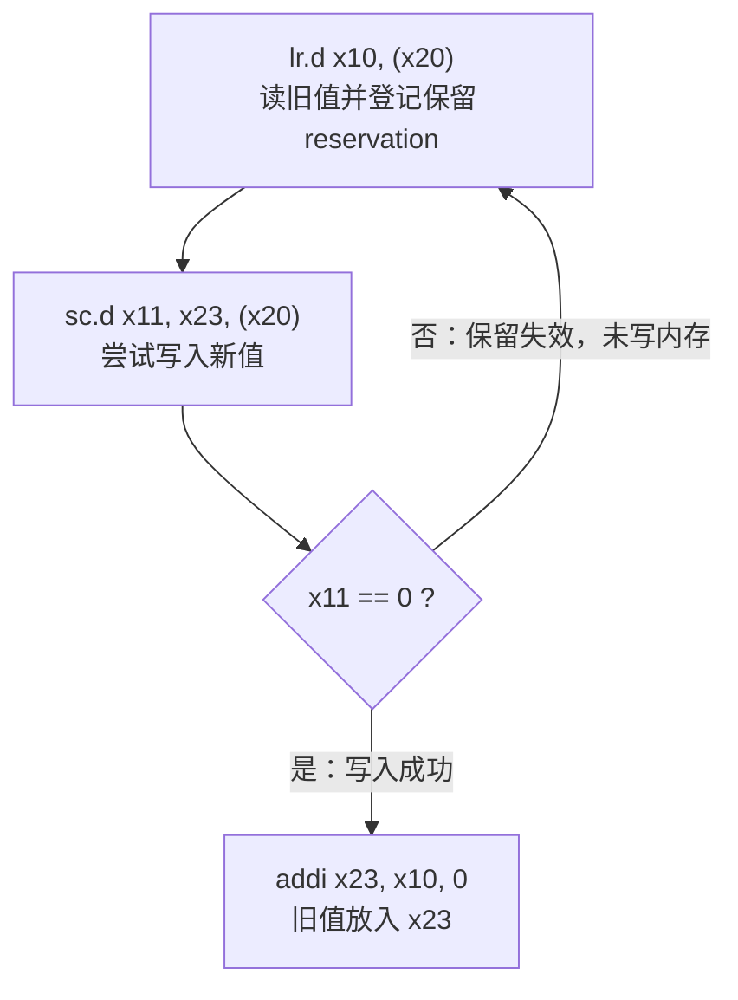
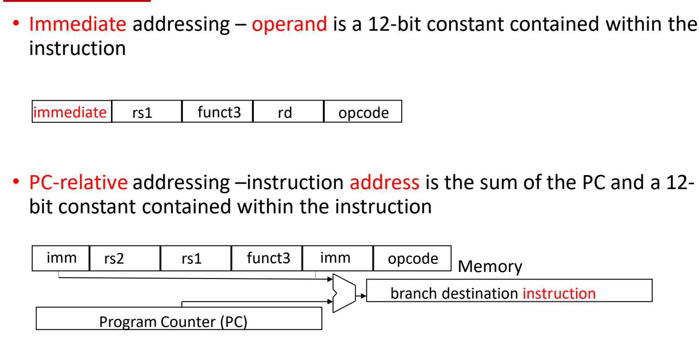

# 08 同步指令与寻址方式

[本讲目录](../index.md) · [课程目录](../../index.md) · [上一节：07 分支过程调用与栈](07-branches-procedure-calls-and-stack.md)

> [!abstract] 本节要点
> - 多核访问同一块内存需要**锁**：值 0 表示空闲、1 表示被占用；"读锁—判断—置 1"必须由硬件保证**原子**完成（原子交换 / 原子 swap），CISC 用一条复杂的 C&S 指令实现。
> - RISC-V 把 C&S 拆成两条 R 型指令：`lr.d` 读取内存并在该地址登记**保留**；`sc.d` 仅当保留仍有效、且写入的字节落在保留集合内时才写内存，结果寄存器 **0 表示成功、非 0 表示失败**。
> - 原子交换 = `lr.d` → `sc.d` → `bne` 失败重试 → 把读到的旧值放回寄存器；失败时内存不被修改，所以重试是安全的。
> - LR/SC 边界规则：地址不在保留集合内则 SC 失败；**无论成功与否，执行任何 SC 都会使本 hart 的保留失效**；一个 hart 同时只持有一个保留，后一条 LR 会取代前一条。
> - RISC-V 有四种寻址方式：寄存器、基址（偏移）、立即数、PC 相对；设计原则是"简单源于规整、好设计需要好折中、越小越快、加速常见情况"。

## 锁与原子操作（Lock and Atomic Operation）

当多个核心要访问同一段数据或同一段内存时，必须保证同一时刻只有一个核心在修改它，否则两个核心各自"读—改—写"会互相覆盖结果。软件的做法是给这段数据配一把锁，用锁的值标记这段代码或数据当前是否已被占用。

**锁**（lock）是最简单的**同步原语**（synchronization primitive）：用一个内存字表示，值 **0 表示锁空闲，1 表示锁不可用**（已被占用）。[^s1p66]

获取锁的过程是：

1. **读**：读出锁所在地址上的值；
2. **比较**：与期望值比较，期望值是 0（空闲）；
3. **写**：若为 0，就把它置为 1，表示本核心拿到了锁；若为 1，说明别人占着，本核心无法操作，只能不停地轮询（自旋）重复以上步骤。

关键在于"读"和"写"之间不能被其他核心插入：如果两个核心都先读到 0、再各自写 1，就会同时认为自己拿到了锁。因此需要硬件提供**原子交换**（atomic exchange / atomic swap）——把"读出旧值并写入新值"作为一个不可分割的整体完成。[^s1p66]

在 CISC 中，这一过程可以直接做成一条复杂指令 **C&S**（compare-and-swap，比较并交换）：CISC 本就允许为复杂操作增加专门的指令。RISC 是精简指令集，必须复用已有的指令格式，不能为此引入一条"读—比较—写"三合一的复杂指令，于是 RISC-V 用两条 R 型指令代替它，这就是下一小节的 LR/SC。[^s1p67]

指令格式本身（R 型等 6 种格式）见 [[05 RISC-V概览与指令格式]]。

## 保留加载与条件存储（lr.d / sc.d）

LR/SC 的思路是：不在读写期间"锁住"内存，而是先读、再在写的时候检查"这期间有没有人动过它"，动过就放弃本次写入并重试。

- **`lr.d`**（load-reserved doubleword，保留加载双字）：`lr.d x5, (x6)` 执行 `x5 = Memory[x6]`，这是一次普通的加载；此外它还在地址 `x6` 上登记一个**保留**（reservation），即开始监视这个地址后续是否被其他核心写入。
- **`sc.d`**（store-conditional doubleword，条件存储双字）：`sc.d x7, x5, (x6)` 尝试执行 `Memory[x6] = x5`，并把结果写入 `x7`。[^s1p67]

**功能规则**：如果在对同一地址执行 store-conditional 之前，load-reserved 所指定的内存单元内容被改变了，那么 store-conditional 失败，并且**不把值写入内存**。[^s1p67]

`sc.d` 的执行过程：

1. 检查 `x6` 对应地址上的保留是否仍有效（期间没有被其他核心写过）；
2. 若有效，把 `x5` 写入 `Memory[x6]`，并令 `x7 = 0`，表示成功；
3. 若无效，不写内存，令 `x7` 为非 0 值，表示失败。

> [!warning] 易错点：sc.d 的结果是 0 表示成功
> 幻灯片注释只写了 `x7=0/1`。课堂上一开始说"成功置 1、失败置 0"，随后自行更正为**成功是 0、失败是 1**。[^s2b15] 这与 RISC-V 规范和下面原子交换代码中的 `bne x11, x0, again`（不等于 0 即"store 失败"，跳回重试）一致。判断时记住：结果寄存器是"错误码"，0 = 没有错误。

这对指令可以实现**不加锁的原子内存更新**：`lr.d` 把 `Memory[x6]` 读入 `x5` 后，程序可以在 `x5` 这份副本上任意修改；`sc.d` 只有在你处理副本期间 `Memory[x6]` 没被改动时，才用修改后的 `x5` 覆盖它，`x7` 指示是否成功。[^s1p68] 失败时内存保持原样，所以只要回到 `lr.d` 重新开始即可。

### 例：原子交换 x23 与 Memory[x20]

目标：把寄存器 `x23` 的值与内存 `Memory[x20]` 的值原子地互换。[^s1p67]

```asm
again: lr.d  x10, (x20)        # load-reserved：x10 = Memory[x20]，并在 x20 上登记保留
       sc.d  x11, x23, (x20)   # store-conditional：尝试 Memory[x20] = x23，结果写入 x11
       bne   x11, x0, again    # x11 != 0 表示 store 失败，跳回重试
       addi  x23, x10, 0       # 成功：把读到的旧值放入 x23
```

逐步说明：

1. `lr.d` 把内存旧值读到 `x10`，同时开始监视 `x20` 指向的地址；
2. `sc.d` 尝试把 `x23` 写进该地址，成功与否写入 `x11`；
3. 若 `x11 ≠ 0`，说明在第 1、2 步之间有其他核心改动过该地址，本次写入未发生，回到 `again` 重做；
4. 若 `x11 = 0`，写入已完成，再用 `addi x23, x10, 0` 把旧值移入 `x23`，交换完成。



> [!note] 补充解释
> 上面的交换把 `x23` 原来的值写入内存、把内存旧值取回 `x23`。若 `x23` 中放的是 1、`Memory[x20]` 是锁，那么交换后 `x23` 中的旧值为 0 就表示拿到了锁，为 1 就表示锁原本被占用、需要继续轮询——这正是上一小节"读—比较—置 1"的原子实现。

## LR/SC 的边界情况

LR/SC 成对使用时语义直观，但地址不一致、不成对或交错使用时，结果完全由两条规则决定。[^s1p69] 依据 RISC-V A 扩展规范（[RISC-V ISA Manual: "A" Extension](https://five-embeddev.com/riscv-isa-manual/latest/a.html#)）：

1. **成功条件**：`sc.w` 只有在保留仍有效，**并且**保留集合（reservation set）包含它要写入的字节时才成功；
2. **SC 总会清除保留**：无论成功还是失败，执行一条 `sc.w` 都会使本 hart（硬件线程）持有的任何保留失效。[^s1p69]

此外，规范规定一个 hart 同一时刻只持有一个保留，新的 `lr` 会取代之前的保留。下面三个例子用的是字版本 `lr.w`/`sc.w`，规则与 `.d` 版本相同；结果寄存器 0 为成功、非 0 为失败。

**Case 1：LR/SC 地址不匹配**

```asm
lr.w t0, (a0)
sc.w t1, a1, (a3)
```

保留登记在 `a0` 所在的保留集合上，而 `sc.w` 写的是 `a3`。除非 `a0` 与 `a3` 恰好落在同一个保留集合内，否则不满足规则 1，**SC 失败，`t1 ≠ 0`**，内存不被写入。

**Case 2：不成对的 LR/SC**

```asm
lr.w t0, (a0)
sc.w t1, a1, (a0)
addi a1, a1, 1
sc.w t2, a1, (a0)
```

第一条 `sc.w` 与 `lr.w` 地址相同、保留有效，**成功，`t1 = 0`**。但根据规则 2，这条 SC 执行后保留已被清除；第二条 `sc.w` 前没有新的 `lr.w`，**必然失败，`t2 ≠ 0`**。

**Case 3：同一核心的多条 LR、多条 SC**

```asm
lr.w t0, (a0)
lr.w t1, (a2)
sc.w t2, a1, (a0)
sc.w t3, a1, (a2)
```

1. 第二条 `lr.w` 在 `a2` 上登记保留，**取代**了 `a0` 上的保留（一个 hart 只有一个保留）；
2. `sc.w t2, a1, (a0)`：保留集合是 `a2` 所在的集合，不包含 `a0` 的字节（除非两者同属一个保留集合），**失败，`t2 ≠ 0`**；同时这条 SC 清除了 `a2` 上的保留；
3. `sc.w t3, a1, (a2)`：保留已被上一条 SC 清除，**失败，`t3 ≠ 0`**。

> [!warning] 易错点：课堂讨论中的答案与规范不一致
> Case 2 的课堂答案（`t1` 成功、`t2` 失败）与规范一致。Case 1 的课堂讨论在 0/1 含义上反复，最后说"应该是 0"（成功）；Case 3 课堂答案是"`t2` 成功、`t3` 失败"，理由是"有 `a0` 的保留"。[^s2b15] 这两处与幻灯片自己列出的规则 1 不符[^s1p69]：Case 1 写入地址不在保留集合内，应当失败；Case 3 中 `a0` 的保留已被第二条 `lr.w` 取代，`t2`、`t3` 都失败。判断时按上面两条规则加"一个 hart 一个保留"逐条推演，不要凭"之前 LR 过这个地址"下结论。

## 四种寻址方式（Addressing Modes）

指令中的操作数可能在寄存器里、在内存里、在指令本身里，跳转目标又是一个指令地址；**寻址方式**（addressing mode）规定了如何从指令字段得到操作数或目标地址。RISC-V 有 6 种指令格式，但只有 4 种寻址方式：

| 寻址方式 | 操作数 / 目标在哪里 | 地址或值如何得到 | 使用的格式与典型指令 |
| --- | --- | --- | --- |
| **寄存器寻址**（register addressing） | 寄存器 | 字段 rs1/rs2 直接指定寄存器，操作数是寄存器中的双字 | R 型：`add x5, x6, x7` |
| **基址（偏移）寻址**（base / displacement addressing） | 内存 | 地址 = 基址寄存器 + 指令中的 12 位常数 | I 型（加载）：`ld x5, 40(x6)`；操作数可以是双字、字、半字或字节 |
| **立即数寻址**（immediate addressing） | 指令本身 | 操作数就是指令中的 12 位常数 | I 型：`addi x5, x6, 20` |
| **PC 相对寻址**（PC-relative addressing） | 内存中的指令 | 指令地址 = PC + 指令中的 12 位常数 | SB 型：`beq x5, x6, 100`，得到分支目标指令 |

[^s1p71]

- 寄存器寻址：所有算术运算的源数据都来自寄存器堆，指令里只给寄存器编号。
- 基址寻址：寄存器中存放的是内存地址，再加上一个立即数偏移，才得到真正访问的内存位置。偏移范围与 `ld`/`sd` 的细节见 [[06 算术与访存指令]]。
- 立即数寻址：一部分源操作数直接编码在指令里，不需要额外访存或占用寄存器。
- PC 相对寻址：目标地址以当前 PC 为基准加上指令中的立即数，用于分支，找到的是"分支目的指令"。[^s1p72]



PC 相对寻址中，SB 型指令的立即数被拆成两段（`imm | rs2 | rs1 | funct3 | imm | opcode`），拼接后与 PC 相加得到分支目标；其跳转范围与立即数最低位省略的细节见 [[07 分支过程调用与栈]]。

## RISC-V 指令汇总与设计原则

到目前为止学过的指令可以按类别汇总如下。操作码一列**不要求记忆**，重点是知道每条指令的含义和特点（例如 `beq`/`bne` 做什么、load/store 指令的特点）。[^s2b15]

| 类别（格式） | 指令 | 操作码 | 示例 | 含义 |
| --- | --- | --- | --- | --- |
| 算术（R、I） | add | 0110011 | `add x5, x6, x7` | x5 = x6 + x7 |
| | subtract | 0110011 | `sub x5, x6, x7` | x5 = x6 − x7 |
| | add immediate | 0010011 | `addi x5, x6, 20` | x5 = x6 + 20 |
| | or immediate | 0010011 | `ori x5, x6, 20` | x5 = x6 \| 20 |
| 数据传送（I、S、U） | load doubleword | 0000011 | `ld x5, 40(x6)` | x5 = Memory[x6 + 40] |
| | store doubleword | 0100011 | `sd x5, 40(x6)` | Memory[x6 + 40] = x5 |
| | load byte | 0000011 | `lb x5, 40(x6)` | x5(7:0) = Memory[x6 + 40](7:0)，高位符号扩展 |
| | store byte | 0100011 | `sb x5, 40(x6)` | Memory[x6 + 40](7:0) = x5(7:0) |
| | load upper imm | 0110111 | `lui x5, 0x12345` | x5 = 0x12345000 |
| 条件分支（SB） | branch on equal | 1100011 | `beq x5, x6, 100` | if (x5 == x6) go to PC+100 |
| | branch on not equal | 1100011 | `bne x5, x6, 100` | if (x5 != x6) go to PC+100 |
| 跳转（UJ、I） | jump and link | 1101111 | `jal x1, imm` | x1 = PC+4; PC = PC + {imm, 1'b0} |
| | jump and link register | 1100111 | `jalr x0, 0(x1)` | 跳到 x1 + 0（此处用于过程返回） |

[^s1p70]

> [!warning] 易错点：幻灯片操作码表有误
> 原表把 `beq`/`bne` 的操作码写成 `1100111`，正确的 BRANCH 操作码是 **`1100011`**；`jal` 与 `jalr` 的操作码写反了，正确为 **`jal = 1101111`、`jalr = 1100111`**。[^s1p70] 上表已按 RISC-V 规范更正。另外原表 `lb` 的含义只写了低 8 位，实际加载后高位按符号扩展（见 [[06 算术与访存指令]]）。

RISC-V 的整体设计可以归结为四条原则，每一条都能在前面学过的内容里找到对应：[^s1p73]

1. **简单源于规整**（Simplicity favors regularity）：所有指令定长 32 位；指令格式数量少。
2. **好设计需要好折中**（Good design demands good compromises）：在"格式尽量少"和"各类指令都要放得下足够大的立即数"之间折中，最终采用 6 种指令格式（作为对比，MIPS 只有 3 种）。[^s2b15]
3. **越小越快**（Smaller is faster）：有限的指令集、寄存器堆中有限数量的寄存器、有限的寻址方式（只有上面 4 种）。
4. **加速常见情况**（Make the common case fast）：算术运算的操作数都来自寄存器堆（load-store 结构，只有 load/store 访问内存）；允许指令中直接包含立即数，常用小常数不必先从内存加载，从而减少指令数。

"加速常见情况"与 Amdahl 定律的关系见 [[03 性能汇总与Amdahl定律]]；CISC 与 RISC 的整体对比见 [[04 ISA抽象与RISC思想]]。

> [!question]- 自测：在原子交换循环中，若另一核心在 `lr.d` 与 `sc.d` 之间写了 `Memory[x20]`，接下来会发生什么？最终 `x23` 和内存中是什么？
> `sc.d` 失败：`Memory[x20]` 不被写入（保持另一核心写入的值），`x11` 为非 0，`bne x11, x0, again` 跳回重新执行 `lr.d`，读到另一核心写入的新值。只有某一轮 `sc.d` 成功（`x11 = 0`）后，内存才变为原 `x23`，而 `x23` 得到该轮 `lr.d` 读到的值，交换仍然是原子的。

> [!question]- 自测：同一 hart 依次执行 `lr.w t0,(a0)`、`sc.w t1,a1,(a0)`、`lr.w t2,(a0)`、`sc.w t3,a1,(a0)`（期间无其他 hart 写 `a0`），`t1`、`t3` 各是多少？
> 都是 0（都成功）。第一条 SC 成功后清除了保留，但第二条 `lr.w` 重新在 `a0` 上登记了保留，所以第二条 SC 的保留有效且地址匹配。与 Case 2 的区别在于两条 SC 之间是否有新的 LR。

> [!question]- 自测：分别指出 `ld x5, 40(x6)`、`addi x5, x6, 20`、`bne x5, x6, 100` 中各操作数用的是哪种寻址方式？
> `ld`：目的 `x5` 为寄存器寻址，内存操作数为基址寻址（地址 = x6 + 40）。`addi`：`x5`、`x6` 为寄存器寻址，20 为立即数寻址。`bne`：比较的 `x5`、`x6` 为寄存器寻址，跳转目标为 PC 相对寻址（PC + 100）。

> [!info]- 来源
> - L02.pdf：PDF p.66–73
> - L02.docx：DOCX body 526–612

[^s1p66]: L02.pdf-PDF p.66
[^s1p67]: L02.pdf-PDF p.67
[^s2b15]: L02.docx-DOCX body 565-612
[^s1p68]: L02.pdf-PDF p.68
[^s1p69]: L02.pdf-PDF p.69
[^s1p71]: L02.pdf-PDF p.71
[^s1p72]: L02.pdf-PDF p.72
[^s1p70]: L02.pdf-PDF p.70
[^s1p73]: L02.pdf-PDF p.73

[本讲目录](../index.md) · [课程目录](../../index.md) · [上一节：07 分支过程调用与栈](07-branches-procedure-calls-and-stack.md)
