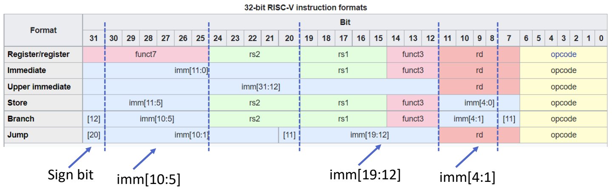

# 05 寄存器与指令编码

[本讲目录](../index.md) · [课程目录](../../index.md) · [上一节：04 指令集与RISC设计](section-4.md) · [下一节：06 数据访问与立即数](section-6.md)

## 寄存器操作数

RV64的整数寄存器为`x0`至`x31`，每个寄存器的数据宽度为64位；这里讨论的基础指令编码为32位。[^s1p45][^s2b11]

寄存器算术指令采用目的操作数在前、两个源操作数在后的顺序：

```asm
add x5, x6, x7    # x5 = x6 + x7
sub x5, x6, x7    # x5 = x6 - x7
```

两条指令都从寄存器文件读取两个源值，完成一次运算，再写入一个目的寄存器。`x0`读出恒为0，写入被丢弃。[^s1p48][^s1p49]

ADD/SUB的整数结果保留低XLEN位，在RV64中即低64位，不产生整数算术溢出异常。[RISC-V整数指令规范](https://docs.riscv.org/reference/isa/v20260120/unpriv/rv32.html)

## 寄存器名称约定

寄存器编号是编码的一部分，别名和常见用途则帮助软件遵循调用约定。[^s1p49]

| 编号 | 常用别名 | 用途 |
| --- | --- | --- |
| x0 | zero | 恒零 |
| x1 | ra | 返回地址 |
| x2 | sp | 栈指针 |
| x3 | gp | 全局指针 |
| x4 | tp | 线程指针 |
| x5–x7 | t0–t2 | 临时值 |
| x8–x9 | s0–s1 | 保存值；x8也可作帧指针fp |
| x10–x17 | a0–a7 | 参数；a0、a1还用于返回结果 |
| x18–x27 | s2–s11 | 保存值 |
| x28–x31 | t3–t6 | 临时值 |

## 寄存器文件端口

两源一目的的指令可由一个32项、每项64位、两读端口和一写端口的寄存器文件实现。每个读端口输入源编号、输出对应64位数据；写端口输入目的编号与数据，写控制信号决定是否提交写入。编号只需$\log_2 32=5$位。[^s1p50]

2读1写是满足这些指令的一种实现。增大寄存器文件容量或增加端口，会增加电路和互联开销、延长访问时间。[^s1p50]

显式命名寄存器也方便编译器安排独立计算。例如，`(A*B)-(C*D)-(E*F)`中的乘法可以选择不同顺序执行，无须受栈顶操作数顺序约束。用5位寄存器编号代替完整内存地址，还可以提高指令编码密度。[^s1p50]

## R格式与指令识别

R格式从指令最高位到最低位排列为：[^s1p51]

| 位范围 | 字段 | 宽度 | 含义 |
| --- | --- | --- | --- |
| 31:25 | funct7 | 7 | 进一步区分操作 |
| 24:20 | rs2 | 5 | 第二源寄存器编号 |
| 19:15 | rs1 | 5 | 第一源寄存器编号 |
| 14:12 | funct3 | 3 | 进一步区分操作 |
| 11:7 | rd | 5 | 目的寄存器编号 |
| 6:0 | opcode | 7 | 指令大类 |

`opcode`区分主要操作类别；`funct3`与`funct7`在相关类别内区分具体指令。因此，相同opcode不意味着相同运算，例如ADD与SUB还需要功能字段来区别。[^s1p51][^s2b12]

**补充解释**：以`add x5,x6,x7`为例，`rs2=00111`、`rs1=00110`、`rd=00101`；加法的`funct7=0000000`、`funct3=000`、`opcode=0110011`，连接得到：

```text
0000000 00111 00110 000 00101 0110011
```

这里的`00101`是寄存器x5的编号，不是x5当前存放的数值。

## 六种编码格式

六种常用格式均为32位。SB、UJ分别也常称B、J格式。下表按高位到低位排列字段。[^s1p45][^s1p47]

| 格式 | 字段顺序 | 常见用途 |
| --- | --- | --- |
| R | funct7、rs2、rs1、funct3、rd、opcode | 寄存器算术 |
| I | imm[11:0]、rs1、funct3、rd、opcode | 立即数运算、load、JALR |
| S | imm[11:5]、rs2、rs1、funct3、imm[4:0]、opcode | store |
| SB/B | imm[12]、imm[10:5]、rs2、rs1、funct3、imm[4:1]、imm[11]、opcode | 条件分支 |
| U | imm[31:12]、rd、opcode | 上部立即数 |
| UJ/J | imm[20]、imm[10:1]、imm[11]、imm[19:12]、rd、opcode | JAL |

格式回答“各位如何解释”，指令语义回答“完成什么操作”，寻址方式回答“从哪里取得操作数或目标”，三者需要区分。

### 立即数为何拆散

编码保持`rs1`、`rs2`、`rd`等寄存器字段在出现时尽量处于相同位置；立即数的不同布局则复用已有的连线位置。带符号立即数的符号位统一来自`inst[31]`，便于符号扩展。[^s1p46][^s2b11]

B和J偏移的最低位隐含为0，因此编码只存其余位。B格式复用S格式的多数位，J格式与U格式也共享部分位置。这样虽然立即数在指令中不连续，却减少不同格式之间的硬件选择和移动开销。分支和跳转的偏移重组后，再按各自语义计算目标。

## opcode类别速查

以下是所用基础指令的大类编码；完整操作还需要相关功能字段。[^s1p70]

| 指令 | opcode | 格式 |
| --- | --- | --- |
| add、sub | 0110011 | R |
| addi、ori | 0010011 | I |
| ld、lb | 0000011 | I |
| sd、sb | 0100011 | S |
| lui | 0110111 | U |
| beq、bne | 1100011 | B |
| jal | 1101111 | J |
| jalr | 1100111 | I |

[RISC-V官方编码表](https://docs.riscv.org/reference/isa/v20260120/unpriv/rv-32-64g.html)

**课堂强调**：重点是理解指令含义、字段和格式，不要求硬背整张opcode表。[^s2b15]



寄存器字段保持固定位置，箭头标出立即数的符号位和复用位。[^s1p46]

## 应用问答

**问：为什么RV64的寄存器操作数字段只需5位，而不是64位？**

答：字段选择32个寄存器中的一个，5位足够；64位是所选寄存器保存的数据宽度。[^s1p50][^s1p51]

**问：S格式没有rd，结果写到哪里？**

答：store将rs2提供的数据写入由rs1和偏移计算出的内存地址，因此不需要目的寄存器字段。[^s1p45]

来源：[^s1p45] [^s1p46] [^s1p47] [^s1p48] [^s1p49] [^s1p50] [^s1p51] [^s1p70] [^s2b11] [^s2b12] [^s2b15]

[^s1p45]: L02.pdf-PDF p.45
[^s1p46]: L02.pdf-PDF p.46
[^s1p47]: L02.pdf-PDF p.47
[^s1p48]: L02.pdf-PDF p.48
[^s1p49]: L02.pdf-PDF p.49
[^s1p50]: L02.pdf-PDF p.50
[^s1p51]: L02.pdf-PDF p.51
[^s1p70]: L02.pdf-PDF p.70
[^s2b11]: L02.docx-DOCX body 408-450
[^s2b12]: L02.docx-DOCX body 451-490
[^s2b15]: L02.docx-DOCX body 565-612


[本讲目录](../index.md) · [课程目录](../../index.md) · [上一节：04 指令集与RISC设计](section-4.md) · [下一节：06 数据访问与立即数](section-6.md)
