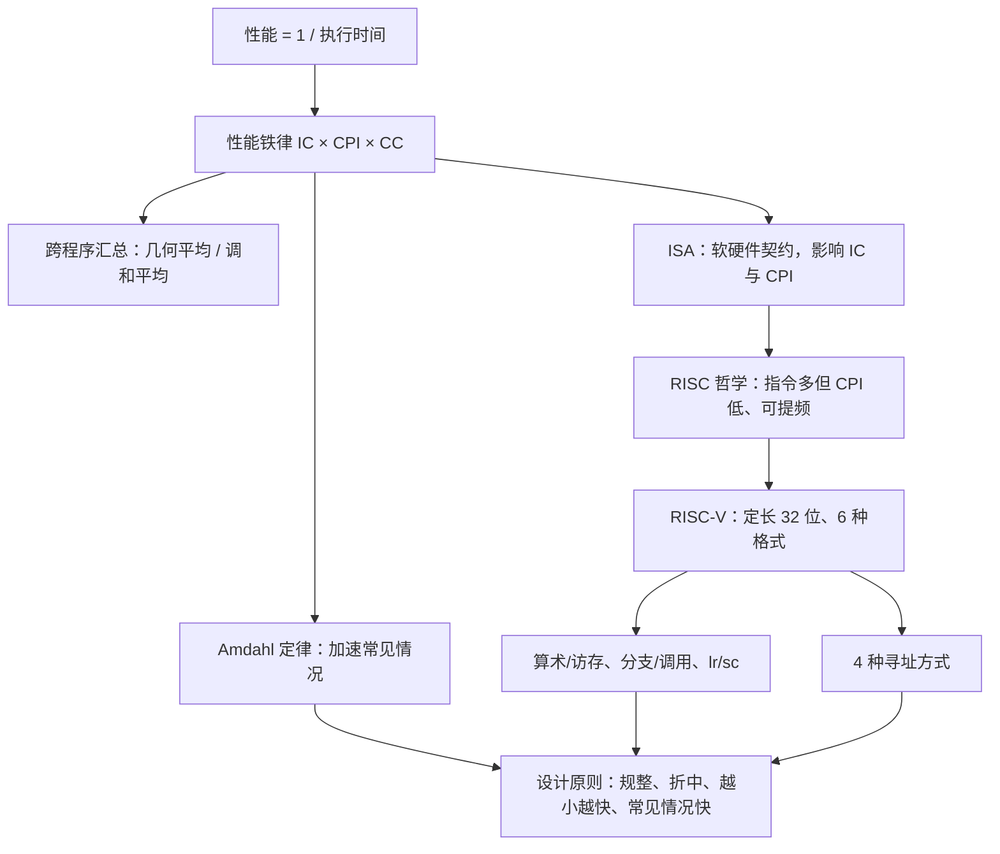

# L02 性能与RISC-V指令集

[课程目录](../index.md)

本讲回答两个问题：怎样定量地说清一台计算机“有多快”，以及软件与硬件之间靠什么“语言”对话。前三章从响应时间、吞吐量和时钟出发，推导性能铁律 CPU time = IC × CPI × CC，再讨论跨程序汇总性能的正确平均方法和 Amdahl 定律；后五章从 ISA 作为软硬件契约与 CISC/RISC 之争出发，系统介绍 RISC-V 的指令格式、算术与访存、分支与过程调用、原子同步和寻址方式。阅读前需要熟悉二进制/十六进制、补码与符号扩展，最好在 ICS 中接触过一种汇编语言（如 Y86/x86）和函数调用栈。

## 章节导航

- [01 性能指标与时钟](chapters/01-performance-metrics-and-clock.md)：响应时间、吞吐量、快n倍定义与时钟周期
- [02 CPI与性能铁律](chapters/02-cpi-and-iron-law.md)：CPI、IPC与性能铁律及指令组合计算
- [03 性能汇总与Amdahl定律](chapters/03-performance-summary-and-amdahls-law.md)：几何/调和平均、Amdahl定律与性价比
- [04 ISA抽象与RISC思想](chapters/04-isa-abstraction-and-risc.md)：ISA是软硬件契约，RISC以简单指令取胜
- [05 RISC-V概览与指令格式](chapters/05-risc-v-overview-and-instruction-formats.md)：RISC-V开放性、扩展命名与六种指令格式
- [06 算术与访存指令](chapters/06-arithmetic-and-memory-instructions.md)：算术与访存指令、寄存器堆、端序与lui常量
- [07 分支过程调用与栈](chapters/07-branches-procedure-calls-and-stack.md)：分支目标、jal/jalr调用、保存约定与栈
- [08 同步指令与寻址方式](chapters/08-synchronization-and-addressing-modes.md)：lr/sc原子操作、四种寻址方式与设计原则

## 本讲小结

本讲的两半由性能铁律串起来：ISA 决定指令数并影响 CPI，组织（微架构）决定 CPI 和时钟周期，RISC 的设计哲学和 RISC-V 的每一个设计取舍（定长 32 位指令、load-store、立即数嵌入指令、少量寻址方式）都可以用“对 IC、CPI、CC 的影响”和“加速常见情况”来解释。

### 核心公式

| 用途 | 公式 | 要点 |
| --- | --- | --- |
| 性能与“快 $n$ 倍” | $\text{perf}=1/T$；$T_Y/T_X=n$ | 比值就是 $n$，不是 $n+1$ |
| 时钟 | $CC=1/CR$ | 1 ns ↔ 1 GHz |
| 有效 CPI | $\sum_i \text{CPI}_i\times\text{IC}_i$ | $\text{IC}_i$ 为动态执行占比 |
| 性能铁律 | $T=\text{IC}\times\text{CPI}\times CC$ | IC←ISA/编译器，CPI←ISA/组织，CC←组织/工艺 |
| 汇总归一化时间 | $\text{GM}=\sqrt[n]{\prod_i T_i/T_{\text{ref},i}}$ | 与参考机无关 |
| 平均 IPC | $\text{HMean}(\text{IPC}_i)=1/\text{Average CPI}$ | IPC 不能算术平均 |
| Amdahl 定律 | $\dfrac{1}{(1-F)+F/S}$ | $F$ 是原执行时间中的比例；上限 $1/(1-F)$ |
| 访存地址 | 基址寄存器 + sext(imm$_{12}$) | 偏移以字节计，$-2048\sim2047$ |
| 分支 / 跳转目标 | PC + sext(imm) | 分支约 $\pm2^{10}$ 字，`jal` 约 $\pm1$ MiB |
| 32 位常量 / 长跳转 | `lui` 高 20 位 + `addi`/`jalr` 低 12 位 | 低 12 位第 11 位为 1 时高 20 位加 1 |

## 不确定事项

- 08 Case 1 若 a0 与 a3 恰在同一保留集合内，SC 可能成功；课堂结论“应该是 0”与规范推演不一致，笔记按规范写为失败
- 07 内存布局中代码段起始地址在课件扫描中不清，按 RISC-V 版教材取 0000 0000 0040 0000hex
- 02 课堂提到乘法约 20–30 周期、加法约 10–14 周期的数字来自 ASR 且仅作示意，笔记未采用具体数值

> [!info]- 来源
> - L02.pdf：PDF p.3–28, 30–32, 34–73
> - L02.docx：DOCX body 124–612
