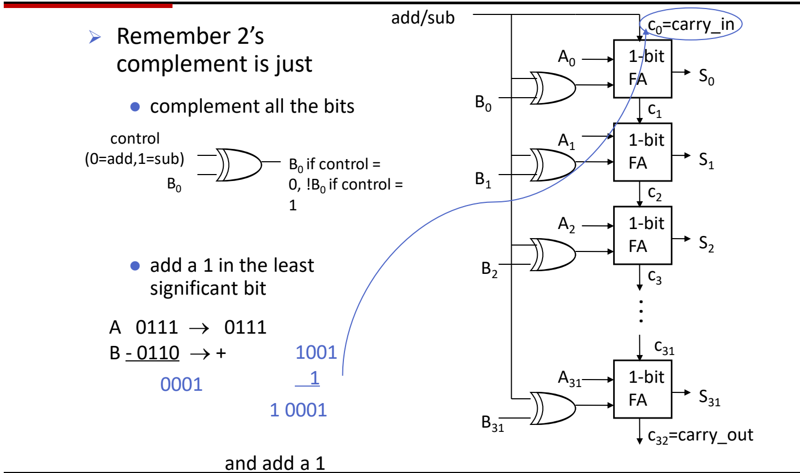

# 01 ALU与整数加减

[本讲目录](../index.md) · [课程目录](../../index.md) · [下一节：02 乘除法与浮点数](02-multiplication-division-and-floating-point.md)

> [!abstract] 本节要点
> - ALU 以 A、B 和操作选择 m 为输入，输出 result 及状态位 zero、ovf；后缀 `i` 表示立即数操作数，`u` 表示无符号；RISC-V 对所有算术/逻辑运算**都不检测溢出**，需要时由软件插入额外指令检查。
> - 补码取负 = 按位取反再加 1；4 位补码范围 $-2^3 \sim 2^3-1$，即 $-8 \sim 7$；“取负”与“按位取反”是两回事。
> - 全加器：$S = A\oplus B\oplus C_{\mathrm{in}}$（奇校验函数），$C_{\mathrm{out}} = AB + AC_{\mathrm{in}} + BC_{\mathrm{in}}$（多数函数）；32 个全加器首尾串联得到行波进位加法器。
> - 加/减法器只需一根控制线：control=1 时每个 $B_i$ 经异或门取反，同一根线接到 $c_0$ 提供“+1”，于是 $A-B = A+\overline{B}+1$。
> - 有符号溢出 ⇔ 进入最高位的进位 $\oplus$ 最高位送出的进位 $=1$；逻辑移位补 0，算术右移 `sra` 补符号位，补码下不需要 `sla`；移位由独立于 ALU 的桶形移位器完成。

## RISC-V ALU 的功能与约定

处理器执行的每条算术、逻辑、比较类指令，最终都要落到同一个运算部件上完成，因此 ALU 的功能清单直接由 ISA 决定。

**算术逻辑单元**（Arithmetic Logic Unit，ALU）是根据操作选择信号对两个操作数做运算的组合部件。它的接口为：[^s1p3]

- **输入**：操作数 A、B，以及操作选择信号 m（operation），m 决定这一次做哪种运算；
- **输出**：运算结果 result；
- **状态位**：zero（结果是否为 0）、ovf（是否溢出）。

RISC-V ALU 必须支持 ISA 中的这些运算：[^s1p3]

| 类别 | 指令 |
|---|---|
| 加 | `add`、`addi` |
| 减 | `sub` |
| 乘除 | `mul`、`mulh`、`mulhu`、`div`、`divu` |
| 逻辑 | `and`、`andi`、`nor`、`or`、`ori`、`xor`、`xori` |
| 比较/分支 | `beq`、`bne`、`slt`、`slti`、`sltiu`、`sltu` …… |

这些运算在 x86、MIPS 等其他 ISA 的 ALU 中基本相同；乘除法的硬件见 [02 乘除法与浮点数](02-multiplication-division-and-floating-point.md)。

### 指令后缀的含义

- **`i` 后缀**：第二个源操作数是指令中给出的**立即数**（immediate），默认按有符号数处理。例如 `addi x5, x6, -4`。并非每条运算都有 `i` 版本：没有 `subi`，减去一个常数用 `addi` 加它的相反数即可。
- **`u` 后缀**：把操作数当作**无符号数**（unsigned）解释，例如 `sltu`、`divu`、`lbu`。同样的位串按有符号和无符号解释时比较结果不同，所以需要两套指令。[^s2b1]

### 扩展方式

立即数或从存储器读出的窄数据要放进 32/64 位寄存器参与运算，高位必须补齐。按指令归类有两种处理：[^s1p3]

1. **符号扩展**（sign extend）：用最高位（符号位）填充高位，保持有符号数值不变——`addi`、`andi`、`slti`。
2. **零扩展**（zero extend）：高位一律填 0，保持无符号数值不变——`lbu`、`lhu`、`lwu`、`ldu`、`sltiu`、`slli`、`srli`、`srai`。

> [!example] 例：同一个 8 位数据的两种扩展
> 字节 `1111 1100` 扩展到 32 位：
>
> 1. 符号扩展：`1111…1111 1111 1100`，表示 $-4$；
> 2. 零扩展：`0000…0000 1111 1100`，表示 $252$。
>
> 因此用 `lb` 和 `lbu` 读同一个字节，寄存器里会得到不同的值。

> [!note] 补充解释
> 按 RISC-V 官方非特权规范的 [RV32I 基本指令集](https://docs.riscv.org/reference/isa/v20260120/unpriv/rv32.html)与 [RV64I 基本指令集](https://docs.riscv.org/reference/isa/v20260120/unpriv/rv64.html)：`sltiu` 的 12 位立即数实际上也先做符号扩展，然后再按无符号数比较；移位指令 `slli/srli/srai` 的立即数是移位量 shamt，本身就是非负的小整数。RV64 中 64 位载入只有 `ld`，没有 `ldu`；`nor` 也不是 RISC-V 基本指令（来自 MIPS 的写法）。源材料的列表侧重说明“哪些指令需要特殊扩展处理”，细节以规范为准。

### RISC-V 不检测溢出

传统 ISA（如 MIPS、x86）在有符号运算溢出时会给出提示或触发陷阱（trap），由系统做额外处理。RISC-V 则规定：**所有算术/逻辑运算都不检测溢出**（no overflow detected），溢出时结果直接按低位截断写回，硬件不做任何处理。[^s1p3] 如果程序需要知道是否溢出，必须在代码中**自己插入额外的指令**来检查。[^s2b1] 溢出的判断规则见下文“溢出检测”。

> [!tip] 课堂强调
> 不检测溢出是 RISC-V 与传统 ALU/ISA 的区别所在：溢出被忽略，想检查就得由软件补指令。

## 补码表示（Two's Complement）

计算机需要用同一套加法硬件处理正数和负数，而不是另造一套减法器；补码让“减去 B”变成“加上 $-B$”，加法电路无需区分符号。

**补码**（two's complement）用 $n$ 位表示有符号整数，最高位权值为 $-2^{n-1}$，其余位权值为正。$n$ 位补码的表示范围是
$$
-2^{n-1} \;\sim\; 2^{n-1}-1
$$
4 位时为 $-2^3=-8$ 到 $2^3-1=7$。[^s1p4]

| 补码 | 十进制 | 补码 | 十进制 |
|---|---|---|---|
| `1000` | −8 | `0000` | 0 |
| `1001` | −7 | `0001` | 1 |
| `1010` | −6 | `0010` | 2 |
| `1011` | −5 | `0011` | 3 |
| `1100` | −4 | `0100` | 4 |
| `1101` | −3 | `0101` | 5 |
| `1110` | −2 | `0110` | 6 |
| `1111` | −1 | `0111` | 7 |

**取负**（negate）的规则：

1. **按位取反**（complement all the bits）；
2. **再加 1**。

> [!example] 例：由 5 求 −5
> 1. $5 = 0101_2$；
> 2. 按位取反：$1010$；
> 3. 加 1：$1011$，查表正是 $-5$。[^s1p4]

> [!warning] 易错点
> **取负与按位取反不同**（negate and invert are different）。$1010$ 只是 $0101$ 的反码，按补码解释是 $-6$；必须再加 1 才得到 $-5$。判断方法：$x + (-x)$ 应为 0（丢弃最高位进位），而 $x + \overline{x}$ 恒为全 1，即 $-1$。

## 全加器（Full Adder）

多位加法可以拆成逐位相加，每一位都要同时处理本位的两个数和低位送来的进位，这个“一位加法”单元就是全加器。

**全加器**（full adder, FA）有三个输入 $A$、$B$、$C_{\mathrm{in}}$ 和两个输出 $S$、$C_{\mathrm{out}}$，其中 $C_{\mathrm{in}}$、$C_{\mathrm{out}}$ 分别表示进位输入与进位输出（电路图中的 `carry_in`、`carry_out`）；**半加器**（half adder）则没有低位进位输入。二者的区别就在于是否接收低位进位。[^s2b1]

真值表：[^s1p5]

| $A$ | $B$ | $C_{\mathrm{in}}$ | $C_{\mathrm{out}}$ | $S$ |
|---|---|---|---|---|
| 0 | 0 | 0 | 0 | 0 |
| 0 | 0 | 1 | 0 | 1 |
| 0 | 1 | 0 | 0 | 1 |
| 0 | 1 | 1 | 1 | 0 |
| 1 | 0 | 0 | 0 | 1 |
| 1 | 0 | 1 | 1 | 0 |
| 1 | 1 | 0 | 1 | 0 |
| 1 | 1 | 1 | 1 | 1 |

从真值表读出两个逻辑式：[^s1p5]
$$
S = A \oplus B \oplus C_{\mathrm{in}}
$$
$$
C_{\mathrm{out}} = A\cdot B + A\cdot C_{\mathrm{in}} + B\cdot C_{\mathrm{in}}
$$

- $S$ 是**奇校验函数**（odd parity function）：三个输入中 1 的个数为奇数时 $S=1$。
- $C_{\mathrm{out}}$ 是**多数函数**（majority function）：三个输入中至少两个为 1 时输出 1。

## 行波进位加法器与加/减法器

有了一位的全加器，接下来要解决两个问题：如何拼出 32 位加法器；如何几乎不加硬件就让它也能做减法。

### 32 位行波进位加法器（Ripple Carry Adder）

**行波进位加法器**（ripple carry adder）把 32 个一位全加器首尾串联：[^s1p6]

1. 第 $i$ 个全加器的输入是 $A_i$、$B_i$ 和进位 $c_i$，输出本位和 $S_i$ 与进位 $c_{i+1}$；
2. 每一位的 carry_out 直接接到高一位的 carry_in；
3. 最低位的进位输入 $c_0$ 就是整个加法器的 carry_in，最高位送出的 $c_{32}$ 就是整个加法器的 carry_out。

进位像波一样从最低位逐级传到最高位，这也是它的缺点：最高位要等前面所有进位依次算完，速度慢。更快的加法器结构偏向数字电路设计，本讲不展开。[^s2b1]

### 加/减法器（Adder/Subtractor）

减法 $A-B$ 等于 $A+(-B)$，而 $-B$ 的补码是“$B$ 按位取反再加 1”，所以只需在加法器上完成这两件事：

1. **按位取反**：每个 $B_i$ 先与控制信号 control（0=add，1=sub）做异或后再送入全加器。异或门的一个输入为 0 时输出等于另一输入，为 1 时输出取反，所以 control=0 时送入 $B_i$，control=1 时送入 $\overline{B_i}$。
2. **加 1**：把同一根 control 线接到最低位进位 $c_0$。做减法时 control=1，正好让 $c_0=1$，在最低位加上 1。[^s1p6]

用 $u$ 表示控制信号 `control`（$u=0$ 做加法，$u=1$ 做减法），同一套电路满足
$$
S = A + (B \oplus u) + u =
\begin{cases}
A + B, & u=0 \\
A + \overline{B} + 1 = A - B, & u=1
\end{cases}
$$
其中 $B\oplus u$ 表示 $B$ 的每一位都与控制位 $u$ 异或。



图：32 位行波进位加法/减法器：每位 $B_i$ 与控制信号异或，控制信号同时作为 $c_0$ 提供“+1”，进位逐级传递到 $c_{32}$；左侧示例 $0111_2-0110_2=0001_2$。

> [!example] 例：用加/减法器计算 $0111 - 0110$（4 位）
> 1. control=1，$B=0110$ 逐位取反得 $1001$；
> 2. $c_0=1$，计算 $0111 + 1001 + 1$：
>    $$0111 + 1001 = 1\,0000,\quad 1\,0000 + 1 = 1\,0001$$
> 3. 最高位进位 $c_4=1$ 落在 4 位之外被丢弃，结果为 $0001$，即 $7-6=1$。[^s1p6]

> [!warning] 易错点
> 做减法时 $C_{\mathrm{out}}=1$ 并不表示溢出。本例 $c_4=1$，但进入最高位的进位 $c_3$ 也是 1，二者异或为 0，结果正确。有符号溢出要用下一节的规则判断。

## 溢出检测（Overflow Detection）

RISC-V 硬件不报告溢出，软件若要检查，就需要一个简单可靠的判断依据。

**溢出**（overflow）指运算结果太大（或太小），无法用 32 位（例中为 4 位）有符号数表示。按操作数符号分为四种情形：[^s1p7]

| 运算 | 操作数符号 | 溢出时结果符号 |
|---|---|---|
| 加 | 正 + 正 | 负 |
| 加 | 负 + 负 | 正 |
| 减 | 正 − 负 | 负 |
| 减 | 负 − 正 | 正 |

一正一负相加（或同号相减）永远不会溢出，因为结果的绝对值不会超过较大的操作数。

**判断规则**：设 $n$ 位加法中，进入最高位（MSB）的进位为 $c_{n-1}$，最高位送出的进位为 $c_n$，用 $O$ 表示溢出标志，则[^s1p7]
$$
O = c_{n-1} \oplus c_n
$$
$O=1$ 表示溢出，$O=0$ 表示没有溢出。4 位时就是比较第 4 位的进位输入与第 5 位（carry_out）的值。[^s2b2]

> [!example] 例 1：$7 + 3$（4 位有符号）
> 逐位相加 $0111 + 0011$：
>
> 1. 位 0：$1+1=10_2$，$S_0=0$，$c_1=1$；
> 2. 位 1：$1+1+1=11_2$，$S_1=1$，$c_2=1$；
> 3. 位 2：$1+0+1=10_2$，$S_2=0$，$c_3=1$；
> 4. 位 3（MSB）：$0+0+1=1$，$S_3=1$，$c_4=0$。
>
> 结果 $1010 = -6$，而真实值 $10 > 7$。进入 MSB 的进位 $c_3=1$，送出的进位 $c_4=0$，$1\oplus0=1$，判定溢出（正 + 正得负）。[^s1p7]

> [!example] 例 2：$-4 + (-5)$（4 位有符号）
> $1100 + 1011$：
>
> 1. 位 0：$0+1=1$，$c_1=0$；
> 2. 位 1：$0+1=1$，$c_2=0$；
> 3. 位 2：$1+0=1$，$c_3=0$；
> 4. 位 3：$1+1=10_2$，$S_3=0$，$c_4=1$。
>
> 结果 $0111=7$，而真实值 $-9 < -8$。$c_3=0$，$c_4=1$，$0\oplus1=1$，判定溢出（负 + 负得正）。[^s1p7]

### 为什么这条规则成立

只看最高位：设两个操作数的符号位为 $a$、$b$，结果符号位 $s = a\oplus b\oplus c_{n-1}$，$c_n = \operatorname{maj}(a,b,c_{n-1})$。

- $a=b=0$（正+正）：$c_n=0$；若 $c_{n-1}=1$，则 $s=1$ 变负，正好溢出，此时 $c_{n-1}\oplus c_n=1$。
- $a=b=1$（负+负）：$c_n=1$；若 $c_{n-1}=0$，则 $s=0$ 变正，正好溢出，此时 $c_{n-1}\oplus c_n=1$。
- $a\ne b$（异号）：$c_n = c_{n-1}$，异或恒为 0，与“异号相加不溢出”一致。

减法在加/减法器中被转换成 $A+\overline{B}+1$ 的加法，同样适用这条规则。这一证明原本留作课后练习（On your own）。[^s1p7]

> [!warning] 易错点
> 不要用“最高位有进位输出”判断有符号溢出：carry_out 只反映**无符号**加法是否超出范围。有符号溢出看的是进入与送出最高位两个进位是否**不同**。

## 移位运算与桶形移位器

把 8 位字符打包进 32 位字、或从字中拆出某个字节，需要把所有位整体左移或右移；移位还能快速实现乘除 2 的幂。[^s1p8]

**移位**（shift）把一个字中的所有位向左或向右移动若干位，移出的位丢弃，空出的位按规则填充。

### 逻辑移位（Logical Shift）

**逻辑移位**在空出的位置一律**补 0**：[^s1p8]

```asm
sll  x5, x6, x7    # x5 = x6 << x7 位（移位量在寄存器中）
srl  x5, x6, x7    # x5 = x6 >> x7 位
slli x5, x8, 8     # x5 = x8 << 8 位（移位量是立即数）
srli x5, x8, 8     # x5 = x8 >> 8 位
```

### 算术右移（Arithmetic Shift）

逻辑右移会把负数的符号位变成 0，数值意义被破坏。**算术移位**要保持移位后数值的算术正确性：右移一位应为原值的 $\tfrac12$，左移一位应为原值的 2 倍。因此 `sra` 用最高位（**符号位**）作为移入的位。[^s1p9]

```asm
sra  x5, x6, x7    # x5 = x6 >> x7 位，高位补符号位
srai x5, x6, 7     # x5 = x6 >> 7 位，高位补符号位
```

> [!example] 例：对 $-8$ 右移 1 位（4 位）
> $-8 = 1000$。
>
> 1. 逻辑右移：$0100 = 4$，数值意义丢失；
> 2. 算术右移：补符号位 1，得 $1100 = -4$，正好是 $-8$ 的一半。

**补码下不需要 `sla`**：左移时空出的是最低位，无论逻辑还是算术都只能补 0，两者效果完全相同，所以 RISC-V 只有 `sll`，没有算术左移。只有右移时，移入的位取决于符号位是 0 还是 1，逻辑与算术结果才会不同。[^s2b2]

> [!warning] 易错点
> 课堂口述中曾把“根据符号位决定补 0 还是补 1”的右移说成“逻辑右移”，这是口误：按符号位填充的是**算术右移** `sra/srai`；**逻辑右移** `srl/srli` 永远补 0。[^s1p8]

### 桶形移位器（Barrel Shifter）

移位操作并不在 ALU 内部完成，而是由一个独立于 ALU 的专用电路——**桶形移位器**（barrel shifter）实现。用分立逻辑搭建它需要大量门，但在 VLSI 中实现起来相当容易，结构也比 ALU 简单。[^s1p9]

> [!note] 补充解释
> 桶形移位器的常见做法是按移位量的各个二进制位分级：第 $k$ 级由一排多路选择器决定“移 $2^k$ 位或不移”，32 位只需 5 级，任意移位量都在固定延迟内一次完成，而不必逐位移动。

> [!question]- 自测：4 位有符号数计算 $5 + 4$ 与 $5 - 4$，各自是否溢出？用进位规则说明。
> $5+4$ 溢出，$5-4$ 不溢出。$0101+0100$：位 2 产生进位，$c_3=1$，位 3 为 $0+0+1$，$c_4=0$，结果 $1001=-7$，$c_3\oplus c_4=1$。$5-4$ 在加/减法器中算 $0101+1011+1$：$c_3=1$、$c_4=1$，结果 $0001$，异或为 0。

> [!question]- 自测：32 位寄存器 x6 的值为 `0xFFFFFFF0`（$-16$），`srli x5, x6, 2` 与 `srai x5, x6, 2` 的结果分别是什么？
> `srli` 补 0：`0x3FFFFFFC`，按有符号解释是一个很大的正数；`srai` 补符号位 1：`0xFFFFFFFC`，即 $-4 = -16/4$。只有算术右移保持了“右移一位减半”的数值意义。

> [!question]- 自测：加/减法器若把 control 只接到异或门、忘了接到 $c_0$，做 $0111 - 0110$ 会得到什么？
> 得到 $0111+1001 = 1\,0000$，截断为 $0000$，比正确结果 $0001$ 少 1。原因是只完成了按位取反（反码），缺少补码所需的“加 1”。

> [!info]- 来源
> - L03.pdf：PDF p.3–9
> - L03.docx：DOCX body 1–75

[^s1p3]: L03.pdf-PDF p.3
[^s2b1]: L03.docx-DOCX body 1-39
[^s1p4]: L03.pdf-PDF p.4
[^s1p5]: L03.pdf-PDF p.5
[^s1p6]: L03.pdf-PDF p.6
[^s1p7]: L03.pdf-PDF p.7
[^s2b2]: L03.docx-DOCX body 40-75
[^s1p8]: L03.pdf-PDF p.8
[^s1p9]: L03.pdf-PDF p.9

[本讲目录](../index.md) · [课程目录](../../index.md) · [下一节：02 乘除法与浮点数](02-multiplication-division-and-floating-point.md)
