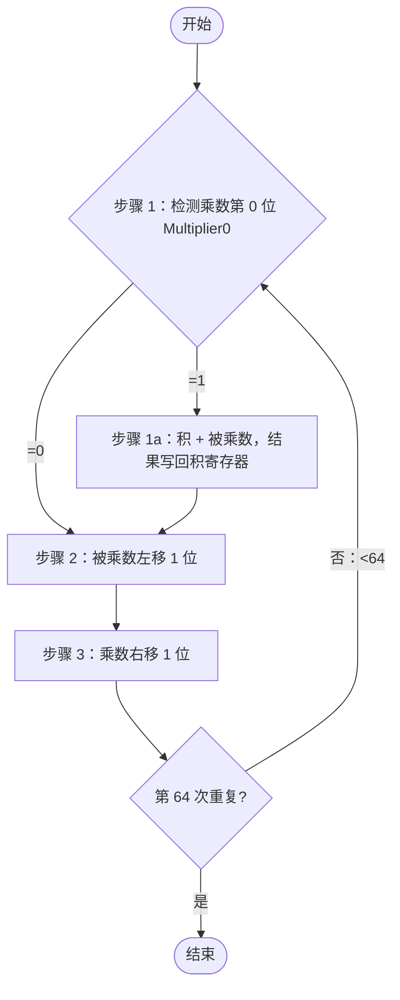
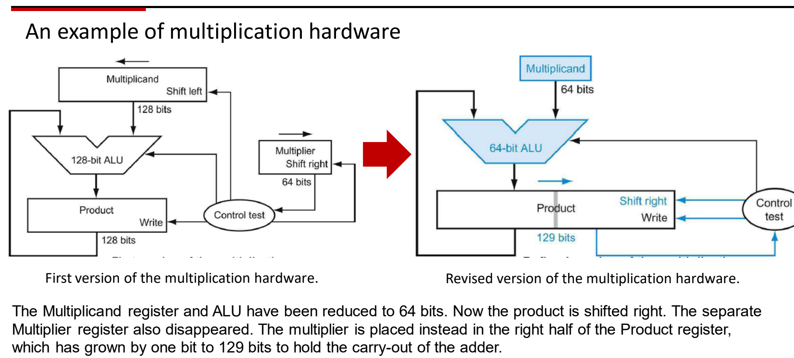
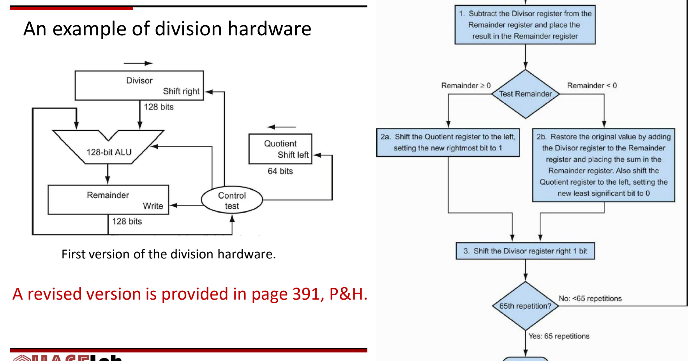

# 02 乘除法与浮点数

[本讲目录](../index.md) · [课程目录](../../index.md) · [上一节：01 ALU与整数加减](01-alu-and-integer-addition.md) · [下一节：03 数据通路部件与时钟](03-datapath-elements-and-clocking.md)

> [!abstract] 本节要点
> - 二进制乘法 = 用与门生成部分积 $A_iB_j$，错位后相加；4 位阵列乘法器用行波进位加法（RCA）约需 $8T$，改用进位保留加法（CSA，3:2 压缩器）约需 $6T$。
> - P&H 第一版乘法器：128 位被乘数左移、64 位乘数右移、128 位 ALU，重复 64 次；改进版把 ALU 和被乘数缩为 64 位，乘数放进积寄存器右半，积寄存器 129 位并右移。
> - 二进制除法 = 比较 + 减法 + 移位，每位商只能是 0 或 1；$29\div3$ 得商 $1001_2$、余数 $10_2$。P&H 第一版是恢复余数除法，重复 65 次。
> - RISC-V 一条指令只有一个目的寄存器：`mul`/`mulh` 取 128 位积的低/高 64 位，`div`/`rem` 取商/余数；乘除溢出被忽略，除零也没有硬件提示，要由软件检查。乘除比加法慢得多。
> - IEEE 754：$x=(-1)^s\times(1+F)\times2^{E-\text{bias}}$，单精度 1/8/23 位、偏置 127，双精度 1/11/52 位、偏置 1023；RISC-V 浮点寄存器 f0–f31 独立于 x0–x31，f0 不恒为 0，需要 F/D 扩展。

## 二进制乘法与部分积（Partial Product）

逐次相加来做乘法太慢：$7\times9$ 要做 9 次加法。十进制竖式的办法是把乘数拆成各位，分别与被乘数相乘得到**部分积**（partial product），再错位相加。二进制也能这样做，而且更简单，因为乘数每一位只有 0 或 1。

**二进制乘法**：被乘数（multiplicand）与乘数（multiplier）的每一位相乘得到一个部分积，第 $j$ 个部分积左移 $j$ 位，所有部分积相加就是积；求和时的进位同样按二进制处理。$n$ 位乘 $n$ 位，积为 $2n$ 位。[^s1p124]

> [!example] 例：$5\times3$ 与 $11\times13$
> 1. $5\times3$：$101\times11 = 101\times10 + 101\times1 = 1010 + 101 = 1111_2 = 15$。
> 2. $11\times13$：$1011\times1101$，乘数从低到高为 1、0、1、1，得到 4 个部分积：
>    - $1011$（第 0 位，不移位）
>    - $0000$（第 1 位，左移 1 位）
>    - $101100$（第 2 位，左移 2 位）
>    - $1011000$（第 3 位，左移 3 位）
> 3. 求和：$11+0+44+88 = 143 = 10001111_2$。[^s2b2]

**部分积的每一位用与门产生**：一位乘一位的真值表是 $0\cdot0=0,\ 0\cdot1=0,\ 1\cdot0=0,\ 1\cdot1=1$，和与门（AND）完全相同。所以被乘数的每一位 $A_i$ 与乘数的某一位 $B_j$ 过一个与门，就得到部分积中的 $A_iB_j$。

## 阵列乘法器与进位保留加法（Carry-Save Adder）

部分积有了，问题是怎么用加法器把它们快速加起来。这里用到两种加法模块（全加器的结构见 [[01 ALU与整数加减]]）：

- **半加器**（HA）：输入 A、B，输出本位 S 与进位 $C_{out}$；
- **全加器**（FA）：输入 A、B、$C_{in}$，输出 S 与 $C_{out}$；
- 4 位**行波进位加法器**（RCA）= 1 个 HA 打头 + 串联 3 个 FA。

### 用 RCA 搭成的 4 位阵列乘法器

被乘数 $A_3A_2A_1A_0$，乘数 $B_3B_2B_1B_0$，积为 $S_0\ldots S_7$。

1. $A_0B_0$ 不需要和别的数相加，直接输出为 $S_0$。
2. 第 2 个部分积错开一位，与第 1 个部分积用一个 4 位 RCA 相加；$A_1B_0 + A_0B_1$ 的本位直接输出为 $S_1$；最左边的 FA 缺一个输入，接常数 0。
3. 上一步的和再与错开一位的第 3 个部分积相加（又一个 4 位加法模块），得到 $S_2$。
4. 结果再与第 4 个部分积相加，得到 $S_3,S_4,S_5,S_6,S_7$。

**延迟**：设每个加法器子模块耗时 $T$。RCA 中高位要等低位进位：$A_2B_0$ 与 $A_1B_1$ 求和要等 $A_1B_0+A_0B_1$ 的进位，$A_3B_0$ 与 $A_2B_1$ 又要等前一位的进位。3 行各 4 个模块共 12 个，但从第 3 个周期起，左边的加法器和下一行的加法器可以同时算，所以得到 $S_7$ 实际需要 **$8T$**，不是 $12T$；扩展到 6 位，延迟增加到 $14T$。[^s2b3] 延迟的根源是进位在每一行里横向传递：三行各传 3 次，共 9 次。

### 进位保留：先把所有列算完，进位留给下一级

手算乘法是竖着把一列数加起来：本位写下，进位留给下一列。在硬件里，多列可以同时求和，而且进位不必马上传给左边一位，可以作为一个**新的数据输入**交给下一级：

1. 第一级：全加器最多 3 个输入，所以先对前三个部分积的每一列同时求和，得到本位和进位；
2. 第二级：把这些进位作为数据，和上一级的本位、第 4 个部分积一起求和；
3. 最后一级：只剩一行本位和一行进位，用一个普通加法器做一次带进位传递的加法。

这种加法模块叫**进位保留加法器**（carry-save adder，CSA）：模块内部不像 RCA 那样传递进位，而是把进位输入变成一个普通数据输入，相当于输入三个数、输出两个数，所以也叫 **3:2 压缩器**（3:2 compressor）。只有最后的总加法要等进位传递，4 位乘法只需 **$6T$**。[^s2b3]

> [!warning] 易错点
> CSA 的"快"不是减少了加法次数，而是去掉了中间各级的进位传播等待：中间各级只输出"本位 + 进位"两个数，进位传播只在最后一级发生一次。

### 快速乘法器（备份页内容）

部分积可以**并行生成、并行相加**来加速乘法。[^s1p124] P&H 的快速乘法器把循环"展开"：不再把一个 64 位加法器用 63 次，而是用 63 个加法器，并把它们组织成能让延迟最小的结构（加法树）。[^s1p125]

## 移位相加乘法器（Shift-and-Add Multiplier）

阵列乘法器每个部分积都要一行加法器，64 位时硬件开销很大。P&H 的顺序乘法器只用一个 ALU，每个周期处理乘数的一位。

**第一版**（被乘数 128 位、左移；乘数 64 位、右移；ALU 128 位；积 128 位；控制单元检测乘数最低位）：



被乘数每次左移 1 位，正好对应"第 $j$ 个部分积左移 $j$ 位"；乘数为 1 的位才加。部分积是一个接一个地加到积里、每次加法都要完整的进位传递，所以这一版的思路属于 RCA 式，不是 CSA。[^s2b3]

**改进版**：任何时刻 128 位被乘数寄存器里只有 64 位有用，积寄存器也有一半是空的，于是把它们合并：

- 被乘数寄存器和 ALU 缩为 **64 位**；
- 不再左移被乘数，而是把**积右移**；
- 去掉独立的乘数寄存器，乘数放进**积寄存器的右半**；
- 积寄存器加 1 位变成 **129 位**，用来存加法器的进位输出；
- 只剩一个移位器。[^s1p12]



> [!note] 补充解释
> 改进版每一步的做法（P&H）：检测积寄存器最低位（即乘数当前位），为 1 就把被乘数加到积的左半；然后整个积寄存器右移 1 位；重复 64 次。乘数位被检测后随右移移出，空出的位置正好由积的低位填入。

> [!example] 例：用 4 位改进版乘法器计算 $0101\times0011$
> 积寄存器 9 位 = 进位 | 左半 4 位 | 右半 4 位，初值 `0 0000 0011`（乘数放右半）。
>
> 1. 最低位 1：左半 $0000+0101$ → `0 0101 0011`；右移 → `0 0010 1001`
> 2. 最低位 1：左半 $0010+0101=0111$ → `0 0111 1001`；右移 → `0 0011 1100`
> 3. 最低位 0：只右移 → `0 0001 1110`
> 4. 最低位 0：只右移 → `0 0000 1111`
>
> 积 $00001111_2=15$，与 $5\times3$ 的结果一致。

## 二进制除法与除法硬件

除法是试商、移位、相减的重复。[^s1p15] 十进制要心算"让余数小于除数的最大商"（$29\div3$ 要想到 $3\times9=27$），二进制没有这个负担：每位商只能是 0 或 1，够减就是 1，不够减就是 0。所以**二进制除法只需要比较和减法，不需要乘法**。[^s2b4]

> [!example] 例：$29\div3$（$11101_2\div11_2$）
> 从被除数高位开始，看当前部分余数能否减去除数：
>
> 1. 最高位 `1` < `11` → 商位 0；
> 2. 前两位 `11` ≥ `11` → 商位 1，相减（实际减的是 $11000_2$），余数 `101`；
> 3. 再看下一位 `01` < `11` → 商位 0；
> 4. `10` < `11` → 商位 0；
> 5. `101` ≥ `11` → 商位 1，$101-11=10$。
>
> 商 $1001_2=9$，余数 $10_2=2$，与十进制结果一致。[^s2b4]

### 比较后再减的除法电路（课堂视频）

硬件需要：存除数的寄存器、减法器、存被除数/余数的寄存器、存商的寄存器，以及一个比较大小并决定写回的**控制单元**（control unit）。被除数和余数放在同一个寄存器，因为够减时下一步的被减数就是这次减出来的余数。

以 8 位数为例：除数寄存器、被除数/余数寄存器各 16 位，商寄存器 8 位。

1. **初始化**：29 放在余数寄存器的低 8 位；3 放在除数寄存器的**高 8 位**；商全 0。
2. **比较**：余数寄存器与除数寄存器比较。
3. **够减**：商从右端移入 1（最左位被挤出，商寄存器整体左移），余数寄存器改写为差。
4. **不够减**：商移入 0，余数寄存器不变。
5. **除数右移 1 位**，模拟"往下看一位"，回到第 2 步。

用 $3\cdot2^k$ 表示除数当前的位置：$k\ge4$ 时 $3\cdot2^k\ge48>29$，商位都是 0；$k=3$ 时 $24\le29$，商位 1，余数改为 $5=101_2$；$k=2,1$ 时 $12,6>5$，商位 0；$k=0$ 时 $3\le5$，商位 1，余数改为 $10_2$。除数从高 8 位移到低 8 位共右移 **8 次**，得到商 `00001001`、余数 `10`。[^s2b4] 这一版每次先比较，只有够减才写回差。

### P&H 第一版：恢复余数除法（Restoring Division）

P&H 第一版除法硬件：除数寄存器 128 位、右移；ALU 128 位；余数寄存器 128 位；商寄存器 64 位、左移。它不先比较，而是**先减、看符号、不够减再加回来**：

1. 余数寄存器 ← 余数 − 除数；
2. 检测余数：
   - **2a**（余数 ≥ 0）：商左移，新的最低位置 1；
   - **2b**（余数 < 0）：把除数加回余数寄存器，**恢复**原值；商左移，新的最低位置 0；
3. 除数右移 1 位；
4. 未到第 65 次重复就回到第 1 步，第 65 次后结束。[^s1p16]



P&H 第 391 页另有改进版除法硬件。[^s1p16]

> [!note] 补充解释
> 重复 65 次而不是 64 次，是因为除数一开始放在 128 位寄存器的左半（相当于左移了 64 位），要从位置 64 一直对齐到位置 0，共 65 个位置。课堂视频里除数放在 16 位寄存器的高 8 位，也是同样的安排。

> [!warning] 易错点
> 视频电路和 P&H 流程图是两种做法：视频是"先比较，够减才减"，P&H 是"先减，减成负数再加回"（恢复余数）。两者商和余数相同，但 P&H 每步不够减时多一次加法。不要把视频里的 8 次与流程图的 65 次混为一谈，它们的位宽也不同。

## RISC-V 乘除指令与溢出处理

两个 64 位数相乘得到 128 位积，整数除法同时产生商和余数，但 RISC-V 的 R 型格式（funct7 rs2 rs1 funct3 rd opcode）只有一个目的寄存器 rd，所以每种结果各用一条指令：

```asm
mul  x5, x7, x8   # x5 = x7 * x8 的低 64 位
mulh x6, x7, x8   # x6 = x7 * x8 的高 64 位
div  x5, x7, x8   # x5 = x7 / x8（商）
rem  x6, x7, x8   # x6 = x7 % x8（余数）
```

128 位积两半都要时就执行两条指令，这是只有一个目的寄存器带来的代价。[^s1p13][^s1p17]

**性能**：乘法本质上是多次加法加移位，即使用快速专用硬件，也比加法器复杂、慢得多；除法器更复杂、更慢。[^s1p13] 设计处理器时要考虑这一点。

**溢出与除零**：RISC-V 的除法和乘法一样**忽略溢出**，商是否过大要由软件判断；除数为 0 时也没有硬件机制通知，软件（或编译器生成的代码）必须先显式检查除数。[^s1p17]

> [!warning] 易错点
> 课堂口头说乘法"不会溢出"，这不准确。`mul` 只把 128 位积的低 64 位写回，真实积超出 64 位就是溢出，只是 RISC-V 不检测。[^s1p17] 软件可以用 `mulh` 取高 64 位来检查：有符号乘法的高 64 位不等于低 64 位符号位的扩展时，就发生了溢出。

> [!note] 补充解释
> RISC-V M 扩展还有 `mulhu`（无符号 × 无符号的高位）、`mulhsu`（有符号 × 无符号的高位）和 `divu`/`remu`。规范规定除以 0 不触发异常：商为全 1，余数等于被除数；有符号溢出 $-2^{63}\div(-1)$ 的商为 $-2^{63}$，余数为 0。见 [RISC-V ISA Manual](https://github.com/riscv/riscv-isa-manual) 中 M 扩展一章。

## IEEE 754 浮点表示（Floating Point）

地球年龄约 $4\,600\,000\,000 = 4.6\times10^9$ 年，1 个原子质量单位约 $1.6\times10^{-27}$ kg，两者都无法用 32 位整数编码。**浮点数**借用科学计数法，把数写成 $(-1)^{\text{sign}}\times F\times2^E$；基数 2 固化在浮点运算单元（FPALU）的设计里，不需要存储。[^s1p18]

单精度仍要放进 32 位：

| 字段 | 符号 $s$ | 指数 $E$ | 小数 $F$ |
|---|---|---|---|
| 单精度（32 位） | 1 位 | 8 位 | 23 位 |
| 双精度（64 位） | 1 位 | 11 位 | 52 位 |

总位数固定时，多给 $F$ 就提高**精度**（数有多准），多给 $E$ 就扩大**范围**（数能有多大或多小），两者此消彼长。[^s1p18]

### IEEE 754 编码规则

绝大多数计算机遵循 **IEEE 754 标准**，规格化数的值为

$$
x = (-1)^{\text{sign}} \times (1+F) \times 2^{E-\text{bias}}
$$

- **隐藏位**（hidden bit）：有效数字规格化为 $1.xxx$ 的形式，最高位一定是 1，所以不存储；$F$ 只存小数点后的部分。
- **偏置表示**（excess/biased notation）：$E$ 按无符号数存储，实际指数为 $E-\text{bias}$，这样不需要符号位也能表示负指数。单精度 $\text{bias}=127$，双精度 $\text{bias}=1023$。[^s1p19]
- **$E$ 放在 $F$ 前面**：这是为了方便浮点数排序，同号时位串的大小顺序与数值顺序一致，可以按整数比较。[^s1p19]

> [!warning] 易错点
> 课堂口头把双精度偏置说成"1027"，正确值是 $1023=2^{11-1}-1$（单精度 $127=2^{8-1}-1$）。[^s2b5]

特殊编码由 $E$ 的全 0、全 1 两端给出：[^s1p19]

| 单精度 $E$（8 位） | 单精度 $F$（23 位） | 双精度 $E$（11 位） | 双精度 $F$（52 位） | 表示 |
|---|---|---|---|---|
| 0 | 0 | 0 | 0 | 真零（true zero） |
| 0 | 非零 | 0 | 非零 | 非规格化数（denormalized） |
| 1–254 | 任意 | 1–2046 | 任意 | 规格化浮点数 |
| 255 | 0 | 2047 | 0 | 无穷（infinity） |
| 255 | 非零 | 2047 | 非零 | 非数（NaN） |

> [!note] 补充解释
> 非规格化数没有隐藏位，值按 $(-1)^s\times(0+F)\times2^{1-\text{bias}}$ 计算，用来表示比最小规格化数更接近 0 的数。

> [!example] 例：把 $-0.75$ 编码成单精度
> 1. $0.75 = 0.11_2 = 1.1_2\times2^{-1}$，所以 $s=1$。
> 2. $E = -1+127 = 126 = 01111110_2$。
> 3. $F$ 去掉隐藏位后是 $.1$，即 `10000000000000000000000`。
> 4. 位串：`1 01111110 10000000000000000000000`。

> [!tip] 课堂强调
> 单精度 32 位和双精度 64 位之外，AI 计算中更常用 NVIDIA 推动的 8 位、4 位等低精度格式：精度更低，但计算更快。[^s2b5]

### 浮点加法步骤（备份页内容）

计算 $(F_1\times2^{E_1}) + (F_2\times2^{E_2}) = F_3\times2^{E_3}$：[^s1p126]

1. 恢复 $F_1$、$F_2$ 的隐藏位。
2. **对阶**：设 $E_1\ge E_2$，把 $F_2$ 右移 $E_1-E_2$ 位，移出的位用舍入位（round）、保护位（guard）和粘滞位（sticky）三位记录。
3. 把对阶后的 $F_2$ 加到 $F_1$，得到 $F_3$。
4. **规格化** $F_3$，使其为 $1.XXXX\ldots$ 的形式：
   - $F_1$、$F_2$ 同号时 $F_3\in[1,4)$，最多右移 1 位，同时 $E_3$ 加 1；
   - 异号时 $F_3$ 可能需要左移很多位，每左移一位 $E_3$ 减 1。
5. **舍入** $F_3$，舍入后可能需要再规格化一次。
6. 存储前把 $F_3$ 的最高位重新隐藏。

如何进一步提高精度，见 P&H 第 427–429 页。[^s1p126]

## RISC-V 浮点指令

RISC-V 有**独立的浮点寄存器堆** f0–f31，与整数寄存器 x0–x31 分开，并用专门的指令在它们和内存之间传数据。[^s1p20]

```asm
flw   f1, 54(x5)     # f1 = Memory[x5+54]（读 32 位字）
fsw   f1, 58(x5)     # Memory[x5+58] = f1
fadd.s f2, f4, f6    # 单精度加法 f2 = f4 + f6
fadd.d f2, f4, f6    # 双精度加法
flt.s x5, f2, f4     # if (f2 < f4) x5 = 1; else x5 = 0
flt.d x5, f2, f4     # 双精度比较，语义相同
```

同理还有 `fsub.s`、`fsub.d`、`fmul.s`、`fmul.d`、`fdiv.s`、`fdiv.d`；比较中的 `lt` 也可以换成 `eq`、`le`（`feq.s`、`fle.s`、`feq.d`、`fle.d`）。

命名规律：在整数指令前加 `f`，后缀 `.s` 表示单精度、`.d` 表示双精度。比较指令读两个浮点寄存器，结果写入**整数**寄存器 x5。[^s1p21]

> [!tip] 课堂强调
> - 基本 RISC-V 指令集**不支持浮点**。要用浮点，设计处理器时就要配置相应的扩展和硬件模块：单精度是 F 扩展，双精度是 D 扩展。
> - x0 恒为常数 0，但 **f0 不恒为 0**，它就是一个普通浮点寄存器。[^s2b5]

> [!note] 补充解释
> `flw`/`fsw` 中的 w 指 32 位字；双精度对应的加载/存储指令是 `fld`/`fsd`（d 指 64 位双字）。

> [!question]- 自测：用 4 位改进版乘法器计算 $0110\times0101$，写出每步之后积寄存器（9 位）的值。
> 初值 `0 0000 0101`。① 最低位 1：加 0110 → `0 0110 0101`，右移 → `0 0011 0010`；② 最低位 0：右移 → `0 0001 1001`；③ 最低位 1：$0001+0110=0111$ → `0 0111 1001`，右移 → `0 0011 1100`；④ 最低位 0：右移 → `0 0001 1110`。积 $00011110_2=30=6\times5$。

> [!question]- 自测：单精度位串 `0 10000010 01000000000000000000000` 表示多少？如果是双精度，指数字段要存多少才能表示同一个实际指数？
> $E=130$，实际指数 $130-127=3$；有效数字 $1.01_2=1.25$，值为 $1.25\times2^3=10$。双精度偏置 1023，指数字段存 $3+1023=1026$。

> [!question]- 自测：一段 RISC-V 程序先执行 `mul x5,x7,x8`，然后要判断 x7×x8 有没有超出 64 位有符号范围，还要计算 x7/x8。需要哪些额外指令或检查？
> 先用 `mulh x6,x7,x8` 取高 64 位，检查 x6 是否等于 x5 符号位的扩展（全 0 或全 1，与 x5 的符号一致），不等就是溢出，因为 `mul` 本身不报溢出。除法前要用分支指令检查 x8 是否为 0，因为 RISC-V 除零没有硬件提示；商用 `div`，需要余数时另加一条 `rem`。

> [!info]- 来源
> - L03.pdf：PDF p.10–13, 15–21, 124–126
> - L03.docx：DOCX body 40–211

[^s1p124]: L03.pdf-PDF p.124
[^s2b2]: L03.docx-DOCX body 40-75
[^s2b3]: L03.docx-DOCX body 76-112
[^s1p125]: L03.pdf-PDF p.125
[^s1p12]: L03.pdf-PDF p.12
[^s1p15]: L03.pdf-PDF p.15
[^s2b4]: L03.docx-DOCX body 113-150
[^s1p16]: L03.pdf-PDF p.16
[^s1p13]: L03.pdf-PDF p.13
[^s1p17]: L03.pdf-PDF p.17
[^s1p18]: L03.pdf-PDF p.18
[^s1p19]: L03.pdf-PDF p.19
[^s2b5]: L03.docx-DOCX body 151-211
[^s1p126]: L03.pdf-PDF p.126
[^s1p20]: L03.pdf-PDF p.20
[^s1p21]: L03.pdf-PDF p.21

[本讲目录](../index.md) · [课程目录](../../index.md) · [上一节：01 ALU与整数加减](01-alu-and-integer-addition.md) · [下一节：03 数据通路部件与时钟](03-datapath-elements-and-clocking.md)
