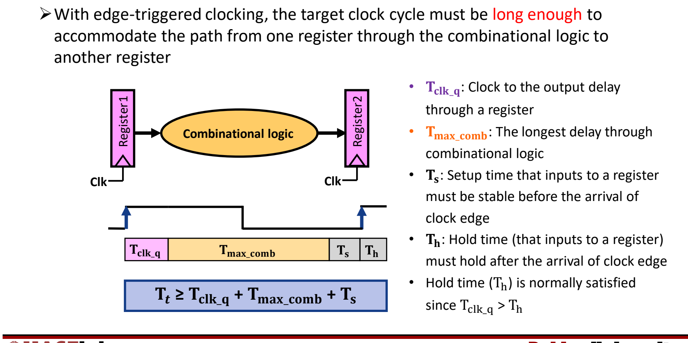

# 03 数据通路部件与时钟

[本讲目录](../index.md) · [课程目录](../../index.md) · [上一节：02 乘除法与浮点数](02-multiplication-division-and-floating-point.md) · [下一节：04 单周期数据通路](04-single-cycle-datapath.md)

> [!abstract] 本节要点
> - 数据通路由部件（运算与存储单元）和互连组成；控制负责从存储器取指令、发出控制信号、管理指令顺序。RTL 用“寄存器 ← 表达式”描述每条指令的含义，所有指令都从地址 PC 处取出。
> - 部件分两类：组合元件（扩展器、ALU、多路选择器）只对数据做运算；存储元件（PC、寄存器堆、指令存储器、数据存储器）保存状态。控制信号包括 ExtOp、ALU control、mux select、Write Enable、MemRead/MemWrite。
> - CPU 时钟由石英晶振产生正弦波，整形成方波；晶振频率低，再由锁相环 PLL 倍频到 GHz 级。
> - 边沿触发下，一个周期内完成“读状态元件 → 经组合逻辑 → 写状态元件”，周期须满足 $T_{\rm cycle}\ge T_{\rm clk\_q}+T_{\rm max\_comb}+T_s$；保持时间 $T_h$ 通常因 $T_{\rm clk\_q}>T_h$ 自然满足。
> - 不是每周期都写的状态元件需要显式写使能，只有“写使能有效且时钟沿到来”时才写入；PC 每周期都写、指令存储器只读，二者都不需要写控制信号。

## 处理器组织与寄存器传输级（RTL）

处理器分为**数据通路**（Datapath）和**控制**（Control）两部分，完整的组织结构见 L02《04 ISA抽象与RISC思想》，这里只回顾本讲要用到的分工：[^s1p23]

- **数据通路**：由**部件**（components，执行指令所需的运算单元和存储单元，如寄存器堆）和**互连**（interconnects，把部件连起来，使指令能够完成，并能从存储器取数、向存储器存数）组成。互连既包括处理器内部的连接，也包括处理器与外部存储器之间的连接。
- **控制**：① 从存储器取入指令（Fetch）；② 译码后发出信号，控制数据在各部件之间的流动以及各部件执行什么操作；③ 管理指令执行的先后顺序。

本讲要实现的 RISC-V 指令分三类：访存（ld/sd）、算术/逻辑（add 等）和控制流（beq）。

要设计硬件，先得精确写出每条指令“做什么”。**寄存器传输级**（Register Transfer Level, RTL）就是描述寄存器之间数据流动的语言，它给每条指令赋予确切含义。所有指令都从地址 PC 处取出，取指后顺序执行时 $PC \leftarrow PC + 4$（每条指令 32 位 = 4 字节）。[^s1p24]

用 RISC-V 的字段名（rs1、rs2、rd，12 位立即数 imm）写出四类典型指令：

| 指令 | RTL 描述 |
| --- | --- |
| 公共取指 | $PC \leftarrow PC + 4$ |
| add | $\text{Reg}[rd] \leftarrow \text{Reg}[rs1] + \text{Reg}[rs2]$ |
| ld（load） | $\text{Reg}[rd] \leftarrow \text{MEM}[\text{Reg}[rs1] + \text{sext}(imm)]$ |
| sd（store） | $\text{MEM}[\text{Reg}[rs1] + \text{sext}(imm)] \leftarrow \text{Reg}[rs2]$ |
| beq | 若 $\text{Reg}[rs1] = \text{Reg}[rs2]$，则 $PC \leftarrow PC + (\text{sext}(imm) \ll 1)$；否则 $PC \leftarrow PC + 4$ |

其中 sext 表示符号扩展，访存地址 = 基址寄存器 + 符号扩展后的偏移量。

> [!warning] 易错点
> 源材料的 RTL 表格和部件图沿用了 MIPS 写法：寄存器字段写成 Rs/Rt/Rd，立即数写成 Imm16（16 位），扩展器标为 Extend 16→64，load 的目的寄存器写成 Rt，分支目标写成 $PC + 4 + 4\times\text{sign\_extend}(Imm16)$。[^s1p24] 这些是 MIPS 的语义。RISC-V 中：源/目的寄存器字段是 rs1、rs2、rd；I/S/B 型立即数是 12 位；分支目标以**当前指令的 PC** 为基准，偏移以 2 字节为单位，即 $PC + (\text{sext}(imm)\ll1)$，不是“PC+4 再加 4 倍偏移”。做题时按 RISC-V 语义计算。

RTL 之外还有更底层的**门级**（gate-level）视角：直接展示每个时钟周期里各个逻辑门怎样翻转、互相传递信号，从而实现处理功能，ARM1 处理器的门级仿真就是这样的例子。[^s1p25] 本讲从 RTL 这一层出发，把处理器拆成部件，再一步步组装成逻辑层面的处理器。

## 组合元件与存储元件

数据通路里的硬件按“是否保存状态”分成两类。[^s1p26]

**组合元件**（combinational element）只对数据做运算：输出完全由当前输入决定，不记忆任何东西。

- **扩展器**（Extend）：把指令中的立即数扩展成 64 位数据（部件图沿用 MIPS 标注 16→64，RISC-V 实际是 12 位立即数扩展到 64 位）。扩展方式见 [[01 ALU与整数加减]]。
- **ALU**：对两个 64 位输入做运算，输出 ALU result，同时给出状态输出 **zero**（结果是否为 0）和 **overflow**（是否溢出）。ALU 支持的运算见 [[01 ALU与整数加减]]。
- **多路选择器**（multiplexor, Mux）：一种简单的多功能逻辑单元，根据选择信号让输入 0 或输入 1 之一通过。当同一个部件的输入可能来自不同来源时，就用 Mux 选择。[^s1p27]

**存储元件**（storage / state element）保存数据，即处理器的状态：

| 存储元件 | 端口与位宽 | 作用 |
| --- | --- | --- |
| PC（程序计数器） | 输入、输出各 32 位（图中标注） | 存放下一条要取的指令地址 |
| 寄存器堆（Register file） | Read Addr1、Read Addr2、Write Addr 各 5 位；Read Data1、Read Data2、Write Data 各 64 位 | 32 个 64 位通用寄存器，可同时读两个、写一个 |
| 指令存储器（Instruction Memory） | Address 输入，Instruction 输出 32 位 | 按地址给出指令 |
| 数据存储器（Data Memory） | Address、Data_in、Data_out（64 位） | load/store 访问的数据 |

寄存器地址是 5 位，因为 $2^5 = 32$ 正好寻址 32 个寄存器；指令长 32 位，数据通路宽 64 位（RV64）。

## 数据通路的控制信号

部件本身只提供“能做什么”，还需要控制信号决定“这一条指令让它做什么”，即选择操作、控制数据流向。[^s1p28] 部件图上的控制信号如下：

| 控制信号 | 作用于 | 含义 |
| --- | --- | --- |
| ExtOp | 扩展器 | 选择扩展方式（如符号扩展还是零扩展） |
| ALU control | ALU | 选择 ALU 做哪种运算（加、减等） |
| select | 多路选择器 | 选择让输入 0 还是输入 1 通过 |
| Write Enable | 寄存器堆 | 是否把 Write Data 写入 Write Addr 指定的寄存器 |
| MemRead / MemWrite | 数据存储器 | 是否读 / 是否写数据存储器 |

此外 ALU 的 zero、overflow 是反向输出给控制逻辑的状态信号（例如 beq 用 zero 判断两数是否相等）。这些信号由控制单元根据指令的 opcode、funct 等字段产生，具体取值和控制表见 [[04 单周期数据通路]]。

## CPU 时钟与边沿触发

各部件必须在硬件层面同步：何时读取、何时写入，需要一个统一的时间基准，这就是**时钟**（clock, Clk）。时钟接到 PC、寄存器堆和数据存储器这些需要同步写入的存储元件上。[^s1p29] 在本讲的模型里，指令存储器不接时钟：给它地址就直接输出指令，行为像组合逻辑。[^s2b6]

### 时钟从哪里来

CPU 时钟是处理器内部的计时器件，用石英晶体给处理器提供持续、稳定的脉冲流。[^s1p30] 产生过程：

1. **石英晶振**（quartz crystal）通电后振荡，输出频率固定的正弦波。
2. **整形**：数字电路按方波工作，所以要把正弦波整形（模拟到数字转换）成方波。
3. **倍频**：晶振本身频率较低（课上给出的量级是一百多 kHz 到 1 MHz），而现代 CPU 约 3 GHz，因此在晶振之后接**锁相环**（Phase-Locked Loop, PLL），按需要把频率调高。[^s2b6] 时钟频率与功耗的长期趋势见 L01《05 技术趋势与功耗墙》。

### 边沿触发计时方法（Edge-Triggered Clocking）

**计时方法**（clocking methodology）规定信号何时可以被读、何时被写。[^s1p31] 时钟信号从低电平跳到高电平的时刻叫**上升沿**，从高跳到低叫**下降沿**，统称**边沿**（edge）。**边沿触发**是指存储元件只在时钟边沿更新内容，大多数电路采用这种方法。

一个时钟周期内的典型执行过程：[^s1p128]

1. **读**：时钟沿到来后，状态元件 1 输出其内容。
2. **算**：这些值流经组合逻辑，被处理。
3. **写**：在下一个时钟沿，把结果写入一个或多个状态元件（状态元件 2）。

几乎所有同步电路都满足这个结构：每个周期都从存储元件出发，经组合逻辑，回到存储元件。这样每个周期的计算结果都能被保存下来，下一个周期可以接着做新的计算。所谓“单周期”，就是一条指令的读—算—写全部在一个时钟周期内完成。

## 单周期时序约束

既然一个周期内要把数据从一个寄存器读出、穿过组合逻辑、再写进另一个寄存器，周期就必须**足够长**，能容纳这条路径上最慢的情况。[^s1p32] 涉及四个时间参数：

- $T_{\rm clk\_q}$：时钟沿到达后，寄存器输出端出现新值的延迟（clock-to-output）。
- $T_{\rm max\_comb}$：信号穿过组合逻辑的**最长**延迟（关键路径）。
- $T_s$：**建立时间**（setup time），时钟沿到来**之前**，寄存器输入必须保持稳定的时间。
- $T_h$：**保持时间**（hold time），时钟沿到来**之后**，寄存器输入还必须继续保持稳定的时间。

时序图上，从第一个上升沿开始依次是 $T_{\rm clk\_q}$、$T_{\rm max\_comb}$、$T_s$，它们必须在下一个上升沿之前全部结束；$T_h$ 跨在下一个上升沿之后。因此时钟周期 $T_{\rm cycle}$（源材料记为 $T_t$）必须满足：[^s1p32]

$$
T_{\rm cycle} \ge T_{\rm clk\_q} + T_{\rm max\_comb} + T_s
$$

保持时间通常自然满足，因为 $T_{\rm clk\_q} > T_h$：时钟沿过后，上游寄存器至少要经过 $T_{\rm clk\_q}$ 才输出新值，这时下游寄存器的保持窗口 $T_h$ 已经过去，旧输入不会被提前改掉。所以设计时钟周期时一般只考虑上式。

> [!tip] 课堂强调
> 时钟周期必须大于等于 $T_{\rm clk\_q}+T_{\rm max\_comb}+T_s$，课上明确说这是大家需要注意的。[^s2b7]

> [!example] 例：由各段延迟求最高时钟频率（数值为示意）
> 设寄存器 $T_{\rm clk\_q}=30\,\text{ps}$，组合逻辑最长路径 $T_{\rm max\_comb}=600\,\text{ps}$，$T_s=20\,\text{ps}$，$T_h=10\,\text{ps}$。
>
> 1. 最短周期：$T_{\rm cycle}\ge 30+600+20=650\,\text{ps}$。
> 2. 最高频率：$f_{\max}=1/650\,\text{ps}\approx1.54\,\text{GHz}$。
> 3. $T_h=10\,\text{ps}<T_{\rm clk\_q}=30\,\text{ps}$，保持时间自然满足，不进入公式。

> [!warning] 易错点
> - 公式里用的是组合逻辑的**最长**延迟，不是平均延迟。单周期处理器中所有指令共用一个周期，周期由最慢的指令路径决定（这正是单周期“CPI=1 但周期长”的原因，见 [[04 单周期数据通路]]）。
> - $T_h$ 不加进周期公式。$T_s$ 约束的是时钟沿**之前**，$T_h$ 约束的是时钟沿**之后**，二者不要混淆。

## 写控制信号

上面的计时方法默认状态元件**每个时钟周期都写入**。如果某个状态元件不是每周期都写，就必须给它一个显式的**写控制信号**（write control signal，写使能）。[^s1p33] 规则是 **只有写控制信号有效、并且时钟沿到来时，才发生写入**；二者缺一不可。[^s1p128]

按这个规则检查各存储元件：[^s2b7]

| 存储元件 | 读写情况 | 是否需要写控制信号 |
| --- | --- | --- |
| PC | 每个周期都读、都写（写入下一条指令地址） | 不需要 |
| 指令存储器 | 每个周期都读，执行过程中不写 | 不需要 |
| 寄存器堆 | 每周期读；只有部分指令写回（如 add、ld 写，sd、beq 不写） | 需要 Write Enable |
| 数据存储器 | 只有 load 读、只有 store 写 | 需要 MemRead / MemWrite |

> [!warning] 易错点
> 写使能有效但时钟沿没到，不会写入；时钟沿到了但写使能无效，也不会写入。sd 和 beq 执行时如果寄存器堆的 Write Enable 误置为有效，就会在时钟沿把无意义的数据写进 Write Addr 指定的寄存器，破坏程序状态。

> [!question]- 自测：某单周期设计中 $T_{\rm clk\_q}=50\,\text{ps}$，各指令经过组合逻辑的延迟分别为 R 型 400 ps、load 700 ps、store 600 ps、beq 450 ps，$T_s=30\,\text{ps}$。最短时钟周期是多少？
> 780 ps。所有指令共用同一个周期，$T_{\rm max\_comb}$ 取最慢的 load 路径 700 ps，所以 $T_{\rm cycle}\ge50+700+30=780\,\text{ps}$，即使 R 型指令只需要 480 ps。

> [!question]- 自测：RISC-V 指令 `beq x5, x6, L` 位于 PC = 0x1000，B 型 12 位立即数字段值为 0x008，且 x5 = x6。新 PC 是多少？如果误用源材料中的 MIPS 公式会得到多少？
> RISC-V：偏移 = sext(0x008) ≪ 1 = 16，新 PC = 0x1000 + 0x10 = 0x1010。MIPS 公式 $PC+4+4\times8$ 会得到 0x1024，基准和偏移单位都不对。

> [!question]- 自测：执行 `sd` 的那个周期里，寄存器堆的 Write Enable 因毛刺在周期中间短暂变为 1，并在下一个时钟上升沿到来前回到 0。寄存器会被改写吗？如果毛刺恰好跨过时钟沿呢？
> 前一种情况不会改写：写入要求“写使能有效**且**时钟沿到来”同时成立，周期中间的高电平没有遇到时钟沿。若写使能在时钟沿时为 1，就会把无意义的 Write Data 写进 Write Addr（对 `sd` 而言是其 imm[4:0] 字段对应的寄存器），破坏状态，所以 `sd` 的 Write Enable 必须在整个周期稳定为 0。

> [!info]- 来源
> - L03.pdf：PDF p.23–33, 128
> - L03.docx：DOCX body 212–295

[^s1p23]: L03.pdf-PDF p.23
[^s1p24]: L03.pdf-PDF p.24
[^s1p25]: L03.pdf-PDF p.25
[^s1p26]: L03.pdf-PDF p.26
[^s1p27]: L03.pdf-PDF p.27
[^s1p28]: L03.pdf-PDF p.28
[^s1p29]: L03.pdf-PDF p.29
[^s2b6]: L03.docx-DOCX body 212-254
[^s1p30]: L03.pdf-PDF p.30
[^s1p31]: L03.pdf-PDF p.31
[^s1p128]: L03.pdf-PDF p.128
[^s1p32]: L03.pdf-PDF p.32
[^s2b7]: L03.docx-DOCX body 255-295
[^s1p33]: L03.pdf-PDF p.33

[本讲目录](../index.md) · [课程目录](../../index.md) · [上一节：02 乘除法与浮点数](02-multiplication-division-and-floating-point.md) · [下一节：04 单周期数据通路](04-single-cycle-datapath.md)
