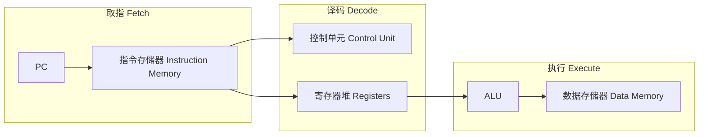
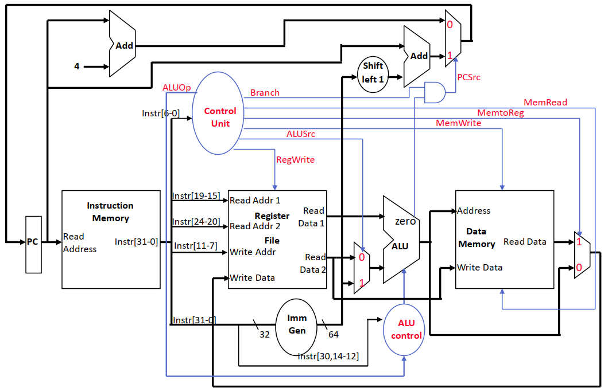
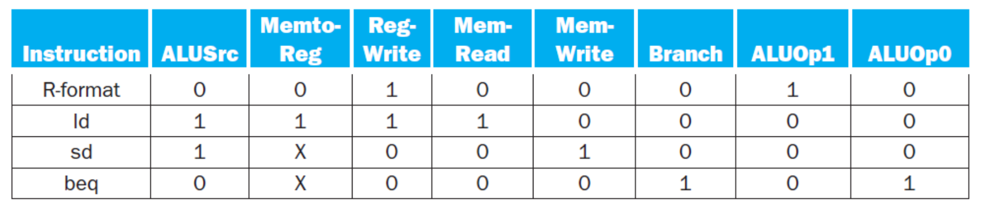

# 04 单周期数据通路

[本讲目录](../index.md) · [课程目录](../../index.md) · [上一节：03 数据通路部件与时钟](03-datapath-elements-and-clocking.md) · [下一节：05 多周期数据通路](05-multicycle-datapath.md)

> [!abstract] 本节要点
> - 单周期处理器在**一个时钟周期**内完成一条指令的取指、译码、执行，CPI 恒为 1；时钟周期必须覆盖最长路径（通常是 `ld`）。
> - 取指：PC 读指令存储器，同时用专用加法器算 PC+4；译码：opcode（bits 6-0）送控制单元，按 rs1（19-15）、rs2（24-20）读寄存器堆，rd（11-7）给出写地址。
> - `ld/sd` 地址 = 基址寄存器 + 符号扩展的 12 位偏移；`beq` 用 ALU 的 zero 判等，目标 = PC + (sext(imm) << 1)，PCSrc = Branch AND zero。
> - 每个部件一周期只能用一次，所以要复制部件（分开的 IM/DM、三个加法器），在共享输入处加多路选择器 ALUSrc、MemtoReg、PCSrc。
> - 控制表（ALUSrc/MemtoReg/RegWrite/MemRead/MemWrite/Branch/ALUOp）：R 型 0/0/1/0/0/0/10，ld 1/1/1/1/0/0/00，sd 1/X/0/0/1/0/00，beq 0/X/0/0/0/1/01。

## 单周期设计的思路

要让处理器真正执行指令，需要把上一节的组合元件、状态元件和控制信号（见 [03 数据通路部件与时钟](03-datapath-elements-and-clocking.md)）连成一条完整的数据通路。最简单的连法是让每条指令在一个时钟周期内走完全部步骤。

**单周期数据通路**（single-cycle datapath）是指每条指令的取指（Fetch）、译码（Decode）、执行（Execute）都在同一个时钟周期内完成的设计。[^s1p40] 本节实现的是一个简化的 RISC-V 子集：[^s1p127]

- 访存指令：`ld`、`sd`
- 算术逻辑指令：`add`、`sub`、`and`、`or`
- 控制流指令：`beq`

通用的执行流程是：用 PC 提供指令地址，从存储器取指并更新 PC；译码并读寄存器；执行。所有指令在读完寄存器后都会用到 ALU，只是用途不同：算术指令用它做运算，访存指令用它算地址，分支指令用它做比较。

三个阶段对应的部件如下：[^s1p34]

## 取指与译码

### 取指（Fetch）

取指要做两件事：[^s1p35]

1. **读指令**：把 PC 作为地址送入指令存储器（Instruction Memory），读出 32 位指令 `Instr[31-0]`。
2. **更新 PC**：用一个专用加法器计算 PC+4，作为顺序执行时下一条指令的地址。

这两个部件都不需要显式控制信号：

- PC 每个周期都被更新，所以**不需要写控制信号**；
- 指令存储器每个周期都被读，所以**不需要读控制信号**。

### 译码（Decode）

译码同样分两部分：[^s1p36]

1. 把指令中的 opcode 和 funct 字段送入**控制单元**（Control Unit），由它产生后续各部件的控制信号。
2. 从**寄存器堆**（Register File）读出两个源操作数；寄存器地址直接取自指令字段。

RISC-V 的编码让字段位置在各格式间尽量固定，这使控制单元和寄存器堆可以直接从固定位上取值，不必先判断指令类型：[^s1p42]

- opcode 总在 bits 6-0；
- 要读的寄存器总由 rs1（bits 19-15）和 rs2（bits 24-20）给出；
- 要写的寄存器总在 rd（bits 11-7）；
- 另一个操作数也可能是 12 位偏移量，用于分支或 load/store。

| 格式 | 31–25 | 24–20 | 19–15 | 14–12 | 11–7 | 6–0 |
|---|---|---|---|---|---|---|
| R | funct7 | rs2 | rs1 | funct3 | rd | opcode |
| I | imm[11:5] | imm[4:0] | rs1 | funct3 | rd | opcode |
| S | imm[11:5] | rs2 | rs1 | funct3 | imm[4:0] | opcode |
| SB | imm[12,10:5] | rs2 | rs1 | funct3 | imm[4:1,11] | opcode |

S 和 SB 格式没有 rd，于是把立即数拆开放在 rd 原来的位置（bits 11-7），这样 rs1、rs2 的位置保持不变。

> [!tip] 课堂强调
> 指令本身做了“对齐”：opcode 固定在 0–6 位，源寄存器固定在 rs1/rs2 位置，目标寄存器固定在 11–7 位，目的就是方便控制。

## 三类指令的数据通路

在取指和译码之后，不同指令在执行阶段需要的部件不同。下面逐类搭建。

### R 型指令

R 型指令（`add`、`sub`、`and`、`or`）对 rs1、rs2 中的值执行由 op 和 funct 决定的运算，结果写回寄存器堆的 rd。[^s1p37]

1. 寄存器堆的 Read Data 1、Read Data 2 送入 ALU 两个输入端。
2. **ALU 控制**（ALU control）决定做哪种运算；ALU 还输出 zero 和 overflow 标志。
3. ALU 结果送回寄存器堆的 Write Data，写地址为 rd。

寄存器堆并非每个周期都被写（例如 `sd` 就不写），因此需要显式写控制信号 **RegWrite**。[^s1p37]

### Load 与 Store

访存指令的三个动作：[^s1p38]

1. **算地址**：基址寄存器（译码时从寄存器堆读出）+ 指令中**符号扩展**的 12 位偏移。
2. **store**：把译码时读出的另一个寄存器值（rs2）写入数据存储器（Data Memory）。
3. **load**：从数据存储器读出数据，写回寄存器堆（rd）。

为此新增两个部件：

- **立即数生成器**（Imm Gen）：从 32 位指令中取出立即数字段，**符号扩展**成 64 位（图中标为 32 → 64，signed）。
- **数据存储器**：输入 Address、Write Data，输出 Read Data；由 **MemRead**、**MemWrite** 两个信号控制读写。

例如 `ld x5, 40(x6)`，若 `x6 = 0x2000`，则 ALU 计算 `0x2000 + 40 = 0x2028`，从该地址读出 8 字节写入 `x5`。

### 分支 beq

分支指令要完成两件事：[^s1p39]

1. **判等**：把译码时读出的两个寄存器值送入 ALU 相减，用 ALU 的 **zero** 输出判断是否相等——相等时 zero = 1。
2. **算目标地址**：Imm Gen 把 12 位偏移符号扩展到 64 位，经 **Shift left 1** 左移一位，再由**一个独立的加法器**与 PC 相加：

$$
\mathrm{PC}_{\mathrm{target}} = \mathrm{PC} + \big(\operatorname{sext}(\mathrm{imm}) \ll 1\big)
$$

左移 1 位是因为 SB 格式不存储 imm[0]（偏移总是 2 的倍数），存储的 12 位实际是 imm[12:1]。

最后由分支控制逻辑在两个候选中选新 PC：

$$
\mathrm{PCSrc} = \mathrm{Branch} \land \mathrm{zero}
$$

PCSrc = 0 选 PC+4，PCSrc = 1 选分支目标。[^s1p43]

> [!warning] 易错点
> - RISC-V 的分支目标基于**当前指令的 PC**，不是 PC+4。源材料文字说“updated PC 加偏移”，措辞不准确；带控制单元的数据通路图中，分支加法器的输入正是当前 PC。[^s1p39]
> - 偏移只左移 **1** 位（半字对齐），不是 MIPS 的左移 2 位；立即数扩展是 **32 → 64** 位。部分示意图残留的 “Sign Extend 16→32” 是 MIPS 版本的遗留，应按 RISC-V 理解为 Imm Gen 32→64。[^s1p51]

> [!example] 例：计算 beq 的下一 PC
> `beq x1, x2, L` 位于 PC = `0x1000`，指令中存储的 imm[12:1] = $000000001000_2=8$。
>
> 1. sext 后仍为 8，左移 1 位得 16 = `0x10`。
> 2. 分支目标 = `0x1000 + 0x10 = 0x1010`；PC+4 = `0x1004`。
> 3. 若 `x1 = x2`：ALU 相减得 0，zero = 1，Branch = 1，PCSrc = 1，下一 PC = `0x1010`。
> 4. 若 `x1 ≠ x2`：zero = 0，PCSrc = 0，下一 PC = `0x1004`。

## 组装完整数据通路与多路选择器

把上述片段合成一条数据通路时，要加入控制线和多路选择器。[^s1p40] 单周期设计带来三条约束：

1. **每个资源每条指令只能用一次**，因此必须复制一些部件：指令存储器与数据存储器分开；用三个加法器（ALU、PC+4 加法器、分支目标加法器）而不是共用一个。
2. **共享部件的输入端需要多路选择器**（multiplexor），由控制线选择数据来源。
3. **写信号**控制是否写寄存器堆和数据存储器。

时钟周期由**最长路径**决定。[^s1p40]

R 型与访存指令共用 ALU 和寄存器堆写端口，但数据来源不同，于是加入两个选择器；[^s1p41] 再加上分支的 PC 选择器，共三个：

| 选择器 | 位置 | 输入 0 | 输入 1 |
|---|---|---|---|
| **ALUSrc** | ALU 第二个输入 | 寄存器 Read Data 2（R 型、beq） | Imm Gen 输出的 64 位立即数（ld、sd） |
| **MemtoReg** | 寄存器堆 Write Data | ALU 结果（R 型） | 数据存储器 Read Data（ld） |
| **PCSrc** | PC 输入 | PC+4 | 分支目标地址 |

完整的单周期数据通路如下：控制单元读入 `Instr[6-0]`，输出 Branch、MemRead、MemtoReg、MemWrite、ALUSrc、RegWrite 和 2 位 ALUOp；ALU 控制单元根据 ALUOp 和 `Instr[30,14-12]`（funct7 的第 30 位与 funct3）产生具体的 ALU 操作；Branch 与 zero 经与门得到 PCSrc。[^s1p43]

图：带控制单元的单周期数据通路：控制单元由 `Instr[6-0]` 产生 RegWrite、ALUSrc、MemRead/MemWrite、MemtoReg、Branch，Branch 与 zero 相与得到 PCSrc。

> [!tip] 课堂强调
> 这张数据通路图、后面的控制表以及多周期的带控制数据通路图都**不要求死记或默画**，看懂其中的逻辑即可；实际处理器的控制要复杂得多，这里只是最简单的一套控制逻辑。[^s2b8]

> [!info] 可视化资源
> [Ripes：可视化 RISC-V 处理器模拟器](https://github.com/mortbopet/Ripes)——可在单周期、五级流水线等微架构上运行 RISC-V 程序，逐周期观察数据通路中各条线的取值和控制信号。

## 控制单元与控制表

控制信号负责两件事：选择要执行的操作（ALU 运算、寄存器堆与存储器的读写），以及控制数据流向（多路选择器的输入）。[^s1p42] 控制单元只看 opcode 就能确定这些信号，下表给出四类指令的取值：[^s1p49]

| 指令 | ALUSrc | MemtoReg | RegWrite | MemRead | MemWrite | Branch | ALUOp1 | ALUOp0 |
|---|---|---|---|---|---|---|---|---|
| R-format | 0 | 0 | 1 | 0 | 0 | 0 | 1 | 0 |
| ld | 1 | 1 | 1 | 1 | 0 | 0 | 0 | 0 |
| sd | 1 | X | 0 | 0 | 1 | 0 | 0 | 0 |
| beq | 0 | X | 0 | 0 | 0 | 1 | 0 | 1 |

图：R-format、ld、sd、beq 四类指令的单周期控制信号取值表。

X 表示“无关”（don't care）：`sd` 和 `beq` 不写寄存器堆（RegWrite = 0），所以 MemtoReg 选哪一路都不影响结果。

每一行都可以从数据流推出来：

1. **R 型**：[^s1p44] PC 选 PC+4；结果要写回 rd，RegWrite = 1；第二操作数来自寄存器，ALUSrc = 0；不访问数据存储器，MemRead = MemWrite = 0；写回数据取 ALU 结果，MemtoReg = 0；ALU 运算由 funct 字段决定，ALUOp = 10。
2. **ld**：[^s1p45] PC 选 PC+4；ALU 一端是基址寄存器、另一端是扩展到 64 位的立即数，ALUSrc = 1；读数据存储器，MemRead = 1；读出的数据经 MemtoReg = 1 写回寄存器堆，RegWrite = 1；ALU 做加法，ALUOp = 00。
3. **sd**：ALU 同样算“基址 + 立即数”，ALUSrc = 1，ALUOp = 00；MemWrite = 1 把 rs2 写入存储器；不写寄存器，RegWrite = 0，MemtoReg = X。
4. **beq**：[^s1p47] 两个寄存器值比较，ALUSrc = 0；ALU 做减法，ALUOp = 01；Branch = 1，与 zero 相与决定 PCSrc；不访存、不写寄存器。

> [!note] 补充解释
> ALUOp 是主控制单元交给 ALU 控制单元的 2 位“粗分类”：00 表示做加法（访存算地址），01 表示做减法（beq 比较），10 表示由指令的 funct7/funct3 字段（`Instr[30,14-12]`）决定具体运算（R 型）。这种两级译码让主控制单元不必关心 funct 字段。ALU 控制编码的完整表格见 Patterson & Hennessy《Computer Organization and Design RISC-V Edition》第 4.4 节。

一条 `ld` 指令的完整路径经过了所有主要部件，它就是单周期设计中最长的路径：

## 单周期设计的优缺点

**优点**：

- **$\mathrm{CPI}=1$**：每条指令恰好一个周期，并且永远是 1。[^s2b8]
- **简单、易于理解**。[^s1p129]

$\mathrm{CPI}=1$ 并不是性能上限：后续课程讲到的架构（如每周期完成多条指令的超标量处理器）CPI 一般都**小于 1**。单周期的特点只是 CPI 恒定，代价全部落在时钟周期上。[^s2b8]

**缺点**：

1. **时钟周期利用率低**。[^s1p50] 时钟周期必须按最慢的指令来定。`ld` 要依次经过取指、读寄存器堆、ALU、数据存储器、写回，是最长的路径；`sd` 不需要写回，比 `ld` 短，但也只能占用同样长的周期，剩余时间被浪费：时序图上 Load 占满一个周期，Store 之后跟着一段 Waste。对浮点乘法这类更复杂的指令，这个问题更严重：只要指令集中有一条慢指令，所有指令都要跟着变慢。
2. **浪费面积**。[^s1p51] 由于一个周期内部件不能共享，一些功能单元必须复制：除了 ALU 外还要有专门更新 PC 的加法器；指令存储器和数据存储器也必须分开，而在更好的设计中二者本可以合并。

时钟周期下限的具体约束式（$T_{\rm clk\_q}$、$T_{\rm max\_comb}$、$T_s$）见 [03 数据通路部件与时钟](03-datapath-elements-and-clocking.md)。为解决这两个问题，下一节把一条指令拆成多个较短的周期并复用部件，见 [05 多周期数据通路](05-multicycle-datapath.md)。

> [!question]- 自测：执行 `or x7, x8, x9` 时，若控制单元错误地给出 ALUSrc = 1，会发生什么？
> ALU 第二个输入会选 Imm Gen 的输出而不是 `x9`。R 型指令没有立即数字段，Imm Gen 会把 bits 31-20（即 funct7 和 rs2 字段）当成立即数扩展，结果变成 `x8 OR 某个无意义常数`，写入 `x7` 的值错误。

> [!question]- 自测：为什么 sd 和 beq 的 MemtoReg 可以写 X，而 RegWrite 不能写 X？
> MemtoReg 只决定写回寄存器堆的数据来源；这两条指令 RegWrite = 0，不写寄存器堆，选哪一路都无影响。RegWrite 本身决定寄存器堆是否被改写，若为 X 可能把垃圾写进 rd 位置（对 sd/beq 而言是立即数字段对应的寄存器），破坏架构状态，所以必须明确为 0。

> [!question]- 自测：假设某单周期处理器中各部件延迟为：指令存储器 200 ps、寄存器堆读 100 ps、ALU 150 ps、数据存储器 200 ps、寄存器写回 50 ps（多路选择器等忽略）。时钟周期至少多长？执行 sd 时浪费多少？
> 最长路径是 `ld`：200 + 100 + 150 + 200 + 50 = 700 ps，所以周期至少 700 ps。`sd` 不写回：200 + 100 + 150 + 200 = 650 ps，每条 sd 浪费 50 ps；R 型（200 + 100 + 150 + 50 = 500 ps）浪费 200 ps。这正是“周期由最慢指令决定”的代价。（数值为假设，用于练习。）

> [!info]- 来源
> - L03.pdf：PDF p.34–45, 47, 49–51, 127, 129
> - L03.docx：DOCX body 255–335

[^s1p40]: L03.pdf-PDF p.40
[^s1p127]: L03.pdf-PDF p.127
[^s1p34]: L03.pdf-PDF p.34
[^s1p35]: L03.pdf-PDF p.35
[^s1p36]: L03.pdf-PDF p.36
[^s1p42]: L03.pdf-PDF p.42
[^s1p37]: L03.pdf-PDF p.37
[^s1p38]: L03.pdf-PDF p.38
[^s1p39]: L03.pdf-PDF p.39
[^s1p43]: L03.pdf-PDF p.43
[^s1p51]: L03.pdf-PDF p.51
[^s1p41]: L03.pdf-PDF p.41
[^s2b8]: L03.docx-DOCX body 296-335
[^s1p49]: L03.pdf-PDF p.49
[^s1p44]: L03.pdf-PDF p.44
[^s1p45]: L03.pdf-PDF p.45
[^s1p47]: L03.pdf-PDF p.47
[^s1p129]: L03.pdf-PDF p.129
[^s1p50]: L03.pdf-PDF p.50

[本讲目录](../index.md) · [课程目录](../../index.md) · [上一节：03 数据通路部件与时钟](03-datapath-elements-and-clocking.md) · [下一节：05 多周期数据通路](05-multicycle-datapath.md)
