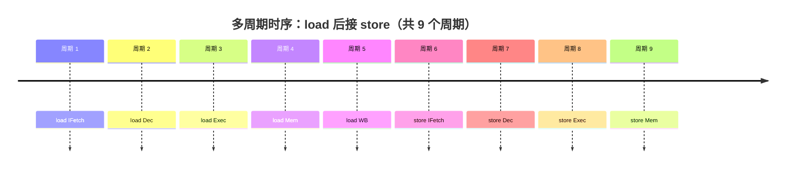
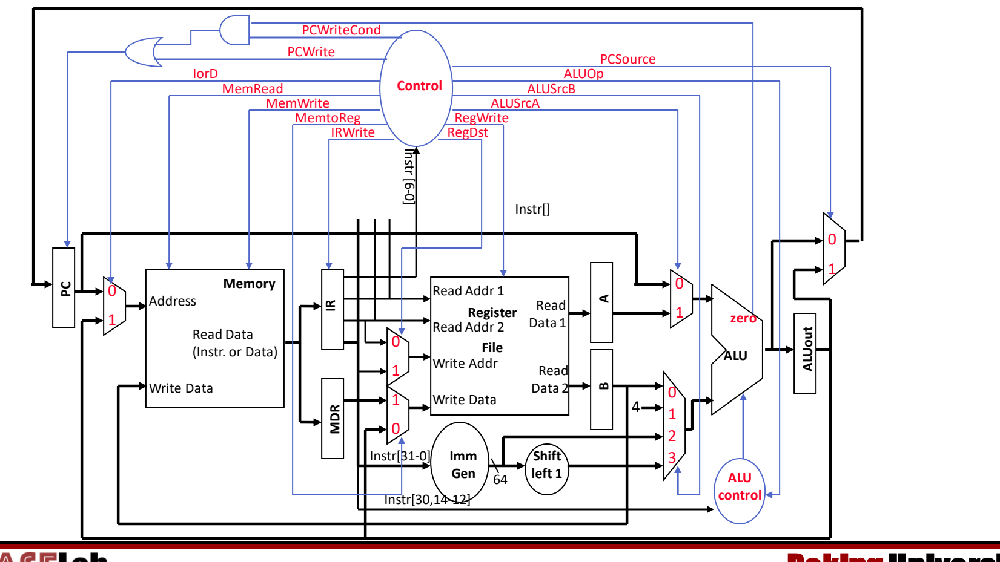
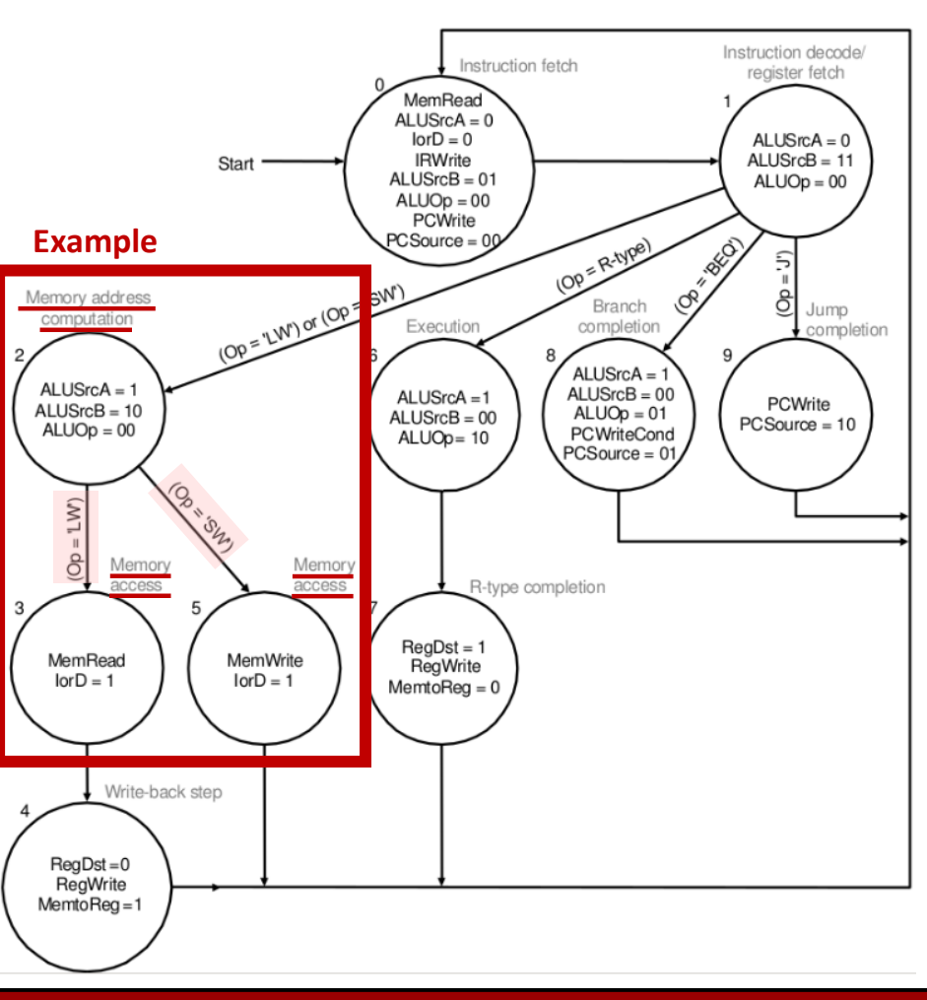
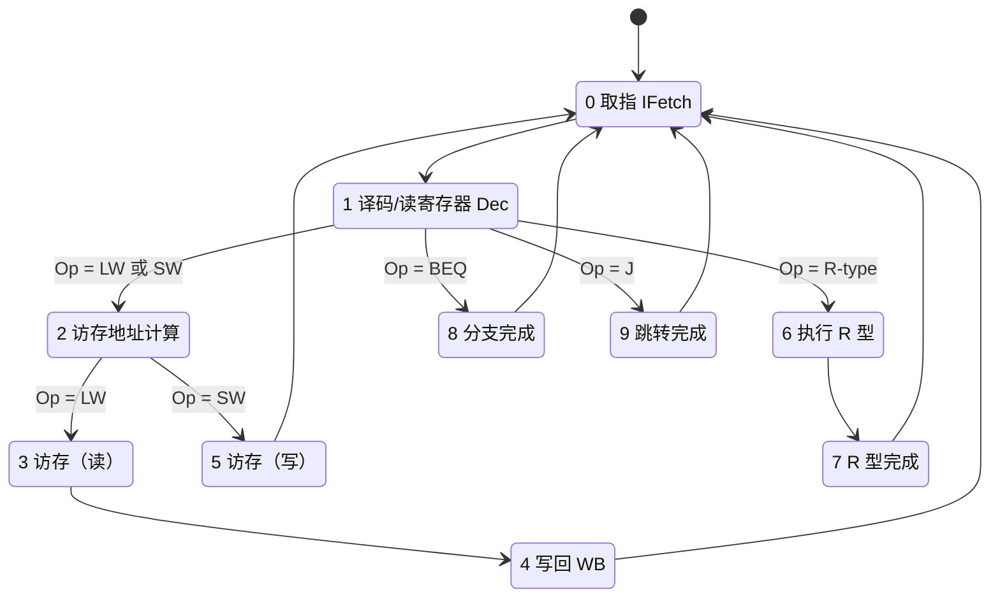

# 05 多周期数据通路

[本讲目录](../index.md) · [课程目录](../../index.md) · [上一节：04 单周期数据通路](04-single-cycle-datapath.md) · [下一节：06 流水线设计与性能](06-pipeline-design-and-performance.md)

> [!abstract] 本节要点
> - 单周期 CPI=1，但时钟周期必须容纳最慢的指令（load），较短的指令（如 store）在周期剩余时间里白白等待；多周期把指令拆成若干步，每步一个周期，不同指令用不同的周期数。
> - 多周期的时钟周期按“最慢的一步”定，但由于每步之间新增状态寄存器带来的开销，它比单周期时钟的 1/5 还要慢；收益来自短指令少用周期，而不是单条 load 变快。
> - 五步为 IFetch → Dec → Exec → Mem → WB：load 5 个周期，store 4 个，R 型 4 个，分支/跳转 3 个；每步工作量尽量均衡，每个周期只用一个主要功能部件。
> - 每步结果在周期末写入程序员不可见的内部寄存器 IR、MDR、A、B、ALUOut（除 IR 外都只在相邻两个周期间保存数据，无需写控制）；因此只需一个存储器、一个 ALU（ALU 兼做 PC+4）。
> - 控制由有限状态机（FSM）完成：状态寄存器 + 次态函数 + 输出函数，输入是当前状态和 opcode；代价是更多内部寄存器、更多多路选择器和更复杂的控制。

## 多周期的动机：单周期浪费了什么

单周期处理器（见 [[04 单周期数据通路]]）在一个周期内完成取指、译码、执行，所以大多数指令 **CPI = 1**；但这个周期必须足够长，能完成最耗时的那条指令。[^s1p54]

最长的是 load，所有指令都得陪它用这个长周期，store 等短指令提前做完后只能空等，剩下的时间就是**浪费**（waste）；具体分析见 [[04 单周期数据通路]] 的“单周期设计的优缺点”。[^s2b8]

**多周期数据通路**（multicycle datapath）的办法是：把每条指令拆成若干个更短的步骤，每步占一个时钟周期，于是不同指令可以花不同数量的周期完成，短指令不再陪着长指令等待。[^s1p55]

> [!warning] 易错点：多周期时钟不是单周期的 1/5
> 把 load 拆成 5 步，并不意味着时钟周期变成单周期的 1/5。回顾时序约束（见 [[03 数据通路部件与时钟]]）：每个周期都必须“从一个状态元件出发、经过组合逻辑、写入另一个状态元件”。拆成 5 个周期就要在中间插入新的状态元件，而每个状态元件都带来 $T_{\rm clk\_q}$ 和 $T_s$ 等额外时间。因此**多周期时钟比单周期时钟的 1/5 还慢**（状态寄存器开销），一条 load 在多周期上的总时间反而比单周期更长。[^s1p136] 多周期的收益来自另一边：store 只需 4 个周期、分支只需 3 个，省下的周期才是收益。[^s2b9]

## 三条设计原则

从单周期改成多周期，要回答三个问题：[^s1p56]

1. **Q1 怎样让一条指令用多于 1 个周期完成？** 把指令拆成小步骤，每步一个周期，依次执行。
2. **Q2 怎样更高效地使用数据通路部件、去掉不必要的重复资源？** 允许同一个功能部件在一条指令内被使用多次，只要这几次落在**不同的周期**。
3. **Q3 单周期的控制信号可以只由 opcode 决定，多周期怎么办？** 用**有限状态机**（finite state machine, FSM）做控制：控制信号既取决于 opcode，也取决于当前处在第几步。

拆分步骤时还有两条约束：[^s1p130]

- **平衡**每一步的工作量（时钟周期由最慢的一步决定，步骤越不均衡浪费越多）；
- **限制**每个周期只启用一个主要功能部件（存储器、寄存器堆或 ALU 之一），这样部件才能跨周期复用。

## 五个执行步骤与各类指令的周期数

**五步**（five steps）分别是：[^s1p57]

1. **IFetch**：取指令，并更新 PC（PC+4）。
2. **Dec**：指令译码、读寄存器、对偏移量/立即数做符号扩展。
3. **Exec**：执行 R 型运算；或计算访存地址；或做分支比较。分支和跳转**在这一步完成**。
4. **Mem**：load 读存储器；store 写存储器并**完成**；R 型把结果写回寄存器堆并**完成**。
5. **WB**：load 把从存储器读出的数据写回寄存器堆，load 在这一步完成。

各类指令在第几步结束，就决定了它的周期数：

| 指令类型 | 经过的步骤 | 周期数 | 在哪一步完成 |
|---|---|---|---|
| load（`ld`/`lw`） | IFetch, Dec, Exec, Mem, WB | 5 | WB（寄存器写回） |
| store（`sd`/`sw`） | IFetch, Dec, Exec, Mem | 4 | Mem（存储器写） |
| R 型（如 `add`） | IFetch, Dec, Exec, Mem | 4 | Mem 步内的寄存器写回 |
| 分支 / 跳转 | IFetch, Dec, Exec | 3 | Exec |

所以在这种多周期设计中，**指令需要 3–5 个周期**：load 最长，分支和跳转最短。[^s1p134]

单周期执行同样两条指令要 2 个长周期；多周期则是 5 + 4 = 9 个短周期，下一条指令紧接在上一条指令真正结束之后开始，没有“空等”。[^s1p64]

> [!example] 例：平均 CPI 与执行时间比较（数据为假设，仅用于练习方法）
> 设单周期时钟周期为 800 ps；多周期把它拆成 5 步，每步约 160 ps，再加上状态寄存器开销 20 ps，得多周期周期为 180 ps（> 800/5，符合“比 1/5 还慢”）。指令比例：load 25%、store 10%、R 型 50%、分支 15%。
>
> 1. 多周期平均 CPI：$0.25\times5 + 0.10\times4 + 0.50\times4 + 0.15\times3 = 1.25+0.4+2.0+0.45 = 4.1$。
> 2. 多周期每条指令平均时间：$4.1\times180 = 738$ ps；单周期为 $1\times800 = 800$ ps。
> 3. 单条 load：多周期 $5\times180 = 900$ ps，比单周期的 800 ps 更慢；多周期总体上更快，是靠 store、R 型和分支少用周期。
>
> 结论：比较两种实现要用“CPI × 时钟周期”，不能只看 CPI（多周期 CPI 更大）或只看周期（多周期周期更短）。

## 内部寄存器与部件复用

一条指令被拆成多个周期后，后一步要用前一步的结果；而组合逻辑在周期末不会“记住”任何东西。因此，按时钟方法学（读状态元件 → 经过组合逻辑 → 写状态元件），**在每个周期末，把下一周期要用的值存进一个内部寄存器**。[^s1p58]

**内部寄存器**（internal registers）是程序员不可见的寄存器，共五个：[^s1p59]

- **IR**（Instruction Register，指令寄存器）：保存从存储器读出的指令；
- **MDR**（Memory Data Register，存储器数据寄存器）：保存从存储器读出的数据；
- **A、B**：保存寄存器堆两个读端口读出的数据；
- **ALUOut**（ALU 输出寄存器）：保存 ALU 的运算结果。

除 IR 外，这些寄存器**只在相邻两个周期之间保存数据**，每个周期都可以被覆盖，所以不需要写控制信号；IR 要在整条指令的执行过程中保持指令内容，因此带有写使能 IRWrite。需要留给**后续指令**使用的数据，则存放在程序员可见的状态中：寄存器堆、PC 或存储器。[^s1p131]

有了内部寄存器，功能部件就能在不同周期复用：[^s1p59]

- **只需一个存储器**：取指和访存发生在不同周期，同一个存储器既存指令又存数据，但每个周期只能访问一次；
- **只需一个 ALU**：单周期里专门做 PC+4 的加法器被去掉，PC 更新改由 ALU 在 IFetch 周期完成，但每个周期只能做一次 ALU 运算。[^s2b10]

以 load 为例，数据在各周期之间的流动是：PC → 存储器（读指令）→ IR → 寄存器堆读 → A（及立即数）→ ALU → ALUOut（地址）→ 存储器（读数据）→ MDR → 寄存器堆写。每一个箭头跨过的周期边界上，都有一个内部寄存器把值接住。[^s1p60]

### 带控制信号的多周期数据通路

把内部寄存器、多路选择器和控制信号加到一起，就得到完整的多周期数据通路（RISC-V 版本，立即数生成 Imm Gen 输出 64 位，分支偏移左移 1 位）：[^s1p132]

图中主要的多路选择器和控制信号：

- **IorD**：存储器地址来自 PC（0，取指）还是 ALUOut（1，访存）——单一存储器的代价；
- **MemRead / MemWrite**：存储器读、写使能；**IRWrite**：把读出的内容写入 IR；
- **MemtoReg**：写回寄存器堆的数据来自 MDR（1，load）还是 ALUOut（0，R 型）；**RegWrite**：寄存器堆写使能；
- **ALUSrcA**：ALU 第一个操作数为 PC（0）或 A（1）；
- **ALUSrcB**：ALU 第二个操作数为 B（0）、常数 4（1）、立即数（2）或左移 1 位的立即数（3）；
- **ALUOp**：送给 ALU control，与指令的 `Instr[30,14-12]`（funct7 的第 30 位和 funct3）共同决定 ALU 操作；
- **PCSource**：新 PC 取 ALU 的直接输出（0，IFetch 的 PC+4）还是 ALUOut（1，分支目标）；
- **PCWrite / PCWriteCond**：PC 无条件写，或在 `zero` 为 1 时条件写（与门 + 或门合成 PC 的写使能）。

与单周期的数据通路图一样，这张图重在看懂各部件和信号的逻辑，而不是默画。[^s2b10]

## 有限状态机控制

单周期中，opcode 足以决定所有控制信号。多周期中，opcode 只告诉你 ALU 该做什么运算，却**不能告诉你下一个周期该做哪一步**——同一条 load 在第 1 周期要读指令、第 4 周期要读数据，控制信号完全不同。[^s1p61]

**有限状态机控制**（FSM control）由三部分组成：[^s1p133]

1. **状态集合**：当前状态保存在**状态寄存器**（State Register）中，每个状态对应一步；
2. **次态函数**（next state function）：由当前状态和输入（opcode）决定下一个状态；
3. **输出函数**（output function）：由当前状态和输入决定这一周期要驱动的数据通路控制信号。

### 示例 FSM

下面是一个示例 FSM（状态从 0 编号）：[^s1p62]

各状态的输出（未列出的写使能为 0）：

| 状态 | 含义 | 控制信号 |
|---|---|---|
| 0 | 取指 | MemRead, ALUSrcA=0, IorD=0, IRWrite, ALUSrcB=01, ALUOp=00, PCWrite, PCSource=00 |
| 1 | 译码 / 读寄存器 | ALUSrcA=0, ALUSrcB=11, ALUOp=00 |
| 2 | 访存地址计算 | ALUSrcA=1, ALUSrcB=10, ALUOp=00 |
| 3 | 访存（load） | MemRead, IorD=1 |
| 4 | 写回（load） | RegDst=0, RegWrite, MemtoReg=1 |
| 5 | 访存（store） | MemWrite, IorD=1 |
| 6 | R 型执行 | ALUSrcA=1, ALUSrcB=00, ALUOp=10 |
| 7 | R 型完成 | RegDst=1, RegWrite, MemtoReg=0 |
| 8 | 分支完成 | ALUSrcA=1, ALUSrcB=00, ALUOp=01, PCWriteCond, PCSource=01 |
| 9 | 跳转完成 | PCWrite, PCSource=10 |

逐状态读出机制：

1. **状态 0**：以 PC 为地址（IorD=0）读存储器，结果写入 IR（IRWrite）；同时 ALU 计算 PC+4（ALUSrcA=0 选 PC，ALUSrcB=01 选常数 4，ALUOp=00 做加法），直接写回 PC（PCWrite，PCSource=00）。存储器和 ALU 在同一周期做不同的事，不冲突。
2. **状态 1**：读寄存器到 A、B；ALU 空闲，顺便用它预先算出分支目标（ALUSrcA=0 选 PC，ALUSrcB=11 选移位后的立即数），存入 ALUOut。此时还不知道是不是分支，算了也无妨。
3. **状态 2**（load/store）：ALU 计算 A + 立即数（ALUSrcA=1，ALUSrcB=10）得到访存地址存入 ALUOut。随后按 opcode 分叉：load 去状态 3，store 去状态 5。[^s2b10]
4. **状态 3 → 4**（load）：以 ALUOut 为地址（IorD=1）读存储器到 MDR；下一周期把 MDR 写回寄存器堆（MemtoReg=1，RegWrite）。共 0→1→2→3→4，5 个周期。
5. **状态 5**（store）：以 ALUOut 为地址写存储器（MemWrite），共 4 个周期。
6. **状态 6 → 7**（R 型）：ALU 对 A、B 运算（ALUSrcB=00，ALUOp=10 表示按 funct 决定运算），结果写回寄存器堆（MemtoReg=0），共 4 个周期。
7. **状态 8**（分支）：ALU 做 A−B 比较（ALUOp=01），若 `zero`=1 则 PCWriteCond 生效，PC 取 ALUOut 中在状态 1 算好的目标（PCSource=01），共 3 个周期。
8. **状态 9**（跳转）：把跳转目标写入 PC（PCSource=10），共 3 个周期。

每条指令完成后都回到状态 0，开始取下一条指令。

> [!note] 补充解释：示例 FSM 与数据通路的 MIPS 来源
> 示例 FSM（以及 MIPS 版的多周期数据通路图）出自 Patterson & Hennessy 教材的 MIPS 版本，信号名 RegDst（选择写回寄存器号来自 rt 还是 rd）、IorD、操作码 LW/SW/BEQ/J 和 PCSource=10（J 型跳转）都是 MIPS 的说法。RISC-V 的目的寄存器总在 `rd` 字段，本不需要 RegDst；RISC-V 的条件分支目标是“分支指令自身的 PC + 符号扩展立即数”（立即数左移 1 位），而状态 0 已把 PC 改成 PC+4，严格的 RISC-V 多周期实现还需保留旧 PC。理解状态划分和信号作用即可。

## 多周期的优缺点

| 维度 | 单周期 | 多周期 |
|---|---|---|
| CPI | 恒为 1 | 3–5（随指令类型变化） |
| 时钟周期 | 按最慢的**指令**定，长 | 按最慢的**步骤**定，短（但慢于单周期的 1/5） |
| 存储器 | 指令存储器 + 数据存储器 | 一个存储器（每周期访问一次） |
| 加法部件 | ALU + 额外 PC 加法器 | 一个 ALU（兼做 PC+4） |
| 内部状态 | 无中间寄存器 | IR、MDR、A、B、ALUOut |
| 控制 | 由 opcode 直接译码的组合逻辑 | 有限状态机 |

**优点**：[^s1p64]

- 时钟周期利用更高效：每个周期只需容纳一个“步骤”，而不是整条最长指令，不同指令完成时间可以不同；
- 功能部件可以在一条指令内跨周期多次使用，从而节省部件数量（单一存储器，ALU 取代 PC 加法器）。

**缺点**：[^s1p135]

- 需要额外的内部状态寄存器；
- 需要更多多路选择器（IorD、ALUSrcA、四选一的 ALUSrcB、PCSource 等）；
- 控制更复杂，要用 FSM 实现。

多周期和单周期一样，同一时刻只执行一条指令；让多条指令的步骤重叠执行，就是下一节的流水线，见 [[06 流水线设计与性能]]。

> [!question]- 自测：某同学说“多周期把 load 拆成 5 步，所以时钟频率是单周期的 5 倍，load 也快了 5 倍”。错在哪里？
> 两处都错。每个新的周期边界都要插入状态寄存器，带来 $T_{\rm clk\_q}+T_s$ 等开销，且各步难以完全均衡，所以多周期时钟比单周期的 1/5 还慢；load 要 5 个这样的周期，总时间反而比单周期长。多周期的收益在于 store、R 型（4 周期）和分支（3 周期）不必按 load 的长度执行。

> [!question]- 自测：在示例 FSM 中，一条 store 指令依次经过哪些状态？哪个周期用到了 IorD=1，为什么需要这个选择？
> 0 → 1 → 2 → 5，共 4 个周期。状态 5 用 IorD=1，让存储器地址取自 ALUOut（状态 2 算出的 A+立即数）。因为多周期只有一个存储器，取指时地址来自 PC（IorD=0），访存时地址来自 ALUOut，必须用多路选择器在两者间切换。

> [!question]- 自测：多周期中 A、B、ALUOut 没有写使能，IR 却有 IRWrite，为什么？
> A、B、ALUOut、MDR 只需把值从一个周期带到紧邻的下一个周期，每周期覆盖也不影响正确性；IR 中的指令在整条指令执行期间（最多 5 个周期）都要被译码和使用，若每周期都被存储器输出覆盖（访存周期读出的是数据），指令就丢了，所以只在取指周期写入。

> [!info]- 来源
> - L03.pdf：PDF p.54–64, 130–136
> - L03.docx：DOCX body 296–429

[^s1p54]: L03.pdf-PDF p.54
[^s2b8]: L03.docx-DOCX body 296-335
[^s1p55]: L03.pdf-PDF p.55
[^s1p136]: L03.pdf-PDF p.136
[^s2b9]: L03.docx-DOCX body 336-383
[^s1p56]: L03.pdf-PDF p.56
[^s1p130]: L03.pdf-PDF p.130
[^s1p57]: L03.pdf-PDF p.57
[^s1p134]: L03.pdf-PDF p.134
[^s1p64]: L03.pdf-PDF p.64
[^s1p58]: L03.pdf-PDF p.58
[^s1p59]: L03.pdf-PDF p.59
[^s1p131]: L03.pdf-PDF p.131
[^s2b10]: L03.docx-DOCX body 384-429
[^s1p60]: L03.pdf-PDF p.60
[^s1p132]: L03.pdf-PDF p.132
[^s1p61]: L03.pdf-PDF p.61
[^s1p133]: L03.pdf-PDF p.133
[^s1p62]: L03.pdf-PDF p.62
[^s1p135]: L03.pdf-PDF p.135

[本讲目录](../index.md) · [课程目录](../../index.md) · [上一节：04 单周期数据通路](04-single-cycle-datapath.md) · [下一节：06 流水线设计与性能](06-pipeline-design-and-performance.md)
