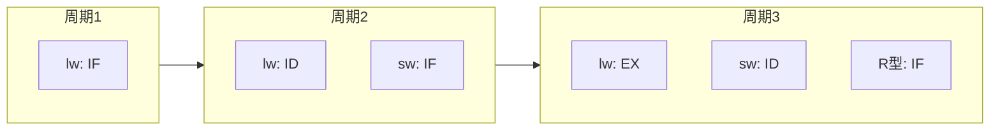
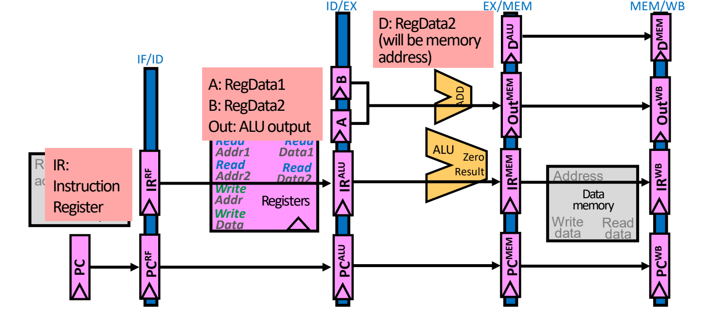
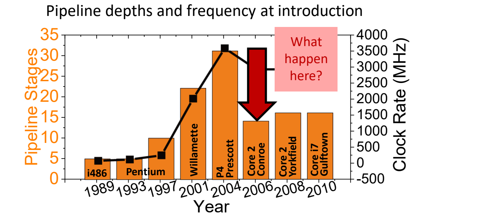
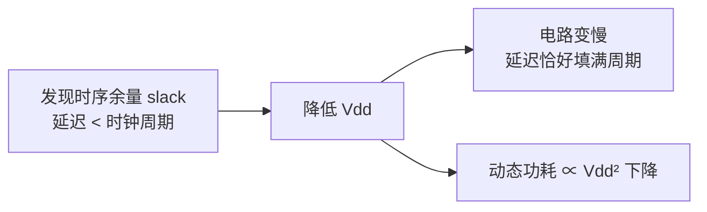

# 06 流水线设计与性能

[本讲目录](../index.md) · [课程目录](../../index.md) · [上一节：05 多周期数据通路](05-multicycle-datapath.md) · [下一节：07 结构冒险与数据冒险](07-structural-and-data-hazards.md)

> [!abstract] 本节要点
> - 流水线（pipelining）让多条指令的不同阶段在同一时钟周期内重叠执行，提高的是**吞吐量**，不缩短、反而延长单条指令的**延迟**。
> - 五级流水线 IF/ID/EX/MEM/WB 的三条设计原则：复制部件避免冲突（IM/DM 分离、两个加法器 + 一个 ALU，寄存器堆前半周期写、后半周期读）；用流水线寄存器 IF/ID、ID/EX、EX/MEM、MEM/WB 保存每条指令的 PC、指令和数据（目的寄存器号 rd 必须一路传到 WB）；控制信号在 ID 产生，按 EX/MEM/WB 分组随指令逐级传递。
> - 流水线周期由最慢一级加锁存开销决定：$T_{\rm cycle}=\max_i t_i\,(+T_{\rm clk\_q}+T_s)$；例题中单周期 4.1 ns、流水线 1.2 ns，单条延迟 $5\times1.2=6.0$ ns，加速比 $4.1/1.2\approx3.42$，理想值 5 达不到是因为各级不平衡。
> - 加深流水线可提高频率，但 Intel x86 深度从 5 级升到约 31 级（Prescott）后回落到 14–16 级，原因是功耗与发热；可用降压（功耗 $\propto V^2$）、时钟门控等手段压功耗。
> - 冒险（hazard）使下一条指令不能在预定周期执行，分为结构冒险、数据冒险、控制冒险三类。

## 吞吐量与延迟：为什么还要流水线

多周期处理器把一条指令拆成若干短周期，但同一时刻仍只有一条指令在数据通路里，大部分部件处于空闲，整体仍然慢。[^s1p65] 流水线不再追求让单条指令更快，而是从**吞吐量**角度提升性能。

- **吞吐量**（throughput）：单位时间内完成的工作量（例如每周期完成的指令数 IPC）。
- **延迟**（latency）：一条指令从开始到完成所经历的时间，也称执行时间、响应时间。[^s1p138]

（备份页内容）回顾性能方程 $\text{CPU time} = \text{CPI}\times\text{CC}\times\text{IC}$（CC 为时钟周期，IC 为指令数，见 L02《02 CPI与性能铁律》），想让程序更快有三条路：[^s1p137]

1. **把指令周期拆得越来越细**：拆到一定程度后收益递减，加载状态寄存器花的时间与真正做事的时间相当。
2. **当前指令尚未完成就开始取下一条并执行**：这就是流水线，现代处理器几乎都采用。
3. **一次取多条指令并执行**：超标量（superscalar），后续课程讨论。

**运油类比**：要把大量石油运走，有三种方案——[^s1p66]

| 方案 | 做法 | 对应处理器 |
| --- | --- | --- |
| A 油轮 | 一次装 1,000,000 加仑，航行 30 天，卸货再返回 | 单周期：一次干完一整件事，周期极长 |
| B 快艇 | 一次只运 100 加仑，航行 2 天，卸货再返回 | 多周期：每趟很快，但要往返很多次 |
| C 输油管道 | 管道里持续有油在流动，出口源源不断出油 | 流水线：每个"时刻"都有产出 |

食堂打饭也是同理：多周期好比一个学生依次拿完米饭、汤、泡菜、鸡蛋，下一个人才开始；流水线则是第一个人去拿汤时，第二个人已经在拿米饭，各窗口同时有人。[^s1p67]

（备份页内容）对比三种实现执行 lw、sw、R 型指令的时间轴：单周期每条指令占一个很长的周期，短指令也要等满整个周期（浪费）；多周期按指令所需步数占若干短周期；流水线中每条指令仍走 5 个阶段，但相邻指令错开一个周期重叠执行。[^s1p139] 流水线前三个周期的重叠情况如下：



流水线的两个固有代价：时钟周期（即每一级的时间）受**最慢的一级**限制；对某些指令来说部分阶段是空转的（例如 R 型指令的 MEM 级什么也不做）。[^s1p138]

## 流水线数据通路的三条设计原则

从多周期改成流水线时，核心变化是"多条指令同时在数据通路的不同阶段"，这带来三个问题，对应三条设计原则：[^s1p68]

1. **Q1 部件冲突**：五个阶段 IF、ID、EX、MEM、WB 在同一周期都要工作，多周期中被复用的部件此时会被同时争用。→ 像单周期那样**重新复制部件**。
2. **Q2 状态保存**：PC 每个周期都在更新，后续阶段却还需要"自己那条指令"的 PC 和指令字。→ 增加**流水线寄存器**记录每条指令的 PC、指令和中间数据。
3. **Q3 控制信号**：不同阶段正在执行的是不同指令，所需控制信号各不相同。→ 让控制信号**随数据一起经流水线寄存器向后传递**。

### 原则一：复制数据通路部件

复制后的部件组合与原来的单周期数据通路相同：[^s1p69]

- **指令存储器与数据存储器分离**（IM/DM）：IF 取指与 MEM 访存可在同一周期进行。
- **两个加法器 + 一个 ALU**：一个加法器算 PC+4，一个算分支目标 PC+偏移，ALU 专用于 EX 级运算，不再像多周期那样由 ALU 兼算 PC。

例外是**寄存器堆**：只需一个就能同时服务 ID（读）和 WB（写）。[^s1p70]

- 读与写使用寄存器堆上不同的端口；
- **写操作发生在周期的前半段，读操作发生在后半段**。这样同一周期内 WB 先写入的值，ID 在后半周期就能读到。

> [!note] 补充解释
> "前半周期写、后半周期读"的直接收益是：相隔 3 条指令的写后读不需要额外处理——WB 级写入的结果在同一周期就被 ID 级的后继指令读到。这一点在 [[07 结构冒险与数据冒险]] 分析数据冒险时会用到。

### 原则二：流水线寄存器（Pipeline Register）

**流水线寄存器**是插在相邻两级之间的状态寄存器，用来把各级隔离开：后面阶段需要用到的任何数据，都必须经流水线寄存器逐级传递下去。[^s1p71] 为简化作图，每两级之间的一组寄存器被看作一个"大"流水线寄存器，按其两侧阶段命名为 **IF/ID、ID/EX、EX/MEM、MEM/WB**。[^s1p140]

各级寄存器中保存的内容（上标表示该值供哪一级使用）：

| 流水线寄存器 | 保存内容 |
| --- | --- |
| IF/ID | $\text{PC}^{\rm RF}$、$\text{IR}^{\rm RF}$（IR 即指令寄存器 Instruction Register） |
| ID/EX | $\text{PC}^{\rm ALU}$、$\text{IR}^{\rm ALU}$、A（RegData1）、B（RegData2） |
| EX/MEM | $\text{PC}^{\rm MEM}$、$\text{IR}^{\rm MEM}$、$\text{Out}^{\rm MEM}$（ALU 输出）、$D^{\rm ALU}$（RegData2，作为写存储器的数据） |
| MEM/WB | $\text{PC}^{\rm WB}$、$\text{IR}^{\rm WB}$、$\text{Out}^{\rm WB}$、$D^{\rm MEM}$（存储器读出数据） |



可以看到 PC 和指令字一路从 IF/ID 传到 MEM/WB：许多信息在当前阶段用不上，但为了最后一级能用到，必须在各级之间不停地传。

**目的寄存器号必须一路传到 WB**：目的寄存器由 IF 取出的指令中的 rd 字段决定，但寄存器堆的写地址端口工作在 WB 级。如果直接把 IF/ID 中当前指令的 rd 接到写地址上，写入的就是"此刻在 ID 级那条指令"的 rd，而不是正在 WB 的那条指令的。因此 rd 字段必须经 ID/EX → EX/MEM → MEM/WB 逐级传递，在 WB 级再送回寄存器堆的写地址端口。[^s1p72]

以 load 为例：在 IF 读出指令，ID 读寄存器后送入 ID/EX，EX 算地址后送入 EX/MEM，MEM 读出数据送入 MEM/WB，最后在 WB 把结果（连同一路传来的 rd）写回寄存器堆。

> [!warning] 易错点
> 这部分流水线数据通路图沿用 MIPS 画法：寄存器写成 `$8`、`$29` 形式，目的寄存器由 `Instr[15-11]`（rd）或 `Instr[20-16]`（rt）经 RegDst 选择。[^s1p72] RISC-V 中目的寄存器固定在 `inst[11:7]`，不需要 RegDst 多路选择器；但"rd 必须随流水线传到 WB"这一原则完全相同。

### 原则三：控制信号的产生与分组传递

控制信号的产生方式与单周期处理器相同（在 ID 级由控制单元根据操作码产生，见 [[04 单周期数据通路]]），但某些信号在后续阶段才用得上，而且每一级正在执行的指令不同。[^s1p73] 因此控制信号在 ID 产生后按使用阶段分成 EX、MEM、WB 三组，存入 ID/EX；每过一级就"用掉"本级那一组，剩余的继续向后传：


正确的分组如下：[^s1p141]

| 分组 | 使用阶段 | 控制信号 |
| --- | --- | --- |
| EX | 执行/地址计算 | ALUSrc、ALUOp（MIPS 画法中还有 RegDst） |
| MEM | 访存 | MemRead、MemWrite、Branch（决定 PCSrc） |
| WB | 写回 | RegWrite、MemtoReg |

> [!warning] 易错点：控制分组标签错位
> 源材料的控制传递图中，文字标签写成"MEM: ALUSrc, ALUOp, RegDst"与"WB: MemRead, MemWrite, PCSrc"，这是标签整体错位。按信号功能判断：ALUSrc/ALUOp 控制 ALU，属于 EX；MemRead/MemWrite 控制数据存储器、Branch/PCSrc 用 MEM 级的分支结果选择 PC，属于 MEM；RegWrite/MemtoReg 控制写回，属于 WB。以上表为准（与备份页中的流水线控制表一致）。[^s1p73]

各类 RISC-V 指令在三组中的控制值（备份页内容）：[^s1p141]

| 指令 | ALUOp | ALUSrc | Branch | MemRead | MemWrite | RegWrite | MemtoReg |
| --- | --- | --- | --- | --- | --- | --- | --- |
| R 型 | 10 | 0 | 0 | 0 | 0 | 1 | 0 |
| ld | 00 | 1 | 0 | 1 | 0 | 1 | 1 |
| sd | 00 | 1 | 0 | 0 | 1 | 0 | X |
| beq | 01 | 0 | 1 | 0 | 0 | 0 | X |

sd 和 beq 不写寄存器（RegWrite=0），所以 MemtoReg 无关（X）。

## 填充、满与排空

**流水线深度**（pipeline depth）是流水线的级数，本讲为 5。以下面 5 条指令为例（MIPS 写法）：[^s1p74]

```asm
1000: lw  $8, 4($29)
1004: sub $2, $4, $5
1008: and $9, $10, $11
1012: or  $16, $17, $18
1016: add $13, $14, $0
```

逐周期看，第 $k$ 个周期第 1 条指令处于第 $k$ 级，后面的指令依次落后一级：

1. **填充**（filling，周期 1–4）：流水线中还有未被使用的功能部件。周期 1 只有 lw 在 IF；周期 2 lw 在 ID、sub 在 IF；……周期 4 已有 4 条指令在 IF–MEM。[^s1p75]
2. **满**（full，周期 5）：五级各有一条指令，所有硬件都在使用——lw 在 WB，add 在 IF。[^s1p79]
3. **排空**（emptying，周期 6–9）：不再有新指令进入时，流水线逐级空出，add 在周期 9 完成写回。若后面还有源源不断的指令，流水线就能每个周期产出一条结果。[^s1p74]

> [!note] 补充解释
> 由此可得一般规律：$k$ 级流水线执行 $n$ 条指令（无停顿）需要 $k+(n-1)$ 个周期。本例 $5+4=9$ 个周期，与"周期 9 排空结束"一致。$n$ 很大时平均每条指令约 1 个周期。

## 流水线悖论与加速比

**流水线悖论**（pipelining paradox）：流水线并不改善任何单条指令的延迟；事实上，每条指令在流水线中花的时间比在单周期数据通路中还要长。[^s1p80] 原因有二：

1. **级间锁存增加延迟**：每一级末尾都要经过一个流水线寄存器，数据必须在时钟沿前满足建立时间 $T_s$（并保持 $T_h$），时钟沿后还要经过 $T_{\rm clk\_q}$ 才出现在输出端。单周期只付一次这份开销，$k$ 级流水线要付 $k$ 次。
2. **最长的一级决定时钟周期**：较短的级也必须等满整个周期。[^s1p81]

于是每级周期满足（时序约束的推导见 [[03 数据通路部件与时钟]]）：
$$
T_{\rm cycle} \ge \max_i\, t_i + T_{\rm clk\_q} + T_s
$$
其中 $t_i$ 是第 $i$ 级组合逻辑延迟。下面的例题忽略锁存开销，只取 $\max_i t_i$。

> [!example] 例：五级流水线比单周期快多少？
> 已知各级延迟：IF 1.0 ns，ID 0.6 ns，EX 0.9 ns，MEM 1.2 ns，WB 0.4 ns。[^s1p81]
>
> 1. **单周期**：一个周期要走完全部五级，$T=1.0+0.6+0.9+1.2+0.4=4.1$ ns；每条指令 1 个周期，延迟 4.1 ns。
> 2. **五级流水线**：周期取最长级 $T=\max=1.2$ ns（MEM）；每条指令要 5 个周期，延迟 $5\times1.2=6.0$ ns——比单周期**更长**。
> 3. **吞吐量**：度过最初的填充期后，两者都是每周期完成 1 条指令（CPI=1），区别只在周期长度。[^s1p82]
> 4. **加速比**：
> $$
> \text{Speedup}=\frac{\text{CPI}\times T_{\rm single}}{\text{CPI}\times T_{\rm pipe}}=\frac{4.1\ \text{ns}}{1.2\ \text{ns}}\approx 3.42
> $$
>
> | 设计 | 周期 | 每条指令周期数 | 单条延迟 | 吞吐量 |
> | --- | --- | --- | --- | --- |
> | 单周期 | 4.1 ns（各级之和） | 1 | 4.1 ns | 1 条 / 4.1 ns |
> | 五级流水线 | 1.2 ns（各级最大值） | 5 | 6.0 ns | 1 条 / 1.2 ns |

**理想加速比**：流水线最多同时执行 5 条指令，若各级完全平衡（每级都是 $4.1/5=0.82$ ns），周期缩为原来的 1/5，理想加速比等于**流水线深度** 5。[^s1p83] 实际只有 3.42，是因为**各级不平衡**——MEM 级 1.2 ns 远长于 WB 的 0.4 ns，其他级都要陪着等 1.2 ns。

> [!tip] 课堂强调
> 这类周期/延迟/加速比的计算很简单，课上直接给出结果，并表示不太打算考察这个计算本身；需要真正理解的是"流水线提高吞吐量、不降低延迟"以及"不平衡导致达不到理想加速比"。[^s2b11]

> [!warning] 易错点
> 加速比要比的是**吞吐量**（同样 CPI 下比周期），不是单条指令延迟。用延迟比会得到 $4.1/6.0<1$，错误地得出"流水线更慢"。

## 流水线深度的极限：功耗

既然加速比理想上等于深度，自然的想法是不断加深流水线来提高吞吐量和主频。Intel x86 的历史正是如此：[^s1p84]

- i486（1989）与 Pentium（1993）约 5 级，1997 年约 10 级；
- Willamette（2001）约 22 级、主频约 2 GHz，P4 Prescott（2004）达到约 31 级、主频约 3.6 GHz；
- 此后 Core 2 Conroe（2006）回落到 14 级，Core 2 Yorkfield（2008）与 Core i7 Gulftown（2010）约 16 级。



回落的原因是**功耗与发热**：同时进行的事情太多，芯片会"熔化"。[^s1p85] 必须关掉系统中暂时不用的部分，常见手段有：

1. **时钟门控**（clock gating）：关闭空闲模块的时钟，其组合逻辑不再翻转，从而节省功耗。
2. **异步设计**（asynchronous design）：不依赖全局时钟，需要时才工作。
3. **低电压摆幅**（low voltage swings）/ 降压利用时序余量：若一级的 $T_{\rm clk\_q}$ + 传播延迟 + 建立时间明显短于时钟周期，中间就留有**时间余量**（slack），这段时间电路什么也不做。此时可以降低电源电压 $V_{dd}$，使电路变慢、恰好填满时钟周期，而动态功耗与 $V_{dd}^2$ 成正比，降压带来平方级的功耗下降。[^s1p85]



动态功耗与电压、频率的关系以及“功耗墙”的来龙去脉见 L01《05 技术趋势与功耗墙》，这里不再展开。

## 冒险与 RISC-V 的易流水化

加深流水线的第二个限制是**冒险**（hazard）：使下一条指令无法在其预定的时钟周期执行的情况。一旦出现冒险，指令只能停顿等待，流水线的吞吐量收益随之损失。[^s1p86] 冒险分三类：

- **结构冒险**（structural hazard）：硬件资源不够，两条指令同时要用同一部件——例如只有一个存储器时 IF 与 MEM 冲突。
- **数据冒险**（data hazard）：指令的输入操作数依赖于前面指令尚未产生的结果。
- **控制冒险**（control hazard）：分支结果未定，不知道下一条该取哪条指令。[^s1p142]

结构冒险与数据冒险的具体分析与解决（停顿、转发、load-use）见 [[07 结构冒险与数据冒险]]，控制冒险见 [[08 控制冒险]]。

（备份页内容）RISC-V 指令集本身是按易于流水化设计的：[^s1p142]

| ISA 特点 | 对流水线的好处 |
| --- | --- |
| 所有指令等长（32 位） | 第 1 级即可取指，第 2 级即可译码 |
| 指令格式少、字段位置精心安排 | 第 2 级就能开始读寄存器堆（不必等译码完成） |
| 只有 load/store 访问存储器 | 可用 EX 级计算访存地址，MEM 级只做访存 |
| 每条指令最多写一个结果，且在流水线末尾（MEM、WB）写 | 机器状态修改集中在末端，便于控制 |

> [!question]- 自测：五级流水线各级延迟为 IF 0.8、ID 0.5、EX 1.0、MEM 0.9、WB 0.3 ns（忽略锁存开销），单条指令延迟和相对单周期的加速比分别是多少？
> 单周期周期 $=0.8+0.5+1.0+0.9+0.3=3.5$ ns；流水线周期取最大级 $1.0$ ns，单条延迟 $5\times1.0=5.0$ ns（比单周期长）；稳态每周期 1 条，加速比 $3.5/1.0=3.5$，低于理想值 5，因为 EX 级最慢，各级不平衡。

> [!question]- 自测：若流水线设计中把 IF/ID 寄存器里的 rd 字段直接接到寄存器堆写地址端口，执行 `lw x5, 0(x1)` 后紧跟 4 条无关指令，会发生什么？
> lw 的数据在 WB 级（第 5 周期）才写回，此时 IF/ID 里是正在 ID 级的第 3 条后继指令（第 4 条还在 IF），写地址取的是那条指令的 rd，结果被写进错误的寄存器。rd 必须经 ID/EX、EX/MEM、MEM/WB 随 lw 一起传到 WB。

> [!question]- 自测：sd 指令在 ID 产生的控制信号中，哪一组在哪一级被用到？到达 MEM/WB 时还剩哪些？
> EX 组 ALUOp=00、ALUSrc=1 在 EX 级用于算地址；MEM 组 MemWrite=1、MemRead=0、Branch=0 在 MEM 级用于写存储器；MEM/WB 中只剩 WB 组 RegWrite=0、MemtoReg=X，表示 sd 不写回寄存器。

> [!info]- 来源
> - L03.pdf：PDF p.65–86, 137–142
> - L03.docx：DOCX body 384–484

[^s1p65]: L03.pdf-PDF p.65
[^s1p138]: L03.pdf-PDF p.138
[^s1p137]: L03.pdf-PDF p.137
[^s1p66]: L03.pdf-PDF p.66
[^s1p67]: L03.pdf-PDF p.67
[^s1p139]: L03.pdf-PDF p.139
[^s1p68]: L03.pdf-PDF p.68
[^s1p69]: L03.pdf-PDF p.69
[^s1p70]: L03.pdf-PDF p.70
[^s1p71]: L03.pdf-PDF p.71
[^s1p140]: L03.pdf-PDF p.140
[^s1p72]: L03.pdf-PDF p.72
[^s1p73]: L03.pdf-PDF p.73
[^s1p141]: L03.pdf-PDF p.141
[^s1p74]: L03.pdf-PDF p.74
[^s1p75]: L03.pdf-PDF p.75
[^s1p79]: L03.pdf-PDF p.79
[^s1p80]: L03.pdf-PDF p.80
[^s1p81]: L03.pdf-PDF p.81
[^s1p82]: L03.pdf-PDF p.82
[^s1p83]: L03.pdf-PDF p.83
[^s2b11]: L03.docx-DOCX body 430-484
[^s1p84]: L03.pdf-PDF p.84
[^s1p85]: L03.pdf-PDF p.85
[^s1p86]: L03.pdf-PDF p.86
[^s1p142]: L03.pdf-PDF p.142

[本讲目录](../index.md) · [课程目录](../../index.md) · [上一节：05 多周期数据通路](05-multicycle-datapath.md) · [下一节：07 结构冒险与数据冒险](07-structural-and-data-hazards.md)
