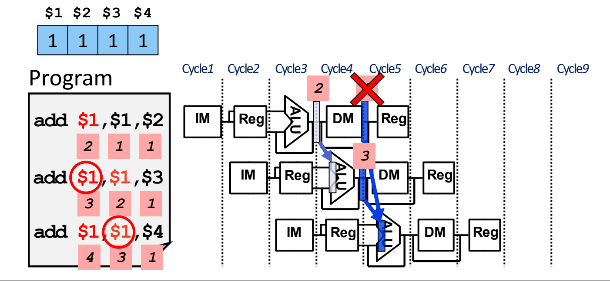
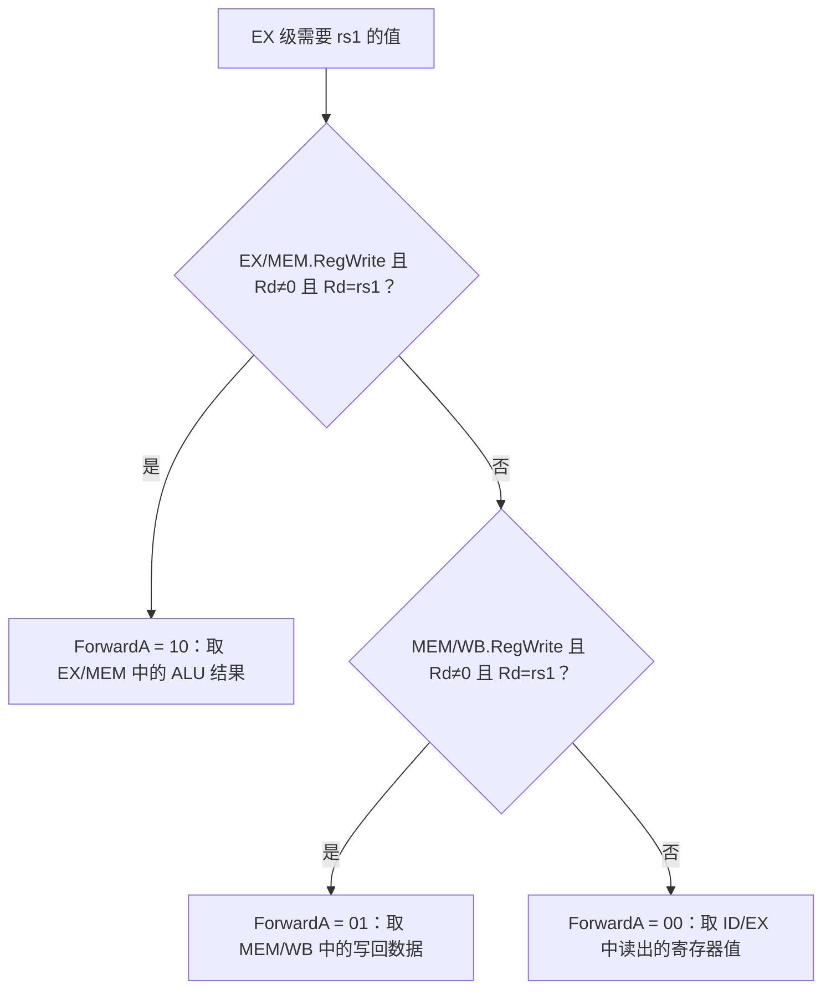
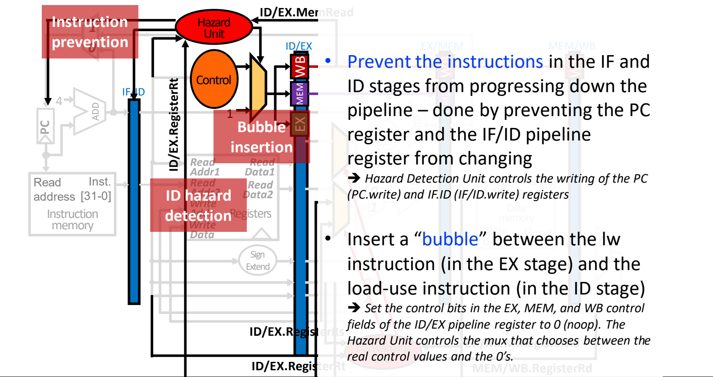
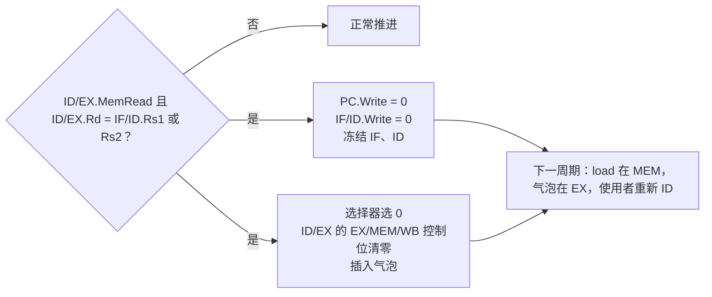

# 07 结构冒险与数据冒险

[本讲目录](../index.md) · [课程目录](../../index.md) · [上一节：06 流水线设计与性能](06-pipeline-design-and-performance.md) · [下一节：08 控制冒险](08-control-hazards.md)

> [!abstract] 本节要点
> - 流水线图把每条指令画成 IM–Reg–ALU–DM–Reg 五格错开排列；流水线填满后每周期完成一条指令，CPI = 1，但会遇到结构、数据、控制三类冒险，最保守的解决办法永远是“等待”。
> - 结构冒险：只有一个存储器时，取指和 load 读数据会在同一周期争用它，所以把指令存储器和数据存储器分开（I-cache / D-cache）；寄存器堆的读写冲突用“前半周期写、后半周期读”解决。
> - WAR（反相关）和 WAW（输出相关）只是寄存器名字被重复使用，在五级流水线中不会发生，也可以靠寄存器重命名消除；RAW 是真相关，必须真正把数据送过去。
> - RAW 的两种解法：停顿（紧邻的相关指令要等 2 个周期）和转发（ALU 结果在 EX 结束时就有）。load-use 即使有转发也要停顿 1 个周期，由 ID 阶段的冒险检测单元冻结 PC 和 IF/ID，并向 ID/EX 插入气泡。
> - 转发条件 = RegWrite ∧ Rd ≠ 0 ∧ Rd 与源寄存器相同；EX/MEM 匹配时 Forward = 10，MEM/WB 匹配时 Forward = 01。出现双重冒险时必须转发最新的 EX/MEM 结果（例题正确结果 4，转发错了得 3）。

这部分源材料沿用 MIPS 写法（`lw $1,4($2)`、Rs/Rt、用 Rt 作 load 的目的寄存器），下面统一改写成 RISC-V：源寄存器记作 rs1/rs2，目的寄存器记作 rd，`$1` 对应 `x1`，`lw` 对应 `ld`。冒险的分类与定义见 [[06 流水线设计与性能]]，控制冒险见 [[08 控制冒险]]。

## 流水线图（Pipeline Diagram）

分析冒险首先要知道“第几个周期、哪条指令、用的是哪个部件”。**流水线图**（pipeline diagram）就是回答这个问题的工具：横轴是时钟周期，纵轴是按程序顺序排列的指令，每条指令画成 5 个部件符号——IM（取指，指令存储器）、Reg（译码并读寄存器堆）、ALU（执行）、DM（访存，数据存储器）、Reg（写回寄存器堆），下一条指令右移一格。[^s1p88]

用流水线图可以回答三类问题：[^s1p88]

1. 这段代码一共要多少个周期？
2. 第 4 个周期 ALU 在为哪条指令工作？
3. 有没有冒险？原因是什么？怎么解决？

5 条指令在五级流水线中没有冒险时占用第 1–9 个周期（$5 + (5-1) = 9$）。前 4 个周期在**填充**流水线；填满以后每个周期都有一条指令完成，所以 $\text{CPI}=1$。[^s1p89]

流水线会出问题，原因就是三类**流水线冒险**（分类见 [[06 流水线设计与性能]]）。所有冒险都可以靠**等待**解决，前提是流水线控制必须**检测**到冒险，再**采取行动**。[^s1p90]

## 结构冒险（Structural Hazard）

**结构冒险**是两条不同的指令在同一时刻试图使用同一个硬件资源。[^s1p91] 五级流水线中最典型的两个资源是存储器和寄存器堆。

### 单一存储器

以下面这段程序为例（下同）：

```asm
ld  x1, 4(x2)    # 指令 1
sub x4, x1, x5   # 指令 2
and x6, x1, x7   # 指令 3
or  x8, x1, x9   # 指令 4
```

在第 4 个周期，`ld` 处于 MEM 阶段，要**从存储器读数据**；同一周期 `or` 处于 IF 阶段，要**从存储器读指令**。如果指令和数据共用一个存储器，这两次访问就会冲突。[^s1p92]

**解决方法**：把存储器分成**指令存储器/指令缓存**（I-cache）和**数据存储器/数据缓存**（D-cache）。IM 只在 IF 阶段使用，DM 只在 MEM 阶段使用，任何周期每个存储器最多只有一条指令在访问。[^s1p93]

### 寄存器堆的读与写

第 5 个周期，`ld` 在 WB 阶段**写**寄存器堆，`or` 在 ID 阶段**读**寄存器堆，两者同时用到寄存器堆。[^s1p94]

**解决方法**：把一个周期分成两半，**前半周期写寄存器、后半周期读寄存器**（并把读到的值装入流水线寄存器）。这样同一周期里先写进去的值，后半周期就能读到。[^s1p95] 这个规则后面会反复用到：同一周期内 WB 写、ID 读同一个寄存器，读到的是新值。

| 冲突资源 | 冲突周期 | 冲突双方 | 解决方法 |
|---|---|---|---|
| 存储器 | 第 4 周期 | `ld` 的 MEM 读数据 vs `or` 的 IF 读指令 | 分开 I-cache 与 D-cache |
| 寄存器堆 | 第 5 周期 | `ld` 的 WB 写 vs `or` 的 ID 读 | 前半周期写、后半周期读 |

## 三种数据相关：WAR、WAW 与 RAW

**数据冒险**是指令依赖于仍在流水线中的前一条指令的结果，在数据还没准备好时就去使用它。[^s1p96] 设指令 I 在前、J 在后，按“哪种读写顺序被破坏”可分三类：[^s1p97]

| 类型 | 例子 | 被破坏的顺序 | 编译器术语 | 根源 | 五级流水线中 |
|---|---|---|---|---|---|
| **写后读**（Read After Write, RAW） | `I: add r1,r2,r3`<br>`J: sub r4,r1,r3` | J 在 I 写 r1 之前就读了 r1 | **真相关**（true dependence） | 指令之间确实需要传递数据 | 会发生，是本节的重点 |
| **读后写**（Write After Read, WAR） | `I: sub r4,r1,r3`<br>`J: add r1,r2,r3`<br>`K: mul r6,r1,r7` | J 在 I 读 r1 之前就写了 r1 | **反相关**（anti-dependence） | 寄存器名 r1 被重复使用 | 不会发生：读总在第 2 级（ID），写总在第 5 级（WB） |
| **写后写**（Write After Write, WAW） | `I: sub r1,r4,r3`<br>`J: add r1,r2,r3`<br>`K: mul r6,r1,r7` | J 在 I 写 r1 之前就写了 r1 | **输出相关**（output dependence） | 寄存器名 r1 被重复使用 | 不会发生：写总在第 5 级（WB），按程序顺序进行 |

WAR 和 WAW 的两条指令之间其实没有数据依赖，只是碰巧用了同一个寄存器名字。把 J 的目的寄存器换成另一个寄存器，冲突就没了，这就是**寄存器重命名**（register renaming）。在别的实现技术中（或指令间距更长时），这两类冒险可能出现，这时可以用重命名解决。[^s1p97]

RAW 不同：后一条指令要的是前一条指令**写进寄存器的值**，换名字解决不了，必须让数据真正从生产者送到消费者。下面只讨论 RAW。

> [!tip] 课堂强调
> 在简单的五级流水线里 WAR 和 WAW 都不会出现，到后面讲超标量（superscalar）处理器时，这两类冒险都会出现。[^s2b12]

## RAW 冒险的时序与停顿（Stall）

### 两种 RAW 场景

**场景一：寄存器使用（register usage）**。[^s1p98]

```asm
add x1, x2, x3   # 第 5 周期 WB 才写入 x1
sub x4, x1, x5   # 第 3 周期 ID 读 x1 → 读到旧值
and x6, x1, x7   # 第 4 周期 ID 读 x1 → 读到旧值
or  x8, x1, x9   # 第 5 周期 ID 读 x1 → 前半周期写、后半周期读，正确
xor x4, x1, x5   # 第 6 周期 ID 读 x1 → 正确
```

`add` 的结果要到第 5 个周期才写回 x1，`sub` 和 `and` 却在第 3、第 4 个周期就读寄存器，属于“写之前读”，读到的是错误的旧值。`or` 在第 5 个周期读，靠前半周期写、后半周期读拿到了正确值；`xor` 更晚，也没问题。[^s1p98]

**场景二：load-use 数据冒险**。把第一条换成 `ld x1, 4(x2)`，情况相同：load 的数据也要到第 5 个周期才写回，`sub`、`and` 读错，`or`、`xor` 读对。[^s1p99] 两种场景分开讲，是因为它们在转发下的结果不同，见下文。

### 解法一：停顿

**停顿**（stall）就是让相关指令原地等待，直到数据写回寄存器堆再读。`sub` 本来在第 3 个周期做 ID，必须推迟到与 `add` 的 WB 同一个周期（第 5 周期，靠半周期规则），所以要插入 **2 个停顿周期**；`and` 也随之整体后移。[^s1p100]

| 指令 | C1 | C2 | C3 | C4 | C5 | C6 | C7 | C8 |
|---|---|---|---|---|---|---|---|---|
| `add x1,x2,x3` | IF | ID | EX | MEM | WB | | | |
| `sub x4,x1,x5` | | IF | stall | stall | ID | EX | MEM | WB |

停顿简单可靠，代价是 CPI 不再等于 1：每次停顿都让流水线空转，CPI 上升。[^s1p100]

## 数据转发（Forwarding / Bypassing）

停顿浪费的周期其实没有必要：`add` 的结果在 EX 结束时（第 3 周期末）就已经算出来了，只是还没写回。**转发**（forwarding，又称**旁路** bypassing）就是一旦结果产生，立即把它送到需要它的地方，不再等它写回寄存器堆。[^s1p101]

精确地说：从流水线状态寄存器中**最早出现该结果的位置**取出它，送到这个周期需要它的功能部件（例如 ALU）。对 ALU 来说，输入不再只能来自 ID/EX，而可以来自任一流水线寄存器，硬件上需要：[^s1p103]

1. 在 ALU 的两个输入端各加一个**多路选择器**；
2. 把 EX/MEM 和 MEM/WB 中准备写入 rd 的数据连到 EX 级 rs1、rs2 两个 ALU 选择器的输入端（可以接其中一个，也可以两个都接）；
3. 加上控制这些新选择器的硬件。

其他功能部件（如数据存储器 DM）可能也需要类似的转发逻辑。有了转发，即使存在数据相关，也能做到 $\text{CPI}=1$。[^s1p103]

流水线寄存器本来就保存着 ALU 结果：EX/MEM 中存着上一条指令刚算出的结果，下一个周期这个结果移到 MEM/WB。因此在 `add x1,...` 后面：[^s1p104]

- 紧跟在后的 `sub` 在 EX 时，`add` 在 MEM，x1 的新值在 **EX/MEM** 中 → **EX/MEM 转发**；
- 中间隔一条的 `and` 在 EX 时，`add` 在 WB，x1 的新值已经到了 **MEM/WB** → **MEM/WB 转发**。

### load-use：转发后仍要停顿 1 周期

load 的数据要到 MEM 阶段结束（第 4 周期末）才从数据存储器读出来，而紧跟其后的 `sub` 在第 4 周期**开始**时就要在 EX 用它。数据不能送回过去，所以即使有转发，也必须**停顿 1 个周期**：`sub` 推迟一拍进入 EX，这时 load 的数据已在 MEM/WB 中，可以转发过去。[^s1p102] [^s1p110]

| 指令 | C1 | C2 | C3 | C4 | C5 | C6 | C7 |
|---|---|---|---|---|---|---|---|
| `ld x1,4(x2)` | IF | ID | EX | MEM | WB | | |
| `sub x4,x1,x5` | | IF | ID | 气泡（重复 ID） | EX ← MEM/WB 转发 | MEM | WB |
| `and x6,x1,x7` | | | IF | IF（保持） | ID | EX | MEM |

| 生产者 | 结果可用时刻 | 消费者需要时刻 | 不转发：停顿 | 转发：停顿 |
|---|---|---|---|---|
| ALU 指令（`add`） | 第 3 周期末（EX） | 下一条的第 4 周期 EX | 2 周期 | 0 |
| `ld` | 第 4 周期末（MEM） | 下一条的第 4 周期 EX | 2 周期 | 1 周期 |

> [!tip] 课堂强调
> load 的数据要到第 4 个周期（MEM）才有，下一条指令却在同一个周期一开始就要用它，所以无法满足转发的时间要求，必须在 load 和使用它的指令之间额外加一个停顿周期。[^s2b12]

## 转发单元与转发条件

### EX/MEM 转发条件

转发单元在 EX 阶段比较寄存器号，判断 ALU 的某个输入是否应该改用流水线寄存器里的新值。EX/MEM 转发（生产者与使用者相邻，例如 `add x1,x2,x3` 之后紧跟 `and x6,x1,x7`）的条件是：[^s1p105]

```text
if (EX/MEM.RegWrite
    and (EX/MEM.RegisterRd != 0)
    and (EX/MEM.RegisterRd == ID/EX.RegisterRs1))
        ForwardA = 10

if (EX/MEM.RegWrite
    and (EX/MEM.RegisterRd != 0)
    and (EX/MEM.RegisterRd == ID/EX.RegisterRs2))
        ForwardB = 10
```

三个条件分别回答：[^s1p105]

1. **`RegWrite`**：EX/MEM 中那条指令的结果真的会写回寄存器堆吗？（`sd`、`beq` 不写寄存器，它们的 rd 位置上的数没有意义。）
2. **`Rd ≠ 0`**：目的寄存器不是 x0 吗？x0 恒为 0，写 x0 的结果会被丢弃，绝不能转发给读 x0 的指令。
3. **`Rd == Rs`**：EX/MEM 中指令的目的寄存器与 ID/EX 中（正在进入 EX 的）指令的源寄存器相同吗？相同才真正构成数据冒险。

ForwardA 控制 ALU 第一个操作数（rs1）的选择器，ForwardB 控制第二个操作数（rs2）的选择器。

### MEM/WB 转发条件（初版）

生产者与使用者中间隔一条指令（例如 `add x1,x2,x3`、一条无关指令、`sub x4,x1,x5`）时数据已在 MEM/WB，初版条件与上面同构，编码为 01：[^s1p106]

```text
if (MEM/WB.RegWrite
    and (MEM/WB.RegisterRd != 0)
    and (MEM/WB.RegisterRd == ID/EX.RegisterRs1))
        ForwardA = 01
（Rs2 同理 → ForwardB = 01）
```

这里的 `RegWrite` 问的是“MEM 阶段得到的数据会写回寄存器堆吗”，因此 MEM/WB 转发既能转发 ALU 结果，也能转发 load 读出的数据。

### 双重数据冒险

当 EX/MEM 和 MEM/WB 中的两条指令**都**要写同一个寄存器、且都与当前指令的源寄存器匹配时，**双重数据冒险**就出现了：该转发 WB 级那条指令的结果，还是 MEM 级那条指令的结果？[^s1p107]

> [!example] 例：连续累加 x1
> 初始 x1 = x2 = x3 = x4 = 1，执行
>
> ```asm
> add x1, x1, x2   # x1 = 1 + 1 = 2
> add x1, x1, x3   # x1 = 2 + 1 = 3
> add x1, x1, x4   # x1 = 3 + 1 = 4
> ```
>
> 1. 按程序语义，最终 x1 应为 **4**。[^s1p107]
> 2. 第 5 个周期，第三条 `add` 进入 EX，需要 x1。此时 EX/MEM 中是第二条指令的结果 **3**，MEM/WB 中是第一条指令的结果 **2**，两者的 rd 都是 x1，初版的 EX/MEM 条件和 MEM/WB 条件**同时成立**。
> 3. 如果选了 MEM/WB 的 2，第三条算出 $2+1=3$，结果**错误**；必须选更新的 EX/MEM 值 3，得到 $3+1=4$。
> 4. 结论：两级都匹配时，**EX/MEM 优先**，因为它是最新的结果。



因此 MEM/WB 转发要再加一个条件：**只有 EX/MEM 那一级不转发时，才从 MEM/WB 转发**。源材料给出的修正条件只检查了 `EX/MEM.RegisterRd != ID/EX.RegisterRs`，这是简化写法。[^s1p108] 完整条件（Patterson & Hennessy 版本）把 EX/MEM 转发的全部条件取反：

```text
if (MEM/WB.RegWrite
    and (MEM/WB.RegisterRd != 0)
    and not (EX/MEM.RegWrite
             and (EX/MEM.RegisterRd != 0)
             and (EX/MEM.RegisterRd == ID/EX.RegisterRs1))
    and (MEM/WB.RegisterRd == ID/EX.RegisterRs1))
        ForwardA = 01
（把 Rs1 换成 Rs2 → ForwardB = 01）
```

> [!warning] 易错点
> 只写“EX/MEM.Rd ≠ ID/EX.Rs1”不够。如果 EX/MEM 里是一条不写寄存器的指令（如 `sd`、`beq`），它 rd 位置上的位段可能碰巧等于 rs1，简化条件会错误地屏蔽本该进行的 MEM/WB 转发；同理，EX/MEM 的目的寄存器是 x0 时也不应该屏蔽 MEM/WB。判断方法：屏蔽 MEM/WB 的前提是“EX/MEM 这一级确实在转发”，所以要把 EX/MEM 的三个条件整体取反。

三种选择器编码汇总如下（00 即默认情况，操作数照常取自 ID/EX）：



### 转发硬件

加入转发后，数据通路中多了一个**转发单元**（forwarding unit）。它的输入是 ID/EX.RegisterRs1、ID/EX.RegisterRs2、EX/MEM.RegisterRd、MEM/WB.RegisterRd（以及两级的 RegWrite）；它的输出控制 ALU 两个输入端的三选一选择器（Forward to ALU）。数据通路上还画出了把写回数据转发到数据存储器写数据端的通路（Forward DM data）。[^s1p109] 转发单元的工作就是比较不同流水线寄存器中的寄存器号，确定有没有冒险；有冒险时，把选择器切换到相应的数据来源。[^s2b13]

> [!info] 可视化资源
> [Wikipedia：Classic RISC pipeline（五级流水线与转发示意图）](https://en.wikipedia.org/wiki/Classic_RISC_pipeline)——Hazards 一节用图示对比了数据冒险、一级转发，以及 load 后必须插入气泡的两级转发情形。

## load-use 冒险检测与插入气泡

转发单元只能“改选数据来源”，解决不了 load-use 必须多等一拍的问题，因此要在 **ID 阶段**加一个**冒险检测单元**（hazard detection unit），在 load 和使用它的指令之间插入一个停顿。[^s1p111]

### 检测条件

此时 load 在 EX 阶段（ID/EX 中），使用者在 ID 阶段（IF/ID 中）。用 RISC-V 字段写出（源材料中的 Rt 即 load 的目的寄存器 rd）：[^s1p111]

```text
if (ID/EX.MemRead
    and ((ID/EX.RegisterRd == IF/ID.RegisterRs1)
      or (ID/EX.RegisterRd == IF/ID.RegisterRs2)))
        stall the pipeline
```

- `ID/EX.MemRead`：现在 EX 阶段的指令是 load 吗？（只有 load 读数据存储器）
- 寄存器号比较：load 的目的寄存器是否等于 ID 阶段指令的任一源寄存器？两个都要比较。

冒险检测单元需要 ID/EX.MemRead、ID/EX.RegisterRd 以及 IF/ID 中的两个源寄存器号作为输入。[^s1p112]

### 停顿硬件：冻结 + 气泡

检测到 load-use 后，硬件做两件事：[^s1p113]

1. **阻止 IF、ID 中的指令前进**：冒险检测单元把 **PC.Write** 和 **IF/ID.Write** 置 0，PC 和 IF/ID 流水线寄存器保持不变。下一周期重新取同一条指令，ID 中的使用者再译码一次。
2. **插入气泡**（bubble）：在 EX 阶段的 load 和 ID 阶段的使用者之间插入一个空操作。方法是把 ID/EX 流水线寄存器中 EX、MEM、WB 三组控制位全部置 0（nop）。冒险检测单元控制一个选择器，在“控制单元产生的真实控制值”和“全 0”之间选择。



控制位全为 0 的指令不写寄存器（RegWrite = 0），也不读写存储器（MemRead = MemWrite = 0），沿流水线往下走时不改变任何体系结构状态，相当于一条 nop。下一个周期 load 进入 MEM、气泡在 EX、使用者仍在 ID；再下一个周期 load 进入 WB，使用者进入 EX，通过 MEM/WB 转发得到数据。



## 存储器到存储器复制（Memory-to-Memory Copy）

把一个存储单元的值搬到另一个存储单元，是很常见的操作，在 RISC-V 中写成 load 紧跟 store：[^s1p114]

```asm
ld x1, 4(x2)   # 从 M[x2+4] 读到 x1
sd x1, 4(x3)   # 把 x1 写到 M[x3+4]
```

`sd` 真正需要 x1 的地方不是 ALU（ALU 只计算地址 x3+4），而是 **MEM 阶段数据存储器的写数据端**。`sd` 进入 MEM 时，`ld` 刚好在 WB，读出的数据就在 MEM/WB 中。因此只要**从 MEM/WB 寄存器转发到数据存储器输入端**，就能避免停顿。代价是在访存阶段增加一个转发单元和一个选择器。[^s1p114] 前面的 ALU 转发通路只服务 EX 阶段，覆盖不了 DM 前后的这条路径，所以需要单独加转发和控制逻辑。[^s2b13]

> [!note] 补充解释
> 这条转发的判断条件源材料没有给出，可以类比 ALU 转发来写：WB 级是 load（MEM/WB 的 MemtoReg/RegWrite 有效）、MEM 级是 store（EX/MEM.MemWrite），并且 MEM/WB.RegisterRd = EX/MEM.RegisterRs2（store 的数据寄存器）、Rd ≠ 0。条件成立时，DM 写数据端改选 MEM/WB 中的 load 数据。要真正省掉这次停顿，load-use 检测单元也不能因为 `sd` 的 rs2 匹配就停顿。

> [!question]- 自测：在有完整转发的五级流水线中，下列两段代码各需要停顿几个周期？(a) `add x1,x2,x3` 后紧跟 `sub x4,x1,x5`；(b) `ld x1,0(x2)` 后紧跟 `sub x4,x1,x5`。如果没有转发呢？
> 有转发时 (a) 0 个，(b) 1 个；没有转发时两者都是 2 个。`add` 的结果在 EX 结束时就在 EX/MEM 中，可以直接送给下一条指令的 EX。`ld` 的数据要到 MEM 结束才出现，晚了一拍，只能停顿 1 周期后从 MEM/WB 转发。没有转发时，两者都要等到第 5 周期写回，再靠“前半周期写、后半周期读”在同一周期读出，所以都要停 2 周期。

> [!question]- 自测：x1=5、x2=x3=x4=10。依次执行 `add x1,x1,x2`、`sub x1,x1,x3`、`add x5,x1,x4`。第三条进入 EX 时，ForwardA 应取何值？如果 MEM/WB 转发条件没有加“EX/MEM 未转发”的限制，会算出什么？
> ForwardA = 10，取 EX/MEM 中 `sub` 的结果 $15-10=5$，所以 x5 = $5+10=15$（正确）。此时 MEM/WB 中是第一条的结果 15，它的 rd 也是 x1，初版条件同样成立。如果硬件让 MEM/WB 覆盖 EX/MEM，就会用到过时的 15，得到 x5 = 25，这就是双重数据冒险。

> [!question]- 自测：`addi x0, x1, 5` 后紧跟 `add x2, x0, x3`。EX/MEM 的 Rd 与下一条的 rs1 都是 0，转发单元会转发吗？为什么要有这个检查？
> 不会转发，因为条件中有 `EX/MEM.RegisterRd != 0`。x0 是恒为 0 的寄存器，对它的写入会被丢弃，`add` 读 x0 必须得到 0。如果把 `x1+5` 转发过去，就破坏了 x0 恒为 0 的语义。

> [!info]- 来源
> - L03.pdf：PDF p.88–114
> - L03.docx：DOCX body 485–575

[^s1p88]: L03.pdf-PDF p.88
[^s1p89]: L03.pdf-PDF p.89
[^s1p90]: L03.pdf-PDF p.90
[^s1p91]: L03.pdf-PDF p.91
[^s1p92]: L03.pdf-PDF p.92
[^s1p93]: L03.pdf-PDF p.93
[^s1p94]: L03.pdf-PDF p.94
[^s1p95]: L03.pdf-PDF p.95
[^s1p96]: L03.pdf-PDF p.96
[^s1p97]: L03.pdf-PDF p.97
[^s2b12]: L03.docx-DOCX body 485-528
[^s1p98]: L03.pdf-PDF p.98
[^s1p99]: L03.pdf-PDF p.99
[^s1p100]: L03.pdf-PDF p.100
[^s1p101]: L03.pdf-PDF p.101
[^s1p103]: L03.pdf-PDF p.103
[^s1p104]: L03.pdf-PDF p.104
[^s1p102]: L03.pdf-PDF p.102
[^s1p110]: L03.pdf-PDF p.110
[^s1p105]: L03.pdf-PDF p.105
[^s1p106]: L03.pdf-PDF p.106
[^s1p107]: L03.pdf-PDF p.107
[^s1p108]: L03.pdf-PDF p.108
[^s1p109]: L03.pdf-PDF p.109
[^s2b13]: L03.docx-DOCX body 529-575
[^s1p111]: L03.pdf-PDF p.111
[^s1p112]: L03.pdf-PDF p.112
[^s1p113]: L03.pdf-PDF p.113
[^s1p114]: L03.pdf-PDF p.114

[本讲目录](../index.md) · [课程目录](../../index.md) · [上一节：06 流水线设计与性能](06-pipeline-design-and-performance.md) · [下一节：08 控制冒险](08-control-hazards.md)
