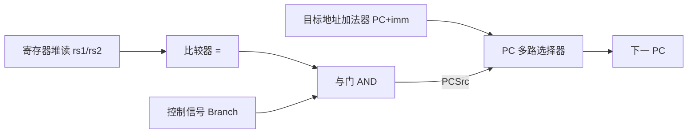

# 08 控制冒险

[本讲目录](../index.md) · [课程目录](../../index.md) · [上一节：07 结构冒险与数据冒险](07-structural-and-data-hazards.md)

> [!abstract] 本节要点
> - 指令地址流不再顺序（下一条 PC $\ne$ PC+4）时产生控制冒险，典型来源是条件分支 `beq`：分支条件和目标地址算出之前，流水线就必须决定取哪条指令。
> - 四类应对方法：停顿、把判定点尽量提前、推迟判定（需要编译器支持）、预测。控制冒险比数据冒险少见，但没有像转发之于数据冒险那样有效的手段。
> - 分支在 MEM 判定时需停顿 3 个周期；把目标地址计算与寄存器比较提前到 ID 后只需 1 个周期，代价是 ID 要增加目标地址加法器、比较器、与门、多路选择器以及转发硬件；流水线越深，停顿越多。
> - 分支预测准确率约 92%–94%，准确率每提高 1% 可带来 10% 以上的性能提升（原因与超标量、乱序执行有关，后续讲）。
> - ID 判定分支时：相隔 3 条（在 WB）靠寄存器堆“先写后读”解决；相隔 2 条（在 MEM）从 EX/MEM 转发到比较器（ForwardC/ForwardD）；紧邻的前一条（在 EX）必须停顿 1 周期——冻结 PC 与 IF/ID，并把进入 ID/EX 的控制位清零。

## 控制冒险（Control Hazard）

流水线每个周期都要取一条新指令，而取哪一条取决于 PC。顺序执行时下一条就是 PC+4，取指不必等待；遇到分支指令时，下一条指令的地址要等分支条件求值、目标地址算好之后才能确定，但流水线在此之前已经在取后续指令了。

**控制冒险**（control hazard）是指：在程序控制流的判定条件求值完成、新的 PC 目标地址算出之前，流水线就不得不对控制流作出决定而引起的冒险。[^s1p115] 它在指令地址流不顺序（即下一条指令的 PC $\ne$ PC+4）时出现，由改变控制流的指令引起，最典型的是条件分支 `beq`。[^s1p116]

在前面的五级流水线中，`beq` 的比较结果（ALU 的 Zero）在 EX 产生，PCSrc 选择在 MEM 完成，也就是说分支在**第 4 级（MEM）**才判定。如果 `beq` 之后的 `ld`、Inst 3、Inst 4 照常每周期取一条，它们取指时所依赖的“要不要跳转”还没算出来——在流水线图上，这表现为从 `beq` 的 MEM 级指向后续指令 IF 级的依赖箭头**逆着时间方向**，而逆时间的依赖就是冒险。[^s1p117] 冒险的总体分类见 [[06 流水线设计与性能]]，数据冒险的处理见 [[07 结构冒险与数据冒险]]。

应对控制冒险有四类方法：[^s1p116]

1. **停顿**（stall）：等分支结果出来再取下一条指令。最简单，但会增大 CPI。
2. **提前判定**：把判定点在流水线中尽可能前移，从而减少停顿周期数。
3. **推迟判定**（delay decision）：需要编译器支持。典型例子是后续课程要讲的**谓词执行**（predicated execution），思路是把“到底跳不跳”这件事尽量往后拖，与第 2 种“尽早决定”的思路正好相反。[^s2b13]
4. **预测**（predict）：先猜跳或不跳并按猜测继续执行，“希望一切顺利”；这是硬件中最常见的做法。

> [!tip] 课堂强调
> 对数据冒险，转发几乎可以消除大部分停顿；对控制冒险则没有这样有效的手段。好在控制冒险出现的频率比数据冒险低，所以总体代价尚可接受。[^s2b14]

## 分支停顿的周期数

最直接的“修复”是停顿：取到 `beq` 后不再取新指令，直到分支结果确定。[^s1p118]

**判定在 MEM 时**：设 `beq` 在周期 1 取指，则它在周期 2 处于 ID、周期 3 处于 EX、周期 4 处于 MEM，到周期 4 末才知道是否跳转以及目标地址，正确的下一条指令最早在周期 5 取指。周期 2、3、4 本该取的三条指令都只能是气泡，因此**每个分支停顿 3 个周期**。[^s2b14]

| 周期 | 1 | 2 | 3 | 4 | 5 | 6 |
|---|---|---|---|---|---|---|
| `beq` | IF | ID | EX | **MEM（判定）** | WB | |
| 下一条（`ld` 或目标） | | stall | stall | stall | IF | ID |

**判定在 ID 时**：`beq` 在周期 2 末就已判定，正确的下一条在周期 3 取指，只浪费周期 2 一个取指槽，即**停顿 1 个周期**。[^s1p119]

停顿会直接抬高 CPI：理想流水线 CPI 为 1，若每条分支都要停顿 $s$ 个周期、分支在指令中所占比例为 $f_{\rm br}$，则

$$
\text{CPI} = 1 + f_{\rm br}\times s
$$

> [!example] 例：判定点位置对 CPI 的影响
> 设程序中分支占 20%，其他冒险忽略，所有分支都停顿等待。
>
> 1. MEM 判定：$s=3$，$\text{CPI}=1+0.2\times3=1.6$。
> 2. ID 判定：$s=1$，$\text{CPI}=1+0.2\times1=1.2$。
> 3. 两者相比，判定提前到 ID 使执行时间降为原来的 $1.2/1.6=75\%$（假设时钟周期不变）。
>
> （20% 是为演示计算而设的假定值，不是课程给出的数据。）

## 把分支判定提前到 ID

停顿周期数等于“分支判定所在级数 − 1”，所以要减少停顿，就要把判定点前移。对 RISC-V 五级流水线，最早可以在 **ID 级**完成分支判定，从而把停顿（冲刷）周期从 3 减到 **1**。[^s1p119]

要在 ID 完成判定，需要把两件事搬进 ID：

1. **计算分支目标地址**：在 ID 增加一个加法器计算 PC + 立即数偏移。它只依赖 PC 和指令中的立即数，可以与寄存器堆读**并行**进行，不拉长 ID 的时间。
2. **比较两个寄存器**：比较器必须等寄存器堆读出 rs1、rs2 之后才能工作，无法并行。于是“比较并更新 PC”在 ID 的时序路径上串接了一个**比较器**、一个**与门**（Branch 控制信号与“相等”结果相与，产生 PCSrc）和一个**多路选择器**（在 PC+4 与分支目标之间选择下一 PC）。[^s1p119]



这样做的代价有三：

- **额外硬件**：加法器、比较器、与门、选择器都要在 ID 再放一份。[^s2b14]
- **ID 时序路径变长**：寄存器读 → 比较 → 与门 → 选择器串行，可能拉长时钟周期。
- **需要 ID 级的转发硬件**：原来比较在 EX 进行，可以复用 EX 的转发单元；现在比较的操作数在 ID 就要用，前面指令尚未写回的结果必须另行转发到 ID 的比较器（见下文）。[^s1p119]

> [!tip] 课堂强调
> 这里讨论的都是五级教学流水线。真实处理器的流水线约有 14 级（乘除法等指令更长），分支判定点会处在流水线更靠后的位置，停顿也就更多。[^s2b14]

单周期数据通路中的 PCSrc 选择器与分支数据通路见 [[04 单周期数据通路]]。

## 分支预测的准确率与影响

停顿和提前判定都只能减少、不能消除分支代价，因此硬件中最常用的是**分支预测**（branch prediction）：先预测跳不跳，按预测继续取指，猜错再纠正。

目前最新处理器的分支预测准确率约为 **92%–94%**。这看似已经很高，但仍需提升：预测命中率每提高 **1%**，CPU 整体性能可提升 **10% 以上**。[^s2b13]

> [!tip] 课堂强调
> 这与阿姆达尔定律的直觉相反——按阿姆达尔定律，优化一个小部分对整体影响通常有限；而分支预测只改进一点点，整体性能却提升很多。原因在于后续要讲的**超标量**（superscalar）和**乱序执行**（out-of-order execution）设计，这里暂不展开。[^s2b14]

## ID 级分支操作数的转发与停顿

把比较移到 ID 后，`beq` 的源操作数 rs1/rs2 可能由前面尚未写回的指令产生。按产生者与 `beq` 的距离分三种情况：

| 产生者位置（`beq` 在 ID 时） | 与 `beq` 相隔 | 处理方式 |
|---|---|---|
| WB | 前第 3 条 | 寄存器堆“前半周期写、后半周期读”，无需转发 |
| MEM | 前第 2 条 | 从 EX/MEM 转发到 ID 比较器（ForwardC / ForwardD） |
| EX | 紧邻前一条 | 停顿 1 周期，之后再从 EX/MEM 转发 |

### 相隔 3 条：寄存器堆先写后读

```asm
add x1, ...        # WB
add x3, ...        # MEM
add x4, ...        # EX
beq x1, x2, Loop   # ID
next_seq_instr     # IF
```

`add x1` 处于 WB，它在本周期前半写寄存器堆，`beq` 在后半读寄存器堆，读到的已经是新值。所以 MEM/WB 的“转发”由正常的寄存器堆先写后读操作自动完成。[^s1p120]

### 相隔 2 条：EX/MEM → ID 转发

```asm
add x3, ...        # WB
add x1, ...        # MEM
add x4, ...        # EX
beq x1, x2, Loop   # ID
next_seq_instr     # IF
```

`add x1` 处于 MEM，它的 ALU 结果已在 EX/MEM 流水线寄存器中，但要到下一周期 WB 才写入寄存器堆，`beq` 此刻从寄存器堆读到的是旧值。因此需要一条从 EX/MEM 到 ID 比较器输入的转发通路，把“前第二条指令”的结果送到比较器任一输入端。[^s1p120]

比较器两个输入各加一个选择器，由 **ForwardC**（对应 rs1）和 **ForwardD**（对应 rs2）控制：为 1 时选 EX/MEM 中的 ALU 结果，为 0 时选寄存器堆读出值。完整的检测条件为：

```c
if (IDcontrol.Branch
    && EX/MEM.RegWrite
    && (EX/MEM.RegisterRd != 0)
    && (EX/MEM.RegisterRd == IF/ID.RegisterRs1))
    ForwardC = 1;

if (IDcontrol.Branch
    && EX/MEM.RegWrite
    && (EX/MEM.RegisterRd != 0)
    && (EX/MEM.RegisterRd == IF/ID.RegisterRs2))
    ForwardD = 1;
```

各条件的含义与 EX 级转发相同：`IDcontrol.Branch` 表示 ID 中确实是分支指令；`EX/MEM.RegWrite` 表示 MEM 中的指令确实要写寄存器；`RegisterRd != 0` 排除写 `x0`（`x0` 恒为 0，不应转发）；最后一项判断目的寄存器与 `beq` 的源寄存器相同。[^s1p120]

> [!warning] 易错点
> 源材料中的 ForwardC/ForwardD 条件省略了 `EX/MEM.RegWrite`。缺少这一项时，MEM 中的 `sd`、`beq` 等不写寄存器的指令，若其指令字中 rd 字段位置恰好与 `beq` 的 rs1/rs2 相同，就会被误转发。完整条件必须包含 RegWrite 检查。[^s1p120]

### 紧邻前一条：必须停顿 1 周期

```asm
add x3, ...        # WB
add x4, ...        # MEM
add x1, ...        # EX
beq x1, x2, Loop   # ID
next_seq_instr     # IF
```

`add x1` 正在 EX 中计算，其结果要到本周期末才写入 EX/MEM；而 `beq` 的比较也在本周期的 ID 中进行（且要等后半周期读完寄存器堆才开始），两者同时发生，结果来不及送到比较器。因此必须在 `beq` 与 `add` 之间插入一个停顿。[^s1p121]

由 **ID 冒险检测单元**（ID Hazard Unit）完成以下操作：[^s1p121]

1. **原地保持 `beq` 和下一条指令**：撤销 PC.Write 和 IF/ID.Write，使 PC 不更新、IF/ID 不更新，ID 中的 `beq` 和 IF 中的 `next_seq_instr` 下一周期原样重做（“bounce in place”）。
2. **插入气泡**：把进入 ID/EX 流水线寄存器的控制位全部清零，使流入 EX 的是一条什么都不做的空操作，隔开 EX 中的 `add` 与 ID 中的 `beq`。

停顿一个周期后，`add x1` 进入 MEM，结果位于 EX/MEM，正好落入“相隔 2 条”的情况，由 ForwardC 转发给比较器。[^s2b14]

由上述规则，ID 冒险检测单元的停顿条件可写为：

```c
if (IDcontrol.Branch
    && ID/EX.RegWrite
    && (ID/EX.RegisterRd != 0)
    && ((ID/EX.RegisterRd == IF/ID.RegisterRs1)
     || (ID/EX.RegisterRd == IF/ID.RegisterRs2)))
    stall;   // PC.Write = 0, IF/ID.Write = 0, ID/EX 控制位清零
```

停顿的实现方式（冻结 PC 与 IF/ID、清零控制位注入气泡）与 load-use 冒险相同，见 [[07 结构冒险与数据冒险]]。

> [!note] 补充解释
> 若产生分支操作数的是 `ld` 而非 ALU 指令，数据要到 MEM 末才得到，代价更大：`ld` 紧邻 `beq` 时需停顿 2 个周期，`ld` 与 `beq` 隔一条时需停顿 1 个周期（之后从 MEM/WB 经寄存器堆读到）。这是按本节同样的时序推理得出的结论，源材料未单独讨论。

> [!question]- 自测：五级流水线中，分支在 MEM 判定、程序中分支占 25%，若都改为在 ID 判定，CPI 从多少变为多少（忽略其他冒险，时钟周期不变）？
> 从 1.75 变为 1.25。MEM 判定每个分支停顿 3 周期：$1+0.25\times3=1.75$；ID 判定只停顿 1 周期：$1+0.25\times1=1.25$。

> [!question]- 自测：分支在 ID 判定。指令序列为 `add x5,x6,x7`、`sub x8,x9,x10`、`beq x5,x8,L`，`beq` 需要停顿吗？各操作数如何取得？
> 需要停顿 1 周期。`sub x8` 紧邻 `beq`，`beq` 在 ID 时 `sub` 在 EX，结果来不及，ID 冒险单元冻结 PC 与 IF/ID 并把 ID/EX 控制位清零。停顿后 `sub` 在 MEM，x8 由 ForwardD 从 EX/MEM 转发；`add` 此时在 WB，x5 由寄存器堆先写后读得到，ForwardC = 0。

> [!question]- 自测：`beq` 在 ID，MEM 中是一条 `sd x1, 0(x2)`，其指令字 rd 字段位置的值恰好等于 `beq` 的 rs1。若按源材料的简化条件（无 RegWrite）检测，会发生什么？
> 会错误地置 ForwardC = 1，把 EX/MEM 中 `sd` 的地址计算结果送入比较器，导致分支判断错误。`sd` 不写寄存器，EX/MEM.RegWrite = 0，加入该条件即可避免。

> [!info]- 来源
> - L03.pdf：PDF p.115–121
> - L03.docx：DOCX body 529–611

[^s1p115]: L03.pdf-PDF p.115
[^s1p116]: L03.pdf-PDF p.116
[^s1p117]: L03.pdf-PDF p.117
[^s2b13]: L03.docx-DOCX body 529-575
[^s2b14]: L03.docx-DOCX body 576-611
[^s1p118]: L03.pdf-PDF p.118
[^s1p119]: L03.pdf-PDF p.119
[^s1p120]: L03.pdf-PDF p.120
[^s1p121]: L03.pdf-PDF p.121

[本讲目录](../index.md) · [课程目录](../../index.md) · [上一节：07 结构冒险与数据冒险](07-structural-and-data-hazards.md)
