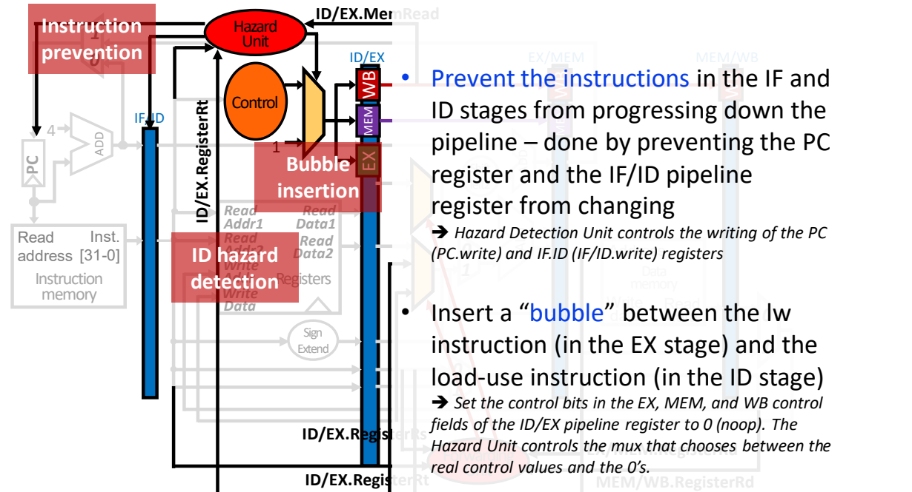

# 07 冒险检测与处理

[本讲目录](../index.md) · [课程目录](../../index.md) · [上一节：06 流水线组织与性能](section-6.md)

## 三类冒险

冒险（hazard）使下一条指令无法在预定周期安全推进。流水控制必须先检测冲突，再选择转发、暂停或其他处理。以下均以按序、单发射、ID读寄存器、WB写寄存器的五级流水为模型。[^s2b12]

| 类型 | 冲突原因 | 典型例子 |
|---|---|---|
| 结构冒险 | 同时争用同一资源 | IF取指与MEM访存共用单端口存储器 |
| 数据冒险 | 消费者所需结果尚未到达可用位置 | add后紧接读取其rd的sub |
| 控制冒险 | 下一PC取决于尚未完成的分支判断 | beq尚未确定是否跳转 |

分离指令和数据存储器可消除这里的IF/MEM资源冲突。寄存器堆以不同读写端口并在前半周期写、后半周期读，支持WB和ID同时工作，也使同周期读者获得已写入结果。[^s1p91][^s1p92][^s1p93][^s1p95]

## 真依赖与名字依赖

设I在程序顺序中先于J，三种寄存器依赖如下：[^s1p97]

| 名称 | 程序关系 | 出错情形 | 依赖性质 |
|---|---|---|---|
| RAW，写后读 | I写，J读同一寄存器 | J取得I之前的旧值 | 真数据依赖 |
| WAR，读后写 | I读，J写同一寄存器 | J先覆盖I应读的旧值 | 反依赖、名字依赖 |
| WAW，写后写 | I写，J也写同一寄存器 | I较晚完成而覆盖J的新结果 | 输出依赖、名字依赖 |

RAW表示程序要求先写、后读（read after write），消费者需要生产者的实际数据。WAR/WAW来自复用同一寄存器名字，可以通过寄存器重命名消除相应约束。[^s2b12]

在此按序五级模型中，各指令的ID按程序顺序进行，WB也按程序顺序进行；较老指令的ID必定早于较年轻指令的WB，因此不会出现WAR或WAW冒险。RAW仍可能发生，因为较年轻指令的ID可能早于较老指令的WB。[^s1p97]

## 结果何时可用

`add x1,x2,x3` 的结果在EX结束时就已产生，但到WB才写寄存器堆。`lw x1,4(x2)` 在EX只算地址，真正加载数据在MEM结束时才产生。[^s1p98][^s1p99][^s1p101][^s1p102]

如果只从寄存器堆取值，紧接的消费者在生产者WB前读到旧值，需停顿到可正确读出为止；本模型前半写后半读时，相邻指令通常等2周期。停顿增加CPI。[^s1p100]

转发（forwarding），又称旁路（bypassing），从保存结果的流水寄存器直接送到消费者，不必等WB。ALU输入因此新增MUX，转发单元比较源目标寄存器号并选择数据。[^s1p103][^s1p109]

例如：

```asm
add x1, x2, x3
sub x4, x1, x5
and x6, x1, x7
```

add在第3周期EX算出值。第4周期sub的EX可从EX/MEM取该值；第5周期and的EX可从MEM/WB取同一值。流水状态正常向后移动，转发位置也随结果移动。[^s1p104]

## 转发条件与最新结果优先

ALU源输入的基本选择编码为：

| 选择值 | 数据来源 |
|---|---|
| 00 | ID/EX中的读寄存器值 |
| 10 | EX/MEM中的已就绪结果 |
| 01 | MEM/WB中将要回写的值 |

ForwardA控制rs1输入，ForwardB控制rs2对应输入。有效生产者匹配必须满足：指令有效、确实写寄存器、rd不为x0，且rd等于消费者实际使用的源。选择转发还要求该结果已就绪；EX/MEM中的load保存地址，尚无加载结果。[^s1p105][^s1p106]

若两个阶段同时命中，EX/MEM中的生产者在程序顺序中较新，必须优先。考虑所有x1–x4初值均为1：[^s1p107]

```asm
add x1, x1, x2    # x1应变为2
add x1, x1, x3    # x1应变为3
add x1, x1, x4    # x1应变为4
```

第三条在EX时，第一条的旧结果2在MEM/WB，第二条的新结果3在EX/MEM。若转发2就错误得到3；转发3才得到4。[^s1p108][^s2b13]

**补充解释**：对某个实际源寄存器 `src`，完整选择逻辑应区分“较新生产者命中”和“较新结果已就绪”：

```text
new_match = EX/MEM.valid and EX/MEM.RegWrite
            and EX/MEM.rd != 0
            and EX/MEM.rd == src

old_match = MEM/WB.valid and MEM/WB.RegWrite
            and MEM/WB.rd != 0
            and MEM/WB.rd == src

if new_match:
    if EX/MEM.result_ready:
        select EX/MEM
    else:
        wait until the newest result is available
else if old_match:
    select MEM/WB.writeback_value
else:
    select ID/EX.read_value
```

`valid`表示该流水位置有有效指令；用清零副作用控制位表示气泡时，也可通过对应控制位排除气泡。新生产者匹配会屏蔽旧WB值，即使新结果尚未就绪。此时要按消费者的使用阶段等待或使用适用的专用旁路。

## Load-use为何仍需停顿

紧接load的ALU消费者需要一个停顿周期，即使已经有转发：[^s1p102][^s1p110]

```asm
lw  x1, 4(x2)
sub x4, x1, x5
```

| 周期 | lw | sub |
|---|---|---|
| 3 | EX算地址 | ID读寄存器 |
| 4 | MEM读数据，周期末才就绪 | 仍留ID；EX插入气泡 |
| 5 | WB，数据可从MEM/WB转发 | EX使用新数据 |

若不暂停，sub在第4周期EX需要输入，而load到第4周期末才提供数据，转发不能倒退时间。暂停1周期后，时序才满足。[^s1p102]

ID中的冒险检测器检查EX是否为有效load，且其非零rd是否与ID指令下一周期EX真正需要的源匹配。[^s1p111]

**补充解释**：普通EX消费者的检测可以写成：

```text
load_use = ID/EX.valid and IF/ID.valid
           and ID/EX.MemRead and ID/EX.rd != 0
           and (
             (IF/ID.uses_rs1_in_EX and ID/EX.rd == IF/ID.rs1)
             or
             (IF/ID.uses_rs2_in_EX and ID/EX.rd == IF/ID.rs2)
           )
```

`uses_rs*` 来自真实指令语义，避免把立即数字段误认为源寄存器；ID阶段的分支消费者另有更早的数据需求。

## 停顿与气泡的实现

检测到load-use后，并非把整条流水线都冻结：[^s1p112][^s1p113]

1. 关闭PC写使能，使IF保持在当前位置。
2. 关闭IF/ID写使能，使消费者继续留在ID。
3. 将送入ID/EX的EX、MEM、WB控制字段置0，插入一个没有寄存器或存储器写入副作用的气泡（bubble）。
4. 已在EX及更后方的旧指令继续推进，load才能完成访存并使数据就绪。

清零的是新进入ID/EX的**控制位**，架构寄存器与其他流水数据保持原有值。气泡随后向下游传播；消费者在可安全执行时恢复推进。[^s1p113]



## Load到store的专用旁路

store的基址在EX用于计算地址，写入数据则直到MEM才被使用。因此“load之后紧接store”要区分两种依赖。[^s1p114]

```asm
ld x1, 4(x2)
sd x1, 4(x3)    # x1仅用作写入的数据
```

load第4周期MEM结束取得x1，store第4周期EX计算x3+4并不需要x1；第5周期store在MEM才要写数据，此时load值已在MEM/WB。增加MEM/WB到数据存储器写数据输入的MUX和旁路控制，可以免去这个数据依赖导致的停顿。[^s1p114]

旁路控制需确认当前为store、WB指令有效且有非零写目标、目标与store数据源匹配，转发的是回写值。冒险检测也需识别该数据在MEM才使用。免停顿结论以这条专用旁路存在为条件。[^s1p114]

若指令改为 `sd x4,4(x1)`，x1是基址，紧接load时第4周期EX就要用，仍属于普通load-use，需等1周期。写数据旁路不能解决地址计算的提前需求。

## 控制冒险与分支策略

条件分支需要比较结果及目标地址，才能确定下一PC。在决策产生之前，等待会降低吞吐；猜测则可能取到错误路径。[^s1p115][^s1p117]

| 策略 | 做法 | 代价 |
|---|---|---|
| 等待 | 暂停后续取指直到决策可用 | 每次等待增加CPI |
| 提前决策 | 把目标计算和比较移到更早阶段 | 增加电路及时序压力 |
| 编译器参与 | 延迟决策或组织可提前执行的工作 | 需要对应ISA/编译支持 |
| 预测 | 预测方向或目标，先沿预测路径执行 | 错误时要清除错误路径并重新取指 |

谓词执行通过条件决定操作是否生效，可减少部分分支。RISC-V基本分支没有架构延迟槽。[^s1p116][^s2b13] [RISC-V基本整数规范](https://docs.riscv.org/reference/isa/v20260120/unpriv/rv32.html)

**课堂强调**：分支预测对深流水、超标量和乱序执行的性能很重要。准确率改善带来的收益，取决于程序中的分支频率与误预测代价。[^s2b13][^s2b14]

## 把分支判断提前到ID

在MEM才确定分支的示意实现中，后续取指等待3周期；把目标计算和比较移到ID，可将无额外数据依赖时的等待缩为1周期。[^s1p118][^s1p119]

目标地址可与寄存器读并行计算，比较则必须等操作数读出之后进行。新增比较器、MUX及控制逻辑会延长ID路径，还需要为ID比较提供旁路。[^s1p119]

| 生产者位置 | ID分支取得值的方法 |
|---|---|
| WB | 前半写寄存器，后半ID读，使用已更新值 |
| MEM中的ALU生产者 | 从EX/MEM转发已就绪结果到ID比较器 |
| 紧邻分支、仍在EX的ALU生产者 | 结果到EX末才产生，本周期ID比较来不及，需停顿1周期 |

ID旁路同样按最新有效生产者选择，检查写使能、非零rd、源匹配与结果就绪。MEM中的load在当前周期末才产生读出数据，EX/MEM内仍是地址，尚不能供当前ID比较使用。[^s1p120]

**补充解释**：按上述阶段时序、前半写后半读且不采用同周期MEM到ID旁路的模型，若load紧邻ID决策的分支，分支需等待2周期：先等load完成EX，再等MEM结束；到load的WB周期，ID才能读到新值。若load已在MEM，则再等1周期。较旧的WB值即使同名，也不能代替这条load的结果。

对紧邻的ALU依赖，冻结PC和IF/ID、向ID/EX插气泡；下一周期生产者进入MEM，其结果已在EX/MEM，分支仍留在ID，这时才能比较。[^s1p121]

```asm
add x1, x2, x3
beq x1, x4, Loop
```

普通ALU旁路能让后续EX在下一周期消费结果；ID决策却要在add执行EX的同一周期比较，结果还未就绪，故需暂停。[^s2b14]

## 自测问答

**问**：较新的EX/MEM中load写x1，较旧的MEM/WB中add也写x1；消费者要x1，能否选旧add的已就绪值？

**答**：不能。语义要求最新load结果，应等待它到消费者所需位置；不能用旧值或load地址替代。

**问**：`ld x1,4(x2); sd x1,4(x3)` 为什么有时无需停顿，而 `sd x4,4(x1)` 要停？

**答**：前者在MEM才需要x1，可用MEM/WB到写数据端旁路；后者在EX算地址就需要x1，load数据尚未就绪。

**问**：load-use停顿时若同时冻结EX/MEM，会有什么问题？

**答**：生产者不能继续完成访存，等待的数据也不会就绪。应冻结前端并插气泡，让较老指令推进。

来源：[^s1p91] [^s1p92] [^s1p93] [^s1p94] [^s1p95] [^s1p96] [^s1p97] [^s1p98] [^s1p99] [^s1p100] [^s1p101] [^s1p102] [^s1p103] [^s1p104] [^s1p105] [^s1p106] [^s1p107] [^s1p108] [^s1p109] [^s1p110] [^s1p111] [^s1p112] [^s1p113] [^s1p114] [^s1p115] [^s1p116] [^s1p117] [^s1p118] [^s1p119] [^s1p120] [^s1p121] [^s2b12] [^s2b13] [^s2b14]

[^s1p91]: L03.pdf-PDF p.91
[^s1p92]: L03.pdf-PDF p.92
[^s1p93]: L03.pdf-PDF p.93
[^s1p94]: L03.pdf-PDF p.94
[^s1p95]: L03.pdf-PDF p.95
[^s1p96]: L03.pdf-PDF p.96
[^s1p97]: L03.pdf-PDF p.97
[^s1p98]: L03.pdf-PDF p.98
[^s1p99]: L03.pdf-PDF p.99
[^s1p100]: L03.pdf-PDF p.100
[^s1p101]: L03.pdf-PDF p.101
[^s1p102]: L03.pdf-PDF p.102
[^s1p103]: L03.pdf-PDF p.103
[^s1p104]: L03.pdf-PDF p.104
[^s1p105]: L03.pdf-PDF p.105
[^s1p106]: L03.pdf-PDF p.106
[^s1p107]: L03.pdf-PDF p.107
[^s1p108]: L03.pdf-PDF p.108
[^s1p109]: L03.pdf-PDF p.109
[^s1p110]: L03.pdf-PDF p.110
[^s1p111]: L03.pdf-PDF p.111
[^s1p112]: L03.pdf-PDF p.112
[^s1p113]: L03.pdf-PDF p.113
[^s1p114]: L03.pdf-PDF p.114
[^s1p115]: L03.pdf-PDF p.115
[^s1p116]: L03.pdf-PDF p.116
[^s1p117]: L03.pdf-PDF p.117
[^s1p118]: L03.pdf-PDF p.118
[^s1p119]: L03.pdf-PDF p.119
[^s1p120]: L03.pdf-PDF p.120
[^s1p121]: L03.pdf-PDF p.121
[^s2b12]: L03.docx-DOCX body 485-528
[^s2b13]: L03.docx-DOCX body 529-575
[^s2b14]: L03.docx-DOCX body 576-611


[本讲目录](../index.md) · [课程目录](../../index.md) · [上一节：06 流水线组织与性能](section-6.md)
