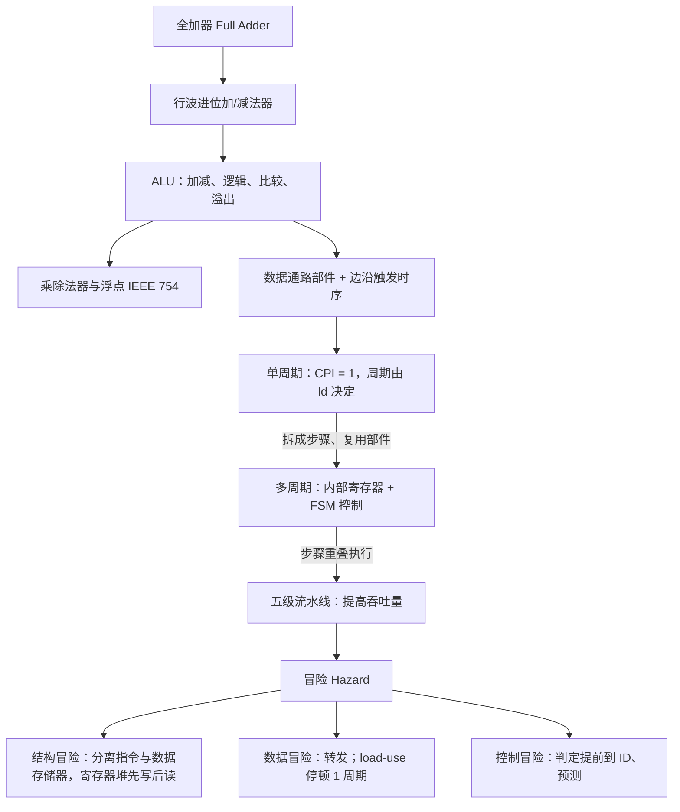

# L03 RISC-V ALU与基础架构

[课程目录](../index.md)

本讲回答“一条 RISC-V 指令在硬件上究竟怎样被执行”。路线是先从补码与全加器搭出能做加减、溢出判断和移位的 ALU，再扩展到乘除法器与 IEEE 754 浮点；然后认识数据通路部件与边沿触发时序，依次搭建单周期、多周期和五级流水线处理器；最后分析流水线中的结构、数据、控制三类冒险，以及停顿、转发、提前判定等解决办法。阅读前需要掌握 L02 的 RISC-V 指令格式（R/I/S/SB）与 CPI、性能铁律，以及数字逻辑中的门电路、多路选择器和寄存器。

## 章节导航

- [01 ALU与整数加减](chapters/01-alu-and-integer-addition.md)：ALU功能、补码、加减法器、溢出检测与移位
- [02 乘除法与浮点数](chapters/02-multiplication-division-and-floating-point.md)：乘除法硬件、乘除指令与IEEE 754浮点
- [03 数据通路部件与时钟](chapters/03-datapath-elements-and-clocking.md)：数据通路部件、控制信号与边沿触发时序
- [04 单周期数据通路](chapters/04-single-cycle-datapath.md)：单周期数据通路搭建、控制表与优缺点
- [05 多周期数据通路](chapters/05-multicycle-datapath.md)：多周期拆步、复用部件、内部寄存器与FSM
- [06 流水线设计与性能](chapters/06-pipeline-design-and-performance.md)：流水线设计原则、加速比与深度极限
- [07 结构冒险与数据冒险](chapters/07-structural-and-data-hazards.md)：结构冒险、RAW停顿与转发、load-use气泡
- [08 控制冒险](chapters/08-control-hazards.md)：控制冒险对策、分支提前到ID及其转发停顿

## 本讲小结

### 概念主线

### 三种处理器实现对比

| 维度 | 单周期 | 多周期 | 五级流水线 |
|---|---|---|---|
| CPI | 恒为 1 | 3–5（分支 3、R 型/store 4、load 5） | 理想为 1，冒险停顿会使其上升 |
| 时钟周期 | 最慢指令（ld）的整条路径 | 最慢的一步，但慢于单周期的 1/5 | 最慢的一级 + 锁存开销 |
| 部件 | IM/DM 分离，ALU + 两个加法器 | 单一存储器、单一 ALU | 像单周期一样复制部件 |
| 中间状态 | 无 | IR、MDR、A、B、ALUOut | 流水线寄存器 IF/ID、ID/EX、EX/MEM、MEM/WB |
| 控制 | opcode 组合译码（控制表） | 有限状态机 | ID 产生，按 EX/MEM/WB 分组随指令传递 |

### 核心公式

| 内容 | 公式 / 规则 | 所在章节 |
|---|---|---|
| 全加器 | $S=A\oplus B\oplus C_{\mathrm{in}}$，$C_{\mathrm{out}}=AB+AC_{\mathrm{in}}+BC_{\mathrm{in}}$ | [01 ALU与整数加减](chapters/01-alu-and-integer-addition.md) |
| 补码减法 | $A-B=A+\overline{B}+1$（control 同时接异或门与 $c_0$） | [01 ALU与整数加减](chapters/01-alu-and-integer-addition.md) |
| 有符号溢出 | $O=c_{n-1}\oplus c_n$，$O=1$ 表示溢出 | [01 ALU与整数加减](chapters/01-alu-and-integer-addition.md) |
| IEEE 754 | $(-1)^s\times(1+F)\times2^{E-B}$，偏置 $B$：单精度 127、双精度 1023 | [02 乘除法与浮点数](chapters/02-multiplication-division-and-floating-point.md) |
| 单周期时序 | $T_{\rm cycle}\ge T_{\rm clk\_q}+T_{\rm max\_comb}+T_s$ | [03 数据通路部件与时钟](chapters/03-datapath-elements-and-clocking.md) |
| 分支目标 | $\mathrm{PC}+(\operatorname{sext}(\mathrm{imm})\ll1)$，$\mathrm{PCSrc}=\mathrm{Branch}\land\mathrm{zero}$ | [04 单周期数据通路](chapters/04-single-cycle-datapath.md) |
| 流水线周期数 | $k$ 级执行 $n$ 条指令：$k+(n-1)$ 个周期 | [06 流水线设计与性能](chapters/06-pipeline-design-and-performance.md) |
| 流水线加速比 | $T_{\rm single}/T_{\rm pipe}$，理想值 = 级数（例：$4.1/1.2\approx3.42$） | [06 流水线设计与性能](chapters/06-pipeline-design-and-performance.md) |
| 转发条件 | $\mathrm{RegWrite}\land(\mathrm{Rd}\ne0)\land(\mathrm{Rd}=\mathrm{Rs})$；EX/MEM → 10 优先，MEM/WB → 01 | [07 结构冒险与数据冒险](chapters/07-structural-and-data-hazards.md) |
| 分支停顿 | MEM 判定 3 周期，ID 判定 1 周期 | [08 控制冒险](chapters/08-control-hazards.md) |

## 不确定事项

- 03 的 PC 端口位宽沿用部件图标注的 32 位，RV64 实际 PC 为 64 位；未改动原图标注
- 05 示例 FSM 与信号编码来自 MIPS 版教材，RISC-V 严格实现需保留旧 PC 计算分支目标，笔记中仅以补充说明指出
- 07 存储器到存储器复制的 DM 转发条件与 08 中 ld 作为分支操作数的停顿周期为按时序推理的补充，源材料未给出

> [!info]- 来源
> - L03.pdf：PDF p.3–13, 15–21, 23–45, 47, 49–51, 54–86, 88–121, 124–142
> - L03.docx：DOCX body 1–611
