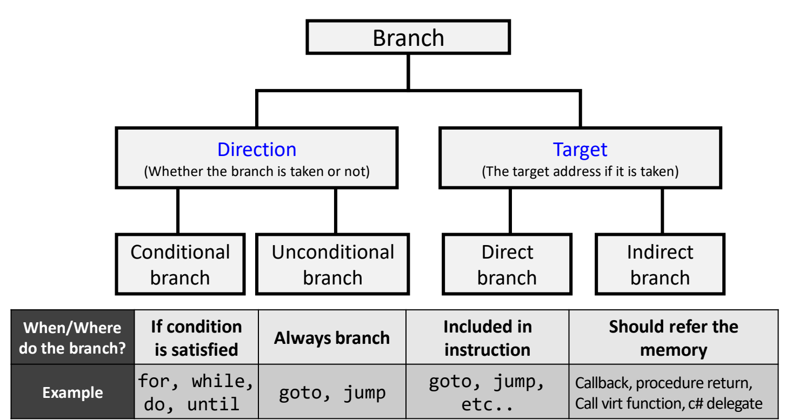
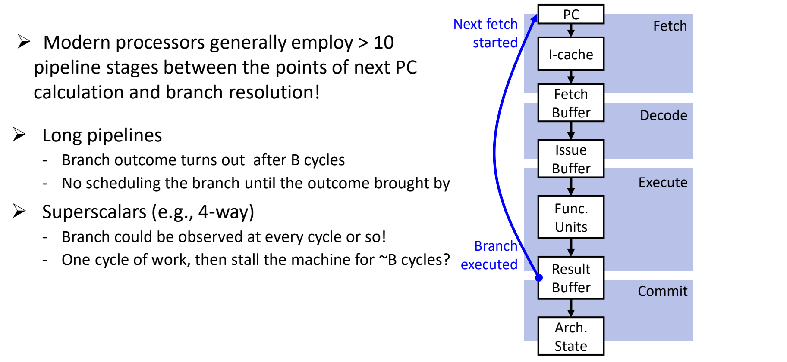

# 01 分支预测的动机

[本讲目录](../index.md) · [课程目录](../../index.md) · [下一节：02 静态分支预测](02-static-branch-prediction.md)

> [!abstract] 本节要点
> - 处理一条分支要回答两个问题：**方向**（跳不跳）和**目标**（跳到哪）。按方向分条件/无条件分支，按目标分直接/间接分支。
> - 直接分支的目标 = PC + 指令内立即数，取指时就能算出；间接分支的目标来自运行时的寄存器值（再加偏移），只看指令算不出来。
> - 分支非常频繁：SPEC2006 INT（Core i7，x86）平均 9.4% 的指令是分支，约每 10–11 条一条；SPEC2006 FP（ARM Cortex-A9）平均 12.15%，约每 8 条一条。
> - 长流水线要等 $B$ 个周期才知道分支结果（现代处理器从算 next PC 到分支判定通常超过 10 级；x86 有 14–16 级，误预测约损失 10 个周期）。4–12 路超标量几乎每个周期都会遇到分支，所以停顿等结果不可行。
> - 分支有规律可循（循环、相关分支），因此可以预测。真正需要预测的只有两处：条件分支的**方向**，以及间接跳转和函数返回的**目标**。推测执行要靠三项硬件支持：分支预测器、乱序执行加 ROB、误预测后撤销并重新取指。

## 分支的方向与目标（Direction & Target）

控制冒险的四种基本对策在上一讲已经讲过，见 L03《08 控制冒险》：停顿（stall）、把比较提前到 ID 级判定、用编译器推迟分支判定（延迟分支或谓词执行）、分支预测。本讲专门讨论最后一种。要预测分支，先得搞清楚处理一条分支时到底有哪些未知量。

一条分支指令有两个独立的未知量：[^s2p3]

- **分支方向**（branch direction）：这条分支跳不跳，即 taken 还是 not taken。
- **分支目标**（branch target）：如果跳，跳到哪个地址。

从这两个角度出发，分支可以分成两组类别：

| 分类角度 | 类别 | 何时 / 何处跳转 | 对应的源代码构造 |
| --- | --- | --- | --- |
| 方向 | **条件分支**（conditional branch） | 条件满足才跳，否则顺序执行下一条 | `for`、`while`、`do`、`until` |
| 方向 | **无条件分支**（unconditional branch） | 总是跳 | `goto`、`jump` |
| 目标 | **直接分支**（direct branch） | 目标地址包含在指令中 | `goto`、`jump` 等 |
| 目标 | **间接分支**（indirect branch） | 目标不在指令中，要到指令之外（寄存器或存储器）去取 | 回调（callback）、过程返回（procedure return）、虚函数调用、C# delegate |



图：分支按方向（条件/无条件）与目标（直接/间接）分类，下表给出各类的判定时机与源代码例子。

两种目标类型的计算方式不同：

- **直接分支**：指令里明确写出了跳转位置，目标地址为
  $$
  \text{Target} = PC + \text{imm}
  $$
  其中 $PC$ 是分支指令自身的地址，$\text{imm}$ 是指令编码里的立即数（偏移）。这个地址编译器在编译时就知道，硬件取指后也能直接算出来。
- **间接分支**：目标地址不是"PC + 立即数"，而是"某个寄存器里的值 + 一个立即数偏移"。寄存器的值只有运行时才知道，所以光看指令本身算不出目标。

> [!warning] 易错点
> 方向和目标是两个相互独立的分类维度，一条分支同时属于其中一类方向和其中一类目标。例如函数返回是无条件的（方向已知），但它是间接的（目标未知）；`beq` 这类条件分支方向未知，但目标是 PC 相对的直接目标。不要把"无条件"等同于"容易处理"。

## 分支的频率与控制流代价（Control Flow Penalty）

如果分支很少出现，或者每次只损失一两个周期，花大量硬件去预测就不划算。下面的统计数据和流水线结构说明，这两个前提在现代处理器里都不成立。

### 分支极其频繁

在 Blem 等人 [HPCA 2013] 的测量中，动态执行的指令里分支所占比例如下：[^s2p4]

| SPEC2006 INT（Core i7，x86 ISA） | 总指令数 | 分支 % |
| --- | --- | --- |
| astar | $5.71\times10^{10}$ | 6.9 |
| bzip2 | $4.25\times10^{10}$ | 11.1 |
| hmmer | $2.57\times10^{10}$ | 5.3 |
| gcc | $6.29\times10^{9}$ | 15.1 |
| gobmk | $8.93\times10^{10}$ | 12.1 |
| h264 | $1.09\times10^{11}$ | 7.1 |
| libquantum | $4.18\times10^{8}$ | 13.2 |
| omnetpp | $2.55\times10^{9}$ | 16.4 |
| perlbench | $2.91\times10^{9}$ | 17.3 |
| sjeng | $2.11\times10^{10}$ | 14.8 |
| **平均** | | **9.4** |

| SPEC2006 FP（ARM Cortex-A9，ARMv7 ISA） | 总指令数 | 分支 % |
| --- | --- | --- |
| bwaves | $3.84\times10^{11}$ | 13.5 |
| cactusADM | $1.02\times10^{10}$ | 0.5 |
| leslie3D | $4.92\times10^{10}$ | 6.2 |
| milc | $1.38\times10^{10}$ | 6.5 |
| tonto | $1.30\times10^{10}$ | 10.0 |
| **平均** | | **12.15** |

由此得到两个经验值：整数程序约**每 10–11 条指令**有一条分支（$1/0.094\approx10.6$），浮点程序约**每 8 条**有一条（$1/0.1215\approx8.2$）。只要程序执行一定数量的指令，就一定会频繁遇到分支。

### 长流水线：结果要等 B 个周期

回顾五级流水线：如果在 ID 级就能判定分支，一条分支只引入 **1 个周期**的停顿（见 L03《08 控制冒险》）。深流水线中这个代价会大得多。



图：从计算下一个 PC 到分支执行之间隔着取指、译码、执行等多级缓冲，分支结果要经过约 $B$ 个周期才返回。

这条流水线骨架是：PC → I-cache → Fetch Buffer（取指）→ Issue Buffer（译码）→ Func. Units（执行）→ Result Buffer → Arch. State（提交）。分支要到执行完成（Branch executed）才知道结果，然后才能回到 PC 开始下一次取指（Next fetch started）。这条蓝色回路跨越的级数，就是分支的判定延迟。

- **长流水线**：分支结果要在 $B$ 个周期之后才出来；结果出来之前，无法确定后续该取哪些指令。[^s2p5]
- **现代处理器**：从计算 next PC 到分支判定（branch resolution）之间通常有**超过 10 级**流水线。[^s2p5]
- **x86 的量级**：常见 x86 处理器有 14–16 级流水线，在执行结束后才知道分支的真实结果。若预测错误，之前取进来的错误路径指令要全部冲刷（flush），一次误预测通常损失约 **10 个周期**。[^s3b1]

### 超标量：几乎每个周期都碰到分支

**超标量**（superscalar）处理器同时运行多条流水线，常见为 4–12 路，即每周期可以处理 4 到 12 条指令（结构细节见[超标量处理器](06-superscalar-processors.md)）。结合上面的频率：整数程序约每 10–11 条一条分支，浮点程序约每 8 条一条。处理器每周期取、发射十几条指令时，**几乎每个周期都会遇到一条分支**。[^s2p5]

如果遇到分支就停下来等结果，机器的运行模式会变成"干一个周期的活，然后停约 $B$ 个周期"，大部分时间都浪费在等待上。所以对现代处理器来说，"停顿等结果"根本不可行。[^s3b2]

> [!example] 例：4 路超标量遇到分支就停顿
> 设整数程序每 10 条指令一条分支，处理器每周期取 4 条指令，分支判定延迟 $B=10$ 周期，遇到分支就停顿直到结果出来。
>
> 1. 两条分支之间平均有 10 条指令，取完它们大约需要 $10/4=2.5$ 个周期。
> 2. 之后要停顿约 $B=10$ 个周期等结果，所以每 $2.5+10=12.5$ 个周期只完成 10 条指令。
> 3. 有效吞吐约为 $10/12.5=0.8$ 条/周期，只有峰值 4 条/周期的 20%。即使把 $B$ 降到 1，吞吐也只有 $10/3.5\approx2.9$ 条/周期。

## 分支的可预测性（Predictability）

只看汇编代码，分支的走向似乎很难猜。但分支来自源代码里的循环和判断，这些结构本身有规律，所以可以利用规律去预测，而不必停顿等待。[^s2p6]

**Program A（循环分支）**：

```c
for (i=0; i<100; i++)
{
    …
}
```

```asm
    addi r10, r0, 100
    addi r1,  r0, r0      ; 意图是 r1 = 0（源码写作 r0, r0）
L1:
    …
    addi r1,  r1, 1
    bne  r1,  r10, L1     ; 在 i < 100 期间一直跳回 L1
    …
```

循环末尾的 `bne` 在 $i<100$ 期间每次都跳回 `L1`，只有最后一次不跳。这条分支的模式是"连续 taken，最后一次 not taken"，非常规律。

**Program B（相关分支）**：

```c
if (aa == 2)
    aa = 0;
if (bb == 2)
    bb = 0;
if (aa != bb)
    …
```

```asm
    addi r2,  r0, 2
    bne  r10, r2, L_bb    ; aa != 2 时跳过清零
    xor  r10, r10, r10    ; aa = 0
L_bb:
    bne  r11, r2, L_xx    ; bb != 2 时跳过清零
    xor  r11, r11, r11    ; bb = 0
L_xx:
    beq  r10, r11, L_exit ; aa == bb 时跳出（不执行 if 体）
    …
L_exit:
```

这里 `aa` 在 `r10`，`bb` 在 `r11`。若前两条 `bne` 都**不跳**，说明 `aa == 2` 且 `bb == 2`，两个变量都被清零，于是 `aa == bb`，第三条 `beq` 一定跳。所以第三条分支的结果取决于前两条分支的结果，只要知道前两条怎么走，就能预测第三条。

这两个例子对应传统分支预测最常见的两种思路：

1. **根据这条分支自己过去的行为来预测**：适用于循环这类重复模式，例如 1 位、2 位预测器，见[动态分支预测](03-dynamic-branch-prediction.md)。
2. **利用不同分支之间的相关性**：用之前若干条分支的结果来预测当前分支，例如两级相关预测，同样见[动态分支预测](03-dynamic-branch-prediction.md)。

## 方向预测与目标预测的需求

分支有两个未知量，但并不是每类分支的两个未知量都需要预测。按情形逐一检查，就能把"分支预测"缩小成两个明确的设计目标。[^s2p7]

| 情形 | 方向（Direction） | 目标（Target） |
| --- | --- | --- |
| 直接跳转、函数调用 | 已知（总是 taken） | 容易计算（指令中给出） |
| 条件分支（通常是 PC 相对） | **难以预测** | 容易计算（$PC+\text{imm}$） |
| 间接跳转、函数返回 | 已知（总是 taken） | **难以确定** |

逐行理解：

1. **直接跳转与函数调用**：一定跳，目标直接写在指令里，取到指令就知道往哪跳，不需要预测。
2. **条件分支**（如 `beq`、`bne`）：跳不跳取决于运行时两个寄存器值的比较结果，方向难以预知；目标是 PC 加指令立即数，编译器都能算出来。
3. **间接跳转与函数返回**：一定跳，但目标是"寄存器值 + 偏移"，要等寄存器值可用才知道，目标难以确定。

由此得出两个设计目标：

- **方向预测器**（direction predictor）：负责预测条件分支跳不跳，静态方法见[静态分支预测](02-static-branch-prediction.md)，动态方法见[动态分支预测](03-dynamic-branch-prediction.md)。
- **目标预测器**（target predictor）：负责预测间接跳转和函数返回的目标地址，见[分支目标预测](04-branch-target-prediction.md)。

> [!note] 补充解释
> "条件分支的目标容易计算"指的是硬件拿到指令后能算出目标，并不等于取指当拍就能得到目标：取指时还没译码，要在同一周期给出下一个取指地址，仍需要借助目标缓存，见[分支目标预测](04-branch-target-prediction.md)。本表回答的是"哪个信息本质上未知"，目标预测器的主攻对象是间接跳转和函数返回。

## 基于分支预测的推测执行（Speculation）

在五级流水线里，预测的作用只是减少分支带来的停顿。在现代乱序处理器里，预测是整套执行方式的起点：处理器先按预测的路径大量取指、执行，事后再验证。这就是**推测执行**（speculative execution）。它需要三项体系结构支持：[^s2p8]

1. **支持 ❶：预测未来的执行流**。由**分支预测器**（branch predictor）同时预测方向和目标，提前把将来要执行的指令取进处理器，填入指令缓冲。缓冲里积攒了足够多的指令，后面才能从中找出彼此无依赖的指令并行执行。
2. **支持 ❷：以乱序（O3，out-of-order）方式执行预测路径上的指令**。依赖**重排序缓冲**（ROB，Re-Order Buffer）来处理乱序带来的问题，ROB 的工作方式见后续课程。
3. **支持 ❸：从误预测中恢复**。一旦发现分支预测错误，就撤销（UNDO）错误路径上已执行的指令，把它们全部冲刷掉，再从正确路径重新开始取指。


这三件事是目前所有乱序执行的 x86 处理器（以及苹果处理器）都具备的基本机制。[^s3b2]

**Intel Skylake 中的位置**：在 Intel Skylake（2016 年前后的处理器）的微架构中，分支预测器位于前端（Frontend）的起始处，紧挨 L1 指令缓存，旁边是取指与预译码（Instruction Fetch & PreDecode）、指令队列和 4 路译码器。它不断把预测路径上的指令（经 μOP Cache 或译码器转成 μOP）送进分配队列（Allocation Queue）。后面的执行引擎（Execution Engine）由 Reorder buffer 和 Scheduler 对这些 μOP 进行乱序调度，再分派给 ALU、Load/Store 等执行单元。前端（预测与取指）对应支持 ❶，ROB 与调度器对应支持 ❷。[^s2p8]

> [!tip] 课堂强调
> Spectre（幽灵）、Meltdown（熔断）等安全漏洞都源自"基于分支预测的推测执行"这一基本范式：处理器在预测路径上提前执行了不该执行的指令。这些攻击是怎么产生的，后续课程会专门介绍。[^s3b2]

> [!question]- 自测：给出下面四种构造，各自的方向和目标哪个需要预测？(a) `for` 循环末尾的回跳 (b) `goto` (c) C++ 虚函数调用 (d) 函数返回
> (a) 条件、直接分支：需要预测方向，目标是 $PC+\text{imm}$，容易计算。(b) 无条件、直接分支：方向和目标都已知，无需预测。(c) 无条件、间接分支：方向已知，目标来自寄存器（对象的函数指针），需要预测目标。(d) 无条件、间接分支：方向已知，返回地址在寄存器中，需要预测目标。

> [!question]- 自测：Program B 中，若已知前两条 `bne` 都没有跳转，第三条 `beq r10, r11, L_exit` 怎么走？若第一条跳了而第二条没跳呢？
> 前两条都没跳，说明 `aa == 2` 且 `bb == 2`，两者都被清零，`aa == bb`，所以 `beq` 一定跳（taken）。若第一条跳了而第二条没跳，`aa` 保持原值且不等于 2，`bb` 被清零为 0，此时结果取决于 `aa` 是否为 0，只靠这两条分支的历史不能完全确定。可见相关性能把部分情况变成确定性预测，但不是所有情况。

> [!question]- 自测：某处理器从算 next PC 到分支判定共 12 级，每条分支在判定后才能取正确路径的指令。若改为分支预测，预测正确与预测错误分别损失多少个周期？
> 预测正确时，取指不必等分支结果，几乎没有损失；预测错误时，要冲刷判定点之前已进入流水线的错误路径指令，从正确路径重新取指，损失约等于这段距离，即约 12 个周期（x86 的典型值约 10 个周期）。所以误预测代价随流水线深度增长，预测准确率越高越好。

> [!info]- 来源
> - L04.pdf：PDF p.3–8
> - L04.docx：DOCX body 1–89

[^s2p3]: L04.pdf-PDF p.3
[^s2p4]: L04.pdf-PDF p.4
[^s2p5]: L04.pdf-PDF p.5
[^s3b1]: L04.docx-DOCX body 1-63
[^s3b2]: L04.docx-DOCX body 64-89
[^s2p6]: L04.pdf-PDF p.6
[^s2p7]: L04.pdf-PDF p.7
[^s2p8]: L04.pdf-PDF p.8

[本讲目录](../index.md) · [课程目录](../../index.md) · [下一节：02 静态分支预测](02-static-branch-prediction.md)
