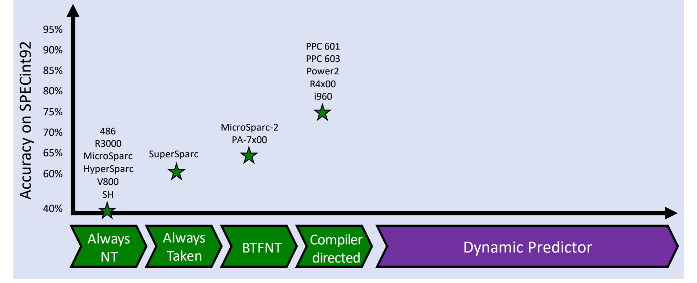

# 02 静态分支预测

[本讲目录](../index.md) · [课程目录](../../index.md) · [上一节：01 分支预测的动机](01-why-branch-prediction.md) · [下一节：03 动态分支预测](03-dynamic-branch-prediction.md)

> [!abstract] 本节要点
> - 方向预测器分为静态（编译时决定）和动态（运行时决定）两大类；历史上静态方法在前，在 SPECint92 上的准确率依次为：总不跳 30–40%、总跳 60–70%、BTFNT 约 65%、编译器引导约 75%，75% 大致就是静态方法的上限。
> - Predict not taken 继续顺序取指，真正跳转时才冲刷分支之后的指令：分支逻辑在 MEM 冲刷 3 条，在 EX 冲刷 2 条，在 ID 冲刷 1 条。被冲刷的指令必须还没改动机器状态，五级流水线天然满足这一点。
> - 停顿有两种实现：插入气泡（bubble）时，较早阶段的指令原地保持，在某一级把流水线寄存器的控制位清零；冲刷（squash）把流水线中已有的指令替换成 noop，也就是把某一级之前各级的控制信号清零。
> - Predict taken 的准确率更高，但目标地址要计算，即使把分支目标硬件移到 ID，也总要多停 1 个周期，这引出了缓存目标地址的 BTB。
> - BTFNT 让向后跳（目标地址小于 PC）的分支预测为跳转，向前跳的预测为不跳转，专门照顾循环；编译器引导先用测试数据剖析各分支的典型方向，再重新编译设置预测位；程序员也可以用 likely/unlikely 手工标注。

## 方向预测的发展脉络

条件分支的方向（taken / not taken）只有执行到比较那一步才知道，所以需要一个**方向预测器**（branch direction predictor）先给出猜测。为什么条件分支需要方向预测，见[分支预测的动机](01-why-branch-prediction.md)。

方向预测器的演进可以画成一张图[^s2p9]：

- **X 轴**：方向预测算法的类型，按出现时间排列，左边是静态预测器，右边是动态预测器；
- **Y 轴**：该预测器在 SPECint92（SPEC 1992 整数基准测试）上的预测准确率。

Y 轴最低刻度取 40%，不从 0% 开始。原因是准确率为 0% 的预测器其实是完美的：它每次都猜错，把它的输出取反，就每次都猜对。所以对两种结果的预测来说，真正最差的是 50% 左右的随机猜测，准确率越接近 0 或 1，预测器包含的信息越多。

整张图的趋势是：早期处理器用静态预测，现代处理器基本都用动态预测。本节讲左半部分的四种静态方法，右半部分见[动态分支预测](03-dynamic-branch-prediction.md)。

## 静态预测（Static Direction Prediction）

早期芯片的晶体管资源很紧张，能用软件解决的问题尽量不用硬件。**静态预测**（static prediction）就是这一思路的产物。

**静态预测**指在编译时就确定每个分支的预测方向，运行时硬件不再根据执行情况调整[^s2p10]。它的统一做法是：先假定分支取某个结果，按这个假定继续执行，不等分支的实际结果出来；猜错了再把错误路径上的指令清掉。早期处理器采用它，是因为它简单、硬件开销低。



图：四种静态方法在 SPECint92 上的准确率依次上升，编译器引导约 75%，右侧留给动态预测器。

| 方法 | 预测规则 | SPECint92 准确率 | 代表处理器 |
| --- | --- | --- | --- |
| 总预测不跳转（Always Not Taken） | 一律不跳，顺序取指 | 30–40% | 486、R3000、MicroSparc、HyperSparc、V800、SH |
| 总预测跳转（Always Taken） | 一律跳转 | 60–70% | SuperSparc |
| BTFNT | 向后跳则跳，向前跳则不跳 | 约 65%[^s3b4] | MicroSparc-2、PA-7x00 |
| 编译器引导（Compiler Directed） | 按剖析统计结果设置预测位 | 约 75% | PPC 601、PPC 603、Power2、R4x00、i960 |

## 总预测不跳转（Predict Not Taken）

最省事的做法是当分支不存在：**总预测不跳转**（predict not taken / always not taken）指总是预测分支不跳转，继续从顺序指令流取指，只有分支真正跳转时流水线才会停顿[^s2p11]。它几乎不需要改动现有硬件，因为流水线本来就在每个周期取 $PC+4$。

分支实际跳转时，处理过程如下：

1. **冲刷**：把分支之后已经进入流水线的指令冲刷掉。这些指令在代码中位于分支之后，在流水线中位于分支前面的阶段。
2. **确认未改状态**：确保被冲刷的指令没有改变机器状态。
3. **重启**：从分支目标地址重新开始取指。

### 冲刷几条：取决于分支逻辑放在哪一级

分支在哪一级得出结果，它前面各级就各有一条错误路径上的指令，这些都要冲刷[^s2p11]：

| 分支逻辑所在阶段 | 需冲刷的阶段 | 停顿（冲刷）条数 |
| --- | --- | --- |
| MEM | IF、ID、EX | 3 |
| EX | IF、ID | 2 |
| ID | IF | 1 |

分支判定越早，猜错的代价越小。把分支判定提前到 ID 的硬件改动，见 L03《08 控制冒险》。

### 被冲刷的指令不能已经改了状态

冲刷之所以安全，是因为被冲刷的指令还没来得及改变机器状态。机器状态有两类：

- **寄存器状态**：错误路径上的指令如果已经写了寄存器，结果就被污染了；
- **存储器状态**：错误路径上的 store 如果已经写进内存，同样无法撤回。

在五级流水线中这一条件**自动满足**：改变机器状态的操作都在流水线尾部，MEM 级的 MemWrite 和 WB 级的 RegWrite[^s2p11]。分支最晚在 MEM 级判定，此时它后面的指令最多走到 EX，还没到写内存或写寄存器的那一级，清零它们的控制信号即可。

> [!tip] 课堂强调
> 五级流水线不用为此操心，但放到现代复杂的处理器里，被冲刷的指令不能自动保证没有改动状态，需要额外考虑；这一问题在后续课程中讨论。[^s3b3]

### 准确率为什么只有 30–40%

总预测不跳转的准确率只有 30–40%[^s2p12]。原因在于循环：一个执行 100 次的循环，循环分支有 99 次跳转，只有 1 次顺序往下走，总预测不跳转在这类分支上几乎总是猜错。程序中最常见的分支恰好是循环分支，所以整体准确率很低。

> [!warning] 易错点
> 不要把冲刷条数和准确率混为一谈：冲刷条数（1/2/3）是**每次猜错**的代价，由分支逻辑所在阶段决定；30–40% 是**猜对的比例**，由程序的分支行为决定。平均代价要把两者结合起来看。

## 两类停顿：气泡与冲刷

预测失败和 load-use 冒险都会让流水线停下，但两者在硬件上的做法不同[^s2p13]。

**气泡**（bubble，又称插入 noop）是在流水线中两条指令之间插入一条 noop，load-use 冒险就是这样处理的（见 L03 中 load-use 停顿的内容）：

1. **冻结较早阶段**：让流水线中位置靠前（代码中靠后）的指令停留一个周期，不往下走，即用写控制信号把它们“bounce”在原地（不更新 PC 和对应的流水线寄存器）；
2. **在合适的阶段插入 noop**：把该阶段流水线寄存器中的控制位清零，这一级就变成一条什么都不做的指令；
3. **放行较晚阶段**：流水线中位置靠后（代码中靠前）的指令照常往下执行。

插入 noop 的位置不限于 IF，可以根据需要选在任意一级。

**冲刷**（flush，又称指令作废 instruction squashing）是把流水线中**已经存在**的某条指令替换成 noop。做法是把某一级之前所有各级的控制信号全部清零，这些指令就失效了。

| | 气泡（bubble） | 冲刷（squash） |
| --- | --- | --- |
| 对现有指令的处理 | 较早阶段的指令原地保留，稍后继续执行 | 指令被替换为 noop，不再执行 |
| noop 从哪来 | 在两条指令之间**插入**新的 noop | 原有指令**变成** noop |
| 控制信号操作 | 清零某一级流水线寄存器的控制位，冻结它前面的级 | 清零某一级之前各级的控制信号 |
| 典型场景 | load-use 冒险 | 分支预测错误 |


## 总预测跳转（Predict Taken）

总预测不跳转在循环分支上几乎总是错，自然会想到反过来猜。**总预测跳转**（predict taken / always taken）指总是预测分支跳转，准确率提高到 60–70%[^s2p14]，恰好与总不跳转的 30–40% 互补。代表处理器是 SuperSparc[^s2p15]。

它的问题在于：要往目标处取指，就必须先知道目标地址，而条件分支的目标是 $PC$ 加指令中的立即数偏移，需要计算。即使已经把分支目标计算硬件移到 ID 级，取到分支时目标地址也还没有算出来，只能等 ID 算完再从目标处取指。因此 **predict taken 总要付出 1 个周期的停顿**，猜对时也一样[^s2p14]。

这就引出一个问题：能不能把分支目标指令的地址“缓存”起来，在取指时直接拿到？答案是分支目标缓冲，见[分支目标预测](04-branch-target-prediction.md)。

> [!warning] 易错点
> predict not taken 猜对时零代价，猜错时冲刷 1–3 条；predict taken 准确率更高，但**无论对错**都至少有 1 个周期的停顿（目标地址在 ID 才算出）。准确率高不等于代价一定小。

## BTFNT（Backward Taken, Forward Not Taken）

总跳转和总不跳转对所有分支一视同仁。其实分支的跳转方向就能透露它是不是循环分支。

**BTFNT**（Backward Taken, Forward Not Taken，向后跳则预测跳转、向前跳则预测不跳转）指：目标地址小于当前 PC 的分支，即偏移量为负、向后跳的分支，预测为跳转；目标地址大于 PC、向前跳的分支，预测为不跳转。换句话说，总是选地址较小的那条路（always take the smaller address）[^s2p16]。

判断依据是分支目标地址 $=PC+\text{立即数偏移}$：

1. 偏移为负，即向后跳：通常是循环末尾跳回循环开头的分支，大多数时候都跳，预测 taken；
2. 偏移为正，即向前跳：通常是跳过某段代码（如退出循环、if 分支），预测 not taken。

循环的汇编一般是：执行完循环体后检查条件，条件满足就向后跳回循环开头，不满足就顺序往下走。所以 BTFNT 是专门为 for/while 循环设计的，而循环分支正是程序中最常见的分支。

它的局限是对不规则分支效果差：循环以外的分支，方向和跳转是向前还是向后关系不大[^s2p16]。BTFNT 的准确率约 65%，比 Always Taken 略好，代表处理器为 MicroSparc-2 和 PA-7x00。

## 编译器引导预测（Compiler Directed）

前三种方法都只看分支指令本身，不了解程序实际怎么运行。如果事先跑一遍程序，就能知道每个分支实际倾向于哪个方向。

**编译器引导预测**（compiler-directed prediction）使用称为**剖析**（profiling）或**反馈导向编译**（feedback-directed compilation）的技术[^s2p17]：

1. **初次编译**程序；
2. **用测试数据运行**，统计每个分支的典型方向，即跳转与不跳转的比例；
3. **重新编译**：根据统计结果调整每条分支指令的预测位，大概率跳转的标为预测跳转，大概率不跳的标为预测不跳转。

这样就利用了先前执行的历史结果，针对具体分支做了定点优化。准确率约 75%[^s2p17]，代表处理器有 PPC 601、PPC 603、Power2、R4x00 和 i960。

### 程序员标注：likely / unlikely

另一种静态手段不靠编译器自动剖析，而是**程序员**直接在源代码中给分支标注 likely（可能成立）或 unlikely（不太可能成立），编译器再根据这些提示做优化。Linux 内核源代码中有大量这类标注。这种方法的准确率无法统一评价，取决于程序员的判断是否准确。

> [!note] 补充解释
> 在 Linux 内核中，这类标注写作 `likely(x)` / `unlikely(x)` 宏，基于 GCC 的 `__builtin_expect`。例如：
> ```c
> if (unlikely(ptr == NULL))
>     return -ENOMEM;
> ```
> 编译器据此把大概率执行的路径排成顺序执行的代码。参见 [GCC 文档：`__builtin_expect`](https://gcc.gnu.org/onlinedocs/gcc/Other-Builtins.html)。

总体来看，静态预测的上限大约就是 75%。要进一步提高准确率，就要让 CPU 在运行时根据实际结果学习，即动态预测，见[动态分支预测](03-dynamic-branch-prediction.md)。

## 附录：分支停顿能否为 0，分支在哪一级完成

> [!info] 依据讲义整理
> 以下两个问题出自附录（Justification 页），课上未讲解，按讲义内容整理。

**问题一：分支和跳转指令的停顿能否降到 0？**[^s2p103]

按本课程五级流水线的 IF 设计，答案是**不能**。在本课的数据通路中，下一条 PC 的来源（$PC+4$ 或分支目标）由 PCSrc 多路选择器决定，分支目标和比较结果要从后面的流水线寄存器（如 EX/MEM）送回，先写入 PC 寄存器，下一个周期才能用来访问指令存储器（IM），所以至少有一个周期的损失。

助教（TA）的补充说明：如果像其他一些设计（例如 ICS 课程中的 pipe 处理器）那样，把 EX/MEM 寄存器中的结果通过多路选择器直接送给指令存储器，不再经过别的寄存器，就能少一个周期[^s2p103]。

**问题二：分支和跳转指令在哪一级完成？**[^s2p104]

L03 中有两种说法：第 57 页的多周期阶段划分写的是在 Exec 阶段完成（Branch Comparison; Branch and Jump Completion）；第 118 页的流水线图中，`beq` 在 MEM 级（DM 处）才决定下一条取指地址，后面跟了 3 个 stall。答案是：**两种都对，甚至 Decode（ID）级也对**。分支在哪一级完成，取决于分支比较逻辑和 PC 更新逻辑放在哪一级。这也正是上面冲刷条数表随分支逻辑位置变化的原因。

> [!question]- 自测：五级流水线采用 predict not taken，分支逻辑在 EX 级。某段代码执行了 100 次分支，其中 70 次实际跳转。由于预测失败共浪费多少个周期？若把分支逻辑移到 ID 呢？
> 分支逻辑在 EX 级时浪费 140 个周期，移到 ID 级后浪费 70 个周期。predict not taken 只在实际跳转时出错，共错 70 次。分支逻辑在 EX 级时每次冲刷 IF、ID 两条指令，共 $70\times2=140$ 个周期；在 ID 级时每次只冲刷 IF 一条，共 $70\times1=70$ 个周期。

> [!question]- 自测：用 BTFNT 预测下面两条分支：(a) 地址 `0x400` 处的 `bne`，目标为 `0x3E0`；(b) 地址 `0x500` 处的 `beq`，目标为 `0x520`。哪条更可能是循环分支？
> (a) 目标地址小于 PC，偏移为负，是向后跳，预测 taken，很可能是循环末尾跳回开头的分支；(b) 目标地址大于 PC，是向前跳，预测 not taken，更像跳过一段代码的条件判断。

> [!question]- 自测：load-use 冒险和分支预测失败都会产生一个“空周期”，为什么前者用插入气泡，后者用冲刷？
> 发生 load-use 冒险时，后面那条使用数据的指令是正确的，只是需要晚一拍执行，所以把它冻结在原地，在中间插入一个 noop，之后它继续执行。预测失败时，已取进来的指令本身就是错误路径上的指令，不能再执行，所以把它们的控制信号清零，变成 noop，也就是冲刷。

> [!info]- 来源
> - L04.pdf：PDF p.9–17, 103–104
> - L04.docx：DOCX body 64–147

[^s2p9]: L04.pdf-PDF p.9
[^s2p10]: L04.pdf-PDF p.10
[^s3b4]: L04.docx-DOCX body 118-147
[^s2p11]: L04.pdf-PDF p.11
[^s3b3]: L04.docx-DOCX body 90-117
[^s2p12]: L04.pdf-PDF p.12
[^s2p13]: L04.pdf-PDF p.13
[^s2p14]: L04.pdf-PDF p.14
[^s2p15]: L04.pdf-PDF p.15
[^s2p16]: L04.pdf-PDF p.16
[^s2p17]: L04.pdf-PDF p.17
[^s2p103]: L04.pdf-PDF p.103
[^s2p104]: L04.pdf-PDF p.104

[本讲目录](../index.md) · [课程目录](../../index.md) · [上一节：01 分支预测的动机](01-why-branch-prediction.md) · [下一节：03 动态分支预测](03-dynamic-branch-prediction.md)
