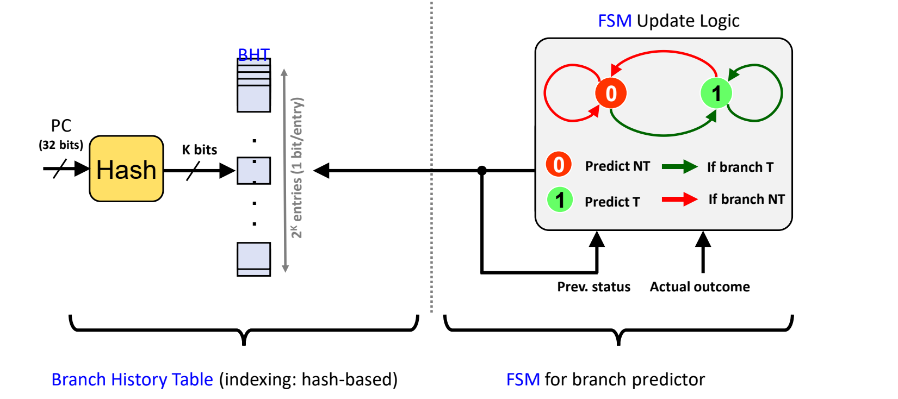
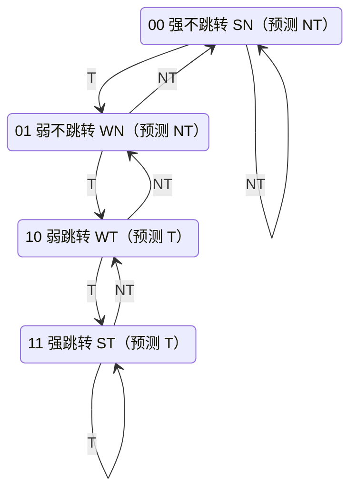
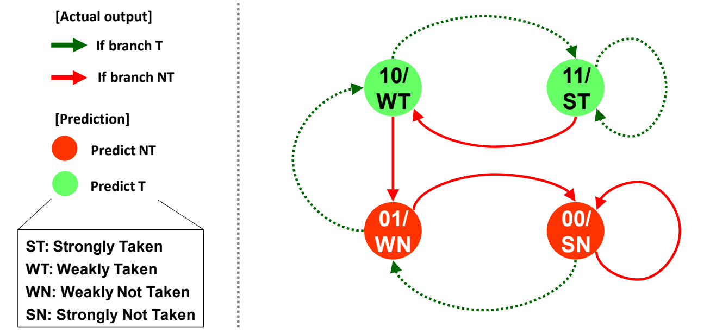
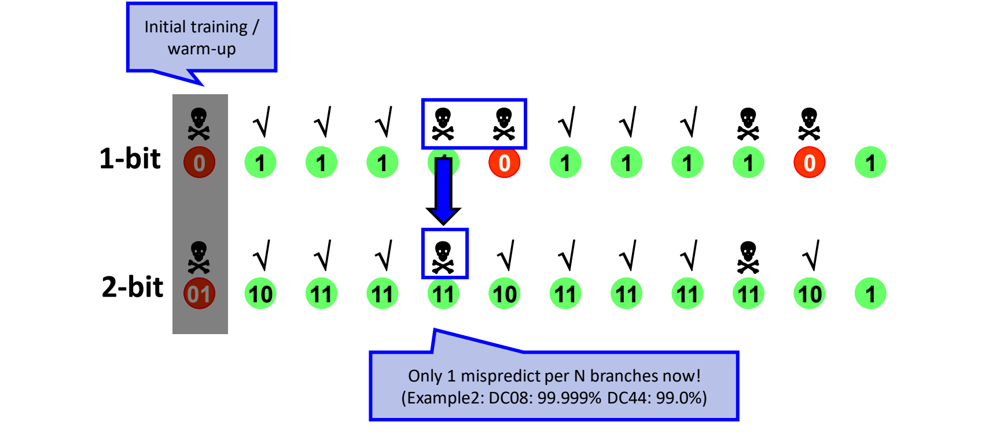
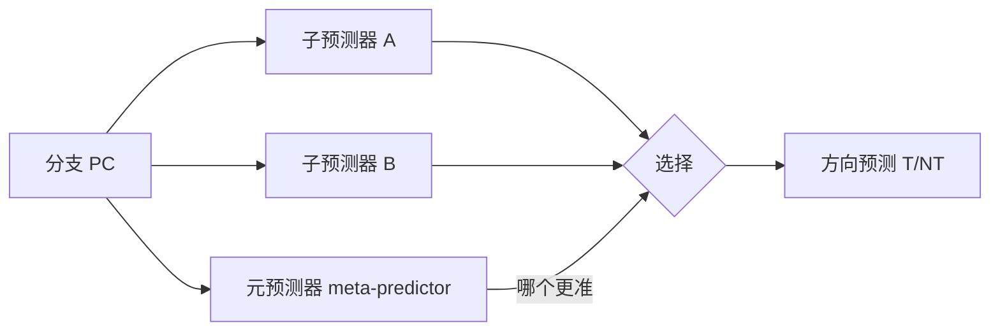
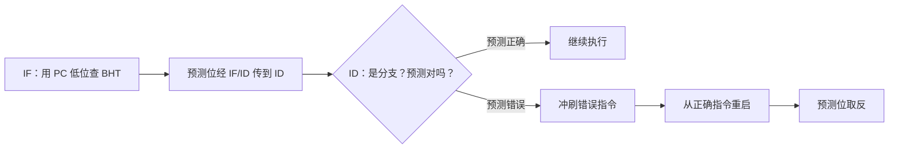
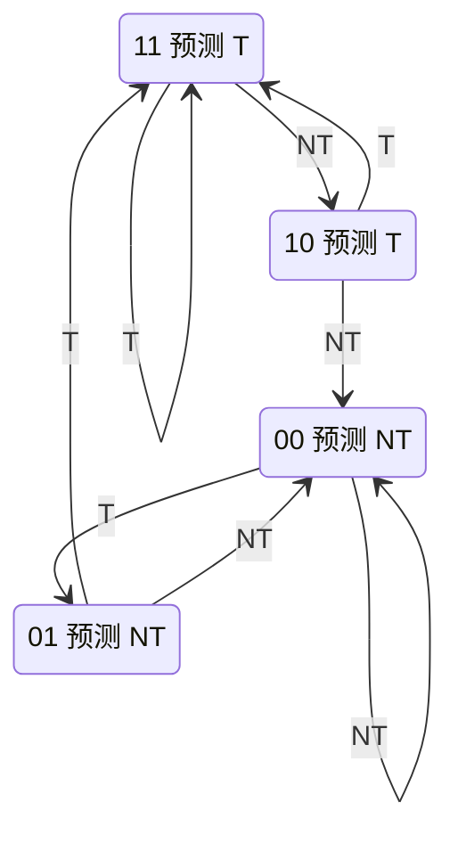

# 03 动态分支预测

[本讲目录](../index.md) · [课程目录](../../index.md) · [上一节：02 静态分支预测](02-static-branch-prediction.md) · [下一节：04 分支目标预测](04-branch-target-prediction.md)

> [!abstract] 本节要点
> - 动态预测在运行时记录每个分支的实际方向，预测错了就更新记录；静态预测对同一条分支每次都给出相同的预测。
> - 1 位 BHT：32 位 PC 经哈希得到 $K$ 位索引，表有 $2^K$ 项，每项 1 位（0 预测 NT，1 预测 T）；预测错就翻转该位。SPECint92 上准确率约 80%。别名冲突只影响准确率，不影响正确性。
> - 稳定模式中出现一次异常，1 位预测器要错两次：循环每执行一轮（T T T T NT），进入时错一次、退出时错一次，准确率 $3/5=60\%$。
> - 2 位饱和计数器有四个状态：00 SN、01 WN、10 WT、11 ST；MSB 是方向位，LSB 是迟滞位。同一个循环预热后每轮只错 1 次，准确率 $4/5=80\%$。最好情况约 90%。
> - 两级（相关）预测同时用 BHT 和 PHT，利用“分支结果与之前的结果相关”，最好约 96%；锦标赛预测用元预测器挑选当下更准的子预测器，最好约 97%（Alpha 21264）。

## 动态方向预测（Dynamic Direction Prediction）

静态预测（见[静态分支预测](02-static-branch-prediction.md)）对同一条分支，无论第几次遇到都给出同一个预测，所以准确率在 SPECint92 上停在约 75%（编译器引导）。要再提高，就得用运行时信息。

**动态方向预测**（dynamic direction prediction）指处理器在运行时记录每条分支过去的实际行为，并据此预测下一次的方向：先预测，等方向判定后拿实际结果反馈，预测错了就调整，从错误中学习，让预测贴合每一条分支各自的行为。[^s2p18] 方向与目标两类预测需求的划分见[分支预测的动机](01-why-branch-prediction.md)；本节只讲方向（T/NT），目标地址的预测见[分支目标预测](04-branch-target-prediction.md)。

四代动态预测器在 SPECint92 上的准确率依次提高，下面逐一展开：

| 预测器 | 每个分支记录的信息 | 最好准确率（SPECint92） | 代表处理器 |
| --- | --- | --- | --- |
| 1 位历史（1-bit history） | 上一次方向，1 位 | 约 80% | 21064、21066、AMD K5、R8000 |
| 2 位历史（2-bit history） | 2 位饱和计数器 | 约 90% | 21064A、21164、Pentium 等 |
| 两级（two level） | 历史模式 + 模式历史表 | 约 96% | Pentium6 |
| 混合 / 锦标赛（hybrid / tournament） | 多个预测器 + 元预测器 | 约 97% | Alpha 21264 |

## 1 位分支历史表（Branch History Table, BHT）

最直接的想法是“上次怎么走，这次就怎么走”。为此需要一张表，给每条分支记下它上一次的方向。

**分支历史表**（Branch History Table, BHT）是一张按分支 PC 索引的表。在 1 位方案中每项只有 1 位，记录该分支上一次的方向：项为 0 预测不跳转（NT），项为 1 预测跳转（T）。它让处理器随时间改进预测，SPECint92 上准确率约 80%。[^s2p19]

括号中是各处理器 BHT 的表项数：21064（2K）、21066（2K）、AMD K5（1K）、R8000（1K）。在同一类预测器中，表项越多，不同分支挤进同一项的机会越少，命中率越高；1K 项的处理器一般比 2K 项的命中率低。[^s2p19]

### 为什么要哈希索引

分支数量太多，不可能每条分支独占一项。SPEC2006 中一个程序动态执行约 $10^9$ 到 $10^{10}$ 条指令，其中约 10% 是分支，也就是约 $10^8$ 次分支执行，硬件无法为它们逐一保存历史。[^s3b4] PC 有 32 位，硬件也不可能做一张覆盖 $2^{32}$ 个地址的表。

于是 BHT 的索引方式如下：

1. **哈希**：把 32 位 PC 送入哈希函数，得到 $K$ 位索引。
2. **查表**：BHT 共 $2^K$ 项（例如 $K=10,11,12$ 对应 1024、2048、4096 项），每项 1 位，用索引读出该项作为预测。[^s2p20]
3. **冲突处理**：两条分支哈希到同一项时不做任何避免，后写的直接覆盖先写的。这样做硬件很简单，代价只是准确率下降。

> [!warning] 易错点
> BHT 中没有 tag，读出的位可能是另一条分支留下的。这种别名（aliasing）只会让预测变差，不会让程序出错：方向判定后，错误路径上的指令会被冲刷。不要把它和需要 tag 比较的 BTB（见[分支目标预测](04-branch-target-prediction.md)）混为一谈。

### 用有限状态机更新 BHT

BHT 旁边配一个**有限状态机**（Finite State Machine, FSM）更新逻辑，负责在分支方向判定后改写表项：

- **输入**：表项中的原状态（prev. status）和这次的实际结果（actual outcome，T 或 NT）；
- **输出**：写回 BHT 的新状态。

1 位预测器的 FSM 只有两个状态（NT 和 T）：

| 原状态（预测） | 实际 T | 实际 NT |
| --- | --- | --- |
| 0（预测 NT） | 预测错，翻转为 1 | 预测对，保持 0 |
| 1（预测 T） | 预测对，保持 1 | 预测错，翻转为 0 |

规则可以概括为一句话：**预测对则不变，预测错则翻转**，新状态就等于这次的实际结果。[^s2p21] 下图右半部分中，绿色箭头表示分支实际 T，红色箭头表示实际 NT；红色 0 预测 NT，绿色 1 预测 T。



图：32 位 PC 经哈希得到 $K$ 位索引访问 $2^K$ 项、每项 1 位的 BHT；分支判定后由 FSM 根据原状态与实际结果更新表项。

## 1 位预测器的循环例子

1 位方案的弱点在循环上最明显：循环分支几乎总是跳，只在退出时不跳一次，但这一次“例外”会让预测器错两次。

> [!example] 例 1：用 1 位 BHT 预测短循环分支
> 循环尾部的分支是 `bne r1, r10, L1`，代码如下：
>
> ```asm
>     addi r10, r0, 5      # 循环上界
>     addi r1, r1, r0      # 循环变量初始化（讲义原文如此）
> L1: ...
>     addi r1, r1, 1       # r1 自增
>     bne  r1, r10, L1     # r1 != r10 则跳回 L1
>     ...
> ```
>
> 这个循环每执行一轮，该分支的实际结果是 T T T T NT（前 4 次跳回，第 5 次退出），整段循环被反复执行。BHT 中该项初值为 0。求准确率。
>
> 逐次推演（预测值 → 实际 → 新状态）：
>
> | 次序 | 1 | 2 | 3 | 4 | 5 | 6 | 7 | 8 | 9 | 10 | 11 |
> | --- | --- | --- | --- | --- | --- | --- | --- | --- | --- | --- | --- |
> | 预测 | 0 | 1 | 1 | 1 | 1 | 0 | 1 | 1 | 1 | 1 | 0 |
> | 实际 | T | T | T | T | NT | T | T | T | T | NT | T |
> | 对错 | ✗ | ✓ | ✓ | ✓ | ✗ | ✗ | ✓ | ✓ | ✓ | ✗ | ✗ |
>
> 1. 第一轮第 1 次：初值 0 预测 NT，实际 T，错，翻转为 1。
> 2. 第 2 到 4 次：预测 T，实际 T，全对。
> 3. 第 5 次（退出）：预测 T，实际 NT，错，翻转为 0。
> 4. 再次执行这段循环，第 6 次（进入）：上一次结果是 NT，预测 NT，实际 T，又错，翻转为 1。
> 5. 此后每一轮都重复“进入错 1 次、中间对 3 次、退出错 1 次”，所以每轮 5 次只对 3 次，准确率 $3/5 = 60\%$。[^s2p22]

> [!warning] 易错点
> 讲义上的 C 代码写作 `for (i=1; i<5; i++)`，按字面只循环 4 次。但同页的结果序列和下一页的文字都是“5 次迭代、跳 4 次再不跳 1 次”。[^s2p23] 计算时以结果序列 T T T T NT 为准。附录版本把代码改成 `for (i=0; i<4; i++)`、`addi r10, r0, 4`，序列和 60% 的结论不变。[^s2p108]

由此得到 1 位方案的根本问题：[^s2p23]

- 每轮第一次总是错：上一轮退出时把状态改成了 NT；
- 中间 3 次预测正确；
- 最后一次（退出）总是错：前一次是 T。

稳定模式中的每一次异常，都会导致每轮两次误预测：异常发生时错一次，异常把状态改了，回到正常模式时再错一次。一位只能记住“上一次”，没有办法区分“偶然一次例外”和“行为真的变了”。

## 2 位饱和计数器（2-bit Saturating Counter）

要让偶尔一次例外不至于推翻预测，就需要给每个分支多存一点“把握程度”。两位比一位好。

**2 位饱和加减计数器预测器**（2-bit saturating up/down counter predictor）把 BHT 每项扩成 2 位，FSM 有四个状态 00、01、10、11：[^s2p24]

| 编码 | 状态 | 预测 |
| --- | --- | --- |
| 00 | 强不跳转 SN（Strongly Not Taken） | NT |
| 01 | 弱不跳转 WN（Weakly Not Taken） | NT |
| 10 | 弱跳转 WT（Weakly Taken） | T |
| 11 | 强跳转 ST（Strongly Taken） | T |

- **方向位**（direction bit）：高位 MSB，直接给出预测，1 为 T，0 为 NT；
- **迟滞位**（hysteresis bit）：低位 LSB，表示把握程度，概念上对应“松弛”（relaxation）：在强状态下错一次只会退到弱状态，方向位不变。[^s2p25]

更新规则就是一个在 00 和 11 之间饱和的加减计数器：

1. 实际为 T：计数加 1，$00 \to 01 \to 10 \to 11$，到 11 后保持不变；
2. 实际为 NT：计数减 1，$11 \to 10 \to 01 \to 00$，到 00 后保持不变。



从强状态出发，必须连续错两次方向位才会改变。“有把握”时偶尔错一次只是“信心动摇”（强退成弱），再错一次才真正改口；反之，在弱状态下猜对一次就回到强状态。下图中绿色节点（10、11）预测 T，红色节点（00、01）预测 NT。



图：绿色虚线为实际跳转、红色实线为实际不跳转，状态在 00 SN、01 WN、10 WT、11 ST 之间逐级移动，两端饱和。

2 位方案在 SPECint92 上最好可达约 90%。[^s2p24] 采用它的处理器及表项数为：21064A（4K\*）、21164（2K\*）、Nx586（2K\*）、PPC 620（2K）、PPC 604（512）、R10000（512）、UltraSparc（512）、Cyrix M1（256\*）、PA-8000（256）、Pentium（256），带 \* 的处理器还配有返回地址栈（见[分支目标预测](04-branch-target-prediction.md)）。

> [!example] 例 1（续）：用 2 位 BHT 预测同一个循环
> 分支序列仍为每轮 T T T T NT，该项初值 01（WN）。
>
> | 次序 | 1 | 2 | 3 | 4 | 5 | 6 | 7 | 8 | 9 | 10 | 11 |
> | --- | --- | --- | --- | --- | --- | --- | --- | --- | --- | --- | --- |
> | 状态（预测） | 01（NT） | 10（T） | 11（T） | 11（T） | 11（T） | 10（T） | 11（T） | 11（T） | 11（T） | 11（T） | 10（T） |
> | 实际 | T | T | T | T | NT | T | T | T | T | NT | T |
> | 对错 | ✗ | ✓ | ✓ | ✓ | ✗ | ✓ | ✓ | ✓ | ✓ | ✗ | ✓ |
>
> 1. 第 1 次：01 预测 NT，实际 T，错；计数加 1 变为 10（WT）。
> 2. 第 2 次：10 预测 T，对；变为 11（ST）。第 3、4 次保持 11，都对。
> 3. 第 5 次（退出）：11 预测 T，实际 NT，错；但只减到 10（WT），方向位仍为 1。
> 4. 第 6 次（再次进入）：10 预测 T，实际 T，**对**，回到 11。这正是与 1 位方案的区别：1 位方案在这里会错。
> 5. 此后每轮只在退出时错 1 次，准确率 $4/5 = 80\%$。[^s2p26]
>
> 讲义序列末尾单独显示的“1”是第 11 次（T）更新之后的状态 11，被截断成了一位，不是预测出错。

把两种方案放在一起比较：第一个位置是初始训练（预热，warm-up），之后 1 位方案每轮在“退出 + 再进入”处连错两次，2 位方案只在退出处错一次，即每 N 个分支（N 为每轮迭代数）只有 1 次误预测；另一组例子（Example2）中，DC08 为 99.999%，DC44 为 99.0%。[^s2p27]



图：同一循环序列上，1 位预测器每轮错两次，2 位预测器预热后每轮只错一次。

> [!warning] 易错点
> 2 位计数器的“2 位”是同一条分支的计数状态，不是“记住最近两次结果”。它分辨不了 T T T T NT 这样的周期模式，只是让一次例外的代价从两次误预测降到一次。所以每轮循环越短，2 位方案相对 1 位方案的收益越大；但这个循环无论如何都会在退出时错一次。

## 两级相关预测与锦标赛预测

1 位和 2 位预测器都只看同一条分支自己的“上一次”或“总体倾向”，看不到更长的模式。要进一步提高，需要利用分支之间的相关性。

### 两级相关预测（Two-Level / Correlating Predictor）

**分支相关性**（branch correlation）指一条分支的结果往往和之前的若干结果相关。**两级预测器**（two-level predictor）利用这一点，同时使用分支历史表 BHT 和**模式历史表**（Pattern History Table, PHT）：第一级记录最近若干次分支结果构成的历史模式，第二级按这个模式查找对应的预测。最好情况下准确率约 96%（Pentium6）。[^s2p28]

相关性有两种来源：[^s3b6]

- **同一分支的自相关**：不只看上一次结果，而是看最近若干次（例如 5 次）结果构成的模式，再预测下一次。对上面的循环，记住“连续 4 次 T 之后是 NT”就能把每轮那一次误预测也消掉。
- **不同分支之间的相关**：前面其他分支的结果也会影响当前分支的方向，这同样可以用于预测。

> [!tip] 课堂强调
> 例 1 那样的循环原则上可以做到 100% 预测，但要靠相关预测。相关预测器的具体结构属于研究生课程内容，本课只讲概念，感兴趣的同学可以看之后整理的补充材料。[^s3b6]

> [!note] 补充解释
> 教材中常见的两级结构是：用一个移位寄存器记录最近 $m$ 次分支的方向（全局或按分支），把这串历史位（常与 PC 的部分位拼接）作为索引，去 PHT 中选一个 2 位饱和计数器做预测。Hennessy & Patterson《Computer Architecture: A Quantitative Approach》中称为 $(m,n)$ 相关预测器（$m$ 位历史、$n$ 位计数器）。这里只用来说明 BHT 与 PHT 的分工。

### 混合预测 / 锦标赛预测（Hybrid / Tournament Predictor）

没有一种预测器在所有情况下都最好：不同分支的行为不同，有的适合只看自身历史，有的适合看全局相关性。[^s2p29]

**锦标赛预测器**（tournament predictor，又称混合预测器 hybrid predictor）同时运行多个不同类型的子预测器，再加一个**元预测器**（meta-predictor），即“预测器的预测器”，用来预测哪一个子预测器这次更准，并采用它的结果。这样就构成两层预测：子预测器预测方向，元预测器预测该信谁。最好情况下准确率约 97%（Alpha 21264）。[^s2p29]



> [!info] 可视化资源
> [Wikipedia：Branch predictor](https://en.wikipedia.org/wiki/Branch_predictor) 给出 2 位饱和计数器的状态图，并介绍两级自适应预测器与带元预测器的混合预测器，可与本节对照阅读。

> [!tip] 课堂强调
> 从 96% 到 97% 只提高 1%，看上去不值得这么复杂的设计。但现在预测器准确率已经很高，能在现有水平上再提高 0.5%，就足以发表顶会论文，甚至拿到最佳论文。[^s3b6]

## BHT 在五级流水线中的位置

> [!info] 依据讲义整理
> 以下内容来自讲义附录，课上没有讲解。

动态分支预测同样要知道方向与目标两件事，各类分支的难点与正文一致[^s2p105]，见[分支预测的动机](01-why-branch-prediction.md)。下面是 BHT 在五级流水线（见 L03）中的具体工作方式。

**分支预测缓冲**（branch prediction buffer）就是 BHT 的另一个名字。它的工作过程如下：[^s2p106]

1. **IF 阶段查表**：BHT 位于 IF 阶段，用 PC 的低位寻址，读出一位，表示这条分支上次执行时是否跳转。
2. **随流水线传递**：这一位经 IF/ID 流水线寄存器送到 ID 阶段。
3. **ID 阶段判定**：在确认取到的是分支指令并检查预测位后，分支在 ID 阶段作出决定。
4. **预测错误时恢复**：冲刷流水线中错取的指令，从正确的指令重新开始，并把预测位取反。



预测位可能出错，原因有两种：这条分支本次的行为确实变了，或者这一位是 PC 低位相同的另一条分支留下的。两种情况都只影响性能，不影响正确性。[^s2p106] 附录用取模作为哈希的例子：表有 2 项时，$\texttt{0x10} \bmod \texttt{0x2} = \texttt{0x0}$，$\texttt{0x11} \bmod \texttt{0x2} = \texttt{0x1}$，$\texttt{0x22} \bmod \texttt{0x2} = \texttt{0x0}$，所以 0x10 和 0x22 两条分支共用同一项。[^s2p107] 附录把索引位数记作 $N$、表项数记作 $2^N$，与正文的 $K$、$2^K$ 含义相同；同时把 1 位 FSM 概括为“改主意快”（change mind fast），这正是它在循环例子中连错两次的原因。

一个 4096 位的 BHT，误预测率从 1%（nasa7、tomcatv）到 18%（eqntott）不等。[^s2p106]

### 附录中的 2 位预测器

附录给出的 2 位方案约有 80% 准确率，其原则是“预测必须连续错两次，预测位才会改变”，并指出 BHT 中也要存放 FSM 的初始状态。[^s2p110] 它的状态图与正文的饱和计数器不完全相同：



两种 FSM 的对照：

| 转移 | 正文饱和计数器（p25） | 附录方案（p109–p110） |
| --- | --- | --- |
| 10 遇 NT | 降到 01（WN） | 直接到 00 |
| 01 遇 T | 升到 10（WT） | 直接到 11 |
| 11 遇 NT / 00 遇 T | 退到 10 / 升到 01 | 相同 |
| 预测位（MSB）含义 | 1 预测 T，0 预测 NT | 相同 |

两者的共同点是：处在 11 或 00 这样的强状态时，必须连续错两次预测才会翻转。区别在于附录方案中，弱状态一旦再错就直接跳到对方的强状态，而饱和计数器只移动一步。对 T T T T NT 循环，两者结果相同：附录例子从 01 出发，第一次 T 后直接到 11，此后每轮只在退出时错一次，降到 10 后再次进入时预测正确。[^s2p110] 附录写的约 80% 与正文“最好约 90%”出自不同的统计口径，正文的 90% 指 SPECint92 上的最好情况。

> [!question]- 自测：某分支每轮的结果是 T T NT（跳 2 次、退出 1 次），循环反复执行。稳态下 1 位 BHT 和 2 位饱和计数器的准确率各是多少？
> 1 位：每轮第 1 次（上次是 NT）错，第 2 次对，第 3 次（NT）错，准确率 $1/3 \approx 33\%$。2 位：稳态下进入时状态为 10，T 对 → 11，T 对 → 11，NT 错 → 10，每轮只错 1 次，准确率 $2/3 \approx 67\%$。循环越短，2 位比 1 位的优势越大。

> [!question]- 自测：分支 A 在 PC 0x10、分支 B 在 PC 0x22，BHT 用“PC 对表项数取模”索引且只有 2 项。A 总是跳、B 总是不跳，交替执行。1 位 BHT 会出什么问题？程序结果会错吗？
> 两者都映射到第 0 项，互相覆盖：A 执行后该项为 1，B 读到 1 预测 T 而错，改写为 0；A 再读到 0 又错，因此每次都预测错。但程序结果不会错，误预测的指令会被冲刷，代价只是性能。

> [!question]- 自测：2 位饱和计数器当前为 11，接下来的实际结果依次是 NT、T、NT、NT、T，写出每次的预测和更新后的状态。
> 11 预测 T，NT 错 → 10；10 预测 T，T 对 → 11；11 预测 T，NT 错 → 10；10 预测 T，NT 错 → 01；01 预测 NT，T 错 → 10。共错 4 次。从 11 出发要连续两次 NT（第 3、4 次）才让方向位变为 0。

> [!info]- 来源
> - L04.pdf：PDF p.18–29, 105–110
> - L04.docx：DOCX body 118–204

[^s2p18]: L04.pdf-PDF p.18
[^s2p19]: L04.pdf-PDF p.19
[^s3b4]: L04.docx-DOCX body 118-147
[^s2p20]: L04.pdf-PDF p.20
[^s2p21]: L04.pdf-PDF p.21
[^s2p22]: L04.pdf-PDF p.22
[^s2p23]: L04.pdf-PDF p.23
[^s2p108]: L04.pdf-PDF p.108
[^s2p24]: L04.pdf-PDF p.24
[^s2p25]: L04.pdf-PDF p.25
[^s2p26]: L04.pdf-PDF p.26
[^s2p27]: L04.pdf-PDF p.27
[^s2p28]: L04.pdf-PDF p.28
[^s3b6]: L04.docx-DOCX body 174-204
[^s2p29]: L04.pdf-PDF p.29
[^s2p105]: L04.pdf-PDF p.105
[^s2p106]: L04.pdf-PDF p.106
[^s2p107]: L04.pdf-PDF p.107
[^s2p110]: L04.pdf-PDF p.110

[本讲目录](../index.md) · [课程目录](../../index.md) · [上一节：02 静态分支预测](02-static-branch-prediction.md) · [下一节：04 分支目标预测](04-branch-target-prediction.md)
