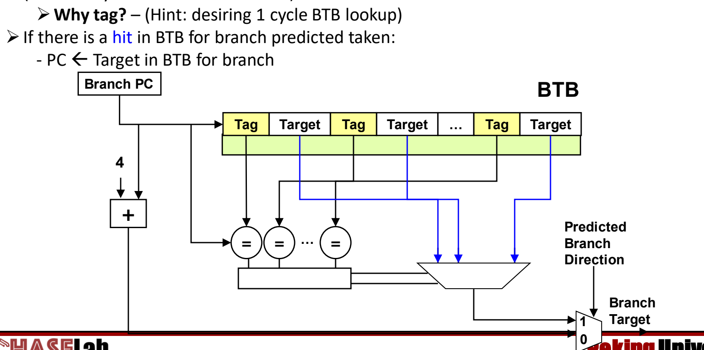
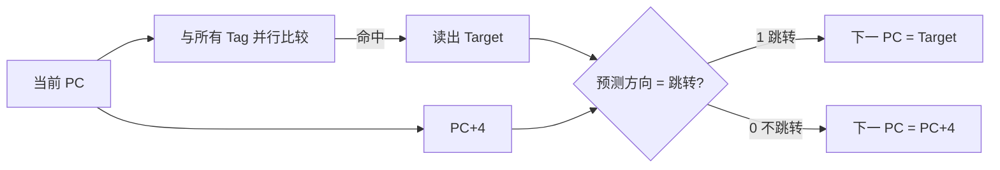
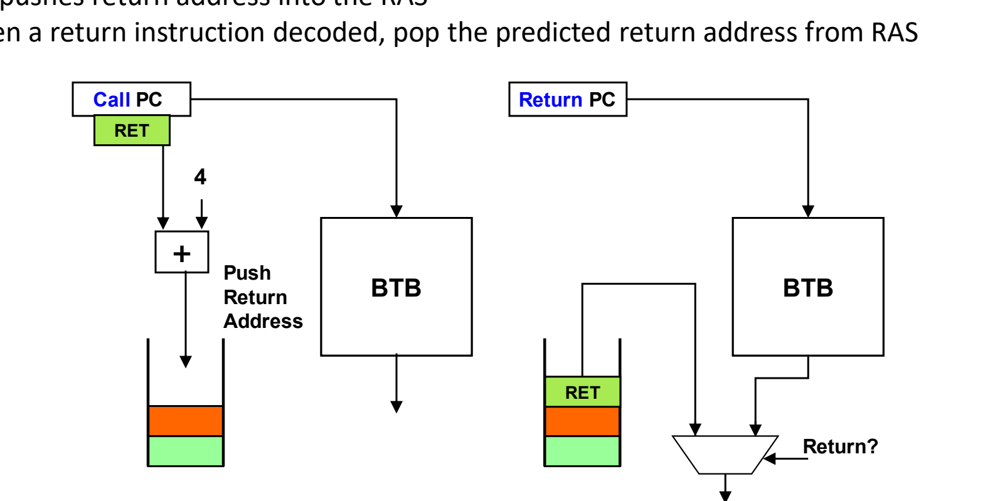

# 04 分支目标预测

[本讲目录](../index.md) · [课程目录](../../index.md) · [上一节：03 动态分支预测](03-dynamic-branch-prediction.md) · [下一节：05 超流水线与指令级并行](05-super-pipelining-and-ilp.md)

> [!abstract] 本节要点
> - BHT 只回答“跳不跳”，不回答“跳到哪”；**分支目标缓冲 BTB** 在 IF 阶段缓存分支的目标，预测正确时无论分支走哪个方向都不必停顿。
> - BTB 有两种实现：缓存**目标地址**（需要双读端口指令存储器，IF/ID 中的预测位选择下一拍装入哪条“下一条”指令），或缓存**目标处的指令本身**（指令存储器照常顺序取指）。
> - BTB 是带 tag 的类缓存结构：PC 与所有 tag 并行比较（像全相联缓存），命中且预测跳转则 $PC \leftarrow$ BTB 中的目标，否则 $PC \leftarrow PC+4$；为了一个周期查完，比较器很多，通常只有 64 或 128 项。
> - 函数返回地址要等 EX 才算得出，且同一函数从多处被调用，BTB 预测不准；**返回地址栈 RAS** 在调用时压入 $PC_{\rm call}+4$，译码到返回指令时弹出作为预测值。
> - RAS 只需 8–16 项就足够准确；调用过深溢出、或被进程切换/内核/异常打断时会失效，但误预测只影响性能、不影响正确性。

## 为什么还需要目标预测

[BHT](03-dynamic-branch-prediction.md) 预测的是分支**何时**跳转（when），却不告诉处理器分支跳到**哪里**（where）。[^s2p30] 方向预测为“跳转”之后，处理器仍需要目标地址才能在下一个周期从正确位置取指；如果目标要等译码、甚至等执行阶段算出，即使方向猜对了，流水线也要白白等上几个周期。分支的方向与目标两类预测需求见[分支预测的动机](01-why-branch-prediction.md)。

因此需要第二类预测器，专门在取指阶段直接给出跳转目标，这就是 BTB。

## 分支目标缓冲（Branch Target Buffer, BTB）

**分支目标缓冲**（Branch Target Buffer, BTB）是位于 IF 阶段的一个类缓存（cache-like）存储，记录分支指令的地址及其对应的跳转目标，用指令地址来查找。[^s2p31] 它的好处是：只要预测正确，**无论分支走哪个方向都可以避免停顿**——预测跳转时，下一条直接取自目标；预测不跳转时，下一条就是顺序指令。[^s2p30]

### 两种实现思路

BTB 里到底存什么，有两种做法：[^s2p30][^s3b6]

1. **方案一：缓存目标地址**。IF 阶段的 BTB 给出分支目标地址，但同一周期还必须取出顺序的下一条指令（以防预测不跳转）。于是 IF 同时取出两条候选指令，由 IF/ID 中的**预测位**选择在下一个时钟沿把哪一条“下一条”指令装入 IF/ID。代价是指令存储器需要**两个读端口**：一个端口按 $PC+4$ 取顺序指令，另一个端口读出跳转目标地址处的指令。
2. **方案二：缓存目标指令本身**。指令存储器不做改动，每个周期仍只按顺序地址取一条指令；BTB 中存放的不再只是 PC 地址，而是**跳转目标处的那条指令**。取指时，指令存储器输出顺序指令，BTB 输出跳转目标指令，由多路选择器选择其一送入 IF/ID（示意图中该选择器还有一个常数 `0` 输入）。

| 对比项 | 方案一：缓存目标地址 | 方案二：缓存目标指令 |
| --- | --- | --- |
| BTB 表项内容 | 分支目标的地址 | 分支目标处的指令 |
| 指令存储器 | 需要两个读端口（顺序指令 + 目标指令） | 单读端口，只取顺序指令 |
| 每周期的两条候选指令来自 | 都来自指令存储器 | 顺序指令来自指令存储器，目标指令来自 BTB |
| 谁决定装入 IF/ID 的指令 | IF/ID 中的预测位 | 预测结果控制的多路选择器 |

### 结构与查找过程

BTB 由许多并排的 `Tag | Target` 对组成：`Tag` 记录某条分支指令的 PC，`Target` 记录它发生跳转时的目标。[^s2p31] 一次查找按以下步骤进行：

1. **并行比较**：当前取指的 PC（图中 Branch PC）同时送到每个表项的比较器 `=`，与**所有** tag 同时比较。
2. **选出目标**：比较结果作为选择信号，把匹配那一项的 `Target` 经多路选择器读出；有匹配即为**命中**（hit），说明 BTB 中确实存有这条分支的目标。
3. **计算顺序地址**：同时用加法器算出 $PC+4$。
4. **按方向选下一 PC**：最后一级二选一由**预测的分支方向**（Predicted Branch Direction，来自方向预测器）控制：选 `1` 输出 Branch Target，选 `0` 输出 $PC+4$。

即：若 BTB 命中且该分支被预测为跳转，则
$$
PC \leftarrow \text{Target}_{\rm BTB}
$$
否则 $PC \leftarrow PC + 4$。[^s2p31]



图：分支 PC 同时与所有 Tag 比较，命中项的 Target 经选择器输出，再由预测方向在目标地址与 $PC+4$ 之间二选一。



### 为什么要有 tag

设置 tag 的理由（Hint）是：希望 BTB 查找**在一个周期内完成**。[^s2p31] BTB 工作在 IF 阶段，此时指令还没有译码，处理器甚至不知道当前取的是不是分支。用 tag 存下分支 PC 并与当前 PC 全部同时比较，命中本身就说明“这是一条记录过的分支、目标就是这个”，于是在一个周期内同时得到“是否为已知分支”和“目标是什么”两条信息，下一周期即可从目标处取指。

这种组织方式与 BHT 完全不同：

| 对比项 | BHT | BTB |
| --- | --- | --- |
| 预测内容 | 方向：跳 / 不跳 | 目标：跳到哪里 |
| 定位表项的方式 | PC 经哈希直接索引到唯一固定的一项 | PC 与所有 tag 并行比较 |
| 是否有 tag | 无 | 有 |
| 结构类比 | 直接索引的表 | 全相联缓存（fully associative cache） |

BTB 的优点是快，一个周期内完成所有 tag 的比较并读出目标；缺点是硬件复杂——每一项都需要一个比较器同时工作，所以表项数不可能很大，一般只有 **64 或 128 项**，超过这个规模对 CPU 设计会带来很大困难。[^s3b6]

> [!warning] 易错点
> BTB 与 BHT 不能混为一谈：BHT 哈希后直接读一项，不同分支可能共用同一项（别名）；BTB 用 tag 精确匹配，查到的就是这条分支自己的目标。最终的下一 PC 要同时看两者——BTB 命中但方向预测为“不跳转”时，下一 PC 仍是 $PC+4$。

## 函数返回的预测难点

函数返回非常频繁，却恰好是 BTB 难以处理的一类跳转。[^s2p32] 难点有两个：

1. **地址难算**：返回指令（MIPS 的 `jr $ra`）的目标在寄存器 `$ra` 中，要从寄存器读出地址，必须等到 EX 阶段完成才知道跳到哪里。
2. **地址难用 BTB 预测**：同一个函数可以从多处被调用，每次返回的位置都不同，而 BTB 中一条返回指令只对应一个 Target。

> [!example] 例：同一个 `bar` 的三个返回目标
> 设 `foo` 三次调用 `bar`，`bar` 又调用 `baz`（讲义把返回指令误写成 `jar $ra`，应为 `jr $ra`）：[^s2p32]
>
> ```asm
> foo:
>   0x10001000  jal bar
>   0x10001004  ...
>   0x10001800  jal bar
>   0x10001804  ...
>   0x10001CE4  jal bar
>   0x10001CE8  ...
> bar:
>   0x1000F0E0  jal baz
>   0x1000F0E4  ...
>               jr  $ra
> baz:
>               jr  $ra
> ```
>
> 1. `jal` 把调用指令地址 $+4$ 作为返回地址，所以 `bar` 中那一条 `jr $ra` 依次要跳回 `0x10001004`、`0x10001804`、`0x10001CE8`。
> 2. BTB 为这条 `jr $ra` 只记一个 Target。第二次返回时它记着上一次的 `0x10001004`，而真实目标是 `0x10001804`；第三次同理，记着 `0x10001804` 而真实目标是 `0x10001CE8`。
> 3. 所以只靠 BTB，每次从不同调用点返回都会预测错。

但只要了解指令语义，返回地址其实很好预测：**每次调用发生时，返回地址就已经知道了**——就是调用指令的地址加 4。[^s2p32]

## 返回地址栈（Return Address Stack, RAS）

**返回地址栈**（Return Address Stack, RAS）是专门预测函数返回目标的硬件栈：调用时把返回地址压入 RAS，译码到返回指令时从 RAS 弹出预测的返回地址。[^s2p33]

1. **调用（call）**：调用指令的 PC 照常查 BTB 得到被调函数的入口；同时把 $PC_{\rm call}+4$ 作为返回地址压入（push）RAS。
2. **返回（return）**：返回指令的 PC 同样会查 BTB，但当判断出这是一条返回指令（图中 `Return?` 信号）时，多路选择器改用 RAS 栈顶弹出（pop）的地址作为预测目标，而不用 BTB 的输出。



图：调用时把 Call PC + 4 压入 RAS，返回时弹出栈顶 RET 作为预测地址，与 BTB 的输出二选一。

选择栈结构的原因是调用与返回天然是嵌套的：后调用的函数先返回，正好对应栈的后进先出（LIFO）。[^s3b7]

> [!example] 例：用 RAS 预测上例的返回
> 按上例的执行顺序跟踪 RAS（栈顶写在右侧）：
>
> 1. `0x10001000 jal bar`：压入 `0x10001004` → `[0x10001004]`
> 2. `0x1000F0E0 jal baz`：压入 `0x1000F0E4` → `[0x10001004, 0x1000F0E4]`
> 3. `baz` 的 `jr $ra`：弹出 `0x1000F0E4`，正确返回 `bar` → `[0x10001004]`
> 4. `bar` 的 `jr $ra`：弹出 `0x10001004`，正确返回 `foo` → `[]`
> 5. `0x10001800 jal bar`：压入 `0x10001804`；之后 `bar` 返回时弹出的正是 `0x10001804`。第三次调用同理得到 `0x10001CE8`。
>
> 同一条 `jr $ra` 每次都拿到本次调用压入的地址，BTB 解决不了的“多处调用”问题就消失了。

### 规模：小栈就够

RAS 不需要很大就能预测得很准，**8–16 项**的返回栈已经足够。[^s2p34] 返回误预测率随表项数变化的曲线（横轴为返回栈表项数，基准程序为 gcc、fpppp、espresso、doduc、li、tomcatv）显示：没有返回栈时各程序的返回误预测率约在 20%–50%；表项增加到 8 项时，大多数程序的误预测率已降到接近 0；`li` 下降最慢，到 16 项时也只剩很小的误预测率。

真实处理器的 RAS 规模：[^s2p34]

| 处理器 | RAS 表项数 |
| --- | --- |
| MIPS R10K | 1 |
| DEC Alpha 21164 | 12 |
| Intel P3 | 16 |

早期处理器只有 1 项，是因为当时程序的调用嵌套不深；程序越写越复杂后，后来的处理器把表项增加到 12 或 16。[^s3b7]

### 失效情形与正确性

RAS 会在以下情况失效：[^s3b7]

1. **调用深度超过栈容量**：函数嵌套调用得很深，超出 RAS 的表项数，较早压入的返回地址无法保留，相应的返回就会预测错。
2. **执行流被打断**：程序在调用与返回之间被切换到其他进程，或从应用程序进入操作系统内核执行（例如发生异常），栈中内容会受到干扰。

RAS 和 BTB 一样只是**预测**机制：预测错只影响性能，不影响正确性。返回指令最终仍会解析出真实的返回地址，与预测地址比较；两者不一致就是一次误预测，按误预测的方式处理（冲刷错误路径上的指令，从正确地址重新取指）。[^s3b7]

> [!tip] 课堂强调
> 往处理器里加入新的硬件设计，往往就会带来安全问题。BTB 和 RAS 带来了很大的性能收益，但幽灵（Spectre）一类攻击正是利用了 BTB 和 RAS 的特性，后续课程会介绍。[^s3b7] 推测执行本身见[分支预测的动机](01-why-branch-prediction.md)。

> [!question]- 自测：某条分支在 BTB 中命中，但方向预测器预测“不跳转”；另一条分支方向预测为“跳转”，但在 BTB 中未命中。两种情况下下一 PC 各是什么？
> 两种情况下一 PC 都是 $PC+4$。按 BTB 的选择逻辑，只有“命中且预测跳转”才令 $PC \leftarrow \text{Target}_{\rm BTB}$：第一种方向选了 `0`；第二种 BTB 拿不出目标，IF 阶段无处可跳，只能先按顺序取指，等分支真正解析后再纠正。

> [!question]- 自测：一个处理器的 RAS 只有 2 项，满时新压入的地址覆盖最老的一项。程序依次执行 `A` 调用 `B`、`B` 调用 `C`、`C` 调用 `D`，然后逐层返回。三次返回中哪几次预测正确？
> 前两次（`D`→`C`、`C`→`B`）正确，第三次（`B`→`A`）错误。三次调用压入 $r_A, r_B, r_C$，容量为 2，$r_A$ 被覆盖；依次弹出 $r_C$、$r_B$ 都正确，第三次返回时栈中已没有 $r_A$。这就是“调用深度超过栈容量”的失效，最终真实地址解析后发现不一致，只损失性能。

> [!question]- 自测：BTB 有 1024 项是否一定比 128 项更好？为什么实际 BTB 通常只有 64 或 128 项？
> 不一定能做出来。BTB 要求一个周期内把 PC 与所有 tag 并行比较（全相联），每项都要一个比较器，项数越多硬件越复杂、越难在一个周期内完成；所以实际设计在命中率与单周期查找之间折中，通常取 64 或 128 项。

> [!info]- 来源
> - L04.pdf：PDF p.30–34
> - L04.docx：DOCX body 174–231

[^s2p30]: L04.pdf-PDF p.30
[^s2p31]: L04.pdf-PDF p.31
[^s3b6]: L04.docx-DOCX body 174-204
[^s2p32]: L04.pdf-PDF p.32
[^s2p33]: L04.pdf-PDF p.33
[^s3b7]: L04.docx-DOCX body 205-231
[^s2p34]: L04.pdf-PDF p.34

[本讲目录](../index.md) · [课程目录](../../index.md) · [上一节：03 动态分支预测](03-dynamic-branch-prediction.md) · [下一节：05 超流水线与指令级并行](05-super-pipelining-and-ilp.md)
