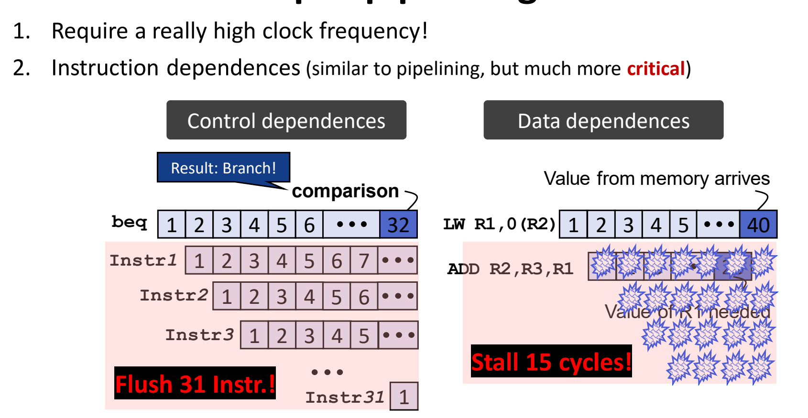
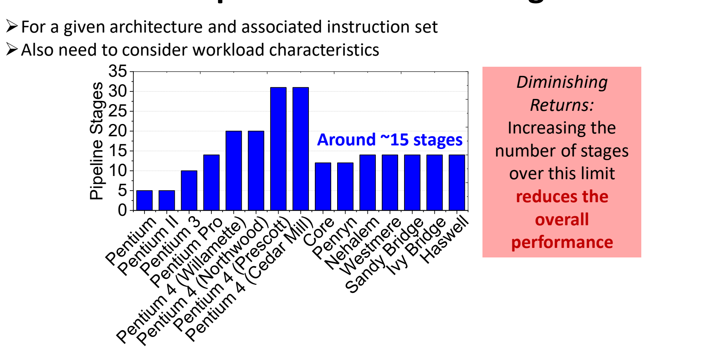
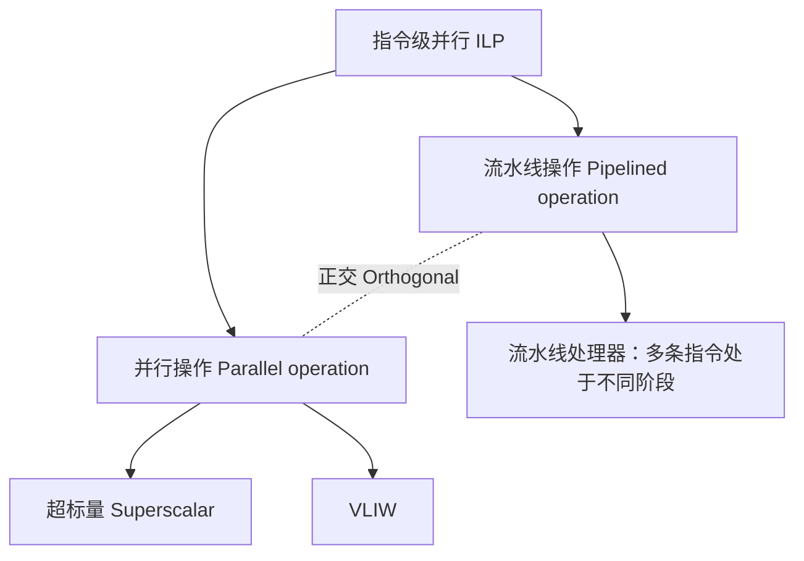

# 05 超流水线与指令级并行

[本讲目录](../index.md) · [课程目录](../../index.md) · [上一节：04 分支目标预测](04-branch-target-prediction.md) · [下一节：06 超标量处理器](06-superscalar-processors.md)

> [!abstract] 本节要点
> - 慢操作有两种处理办法：把整个时钟放慢一倍，或者让它占两个周期、保持时钟频率不变。乘法不用 DM 阶段，可以横跨 ALU 与 DM；访存慢一倍时可拆成 DM1、DM2，五级变六级。
> - 流水线周期由最长一级决定，每级末尾的锁存器还会增加延迟。例：各级 1.0/0.6/0.9/1.2/0.4 ns，单周期 4.1 ns，流水线 1.2 ns，加速比 $4.1/1.2\approx3.42$，没有达到理想的 5。
> - **超流水线**把每级拆成 $m$ 个子级，周期从 $T$ 缩短到 $T/m$，每个小周期可以发射一条新指令。理想情况下每 $T/m$ 出一个结果，加速比约等于级数。
> - 深流水线的代价有两项：一是时钟频率极高、功耗大；二是依赖代价成倍放大。例如 `beq` 第 32 级才比较完，预测错时要冲刷 31 条指令；`LW` 的值第 40 级才到，而 `ADD` 第 25 级就要用，即使有转发也要停 15 个周期。
> - 级数存在最优值，约 15 级，超过后收益递减，甚至降低整体性能。指令级并行有两条正交途径：流水线和并行执行（超标量/VLIW），实际处理器两者兼有。

## 其他流水线结构

教科书上的五级流水线默认每个阶段都能在一个周期内完成。真实的处理器里，乘除法、慢速数据存储器等操作明显比其他阶段长。如果只是简单地让最慢的部件决定时钟周期，所有指令都会跟着变慢。

**多周期乘法（slow multiply）**：乘法器延迟大约是 ALU 的两倍时，有两种选择：[^s2p35]

1. **把时钟放慢一倍**：乘法能在一个周期内完成，但其他所有指令也都按慢时钟执行。
2. **让乘法占两个周期**：乘法指令不访问数据存储器，不需要 DM 阶段。所以可以在 ALU 旁边并联一个 MUL 单元，让它横跨原来的 ALU 和 DM 两个阶段，结果直接送到写回的 Reg。这样时钟频率不变，乘法也不会多占用流水线的级数。[^s3b7]

**两级访存（two-cycle data memory）**：如果数据存储器（DM）的访问时间是指令存储器（IM）的两倍，同样有两种选择：

1. **把时钟放慢一倍**，让 DM 在一个周期内完成；
2. **让数据访存占两个周期**，拆成 DM1、DM2 两级，时钟频率保持不变。流水线从五级变成六级：IM → Reg → ALU → DM1 → DM2 → Reg。


两种情况的思路相同：慢操作要么拖慢整个时钟，要么拆成多个周期，后一种保住了时钟频率。下面的超流水线就是把这个思路推广到所有阶段。

## 流水线性能回顾

在讨论“加深流水线”之前，先回顾流水线的收益从哪里来、为什么达不到理想值。五级流水线的原理和冒险见 L03 的相关章节，这里只算性能。

流水线经过最初的填充（warm-up）阶段以后，每个周期完成一条指令，即 $\text{Inst/Cycle}=1$。它的**吞吐率**受两个因素限制：[^s2p37]

- 每级末尾的**锁存器**（latch）会增加延迟；
- **最长的一级决定时钟周期**。

> [!example] 例：五级流水线的加速比
> 已知各级延迟：IF 1.0 ns，ID 0.6 ns，EX 0.9 ns，MEM 1.2 ns，WB 0.4 ns。求单周期与流水线设计的周期和加速比。
>
> 1. 单周期设计：一个周期要走完全部五步，周期等于各级之和，$1.0+0.6+0.9+1.2+0.4=4.1\ \text{ns}$，每周期完成 1 条指令。
> 2. 流水线设计：周期由最长的一级 MEM 决定，为 $\max=1.2\ \text{ns}$，每周期同样完成 1 条指令。
> 3. 两者每周期完成的指令数相同，所以加速比就是周期之比：
> $$
> \text{Speedup}=\frac{4.1\ \text{ns}}{1.2\ \text{ns}}\approx 3.42
> $$
> 4. 理想值是级数 5。差距来自各级延迟不均：ID 只要 0.6 ns，WB 只要 0.4 ns，却都要等满 1.2 ns。[^s2p37]

> [!warning] 易错点
> 理想加速比等于级数，前提是各级延迟完全相等，并且忽略锁存器开销。级数增加时，只有每级的延迟同步缩小，周期才会缩短；最慢的一级不拆开，再多的级数也没有用。

## 超流水线（Super-pipelining）

上面的例子说明，加速比的上限大致等于级数。想继续提高性能，最直接的办法是增加级数，让每级的工作变少、周期变短、频率变高。[^s3b8]

**超流水线**（super-pipelining），又称深流水线（deep pipelining，没有严格定义），目标是让加速比约等于级数，做法是设置很多级，比如超过 30 级的 Pentium 4。它的含义是：[^s2p38]

1. 把原来的一级拆成 $m$ 个子级（sub-stage），例如 Fetch → F1、F2，Decode → D1、D2，Inst（执行）→ E1、E2；
2. 每个子级的工作量约为原来的 $1/m$，所以时钟周期从 $T$ 缩短为 $T/m$；
3. 机器在每个小周期（minor cycle，长 $T/m$）都可以发射一条新指令。

讲义原文写作 “the clock cycle period T should be reduced by T/m”，结合图中标注的 $T$ 与 $T/m$ 以及“每个小周期发射一条指令”，应理解为周期**缩短为** $T/m$，而不是减少 $T/m$。[^s2p38]

**理想情况**：超流水线每 $T/m$ 产生一个结果。[^s2p39] 时序图取 3 个阶段、$m=2$，执行 4 条指令（i 到 i+3）：[^s2p39]

| 设计 | 时钟周期 | 每条指令占用 | 第 1 条完成 | 第 4 条完成 |
| --- | --- | --- | --- | --- |
| 普通流水线（Fetch/Decode/Inst） | $T$ | $3T$ | $3T$ | $3T+3T=6T$ |
| 超流水线（F1…E2，6 个子级） | $T/2$ | $6\times\frac{T}{2}=3T$ | $3T$ | $3T+3\times\frac{T}{2}=4.5T$ |

单条指令从进入到完成的时间（延迟）没有变，仍是 $3T$。变的是相邻指令的间隔，从 $T$ 缩短到 $T/2$。图中的“Gain”就是 4 条指令总共节省的 $6T-4.5T=1.5T$。

> [!note] 补充解释
> 推广一下：$k$ 级流水线执行 $n$ 条指令需要 $(k+n-1)T$；每级拆成 $m$ 个子级后需要 $(mk+n-1)\frac{T}{m}$。$n$ 很大时两者之比趋近 $m$，也就是相对于不拆分的原始设计，加速比约为总级数 $mk$。这个结论成立的前提是理想情况：子级完全均衡、没有锁存器开销、没有依赖停顿。

## 超流水线的问题

理想分析忽略了两个代价，流水线越深，这两个代价越突出。[^s2p40]

1. **需要非常高的时钟频率**：周期缩短为 $T/m$，频率就要提高 $m$ 倍，功耗随之升高。[^s3b8]
2. **指令依赖**（instruction dependences）：道理和普通流水线一样，但后果严重得多（much more critical）。



图：左侧 beq 到第 32 级才比较完、需冲刷 31 条指令；右侧 LW 的值第 40 级才到而 ADD 在第 25 级就需要，停顿 15 个周期。

**控制依赖**（control dependences）：设流水线有 32 级，`beq` 到第 32 级才完成比较（comparison），得出“要跳转（Result: Branch!）”。这时 Instr1 到 Instr31 已经依次进入第 1 到第 31 级。如果它们取自错误的路径（预测错误），这 **31 条指令全部要冲刷**（Flush 31 Instr.!）。一般地，分支在第 $k$ 级才得出结果时，误预测的冲刷条数是 $k-1$。[^s2p40]

**数据依赖**（data dependences）：`LW R1,0(R2)` 从存储器读出的值到第 40 级才拿到（Value from memory arrives），紧随其后的 `ADD R2,R3,R1` 在第 25 级就需要 R1（Value of R1 needed）。转发最早也只能在值产生之后把它送过去，所以 `ADD` 必须等待。按图中的计数，等待 $40-25=15$ 个周期（Stall 15 cycles!）。[^s2p40]

```asm
LW  R1, 0(R2)    # R1 的值在第 40 级才从存储器到达
ADD R2, R3, R1   # 第 25 级就需要 R1 → 即使转发也要停顿 15 个周期
```

在五级流水线里，级数少，结果产生的位置和需要使用的位置只差一两级，靠转发和把分支判断提前就能把代价压到很小（见 L03《08 控制冒险》及 L03 关于转发的内容）。到了深流水线，产生和使用之间隔着十几甚至几十级，**这些在五级流水线里有效的手段基本失效**。[^s3b8] 这也是深流水线、超标量处理器格外依赖准确分支预测的原因，见[动态分支预测](03-dynamic-branch-prediction.md)。

> [!warning] 易错点
> 转发不能消除“值还没产生”造成的等待。它只能省掉“写回寄存器再读出”的那段时间。值在第 40 级才产生，第 25 级需要它的指令无论有没有转发都得等，转发能做的只是在值产生的那一刻立即送过去。

## 最优流水线级数

依赖代价随级数增长，而周期的缩短又受锁存器开销和级间均衡的限制，所以级数存在最优值。[^s2p41]

- 最优级数**针对给定的体系结构及其指令集**而言；
- 同时**还要考虑负载特性**（workload characteristics）：分支多、依赖多的程序更怕深流水线。



图：Pentium 4 系列超过 30 级后，Core 及以后回落到约 15 级，级数超过上限收益递减。

Intel 各代处理器的流水线级数（数据来源：Mateo Valero，“Runtime Aware Architectures”，HiPEAC CSW 2014）：Pentium、Pentium II 约 5 级，Pentium 3 约 10 级，Pentium Pro 约 14 级，Pentium 4（Willamette、Northwood）约 20 级，Pentium 4（Prescott、Cedar Mill）约 31 级。之后的 Core、Penryn 回落到约 12 级，Nehalem、Westmere、Sandy Bridge、Ivy Bridge、Haswell 稳定在约 14 级。结论是**大约 15 级**最合适。**收益递减**（diminishing returns）：级数超过这个界限后，整体性能反而下降。[^s2p41]

> [!tip] 课堂强调
> 现在实验得出的结论是，各种负载特性决定了流水线深度大约在 14 到 16 级，平均 15 级，这么多年基本不变，已经是比较理想的深度；再加深，收益逐级降低，最后甚至会影响整体性能。[^s3b8]

## 指令级并行的两条途径

加深流水线有上限，要继续提高性能就得换一个方向：让多条流水线同时工作。**多发射**（multi-issue）是指处理器每个周期能同时发射（issue，即送入执行）的指令数。现代处理器宣传性能时几乎都会提到自己是几发射，例如新一代处理器性能提升，常归因于支持了更多的发射。[^s3b7]

**指令级并行**（Instruction-Level Parallelism，ILP）指同时执行多条指令的能力。它有两条途径：[^s2p42]

1. **流水线操作**（pipelined operation）：同一时刻有多条指令在执行，但它们**处在不同的阶段**。例如一条指令在 EX1，前一条在 EX2，再前一条在 EX3。超流水线属于这条途径。
2. **并行操作**（parallel operation）：设置多条流水线（多套 EX1、EX2、EX3），每条独立执行一条指令，多条指令**在同一个时钟周期处于相同的阶段**。代表是**超标量**（superscalar）处理器和 **VLIW**（Very Long Instruction Word，超长指令字）处理器，二者理念不同。[^s3b8]



两条途径是**正交**（orthogonal）的，彼此不矛盾：每一条并行的通道本身可以是一条深流水线。所以几乎所有实际处理器都同时具备两者。[^s2p42] 动态多发射的超标量见[超标量处理器](06-superscalar-processors.md)，静态多发射的 VLIW 见[VLIW 与编译技术](07-vliw-and-compilation.md)。

> [!question]- 自测：五级流水线各级延迟为 IF 0.8、ID 0.5、EX 1.0、MEM 0.9、WB 0.3 ns。把 EX 平分成两个 0.5 ns 的子级、变成六级后，加速比（相对单周期）从多少变为多少？
> 从 3.5 变为约 3.89。单周期周期为 $0.8+0.5+1.0+0.9+0.3=3.5$ ns。五级时周期为最长的 EX 1.0 ns，加速比 $3.5/1.0=3.5$。拆分后各级为 0.8、0.5、0.5、0.5、0.9、0.3 ns，最长一级变成 MEM 0.9 ns，加速比 $3.5/0.9\approx3.89$，远不到理想的 6：拆开最慢的一级后，瓶颈转移到次慢的一级。（忽略锁存器开销。）

> [!question]- 自测：某深流水线在第 20 级完成分支比较，另一条 `LW` 的数据第 18 级才到，而紧随其后、依赖它的指令第 12 级就要用。按上面的计数方法，误预测冲刷几条指令？数据依赖停顿几个周期？
> 冲刷 $20-1=19$ 条：分支到第 20 级时，后面 19 条指令已经分别处在第 1 到第 19 级。停顿 $18-12=6$ 个周期：值在第 18 级才产生，转发也无法提前提供。

> [!question]- 自测：一个 4 路超标量处理器，每条通道都是 15 级流水线。它利用的是哪一条 ILP 途径？
> 两条都用了。15 级流水线让同一通道里的指令处于不同阶段（流水线操作）；4 条通道让 4 条指令在同一周期处于相同阶段（并行操作）。两者正交，可以叠加。

> [!info]- 来源
> - L04.pdf：PDF p.35–42
> - L04.docx：DOCX body 205–253

[^s2p35]: L04.pdf-PDF p.35
[^s3b7]: L04.docx-DOCX body 205-231
[^s2p37]: L04.pdf-PDF p.37
[^s3b8]: L04.docx-DOCX body 232-253
[^s2p38]: L04.pdf-PDF p.38
[^s2p39]: L04.pdf-PDF p.39
[^s2p40]: L04.pdf-PDF p.40
[^s2p41]: L04.pdf-PDF p.41
[^s2p42]: L04.pdf-PDF p.42

[本讲目录](../index.md) · [课程目录](../../index.md) · [上一节：04 分支目标预测](04-branch-target-prediction.md) · [下一节：06 超标量处理器](06-superscalar-processors.md)
