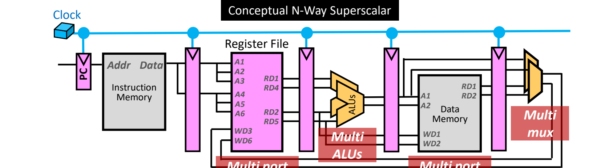
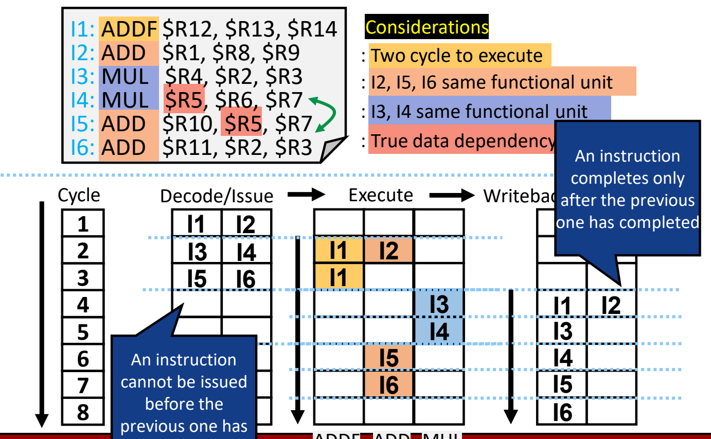
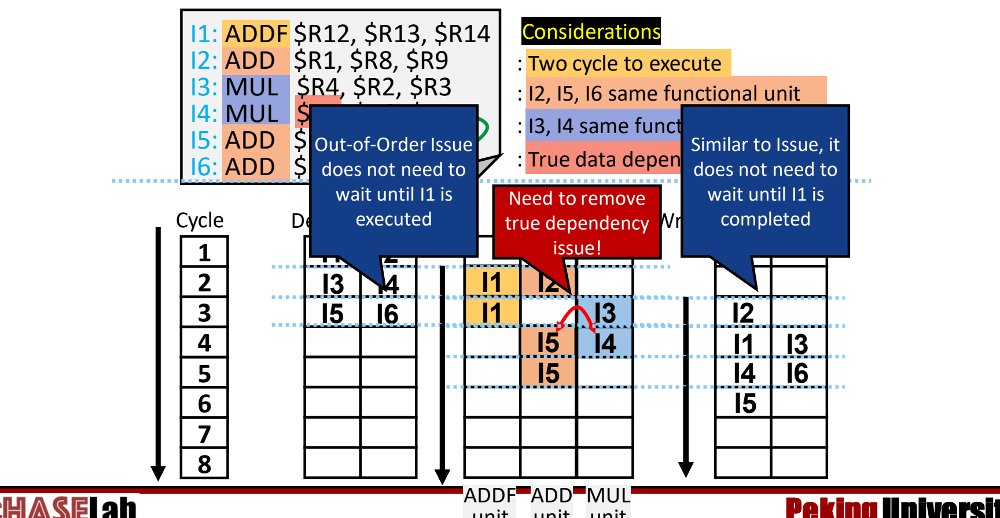
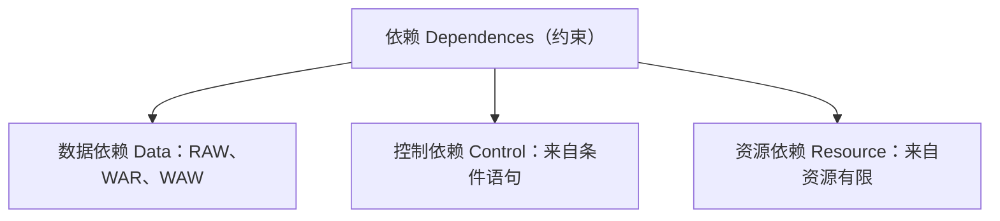
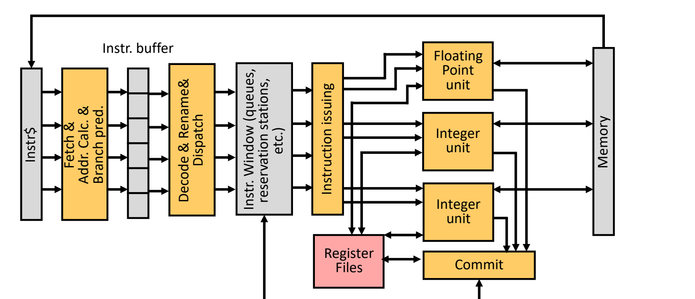

# 06 超标量处理器

[本讲目录](../index.md) · [课程目录](../../index.md) · [上一节：05 超流水线与指令级并行](05-super-pipelining-and-ilp.md) · [下一节：07 VLIW 与编译技术](07-vliw-and-compilation.md)

> [!abstract] 本节要点
> - 超标量是**动态**多发射处理器：同一周期能发射并完成多条指令，哪几条一起执行由硬件在运行时决定；$N$ 路超标量每周期最多发射 $N$ 条。
> - 理想情况下所有指令相互独立，加速比为 $N$；如果指令全部相关，超标量就退化成普通流水线，没有加速。核心问题是找出独立指令。
> - 执行策略由**发射顺序**和**完成顺序**刻画，两者都可以是顺序或乱序。乱序的前提是：最终结果必须与严格顺序执行完全一致。
> - 六条指令的例子中：顺序发射加顺序完成需要 8 个周期；编译器交换 I3 和 I6 后需要 6 个周期；乱序发射加乱序完成在第 6 个周期只剩一条写回（“五个半周期”），效果最好。
> - 超标量要检查同时译码的指令之间、以及它们与在途指令之间的数据依赖（RAW、WAR、WAW 都要查）、控制依赖和资源依赖。朴素做法是在译码级比较寄存器后停顿；更好的手段有分支预测、循环展开、记分板、Tomasulo 寄存器重命名、保留站和 ROB，最后由 commit 保证结果正确。

## 超标量的定义与 N 路结构

[超流水线](05-super-pipelining-and-ilp.md)靠把一级拆成多级来缩短周期，但级数有最优上限。另一条提高指令级并行的路是并排放置多条流水线，让每条流水线各自执行一条指令，这就是超标量。

**超标量处理器**（Superscalar Processor）是**动态多发射**（Dynamic Multiple Issue）处理器：每个时钟周期可以**发射**（issue）并**完成**（complete）多条指令，而且哪些指令同时执行由硬件在运行时决定。它由若干条并行工作的流水线组成，称为 **N 路超标量**（N-way Superscalar），每周期最多发射 $N$ 条指令。[^s2p44] 典型代表有 IBM Power 3、Pentium 4、MIPS R10K、HP PA 8500。[^s2p43] 今天能见到的处理器几乎都是超标量。[^s3b8]

> [!info] 可视化资源
> [Wikipedia：Superscalar processor](https://en.wikipedia.org/wiki/Superscalar_processor) 用示意图对比超标量与流水线，并说明运行时依赖检查的硬件代价。

它和普通流水线的区别：

- **流水线**：多条指令同时在执行，但每条处在**不同**的阶段。
- **超标量**：同一个周期里，多条指令处在**同一个**阶段，例如同时译码、同时执行。

概念性的 N 路结构里，各流水级和单发射时一样（PC、指令存储器、寄存器堆、ALU、数据存储器、写回选择器），差别在于**存储状态的部件要增加端口，运算和选择部件要复制多份**。以两路为例：[^s2p44]

1. **寄存器堆多端口**：两组读地址 A1、A2 / A4、A5，两组写地址 A3 / A6，对应读口 RD1、RD2 / RD4、RD5，写口 WD3 / WD6。同一周期能为两条指令各读两个源操作数、各写一个结果。
2. **数据存储器多端口**：仍是同一块存储器，但有两组地址（A1、A2）、两组读口（RD1、RD2）和两组写口（WD1、WD2），允许同一周期访问多组数据。
3. **多个 ALU、多组 mux**：每路一份运算器和写回选择器，流水线寄存器和连线也相应加宽。



图：寄存器堆和数据存储器改为多端口，并配备多个 ALU 与多组选择器，使每周期可处理多条指令。

超流水线和超标量是**正交**的。[^s2p45] 用时序图对比：超流水线把 Fetch、Decode、Execute 各拆成两级（F1/F2、D1/D2、E1/E2），每条指令比上一条晚半个原周期进入流水线，收益来自更高的频率；两路超标量则每个周期同时取指、译码、执行两条指令，收益来自并行执行。两者互不矛盾，实际处理器中通常同时采用。

## 理想加速比与依赖退化

超标量的收益取决于同一时刻真正能一起执行的指令有多少。

**超标量度**（Superscalarity）：$N$ 路超标量在理想情况下，即所有指令都相互独立时，加速比为 $N$。[^s2p46] 反过来，如果所有指令都相互依赖，后一条必须等前一条的结果，多条流水线也只能错开执行。这时超标量带不来任何加速，执行效果和普通流水线一样。

> [!tip] 课堂强调
> 超标量的核心问题是保证同时执行的指令彼此独立。指令一旦有依赖，超标量就失去意义。[^s3b8]

### 例：数组求和的依赖分析

C 语句 `sum += a[i--]` 编译成如下循环。为简化，假设 load-use 依赖只需等一个周期。[^s2p47]

```asm
loop: ld  $r2, 10($r1)     # $r2 <- a[i]
      add $r3, $r3, $r2    # sum += $r2
      sub $r1, $r1, 1      # i--
      bne $r1, $r0, loop   # i != 0 则继续
```

要两两检查哪些指令可以同时执行：

1. **ld 与 add**：add 读 ld 刚写的 `$r2`（RAW），不能并行。
2. **ld 与 sub**：ld 读 `$r1` 作为地址，sub 写 `$r1`（WAR），不能并行。
3. **sub 与 bne**：bne 读 sub 刚写的 `$r1`（RAW），不能并行。
4. **add 与 sub**：add 只涉及 `$r3`、`$r2`，sub 只涉及 `$r1`，彼此独立，**可以并行**。

所以这四条指令里只有 add 和 sub 能放进同一周期。[^s3b9]在两路超标量的时序中，ld 单独执行，add 与 sub 同时执行，bne 在下一周期执行。四条指令的执行跨度为 3 个周期，单发射流水线需要 4 个周期。超标量本身的设计并不复杂，难点在于**找出独立指令**，并避免依赖带来的影响。实际中这项工作由**编译器**和**处理器硬件**完成。

## 发射顺序与完成顺序

并行执行能力由什么决定？[^s2p48]

- **A. 并行流水线的数量与性质**：硬件能同时执行几条指令、各功能单元能做什么。
- **B. 处理器找出独立指令的机制**：能找到多少可以并行的独立指令，就有多少并行度。找不到，超标量就和传统流水线一样。

找到的独立指令在程序里未必相邻，可能分散在不同位置，这就涉及执行顺序。执行策略由两个因素刻画：

- **发射顺序**（issue order）：指令送去执行的次序，可以是**顺序**（in-order）或**乱序**（out-of-order）。
- **完成顺序**（completion order）：指令把结果写入寄存器和存储器的次序，同样可以是顺序或乱序。**完成**指结果写入寄存器和存储器的时刻。[^s2p48]

严格按程序顺序执行和完成，几乎没有并行的机会。为了提高并行度，超标量必须**向前看**（look ahead），在后面的指令里找独立指令提前执行。指令可以按不同于严格顺序的次序执行，但有一条约束，即**结果必须与严格顺序执行的结果完全一致**。[^s2p49]

> [!tip] 课堂强调
> 后面讨论的所有乱序技术都以这一点为前提：不管以什么次序执行，最终结果都必须与严格顺序执行完全相同，处理器才不会出错。[^s3b9]

## 执行策略示例：顺序、编译重排与乱序

用同一段六条指令比较不同策略的效果。[^s2p50]

```asm
I1: ADDF R12, R13, R14   # R12 <- R13 + R14（浮点）
I2: ADD  R1,  R8,  R9    # R1  <- R8 + R9
I3: MUL  R4,  R2,  R3    # R4  <- R2 * R3
I4: MUL  R5,  R6,  R7    # R5  <- R6 * R7
I5: ADD  R10, R5,  R7    # R10 <- R5 + R7
I6: ADD  R11, R2,  R3    # R11 <- R2 + R3
```

约束条件：

- I1 在 ADDF 单元上需要 **2 个周期**执行。
- I3 与 I4 争用同一个功能单元（MUL 单元）。
- I5 需要 I4 产生的 `R5`，I4→I5 是**真数据相关**（RAW）。
- I2、I5、I6 争用同一个功能单元（ADD 单元）。

模型分三级：**Decode/Issue → Execute → Writeback/Complete**。每周期译码两条，写回级每周期可完成两条，有 ADDF、ADD、MUL 三个功能单元。比较两种策略：[^s2p51]

- **策略 1：顺序发射 + 顺序完成**。指令按顺序执行时的次序发射，也按同样次序写回结果。
- **策略 2：乱序发射 + 乱序完成**。处理器在已译码的一组指令中向前看，只要程序执行正确，可以按任意次序发射其中任意指令。

### 策略 1：顺序发射 + 顺序完成（8 个周期）

规则：一条指令不能先于它前面的指令发射；一条指令只有在前一条完成后才能完成。逐周期推演：[^s2p53]

| 周期 | 译码/发射 | 执行：ADDF | 执行：ADD | 执行：MUL | 写回/完成 |
| --- | --- | --- | --- | --- | --- |
| 1 | I1、I2 | | | | |
| 2 | I3、I4 | I1 | I2 | | |
| 3 | I5、I6 | I1 | | | |
| 4 | | | | I3 | I1、I2 |
| 5 | | | | I4 | I3 |
| 6 | | | I5 | | I4 |
| 7 | | | I6 | | I5 |
| 8 | | | | | I6 |

推理要点：

1. I1、I2 在周期 2 开始执行。I1 要两个周期，I2 虽然一个周期就算完，也要等 I1，两者在周期 4 一起写回。
2. I3 要等 I1、I2 完成后才执行，即周期 4。I4 和 I3 争用 MUL 单元，推到周期 5。
3. I5 要 I4 的结果（真相关），在周期 6 执行。I6 与 I5 争用 ADD 单元，而且不能越过 I5，推到周期 7。
4. 写回逐条推进，I6 在周期 8 完成，共 **8 个周期**。



图：顺序发射 + 顺序完成时，六条指令共需 8 个周期，注意 I5 等待 I4、各指令按序写回。

在这种策略下，处理器只能靠**停顿**处理真数据相关和资源冲突。由于发射和完成都严格按序，能达到的并行度在很大程度上取决于**程序的写法和编译方式**。[^s2p54]

### 编译器重排：交换 I3 与 I6（6 个周期）

硬件不变，仍是顺序发射加顺序完成，改由软件静态优化：把 I3 和 I6 的位置对调，得到 I1、I2、I6、I4、I5、I3。I6 和 I3 与其他指令都没有数据相关，交换不影响结果。[^s2p54]

| 周期 | 译码/发射 | 执行：ADDF | 执行：ADD | 执行：MUL | 写回/完成 |
| --- | --- | --- | --- | --- | --- |
| 1 | I1、I2 | | | | |
| 2 | I6、I4 | I1 | I2 | | |
| 3 | I5、I3 | I1 | | | |
| 4 | | | I6 | I4 | I1、I2 |
| 5 | | | I5 | I3 | I6、I4 |
| 6 | | | | | I5、I3 |

交换后 I6（ADD）和 I4（MUL）使用不同功能单元，可以在周期 4 并行；I5（ADD，等 I4 的 `R5`）和 I3（MUL）在周期 5 并行。总时间从 8 个周期降到 **6 个周期**。[^s2p55]

### 策略 2：乱序发射 + 乱序完成

恢复原始顺序 I1～I6，但允许乱序：[^s2p57]

| 周期 | 译码/发射 | 执行：ADDF | 执行：ADD | 执行：MUL | 写回/完成 |
| --- | --- | --- | --- | --- | --- |
| 1 | I1、I2 | | | | |
| 2 | I3、I4 | I1 | I2 | | |
| 3 | I5、I6 | I1 | | I3 | I2 |
| 4 | | | I6 | I4 | I1、I3 |
| 5 | | | I5 | | I4、I6 |
| 6 | | | | | I5 |

1. **乱序发射**：I3 不必等 I1 执行完，MUL 单元在周期 3 空闲，I3 立即执行；I4 接着在周期 4 用 MUL。
2. **真相关仍要等**：I5 依赖 I4 的 `R5`，只能在 I4 之后的周期 5 执行。乱序允许把**独立的 I6** 提前到周期 4，填上 ADD 单元的空档。
3. **乱序完成**：I2 不必等 I1，周期 3 就写回；随后 I1、I3 在周期 4 写回，I4、I6 在周期 5 写回，I5 在周期 6 写回。

第 6 个周期只有 I5 一条写回，所以实际约为“五个半周期”，比编译器重排的完整 6 个周期还好。[^s3b10]



图：乱序发射与完成不必等待 I1，以写回栏为准读取各指令完成周期（执行栏第 4 周期的 I5 标注有误）。

> [!warning] 易错点
> 讲义 s2p57 原表执行栏 ADD 列在周期 4 和周期 5 都写着 I5，这与写回栏矛盾。I4 在周期 4 才执行，I5 不可能同时执行。按写回栏（周期 5 写回 I6，周期 6 写回 I5）推回去，周期 4 在 ADD 单元执行的应是 I6，I5 在周期 5 执行。红框“Need to remove true dependency issue!”说的正是 I4→I5 的真相关：乱序也不能越过它，要提高并行度，还得有专门的技术处理真相关。[^s2p57]

> [!tip] 课堂强调
> 实际情况也是这样：硬件乱序调度的效果一般好于编译器的静态优化。[^s3b10]

> [!question]- 自测：如果在策略 1 中把 I1 的执行时间改为 1 个周期，总周期数变成多少？
> 7 个周期。I1、I2 在周期 2 执行、周期 3 写回；I3 周期 3 执行、周期 4 写回；I4 争 MUL，周期 4 执行、周期 5 写回；I5 等 I4，周期 5 执行、周期 6 写回；I6 争 ADD 且不能越过 I5，周期 6 执行、周期 7 写回。整个流程只比原来提前 1 个周期，因为后面的串行瓶颈是 MUL 单元争用和 I4→I5 真相关。

## 超标量的挑战与解决手段

超标量的概念很简单，就是多条流水线同时工作，但依赖问题比单流水线严重得多：多条指令同时译码、同时执行，一处依赖会同时卡住几条通路。

依赖检查的范围包括两类指令：[^s2p58]

- **同时译码**的指令之间；
- 与**已在流水线中**（例如之前已发射）的在途指令之间。



1. **数据依赖**（Data Dependence）：来自对同一数据的先后访问要求，分 RAW、WAR、WAW 三种。普通单发射流水线只需考虑 RAW，另外两种不会发生；超标量里三种都会出现，都要考虑。
2. **控制依赖**（Control Dependence）：来自条件语句（分支）。单流水线里已有，在超标量中影响更大，因为一次分支停顿会耽误多条通路的指令。
3. **资源依赖**（Resource Dependence）：来自资源有限，例如上例中争用同一个功能单元。超标量增加了额外部件，冲突的情形还会更多。

**朴素解法**：在译码级做比较，发现依赖就停顿：[^s2p58]

1. 新指令的 Rs 与所有在途指令的目标寄存器比较；
2. 新指令的 Rt 与所有在途指令的目标寄存器**和**源寄存器比较；
3. 没有可用的硬件资源时停顿。

> [!note] 补充解释
> Rs 只作源操作数，所以只需与在途目标比较，检查 RAW。Rt 在一些指令里是源、在另一些指令里（例如 I 型指令）是目标，所以还要与在途的源寄存器比较，以覆盖 WAR，与目标比较则覆盖 RAW 和 WAW。

全部停顿当然能保证正确，但会带来**更长的延迟**，而超标量的收益恰恰来自找到并利用独立指令。处理依赖、尤其是与在途指令之间的依赖，有一组更好的解决方案：[^s2p59]

| 问题 | 解决手段 |
| --- | --- |
| 控制依赖 | 静态调度中的循环展开（见[循环展开基本思想](07-vliw-and-compilation.md)）；分支预测（见[动态分支预测](03-dynamic-branch-prediction.md)） |
| 数据依赖 | 记分板（Scoreboard）；静态调度（见[静态调度与动态调度](08-static-scheduling-and-compiler-optimization.md)）；Tomasulo 算法的硬件寄存器重命名 |
| 指令顺序约束（乱序执行仍保证结果正确） | 保留站（Reservation Station）；重排序缓冲（Reorder Buffer, ROB） |
| 出错时如何处理 | 异常处理（Exception Handling），本课程不讲 |

## 超标量整体架构

把前面的部件组合起来，就是一个更完整的超标量处理器。[^s2p60] 数据从左到右流动：


1. **取指、地址计算与分支预测**（Fetch & Addr. Calc. & Branch pred.）：从指令缓存持续取指、算地址、做分支预测，不断把指令填进指令缓冲。
2. **指令缓冲**（Instruction Buffer）：必须**保持充满**。缓冲里有足够多的指令，后级才有指令可挑、可调度；缓冲空了，调度就无从做起。
3. **译码、重命名与分派**（Decode & Rename & Dispatch）：译码后做寄存器重命名，再把指令分派出去。重命名的原理在下节课讲（编译层面的重命名见[寄存器重命名](08-static-scheduling-and-compiler-optimization.md)）。
4. **指令窗口**（Instruction Window）：一个宽泛的名称，不同架构里对应的具体模块不同，可能是队列、保留站或其他结构，作用都是暂存待执行指令的信息。
5. **指令发射**（Instruction Issuing）：从窗口中挑出指令，送到浮点单元、整数单元等功能单元，访存则与存储器交互。
6. **提交**（Commit）：处理器内部的“保险”。执行过程是乱序的，commit 保证最终结果正确；提交之后才把数据写入寄存器堆或存储器。



图：指令从指令缓存经取指与分支预测、指令缓冲、译码重命名分派、指令窗口、发射进入各功能单元，最后经提交写回寄存器堆与存储器。

图中功能单元为一个浮点单元和两个整数单元。

## 早期超标量处理器

早期产品已经具备上述特征：[^s2p61]

- **PowerPC 6XX**：六个独立执行单元，即一个分支执行单元、一个 load/store 单元、三个整数单元、一个浮点单元；支持乱序发射。
- **Pentium I**：三个独立单元。
- **Pentium II**：乱序执行，每周期可发射五条指令。

> [!tip] 课堂强调
> 这里的“乱序”指**执行过程**乱序：指令的计算可以不按程序顺序进行，而发射过程本身常常仍是顺序的。[^s3b11]

> [!question]- 自测：一个两路超标量每周期译码两条指令。当前正在译码 `ADD R1, R2, R3` 和 `SUB R2, R4, R5`，流水线中有一条在途指令 `MUL R4, R6, R7` 尚未写回。请找出所有依赖，并说明哪种在单发射流水线里不必担心。
> SUB 写 R2 而 ADD 读 R2：同时译码的两条之间存在 WAR。SUB 读 R4 而在途的 MUL 写 R4：与在途指令之间存在 RAW。单发射流水线按序读、按序写，WAR 不会造成错误；超标量里两条指令可能同时或乱序执行，必须检查 WAR，否则 SUB 可能先写 R2，让 ADD 读到错误的值。

> [!question]- 自测：把循环中的 `add $r3, $r3, $r2` 换成与 ld 无关的 `add $r4, $r4, $r5`，在两路超标量上，四条指令的执行跨度能缩到 2 个周期吗？
> 不能，仍是 3 个周期。ld 与 add 现在独立，可以同周期执行，但 ld 与 sub 仍因 `$r1` 冲突不能并行，sub→bne 仍是 RAW。于是只能排成（ld, add）→ sub → bne。瓶颈是 ld→sub→bne 这条依赖链，而不是两路发射的宽度。

> [!info]- 来源
> - L04.pdf：PDF p.43–61
> - L04.docx：DOCX body 232–326

[^s2p44]: L04.pdf-PDF p.44
[^s2p43]: L04.pdf-PDF p.43
[^s3b8]: L04.docx-DOCX body 232-253
[^s2p45]: L04.pdf-PDF p.45
[^s2p46]: L04.pdf-PDF p.46
[^s2p47]: L04.pdf-PDF p.47
[^s3b9]: L04.docx-DOCX body 254-279
[^s2p48]: L04.pdf-PDF p.48
[^s2p49]: L04.pdf-PDF p.49
[^s2p50]: L04.pdf-PDF p.50
[^s2p51]: L04.pdf-PDF p.51
[^s2p53]: L04.pdf-PDF p.53
[^s2p54]: L04.pdf-PDF p.54
[^s2p55]: L04.pdf-PDF p.55
[^s2p57]: L04.pdf-PDF p.57
[^s3b10]: L04.docx-DOCX body 280-303
[^s2p58]: L04.pdf-PDF p.58
[^s2p59]: L04.pdf-PDF p.59
[^s2p60]: L04.pdf-PDF p.60
[^s2p61]: L04.pdf-PDF p.61
[^s3b11]: L04.docx-DOCX body 304-326

[本讲目录](../index.md) · [课程目录](../../index.md) · [上一节：05 超流水线与指令级并行](05-super-pipelining-and-ilp.md) · [下一节：07 VLIW 与编译技术](07-vliw-and-compilation.md)
