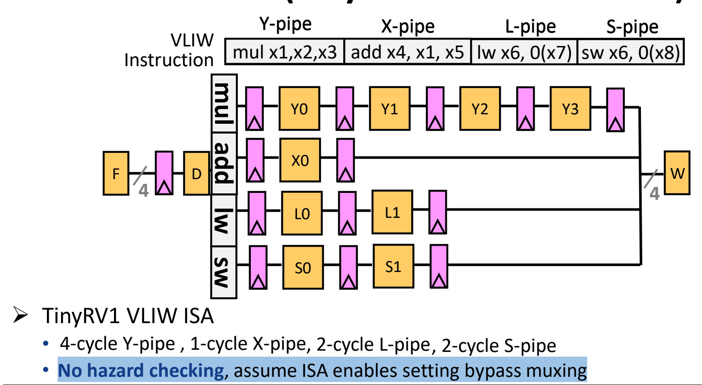
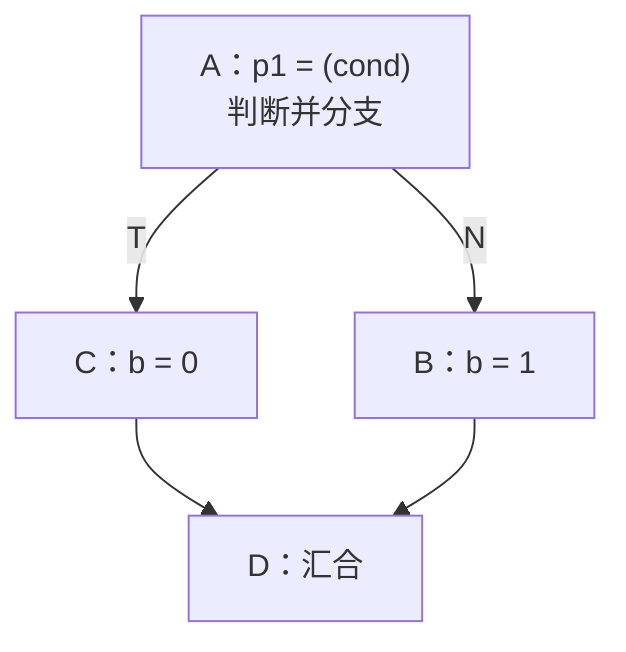
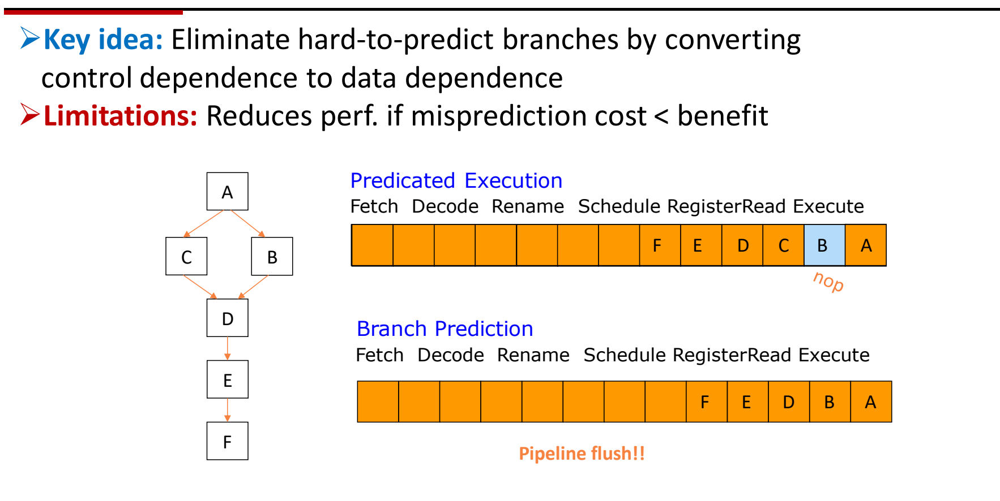

# 07 VLIW 与编译技术

[本讲目录](../index.md) · [课程目录](../../index.md) · [上一节：06 超标量处理器](06-superscalar-processors.md) · [下一节：08 静态调度与编译优化](08-static-scheduling-and-compiler-optimization.md)

> [!abstract] 本节要点
> - VLIW 是**静态**多发射：哪些指令同时发射由编译器在编译时决定；超标量则由硬件在运行时动态决定。代表产品是 Intel Itanium（IA-64，EPIC），只有服务器版本。
> - 一条 VLIW 长指令由多条相互独立的子指令打包而成，每个槽位对应一个特定功能单元；凑不满的槽位填 nop。
> - TinyRV1 VLIW 的 F/D/W 宽度为 4，含 4 周期 Y 管（mul）、1 周期 X 管（add）、2 周期 L 管（lw）、2 周期 S 管（sw）；硬件不做冒险检查，各管在写回前同步。
> - 循环展开一次做 $M$ 次迭代，减少分支、暴露 ILP，代价是代码增长且不处理跨迭代依赖；谓词执行把控制依赖转成数据依赖，错误路径只变成 nop、不冲刷流水线，但误预测代价小于其开销时反而更慢。
> - VLIW 硬件简单、可能更省电、易扩展；缺点是编译器负担重、锁步执行、二进制不兼容、程序存储带宽需求大、代码膨胀。四种架构的关键问题依次是：CISC 译码复杂度、RISC 数据转发与冒险、超标量硬件依赖解析、VLIW 编译器代码调度。

## 超长指令字（VLIW）

超标量在运行时用硬件检查依赖、决定一拍发射哪几条指令（见[超标量处理器](06-superscalar-processors.md)），这套检查逻辑随发射宽度增加而迅速变复杂。VLIW 的思路相反：既然编译器能看到整个程序，就让它在编译时把可以并行的指令找好、排好，硬件只管照着执行。

**超长指令字**（Very Long Instruction Word, VLIW）处理器是**静态多发射处理器**（static multiple-issue processor）：并行发射的决策在编译时由编译器做出。[^s2p62] 它有三条结构约定：[^s2p63]

1. 多条**子指令**（sub-instruction）可以打包成一条长指令；
2. 同一条长指令内的子指令**必须**相互独立；
3. 长指令中的每个**槽位**（slot）对应一个特定的功能单元。

其核心思想是：用新的 ISA 取代传统的顺序 ISA，使编译器能把指令级并行（ILP）**直接编码在软硬件接口中**。[^s2p63] 传统顺序 ISA 只告诉硬件"按这个顺序做"，并行性要靠硬件自己去挖；VLIW ISA 的一条指令本身就写明"这几件事同时做"。

> [!info] 可视化资源
> [Wikipedia：Very long instruction word](https://en.wikipedia.org/wiki/Very_long_instruction_word) 对比了编译器调度的 VLIW 与硬件调度的超标量，并介绍 IA-64/EPIC 中的谓词执行。

最典型的 VLIW 处理器是 Intel Itanium 系列，采用 IA-64 指令集，Intel 称之为 **EPIC**（Explicit Parallel Instruction Computer，显式并行指令计算）。[^s2p62] Itanium 只有服务器版本，没有笔记本或台式机版本：普通桌面程序和程序员几乎不会专门为它做优化，在它上面跑这类程序效果很差。[^s3b11]

> [!tip] 课堂强调
> 超标量与 VLIW 的关键词对比：超标量是**动态**的，在执行过程中由硬件做乱序调度与发射；VLIW 是**静态**的，调度在编译时完成。[^s3b11]

### 从 C 程序到 VLIW 执行

以循环 `for(i=0;i<n;i++) dest[i]=src[i]*coeff;` 为例，编译与执行流程如下：[^s2p63]

1. **找出独立操作**（find independent operations）：编译器分析各操作之间的依赖关系，区分哪些可以同时执行、哪些必须先后执行；
2. **调度操作**（schedule operations）：有依赖的操作分到不同时刻，彼此无关的操作安排到同一时刻；
3. **打包成 VLIW 指令**：把同一时刻、彼此独立的操作装进同一条长指令；某一时刻剩下的操作不够填满所有槽位时，空槽位用**空操作**（nop）填充；
4. **直接执行**（direct execution）：VLIW 处理器依次取出每条长指令，按槽位把子指令送进对应功能单元，不再做任何依赖分析。


这样，两两无依赖的操作被装进同一条长指令，最后剩下的一条操作与一个空槽一起组成最后一条长指令。[^s3b11]

## TinyRV1 VLIW 处理器

具体看一台 VLIW 机器的硬件长什么样，以及"硬件简单、软件困难"体现在哪里。

**TinyRV1 VLIW** 仍有取指 F、译码 D、写回 W 三个公共阶段，但这三段的宽度都是 4，即一次处理一条含 4 条子指令的长指令。执行部分分成 4 条流水线，每个槽位固定对应一条：[^s2p64]

| 槽位 | 功能单元 | 典型子指令 | 执行延迟 |
| --- | --- | --- | --- |
| Y-pipe | 乘法（乘除类） | `mul x1,x2,x3` | 4 周期（Y0–Y3） |
| X-pipe | 加法等 ALU 运算 | `add x4,x1,x5` | 1 周期（X0） |
| L-pipe | 取数 | `lw x6,0(x7)` | 2 周期（L0–L1） |
| S-pipe | 存数 | `sw x6,0(x8)` | 2 周期（S0–S1） |

例如一条 VLIW 指令就是 `mul x1,x2,x3 | add x4,x1,x5 | lw x6,0(x7) | sw x6,0(x8)` 四条子指令拼在一起。



图：一条 VLIW 指令含 mul/add/lw/sw 四个槽，分别进入 4 周期 Y 管、1 周期 X 管、2 周期 L 管和 2 周期 S 管，最后汇合写回。

执行一条长指令的过程：

1. **取指与译码**：F、D 一次处理整条长指令（4 条子指令）。
2. **分槽执行**：4 条子指令同时进入 Y、X、L、S 四条不同的流水线。
3. **写回前同步**：短的流水线不会提前写回，而是等待最长的 Y 管完成。X 管只执行 1 个周期，却要再等 3 个周期；L 管、S 管执行 2 个周期，要再等 2 个周期。[^s3b11]
4. **统一写回**：4 条子指令一起通过 W 更新寄存器。

硬件的第二个特点是**不做冒险检查**（no hazard checking），并假设 ISA 能够设定旁路多路选择器（bypass muxing）。[^s2p64] 也就是说，L03 所讲五级流水线中的冒险检测与转发控制逻辑，在这里都没有：

- 同一条长指令内部，编译器已保证子指令彼此独立，硬件默认它们可以无条件并行；
- 依赖只可能出现在**不同的** VLIW 指令之间，同样由编译器负责处理，必要时插入额外的停顿（例如插入整条 nop 长指令）。[^s3b11]

> [!note] 补充解释
> 上面这条长指令中 `add x4,x1,x5` 读的 `x1` 正是同一束里 `mul` 写的寄存器，`sw` 存的 `x6` 也是同束 `lw` 写的寄存器。按常见的 VLIW 语义，同一束的子指令在译码时一起读寄存器、在写回时一起写寄存器，所以束内的 `add` 读到的是 `mul` 执行**之前**的 `x1` 旧值，两者并不构成束内依赖。若程序确实需要 `mul` 的新结果，编译器必须把 `add` 放到后面的长指令里。

### 难点在软件

处理器本身几乎没有设计难度，难的是编译器和写代码的人：要把 4 条彼此独立、而且类型恰好匹配 Y/X/L/S 四个槽位的子指令凑到一起，难度很大，程序员也得尽量往这个方向写代码。[^s3b11]

> [!example] 例：程序里全是加法
> 设某段程序只有一串相互独立的 `add`，在 TinyRV1 VLIW 上如何执行？
>
> 1. 每条长指令只有 X 槽能放 `add`，Y、L、S 三个槽都只能填 nop；
> 2. 程序照样能正确运行，但每条长指令只有 $\frac{1}{4}$ 的槽位在做有用的事；
> 3. 其余 $\frac{3}{4}$ 的功能单元空转，nop 还白白占用指令存储空间。

> [!example] 例：`dest[i]=src[i]*coeff` 的一次迭代
> 一次迭代需要 `lw`（取 `src[i]`）→ `mul`（乘 `coeff`）→ `sw`（存 `dest[i]`），三者形成依赖链。
>
> 1. `mul` 依赖 `lw` 的结果，`sw` 依赖 `mul` 的结果，所以三者不能放进同一条长指令，只能分别放在先后三条长指令里；
> 2. 每条长指令只用到 1 个槽位，其余 3 个填 nop，槽位利用率只有 $\frac{1}{4}$；
> 3. 要填满槽位，就得让不同迭代的操作互相交错，例如把下一次迭代的 `lw` 和本次的 `mul` 放在同一束。这正是下面循环展开等编译技术要做的事。

> [!warning] 易错点
> "VLIW 不需要冒险检测"不等于"VLIW 程序没有依赖"。依赖仍然存在，只是从硬件转给了编译器：束内由编译器保证独立，束间由编译器安排足够的间隔。编译器排错了，硬件不会兜底。

## VLIW 的编译技术

VLIW 的性能完全取决于编译器能否找到足够多的独立指令。软件需要回答两个关键问题：[^s2p65]

1. 如何找出可以一起取指、执行的独立指令？
2. 如何让编译器能做更多优化？

对应的关键思路有三类：[^s2p65]

- **消除控制流**（get rid of control flow）：谓词执行、循环展开；
- **优化高频执行路径**：踪迹调度（trace scheduling）；
- 其他：软件流水（software pipelining）。

这些技术并不只服务于 VLIW，一般的编译优化同样会用到。本讲只讲循环展开的基本思想和谓词执行；踪迹调度和软件流水留到后续课程。[^s3b12]

### 循环展开（Loop Unrolling）

普通循环每执行一次循环体就要跟一条分支来判断是否跳回，而分支（控制依赖）把循环体切成一小段一小段，编译器很难跨分支找独立指令。

**循环展开**的基本思想是：把循环展开，使一次循环执行 $M$ 次原来的迭代。[^s2p66] 以 `B[i] = A[i] + C` 展开 4 次为例：

```c
// 原始 C 代码
for (i = 0; i < N; i++)
    B[i] = A[i] + C;

// 展开 4 次后的 C 代码
for (i = 0; i < N; i += 4) {
    B[i]   = A[i]   + C;
    B[i+1] = A[i+1] + C;
    B[i+2] = A[i+2] + C;
    B[i+3] = A[i+3] + C;
}
```

收益有两点：

1. **分支变少**：原来每做一次 `B[i]=A[i]+C` 就判断一次分支，展开后连续做 4 次才判断一次，分支数降为约 $\frac{1}{4}$；
2. **暴露更多 ILP**：循环体内 4 条语句之间没有分支隔开，而且相互独立，编译器可以把它们的 load、add、store 分别打包进同一批长指令。[^s2p66]

局限也有两点：[^s2p66]

- **代码增长**：循环体被复制了 $M$ 份；
- **不处理跨迭代依赖**（inter-iteration dependence）：若第 $i+1$ 次迭代要用第 $i$ 次的结果（例如 `A[i+1] = A[i] + C`），展开后的几条语句仍是串行依赖，展开本身无法让它们并行。

上面的展开写法默认 $N$ 是 4 的倍数。展开的具体实现、寄存器使用以及迭代次数不是展开倍数整数倍时的处理，见[静态调度与编译优化](08-static-scheduling-and-compiler-optimization.md)。

### 谓词执行（Predicated Execution）

分支预测器对规律性强的分支很准，但遇到难以预测的分支，误预测就要冲刷流水线。对 VLIW 来说，长指令以锁步方式执行，分支更是难以处理。

**谓词执行**的关键思想是：把**控制依赖**（control dependence）转换成**数据依赖**（data dependence），从而消除难以预测的分支。[^s2p67]

以如下代码为例：

```c
if (cond) {
    b = 0;
} else {
    b = 1;
}
```

它的控制流图是：基本块 A 计算条件并分支；条件成立（T）走 C（`b = 0`），不成立（N）走 B（`b = 1`）；两路在 D 汇合。



**普通分支代码**：

```text
A:      p1 = (cond)
        branch p1, TARGET    ; p1 为真则跳到 TARGET
B:      mov b, 1
        jmp JOIN
TARGET:
C:      mov b, 0
JOIN:
D:      ...
```

**谓词代码**：

```text
A:      p1 = (cond)
B:      (!p1) mov b, 1       ; 仅当 p1 为假时生效
C:      (p1)  mov b, 0       ; 仅当 p1 为真时生效
D:      ...
```

对比可见，谓词代码里没有 `branch` 和 `jmp`：每条指令前加了一个**谓词**前缀，原来"跳到哪里执行"的控制关系，变成了"B、C 依赖谓词寄存器 `p1` 的值"这一数据关系，程序从跳转变成了顺序执行。[^s2p67] 剩下要解决的是谓词前缀本身，这由硬件支持：B、C 两条指令都可以进入流水线并行处理，到快要执行完时再根据 `p1` 判断各自是否真正生效，不该生效的那条直接作废。[^s3b12]

### 谓词执行与分支预测的比较

下面用 MICRO'06 Diverge-Merge Processor（DMP，UT-Austin）中的例子比较两种方式。程序是控制流图 A →（B 或 C）→ D → E → F，流水线各级依次为 Fetch、Decode、Rename、Schedule、RegisterRead、Execute。[^s2p68]



图：谓词执行把 B 变为 nop 继续流动，分支预测误预测时则要冲刷整条流水线。

图中流水线最右端是最早进入的指令。上方的谓词执行流水线里同时装着 A、B、C、D、E、F；下方的分支预测流水线只装着预测路径上的 A、B、D、E、F。

- **谓词执行**：B 和 C 两条路径的指令都进入流水线。A 执行完、得到条件结果后，发现 B 不该执行，只需把 B 变成 nop，后面的 C、D、E、F 照常流动，控制依赖就这样被自然化解。
- **分支预测**：先预测一条路径并只取这条路径的指令。图中假设预测不跳转，流水线里是 A、B、D、E、F。如果 A 执行后发现预测错了（本该走 C），整条流水线都要**冲刷**（pipeline flush），再从 C 重新取指，代价远大于"把一条指令变成 nop"。[^s3b12]

因此，在控制流对性能影响很大、分支又难以预测时，谓词执行可以避免误预测带来的损失。它的局限是：**如果误预测代价小于谓词执行带来的开销，反而会降低性能**。[^s2p68] 两条路径的指令都要占用流水线，错误路径的指令虽然最终作废，却白白消耗了取指和执行资源。

> [!tip] 课堂强调
> 上面的例子比较极端：B、C 各只有一条指令。真实程序中 B、C 往往各含多条指令，两路全部执行的开销会变大，收益不一定比分支预测好。所以分支预测并非一无是处，市面上大多数处理器仍然采用分支预测；谓词执行只在部分场景下有收益，需要根据具体情况选择。[^s3b12]

> [!warning] 易错点
> 谓词执行不是"更好的分支预测"，它根本不预测：两条路径都执行，只是让其中一条的结果不生效。它省掉的是误预测时的冲刷，付出的是错误路径指令占用的流水线资源。分支越难预测、两条路径越短，谓词执行越划算。

## VLIW 的优点与缺点

VLIW 把复杂性从硬件转给编译器，好处和坏处都源于这一点。[^s2p69]

**优点**：

1. **硬件更简单**：不需要转发控制和冒险检测逻辑，功耗可能更低，这也是服务器青睐这种设计的原因。
2. **可能更容易扩展**：每个 VLIW 束（bundle）可以容纳更多指令，也可以加入更多功能单元。理论上只要不考虑编译器的难度，就可以把指令字做得很长，一次并行做很多事。

**缺点**：

1. **程序员 / 编译器复杂度高，编译时间长**：这是最大的问题。编译器优化做不好，VLIW 的效果就基本体现不出来。
2. **深流水线和长延迟难以把握**：峰值性能很难达到。
3. **锁步执行**（lock step operation）：一旦出现冒险，后续所有发射都要停顿，直到冒险解决。所有子指令必须同步前进，出了问题唯一能做的就是停顿，所以需要谓词执行来消除分支。
4. **目标代码（二进制）不兼容**：编译器是针对具体处理器的功能单元配置（例如 Y/X/L/S，或 Y/Y/L/S）来排槽位的。换一款处理器，硬件配置一变，原来的二进制就无法使用，所有程序都得重新编译。
5. **需要大量程序存储带宽**：以前每次取一条指令就是一条，现在每取一条长指令就包含 3～4 条子指令，取指带宽需求随之升高。
6. **代码膨胀**（code bloat）：凑不满的槽位填 nop，浪费程序存储空间；为了暴露更多 ILP 而做的循环展开也会占用更多程序存储空间。[^s3b13]

> [!tip] 课堂强调
> VLIW 之所以不适合放进笔记本或台式机，根本原因是现有的桌面程序和程序员没办法为它做优化：要凑满 Y、X、L、S 四类互不依赖的子指令非常难，实际中长指令里往往塞满了 nop。[^s3b12]

## CISC、RISC、超标量与 VLIW 对比

四种架构可以从指令格式、寄存器、访存方式和各自要解决的关键问题来比较：[^s2p70]

| | CISC | RISC | 超标量（Superscalar） | VLIW |
| --- | --- | --- | --- | --- |
| 指令长度 | 可变 | 固定 | 固定 | 固定（但很长） |
| 指令格式 | 可变 | 固定 | 固定 | 固定 |
| 寄存器 | 少，部分为专用寄存器 | 多个通用寄存器（GP） | 通用寄存器 + 重命名（RUU） | 非常多的通用寄存器 |
| 访存方式 | 嵌入在许多指令中 | load/store | load/store | load/store |
| 关键问题 | 译码复杂度 | 数据转发、冒险 | 硬件依赖解析 | （编译器）代码调度 |

关键问题一行是该架构最突出的困难，后面的架构同样会遇到前面的问题：CISC 独有的困难是译码复杂；RISC 要处理数据转发和冒险；超标量除了这些，还要用硬件解析多条同时发射指令之间的依赖，依赖问题更严重；VLIW 则把依赖处理全部交给编译器，对代码调度的要求很高。[^s3b13]

四种架构的指令流水也不同：[^s2p70]

- **RISC**：每个周期进入一条指令，各自经历 IF、ID、EX、M、WB，依次错开一个周期；
- **超标量**：每个周期进入两条指令，两条指令各自拥有完整的 IF、ID、EX、M、WB；
- **VLIW**：每个周期只取指、译码**一条**长指令（一组 IF、ID），到 EX、M、WB 时才拆成多条子指令，分别在不同功能单元上执行。

超标量的发射与依赖检查机制见[超标量处理器](06-superscalar-processors.md)，静态调度与动态调度的系统比较见[静态调度与编译优化](08-static-scheduling-and-compiler-optimization.md)。

> [!question]- 自测：TinyRV1 VLIW 上一条长指令的 X 槽是 `add`，其余三槽是 nop。这条 `add` 的结果从进入执行到写回经过几个执行周期？为什么不是 1 个？
> 4 个执行周期后才写回。X 管只需 1 个周期，但各子指令在写回前同步，必须等最长的 4 周期 Y 管完成，所以 X 管的结果要再等 3 个周期才和其他槽一起写回。

> [!question]- 自测：对 `for (i=0;i<100;i++) B[i]=A[i]+C;` 展开 4 次，循环分支执行次数如何变化？若循环体改为 `A[i+1]=A[i]+C;`，展开还能暴露同样多的 ILP 吗？
> 分支执行次数从 100 次降为 25 次。改成 `A[i+1]=A[i]+C` 后，每次迭代都依赖上一次的结果（跨迭代依赖），展开后的 4 条语句仍是串行链，不能放进同一条长指令。分支虽然减少了，ILP 却没有增加，这正是循环展开"不处理跨迭代依赖"的局限。

> [!question]- 自测：某 `if-else` 分支几乎总是同一个方向，而且两个分支各有 20 条指令。应把它改成谓词执行吗？
> 不宜。分支方向稳定，预测器几乎不会误预测，冲刷代价很小；改成谓词执行后，每次都要让两路共 40 条指令流经流水线，其中 20 条最终作废。误预测代价小于谓词执行的开销，性能反而下降。

> [!info]- 来源
> - L04.pdf：PDF p.62–70
> - L04.docx：DOCX body 304–373

[^s2p62]: L04.pdf-PDF p.62
[^s2p63]: L04.pdf-PDF p.63
[^s3b11]: L04.docx-DOCX body 304-326
[^s2p64]: L04.pdf-PDF p.64
[^s2p65]: L04.pdf-PDF p.65
[^s3b12]: L04.docx-DOCX body 327-354
[^s2p66]: L04.pdf-PDF p.66
[^s2p67]: L04.pdf-PDF p.67
[^s2p68]: L04.pdf-PDF p.68
[^s2p69]: L04.pdf-PDF p.69
[^s3b13]: L04.docx-DOCX body 355-373
[^s2p70]: L04.pdf-PDF p.70

[本讲目录](../index.md) · [课程目录](../../index.md) · [上一节：06 超标量处理器](06-superscalar-processors.md) · [下一节：08 静态调度与编译优化](08-static-scheduling-and-compiler-optimization.md)
