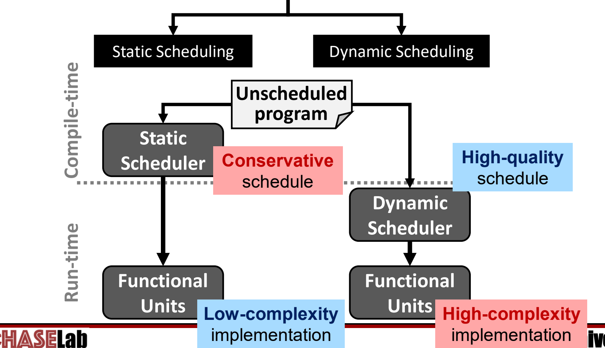
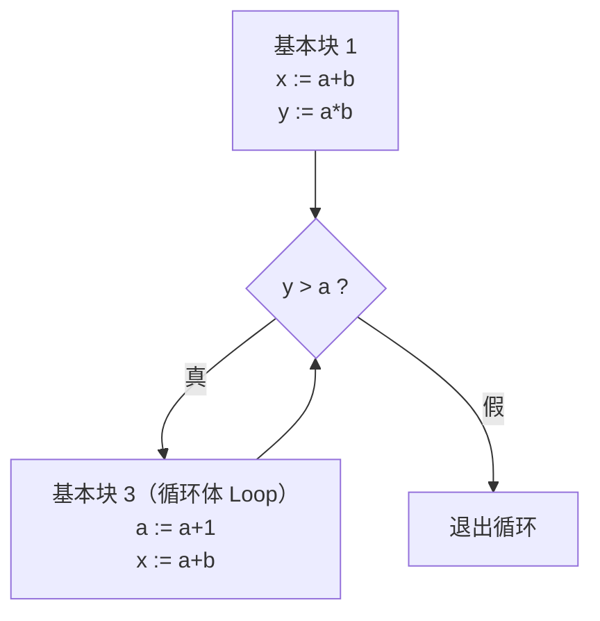
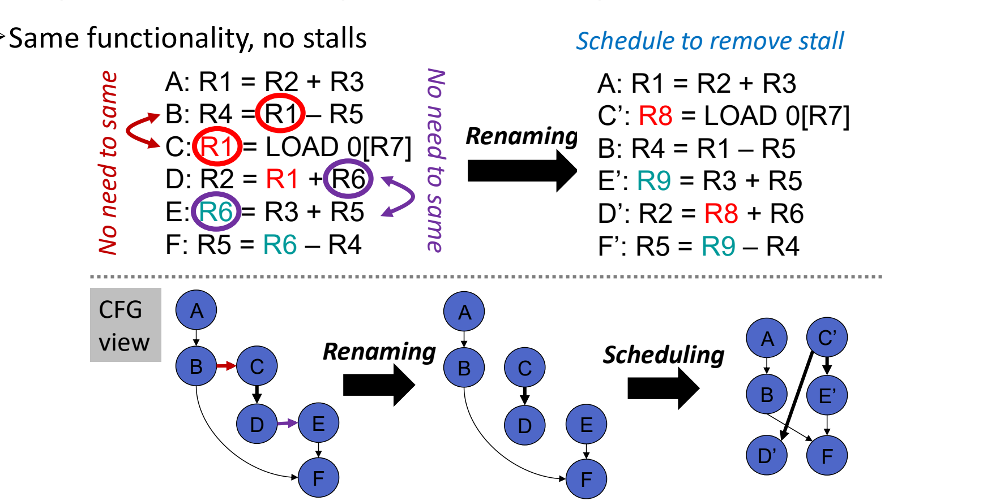
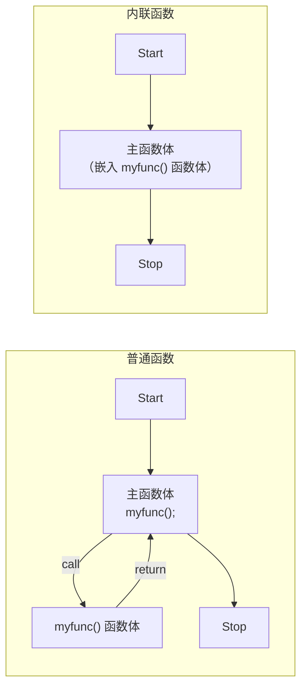

# 08 静态调度与编译优化

[本讲目录](../index.md) · [课程目录](../../index.md) · [上一节：07 VLIW 与编译技术](07-vliw-and-compilation.md)

> [!abstract] 本节要点
> - 数据依赖造成的停顿：单发射流水线主要是 load-use（RAW），另有无旁路、长延迟指令（乘除）；多发射时同一周期执行的指令之间不能有 RAW/WAR，WAW 也受限。
> - 指令调度分两类：**静态调度**在编译时完成，硬件简单但调度保守（VLIW 采用）；**动态调度**在运行时由硬件完成，硬件复杂但调度质量高。
> - $\text{执行时间} = IC \times CPI \times CCT$；编译器影响 $IC$ 和 $CPI$，不影响 $CCT$。常规优化主要减少 $IC$，面向 ILP 的优化主要降低 $CPI$。
> - 简单循环 `x[i]=x[i]+s` 朴素编译每次迭代 10 个周期（5 个停顿）；把 `SUBI` 提前、用 `SD` 填延迟分支槽并把偏移改为 8 后，只剩 1 个停顿。
> - 编译器有充足的分析时间、能看到全程序，但拿不到动态信息（分支行为、缓存缺失）；寄存器重命名、循环展开、函数内联能扩大调度空间，代价分别是寄存器压力和代码膨胀。

## 数据依赖停顿从哪里来

要缩短程序执行时间，L03 用了单发射流水线，本讲又用多发射（超标量）。两条路都绕不开数据依赖：后一条指令需要的值还没算出来，流水线就只能停下来等。[^s2p72]

**单发射流水线**（L03）里，旁路（forwarding）已经消除了大多数 RAW 停顿，剩下的主要来源是：

1. **load-use（RAW）**：第一条是 load，第二条马上用它的结果，即使有旁路也要停一个周期（L03 讲过的 load-use 冒险）；
2. **没有旁路时**：每个 RAW 都要等到结果写回寄存器堆，停顿更多；
3. **长延迟指令**：乘法、除法等指令的执行要好几个周期，依赖它们的指令等待的时间也更长。

**多发射超标量**（本讲）里还要多一条约束，即**同一周期执行的几条指令之间不能有 RAW 或 WAR 依赖，WAW 也受限制**。[^s2p72] 一个周期里塞进的指令越多，它们之间互相依赖的可能就越大，依赖关系也更复杂。三类依赖的定义和超标量里的朴素解法见[超标量三类依赖](06-superscalar-processors.md)。

## 静态调度与动态调度（Static / Dynamic Scheduling）

停顿是因为相互依赖的指令挨得太近。如果把彼此独立的指令插到中间，停顿的周期就能拿来做有用的工作。这就是**指令调度**（instruction scheduling）：在不改变程序结果的前提下重新排列指令的执行顺序。按调度发生的时间，它分成两类。[^s2p73]

- **静态调度**（static scheduling）：在**编译时**，由编译器中的静态调度器（static scheduler）对未调度的程序重新排序，然后交给功能部件直接执行，运行时硬件不再调度。VLIW 就是这样做的（见[VLIW 编译关键问题](07-vliw-and-compilation.md)）。
- **动态调度**（dynamic scheduling）：未调度的程序直接交给硬件，由处理器中的动态调度器（dynamic scheduler）在**运行时**决定执行顺序。



图：静态调度在编译时完成、硬件简单但调度保守；动态调度在运行时完成、调度质量高但硬件复杂。

两者的取舍：

| 维度 | 静态调度 | 动态调度 |
| --- | --- | --- |
| 调度时机 | 编译时（compile-time） | 运行时（run-time） |
| 硬件实现 | 低复杂度（low-complexity implementation） | 高复杂度（high-complexity implementation） |
| 调度质量 | 保守（conservative schedule） | 高质量（high-quality schedule） |
| 复杂度落在 | 编译器 | 硬件 |
| 代表 | VLIW | 乱序超标量 |

静态调度把复杂度从硬件转给了编译器，所以编译器本身会很复杂；又因为编译器不知道运行时的情况，只能按最坏情况排，所以调度偏保守。超标量上怎样实现动态调度（Tomasulo 算法等）是下一讲的内容，本节只讨论编译器能做的静态调度，也就是从编译器的角度为数据依赖重排指令。[^s2p74]

## 编译器与编译优化的目标

**编译器**（compiler）把高级语言写成的程序翻译成目标语言中**等价**的程序，比如把 `ChaseLab.c` 中的 `printf("Yay!");` 翻译成机器码 `ChaseLab.exe`。[^s2p75]

编译优化对性能的影响可能很大。Intel 2006 年在 Itanium 2（4 CPU）上的数据如下，以旧系统（legacy system，8 CPU）为基准 1x：[^s2p76]

| 做法 | 相对性能 |
| --- | --- |
| 旧系统（8 CPU） | 1x |
| 原始源码，默认编译选项 | 1.2x |
| `-O3`，开启高级优化 | 2.5x |
| 加编译指示（compiler directives），少量修改源码 | 4x |
| 再加 OpenMP | 10x |

`-O3` 允许编译器对指令做更激进的重排；源码里加编译指示，相当于给编译器提示，让它能做更进一步的优化；OpenMP 则让程序在多核上并行执行。几层优化叠加起来，性能能提升 10 倍。

**编译优化**（compiler optimization）最常见的要求是**在结果必须正确的前提下，使程序的执行时间最短**。[^s2p77] 执行时间可以分解为

$$
\text{Execution Time} = IC \times CPI \times CCT
$$

其中 $IC$（Instruction Count）是执行的指令条数，$CPI$（Cycles per Instruction）是平均每条指令的时钟周期数，$CCT$（Clock Cycle Time）是时钟周期长度。

1. **$CCT$**：由硬件电路和流水线划分决定，编译器**改变不了**。
2. **$IC$**：编译器可以减少它，**常规优化技术**（conventional optimization techniques）主要针对这一项。[^s2p84]
3. **$CPI$**：编译器调整指令顺序后可以减少停顿、提高并行度，这就是**面向 ILP 的优化技术**（optimization techniques for ILP）。

> [!warning] 易错点
> 编译优化提升性能，靠的是减少 $IC$ 和 $CPI$，与 $CCT$ 无关。“编译器让时钟变快”的说法是错的。

## 控制流图与基本块（CFG / Basic Block）

编译器要知道哪些指令可以挪动、能挪到哪里，就需要把程序的控制结构显式表示出来。所以编译优化本质上是一个图问题。[^s2p78]

**控制流图**（control flow graph, CFG）是编译优化过程的输入。它是一个有向图：

- 每个**节点**表示一条语句；
- **边**表示控制流，即执行完一条语句后可能转到哪条语句。

**基本块**（basic block）是一段**没有分支跳入、也没有分支跳出**的指令序列：一旦进入就从头顺序执行到尾。基本块内的语句之间不存在控制相关，因此可以合并成 CFG 的一个节点，图会简洁得多。[^s2p78]

以下面的代码为例：

```c
x := a+b;
y := a*b;
while (y > a) {
    a := a+1;
    x := a+b;
}
```

按语句建图有 5 个节点：`x:=a+b`、`y:=a*b`、`y>a`、`a:=a+1`、`x:=a+b`，循环体末尾有一条边回到 `y>a`。合并基本块之后只剩 3 个节点：



在基本块内部重排指令最安全；要跨基本块移动指令就得考虑分支，后面寄存器重命名中的“动态死代码”问题就是这样产生的。

## 简单循环的调度

下面用一个具体例子说明，编译器在知道机器各类指令延迟的情况下，怎样靠重排指令消除停顿。[^s2p79]

源程序把常数 `s` 加到数组的每个元素上：

```c
for (i = 1; i <= 1000; i++)
    x[i] = x[i] + s;
```

机器规格：两条指令之间需要隔开的周期数（即后一条紧跟前一条时的停顿数）如下。[^s2p79]

| 产生结果的指令 | 使用结果的指令 | 延迟（时钟周期） |
| --- | --- | --- |
| FP ALU op | 另一条 FP ALU op | 3 |
| FP ALU op | Store double | 2 |
| Load double | FP ALU op | 1 |
| Load double | Store double | 0 |
| Integer op | Integer op | 0 |
| FP ALU op | Branch | 1 |
| Branch | — | 1 |

最后一行指分支有 1 个周期的延迟：分支后面紧跟的那个周期叫延迟分支槽（delayed branch slot），延迟分支的概念见 L03《08 控制冒险》。

### 朴素编译：10 个周期，5 个停顿

普通编译器生成的循环体如下（`R1` 是指向当前数组元素的指针，每次减 8 字节，即一个双精度数；`s` 放在 `F2` 中）：

```asm
Loop: LD    F0, 0(R1)      ; F0 = 数组元素
      ADDD  F4, F0, F2     ; 加上 F2 中的标量 s
      SD    F4, 0(R1)      ; 存回结果
      SUBI  R1, R1, #8     ; 指针减 8
      BNEZ  R1, R2, Loop   ; 分支
```

> [!warning] 易错点
> 讲义 s2p79 的编译结果把加法写成 `ADD.D F4,F0,F4`[^s2p79]，与注释“add scalar in F2”和 s2p80 的 `ADDD F4,F0,F2` 矛盾。标量 `s` 在 `F2` 中，正确写法是 `ADDD F4,F0,F2`。[^s2p80]

在机器上执行时，每次迭代的时序是：[^s2p79]

| 周期 | 指令 | 停顿原因 |
| --- | --- | --- |
| 1 | `LD F0,0(R1)` | |
| 2 | stall | Load → FP ALU，延迟 1 |
| 3 | `ADDD F4,F0,F2` | |
| 4 | stall | FP ALU → Store，延迟 2 |
| 5 | stall | （同上） |
| 6 | `SD F4,0(R1)` | |
| 7 | `SUBI R1,R1,#8` | |
| 8 | stall | 分支要用 `SUBI` 刚算出的 `R1` |
| 9 | `BNEZ R1,R2,Loop` | |
| 10 | stall | 分支延迟槽空着 |

每次迭代 **10 个周期，其中 5 个是停顿**，一半时间浪费了。

### 编译器调度：5 个停顿降到 1 个

编译器静态分析后发现，有些后面的指令可以提前执行，于是做两处改动：[^s2p80]

1. **把 `SUBI` 提前**到 `LD` 之后，填进 Load → FP ALU 的那个停顿周期。`SUBI` 只依赖 `R1`，与 `LD`、`ADDD` 之间没有数据依赖。
2. **把 `SD` 放进延迟分支槽**：分支后面那个周期无论跳不跳都会执行，正好放 `SD`。
3. **修改 `SD` 的偏移**：`SUBI` 已经先把 `R1` 减了 8，`SD` 执行时 `R1` 比原来小 8，要写回原来的元素，地址必须改成 `8(R1)`，即偏移从 0 改为 8。除此之外，调度对代码没有别的影响。

调度后的循环体：

```asm
Loop: LD    F0, 0(R1)
      SUBI  R1, R1, #8
      ADDD  F4, F0, F2
      stall                ; ADDD → SD 还差一个周期
      BNEZ  R1, R2, Loop
      SD    F4, 8(R1)      ; 延迟分支槽，偏移由 0 改为 8
```

逐对检查延迟：

- `LD`（周期 1）→ `ADDD`（周期 3）：中间隔 1 个周期，满足 Load → FP ALU 延迟 1；
- `SUBI`（周期 2）→ `BNEZ`（周期 5）：`R1` 早已就绪，不再停顿；
- `ADDD`（周期 3）→ `SD`（周期 6）：中间隔周期 4、5 两个周期，满足 FP ALU → Store 延迟 2。由于 `BNEZ` 只能放在周期 5，周期 4 找不到独立指令，只好停顿。

于是每次迭代 6 个周期，**停顿从 5 个降到 1 个**。[^s2p80]

> [!note] 补充解释
> 讲义 s2p80 右图用箭头和红色的 “8” 标出了“`SUBI` 提前、`SD` 进入延迟分支槽、偏移改为 8”这几处改动，但没有把调度后的时序完整重画。上面 6 周期的排法是按机器延迟表逐对验证后整理的，与图中“5 stalls → 1 stalls”的结论一致。

## 多发射调度的目标与静态调度的边界

上面的例子是单发射。到了多发射处理器上，编译器要为每个周期凑齐多条独立指令。[^s2p81]

**多发射调度的目标**：

1. **顺序排列尽可能多的独立指令**。“尽可能多”以**执行带宽**为上限：3 宽（3-wide）的机器上，没必要找 7 条互相独立的指令，找出 3 条就够了。
2. **避免流水线停顿**。

如果编译器足够好，**顺序（in-order）超标量**处理器也能达到高性能：硬件提供执行带宽，编译器负责依赖调度。[^s2p81] 但实际上编译器做不到这么好，原因如下。

### 为什么静态调度可行

1. **时间充足**：编译器有“充足的时间”（all the time in the world）分析指令；硬件必须在 **< 1 ns** 内完成调度决策，大约只有一个时钟周期。[^s2p82]
2. **视野更大**：编译器能做复杂的**跨过程分析**（inter-procedural analysis），理解代码和编程语言的高层行为，相当于几乎能看到整个程序（软件窗口，software window）；硬件一次只能看到发射窗口（issue window）中的少量指令。

静态方式由 ILP 编译器在编译时检测并消除依赖；动态方式由处理器的指令发射部件在运行时检测并消除依赖。

> [!tip] 课堂强调
> 硬件能看到的只是指令缓冲中的指令，一般只有几百条，而一个程序执行的指令数在 $10^9$ 条以上，这是两种方式最大的差别。分支预测之所以重要，就是因为它要保证尽可能多的指令被取进指令缓冲，动态调度才有指令可调。尽管硬件看得这么少，动态调度的效果反而通常更好。[^s3b14]

### 为什么静态调度可能不行

1. **不能总是绕开分支调度**：编译器对动态信息的了解很有限，只能靠剖析（profile）。剖析数据可能根本没有，也可能不具代表性。例如一个分支在程序前半段总是 T、后半段总是 NT，剖析统计出来像是 50-50 的分支，编译器对它什么也做不了；而运行时的硬件能看到前后两段行为的变化，并据此决策。[^s2p83] 编译器剖析引导的分支预测见[编译器引导/剖析预测](02-static-branch-prediction.md)。
2. **并非所有停顿都可预测**：编译器无法应对**数据缓存缺失**这样的动态事件。数据在缓存中时访问约 1 个周期，缺失后去内存约 100 个周期。编译器不知道哪次访问会缺失，没法为此调度；硬件在运行时知道，因此能处理。[^s2p83]

静态调度虽然有这些限制，仍然有收益可拿。下面三种技术都是在给编译器扩大调度空间。

## 寄存器重命名（Register Renaming）

很多依赖并不是真的数据传递，只是两条指令恰好用了同一个寄存器名。这种**假相关**（false dependence，即 WAR 和 WAW）会限制指令重排。办法是给其中一条指令换一个寄存器名，假相关就消失了。

**寄存器重命名**（register renaming）是指给产生新值的指令及其后续使用者分配另一个寄存器，从而消除 WAR/WAW 假相关、保留 RAW 真相关。它不改变程序的功能。

两个“观察”说明为什么需要以不同方式分配寄存器：[^s2p85]

1. **观察 1：奇怪的寄存器分配**。分配方式主要受**体系结构寄存器**（architected registers）数量的限制，寄存器不够用时可能产生更多的溢出/填充（spill/fill，把寄存器值存到内存再取回）。
2. **观察 2：动态死代码**（dynamic dead code），由分支造成，它会限制代码移动（code motion）。

观察 2 的例子：上方基本块是 `R1=R2+R3; BEQZ R9`，左分支执行 `R5=R1-R4`，右分支执行 `R1=LOAD 0[R6]`。

1. 编译器想把右分支的 `LOAD` 提到分支之前，让它尽早开始、掩盖访存延迟；
2. 但提上去后 `LOAD` 会覆盖 `R1`，而左分支还要读 `R2+R3` 产生的那个 `R1`，两者冲突。所以必须**换一种方式分配寄存器**：把上方的 `R1=R2+R3` 和左分支的 `R5=R1-R4` 中的 `R1` 改成 `R8`；
3. 即便如此，分支走左边时，提前执行的 `LOAD` 结果根本用不上，这是一次**不必要的** `LOAD` 执行，也就是动态死代码。因此代码移动不能随意进行。

### 例：重命名后再调度

六条指令如下，假设每周期最多发射两条：[^s2p86]

```text
A: R1 = R2 + R3
B: R4 = R1 – R5
C: R1 = LOAD 0[R7]
D: R2 = R1 + R6
E: R6 = R3 + R5
F: R5 = R6 – R4
```

**第 1 步，找依赖**（逐个寄存器检查读写顺序）：

- 真相关（RAW）：A→B（`R1`），C→D（`R1`），E→F（`R6`），B→F（`R4`）；
- 假相关：B 读 `R1`、C 写 `R1`，构成 B→C 的 WAR；A、C 都写 `R1`，构成 A→C 的 WAW；D 读 `R6`、E 写 `R6`，构成 D→E 的 WAR。C 与 B 本来不必共用 `R1`，E 与 D 本来也不必共用 `R6`（讲义标注 “No need to same”）。其余假相关（A→D 的 `R2`、B→F 与 E→F 的 `R5`）方向与已有的先后关系一致，不影响下面的排法。

**原分配需要 4 个周期**。这个周期数依赖两条假设，讲义的依赖图（CFG view）正是按它们画的：[^s2p86]

1. 每周期最多发射 2 条指令；
2. 真相关和 WAW 的两条指令必须分在先后周期，而 WAR 的两条可以放在同一周期（同一周期内先读旧值、后写新值）。

按此排列：A 在第 1 层；B 读 A 的 `R1`，C 与 A 是 WAW，二者都在第 2 层（B、C 之间只有 WAR，可同层）；D 读 C 的 `R1`，E 与 D 只有 WAR，二者都在第 3 层；F 读 E 的 `R6`，只能在第 4 层。得到 A | B C | D E | F，共 4 个周期。[^s3b14]

**第 2 步，重命名**：把 C、D 中的 `R1` 改为 `R8`，把 E、F 中的 `R6` 改为 `R9`：

```text
A : R1 = R2 + R3
B : R4 = R1 – R5
C': R8 = LOAD 0[R7]
D': R2 = R8 + R6
E': R9 = R3 + R5
F': R5 = R9 – R4
```

B→C、A→C、D→E 这些名字冲突消失，决定顺序的只剩真相关：A→B、C′→D′、E′→F′、B→F′。

**第 3 步，调度**：

| 周期 | 发射槽 1 | 发射槽 2 |
| --- | --- | --- |
| 1 | A | C′ |
| 2 | B | E′ |
| 3 | D′ | F′ |

由 4 个周期降为 **3 个周期**，功能不变，而且没有停顿。[^s2p86] [^s3b15] 其中 C′ 是 load，它的使用者 D′ 被隔开了一个周期，load-use 停顿也被躲开了；F′ 需要的 B、E′ 都在第 2 周期完成。



图：把 C、D 的 R1 改为 R8，E、F 的 R6 改为 R9 后，两条假相关边消失，六条指令可排成三层。

> [!warning] 易错点
> 4 个周期这一数字依赖“WAR 两条可同周期发射”的假设。若严格按 s2p72“同一周期执行的指令不能有 RAW/WAR”的约束，原分配下 A→B→C→D→E→F 每一步都有 RAW、WAR 或 WAW，六条指令只能一周期一条，需要 6 个周期。无论采用哪种假设，重命名后的 3 个周期都最短，因为它只受真相关约束。

寄存器重命名不只编译器能做，**硬件也能做**，例如下一讲的 Tomasulo 算法。编译器做重命名的代价是：

- 体系结构寄存器数量有限，不是想用多少就有多少；
- 用多了可能导致溢出（spill），反而增加访存。

> [!warning] 易错点
> 重命名只能消除 WAR、WAW 这类“名字冲突”，消除不了 RAW。上例中 A→B、C′→D′、E′→F′、B→F′ 在重命名之后仍然存在，它们决定了最短需要 3 个周期。

## 循环展开（Loop Unrolling）

循环体通常很短，单次迭代里没有足够多的独立指令可调度，每次迭代还要付出递增、比较、分支的开销。把多次迭代合并到一个循环体里，就能得到更大的指令块。展开的基本思想及其在 VLIW 中的作用见[循环展开基本思想](07-vliw-and-compilation.md)，这里讲它的实现方式和问题。

**循环展开**：把迭代 $M$ 次的循环变换为迭代 $M/N$ 次的循环（每次迭代做原来 $N$ 次的工作），称为把循环**展开 $N$ 次**。[^s2p87] 可以由编译器完成（如 `gcc -funroll-loops`），也可以手工完成：

```c
// 原循环：100 次迭代
for (i = 0; i < 100; i++)
    a[i] *= 2;

// 展开 4 次：25 次迭代
for (i = 0; i < 100; i += 4) {
    a[i]   *= 2;
    a[i+1] *= 2;
    a[i+2] *= 2;
    a[i+3] *= 2;
}
```

展开后的循环体里有 4 条互相独立的乘法，超标量可以同时执行它们。[^s3b15]

> [!info] 可视化资源
> [Wikipedia：Loop unrolling](https://en.wikipedia.org/wiki/Loop_unrolling) 列出了展开的收益、代码膨胀与缓存方面的代价，以及迭代次数不能被展开倍数整除时的处理办法。

**存在的问题**：[^s2p88]

1. **代码膨胀**（code bloat）：程序变大。
2. **迭代次数不是展开倍数**：例如次数 $j$ 不能被 4 整除时，要在主循环后加一个“尾巴”循环处理剩下的迭代：

   ```c
   j1 = j - j % 4;              // 展开到 i 为 4 的倍数为止
   for (i = 0; i < j1; i += 4) {
       a[i]   *= 2;
       a[i+1] *= 2;
       a[i+2] *= 2;
       a[i+3] *= 2;
   }
   for (i = j1; i < j; i++)     // 剩下的交给另一个 for 循环
       a[i] *= 2;
   ```

   尾巴循环带来了额外的代码和麻烦。
3. **迭代次数在编译时未知**：次数要运行时才算出来，编译器很难直接决定怎么展开。
4. **`while` 循环**：没有明确的迭代计数，同样难以展开。
5. **只能解决循环内部的问题**：展开只扩大单个循环体内的调度空间。

> [!warning] 易错点
> 讲义 s2p87 的约定是“$M$ 次迭代的循环展开 $N$ 次，变成 $M/N$ 次迭代”[^s2p87]，s2p88 的问题 Q1 却写成 “What if N is not a multiple of M?”，字母写反了。按 s2p87 的约定，问题应当是“$M$ 不是 $N$ 的倍数怎么办”，也就是总次数不是展开倍数。[^s2p88]

## 函数内联（Function Inlining）

函数调用本身有开销，而且调用边界把代码切成小块，编译器很难跨越调用去调度。

**函数内联**（function inlining）是指把被调函数的函数体直接放到调用点，不再执行 call/return，有点像“展开”一个函数。[^s2p89] 普通函数在执行到 `myfunc();` 时跳到 `myfunc()` 的函数体，执行完再返回；内联后，`myfunc()` 的函数体直接嵌进主函数体，顺序执行下去。

收益有两类：

1. **去掉函数调用开销**：
   - `CALL`/`RET` 指令本身，以及它们可能带来的分支误预测（返回地址预测见[返回地址栈 RAS](04-branch-target-prediction.md)）；
   - 参数与返回值的传递、栈帧分配，以及调用者保存/被调用者保存寄存器（caller/callee-save registers）相关的 spill/fill 访存。
2. **得到更大的指令块用于调度**：调用点前后的代码与函数体连成一片，编译器有更多独立指令可以重排。

**主要问题**是代码膨胀：每个调用点都复制一份函数体，与循环展开的问题相同。[^s2p89]



> [!question]- 自测：简单循环调度后，如果把 `SUBI` 提前了，却忘了把 `SD F4,0(R1)` 的偏移改成 8，会发生什么？
> 结果会存错位置。`SD` 执行时 `R1` 已经减了 8，`0(R1)` 指向的是下一次迭代要处理的元素。于是本元素没有被更新，下一个元素被提前覆盖成“本元素 + s”，下一次迭代再 `LD` 时读到的是错误的值。偏移改为 8 才能补偿 `SUBI` 提前造成的指针变化。

> [!question]- 自测：对 `I1: R3=R1*R2`、`I2: R4=R3+R5`、`I3: R3=R6+R7`、`I4: R8=R3+R4` 做依赖分析并重命名，哪些依赖能消除？
> 真相关（RAW）：I1→I2（`R3`）、I3→I4（`R3`）、I2→I4（`R4`），这些不能消除。假相关：I1 与 I3 都写 `R3`，是 WAW；I2 读 `R3`、I3 写 `R3`，是 WAR。把 I3 和 I4 中的 `R3` 改成空闲寄存器（如 `R9`）后，两个假相关都消失，I3 可以和 I1 同周期发射。代价是多占一个寄存器。

> [!question]- 自测：用 s2p88 的方法把 `for(i=0;i<j;i++) a[i]*=2;` 展开 4 次，当 $j=10$ 时主循环和尾巴循环各执行几次迭代？
> $j1 = 10 - 10 \% 4 = 8$。主循环 `i` 取 0、4，共 2 次迭代，处理 `a[0]` 到 `a[7]`；尾巴循环 `i` 取 8、9，共 2 次迭代。循环分支从 10 次降到 4 次，代价是多出一个尾巴循环和更长的代码。

> [!info]- 来源
> - L04.pdf：PDF p.71–89
> - L04.docx：DOCX body 355–418

[^s2p72]: L04.pdf-PDF p.72
[^s2p73]: L04.pdf-PDF p.73
[^s2p74]: L04.pdf-PDF p.74
[^s2p75]: L04.pdf-PDF p.75
[^s2p76]: L04.pdf-PDF p.76
[^s2p77]: L04.pdf-PDF p.77
[^s2p84]: L04.pdf-PDF p.84
[^s2p78]: L04.pdf-PDF p.78
[^s2p79]: L04.pdf-PDF p.79
[^s2p80]: L04.pdf-PDF p.80
[^s2p81]: L04.pdf-PDF p.81
[^s2p82]: L04.pdf-PDF p.82
[^s3b14]: L04.docx-DOCX body 374-406
[^s2p83]: L04.pdf-PDF p.83
[^s2p85]: L04.pdf-PDF p.85
[^s2p86]: L04.pdf-PDF p.86
[^s3b15]: L04.docx-DOCX body 407-418
[^s2p87]: L04.pdf-PDF p.87
[^s2p88]: L04.pdf-PDF p.88
[^s2p89]: L04.pdf-PDF p.89

[本讲目录](../index.md) · [课程目录](../../index.md) · [上一节：07 VLIW 与编译技术](07-vliw-and-compilation.md)
