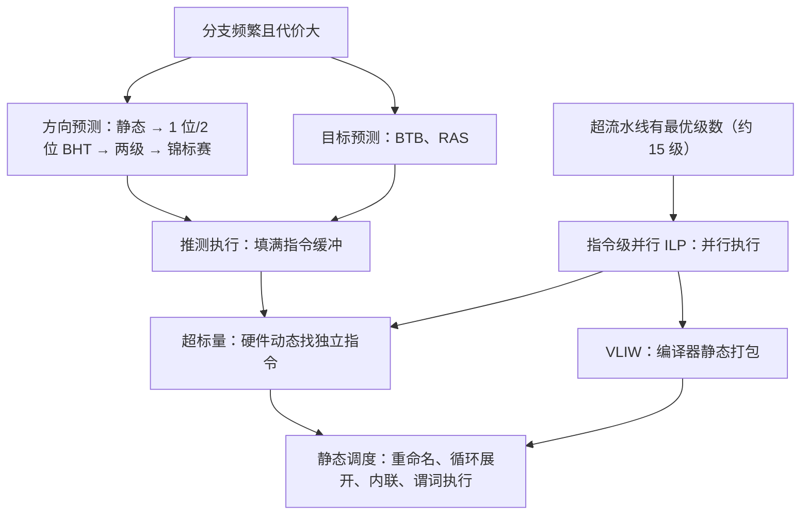

# L04 分支预测与多发射处理器

[课程目录](../index.md)

分支在程序中极其频繁，而深流水线和多发射又把每次猜错的代价放大成十几个周期，本讲先解决“分支怎么预测”，再回答“流水线加深到头之后怎样继续提高性能”。路径是：从分支的方向与目标出发，依次讲静态预测、动态预测（1 位、2 位、两级、锦标赛）和目标预测（BTB、RAS）；然后从超流水线的最优级数转到指令级并行，比较由硬件动态调度的超标量与由编译器静态调度的 VLIW；最后讲编译器的静态调度与寄存器重命名、循环展开、函数内联。阅读前需要掌握 L03 的五级流水线、转发、load-use 停顿和控制冒险。

## 章节导航

- [01 分支预测的动机](chapters/01-why-branch-prediction.md)：分支频繁且代价高，方向与目标需分别预测
- [02 静态分支预测](chapters/02-static-branch-prediction.md)：四种静态方向预测的规则、准确率与停顿实现
- [03 动态分支预测](chapters/03-dynamic-branch-prediction.md)：1 位 BHT、2 位饱和计数器、相关与锦标赛预测
- [04 分支目标预测](chapters/04-branch-target-prediction.md)：BTB 预测分支目标，RAS 预测函数返回地址
- [05 超流水线与指令级并行](chapters/05-super-pipelining-and-ilp.md)：超流水线的收益与代价、最优级数、ILP 两条途径
- [06 超标量处理器](chapters/06-superscalar-processors.md)：超标量的 N 路结构、执行策略与依赖处理
- [07 VLIW 与编译技术](chapters/07-vliw-and-compilation.md)：VLIW 静态多发射、循环展开与谓词执行
- [08 静态调度与编译优化](chapters/08-static-scheduling-and-compiler-optimization.md)：静态调度、简单循环、重命名、展开与内联

## 本讲小结

本讲的两半由同一个问题串起来：要让每个周期完成更多指令，就必须不断取到正确的指令，并找到彼此独立的指令。分支预测保证前者，超标量、VLIW 和编译器调度负责后者。

### 如何选择

| 问题 | 硬件动态手段 | 编译器静态手段 |
| --- | --- | --- |
| 分支方向难猜 | 1 位/2 位 BHT、两级、锦标赛预测 | BTFNT、剖析引导、likely/unlikely、谓词执行 |
| 分支目标未知 | BTB、RAS | — |
| 数据依赖与假相关 | 乱序执行、Tomasulo 硬件重命名、ROB | 指令调度、寄存器重命名 |
| 独立指令太少 | 扩大指令窗口、靠分支预测填满指令缓冲 | 循环展开、函数内联 |
| 代价 | 硬件复杂、功耗高 | 视野不含动态信息（缓存缺失、分支行为变化）、代码膨胀 |

### 核心公式

| 公式 | 含义 |
| --- | --- |
| $\text{Target} = PC + \text{imm}$ | 直接分支的目标地址 |
| $\text{Speedup} = \frac{4.1\ \text{ns}}{1.2\ \text{ns}} \approx 3.42$ | 流水线加速比由最长一级决定，理想值为级数 5 |
| $T \to \frac{T}{m}$ | 超流水线把每级拆成 $m$ 个子级后的时钟周期 |
| 冲刷 $k-1$ 条 | 分支在第 $k$ 级才判定时一次误预测的冲刷条数 |
| 1 位 $\frac{3}{5}=60\%$，2 位 $\frac{4}{5}=80\%$ | 每轮 T T T T NT 循环的稳态准确率 |
| $\text{Execution Time} = IC \times CPI \times CCT$ | 编译器影响 $IC$ 与 $CPI$，不影响 $CCT$ |

## 不确定事项

- 08：s2p80 右图没有完整重画调度后的时序，正文中的 6 周期排法（LD；SUBI；ADDD；stall；BNEZ；SD 8(R1)）按延迟表推导得出，与图中“5 stalls → 1 stalls”一致，但图中各指令的具体位置无法逐一核对
- 08：重命名例“4 周期”取决于 WAR 是否允许同周期发射；讲义依赖图隐含允许，而 s2p72 写的是同周期指令不能有 WAR，两者不一致，正文已列出两种情况
- 03：附录 2 位方案约 80% 与正文最好约 90% 的统计口径不同，讲义没有给出附录数据的来源
- 01：4 路超标量停顿吞吐的例题是根据课程数据构造的计算练习，并非讲义原题

> [!info]- 来源
> - L04.pdf：PDF p.3–89, 103–110
> - L04.docx：DOCX body 1–418
