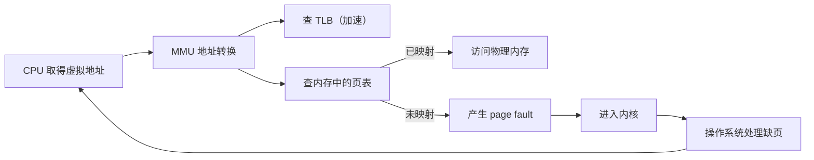

# 01 课程视角与典型流程

[本讲目录](../index.md) · [课程目录](../../index.md) · [下一节：02 hello world 的加载](02-hello-world-from-command-to-process.md)

> [!abstract] 本节要点
> - 本课程从三个角度看操作系统：它**怎样运行起来**（动态过程）、**设计**时有哪些考虑、**实现**时有哪些具体做法；学每一部分都要先判断它属于设计思想还是实现细节。
> - 学习对象分三类：**基本概念**（共同术语，不是死记）、**典型流程**、**关键技术**；其中流程是全课的主线。
> - 流程有大有小：“执行一个程序”是全流程，里面嵌套创建进程、exec、缺页、打开文件、I/O 等小流程；每个流程要抓住重要函数和主要步骤。
> - 缺页异常是“硬件发现问题 → 进入内核 → 操作系统解决问题”的典型例子：MMU 转换虚拟地址时发现该页没有映射到物理内存，就产生 page fault。
> - “操作系统做了什么”可以用三个关键词概括：**功能**、**服务**、**状态转换**。

## 三条主线：运行、设计、实现

一门操作系统课的内容很多，如果没有一个统一的视角，很容易学成一堆零散的知识点。本课程用三个问题组织所有内容：[^s2b1]

1. **操作系统怎么运行起来**：强调动态过程，即一个事件发生后，系统一步一步把它处理完的过程。
2. **设计环节有哪些考虑**：为什么这样分模块、为什么这样分层、要达到什么目标（如可移植、性能）。
3. **实现环节有哪些具体做法**：数据结构、函数、代码路径。

学任何一部分时都可以问：它讲的是**设计思想**还是**实现细节**？设计思想通常跨系统通用，实现细节则随 xv6、Linux、Windows 而不同。

## 构造性的学习方法

操作系统建立在大量先修知识之上（尤其是 ICS 中的处理器、虚拟内存、异常控制流、链接与加载）。如果这些旧知识没有被调出来，新课的很多内容会显得凭空出现。为此，推荐的学习方法有三步：

1. **激活旧知识**：开始一门新课（或新的一章）前，花 10–20 分钟翻一翻先修课的目录，找出与本课相关的部分。花的时间不多，但特别有效。
2. **对接整合**：把新学的内容与旧知识连起来。大学四年的知识最终应当是“一整片”，而不是互不相关的点。
3. **分析、归类、关联**：每学一样东西，分析它是什么，把它归到自己知识体系中合适的位置，再把它与相关内容关联起来。

这个过程不断重复，知识就逐渐变得完整、有条理。这种学习方式称为**构造性思维**：一点点添加、不断迭代，而不是指望一次把所有内容学完。本讲讲的 hello world 流程就是一个粗流程，等各个部件（进程、内存、文件系统、I/O）讲完后，还要回到这个流程中逐步细化。

## 基本概念、典型流程与关键技术

本课程的学习对象可以分为三类：[^s2b1]

- **基本概念**：一套**术语**，是大家讨论问题时的共同语言，而不是要死记硬背的条文。例如 PCB 这个缩写在化学、电路等领域另有含义，但在计算机专业人士之间，PCB 一定指**进程控制块**（Process Control Block），即操作系统中最重要的数据结构之一。掌握基本概念，就是要让自己描述问题时用的词与同行达成共识。
- **典型流程**：系统处理一件事的动态步骤序列。最大的流程是“执行一个程序”。任何程序的执行全流程都与 hello world 一样，只是实际程序中有更多函数调用、系统调用和分支，因而会在大流程里遇到更多小流程。
- **关键技术**：比较具体的一项机制，例如在 ICS 中学过的**重定向**（redirection）和**信号**（signal）。

流程是嵌套的：执行程序这个大流程依赖创建进程、exec 等小流程，小流程内部又有自己的步骤。学习时要关注两件事：**每个流程中的重要函数**，以及**它的主要步骤**。缺页异常、打开文件、I/O 都是这样的流程，课程后面会逐一梳理。

## 以缺页异常为例的流程

缺页异常是 ICS 已经学过的流程，这里用它来说明“流程”应当怎样理解。

CPU 执行程序时，要先拿到一个地址，再到这个地址去取指令。CPU 拿到的地址是**虚拟地址**（virtual address），它属于**虚拟地址空间**；而真正存放数据的是**物理内存**，二者是两个不同的空间。虚拟地址不能直接用来访问物理内存，必须先转换：

1. **发出虚拟地址**：CPU 把虚拟地址交给硬件部件 **MMU**（内存管理单元，Memory Management Unit）。
2. **查表转换**：MMU 内部有转换机制，但它要用到一个放在内存中的数据结构，即**页表**（page table）。为了加快转换，又设置了 **TLB**（Translation Lookaside Buffer，快表），缓存最近用过的转换结果。
3. **发现问题**：如果这条指令所在的页还没有真正映射到物理内存（仍只存在于虚拟地址空间中），MMU 就产生一个 **缺页异常**（page fault）事件。
4. **进入内核**：异常使 CPU 转入内核，由操作系统接手。
5. **解决问题**：操作系统处理缺页（如分配物理页、把内容读入、建立映射），之后程序继续执行。

这个流程的骨架是：**硬件发现问题 → 进入内核 → 操作系统解决问题**。后面会看到，系统调用、中断等事件也都有类似的“进内核、处理、出内核”结构。hello world 执行时第一条指令就会触发缺页，具体如何处理、处理完从哪里继续，见[hello world 的运行](03-hello-world-scheduling-page-fault-system-calls.md)。

## 操作系统做了什么：三个关键词

本讲的主题是“操作系统做了什么”。可以先用三个关键词来概括（它们是重点，但不是全部）：[^s2b1]

- **功能**：操作系统有许多功能模块，如进程管理、内存管理、文件系统、I/O。
- **服务**：操作系统为用户和程序提供服务，例如用户要打开一个文件，由操作系统代为完成。
- **状态转换**：在提供功能和服务的过程中，系统和程序会不断改变状态，例如在用户态与内核态之间来回切换。

接下来用 hello world 的执行全流程来具体展示这三个关键词，见[hello world 的加载](02-hello-world-from-command-to-process.md)。

> [!question]- 自测：程序访问一个合法但尚未调入内存的地址，MMU、页表、操作系统分别扮演什么角色？
> MMU 负责把虚拟地址转换为物理地址，并在转换中发现“该页未映射”；页表是 MMU 转换时查阅的、存放在内存中的数据结构；操作系统在缺页异常进入内核后负责解决问题（分配物理页、读入内容、更新映射）。分工就是“硬件发现问题、操作系统解决问题”。

> [!question]- 自测：学习“ELF 文件头中有 magic number”和“程序加载前要检查文件类型”，各自更接近设计思想还是实现细节？
> “加载前要检查文件是否可执行”是设计层面的要求，任何系统都要做；“用 ELF 头中的 magic number 判断”是 Linux/UNIX 一系的具体实现方式，Windows 使用另一种可执行格式，判断方式也不同。

> [!info]- 来源
> - L01.docx：DOCX body 1–32

[^s2b1]: L01.docx-DOCX body 1-32

[本讲目录](../index.md) · [课程目录](../../index.md) · [下一节：02 hello world 的加载](02-hello-world-from-command-to-process.md)
