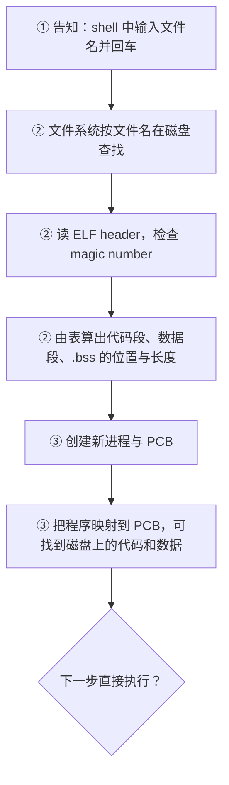

# 02 hello world 的加载

[本讲目录](../index.md) · [课程目录](../../index.md) · [上一节：01 课程视角与典型流程](01-course-perspective-and-typical-flows.md) · [下一节：03 hello world 的运行](03-hello-world-scheduling-page-fault-system-calls.md)

> [!abstract] 本节要点
> - hello world 只做两件事：`puts` 和 `return`，二者最终都要通过系统调用进入内核。
> - 第 1 步**告知**：在 shell 中输入可执行文件名并回车；此时运行的是 shell，shell 只是接口（界面），不是操作系统。
> - 第 2 步操作系统接管：经**文件系统**（磁盘的抽象）按文件名找到文件，再根据 **ELF** 文件头中的 **magic number** 检查它是否为可执行文件，并通过头部找到的表算出代码段、数据段、`.bss` 的位置与长度。
> - 第 3 步**创建进程**：新建进程及其 **PCB**，把 hello world 程序映射到 PCB 上；由于虚拟内存按需调入，此时并不把代码读进内存。
> - 程序执行的第一条指令不是 `main` 的代码，可以用 `objdump` 查看。

## hello world 做了什么

hello world 是最小的完整程序，但它的执行过程和任何程序的全流程是一样的，因此适合用来观察操作系统“做了什么”。

```c
#include <stdio.h>

int main(void) {
    puts("hello world");
    return 0;
}
```

不分析语法，只看它做的事情：程序只做了两件事，**`puts`**（输出一个字符串）和 **`return`**（结束）。在操作系统的视角里，这两件事都要通过**系统调用**（system call）进入内核才能完成。[^s2b2]

> [!note] 补充解释
> 严格说，`puts` 是 C 标准库函数，它在库内部最终调用 `write` 系统调用把字符串写到标准输出；`main` 中的 `return` 会返回到 C 运行时启动代码，由它调用 `exit`，最终发出结束进程的系统调用。所以“二者都是系统调用”指的是它们最终都要进入内核。

> [!question] 思考题：hello world 程序执行时的第一条指令是什么？是 main 函数（输出）的代码吗？
> 一个可执行文件被加载并开始运行时，CPU 执行的第一条用户态指令在哪里？是不是 `main` 中调用 `puts` 的那段代码？
>
> **提示**：回想 ICS 中链接与加载的内容，用 `objdump` 反汇编编译好的可执行文件，看看 ELF 头记录的入口地址对应哪个符号，以及 `main` 是被谁调用的。
>
> > [!success]- 解答（老师课上给出）
> > 结论：第一条指令**肯定不是 `main` 的代码**。可以用 ICS 中要求掌握的工具 `objdump` 查看编译后的可执行文件来验证。[^s2b2] 另一个旁证来自栈：`main` 的栈帧并不是栈中的第一个栈帧，在 `main` 之前已经有内容被压入栈中，说明 `main` 是被其他代码调用的。[^s2b8]
> >
> > 以下细节为据此补充（以 Linux + glibc 为例）：
> >
> > 1. `readelf -h hello` 可看到 ELF 头中的 `Entry point address`（入口地址）。
> > 2. `objdump -d hello` 反汇编后会发现，入口地址对应的符号是 `_start`（来自 C 运行时启动文件 `crt1.o`），而不是 `main`。
> > 3. `_start` 整理好栈上的参数后调用 `__libc_start_main`，后者完成库的初始化，再调用 `main`；`main` 返回后由它调用 `exit`。
> > 4. 对动态链接的程序，内核实际先把控制权交给动态链接器（如 `ld-linux`）的入口，由它完成共享库装载后，再跳到程序自己的 `_start`。

## 第 1 步：告知系统

要执行 hello world，首先要“告诉系统：请帮我执行这个程序”。前提是 hello world 已经编译成了**可执行文件**。

最传统的告知方式是**命令行**：在 shell 的提示符下输入可执行文件名并回车。此外也可以在菜单中选择、在 IDE 中创建工程并运行，本质都是“告知”。

这一步要注意：在回车之前，运行的是 **shell**，而不是操作系统。**shell 不是操作系统**，它只是用户与系统交互的**接口**或**界面**（interface）。因此第 1 步处于**用户态**。[^s2b2]

## 第 2 步：查找并检查可执行文件

告知之后，操作系统接管。它的第一件事是**找到 hello world 程序的相关信息**，这一步包括两部分。

**按文件名查找**：用户给出的是一个文件名，文件实际存放在磁盘上。负责磁盘的是**文件系统**（file system），文件系统是对磁盘的抽象。按文件名查找需要文件系统的若干步骤，这些细节留到文件系统一章再展开。

**检查是否为可执行文件**：找到文件后，必须保证它的类型是可执行文件；而要从文件中取出内容，就必须知道它的格式。本课程以 Linux/UNIX 这一系为背景（xv6 也属于这一系；Windows 是另一大家族），因此可执行格式是 **ELF**（Executable and Linkable Format，可执行与可链接格式），即 ICS 中学过的可链接、可加载的格式。

ELF 按约定分成若干部分，每部分存放特定信息，其中开头最重要的是 **header**（文件头）：[^s2b2]

1. **检查 magic number**：header 中有一个 **magic number**（魔数），它决定这个文件是不是可执行文件。对上了，才继续往下做（这里不讨论出错的情况）。
2. **找到描述各段的表**：根据 header 中的信息，在文件某个位置找到另一张表（program table 或 section table）。
3. **得到代码与数据的位置**：这张表告诉我们代码从文件中的哪个相对位置开始、长度是多少，这样就能找到程序的全部代码；数据同理，并且可以细分为只读数据 `.rodata`、一般的 `.data`，以及 `.bss` 段。
4. **计算并保存地址信息**：算出这些位置和地址后，把信息保存在某个地方，供后续使用。

这一步实际上“什么都没执行”，只是计算出了一些信息。

> [!note] 补充解释
> - ELF 的 magic number 是文件最开头的 4 个字节 `0x7F 'E' 'L' 'F'`；ELF header 还记录文件类型（可执行文件、目标文件、共享库）、目标体系结构和程序入口地址。
> - ELF 中有两张表：**program header table** 描述加载时要映射到内存的 segment（加载器主要用它），**section header table** 描述 `.text`、`.rodata`、`.data`、`.bss` 等 section（链接器主要用它）。
> - `.bss` 存放未初始化（或初始化为 0）的全局变量和静态变量，文件中只记录它的大小，不占实际文件空间，加载时再分配并清零。

### header 思想

“大结构前先放一个 header”是计算机中非常普遍的设计：header 规定占多少字节、每几个字节代表什么含义，读的一方按约定解析，就能得到后面内容的信息。网络中的 IPv4、IPv6 报文也是这样：报文就是一串字节，协议规定哪几个字节表示什么，接收方据此解析。这种按约定解析的工作，本质上与计算概论中字符串匹配一类问题相似，只是规则更复杂。

## 第 3 步：创建进程并建立映射

可执行文件只是**程序**，程序真正运行起来才是**进程**（process）。可以用一张图来想象：底下是内核，上面跑的都是进程。

因此，执行 hello world 实际上是**创建一个新进程，并让这个进程与 hello world 程序映射到一起**：

1. **创建进程**：每个进程一创建就要有一个 **PCB**（进程控制块）。这一步由**进程管理**模块负责。
2. **建立映射**：把 hello world 程序映射到 PCB 上，使得通过 PCB 能找到 hello world 的名字或相关信息，进而找到磁盘上的那块代码和数据。[^s2b2]

这个映射为什么重要？因为有了虚拟内存，程序的内容并不是一下子全部装入内存，而是**需要时再调入**。进程运行中一旦需要某段代码或数据，就顺着这个映射到磁盘上去找。也就是说，第 3 步结束时，进程已经创建好、映射关系已经建立，但代码还在磁盘上，内存中什么都没有装。



至于建立映射之后是不是马上执行，以及之后如何运行，见[hello world 的运行](03-hello-world-scheduling-page-fault-system-calls.md)。

> [!warning] 易错点
> - 输入命令并回车时运行的是 shell，不是操作系统；操作系统是在接到请求后才“接管”的。
> - 第 2、3 步结束时程序代码**并没有**读入内存，只是算好了它在文件中的位置并在 PCB 中建立了映射；真正读入发生在运行时的缺页处理中。

> [!question]- 自测：把一个文本文件 `notes.txt` 加上执行权限后在 shell 中直接运行，按本节流程会在哪一步出问题？
> 第 2 步。文件系统能按名字找到它，但检查格式时它的开头不是 ELF 的 magic number，操作系统判定它不是可执行文件，不会进入第 3 步去创建进程并建立映射。（实际系统还可能尝试其他规则，例如 `#!` 开头的脚本，但不满足 ELF 格式就不能按 ELF 加载。）

> [!question]- 自测：一个 2 GB 的程序启动后，第 3 步结束时内存中已经有它的多少代码？为什么启动不必等 2 GB 全部读完？
> 几乎没有。第 2 步只计算了各段在文件中的位置和长度，第 3 步只在 PCB 中建立了到磁盘内容的映射；因为虚拟内存按需调入，代码要等运行中真正访问到某一页时才读入。

> [!info]- 来源
> - L01.docx：DOCX body 33–62, 200–221

[^s2b2]: L01.docx-DOCX body 33-62
[^s2b8]: L01.docx-DOCX body 200-221

[本讲目录](../index.md) · [课程目录](../../index.md) · [上一节：01 课程视角与典型流程](01-course-perspective-and-typical-flows.md) · [下一节：03 hello world 的运行](03-hello-world-scheduling-page-fault-system-calls.md)
