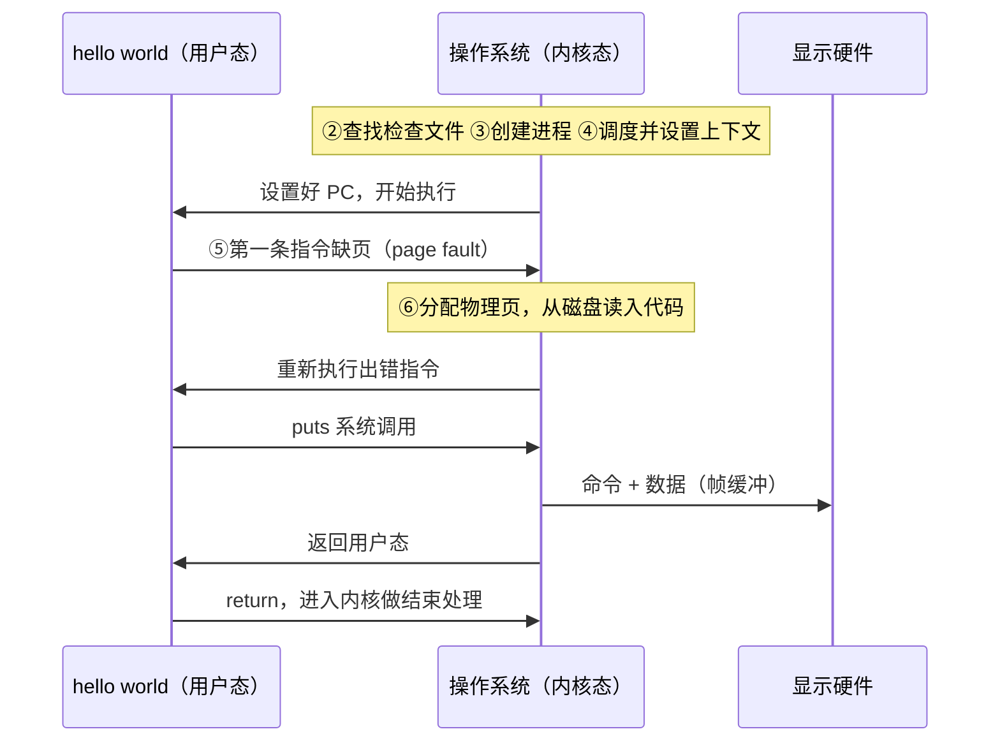

# 03 hello world 的运行

[本讲目录](../index.md) · [课程目录](../../index.md) · [上一节：02 hello world 的加载](02-hello-world-from-command-to-process.md) · [下一节：04 典型操作系统结构](04-typical-operating-system-structures.md)

> [!abstract] 本节要点
> - 第 3 步创建好进程后不直接执行，而是统一交给**调度**；调度选中 hello world，才进入第 4 步。
> - 第 4 步**设置 CPU 上下文**并“跳到”程序开始处：本质是设置好 PC 等寄存器，下一个指令周期 CPU 自然到 PC 指向处取指，并没有一条真的跳转指令。
> - 执行第一条指令**必然发生缺页异常**，因为前面的步骤从未把虚拟地址映射到物理地址；缺页处理完后**重新执行**这条出错的指令。
> - 用户态/内核态划分：第 1 步用户态；第 2、3、4 步内核态；第 5 步发生缺页时仍是**用户态**；之后的缺页处理在内核态。
> - `puts`、`return` 又各自通过系统调用进出内核；整个过程中文件系统、进程管理、调度、内存管理、I/O 全部上阵，程序不断进内核、出内核。

## 调度与设置 CPU 上下文

第 3 步已经创建好进程，按直觉下一步就该执行了。但第 3 步做完**并不直接**做第 4 步：系统中有许多进程，创建好的进程都要**统一交给调度**（scheduling），由**调度程序**（scheduler）决定下一个在 CPU 上运行的是谁。[^s2b3]

- 如果调度程序选中了 hello world，就为 hello world 设置上下文，进入第 4 步；
- 如果选中的是另一个进程，就为那个进程设置上下文。

调度就像一只“看不见的手”，在流程中反复出现：第 3 步与第 4 步之间并不是直通的，中间插着一次调度。下面的讨论都假设调度选中了 hello world。

> [!tip] 课堂强调
> 这个调度插入点是有意标出的重点：不要把“创建好进程”和“开始执行”看成连续的两步，二者之间总隔着一次调度。[^s2b3]

要让 CPU 执行 hello world，就要**设置 CPU 上下文环境**。一个程序在 CPU 上运行所需的处理器状态称为**上下文**（context），在 ICS 中已经学过，这里称为 CPU（处理器）上下文环境。

第 4 步是“设置好上下文，然后跳到程序开始处”。这里的“跳到”不能理解为执行了一条跳转（jump）指令。回到对处理器最基本的理解：[^s2b3]

1. CPU 的工作只有一件事：到 **PC**（程序计数器）中取地址，再到这个地址取指令执行；PC 里放的是什么，CPU 就执行什么，它不关心别的。
2. 设置上下文时，把 PC 设成程序开始处的地址（同时设置好其他寄存器）。
3. 下一个指令周期，CPU 自然就到这个地址取指令执行了。

所以“跳到”只是一种说法：设置好 PC，执行就自然发生了。

## 第一条指令与缺页异常

调度选中 hello world、设置好上下文后，CPU 开始执行它的**第一条指令**。这条指令用的是**虚拟地址**，而回顾前面的步骤：第 2 步只计算了代码在文件中的位置，第 3 步只在 PCB 中建立了到磁盘的映射，**没有任何一步把虚拟地址映射到物理地址**。因此执行第一条指令**一定会**发生**缺页异常**（page fault）。[^s2b3]

缺页可能由多种原因引起，但都走 page fault 的大流程（流程骨架见[课程视角与典型流程](01-course-perspective-and-typical-flows.md)）。发生缺页后，又进入内核。

### 缺页处理与重新执行

第 6 步由操作系统的**内存管理**模块完成：

1. **分配物理页**：为缺页的虚拟页分配一块物理内存页。
2. **从磁盘读入代码**：第 2 步已经算好了代码在可执行文件中的相对位置，而文件在哪里也是已知的，于是把对应内容从磁盘读入刚分配的物理页。一次读一页还是读几页，取决于系统的调入策略。
3. **继续执行**：读入后，hello world 继续执行。

这里的“继续执行”是指从哪一条继续？ICS 的**异常控制流**中讲过，异常（或中断）处理完后有三种返回策略：[^s2b3]

| 返回策略 | 含义 | 典型情况 |
| --- | --- | --- |
| 返回下一条指令 | 处理完后从下一条指令继续 | 系统调用等 |
| 不再返回 | 出了严重错误，程序无法继续，被终止 | 致命错误 |
| 重新执行当前指令 | 在这条指令上出了问题，处理完后重新执行它 | 缺页异常 |

（“典型情况”一列中，系统调用与致命错误两例按 ICS 异常分类补充。）

缺页属于第三种：要重新执行的正是刚才发生 page fault 的那条指令。问题在于，执行一条指令时 PC 已经指向下一条，不能再从 PC 中取得出错指令的地址。所以发生异常时，**硬件必须把出错指令的地址保存到某个地方**，处理完后再从那里取回。如果由你来设计，也必须这样做；否则就无法重新执行同一条指令。

> [!note] 补充解释
> 两种体系结构中保存位置的例子：x86 发生 page fault 时，硬件把出错指令的地址（EIP/RIP）连同其他状态压入内核栈，并把引起缺页的虚拟地址放入控制寄存器 CR2。RISC-V 在 S 模式处理异常时，出错指令地址保存在 `sepc`，引起缺页的地址保存在 `stval`，异常原因写入 `scause`（例如取指缺页的原因码为 12）。异常返回指令 `sret` 回到 `sepc` 处，若处理程序不修改 `sepc`，就恰好重新执行出错指令。

hello world 很小，一页基本就装下了全部代码，所以通常只缺页一次。若是一个大程序（如大型游戏），读入一页后还可能需要下一页，就会多次发生缺页。

## 用户态与内核态的划分

把前面的步骤按 CPU 所处的状态分开：

| 步骤 | 内容 | 状态 | 负责模块 |
| --- | --- | --- | --- |
| 1 | 在 shell 中告知 | 用户态 | （shell） |
| 2 | 查找文件、检查 ELF、算出地址 | 内核态 | 文件系统 |
| 3 | 创建进程、建立映射 | 内核态 | 进程管理 |
| 4 | 调度选中、设置 CPU 上下文 | 内核态 | 调度 |
| 5 | 执行第一条指令，发生缺页 | **用户态** | — |
| 6 | 分配物理页、读入代码 | 内核态 | 内存管理 |

> [!tip] 课堂强调
> 考试会问哪些步骤在用户态、哪些在内核态（不要求写出细节）：第 1 步是用户态，第 2、3、4 步是内核态，**发生缺页的第 5 步仍是用户态**。不少同学把这一步也看成内核态，但它只是事件发生了，还没有进入内核；进入内核后的缺页处理才是内核态。[^s2b3]

> [!warning] 易错点
> 判断依据是“此刻 CPU 在执行谁的代码”：第 5 步时 CPU 在执行 hello world 自己的指令，缺页是在这条用户指令上发生的事件；只有异常把 CPU 切换进内核，开始执行操作系统的缺页处理代码，才算进入内核态。

## puts 与 return：再次进出内核

缺页处理完，hello world 的代码已经在内存中，接下来执行 `puts`。执行 hello world 本身的代码时处于**用户态**；一旦执行 `puts`，就通过系统调用**又进入内核**。[^s2b3]

内核中处理输出的大框架是：

1. **找到显示设备**：`puts` 的输出目标是**标准输出**（standard output）。
2. **交给负责者**：标准输出一般由某个进程（或驱动）负责管理，内核把内容交给它，由它去显示。
3. **与显示硬件约定命令和数据**：与任何设备打交道都要说两件事，一是**命令**（例如“请显示”），二是**数据**（显示什么）。数据放在双方共同约定的**帧缓冲**（frame buffer）中，无论是像素屏、LED 还是其他显示器，只要把内容放进帧缓冲即可。[^s2b4]
4. **硬件完成显示**：之后的转换由视频硬件或显卡完成，屏幕会不断**刷新**。用相机拍摄投影画面，有时能拍到刷新的痕迹，就说明屏幕在不断刷新。

于是屏幕上出现了 `hello world`。但流程还没结束，还有 `return`：它同样进入内核，内核做相应的结束处理，然后再出来。

## 麻雀虽小，五脏俱全

回顾整个过程，一个只有两条语句的程序，用到了操作系统的全部几大功能模块：[^s2b4]

- **文件系统**：按文件名查找可执行文件；
- **进程管理**：创建进程和 PCB；
- **调度**：选中 hello world 并设置上下文；
- **内存管理**：处理缺页、分配物理页；
- **I/O**：把字符串输出到显示器。

同一个过程可以从两个视角看：

- **以 hello world 为中心**：它在执行过程中不断地进内核、出内核；
- **以操作系统为中心**：操作系统一次又一次地调度 hello world 执行。

无论哪个视角，结论都一样：一个程序的执行过程中会反复进出内核。这就是对操作系统工作方式的整体印象。内核里有什么、内核外有什么，通过对比典型操作系统结构来归纳，见[典型操作系统结构](04-typical-operating-system-structures.md)。

> [!question]- 自测：一个 50 页大小的程序，假设调入策略是每次只读一页且代码顺序执行、无跳转，至少会发生几次取指缺页？每次缺页后从哪里继续？
> 至少 50 次（每页第一次被取指时缺页一次）。每次缺页处理完后，都重新执行发生缺页的那条指令，而不是它的下一条；这依赖硬件在异常时保存了出错指令的地址。

> [!question]- 自测：某同学认为“第 4 步设置上下文后，内核执行了一条 jump 指令跳到 hello world 的入口”。这种说法错在哪里？
> 并不存在专门跳到程序入口的那条跳转。设置上下文就是把 PC 等寄存器设成 hello world 的状态；CPU 只按 PC 取指，下一个指令周期它自然就到入口处取指执行。“跳到”只是对这个效果的描述。

> [!question]- 自测：在 hello world 输出字符串的那一刻之前，CPU 至少经历了几次“用户态 → 内核态”的转换？分别由什么引起？
> 至少三次：第 1 步 shell 把执行请求交给操作系统（第 2–4 步在内核中完成）；第 5 步第一条指令缺页；`puts` 发出系统调用。之后 `return` 还会再进一次内核。

> [!info]- 来源
> - L01.docx：DOCX body 63–114

[^s2b3]: L01.docx-DOCX body 63-89
[^s2b4]: L01.docx-DOCX body 90-114

[本讲目录](../index.md) · [课程目录](../../index.md) · [上一节：02 hello world 的加载](02-hello-world-from-command-to-process.md) · [下一节：04 典型操作系统结构](04-typical-operating-system-structures.md)
