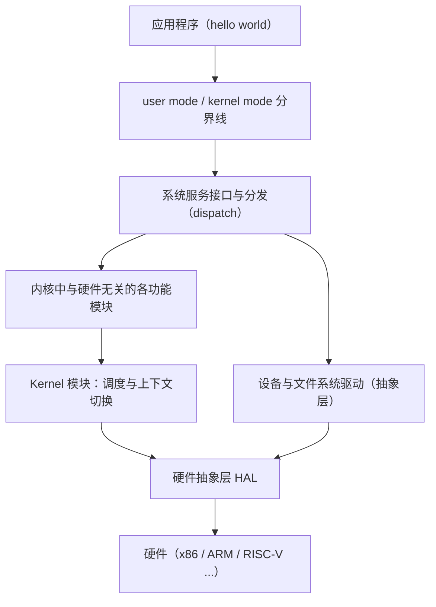
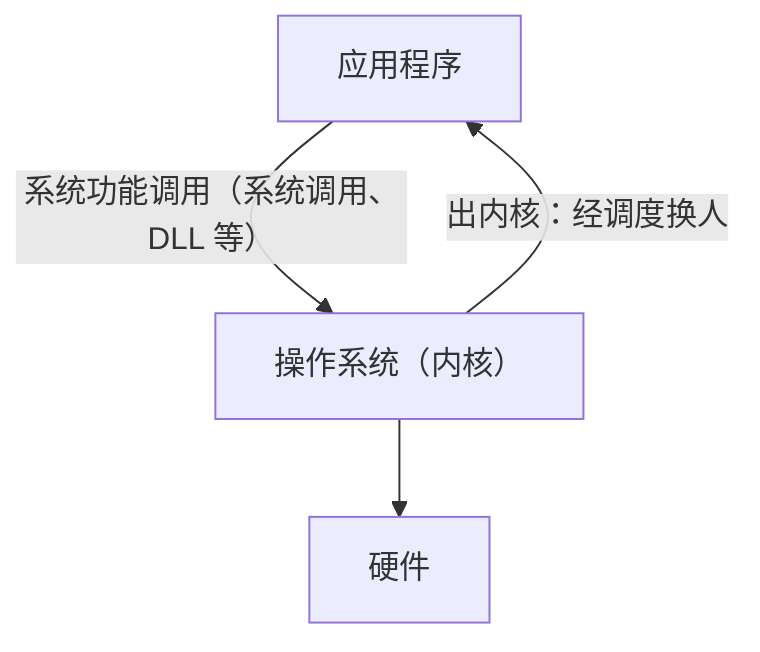
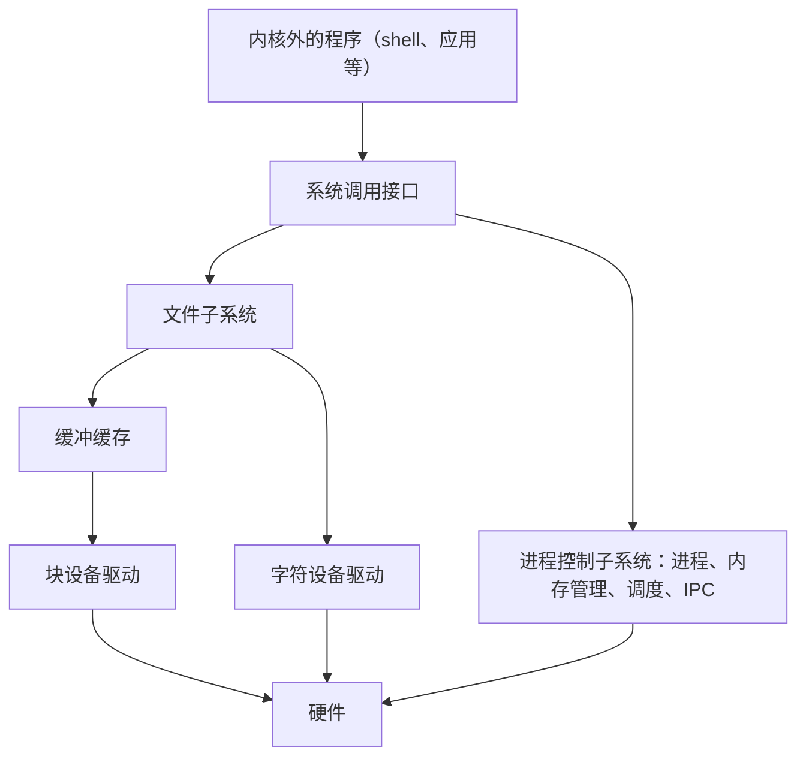

# 04 典型操作系统结构

[本讲目录](../index.md) · [课程目录](../../index.md) · [上一节：03 hello world 的运行](03-hello-world-scheduling-page-fault-system-calls.md) · [下一节：05 操作系统名称与硬件](05-os-name-origin-and-hardware-complexity.md)

> [!abstract] 本节要点
> - 看结构图要“看门道”，不是记每个模块：最重要的是 **user mode / kernel mode 分界线**，应用在上、操作系统在下，程序反复穿越它。
> - 应用程序与操作系统之间的接口统称**系统功能调用**（形式有系统调用、DLL 等）；接口下方有**分发**（dispatch），决定由内核哪个功能来服务；出内核时统一经过调度“换人”。
> - 为了**可移植**，硬件相关信息封装在**硬件抽象层 HAL** 中；但调度与上下文切换逃不开硬件，Windows 把这部分放在 Kernel 模块里。
> - 微内核把模块移出内核，但**频繁进出内核必然降低性能**，Windows NT 后来又把图形子系统移回内核。
> - UNIX 把进程、内存、调度、IPC 放在一个**进程控制子系统**中；设备分**字符设备**和**块设备**，为缓和速度差引入了**缓冲缓存**这一早期的软件缓存思想。所有系统的共性是**分层，其中一层是内核**，其上是运行时、库、中间件、应用框架。

hello world 的流程已经展示了程序如何进出内核。接下来要回答：**内核里有什么，内核外有什么**。方法是对比几个典型操作系统的总体结构，然后归纳共性。

看结构图要“内行看门道”：不是去记每个函数、每个模块是干什么的，而是看总体结构，理解为什么这样画、为什么底层有某一层。

## Windows：用户态/内核态与硬件抽象

Windows（NT 架构）的总体结构大约在 1988 年就基本定型。它有几个值得看的门道。[^s2b4]

**第一，用户态与内核态的分界线**。这是结构中最重要的一条线：上面是 **user mode**（用户态），hello world 这样的程序在这里；下面是 **kernel mode**（内核态），操作系统在这里。程序从上面“掉”进内核，在里面做完事再出来，这个过程反反复复。

**第二，分发**。用户态与内核态之间接口的正下方有一个重要环节：用户态进入内核后，究竟由内核的哪一个功能来服务它？必须有一个**分发**（dispatch）工作来决定转交给谁。

**第三，硬件抽象层**。操作系统是硬件之上的第一层软件，一定要与硬件打交道。但如果每个功能模块都直接操作硬件，那么硬件一换（例如从 x86 换成 RISC-V 或 ARM），很多功能都得改。所以操作系统从设计之初就要追求**可移植性**（portability）。Windows 的做法是：

1. 设一个**硬件抽象层**（HAL，Hardware Abstraction Layer），把与硬件相关的信息封装在这一层里。
2. HAL 之上的 **Kernel 模块**（Windows 内核中一个就叫 Kernel 的模块）负责**调度与上下文切换**：把 A 进程换下、把 B 进程送上 CPU，这一定与具体硬件相关，逃不掉，所以 Kernel 中有一部分硬件相关代码。
3. 除这两处外，其余部分都与硬件无关，不管底下是 x86、ARM、MIPS 还是 RISC-V。

Windows 内核中的 device and file system drivers（设备与文件系统驱动）看名字像是与硬件相关的，但它其实是一层**抽象**，真正与硬件打交道的部分在 HAL 之下。

### 微内核与性能

Windows NT 的设计理念之一是**微内核**（microkernel）思想：20 世纪 80 年代微内核正热，而此前的 Windows 3.1 等版本主要以漂亮的图形界面著称，人们对其底层技术不太了解。为了证明底层技术实力，Windows NT 采用微内核，把图形子系统等放到了内核外（NT 结构图中常以灰色标出这部分）。[^s2b4]

问题在于，图形界面是用得最频繁的部分，放在核外就要每次进内核、出内核。早就有结论（例如比较用 PV 操作还是加锁哪种性能更好时就涉及）：**反复多次进出内核一定会降低性能**。所以后来 Windows 又把这部分移回了内核。

> [!note] 补充解释
> 这一调整发生在 Windows NT 4.0（1996 年）：原先在用户态子系统进程中实现的窗口管理器和图形设备接口（GDI）被移入内核态（`win32k.sys`）。因此 Windows NT 常被描述为“混合内核”而非纯粹的微内核。

### 抽象模型：系统功能调用

把 Windows 的结构再抽象一层，可以得到一个适用于所有系统的模型：[^s2b5]

1. **硬件之上包一层操作系统**。
2. **应用程序与操作系统之间一定有一个接口**，笼统地称为**系统功能调用**。它的形式多种多样（系统调用、DLL 等），但作用相同：连接应用程序和操作系统。应用需要操作系统服务，就按接口编写代码，操作系统按既定路径把事情完成。
3. **出内核时统一经过调度**：从内核出来时要“换人”，由调度决定接下来谁运行。

## UNIX：经典的层次结构

UNIX 的结构是最经典的，其结构图一直沿用到现在。最早画成同心圆，现在多画成层层往上叠的形式：[^s2b5]

1. 最里层（最底层）是**硬件**；
2. 硬件之外是操作系统的**内核**（kernel）；操作系统不只有内核，内核之外还有许多内容；
3. 内核外面一圈是**系统调用接口**，与前面抽象模型中的接口一致；
4. 最外层是内核之外的各种程序。

### 进程控制子系统

UNIX 内核中没有把内存管理单独列为一块，而是把进程、内存管理、调度、进程间通信（IPC）都放在一个**进程控制子系统**中。原因是：

- 内核最主要的任务是**支持进程运行**；进程不运行，内核其实什么都不用做。
- 进程是运行的主体（运行实体），而进程运行必然要有**内存**，不论是虚拟内存还是物理内存，内存是进程的**标配**。我们使用的是冯·诺依曼体系结构，它以内存为核心。
- 进程间通信、创建进程等也都与进程紧密相关。

所以从学习角度虽然要分开讲（先讲进程的创建，再讲调度，再讲虚存），但不能把它们割裂：讲进程不可避免要讲内存，而讲内存时对进程的依赖相对少一些。这与《Operating Systems: Three Easy Pieces》按虚拟化（virtualization）、并发（concurrency）、持久化（persistence）组织内容（另加安全）的思路相呼应。

### 文件系统、设备与缓冲缓存

UNIX 结构中，**文件系统**在上，**设备**在下。这是因为文件系统是对磁盘的抽象，而磁盘属于设备。

UNIX 最早把设备分成两类：[^s2b5]

| 类别 | 例子 | 传输单位 | 速度 |
| --- | --- | --- | --- |
| **字符设备**（character device） | 打印机（早期的针式打印机） | 一个字符一个字符地传 | 慢 |
| **块设备**（block device） | 磁盘 | 一次读一块（如一个扇区） | 快、量大 |

两类设备的速度和数据量差异很大，从 I/O 处理的角度就需要考虑如何管理快慢不同的设备。UNIX 的做法是在文件系统与块设备之间引入**缓冲缓存**（buffer cache）：先把大量数据放在内存中的缓冲区里，再按需取用，从而满足文件系统的需求。这是操作系统中很早就引入的**软件缓存**思想；组成原理和 ICS 中讲的 L1、L2 缓存则是**硬件缓存**。

> [!note] 补充解释
> UNIX 诞生于 1969 年前后。硬件缓存的思想通常追溯到 Maurice Wilkes 1965 年提出的“从属存储器”（slave memory），第一台商用带缓存的计算机是 1968 年的 IBM System/360 Model 85。两者出现的时间相近，可课后自行查证比较。

## Linux 与 xv6

Linux 与 UNIX 相比是一种**模块组合**的结构，内核很紧凑，功能很多，功能之间有调用关系。看图时要抓两层：[^s2b5]

- **与用户态的接口处**：同样是一层**系统调用**，与 Windows 的接口层、UNIX 的系统调用接口作用相同。
- **最底层**：分成 trap/fault（陷阱、故障）和 interrupt（中断）等不同模块，但对我们来说它们是**一套机制**，只是触发原因不同。系统调用走的是 trap 一侧。这一层在 ICS 中已经接触过，课程中很快会讲到（见 L02「08 中断与异常概念」）。

看 Linux 结构时，应当把以前学过的知识（系统调用、trap、中断）在其中找到对应位置。xv6 是简化的类 UNIX 系统，同样有系统调用接口和 trap/中断这一层，阅读 xv6 源码时可以拿它与 Linux 的结构对照（阅读方法见[xv6 阅读与基础模型](06-xv6-source-reading-and-ics-model.md)）。

## Android、鸿蒙与 openEuler

前面的系统都以内核为主。移动设备和服务器上流行的系统，其架构描述的是**整体结构**，内核只是其中一层。[^s2b6]

**Android**：

1. 底层是 **Linux 内核**，但做了修改：谷歌为移动场景专门增加了 **Binder**（进程间通信机制），以及蓝牙、闪存等驱动。
2. 其上是核心的**运行时系统**（Android runtime）和**库**，库这一层很重要。
3. 再上是**应用程序框架**：开发者按框架编写小应用，再发布到应用商店供下载。

Android 的贡献在于谷歌搭好了运行时、库和应用框架，形成了**生态**。2010 年代移动系统主要是 Android 和苹果两大派，Android 能兴起，一个重要原因是它的开发框架上手门槛比苹果低，很多人都能轻松写出小应用。

**鸿蒙**（开源版本为 OpenHarmony）同样**分为四层**：

- 最底层仍有 Linux 内核的痕迹，另有 LiteOS 等自有内核；
- 有**驱动框架**：一个操作系统要支持大千世界中的各种设备，厂商不可能为每种设备都编写驱动，于是提供框架，由设备厂商按规范编写驱动并注册进来，从而建立生态（驱动编写方式的变化见[操作系统名称与硬件](05-os-name-origin-and-hardware-complexity.md)）；
- 之上有框架层、系统服务层；系统服务层中鸿蒙最得意的是**分布式软总线**。

**openEuler**：定位为**服务器操作系统**，面向大数据、云计算等应用，与 Linux、Windows 的服务器版本处在同一层面。它起源于华为各类产品（如通信产品）和解决方案中多年的积累，逐步发展壮大，最终开源。

## 共性：分层与内核

看过这些结构后，可以归纳出所有架构的共性：[^s2b6]

1. **分层**：所有系统都是一层一层叠起来的。
2. **其中一层是内核**，这是与操作系统原理最密切相关的部分；内核与应用之间有系统调用（系统功能调用）接口，内核底部用硬件抽象层屏蔽硬件差异。
3. **内核之上**有运行时系统、运行库，再往上是中间件、应用框架等（面向服务器或移动场景的系统尤其如此）。

> [!warning] 易错点
> 不要把整张 Android 或鸿蒙架构图都当成“内核”。这些图画的是整体软件栈，内核只是最底下的一层；运行时、库和应用框架虽然由系统厂商提供，但运行在用户态。

> [!question]- 自测：把一个原本运行在 x86 上的操作系统移植到 RISC-V，按 Windows 的结构设计，哪些部分需要改写？
> 主要是硬件抽象层 HAL，以及 Kernel 模块中与硬件相关的调度、上下文切换部分（保存和恢复哪些寄存器、如何切换都依赖体系结构）；其余与硬件无关的模块原则上不用改。这正是设置 HAL 的目的。

> [!question]- 自测：如果把文件系统做成用户态的服务进程，hello world 打开一个文件时进出内核的次数会怎样变化？这对应本章的哪个故事？
> 次数会增加：应用先进内核，内核再把请求转给用户态的文件服务进程，服务进程处理时自己还要进内核访问磁盘，结果再经内核返回应用。这对应 Windows NT 的微内核故事：模块移出内核会让进出内核更加频繁，降低性能，所以 NT 又把图形子系统移回了内核。

> [!question]- 自测：为什么 UNIX 给磁盘配了缓冲缓存，却没有对打印机做同样的处理？
> 缓冲缓存是为块设备设计的：磁盘按块读写、数据量大，把读出的块缓存在内存里，可以让文件系统重复访问时不必再等慢速的磁盘。打印机是字符设备，逐字符输出、数据只经过一次，不存在“缓存后再次读取”的需求。

> [!info]- 来源
> - L01.docx：DOCX body 90–172

[^s2b4]: L01.docx-DOCX body 90-114
[^s2b5]: L01.docx-DOCX body 115-146
[^s2b6]: L01.docx-DOCX body 147-172

[本讲目录](../index.md) · [课程目录](../../index.md) · [上一节：03 hello world 的运行](03-hello-world-scheduling-page-fault-system-calls.md) · [下一节：05 操作系统名称与硬件](05-os-name-origin-and-hardware-complexity.md)
