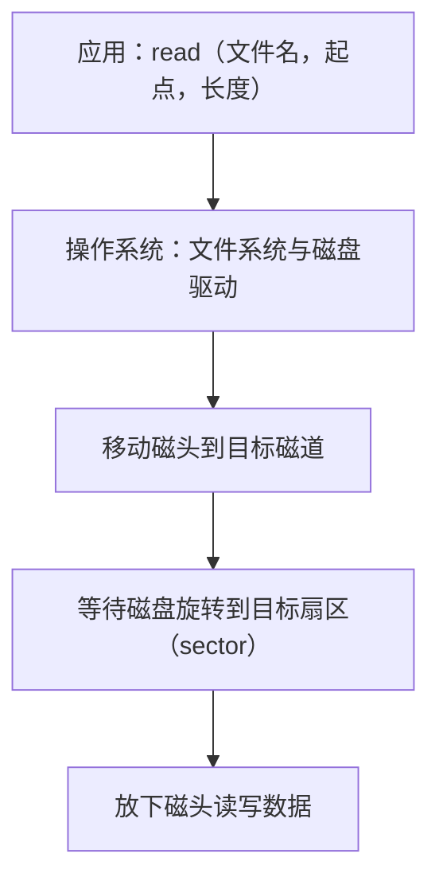

# 05 操作系统名称与硬件

[本讲目录](../index.md) · [课程目录](../../index.md) · [上一节：04 典型操作系统结构](04-typical-operating-system-structures.md) · [下一节：06 xv6 阅读与基础模型](06-xv6-source-reading-and-ics-model.md)

> [!abstract] 本节要点
> - 操作系统是硬件之上的第一层软件，所以设计者和学习者都必须了解硬件。
> - “操作系统”一词出现前，同类软件叫过监督程序 monitor、执行程序 executive、控制程序、管理程序 supervisor、核心程序 kernel；supervisor 一词沿用到今天的特权级“监管级”。
> - Operating 取自“主刀医生”（operating surgeon）：多方协作时只能有一个统一发号施令的主管者，这正是操作系统的角色。
> - 操作系统的工作以“让程序执行起来”为核心，分为硬件相关工作与共性工作；共性工作（写 fork、open）是纯软件问题，真正的难点是控制硬件。
> - 硬件参差不齐（例：一款 NEC 软盘控制器有 16 条长 1–9 字节的指令，read 带 13 个参数），操作系统像在粗糙墙面上抹一层，让上层看到统一平整的接口；如今驱动改由设备厂商按操作系统的驱动框架编写并注册。

## 操作系统是硬件之上的第一层软件

从 hello world 的执行和各种操作系统的结构都能看到同一件事：操作系统直接坐在硬件上，应用程序坐在操作系统上。**操作系统是硬件基础上的第一层软件**，因此要设计或理解操作系统，就绕不开硬件——它要管理的 CPU 寄存器、内存、磁盘、显示器，本身都是硬件。[^s2b6]

这一层的位置决定了它的两面性：向下，它必须懂得每种硬件的具体控制方式；向上，它必须把这些差异藏起来，给应用程序一套统一的接口（即系统调用接口与硬件抽象层，见[典型操作系统结构](04-typical-operating-system-structures.md)）。本章后半部分就说明“向下”这一面为什么难。

## 名称的由来

“操作系统”这个名字在中文里并不直观：它“操作”什么？回顾这类软件曾用过的名字，可以看出它的职能是怎样一步步被认识清楚的。[^s2b6]

各名称强调的侧重点不同：

1. **监督程序（monitor）**：监督设备与作业的运行。
2. **执行程序（executive）**：说明它要亲自做事，而不只是旁观。
3. **控制程序**：控制各种硬件。
4. **管理程序（supervisor）**：用得较多的名字，强调它的权限比一般用户高，好比公司里的管理层。这个词一直沿用到今天：处理器特权级中的**监管级**（supervisor level）就来自这里，内核运行在这一级（RISC-V 的 S 模式见[操作系统的引导与启动](07-os-boot-and-startup.md)）。
5. **核心程序（kernel）**：今天“内核”一词仍最常用。
6. 最后才定名为**操作系统**（operating system）。

为什么最后选了 operating 这个词？一种溯源说法（只是一个说法，姑且听之）来自外科手术：

- 一台复杂的大手术往往由几位医生共同完成，手术越复杂医生越多。这时不可能七嘴八舌——这个说这里要加压、那个说那里要减压——必须有一位统一发号施令的人，即**主刀医生**（operating surgeon）。
- 美国电影《OP Center》里，白宫有一个名为 OP Center 的决策小组：前苏联的核弹头被恐怖分子盗走、要运往欧洲出售时，由这个小组启动紧急处置，为白宫做决策。

两个故事里 operating 都意味着决策、主刀、主管——权力最大、负责统筹全局的那一方。[^s2b6] 计算机系统里同时有多个程序、多种设备在争用资源，操作系统就是那位主刀医生：谁先用 CPU、谁占哪块内存、谁访问磁盘，都由它统一安排。

## 操作系统工作的构成

结合 hello world 的完整执行过程，可以把操作系统的工作大致划分如下（这不是严格划分，只为帮助理解）：[^s2b7]

- **核心工作**：让程序执行起来，支持程序从启动、执行到结束的整个过程。
- 在这个过程中要做两类事：
  - **与硬件相关的工作**：控制磁盘、显示器、时钟等具体设备。操作系统的开发者不必“做”硬件，但必须“控制”硬件，这一步跳不过去，这正是操作系统难的原因。
  - **共性工作**：与具体硬件无关的软件问题，例如怎样实现 fork、怎样实现 open。这些属于熟悉的软件设计问题。
- 此外还有**性能、安全**等方面的问题。

所以，操作系统中相对困难的部分集中在“控制硬件”上。

## 与硬件打交道的复杂性

### 没有操作系统时

如果没有操作系统，怎样把目标代码送进硬件、又怎样读出结果？最早的办法是手工输入：记住指令的二进制编码，拨入一串 0101，按一个键，再拨下一串、再按一个键，一条一条地把代码送进去。这种完全手工的方式早已一去不复返，但它说明了操作系统最初要替人承担的工作。[^s2b7]

### 硬件相关代码的体量

代码里一旦涉及硬件——接口、寄存器、各种控制协议——就会变得复杂而繁琐；而操作系统要支持各种各样的硬件，代码量必然很大。

可以用一个动手实验得到直观印象：取一个最新版本的 Linux 源码给它“减肥”——只保留一种体系结构、每类设备只保留一种，其余全部删掉。剩下的代码会小得多，由此可以估算出与具体硬件相关的代码所占的比例：这一比例非常大。[^s2b7] 这项实验不难，只是花时间。它也解释了为什么操作系统要设计**硬件抽象层**（HAL）：把与硬件相关的部分尽量屏蔽在这一层里（HAL 的结构见[典型操作系统结构](04-typical-operating-system-structures.md)）。

### 两种请求的对比

比较下面两种“读数据”的请求，哪一种更容易下达：

1. **按文件读**：给出文件名，说明从哪里开始、读多长。请求方只需提供这三项信息，就像告诉别人“从第几页读到第几页”。
2. **直接控制磁盘**：文件实际存放在磁盘上，要亲自读它，就得移动磁头到目标磁道，等待磁盘转到要读的扇区（sector）下方，再放下磁头读写。

第一种请求简单明了，第二种请求琐碎到让人头疼。操作系统的作用，就是让应用只需要发出第一种请求，第二种由它来完成。[^s2b7]

### 软盘控制器的例子

软盘（floppy disk）有过 8 英寸、5.25 英寸、3.5 英寸等规格（俗称八寸、五寸、三寸盘），今天已很难见到实物。要使用软盘，需要软盘驱动器，驱动器里有一个**控制器**（controller）芯片，操作系统实际是与这个控制器打交道。以 NEC 某一型号的软盘控制器为例：[^s2b7]

- 它有 **16 条指令**。条数看上去不多，但每条指令长度不同，最短 1 个字节，最长 9 个字节，因为指令要携带很多参数。
- 其中的 **read** 指令（读盘，并不是最复杂的一条）有 **13 个参数**。
- 不同品牌、不同型号的控制器，指令可能还互不兼容。

编写驱动程序的人必须掌握这些指令和参数，这是一件很头疼的事。

> [!note] 补充解释
> 这个例子是操作系统教材中的经典例子，见 Tanenbaum《现代操作系统》（Modern Operating Systems）第 1 章，所指芯片通常认为是 IBM PC 时代广泛使用的 NEC PD765 软盘控制器；课程中只说是“NEC 的某一型号”。

### 驱动框架：编写驱动的责任转移

既然驱动这么难写，由谁来写？这件事的分工发生过变化：[^s2b7]

| 时期 | 谁编写驱动 | 原因 |
|---|---|---|
| 早期 | 操作系统厂商 | 设备种类不多；为了让自己的系统好卖，来一个设备就编一个驱动 |
| 今天 | 设备厂商 | 设备种类太多，操作系统厂商编不过来；操作系统也足够强大，设备要向它靠拢 |

今天的做法是：操作系统提出一套**驱动框架**，规定驱动怎么写、怎么接入；设备厂商按框架自己编好驱动，再**注册**到操作系统中，操作系统就能支持该设备。这样能支持的设备越来越多，生态也就建立起来了（鸿蒙的驱动框架就是这种思路，见[典型操作系统结构](04-typical-operating-system-structures.md)）。[^s2b6]

### 抹墙比喻

硬件是参差不齐的。新楼刚建好时，墙面砖缝毕露、灰头土脸；抹上一层之后，墙面平整洁白，住在里面的人感觉不到底下的粗糙。操作系统就是抹在参差不齐的硬件上的那一层：经过它的封装，对上、对外呈现的是统一、平整的接口。[^s2b7]

> [!warning] 易错点
> “操作系统难”不是难在 fork、open 这类共性逻辑上——那是常规的软件设计问题；难点在于要控制种类繁多、接口各异、彼此不兼容的硬件，并把这些差异屏蔽掉。

> [!question]- 自测：一个应用要读取文件 `a.txt` 第 4096 字节起的 512 字节。它需要知道磁头当前在哪个磁道吗？为什么？
> 不需要。应用只发出“文件名 + 起点 + 长度”这种请求；把它换算成磁盘上的磁道、扇区，再移动磁头、等待旋转、读写，都由操作系统的文件系统和驱动完成。这正是操作系统屏蔽硬件复杂性的体现。

> [!question]- 自测：给 Linux 源码“减肥”时，只保留一种体系结构和每类一种设备，为什么代码量会大幅缩小？这个结果说明了什么设计需求？
> 被删掉的正是与具体体系结构、具体设备相关的代码，它们在内核中占很大比例。这说明硬件相关代码量大、变化多，所以需要用硬件抽象层把它们集中屏蔽起来，使其余部分与硬件无关、便于移植。

> [!question]- 自测：一家公司推出了一款全新的摄像头，希望它在某个现代操作系统上即插即用。按今天的分工，谁要做什么？如果这个操作系统没有驱动框架，会出现什么问题？
> 设备厂商按该操作系统驱动框架的规范自己编写驱动，再注册到系统中，操作系统就能支持它。若没有驱动框架，就只能等操作系统厂商为这款设备单独编写驱动；设备种类成千上万，操作系统厂商编不过来，新设备很可能得不到支持，生态也就建不起来。

> [!info]- 来源
> - L01.docx：DOCX body 147–199

[^s2b6]: L01.docx-DOCX body 147-172
[^s2b7]: L01.docx-DOCX body 173-199

[本讲目录](../index.md) · [课程目录](../../index.md) · [上一节：04 典型操作系统结构](04-typical-operating-system-structures.md) · [下一节：06 xv6 阅读与基础模型](06-xv6-source-reading-and-ics-model.md)
