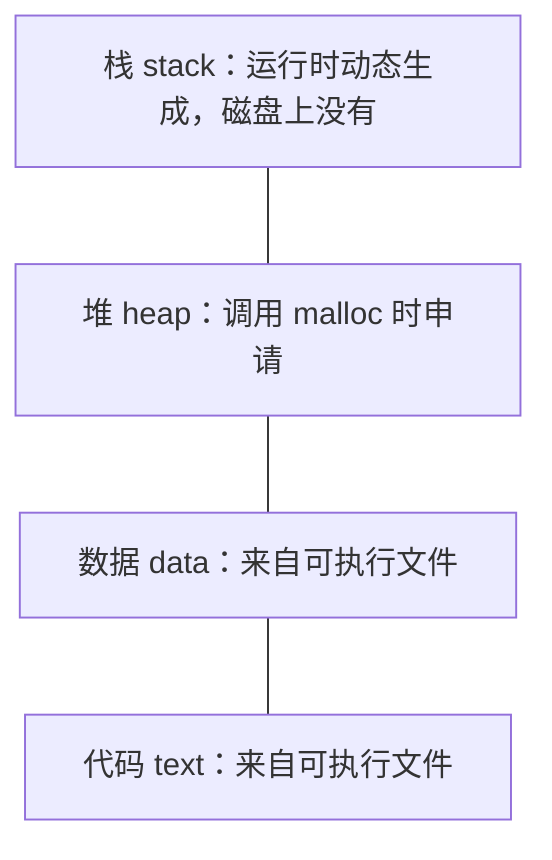

# 06 xv6 阅读与基础模型

[本讲目录](../index.md) · [课程目录](../../index.md) · [上一节：05 操作系统名称与硬件](05-os-name-origin-and-hardware-complexity.md) · [下一节：07 操作系统的引导与启动](07-os-boot-and-startup.md)

> [!abstract] 本节要点
> - 大模型时代读源代码仍是基本功：大模型生成的代码也得人读懂，读码能力越早打牢越好。
> - 课程选用 xv6：规模约一万行、资料充足；读代码前先读 xv6 book 的对应章节。
> - 读法：不通读，按指定文件规划最小阅读路径；从系统调用等入口出发，以系统调用为链画流程图；目标是搞清原理，抓住核心数据结构（PCB 在 xv6 中是 `struct proc`，在 Linux 中是复杂得多的 `task_struct`）。
> - 向大模型提问不能过于宽泛：可以先问“这个文件做什么”，再在结果上对具体函数（如 `allocproc`、`kalloc`）精准追问。
> - 操作系统设计者关注处理器的寄存器（通用寄存器、控制与状态寄存器，尤其是 PC）和进程地址空间：代码、数据来自可执行文件，堆由 malloc 申请，栈运行时动态生成，main 的栈帧并不是栈中的第一个帧。

## 为什么要读源代码

以前要求读操作系统源代码，常被认为工作量太大。有了大模型之后，情况反而倒过来了：大模型帮你生成的代码，你还是得读懂它，因此**读源代码**是应当重新捡起的基本功。读码能力越强越好，而且这是绕不过去的基本功——现在不补，后面也得补，越早打牢越好。[^s2b7]

## 选择 xv6 与阅读方法

> [!info] 可视化资源
> - [xv6 book（RISC-V 版，MIT 6.1810）](https://pdos.csail.mit.edu/6.1810/2024/xv6/book-riscv-rev4.pdf)：Figure 2.2 列出 xv6 内核源文件及作用，Figure 2.3 给出进程虚拟地址空间布局，可对照本节的阅读路径与地址空间模型。

**xv6** 是 MIT 为教学编写的类 UNIX 操作系统，课程实验以它为对象。选择它的主要原因：[^s2b7]

1. **代码规模合适**：大约一万行量级，一个学期内读得完重点部分。
2. **资料充足**：配套有 xv6 book，讲解各部分的设计。读某部分源码之前，先把 book 的对应章节好好看一遍，再借助大模型读代码，会很容易抓住要点。

具体的阅读建议：[^s2b7][^s2b8]

1. **不通读，有重点地读**：每次实验会指定要读哪些文件，做这个实验往往读这几个文件就够了。
2. **规划最小阅读路径**：只沿着理解当前问题所必需的路线读。
3. **从入口开始**：例如从 `read` 这个系统调用开始，顺着它的调用一路往下看。
4. **以系统调用为链画流程图**：系统调用是一个动态过程，把它经过的函数和步骤画成流程图，就把静态代码还原成了运行过程。
5. **抓住核心数据结构**：读代码的最终目的是搞清原理，而原理的核心是数据结构。


### struct proc 与 task_struct

最重要的数据结构是**进程控制块**（PCB，Process Control Block）。PCB 是通用概念，在不同系统中名字不同：[^s2b8]

| 系统 | PCB 的名字 | 特点 |
|---|---|---|
| xv6 | `struct proc` | 教学系统，结构简单，容易看清每个字段的作用 |
| Linux | `task_struct` | 真实系统，字段繁多，复杂得多 |

先从 xv6 的 `struct proc` 入手，弄清 PCB 大致要记录哪些信息，再看 Linux 就容易得多。

> [!note] 补充解释
> 原版 xv6-riscv 的 `struct proc`（`kernel/proc.h`）大致如下，课程所用版本可能略有不同：
>
> ```c
> struct proc {
>   struct spinlock lock;
>   enum procstate state;        // 进程状态：UNUSED、RUNNABLE、RUNNING 等
>   void *chan;                  // 睡眠时等待的对象
>   int killed;                  // 是否被杀死
>   int xstate;                  // 退出状态
>   int pid;                     // 进程号
>   struct proc *parent;         // 父进程
>   uint64 kstack;               // 内核栈的虚拟地址
>   uint64 sz;                   // 用户内存大小（字节）
>   pagetable_t pagetable;       // 用户页表
>   struct trapframe *trapframe; // 陷入内核时保存的用户寄存器
>   struct context context;      // 切换时保存的内核寄存器
>   struct file *ofile[NOFILE];  // 打开的文件
>   struct inode *cwd;           // 当前目录
>   char name[16];               // 进程名
> };
> ```
>
> 对照 hello world 的执行过程看这些字段：页表对应地址映射，trapframe 与 context 对应“进出内核”和“调度换人”时保存的 CPU 上下文，ofile 对应打开的文件（标准输出）。

## 借助大模型精准提问

读代码时建议用大模型辅助，而用好大模型的关键在**提问**。提问不能太宽泛。[^s2b8]

- **宽泛的提问**：“entry.S 是干嘛的？”“帮我解释一下 proc.c。”proc.c 里放的基本是与进程相关的全部代码，内容太多太泛，大模型给出的结果也特别多，看下来也就那么回事，真正重要的细节没有抓住。
- **改进的做法**：第一步这样问可以，但拿到结果后要做第二次**追问**，而且更精准。例如 proc.c 里有分配进程的 `allocproc`，它内部又调用了分配物理页的 `kalloc`，就可以针对这两个函数分别具体地问。

目标是形成自己的一套提问方式，通过提问把代码中核心的东西提取出来，做到真正理解。

> [!example] 例：从宽泛到精准的一组追问
> 1. 第一问（可以接受的起点）：“xv6 的 proc.c 主要包含哪些功能？”——得到一份函数清单，其中有 `allocproc`。
> 2. 追问：“`allocproc` 在进程表中找空槽时，判断依据是 `struct proc` 的哪个字段？找到后把它设成什么状态？”
> 3. 再追问：“`allocproc` 为什么要调用 `kalloc`？分配到的那一页用来存放什么？分配失败时如何回退？”
> 4. 对照源码核实回答。原版 xv6-riscv 中，`allocproc` 在进程表中找一个 `UNUSED` 的项，分配 pid，用 `kalloc` 分配一页作为 trapframe，再创建空的用户页表，并设置内核上下文使新进程第一次被调度时从 `forkret` 开始执行；任一步失败都会释放已分配的资源。
>
> 每一问都指向具体的函数、字段或步骤，回答才能落到代码细节上。

## 处理器与地址空间模型（ICS 复习）

马上要进入操作系统的具体内容，需要先把 ICS（计算机系统导论）中的基本工作模型找回来。操作系统设计者关注的主要是两样东西：处理器中的寄存器，和内存（地址空间）。[^s2b8]

### 寄存器

处理器中操作系统最关心的是**寄存器**：

- **通用寄存器**：保存程序运算的中间值。
- **控制与状态寄存器**：记录处理器的运行状态与控制信息（例如当前特权级、异常原因、页表基址等）。
- 其中最重要的是 **PC**（程序计数器）：CPU 每个指令周期都到 PC 指向的地址取指执行。

前面所说的“设置 CPU 上下文”，本质上就是设置好这一组寄存器，尤其是 PC（见[hello world 的运行](03-hello-world-scheduling-page-fault-system-calls.md)）。

### 进程地址空间的布局

一个进程的**地址空间**有固定的分区布局，每个区域的内容有不同的来源：[^s2b8]



| 区域 | 内容从哪来 | 何时存在 |
|---|---|---|
| 代码 | 可执行文件（ELF 中的代码段） | 加载时建立映射，按需调入 |
| 数据 | 可执行文件（数据段等） | 同上 |
| 堆 | 程序调用 `malloc` 申请的小块空间 | 运行中按需增长 |
| 栈 | 函数调用时动态压入 | 只有运行起来才有内容 |

代码和数据如何从可执行文件映射进来，见[hello world 的加载](02-hello-world-from-command-to-process.md)。

**栈**是地址空间中必备的区域，必须有这块区域。它是动态生成的：程序没运行时它不存在，磁盘上的可执行文件里也没有它；只有程序运行起来，栈里才有东西。每调用一个函数就在栈里形成一个**栈帧**（stack frame），函数返回，这个栈帧就结束。

需要特别注意：**main 的栈帧并不是栈中的第一个帧**。在 main 被调用之前，栈中已经压入了内容；之后 main 再调这个、调那个，不断形成新的栈帧。[^s2b8] 这与“程序执行的第一条指令不是 main 的代码”是同一件事的两面（见[hello world 的加载](02-hello-world-from-command-to-process.md)中的思考题）。

> [!tip] 课堂强调
> 寄存器、地址空间布局和栈的工作方式这些最基础的计算机工作模型一定不能忘：忘了这些，会影响对后面内容的理解。[^s2b8]

> [!note] 补充解释
> exec 时内核先在新栈顶放好 argc、argv、环境变量等信息，之后 C 运行时的启动代码又在 main 之前调用了若干函数，所以 main 之前栈上已有内容。入口代码具体是谁、怎样验证，见[hello world 的加载](02-hello-world-from-command-to-process.md)中思考题的解答。

> [!question]- 自测：一个程序声明了全局数组 `int a[100] = {1};`，在 main 里用 `malloc` 申请了 1 KB，又调用了递归函数 `f`。这三者分别位于地址空间的哪个区域？哪一个在磁盘上的可执行文件里找得到？
> 已初始化的全局数组在数据区，内容来自可执行文件；`malloc` 得到的 1 KB 在堆里；`f` 的每一层递归在栈上各形成一个栈帧。只有数据区的初值在可执行文件里，堆和栈都是运行时才产生的。

> [!question]- 自测：要弄清 xv6 中 `fork` 是怎样复制进程的，下面哪种提问方式更好，为什么？A：“解释一下 proc.c。”B：先问 `fork` 调用了哪些函数，再分别追问 `allocproc` 如何找空闲的 `struct proc`、复制用户内存的那一步调用了谁。
> B 更好。A 范围太宽，结果冗长且抓不住细节；B 从入口 `fork` 出发、沿调用链对具体函数逐个精准追问，正是“以系统调用为链、抓数据结构”的读法。

> [!info]- 来源
> - L01.docx：DOCX body 173–221

[^s2b7]: L01.docx-DOCX body 173-199
[^s2b8]: L01.docx-DOCX body 200-221

[本讲目录](../index.md) · [课程目录](../../index.md) · [上一节：05 操作系统名称与硬件](05-os-name-origin-and-hardware-complexity.md) · [下一节：07 操作系统的引导与启动](07-os-boot-and-startup.md)
