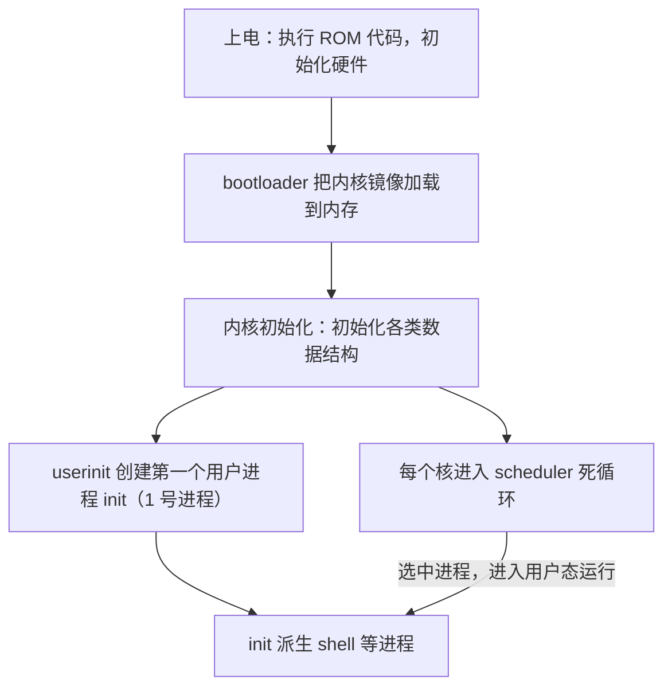
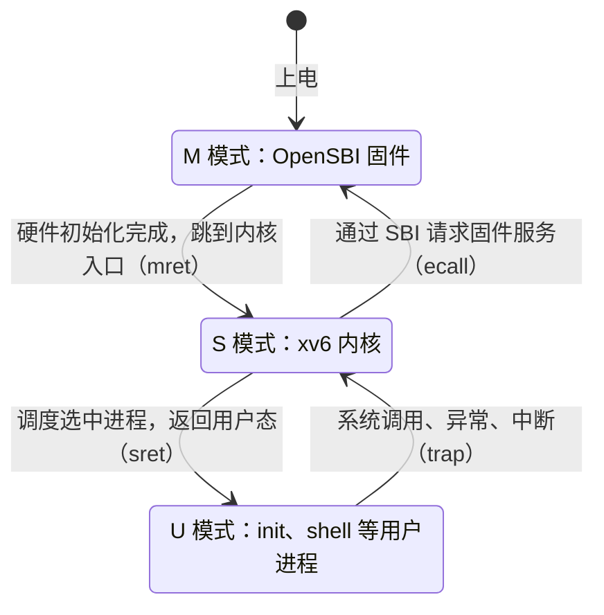
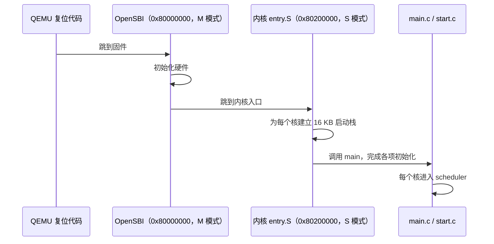

# 07 操作系统的引导与启动

[本讲目录](../index.md) · [课程目录](../../index.md) · [上一节：06 xv6 阅读与基础模型](06-xv6-source-reading-and-ics-model.md)

> [!abstract] 本节要点
> - 引导启动链：上电执行 ROM 代码初始化硬件 → bootloader 把内核镜像加载到内存 → 内核初始化各数据结构 → userinit 创建第一个用户进程 init（1 号进程）→ 由 init 派生 shell；最难的是引导加载，内核初始化只是软件行为。
> - 初始化结束后每个核进入自己的 scheduler：永不返回的死循环，选中进程后进入用户态运行，返回内核时又回到这里。
> - RISC-V 有 M（machine）、S（supervisor，内核运行于此）、U（user）三个特权级；启动从最高的 M 模式开始，逐层初始化、逐层下放，直到用户态 shell。
> - SBI 是 S 模式调用 M 模式服务的二进制接口标准，类比应用程序的 ABI。本课程版本在 QEMU 上先运行位于 0x80000000 的 OpenSBI（M 模式），再跳到 0x80200000 的内核入口；entry.S 为每个核建 16 KB 启动栈后进入 C 代码。
> - 真实 Linux 的引导是接力：ROM 自检 → BIOS（现多为 UEFI）→ MBR 中的引导程序 → bootloader（如 GRUB，支持多系统引导）→ 内核镜像。

## 从上电到 shell 的引导启动链

平常开机时，从按下电源到屏幕上出现 shell 提示符，中间经过一条相当长的链。要理解这条链，先要弄清几个概念：引导程序、特权级、SBI 和内核镜像。[^s2b8]

- **引导程序**（bootloader）：负责把操作系统内核装进内存的程序。这是一个通用概念，在 RISC-V 上具体是什么，要看具体平台。
- **内核镜像**（kernel image）：把内核编译、链接成的一个可加载文件。引导的任务就是把内核镜像加载到内存中约定的位置并转去执行它。
- **特权级**：开机过程中处理器的特权级是在变化的，从最高逐步降到用户级。
- **SBI**：RISC-V 引导中 S 模式与 M 模式之间的接口（下文单独说明）。

整条链如下：[^s2b8][^s2b9]



各步要点：

1. **上电执行 ROM 代码**：完成硬件初始化。
2. **加载内核镜像**：把内核镜像加载到内存的约定地址。内核放在什么地址、入口在哪，写在链接脚本（`.ld` 文件）里。
3. **内核初始化**：初始化操作系统内部的各种数据结构。这一步是纯软件行为，代码告诉你初始化了什么，读一遍基本就熟了，相对简单。**整条链中最难的是前面的引导加载部分。**[^s2b9]
4. **创建第一个用户进程**：第一个用户进程不是用 `fork` 创建的，而是由 `userinit` 创建，称为 **init**。它是 **1 号进程**，所有用户进程的“老祖宗”。按 UNIX 的思路，在它之前还有一个 **0 号进程**。shell 等进程都由 1 号进程派生出来。[^s2b9]
5. **进入调度器**：最后每个核进入 **scheduler**。scheduler 是一个**永不返回的死循环**，每个核都有自己的 scheduler。它选中一个进程，让它出内核、到用户态运行；该进程回到内核后，又回到这个循环里继续选下一个。[^s2b9]

这就是从裸机到可以交互对话的界面的完整流程。

> [!note] 补充解释
> 原版 xv6-riscv 中，`userinit` 并不直接装入 init 程序：它构造第一个进程（pid 为 1，xv6 从 1 开始分配 pid，没有显式的 0 号进程），放入一小段手写的 `initcode`，这段代码执行 `exec("/init")`，`/init` 再 `fork` 出 shell。Linux 中则确实有 0 号进程（idle/swapper），1 号进程是 init 或 systemd。
>
> scheduler 的骨架（原版 xv6-riscv `kernel/proc.c`，有删减）：
>
> ```c
> void scheduler(void) {
>   struct cpu *c = mycpu();
>   c->proc = 0;
>   for (;;) {                                // 永不返回
>     intr_on();
>     for (p = proc; p < &proc[NPROC]; p++) {
>       acquire(&p->lock);
>       if (p->state == RUNNABLE) {
>         p->state = RUNNING;                 // 选中它
>         c->proc = p;
>         swtch(&c->context, &p->context);    // 切到该进程；它放弃 CPU 时回到这里
>         c->proc = 0;
>       }
>       release(&p->lock);
>     }
>   }
> }
> ```

## RISC-V 特权级与 SBI

### 三个特权级

RISC-V 定义了三个特权级（privilege level）：[^s2b8]

| 特权级 | 名称 | 运行什么 |
|---|---|---|
| M | 机器模式（machine mode） | 最高权限，固件（如 OpenSBI）运行于此，直接面对硬件 |
| S | 监管模式（supervisor mode） | 操作系统内核运行于此；supervisor 即历史名称“管理程序”的那个词（见[操作系统名称与硬件](05-os-name-origin-and-hardware-complexity.md)） |
| U | 用户模式（user mode） | 用户程序（如 shell、hello world）运行于此 |

启动过程是从最高级权限 M 模式开始，逐层完成硬件初始化，再逐层把权限下放，直到用户态的 shell。[^s2b9]



> [!note] 补充解释
> 图中括号里的指令不是课程讲授内容：M 到 S 的下放由 `mret` 完成（OpenSBI 事先把“返回后的特权级”设为 S、返回地址设为内核入口）；S 到 U 由 `sret` 完成；向上进入更高特权级只能通过 trap，即执行 `ecall` 或发生异常、中断。

### SBI 与 ABI

先回忆 ICS 里的 **ABI**（Application Binary Interface，应用程序二进制接口）：它规定二进制层面的调用规范，例如函数调用时参数放在哪些寄存器、哪些寄存器由调用者（caller）保存、哪些由被调用者（callee）保存。

**SBI**（Supervisor Binary Interface，监管者二进制接口）是同一思路在特权级之间的应用：它是一套**标准规范**，定义 S 模式（内核）与 M 模式（固件）之间的调用接口，即 S 模式可以向 M 模式请求的一组标准函数及其调用约定。[^s2b8] 内核通过 SBI 使用固件提供的服务，而不必自己直接操作这部分机器相关的硬件。

> [!note] 补充解释
> 按 SBI 规范，S 模式内核把扩展号放在 `a7`、功能号放在 `a6`、参数放在 `a0`–`a5`，然后执行 `ecall` 陷入 M 模式，由固件处理后返回，错误码和返回值在 `a0`、`a1` 中。典型服务有设置定时器、核间中断、启动其他 hart、早期控制台输出等。OpenSBI 是 SBI 的参考实现。规范见 [RISC-V SBI specification](https://github.com/riscv-non-isa/riscv-sbi-doc)。

SBI 的细节留到实验时再深入。

## 本课程 xv6 的启动过程

课程实验在 QEMU 模拟器上运行，没有真实的 BIOS。本课程所用 xv6 版本的启动过程如下：[^s2b9]

1. **加载 OpenSBI 固件**：OpenSBI 被加载到 **0x80000000**，运行在 M 模式。这个地址可以在链接脚本里看到。
2. **OpenSBI 初始化硬件**：完成硬件初始化后，跳到内核的入口地址 **0x80200000**。
3. **链接脚本 `kernel.ld`**：给出内核的基地址（base address）和入口（entry），代码中可以直接看到。
4. **`entry.S` 建立启动栈**：系统有多个核，要为每个核建立自己的启动栈，每核 **16 KB**；然后调用 main。
5. **`main.c`、`start.c`**：完成一连串初始化，最后每个核进入自己的 scheduler。



需要重点阅读的文件就这四个：**`entry.S`、`kernel.ld`、`main.c`、`start.c`**。读 `kernel.ld` 等文件中的几处真实代码，就能还原整个启动过程。阅读时可以带着这些问题：内核文件怎样运行起来、如何找到内核文件、从哪个地址开始执行、多核情况下各核的栈怎样排列。[^s2b9]

> [!note] 补充解释
> 上面的地址与栈大小是本课程所用版本的设置。原版 MIT xv6-riscv 用 `-bios none` 启动 QEMU，不经过 OpenSBI：QEMU 的复位代码直接跳到 0x80000000，`kernel.ld` 把内核放在这里，`entry.S` 在 M 模式下为每个核设置 4 KB 的栈后调用 `start()`；`start.c` 在 M 模式做少量设置，再用 `mret` 降到 S 模式进入 `main()`。原版 `entry.S` 的核心是：
>
> ```asm
> _entry:
>         la sp, stack0          # 所有核的栈连续放在数组 stack0 中
>         li a0, 1024*4          # 每核栈大小
>         csrr a1, mhartid       # 当前核号
>         addi a1, a1, 1
>         mul a0, a0, a1
>         add sp, sp, a0         # sp = stack0 + 栈大小 * (核号 + 1)
>         call start
> ```
>
> 栈向低地址增长，所以每个核的 sp 指向自己那一段的最高地址。

> [!note] 补充解释
> 常听到的“Linux 的栈是 8 兆”需要区分两种栈：8 MB 是 Linux 用户态主线程栈的默认大小上限（`ulimit -s` 默认 8192 KB，glibc 的线程默认栈大小通常也取这个值）；Linux **内核栈**每个线程只有几页，32 位 x86 上为 8 KB，x86-64（Linux 3.15 起）和 64 位 RISC-V 上为 16 KB。与 xv6 每核 16 KB 启动栈对应的是内核栈，不是 8 MB 的用户栈。

> [!note] 补充解释
> RISC-V 版 xv6 的引导比 x86 版 xv6 简单：x86 版要由 BIOS 从磁盘读入 512 字节的引导扇区，引导代码再从 16 位实模式切换到 32 位保护模式，然后才能加载内核。

## 与 Linux 引导的对比

真实的 Linux 引导也从 ROM 自检开始，但链条更长，像接力赛一样一棒接一棒：[^s2b9]


1. **ROM 自检**。
2. **BIOS 启动**：过去普遍用 BIOS，现在多用 **UEFI** 帮助启动。
3. **MBR**（Master Boot Record，主引导记录）：磁盘上的一块区域，引导程序就放在这里；BIOS 把它加载并执行。
4. **bootloader**：由前一段加载执行后，再把内核镜像加载到内存。
5. **多系统引导**：GRUB 这类工具支持多操作系统引导，开机时选哪个就启动哪个。

每一段只做自己那部分，做完把控制权交给下一段，这就是“接力”。

| 对比项 | 本课程 xv6（QEMU） | 真实 Linux（PC） |
|---|---|---|
| 最初运行的固件 | QEMU 复位代码 + OpenSBI（M 模式） | ROM 自检 + BIOS 或 UEFI |
| 引导程序 | OpenSBI 直接跳到已加载的内核入口 | MBR 引导程序 → bootloader（如 GRUB） |
| 内核位置 | 链接脚本 `kernel.ld` 规定（0x80200000） | bootloader 按内核镜像格式装入 |
| 多系统引导 | 无 | GRUB 等支持 |

> [!note] 补充解释
> MBR 是磁盘的第一个扇区（512 字节），包含一小段引导代码和分区表，是传统 BIOS 的做法。UEFI 不依赖 MBR 中的引导代码，而是从磁盘上的 EFI 系统分区（通常位于 GPT 分区表的磁盘上）读取 bootloader 程序文件来执行。

> [!tip] 课堂强调
> 引导细节不是本课最核心的内容。本讲最核心、要求必须掌握的是 hello world 程序的执行流程，后续课程会在它的基础上不断加深（见[hello world 的运行](03-hello-world-scheduling-page-fault-system-calls.md)）。[^s2b9]

> [!question]- 自测：在本课程的 xv6 上，系统有 4 个核，每核启动栈 16 KB，所有栈连续存放在从地址 $B$ 开始的数组中。按原版 xv6 `entry.S` 的算法，核号为 2 的核的初始 sp 是多少？为什么不是 $B + 2 \times 16\,\text{KB}$？
> $sp = B + 16\,\text{KB} \times (2+1) = B + 48\,\text{KB}$。栈向低地址增长，所以 sp 要指向这个核自己那一段 $[B+32\,\text{KB},\ B+48\,\text{KB})$ 的顶端；若取 $B+32\,\text{KB}$，第一次压栈就会写进 1 号核的栈。

> [!question]- 自测：系统启动后，shell 进程是由谁创建的？第一个用户进程又是怎样创建的？
> shell 由 1 号进程 init 派生（fork）出来；而 init 本身不是 fork 出来的，它是内核初始化末尾由 `userinit` 直接构造的第一个用户进程。

> [!question]- 自测：内核初始化完成后，核 0 上运行的 scheduler 选中了 shell，shell 执行 `read` 系统调用等待键盘输入。这期间特权级如何变化？控制最终回到哪里？
> scheduler 在 S 模式选中 shell，让它返回 U 模式运行；`read` 通过 trap 回到 S 模式。shell 需要等待输入时放弃 CPU，控制回到核 0 的 scheduler 循环，由它选下一个进程。scheduler 本身永不返回。

> [!info]- 来源
> - L01.docx：DOCX body 200–243

[^s2b8]: L01.docx-DOCX body 200-221
[^s2b9]: L01.docx-DOCX body 222-243

[本讲目录](../index.md) · [课程目录](../../index.md) · [上一节：06 xv6 阅读与基础模型](06-xv6-source-reading-and-ics-model.md)
