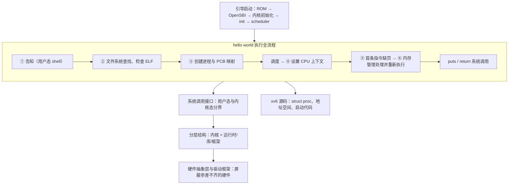

# L01 操作系统做了什么

[课程目录](../index.md)

一个只有 `puts` 和 `return` 两条语句的 hello world，从命令行回车到输出结束，背后操作系统究竟做了什么？本讲先确立“运行、设计、实现”三条主线和以流程为抓手的学习方法，再沿 hello world 的加载与运行走完全流程，看程序如何反复进出内核；接着从 Windows、UNIX、Linux、Android、鸿蒙、openEuler 的结构中归纳分层、内核、系统调用接口与硬件抽象层的共性，理解“操作系统”名称的由来与控制硬件之难；最后为实验做准备：xv6 阅读方法、处理器与地址空间模型，以及 RISC-V 上从上电到 shell 的引导链。本讲假设已学过 ICS 中的虚拟内存与缺页、异常控制流、ELF 与链接加载、栈帧等内容。

## 章节导航

- [01 课程视角与典型流程](chapters/01-course-perspective-and-typical-flows.md)：运行、设计、实现三主线，以流程为学习抓手
- [02 hello world 的加载](chapters/02-hello-world-from-command-to-process.md)：告知、查找检查 ELF、创建进程与 PCB 映射
- [03 hello world 的运行](chapters/03-hello-world-scheduling-page-fault-system-calls.md)：调度、设置上下文、首条指令缺页与系统调用
- [04 典型操作系统结构](chapters/04-typical-operating-system-structures.md)：从典型系统结构归纳分层、内核、接口与 HAL
- [05 操作系统名称与硬件](chapters/05-os-name-origin-and-hardware-complexity.md)：名称溯源与控制硬件之难：HAL 与驱动框架
- [06 xv6 阅读与基础模型](chapters/06-xv6-source-reading-and-ics-model.md)：有重点读 xv6、精准追问、复习地址空间
- [07 操作系统的引导与启动](chapters/07-os-boot-and-startup.md)：从上电到 shell：特权级、SBI 与引导接力

## 思考题汇总

- [02 hello world 的加载](chapters/02-hello-world-from-command-to-process.md)：hello world 执行的第一条指令是什么

## 本讲小结

本讲的核心是 hello world 的执行流程：前两章给出流程本身，后面各章分别回答“内核里有什么”“为什么难”“怎样读到它的代码”“内核自己又是怎样运行起来的”。

| 问题 | 判断依据 | 对应章节 |
| --- | --- | --- |
| 某一步在用户态还是内核态？ | 此刻 CPU 执行的是用户程序的指令还是操作系统的代码；事件“发生”不等于已进入内核 | [hello world 的运行](chapters/03-hello-world-scheduling-page-fault-system-calls.md) |
| 某个模块该放在内核里还是内核外？ | 是否频繁使用：放在核外会增加进出内核的次数、降低性能 | [典型操作系统结构](chapters/04-typical-operating-system-structures.md) |
| 某段代码是否需要随硬件改写？ | 是否属于 HAL、驱动或调度与上下文切换这类硬件相关部分 | [操作系统名称与硬件](chapters/05-os-name-origin-and-hardware-complexity.md) |
| 读一个机制的代码从哪里开始？ | 从系统调用等入口出发，沿调用链画流程图，抓核心数据结构 | [xv6 阅读与基础模型](chapters/06-xv6-source-reading-and-ics-model.md) |

## 不确定事项

- L01 本身没有讲授 slides01 的页面（该讲义由 L02 讲授），转录引用的课件（hello world 汇总页、Windows/UNIX/Linux/xv6/Android/鸿蒙/openEuler 结构图、名称溯源手术图、软盘控制器页、抹墙图、ICS 处理器与地址空间图、引导启动链与 RISC-V/Linux 对比页）均未提供；笔记已改写为不依赖这些图的自足表述，各结构的 Mermaid 图是按转录口述重建的，未能与原图核对
- OpenSBI 加载地址 0x80000000、内核入口 0x80200000、每核 16 KB 启动栈来自转录，指本课程所用 xv6 版本；原版 MIT xv6-riscv 不经 OpenSBI、每核 4 KB，笔记已用补充解释区分，但课程版本源码未提供，无法核实
- 转录 ASR 质量较差：“8份”被推断为帧缓冲（frame buffer）；“全省的BIOS”被推断为“没有真实 BIOS”；“XV6 太复杂了，Race five 比 XV6 的引导启动要简单”被理解为 x86 版与 RISC-V 版 xv6 的对比（补充解释中已注明）；“对于这个点B”所指文件无法确定
- Windows NT 图形子系统移回内核（NT 4.0、win32k.sys）、硬件缓存起源（Wilkes 1965、IBM 360/85）、NEC PD765 与 Tanenbaum 教材出处、Linux 内核栈大小等均为编辑/写作者补充的外部事实，已标注为补充解释，课程本身未给出
- 转录中引用的上上节课内容（PCB 首次介绍、“底下是内核、上面跑进程”的图、Three Easy Pieces 组织方式）未提供，只按本讲转录中的复述写入

> [!info]- 来源
> - L01.docx：DOCX body 1–243
