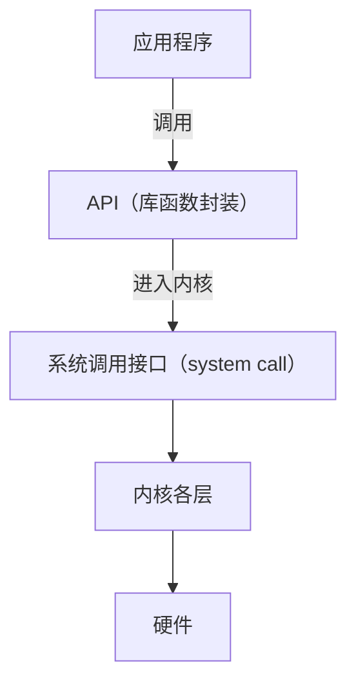
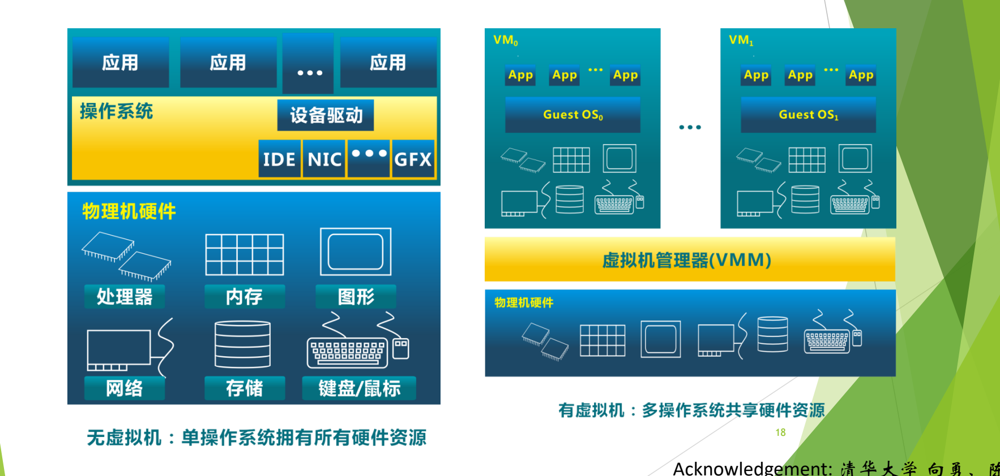

# 02 认知操作系统的三种观点

[本讲目录](../index.md) · [课程目录](../../index.md) · [上一节：01 操作系统是什么](01-what-is-an-operating-system.md) · [下一节：03 历史的启示](03-history-lessons-multics-and-unix.md)

> [!abstract] 本节要点
> - 认识操作系统要从多个角度入手，常用三种观点：资源管理观点（最重要）、进程观点、虚机器观点。
> - 资源管理的目的是**共享**和**提高利用率**；复用只有**时间**和**空间**两种方式，二者可以互换。
> - 管理资源靠数据结构跟踪资源使用状况，再按分配策略分配和回收；**动态分配**提高利用率，但可能引起死锁，**静态分配**已经过时。
> - 进程观点：任意时刻给系统拍快照，看到的是一个内核加若干可同时、独立运行的进程。
> - 虚机器观点：操作系统分层，每层对上一层是一台机器并屏蔽下层细节；操作系统的四个特征是并发、共享、虚拟、随机性。

## 多个角度认识操作系统

操作系统是个庞然大物，就像盲人摸象，不可能一下摸清全貌，只能从多个角度逐步认识。三种主要观点是：**资源管理的观点**、**进程的观点**和**虚机器的观点**，此外还有许多其他角色：[^s1p9]

- **服务提供者**：见[操作系统是什么](01-what-is-an-operating-system.md)。
- **历史教员**：操作系统里积累的设计思想和技术，将来开发应用时还能用上。
- **家长、政府**：什么都管，什么都安排。
- **仲裁者**：两个进程申请同一个资源时，由它决定给谁。
- **魔幻制造者**：把一个物理 CPU 变成多个虚拟 CPU，像变魔术一样。[^s3b1]

## 资源管理观点

资源管理观点是自底向上看：操作系统是**资源的管理者**。它管理的资源包括：[^s1p10]

- **硬件资源**：CPU、内存、设备（I/O 设备、磁盘、时钟、网络接口等）；
- **软件资源**：磁盘上的文件和信息。

> [!tip] 课堂强调
> 资源管理观点是三种观点中最重要的一条。[^s3b1]

本课程正是按资源组织内容的，每类资源对应一个抽象和一个管理模块：[^s3b1]

| 资源 | 操作系统提供的抽象 | 课程中的对应内容 |
| --- | --- | --- |
| CPU（处理器） | 进程 | 讲进程，实际上是讲处理器怎么管 |
| 物理内存 | 地址空间 / 虚存 | 虚存可以比物理内存大，会用到磁盘 |
| I/O 设备（磁盘、网卡等） | 文件 | 用文件系统统一管理设备和文件 |

### 资源管理的目的与两种复用方式

资源管理的目的是**实现资源共享**（不同进程都能用）和**提高资源利用率**。复用（共享）只有两种方式：[^s1p10]

1. **时间复用**：多个使用者轮流使用同一资源，主要对应 CPU 时间；
2. **空间复用**：把资源划分成多份同时给多个使用者，主要对应内存，扩展开来就是整个存储体系。

时间和空间可以互相转换，即“时间换空间”或“空间换时间”。一般软件设计的权衡也主要在这两个方面。[^s3b2]

### 怎样管理资源：数据结构与分配策略

管理资源要做两件事：[^s1p11]

1. **跟踪记录资源使用状况**：哪些资源空闲、是好是坏、被谁使用、用了多长时间等；
2. **分配和回收资源**：由资源分配策略和算法决定。

资源管理的目标是提高资源利用率、在资源使用时提供保护、协调多个进程对资源请求的冲突等，实现手段就是**数据结构与算法**。

跟踪记录这件事落实到实现上，就是为每种资源定义特定的数据结构，操作系统通过管理数据结构来管理资源：[^s3b2]

- 每个进程有一个大的数据结构，操作系统通过管理它来管理进程，进而把 CPU 用起来；
- 文件有 ICS 中学过的 fd 表（文件描述符表）、打开文件表、inode 表等。

> [!note] 补充解释
> 记录进程信息的这个数据结构就是**进程控制块**（Process Control Block, PCB），xv6 中对应 `struct proc`，详见 L04「05 进程控制块 PCB」。

> [!tip] 课堂强调
> 学操作系统的抓手是**数据结构**。算法相对简单，最核心的是数据结构。[^s3b2]

### 静态分配与动态分配

分配策略分两大类：[^s1p11]

- **静态分配策略**（static allocation）：进程一创建就拿到运行所需的全部资源，运行过程中不再申请新资源，直到运行结束才归还。这是很早以前的做法，现在已经过时。
- **动态分配策略**（dynamic allocation）：进程运行中需要什么资源时再申请，用完就归还。这是现代操作系统资源分配和回收的典型策略。

以打印机为例：打印机不会一直在打印。静态分配下，进程从开始到结束一直占着打印机，不打印的时候别人也用不上；动态分配下，需要打印时申请，打完就还，别人可以接着用。所以动态分配最大的好处是**提高资源利用率**。[^s3b2]

代价是动态申请资源会带来新问题，典型的是 ICS 中学过的**死锁**（deadlock）：几个进程各自持有一部分资源又等待对方的资源，谁都无法继续。很多软件缺陷都来自资源的动态申请。[^s3b2]

> [!question]- 自测：进程 P 运行 10 分钟，只在最后 1 分钟用打印机。静态分配和动态分配下，P 分别占用打印机多久？哪种方式有死锁风险？
> 静态分配：P 从创建起就持有打印机，占用约 10 分钟，其中 9 分钟打印机闲置且别人用不上。动态分配：只在最后 1 分钟申请并占用，用完归还。死锁风险来自动态分配，因为进程在持有部分资源的同时还会申请新资源；静态分配一次拿齐所有资源，不会出现“边持有边等待”。

## 进程观点

资源管理观点是静态的，进程观点则从操作系统运行的角度**动态地**观察它。按照这一观点，操作系统由一些**可同时、独立运行的进程**和一个**对这些进程进行协调的核心**（内核）组成。[^s1p12]

**进程**（process）是完成某一特定功能的程序的一次执行过程。它是动态的、有生命的：会诞生，也会消亡。[^s1p12]

可以这样理解：在某一瞬间给系统拍一张快照，看到的就是一个内核加上若干进程。进程有生有灭，执行期间还会争用资源（例如都想上 CPU）。内核要协调这些冲突，操作系统中的许多问题都在这个过程中解决。L01 中画过的“进程—内核”图正是这个观点，[trap 整体模型](06-trap-mechanism-overview-and-guiding-questions.md)还会再用到它。[^s3b2]

## 虚机器观点

从操作系统内部结构看，虚机器观点把操作系统组织成**分层结构**（layered structure）：[^s1p13]

1. 把操作系统分成若干层；
2. 每一层完成特定功能，构成一个虚机器，并为上一层提供支持；
3. 通过逐层功能扩充，最终构成整个操作系统虚机器；
4. 操作系统虚机器向用户提供各种功能，完成用户请求。

关键在于，每一层对它上一层来说就是一台“机器”：上一层通过定义好的接口与它交互，只看到它，看不到更下面的层；它则把下面所有层的细节都封装起来。假设分为五层，每层都为上一层提供支持，同时把下层的操作屏蔽掉。[^s3b2]

操作系统之上的 API 也是一层封装：应用调用 API，API 需要进入内核时就是系统调用。

Android、鸿蒙、Windows 等系统都分层，只是层次清晰程度不同，Linux 内部的分层就比较模糊。分层是解决复杂问题最有效的手段之一：任务按层分解，出问题时容易定位到是哪一层出的错。[^s3b2]

## 操作系统的特征

> [!info] 依据讲义整理
> 本小节（讲义第 14–19 页）课上未讲解，以下根据讲义整理。

与其他软件相比，操作系统有四个典型特征：**并发、共享、虚拟、随机性**。[^s1p14]

### 并发（Concurrency）

**并发**是指处理多个同时性活动的能力，即计算机系统中同时运行多个程序：[^s1p15]

- **宏观上**，这些程序同时在执行；
- **微观上**，在单 CPU 情况下，任何时刻只有一个程序在执行，这些程序在 CPU 上轮流执行。

并发带来的问题包括活动之间的切换、相互保护，以及相互依赖的活动之间的同步。

**并行**（parallel）则要求多个活动在同一时刻真正同时执行，需要多个 CPU（或多个执行部件）。

> [!warning] 易错点
> 并发不等于并行。判断方法是看“同一时刻”：单 CPU 上同一时刻只有一个程序在运行，多个程序只是在一段时间内交替推进，这是并发；多个 CPU 上同一时刻有多个程序在运行，才是并行。并行一定并发，并发不一定并行。

### 共享（Sharing）

**共享**是指操作系统与多个用户程序共同使用计算机系统中的资源。系统资源有限，操作系统要合理地分配和使用它们，资源在一段时间内交替被多个进程使用。共享分两种：[^s1p16]

- **互斥共享**：一段时间内只允许一个进程使用，如打印机；
- **同时共享（访问）**：一段时间内允许多个进程同时访问，如可重入代码、磁盘文件。

共享引发的问题：资源分配很难达到最优，资源使用时还需要保护。

### 虚拟（Virtual）

**虚拟**是指把一个物理实体映射为若干个对应的逻辑实体，方式是分时或分空间。虚拟技术是操作系统管理资源的重要手段，可以提高资源利用率。例如：[^s1p17]

- **CPU**：每个用户（进程）都有一个“虚处理器”；
- **存储器**：每个进程都占有一个地址空间（代码 + 数据 + 堆、栈）；
- **显示设备**：多窗口或虚拟终端。

把虚拟思想推广到整台机器，就得到**虚拟机管理器**（Virtual Machine Monitor, VMM）。没有虚拟机时，单个操作系统拥有全部硬件资源（处理器、内存、图形、网络、存储、键盘/鼠标），通过设备驱动（IDE、NIC、GFX 等）管理它们；有虚拟机时，VMM 直接运行在物理硬件之上，向上提供多个虚拟机 $VM_0, VM_1, \dots$，每个虚拟机里运行自己的客户操作系统（Guest OS）和应用，多个操作系统共享同一套硬件资源。[^s1p18]

图：左侧是单个操作系统独占全部物理硬件；右侧由虚拟机管理器（VMM）把同一套物理硬件分给多个客户操作系统，每个客户操作系统上再运行各自的应用。

### 随机性（不确定性）

**随机性**是指操作系统必须随时响应以不可预测的次序发生的事件。它表现为：[^s1p19]

- **进程的运行速度不可预知**：多个进程并发执行，“走走停停”，无法预知每个进程推进的快慢；
- **难以重现系统在某个时刻的状态**，包括难以重现运行中出现的错误。

> [!question]- 自测：两位同学在单核笔记本上一边播放音乐一边编辑文档，感觉两者都在“同时”运行。这是并发还是并行？这里体现了操作系统的哪些特征？
> 是并发不是并行：单核任何时刻只有一个程序在 CPU 上执行，两个程序轮流执行，宏观上像同时进行。这体现了**并发**；CPU 被时分复用，每个程序觉得自己有一个处理器，体现了**虚拟**；两者共用内存、磁盘等资源，体现了**共享**。

> [!info]- 来源
> - slides01.pdf：PDF p.9–19
> - L02.docx：DOCX body 1–56

[^s1p9]: slides01.pdf-PDF p.9
[^s3b1]: L02.docx-DOCX body 1-28
[^s1p10]: slides01.pdf-PDF p.10
[^s3b2]: L02.docx-DOCX body 29-56
[^s1p11]: slides01.pdf-PDF p.11
[^s1p12]: slides01.pdf-PDF p.12
[^s1p13]: slides01.pdf-PDF p.13
[^s1p14]: slides01.pdf-PDF p.14
[^s1p15]: slides01.pdf-PDF p.15
[^s1p16]: slides01.pdf-PDF p.16
[^s1p17]: slides01.pdf-PDF p.17
[^s1p18]: slides01.pdf-PDF p.18
[^s1p19]: slides01.pdf-PDF p.19

[本讲目录](../index.md) · [课程目录](../../index.md) · [上一节：01 操作系统是什么](01-what-is-an-operating-system.md) · [下一节：03 历史的启示](03-history-lessons-multics-and-unix.md)
