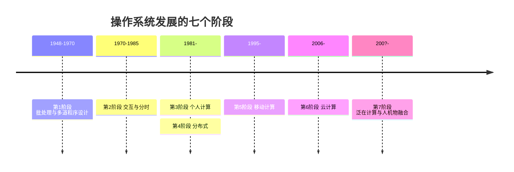

# 03 历史的启示

[本讲目录](../index.md) · [课程目录](../../index.md) · [上一节：02 认知操作系统的三种观点](02-three-views-of-operating-systems.md) · [下一节：04 批处理系统与多道程序设计](04-batch-systems-and-multiprogramming.md)

> [!abstract] 本节要点
> - 技术变化会让某些思想过时消失，另一种技术变化又会让它们以新名词复活：很多“新技术”是旧思想的升级。
> - 回归的例子：连续文件分配（在只读光盘上回归）、硬件保护、动态链接（MULTICS 首先提出）、计算服务（以集中式 Internet 服务器和云计算形式回归）。
> - MULTICS 设想一台计算机为整个地区提供服务、不能停机，因此提出动态链接以便在线更新软件。
> - UNIX 由 Thompson 和 Ritchie 在贝尔实验室开发，奉行“小即是美”；名字的一种合理猜测是与 MULTICS 对着来（MULTI → UNI）。
> - 操作系统发展可分七个阶段：批处理、分时、个人计算、分布式、移动计算、云计算、泛在计算（人机物融合）。

## 概念的重用与回归

学操作系统的历史，不是为了记年份，而是为了看清一个规律：**技术变化导致某些思想过时并迅速消失，但技术的另一种变化又可能使它们复活**。[^s1p21] 复活的东西不是原样照搬，而是经过重新封装，以新概念的形式出现，里面的核心思想基本不变。计算机领域这种情况特别多，所以看到新名词时，要想一想它是哪种旧技术的升级。[^s3b2]

操作系统中的几个例子：[^s1p21]

1. **磁盘上的文件分配 → 连续文件（CD-ROM 文件系统）**：早期磁盘文件采用连续分配，文件一变大，就得另找一块能容纳整个文件的连续空间，很麻烦，于是改为不连续分配。后来出现了只读光盘，内容写入后不再改变，顺序连续存放反而最好，连续分配又回来了。[^s3b2]
2. **硬件保护**：早期机器有硬件保护，后来（例如早期个人计算机）一度不做保护，现在又重新需要保护。
3. **动态链接**：由 MULTICS 首先提出，后来沉寂，现在又被普遍使用。
4. **计算服务**：MULTICS 提出的计算服务模式，以大量附有相对简单用户机器的集中式 Internet 服务器形式回归，进一步发展为**云计算**。

## MULTICS 与动态链接

**MULTICS**（MULTiplexed Information and Computing Service）是 20 世纪 60 年代由 MIT、通用电气（GE）和贝尔实验室合作开发的操作系统，GE 负责提供硬件，系统用 PL/I 语言编写。[^s1p26] [^s3b3] 项目周期很长，从 1963 年开始，直到 1969 年才发布。[^s1p26] 其间贝尔实验室退出了项目，系统最终由其余合作方完成，并在波士顿等地区投入使用。[^s3b3]

> [!note] 补充解释
> 课堂口述的版本是“GE 先退出、贝尔实验室随后退出，最后由 MIT 完成”。可核实的史实是：贝尔实验室于 1969 年退出项目；GE 的计算机部门 1970 年卖给 Honeywell，此后由 MIT 和 Honeywell 继续推进。正文按史实表述。PL/I 是 IBM 主导设计的语言，MULTICS 采用了它，并不是合作方之一为 MULTICS 专门设计的。参见 [Multics 官方史料站 multicians.org](https://multicians.org/history.html)。

MULTICS 的设想是让一台大型计算机为整个波士顿地区的用户提供计算服务。这带来一个直接的约束：**系统不能关机**。可是软件总会出错、总要更新，不停机怎么换掉正在使用的代码？MULTICS 的回答是**动态链接**（dynamic linking）：程序运行时才去查找并链接所需的模块，于是更新某个模块不必停掉整个系统。动态链接后来一度不被重视，如今又成为标准做法（例如 ICS 中学过的共享库），这是“回归”的典型例子。[^s3b3]

MULTICS 的**计算服务**模式也值得注意：用户插上终端就连到那台大计算机上使用服务，这与今天联网使用远程服务没有本质区别。这种模式以集中式服务器和云计算的形式回归了。[^s3b3]

## 重大失败与成功案例

MULTICS 并不是唯一陷入困境的大型项目。早期的大型操作系统都面临重大失败：[^s1p26]

- **IBM OS/360** 发布时带着已知的约 1000 个错误。项目负责人 Frederick P. Brooks, Jr. 后来把这段经历写成了《人月神话》（*The Mythical Man-Month*）。
- **Multics** 从 1963 年开始，直到 1969 年才发布。

与之对照的成功案例是 **UNIX**：[^s1p27]

- 由贝尔实验室的一群计算机爱好者开发，核心人物是 **Ken Thompson** 和 **Dennis Ritchie**，两人获得 1983 年图灵奖和 1999 年 4 月美国国家技术奖章。
- 初衷很朴素：想在一台没人使用的 DEC PDP-7 小型计算机上玩“星际探险”（Space Travel）游戏。

UNIX 的开发者正是退出 MULTICS 项目的贝尔实验室成员，他们还设计了 **C 语言**。他们认为 MULTICS 太庞大，主张**小即是美**，所以 UNIX 的命令都很短：`ls`、`cat`，创建文件的系统调用 `creat` 甚至少了一个字母 e。少 e 的原因一说是图省事，一说只是个玩笑。[^s3b3]

### UNIX 名字的来历（猜测）

一种比较合理的猜测是：UNIX 有意与 MULTICS 对着来，MULTI（多）对应 UNI（单），再为了读音和拼写改成以 x 结尾，就成了 UNIX。这只是猜测。[^s3b2]

> [!note] 补充解释
> 这一猜测与常见的史料说法一致：UNIX 最初被戏称为 UNICS（UNiplexed Information and Computing Service），是对 MULTICS 的反讽式模仿，后来改拼为 Unix。至于 `creat`，Ken Thompson 被问到如果重新设计 UNIX 会改什么时，回答过“我会把 creat 拼上 e”。

## 操作系统发展的七个阶段

> [!info] 依据讲义整理
> 本小节中的发展历程总览和各阶段（讲义第 22–25 页、第 28–32 页）课上没有讲解，以下根据讲义整理。第 26–27 页的失败与成功案例见上一小节。

操作系统随着计算机硬件技术、应用需求和软件新技术的发展而发展，始终围绕两个目标：**充分利用硬件、提供更好的服务**。发展脉络大致是：大型机 → PC 机 → 网络 → 移动计算 → 云计算 → 物联网、大数据分析、人工智能 → 人机物融合（泛在操作系统）。[^s1p22]

### 第 1 阶段（1948–1970）：硬件昂贵，人工便宜

目标是更有效地利用硬件资源，代价是用户和计算机之间缺乏交互。[^s1p23]

- **控制台**：一次一个用户，独占资源。
- **批处理**：装入程序 → 运行 → 打印输出结果，这时还没有保护。操作系统必须管理所有程序的交接和运行，因而变得复杂。
- **数据通道、中断**：让 I/O 和计算重叠进行。
- **多道程序设计**：多个程序同时运行，多个用户共享系统，因而需要存储保护。
- **SPOOLing 技术**：组织批处理作业的处理流程。

批处理和多道程序设计见[批处理系统与多道程序设计](04-batch-systems-and-multiprogramming.md)，SPOOLing 见[卫星机与 SPOOLing 技术](05-satellite-machines-and-spooling.md)。

### 第 2 阶段（1970–1985）：硬件便宜，人工昂贵

重点转向**交互和分时**：利用便宜的终端，让多个用户同时与系统交互；牺牲一些 CPU 时间，换来用户更好的响应时间。用户可以在线开发、调试、编辑。引出的问题是，用户增加时系统性能下降（响应时间变长、出现抖动）。[^s1p24]

**第一个分时操作系统 CTSS**：分时的思想 1959 年在 MIT 提出，核心观察是：调试程序的用户通常只发出简短的命令，很少发出长时间运行的命令。所以给每个用户一个联机终端，计算机就能为许多用户提供交互式的快速服务，CPU 空闲时还能在后台运行大作业。[^s1p25]

- CTSS 由 MIT 的 Fernando Corbató 等人于 1961 年在一台改装的 IBM 7090/94 上开发成功，支持 32 个交互式用户。
- 指标：内存 32K，其中系统用 5K，用户用 27K；用户的存储映像在内存和一台磁鼓之间来回切换。
- 1962 年，曼彻斯特大学的 Atlas 计算机投入运行（速度 200 kFLOPS），它是第一台具有**虚拟存储器**（virtual memory）和**页面调度**（paging）的机器。

分时系统作为一种操作系统类型的特点，见[卫星机与 SPOOLing 技术](05-satellite-machines-and-spooling.md)中的相关内容。

### 第 3 阶段（1981–）：个人计算

硬件非常便宜，人工非常昂贵，挑战变成如何利用计算机充分发挥人的时间。[^s1p28]

- 开始时 PC 硬件资源有限，一次只运行一个程序，操作系统只是一个例程库，**回归简单**。
- 后来 PC 资源越来越丰富，操作系统又变成庞然大物，**存储保护、多道程序设计再次出现**。这又是“概念回归”的一例。

### 第 4 阶段（1981–）：分布式

网络让不同机器可以很容易地相互共享资源（打印机、文件服务器、Web 服务器），需要解决的问题是共享和安全。[^s1p29]

### 第 5 阶段（1995–）：移动计算

各种移动终端出现（笔记本、平板、手机、机顶盒、可穿戴设备等），特点是小型、移动、便宜，但能力有限。[^s1p30]

### 第 6 阶段（2006–）：云计算

云计算提供可无限扩展、随时获取、按需使用、按使用付费的资源。[^s1p31]

**云计算操作系统**是云计算后台数据中心的整体管理运营系统。它构架在服务器、存储、网络等基础硬件资源，以及单机操作系统、中间件、数据库等基础软件之上，管理海量软硬件资源，是一个云平台综合管理系统。它包括大规模基础软硬件管理、虚拟计算管理、分布式文件系统、业务/资源调度管理、安全管理控制等模块，作用有三：

1. 管理和驱动海量服务器、存储等基础硬件，把一个数据中心的硬件资源在逻辑上整合成一台服务器；
2. 为云应用软件提供统一、标准的接口；
3. 管理海量计算任务和资源调配。

对照[操作系统是什么](01-what-is-an-operating-system.md)可以看出，这三点与单机操作系统的资源管理、提供服务和硬件抽象相对应，只是管理对象从一台机器扩展到了整个数据中心。

### 第 7 阶段（200?–）：泛在计算

泛在计算、普适计算、物联网：许多联网设备为许多人提供个性化服务，走向**人—机—物**融合。[^s1p32]

> [!question]- 自测：个人计算机早期的操作系统只是一个例程库，后来又加回了存储保护和多道程序设计。用本节的规律解释这一现象。
> 这是“概念的重用与回归”：早期 PC 资源有限、一次只跑一个程序，保护和多道失去意义而被丢弃（技术变化使思想过时）；PC 资源丰富后需要同时运行多个程序、互不破坏，大型机时代的存储保护和多道程序设计又被重新引入（另一种技术变化使它们复活）。

> [!question]- 自测：MULTICS 为什么必须提出动态链接？如果它采用静态链接，更新一个库函数会怎样？
> 因为它要让一台计算机持续为整个地区服务，不能停机。静态链接时库代码在链接阶段就被复制进每个可执行程序，更新库函数需要重新链接并重启相关程序，甚至停掉系统；动态链接在运行时才装入模块，可以在线替换模块而不停机。

> [!info]- 来源
> - slides01.pdf：PDF p.21–32
> - L02.docx：DOCX body 29–84

[^s1p21]: slides01.pdf-PDF p.21
[^s3b2]: L02.docx-DOCX body 29-56
[^s1p26]: slides01.pdf-PDF p.26
[^s3b3]: L02.docx-DOCX body 57-84
[^s1p27]: slides01.pdf-PDF p.27
[^s1p22]: slides01.pdf-PDF p.22
[^s1p23]: slides01.pdf-PDF p.23
[^s1p24]: slides01.pdf-PDF p.24
[^s1p25]: slides01.pdf-PDF p.25
[^s1p28]: slides01.pdf-PDF p.28
[^s1p29]: slides01.pdf-PDF p.29
[^s1p30]: slides01.pdf-PDF p.30
[^s1p31]: slides01.pdf-PDF p.31
[^s1p32]: slides01.pdf-PDF p.32

[本讲目录](../index.md) · [课程目录](../../index.md) · [上一节：02 认知操作系统的三种观点](02-three-views-of-operating-systems.md) · [下一节：04 批处理系统与多道程序设计](04-batch-systems-and-multiprogramming.md)
