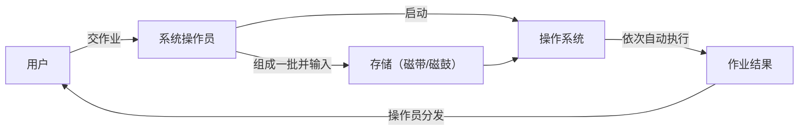
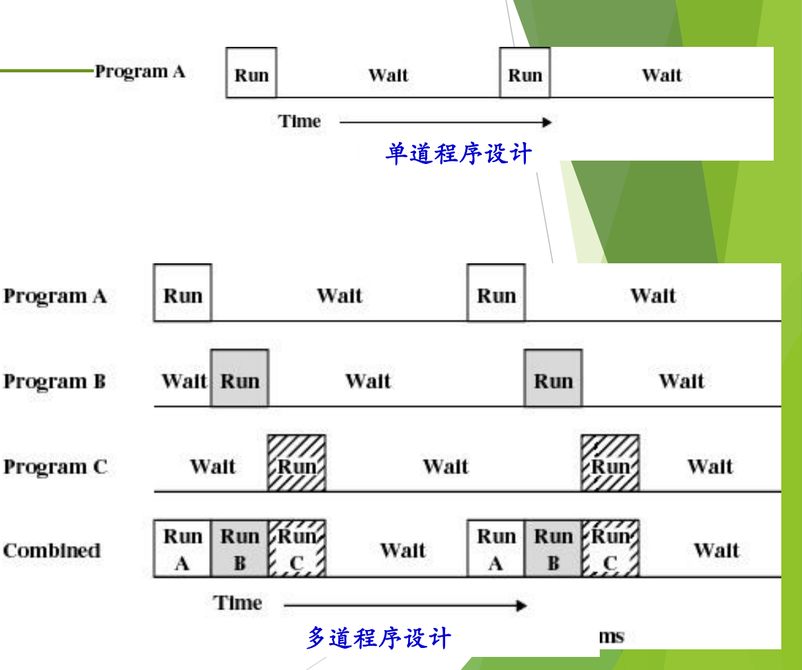
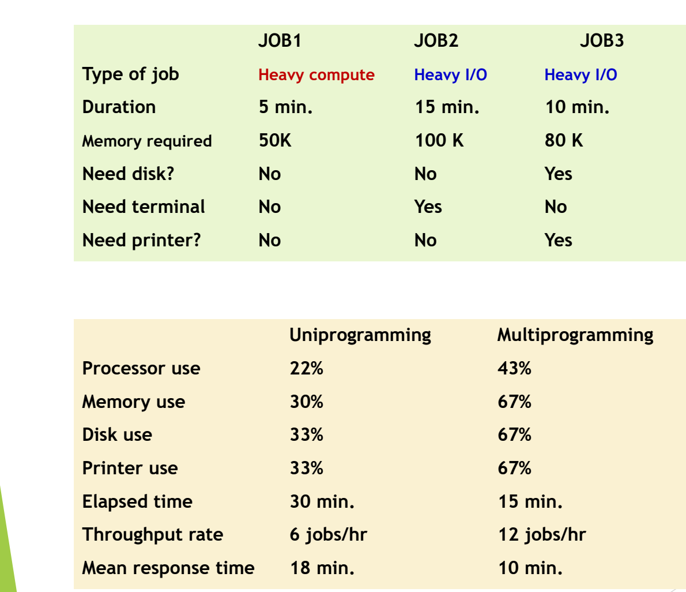

# 04 批处理系统与多道程序设计

[本讲目录](../index.md) · [课程目录](../../index.md) · [上一节：03 历史的启示](03-history-lessons-multics-and-unix.md) · [下一节：05 卫星机与 SPOOLing 技术](05-satellite-machines-and-spooling.md)

> [!abstract] 本节要点
> - 批处理流程：用户交作业 → 操作员组批输入 → 启动操作系统 → 系统自动依次执行 → 操作员分发结果；用户不直接接触计算机。
> - 作业 = 用户程序 + 数据 + 作业说明书（作业控制语言），早期是一叠卡片（如 FMS JOB）。
> - 单道批处理一次只让一个作业进内存，CPU 和 I/O 交替空闲；多道程序设计让多个作业同时进内存，一个等 I/O 时另一个用 CPU。
> - JOB1/2/3 例子中，多道使总时间从 30 分钟降到 15 分钟，吞吐率从 6 提高到 12 jobs/hr，平均响应时间从 18 降到 10 分钟。
> - 内存里同时有多个程序，才需要决定下一个由谁运行，调度问题由此产生。

## 操作系统的分类与批处理

传统上操作系统分为：批处理操作系统（多道批处理）、分时系统、实时操作系统、个人计算机操作系统、网络操作系统、分布式操作系统、嵌入式操作系统，其中批处理、分时和实时系统合称**通用操作系统**。此外还有 Tanenbaum 的分类。[^s1p33] [^s1p34] 今天这些类型已经相互融合，分类本身已不常提。最早的**多道批处理系统**仍值得细讲，因为它的许多设计思想至今仍有影响。[^s3b3]

其余类型（分时、实时等）的介绍见[卫星机与 SPOOLing 技术](05-satellite-machines-and-spooling.md)。

## 批处理的工作方式

早期计算机非常昂贵，用户不能直接操作，开机也耗电，不能一直空等用户。批处理的做法是把许多用户的程序攒成一批，交给机器连续自动处理。具体步骤是：[^s1p35]

1. **交作业**：用户把作业（就是要运行的程序）交给**系统操作员**；
2. **组批**：系统操作员把许多用户的作业组成一批，输入计算机系统，在系统中形成一个自动转接的连续作业流；
3. **启动**：系统操作员启动操作系统；
4. **自动执行**：系统自动、依次执行每个作业；
5. **分发结果**：系统操作员把作业结果交给用户。



这种方式在国内直到 1991 年前后仍在使用。作业先输入并存放在当时的外存（磁带、磁鼓）上，操作员按下按钮引导启动操作系统，系统依次执行作业并输出结果。在美国，操作员会把结果按编号放进一排格子（类似今天的快递柜），用户自己去取。[^s3b3]

### 批与批作业处理

**批**（batch）是可供一次加载的磁带或磁盘，通常由若干作业组成，处理时使用同一组系统软件（系统带）。[^s1p35]

**批作业处理**对批中的每个作业做相同的处理：从磁带读入用户作业和编译链接程序 → 编译链接用户作业，生成可执行程序 → 启动执行 → 输出执行结果。

## 作业的组成

批处理系统中的**作业**（job）由三部分组成，即**用户程序**、**数据**、**作业说明书**。作业说明书用**作业控制语言**（Job Control Language, JCL）写成，告诉系统如何处理这个作业。[^s1p36]

早期一个作业由一张张卡片组成，卡片上是命令和程序。典型的 FMS JOB 卡片叠，按读入顺序是：[^s1p36]

```text
$JOB, 10,429754, Ned      ← 作业开始：作业参数与用户名
$FORTRAN                  ← 调用 Fortran 编译器
（Fortran 程序卡片）
$LOAD                     ← 装入编译好的目标程序
$RUN                      ← 运行程序
（程序所需的数据卡片）
$END                      ← 作业结束
```

以 `$` 开头的卡片就是作业控制语言，其余是程序和数据。后来载体从卡片逐渐变为纸带、磁带。[^s3b3]

> [!note] 补充解释
> 卡片上每条 `$` 命令的含义，是根据卡片名称和批作业处理流程（编译 → 链接装入 → 运行 → 输出）整理的，`$JOB` 后面的字段在讲义中没有逐项说明。

## 单道批处理与多道程序设计

批处理系统分为两类：[^s1p37]

- **单道批处理系统**（simple batch processing, uniprogramming）：对应**单道程序设计**；
- **多道批处理系统**（multiprogramming system）：对应**多道程序设计**。

### 单道批处理的问题

上面描述的就是单道批处理：一批作业送到外存上，操作系统一次只处理一个作业，等它执行完、结果输出后，再执行下一个。

问题在于，一个作业至少用到 CPU 和 I/O 两种资源，而它们交替空闲：作业用 CPU 时 I/O 设备空着，作业等 I/O 时 CPU 空着。单道时间线上，Program A 只有很短的 Run 段，其余大段时间都在 Wait（等待 I/O），这段时间 CPU 无事可做。[^s1p37] [^s3b3]

### 多道程序设计

为了提高资源利用率，出现了**多道程序设计**（multiprogramming）：让多个程序同时进入内存，有的在 CPU 上运行，有的在做 I/O，由操作系统在它们之间周转，使 CPU 和 I/O 设备都尽量忙起来。[^s3b3]

多道时间线上，Program A、B、C 都在内存里。A 开始等待时 B 运行，B 等待时 C 运行。合起来看（Combined），CPU 在原来的空闲时段里依次运行了 A、B、C，等待时间被其他程序的运行填上了。[^s1p37]



图：单道程序设计中程序 A 运行一段后只能等待 I/O，CPU 空闲；多道程序设计把 A、B、C 的运行段错开，合并后 CPU 在 A 等待时运行 B、C，空闲时间明显减少。

今天这已稀松平常，就像一边听课一边看课件。但在当时，让多个程序同时进内存并协调运行是全新的设计思想，而且它带来一个新问题：**调度**（scheduling）。只有一个程序时没什么好调度的，做完一个再找下一个就行；多个程序同时在内存里，就必须决定下一个由谁上 CPU，于是有了调度算法。[^s3b3]

> [!warning] 易错点
> 多道程序设计不等于多个程序在同一时刻同时运行。单 CPU 上任一时刻仍只有一个程序在用 CPU，“多道”提升的是 CPU 和 I/O 的重叠程度，即宏观上的并发（见[认知操作系统的三种观点](02-three-views-of-operating-systems.md)中并发与并行的区别）。

## 多道程序设计的效果：JOB1/2/3 实例

作业按资源需求大致分两类：[^s3b3]

- **I/O 密集型**（Heavy I/O）：大部分时间在输入输出；
- **计算密集型**（Heavy compute）：大部分时间在 CPU 上计算，如天气预报计算。

以三个作业为例：[^s1p38]

| | JOB1 | JOB2 | JOB3 |
| --- | --- | --- | --- |
| 作业类型 | 计算密集型 | I/O 密集型 | I/O 密集型 |
| 运行时长 | 5 min | 15 min | 10 min |
| 所需内存 | 50K | 100K | 80K |
| 需要磁盘 | 否 | 否 | 是 |
| 需要终端 | 否 | 是 | 否 |
| 需要打印机 | 否 | 否 | 是 |

注意当时的内存很小，作业只需要 50K、100K、80K。三个作业需要的设备几乎不重叠：JOB1 主要用 CPU，JOB2 用终端，JOB3 用磁盘和打印机。分别按单道和多道运行的统计结果如下：[^s1p38]

| 指标 | 单道（Uniprogramming） | 多道（Multiprogramming） |
| --- | --- | --- |
| 处理器利用率 | 22% | 43% |
| 内存利用率 | 30% | 67% |
| 磁盘利用率 | 33% | 67% |
| 打印机利用率 | 33% | 67% |
| 总时间（Elapsed time） | 30 min | 15 min |
| 吞吐率（Throughput rate） | 6 jobs/hr | 12 jobs/hr |
| 平均响应时间（Mean response time） | 18 min | 10 min |



图：JOB1 是计算密集型，JOB2、JOB3 是 I/O 密集型；同一组作业改用多道程序设计后，处理器利用率从 22% 升到 43%，总耗时从 30 分钟降到 15 分钟，吞吐率从每小时 6 个作业升到 12 个。

这张表只要求看懂结果，理解为什么要引入多道即可：在多道方式下，各项资源的利用率都大约翻倍，总时间减半，吞吐率翻倍，平均响应时间也明显缩短。[^s3b4]

### 推导：总时间、吞吐率与平均响应时间

> [!note] 补充解释
> 下面的推导是补充内容，讲义只给出结果。假设多道时三个作业所需设备基本不冲突、可以各自按原时长并行推进，就能用表中数据推出后三行。

**单道**：按 JOB1 → JOB2 → JOB3 依次执行，完成时刻分别为 $5$、$5+15=20$、$20+10=30$ 分钟。

$$
T_{\rm elapsed} = 30\ \text{min},\qquad
\text{吞吐率} = \frac{3\ \text{jobs}}{0.5\ \text{h}} = 6\ \text{jobs/hr},\qquad
\bar{T}_{\rm resp} = \frac{5+20+30}{3} \approx 18.3\ \text{min} \approx 18\ \text{min}
$$

**多道**：三个作业同时开始，完成时刻分别为 $5$、$15$、$10$ 分钟，总时间由最长的 JOB2 决定。

$$
T_{\rm elapsed} = 15\ \text{min},\qquad
\text{吞吐率} = \frac{3\ \text{jobs}}{0.25\ \text{h}} = 12\ \text{jobs/hr},\qquad
\bar{T}_{\rm resp} = \frac{5+15+10}{3} = 10\ \text{min}
$$

其中 $T_{\rm elapsed}$ 是从第一个作业开始到所有作业完成的总时间；吞吐率是单位时间内完成的作业数；平均响应时间 $\bar{T}_{\rm resp}$ 是各作业从提交（这里都在时刻 0）到完成的时间的平均值。

多道程序设计解决了“一个程序等 I/O 时 CPU 空闲”的问题。但如果内存里所有程序都在等慢速 I/O，CPU 仍然只能等，CPU 与 I/O 速度的矛盾依然存在。下一步的解决办法见[卫星机与 SPOOLing 技术](05-satellite-machines-and-spooling.md)。[^s3b4]

> [!question]- 自测：单道方式下，如果把执行顺序改为 JOB1 → JOB3 → JOB2，总时间和平均响应时间分别是多少？与原顺序相比说明了什么？
> 完成时刻为 $5$、$15$、$30$ 分钟，总时间仍是 $30$ 分钟，平均响应时间为 $\frac{5+15+30}{3}\approx16.7$ 分钟，比原顺序的约 $18.3$ 分钟短。说明执行顺序不影响单道的总时间，但会影响平均响应时间（短作业先做更好），这已经是调度问题的雏形。

> [!question]- 自测：内存只能放下一个作业的机器，能实现多道程序设计吗？为什么例子要列出每个作业的内存需求？
> 不能。多道程序设计的前提是多个程序同时驻留内存，CPU 才能在一个程序等 I/O 时立即切换到另一个。例子列出 50K、100K、80K 的需求，就是为了说明三个作业能同时放进内存，多道才可行；这也是多道方式下内存利用率从 30% 升到 67% 的原因。

> [!info]- 来源
> - slides01.pdf：PDF p.33–38
> - L02.docx：DOCX body 57–105

[^s1p33]: slides01.pdf-PDF p.33
[^s1p34]: slides01.pdf-PDF p.34
[^s3b3]: L02.docx-DOCX body 57-84
[^s1p35]: slides01.pdf-PDF p.35
[^s1p36]: slides01.pdf-PDF p.36
[^s1p37]: slides01.pdf-PDF p.37
[^s1p38]: slides01.pdf-PDF p.38
[^s3b4]: L02.docx-DOCX body 85-105

[本讲目录](../index.md) · [课程目录](../../index.md) · [上一节：03 历史的启示](03-history-lessons-multics-and-unix.md) · [下一节：05 卫星机与 SPOOLing 技术](05-satellite-machines-and-spooling.md)
