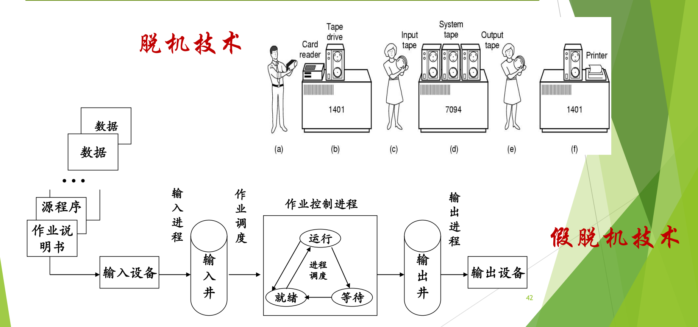

# 05 卫星机与 SPOOLing 技术

[本讲目录](../index.md) · [课程目录](../../index.md) · [上一节：04 批处理系统与多道程序设计](04-batch-systems-and-multiprogramming.md) · [下一节：06 trap 机制总览](06-trap-mechanism-overview-and-guiding-questions.md)

> [!abstract] 本节要点
> - CPU 快、I/O 慢的矛盾一直存在；多道程序设计之后，若没有别的程序可运行，CPU 仍要等慢速 I/O。
> - 卫星机（脱机 I/O）：主机 7094 只做计算，两台 1401 分别完成“卡片→磁带”和“磁带→打印机”，靠增加硬件把 I/O 移出主机。
> - SPOOLing（假脱机）是纯软件技术：用磁盘作缓冲（输入井、输出井），把输入、计算、输出组织成三个独立任务流，使 I/O 与计算真正并行。
> - SPOOLing 中输入进程、作业调度、作业控制进程、输出进程两两构成生产者-消费者，三个特点是提高 I/O 速度、独占设备变共享设备、实现虚拟设备。
> - 今天的打印队列 + 打印守护进程（daemon）就是 SPOOLing：文档写进磁盘上的队列就算“打印完成”。

## CPU 与 I/O 的速度矛盾

多道程序设计让一个程序做 I/O 时另一个程序使用 CPU（见[多道程序设计](04-batch-systems-and-multiprogramming.md)）。但慢速的输入输出仍然**直接由主机完成**：主机做输入输出时很慢，计算时很快；如果此时内存中没有别的程序可以运行，CPU 还是只能等待。[^s1p39]

这个矛盾至今没有消失。大模型时代数据量巨大，数据通路比 GPU 慢得多，各种技术都在弥补 CPU（或 GPU）与 I/O 的性能差距，但差距始终存在。[^s3b4] 下面两种方案都是在回答同一个问题：怎样让主机不为慢速 I/O 停下来。

## 卫星机与脱机 I/O

第一种办法是用硬件解决：再配一台计算机专门负责面向用户的输入输出。

**卫星机**（satellite computer）是专门完成面向用户的输入输出（纸带或卡片）的小型计算机，中间结果暂存在磁带或磁盘上，主机只与磁带/磁盘交换数据。[^s1p39] 因为输入输出脱离了主机进行，这种方式叫**脱机 I/O**（off-line I/O）。

典型场景是 IBM 7094 配两台 IBM 1401：

1. 操作员把一叠作业卡片交给第一台 1401（读卡机），它把卡片内容转录到**输入磁带**上。
2. 操作员把输入磁带拿到 7094 上；7094 能力强，只负责运算，连着多台磁带机，一次读入大量程序和数据，计算结果写到**输出磁带**。
3. 操作员把输出磁带拿到第二台 1401 上，由它把磁带内容送到打印机输出。[^s3b4]

这样主机不再等慢速设备，代价是系统变成了好几台计算机，磁带要靠人工搬运。7094、1401、磁带机、宽行针式打印机和卡片输入装置的实物至今仍能在美国的计算机历史博物馆看到。[^s3b4]

> [!note] 补充解释
> 计算机历史博物馆（[Computer History Museum](https://computerhistory.org/)）位于美国加州山景城（Mountain View），并不在西雅图（课堂口述有误）；西雅图曾有另一家 Living Computers Museum。

## SPOOLing 假脱机技术

卫星机靠堆硬件，而 SPOOLing 只用软件就在一台主机上做到了同样的效果。

**SPOOLing**（Simultaneous Peripheral Operation On-Line，同时的外围设备联机操作），中文称**假脱机技术**，1961 年出现在英国曼彻斯特大学的 Atlas 计算机上。[^s1p41] 它的思想是**利用磁盘作缓冲，把输入、计算、输出分别组织成独立的任务流，使 I/O 和计算真正并行**；做法是在高速设备（磁盘）上开辟**输入井**和**输出井**来传递数据，目的是提高 I/O 效率和设备利用率。[^s1p41]

“假脱机”这个名字来自它和卫星机的对比：卫星机方式中 I/O 在 1401 上完成，是真正脱离主机的“脱机”；SPOOLing 把外部设备也交给主机自己用软件管理，实际是**联机**操作，但输入、计算、输出看上去又像脱机那样各干各的，所以叫“假”脱机。它没有借助卫星机之类的额外硬件，是**纯软件**实现。当时还没有“进程并发”这一概念，但三个独立任务流已经是这种思想；最早的批处理操作系统正是用 SPOOLing 实现的。[^s3b4]

工作原理分四步：[^s1p43]

1. **输入**：作业（经卡片机和通道）进入磁盘上的输入井。
2. **调入**：按某种调度策略从输入井选择几个搭配得当的作业调入内存。
3. **运行输出到井**：作业运行的结果输出到磁盘上的输出井。
4. **打印**：结果从输出井（经通道）送到打印机。

图：上方是早期脱机技术，由 1401 卫星机负责读卡、打印，主机 7094 只与磁带交换数据；下方是假脱机（SPOOLing），由输入进程、输出进程在磁盘上维护输入井和输出井，作业调度与作业控制进程只与“井”打交道。

上图上半部分是卫星机方式（标为“脱机技术”），下半部分是在一台机器上用软件实现的多道批处理（标为“假脱机技术”）：作业说明书、源程序和数据经输入设备由**输入进程**送入输入井；**作业调度**从输入井挑选作业交给**作业控制进程**，作业控制进程内部的进程在运行、就绪、等待三种状态之间由进程调度切换；运行结果进入输出井，再由**输出进程**送往输出设备。[^s1p42]

### 生产者-消费者的原型

图中相邻的两个角色之间都隔着一个数据缓冲区，前者往里放、后者从里取，正是 ICS 中学过的**生产者-消费者**（producer-consumer）结构：[^s3b4]

| 生产者 | 缓冲区 | 消费者 |
|---|---|---|
| 输入进程 | 输入井 | 作业调度 |
| 作业调度 | 已选中的作业 | 作业控制进程 |
| 作业控制进程 | 输出井 | 输出进程 |

每个角色各管一段，彼此通过同步协调。理解这一点的关键是：原来需要三台计算机配合的过程，变成了**由软件在一台机器上统一管理**。

### SPOOLing 的三个特点

1. **提高 I/O 速度**：进程的 I/O 操作变成对输入井或输出井（磁盘）的操作，缓和了 CPU 与低速 I/O 设备速度不匹配的矛盾。
2. **将独占设备改造为共享设备**：系统实际上并没有把设备分配给任何进程，而是在输入井或输出井中为进程分配一个存储区，并建立一张 I/O 请求表。
3. **实现虚拟设备功能**：多个进程同时使用一台独占设备，而每个进程都认为自己独占这台设备，实现了设备的虚拟分配。[^s1p44]

> [!warning] 易错点
> SPOOLing 并没有让打印机这类独占设备真的同时为多个进程工作。打印机仍然一次只打一份；被“共享”的是磁盘上的井，进程看到的“独占打印机”是虚拟出来的。

## 今天的打印队列

SPOOLing 的思想至今仍在使用，最常见的就是共享打印机。一个实验室只需要一台打印机，多个同学可以同时提交论文打印：[^s3b4]

1. 在 Word 里打印一份 100 页的文档，程序只是把待打印内容送进磁盘上的**打印请求队列**；送完就认为“打印完成”，用户可以关闭文件去做别的事。
2. 队列由一个专门的**打印进程**管理，它是操作系统为用户创建的**守护进程**（daemon，也译“精灵”进程），直接控制打印机。
3. 队列中有内容时，daemon 取出一份交给打印机打印，打印完从队列中清除。
4. 队列为空时 daemon 睡眠；新的打印请求到来时它被唤醒。

图：各进程的打印请求先排进磁盘上的打印请求队列（含要打印的文件），再由打印守护进程（daemon）依次取出交给打印机，从而让多个任务“同时”打印。

上图中多份打印请求（含要打印的文件）排成队列，由打印进程 daemon 依次送往打印机：待打印文档先暂存在磁盘的打印队列中，于是多个任务可以“同时打印”，打印效率得到提高。[^s1p45] 这里的打印队列就是输出井，daemon 就是输出进程，生产者是各个提交打印的用户进程。

## 分时及其他操作系统类型

> [!info] 依据讲义整理
> 本小节对应讲义中课上没有讲解的页面（分时系统及其后的各类操作系统、Tanenbaum 分类、智能卡操作系统和本章重点小结），按讲义内容整理。

批处理系统用户不能和自己的程序交互；不同的应用场景（交互、实时控制、联网、嵌入设备）又各自提出了不同的追求目标，于是出现了下面这些类型。今天这些类型已经相互融合。

### 分时操作系统

**分时操作系统**（time-sharing system）把 CPU 时间划分成若干片段，称为**时间片**（time slice）；操作系统以时间片为单位，轮流为每个终端用户服务，每次服务一个时间片。由于时间片很短，每个用户都感觉不到自己在和别人轮流使用，这是利用了人的错觉。[^s1p46]

- **追求目标**：及时响应。
- **衡量依据**：**响应时间**，即从终端发出命令到系统给予回答所经历的时间。[^s1p46]

早期的代表是麻省理工学院的 CTSS（Compatible Time-Sharing System）分时系统。[^s1p47]

**通用操作系统**把分时系统和批处理系统结合起来，原则是**分时优先，批处理在后**：需要频繁交互的作业作为“前台”，时间性要求不强的作业作为“后台”。[^s1p48]

### 实时操作系统

**实时操作系统**（real-time OS）使计算机能及时响应外部事件的请求，在规定的严格时间内完成对该事件的处理，并控制所有实时设备和实时任务协调一致地工作。[^s1p49] 它分两类：

1. **实时过程控制**：工业控制、军事控制等。
2. **实时通信（信息）处理**：电讯（自动交换）、银行、飞机订票、股市行情等。

追求目标是对外部请求在严格时间范围内作出反应，以及高可靠性；关键参数是**时间**。例子是工业过程控制系统，如汽车装配线。[^s1p50] 按对时限的要求又分：

- **硬实时系统**（hard real-time）：某个动作绝对必须在规定的时刻或时间范围内完成。
- **软实时系统**（soft real-time）：可以接受偶尔违反最终时限。[^s1p50]

> [!note] 补充解释
> 讲义只给出问题“例子？”，没有给答案。常见的硬实时例子有汽车安全气囊控制、飞行控制和工业机器人控制，错过时限就会造成事故；软实时例子有视频播放和网络语音通话，偶尔晚到一帧只会降低体验。

### 个人计算机、网络、分布式与嵌入式操作系统

- **个人计算机操作系统**：计算机在某一时间内只为单个用户服务；追求界面友好、使用方便，以及丰富的应用软件。[^s1p51]
- **网络操作系统**：基于计算机网络，在各种计算机操作系统之上按网络体系结构协议标准开发的软件；功能包括网络管理、通信、安全、资源共享和各种网络应用；追求相互通信与资源共享。[^s1p52]
- **分布式操作系统**：分布式系统相对集中式系统而言，以计算机网络为基础，基本特征是**处理的分布**（功能和任务的分布）。分布式操作系统的任何系统任务都可以在任何处理机上运行，并自动在全系统范围内分配任务、调度各处理机的负载。[^s1p53]
- **嵌入式操作系统**（Embedded Operating System）：嵌入式系统是嵌在各种设备、装置或系统中、完成特定功能的软硬件系统，它所属的大设备不一定是“计算机”，通常工作在反应式或对处理时间要求较严格的环境中。嵌入式操作系统对整个嵌入式系统及其控制的部件统一协调、调度、指挥和控制。例子是加州大学伯克利分校研制的微型智能传感器，上面运行 TinyOS。[^s1p55]

网络操作系统与分布式操作系统都建立在网络之上，区别在于分布式操作系统具备以下特征：[^s1p54]

1. 是一个**统一的操作系统**，若干计算机可以相互协作共同完成一项任务；
2. 资源进一步共享；
3. **透明性**：资源共享和分布对用户是不可见的；
4. **自治性**：系统中多个主机地位平等，没有主从关系；
5. 处理能力增强、速度更快、可靠性增强。

### Tanenbaum 分类与智能卡操作系统

Tanenbaum 在《现代操作系统》1.4 节按硬件平台把操作系统分为：大型机、服务器、多处理机、个人计算机、掌上计算机（移动计算机）、嵌入式、传感器节点、实时和智能卡操作系统。[^s1p56]

**智能卡**是包含一块 CPU 芯片的信用卡，运行能耗和存储空间受到非常严格的限制，有些只有电子支付这样的单项功能。有些智能卡面向 Java：ROM 中有一个 Java 虚拟机解释器，Java 小程序下载到卡中由 JVM 解释执行；有的卡能同时处理多个小程序，这就是多道程序，需要调度，资源管理和保护也随之成为卡上操作系统必须处理的问题。[^s1p57] 读写器与智能卡之间以“命令-响应对”方式通信：[^s1p58]

1. 读写器发出操作命令，智能卡接收；
2. 卡上操作系统解释命令，完成解密与校验；
3. 操作系统调用相应程序处理数据，产生应答信息，加密后送回读写器。

### 本章复习重点

本章重点为：操作系统的概念；理解操作系统的不同角度；操作系统的主要特征（并发、共享、虚拟、随机性）；典型的、历史上或当前有重要意义的操作系统（如 OS/360、MULTICS，以及麒麟、鸿蒙、openEuler、统信等国产操作系统）；重要的操作系统技术，即多道程序设计、中断、通道、SPOOLing；操作系统的分类。[^s1p59]

> [!question]- 自测：某机房有 3 台终端同时提交打印任务，打印机一次只能打一份。在 SPOOLing 方式下，为什么三个用户都几乎立刻看到“打印完成”？
> 因为“打印”只是把文档写进磁盘上的打印请求队列（输出井），写完程序就返回；真正驱动打印机的是 daemon，它按队列顺序逐份打印。用户看到的是虚拟打印机，物理打印机仍然串行工作。

> [!question]- 自测：卫星机方式和 SPOOLing 都让主机不等慢速 I/O，二者的根本区别是什么？
> 卫星机靠额外硬件（1401）在主机之外完成 I/O，并由人工搬运磁带，是真正的脱机；SPOOLing 在同一台主机上用软件（输入进程、输出进程和磁盘上的井）完成同样的分工，是联机操作，只是看起来像脱机。

> [!question]- 自测：银行转账系统要求“大多数请求在 1 秒内完成，偶尔超时可以重试”，它更接近哪类系统？
> 属于实时通信（信息）处理一类，按时限要求是软实时：偶尔违反时限可以接受。若是“必须在规定时刻完成，否则出事故”的控制任务，才是硬实时。

> [!info]- 来源
> - slides01.pdf：PDF p.39–59
> - L02.docx：DOCX body 85–145

[^s1p39]: slides01.pdf-PDF p.39
[^s3b4]: L02.docx-DOCX body 85-105
[^s1p41]: slides01.pdf-PDF p.41
[^s1p43]: slides01.pdf-PDF p.43
[^s1p42]: slides01.pdf-PDF p.42
[^s1p44]: slides01.pdf-PDF p.44
[^s1p45]: slides01.pdf-PDF p.45
[^s1p46]: slides01.pdf-PDF p.46
[^s1p47]: slides01.pdf-PDF p.47
[^s1p48]: slides01.pdf-PDF p.48
[^s1p49]: slides01.pdf-PDF p.49
[^s1p50]: slides01.pdf-PDF p.50
[^s1p51]: slides01.pdf-PDF p.51
[^s1p52]: slides01.pdf-PDF p.52
[^s1p53]: slides01.pdf-PDF p.53
[^s1p55]: slides01.pdf-PDF p.55
[^s1p54]: slides01.pdf-PDF p.54
[^s1p56]: slides01.pdf-PDF p.56
[^s1p57]: slides01.pdf-PDF p.57
[^s1p58]: slides01.pdf-PDF p.58
[^s1p59]: slides01.pdf-PDF p.59

[本讲目录](../index.md) · [课程目录](../../index.md) · [上一节：04 批处理系统与多道程序设计](04-batch-systems-and-multiprogramming.md) · [下一节：06 trap 机制总览](06-trap-mechanism-overview-and-guiding-questions.md)
