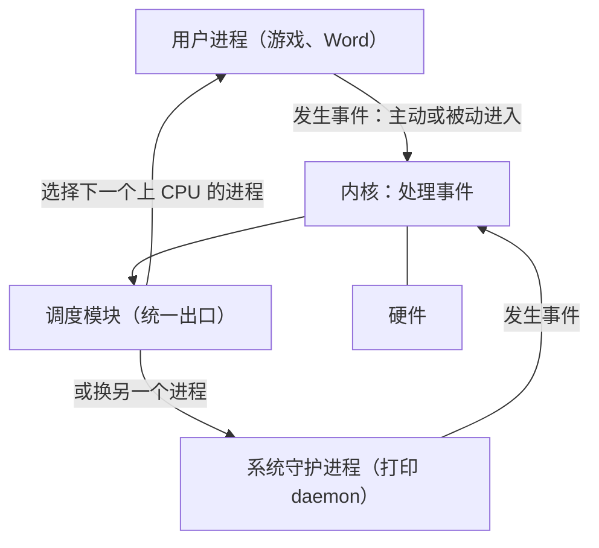

# 06 trap 机制总览

[本讲目录](../index.md) · [课程目录](../../index.md) · [上一节：05 卫星机与 SPOOLing 技术](05-satellite-machines-and-spooling.md) · [下一节：07 处理器特权模式](07-processor-modes-and-privileged-instructions.md)

> [!abstract] 本节要点
> - trap、中断、异常、陷入在不同教材中含义相近；本课按来源与性质把事件分为**中断**和**异常**，ICS 统称为**异常控制流**（ECF）。
> - trap 整体模型：硬件在下，内核在中，核外全是进程；进程因事件（主动或被动）进入内核，处理完统一经**调度模块**决定下一个上 CPU 的进程。
> - 学习抓手是**数据结构 + 流程**；流程有时间顺序，**先硬件后软件**，硬件做完交给软件，不会软硬交叉。
> - 操作系统初始化与中断的关联在于事先填好数据结构（如中断向量表）；软件异常对应 ICS 中的 signal。
> - 这一部分讲操作系统的两个接口：与硬件的接口（运行环境）和系统调用接口。

## 名词与定位

接下来的内容是 xv6 的 **trap 机制**，它也是实验的重要内容。操作系统中与硬件相关的部分名词特别多，不同的词常常指差不多的东西：xv6 叫 trap，本课叫中断/异常机制，ICS 叫**异常控制流**（ECF，Exceptional Control Flow），还有“陷入”等说法。遇到这类近义词，能对上意思即可。[^s3b5]

**控制流转移**在代码层面就有，例如 `if`、`while` 和函数调用。**异常控制流**说的是进程执行过程中发生了某些事件、使控制流发生改变；ICS 把这些事件统称为异常，再在异常中细分出中断。本课的划分方式不同：把它们分成**中断**和**异常**两件事，即来源不同、性质不同的事件，但本质是一致的。[^s3b6] ICS 强调这一部分很重要：理解 ECF，就能理解应用程序如何与操作系统交互、编写有趣的新应用程序、理解并发，以及理解软件异常如何工作。[^s2p5]

从操作系统设计者的角度看，操作系统夹在两个接口之间：下面是计算机硬件，上面是通过**系统功能调用**使用它的应用程序。[^s2p6] 这一部分先讲**硬件接口**，即操作系统设计者需要了解的硬件环境，再讲**系统调用接口**；两个接口讲完，整个操作系统就能运行起来。所以它承上启下：上承计算机组成原理给出的硬件设计，下接操作系统如何利用这些设计实现自己的功能。[^s3b6]

这一部分的大纲是：[^s2p6]

- **运行环境**：处理器及寄存器、中断机制、存储系统、I/O 系统、时钟；
- **运行机制**：系统调用；
- **重要设计思想**：机制与策略。

本讲只讲到处理器及寄存器（见[处理器特权模式](07-processor-modes-and-privileged-instructions.md)）和中断机制的开头（见[中断与异常概念](08-interrupt-mechanism-concepts-and-classification.md)）；中断处理流程和系统调用见 L03「03 中断处理完整流程」与「06 系统调用机制设计」。

## trap 整体模型

在讲细节之前，先建立一个整体图景，后面所有内容都放在这张图里理解。[^s3b5]

1. **底层是硬件**，其上是**内核**，内核是课程的重点。
2. **核外全是进程**，进程不断地创建和结束。它们分两类：
   - 用户创建的进程，例如游戏、Word；
   - 操作系统为帮助用户而创建的进程，例如打印守护进程，平时睡眠，有打印任务时起来工作。它们也在核外运行。
3. **进程进入内核，一定是因为发生了需要处理的事件**。不管是主动进入（如调用系统服务）还是被动进入（如按下 Ctrl+C），都要“兵来将挡”地处理。
4. **处理完统一走一个出口**：先到**调度模块**（调度接口），由它决定下一个上 CPU 的进程。调度模块选谁，就运行谁。

为什么要统一出口？因为系统中不能有不确定因素：进入内核走哪条路、处理完回到哪里，都必须事先规定好。[^s3b5]

> [!warning] 易错点
> “处理完事件就回到原程序”不完整。按这个模型，处理完先到调度模块，可能继续原进程，也可能换别的进程；原进程之后仍会回来继续执行。详见[中断与异常概念](08-interrupt-mechanism-concepts-and-classification.md)。

## 学习问题与考试重点

下面三组问题指出了这部分需要掌握的方向。

**问题 1（中断/异常的整体理解）**：[^s2p2]

- 应用程序是如何与操作系统交互的？
- 怎样理解“操作系统是由中断/异常/事件驱动的”？
- 中断/异常的来源有什么不同？处理方式一样吗？（回顾 ICS 对异常的描述及分类）
- 中断/异常处理流程中，哪些工作由硬件（体系结构）负责，哪些由软件（操作系统）负责？
- 从中断响应（硬件）到中断处理程序（软件）执行结束，计算机系统经过了哪些流程？
- 操作系统初始化与中断/异常有哪些关联？
- 什么是软件异常？它是如何工作的？

**问题 2（硬件）**：x86 和 RISC-V 各有哪些控制和状态寄存器、起什么作用；x86 在 Pentium II 之后为什么提供 `sysenter`/`sysexit`、与 `int 0x80`/`iret` 有何不同，x86-64 的系统调用指令是什么；RISC-V 的陷入指令是什么；两种体系结构各有几种处理器模式，模式之间是什么关系。[^s2p3]

**问题 3（系统调用）**：基于 x86 的 Linux 中，系统调用入口程序 `system_call()` 与中断描述符表、系统调用表分别是什么关系，系统调用结束后处理器转去执行哪个模块；系统调用与函数/过程调用、与 C 函数调用的区别，以及系统调用与 API 的关系。[^s2p4] 这组问题在 L03「05 系统调用概念辨析」至「07 Linux 系统调用执行」中展开。

期中、期末考的都是核心问题，例如应用程序怎样和操作系统打交道、怎样理解操作系统由中断/异常事件驱动；题目不一定是原话。中断与异常来源不同，但处理方式有很多共性。问题 1 中前面几问都是为最后两问做准备：硬件和软件各负责什么，以及从中断响应到处理程序结束经历哪些流程。[^s3b5]

> [!tip] 课堂强调
> 中断/异常处理中硬件与软件的分工、从中断响应到处理程序结束的完整流程，这个重点“年年都考”，而很多同学并没有真正理解。[^s3b5]

## 数据结构与流程：先硬件后软件

学习操作系统要抓住两样东西。

**第一是数据结构**。操作系统的算法相对简单，ICS 中动态内存分配那一类算法就算复杂的了；调度算法说复杂也复杂，说简单也简单。[^s3b5] 初始化与中断的联系也落在数据结构上：操作系统引导初始化时会把许多数据结构填好，其中就包括中断向量表，之后事件发生时硬件和软件都依靠这些表找到处理程序。**软件异常**就是 ICS 中学过的 signal 一类机制。[^s3b6]

**第二是流程**。操作系统是动态的，程序随时可能进入、离开内核，处理过程不是一步完成的，而流程一定有时间顺序（就像去一个地方旅游，先要买票到达，才能谈别的）。其中最重要的分工是：[^s3b6]

1. **硬件先做前半部分**：硬件是死板的，按固定步骤执行，没有“智能”。
2. **硬件做完，把控制权交给软件**。
3. **软件做后半部分**：由操作系统的处理程序完成。

不存在“硬件做一步、软件做一步、硬件再做一步”的软硬交叉。由软件直接控制设备的情况除外，但中断/异常机制本身一定是先硬件、后软件。

> [!tip] 课堂强调
> “先硬件后软件”这一原则今后答题时都要遵守：分清哪些步骤是硬件做的、哪些是软件做的，不要把两者交叉着写。[^s3b6]

硬件部分要把 x86 和 RISC-V 两套对照着学，对照有时比只学一套更清楚。操作系统层面的重点不是通用寄存器，而是：**控制和状态寄存器**（操作系统要读取和设置）、让用户态进程陷入内核态的**陷入指令**，以及**处理器模式**（操作系统只用内核态和用户态，但要知道硬件实际提供了什么）。[^s3b6] 这些内容在[处理器特权模式](07-processor-modes-and-privileged-instructions.md)中展开。

> [!question]- 自测：用户在终端按下 Ctrl+C，按 trap 整体模型，从事件发生到某个进程重新上 CPU 依次经过哪几个环节？
> 进程（被动地）因事件进入内核 → 内核处理该事件 → 统一到调度模块 → 调度模块选出下一个上 CPU 的进程（可能是原进程，也可能是别的进程）。路径是事先规定好的，不存在别的出口。

> [!question]- 自测：有同学这样描述中断处理：“硬件保存部分现场，软件判断类型，硬件再跳转到处理程序，软件处理后返回。”问题出在哪里？
> 违反了“先硬件后软件”：硬件做完自己那部分（包括把控制权交给处理程序）之后才轮到软件，不会出现软件做完一步再交回硬件继续响应的交叉过程。

> [!info]- 来源
> - slides02.pdf：PDF p.2–6
> - L02.docx：DOCX body 106–170

[^s3b5]: L02.docx-DOCX body 106-145
[^s3b6]: L02.docx-DOCX body 146-170
[^s2p5]: slides02.pdf-PDF p.5
[^s2p6]: slides02.pdf-PDF p.6
[^s2p2]: slides02.pdf-PDF p.2
[^s2p3]: slides02.pdf-PDF p.3
[^s2p4]: slides02.pdf-PDF p.4

[本讲目录](../index.md) · [课程目录](../../index.md) · [上一节：05 卫星机与 SPOOLing 技术](05-satellite-machines-and-spooling.md) · [下一节：07 处理器特权模式](07-processor-modes-and-privileged-instructions.md)
